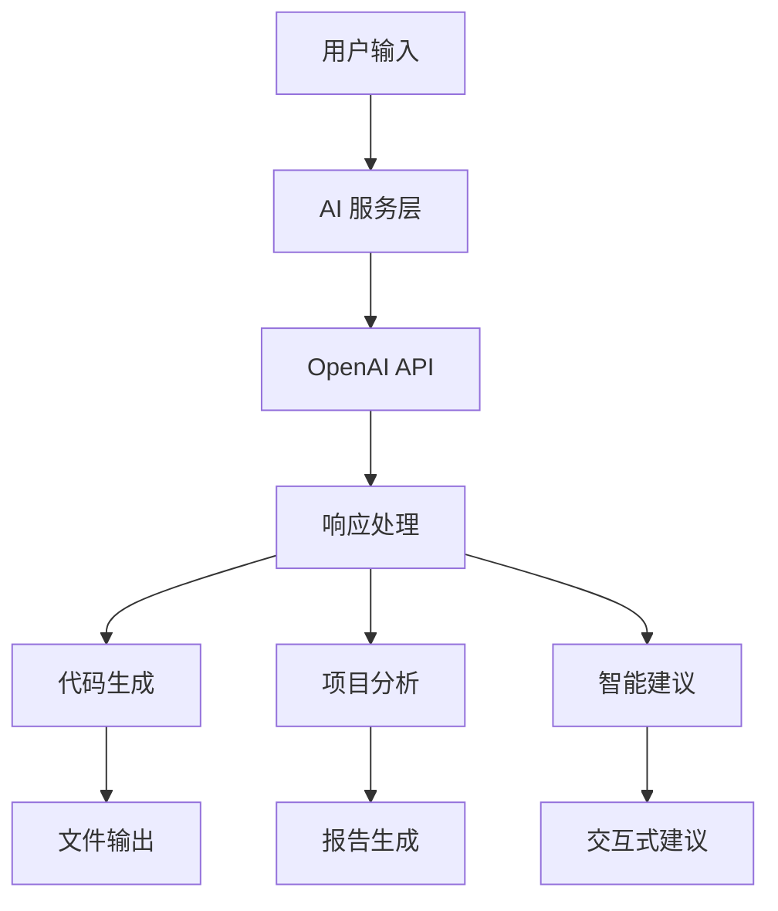

# Imber CLI AI 集成功能详解

## 概述

Imber CLI 的 AI 集成功能是其最具创新性的特性，通过深度集成 OpenAI API，实现了智能化的代码生成、项目分析和开发建议。本文将深入解析 AI 功能的实现原理、技术架构和最佳实践。

## AI 功能架构

### 整体架构图



### 核心组件

1. **AI 服务层**：封装 OpenAI API 调用
2. **提示词管理**：动态生成和优化提示词
3. **响应解析**：处理 AI 返回的结构化数据
4. **代码生成器**：将 AI 输出转换为实际代码
5. **上下文管理**：维护项目上下文信息

## 实现详解

### 1. AI 服务层设计

```typescript
// packages/generate/src/ai-service.ts
import OpenAI from 'openai'

export interface AIServiceConfig {
  apiKey: string
  baseUrl?: string
  model: string
  temperature: number
  maxTokens: number
}

export class AIService {
  private client: OpenAI
  private config: AIServiceConfig

  constructor(config: AIServiceConfig) {
    this.config = config
    this.client = new OpenAI({
      apiKey: config.apiKey,
      baseURL: config.baseUrl || 'https://api.openai.com/v1'
    })
  }

  async generateComponent(description: string, context: ProjectContext): Promise<AIResponse> {
    const prompt = this.buildComponentPrompt(description, context)

    try {
      const response = await this.client.chat.completions.create({
        model: this.config.model,
        messages: [
          { role: 'system', content: this.getSystemPrompt() },
          { role: 'user', content: prompt }
        ],
        temperature: this.config.temperature,
        max_tokens: this.config.maxTokens
      })

      return this.parseResponse(response.choices[0]?.message?.content || '')
    } catch (error) {
      throw new AIError('AI 生成失败', error)
    }
  }

  private buildComponentPrompt(description: string, context: ProjectContext): string {
    return `
请根据以下描述生成 React 组件：

组件描述：${description}

项目上下文：
- 框架：${context.framework}
- TypeScript：${context.typescript ? '是' : '否'}
- 样式方案：${context.styling}
- 状态管理：${context.stateManagement}
- 测试框架：${context.testing}

现有组件：
${context.existingComponents.map((comp) => `- ${comp.name}: ${comp.description}`).join('\n')}

请生成完整的组件代码，包括：
1. 组件定义和类型
2. 样式文件
3. 测试文件
4. 文档注释
    `.trim()
  }

  private getSystemPrompt(): string {
    return `你是一个专业的 React 开发工程师，具有以下特点：

1. 精通 React、TypeScript、现代前端开发
2. 遵循最佳实践和设计模式
3. 生成高质量、可维护的代码
4. 注重性能和用户体验
5. 编写清晰的注释和文档

请始终：
- 使用 TypeScript 进行类型安全
- 遵循 React Hooks 最佳实践
- 编写可测试的代码
- 提供完整的错误处理
- 使用语义化的命名
- 遵循无障碍访问标准`
  }

  private parseResponse(content: string): AIResponse {
    // 解析 AI 返回的 Markdown 格式内容
    const files = this.extractFiles(content)
    const suggestions = this.extractSuggestions(content)

    return {
      files,
      suggestions,
      metadata: {
        generatedAt: new Date().toISOString(),
        model: this.config.model,
        tokens: this.estimateTokens(content)
      }
    }
  }
}
```

### 2. 项目上下文管理

```typescript
// packages/generate/src/context-manager.ts
export interface ProjectContext {
  framework: 'react' | 'vue' | 'angular'
  typescript: boolean
  styling: 'css' | 'scss' | 'styled-components' | 'emotion' | 'tailwind'
  stateManagement: 'redux' | 'zustand' | 'context' | 'none'
  testing: 'jest' | 'vitest' | 'cypress' | 'none'
  existingComponents: ComponentInfo[]
  dependencies: string[]
  devDependencies: string[]
}

export class ContextManager {
  private context: ProjectContext

  constructor(projectPath: string) {
    this.context = this.analyzeProject(projectPath)
  }

  private analyzeProject(projectPath: string): ProjectContext {
    const packageJson = this.readPackageJson(projectPath)
    const tsConfig = this.readTsConfig(projectPath)
    const existingComponents = this.scanComponents(projectPath)

    return {
      framework: this.detectFramework(packageJson),
      typescript: this.detectTypeScript(tsConfig),
      styling: this.detectStyling(packageJson),
      stateManagement: this.detectStateManagement(packageJson),
      testing: this.detectTesting(packageJson),
      existingComponents,
      dependencies: packageJson.dependencies || {},
      devDependencies: packageJson.devDependencies || {}
    }
  }

  private detectFramework(packageJson: any): ProjectContext['framework'] {
    if (packageJson.dependencies?.react) return 'react'
    if (packageJson.dependencies?.vue) return 'vue'
    if (packageJson.dependencies?.['@angular/core']) return 'angular'
    return 'react' // 默认
  }

  private detectTypeScript(tsConfig: any): boolean {
    return !!tsConfig
  }

  private detectStyling(packageJson: any): ProjectContext['styling'] {
    if (packageJson.dependencies?.['styled-components']) return 'styled-components'
    if (packageJson.dependencies?.emotion) return 'emotion'
    if (packageJson.dependencies?.tailwindcss) return 'tailwind'
    if (packageJson.devDependencies?.sass) return 'scss'
    return 'css'
  }

  private scanComponents(projectPath: string): ComponentInfo[] {
    const components: ComponentInfo[] = []
    const srcPath = path.join(projectPath, 'src')

    if (fse.existsSync(srcPath)) {
      const files = glob.sync('**/*.{tsx,jsx,vue}', { cwd: srcPath })

      files.forEach((file) => {
        const content = fse.readFileSync(path.join(srcPath, file), 'utf-8')
        const componentInfo = this.extractComponentInfo(content, file)
        if (componentInfo) {
          components.push(componentInfo)
        }
      })
    }

    return components
  }
}
```

### 3. 智能提示词生成

```typescript
// packages/generate/src/prompt-builder.ts
export class PromptBuilder {
  static buildComponentPrompt(description: string, context: ProjectContext, options: GenerationOptions): string {
    const basePrompt = this.getBasePrompt(context)
    const specificPrompt = this.getSpecificPrompt(description, options)
    const contextPrompt = this.getContextPrompt(context)

    return `${basePrompt}

${specificPrompt}

${contextPrompt}

请按照以下格式输出：
## 组件名.tsx
\`\`\`typescript
// 组件代码
\`\`\`

## 组件名.module.css
\`\`\`css
/* 样式代码 */
\`\`\`

## 组件名.test.tsx
\`\`\`typescript
// 测试代码
\`\`\``
  }

  private static getBasePrompt(context: ProjectContext): string {
    const framework = context.framework === 'react' ? 'React' : 'Vue'
    const typescript = context.typescript ? 'TypeScript' : 'JavaScript'

    return `请生成一个${framework} ${typescript}组件，要求：
1. 使用函数式组件和 Hooks
2. 完整的 TypeScript 类型定义
3. 遵循现代前端最佳实践
4. 包含适当的错误处理
5. 编写清晰的注释和文档`
  }

  private static getSpecificPrompt(description: string, options: GenerationOptions): string {
    return `组件需求：${description}

特殊要求：
${options.includeTests ? '- 包含完整的单元测试' : ''}
${options.includeStorybook ? '- 包含 Storybook 故事' : ''}
${options.includeDocumentation ? '- 包含详细的文档注释' : ''}
${options.accessibility ? '- 遵循无障碍访问标准' : ''}`
  }

  private static getContextPrompt(context: ProjectContext): string {
    return `项目配置：
- 框架：${context.framework}
- TypeScript：${context.typescript ? '是' : '否'}
- 样式方案：${context.styling}
- 状态管理：${context.stateManagement}
- 测试框架：${context.testing}

现有组件：
${context.existingComponents.map((comp) => `- ${comp.name}: ${comp.description}`).join('\n')}`
  }
}
```

### 4. 响应解析与文件生成

````typescript
// packages/generate/src/response-parser.ts
export class ResponseParser {
  static parseMarkdownResponse(content: string): ParsedResponse {
    const files: GeneratedFile[] = []
    const suggestions: string[] = []

    // 使用正则表达式解析 Markdown
    const fileRegex = /##\s+(.+?)\n```(\w+)?\n([\s\S]*?)```/g
    let match

    while ((match = fileRegex.exec(content)) !== null) {
      const fileName = match[1].trim()
      const language = match[2] || 'typescript'
      const code = match[3].trim()

      files.push({
        fileName,
        language,
        content: code,
        type: this.determineFileType(fileName, language)
      })
    }

    // 提取建议
    const suggestionRegex = /💡\s*(.+)/g
    while ((match = suggestionRegex.exec(content)) !== null) {
      suggestions.push(match[1].trim())
    }

    return { files, suggestions }
  }

  private static determineFileType(fileName: string, language: string): FileType {
    if (fileName.includes('.test.') || fileName.includes('.spec.')) {
      return 'test'
    }
    if (fileName.includes('.stories.')) {
      return 'story'
    }
    if (language === 'css' || language === 'scss') {
      return 'style'
    }
    return 'component'
  }
}
````

### 5. 智能代码优化

```typescript
// packages/generate/src/code-optimizer.ts
export class CodeOptimizer {
  static optimizeGeneratedCode(code: string, context: ProjectContext): string {
    let optimizedCode = code

    // 1. 导入优化
    optimizedCode = this.optimizeImports(optimizedCode, context)

    // 2. 类型优化
    if (context.typescript) {
      optimizedCode = this.optimizeTypes(optimizedCode)
    }

    // 3. 性能优化
    optimizedCode = this.optimizePerformance(optimizedCode)

    // 4. 代码风格统一
    optimizedCode = this.unifyCodeStyle(optimizedCode, context)

    return optimizedCode
  }

  private static optimizeImports(code: string, context: ProjectContext): string {
    // 移除未使用的导入
    // 按字母顺序排序导入
    // 合并相同来源的导入
    return code
  }

  private static optimizeTypes(code: string): string {
    // 添加缺失的类型定义
    // 优化类型推断
    // 添加泛型约束
    return code
  }

  private static optimizePerformance(code: string): string {
    // 添加 React.memo 包装
    // 优化 useEffect 依赖
    // 添加 useCallback 和 useMemo
    return code
  }
}
```

## 高级功能

### 1. 智能项目分析

```typescript
// packages/generate/src/project-analyzer.ts
export class ProjectAnalyzer {
  async analyzeProject(projectPath: string): Promise<ProjectAnalysis> {
    const context = await this.contextManager.getContext(projectPath)
    const patterns = await this.detectPatterns(projectPath)
    const issues = await this.findIssues(projectPath)
    const suggestions = await this.generateSuggestions(context, patterns, issues)

    return {
      context,
      patterns,
      issues,
      suggestions,
      score: this.calculateScore(patterns, issues)
    }
  }

  private async detectPatterns(projectPath: string): Promise<Pattern[]> {
    const patterns: Pattern[] = []

    // 检测设计模式
    patterns.push(...(await this.detectDesignPatterns(projectPath)))

    // 检测架构模式
    patterns.push(...(await this.detectArchitecturePatterns(projectPath)))

    // 检测代码模式
    patterns.push(...(await this.detectCodePatterns(projectPath)))

    return patterns
  }

  private async generateSuggestions(
    context: ProjectContext,
    patterns: Pattern[],
    issues: Issue[]
  ): Promise<Suggestion[]> {
    const prompt = `
分析以下项目并提供改进建议：

项目上下文：${JSON.stringify(context, null, 2)}
检测到的模式：${patterns.map((p) => p.name).join(', ')}
发现的问题：${issues.map((i) => i.description).join(', ')}

请提供具体的改进建议，包括：
1. 架构优化建议
2. 性能优化建议
3. 代码质量改进
4. 最佳实践建议
    `

    const response = await this.aiService.generateSuggestions(prompt)
    return this.parseSuggestions(response)
  }
}
```

### 2. 智能测试生成

```typescript
// packages/generate/src/test-generator.ts
export class TestGenerator {
  async generateTests(componentPath: string, context: ProjectContext): Promise<TestFile[]> {
    const componentCode = fse.readFileSync(componentPath, 'utf-8')
    const componentInfo = this.extractComponentInfo(componentCode)

    const prompt = `
为以下 React 组件生成完整的测试用例：

组件代码：
\`\`\`typescript
${componentCode}
\`\`\`

测试要求：
1. 使用 ${context.testing} 测试框架
2. 覆盖所有主要功能
3. 包含边界情况测试
4. 包含用户交互测试
5. 包含可访问性测试

请生成：
- 单元测试文件
- 集成测试文件
- E2E 测试文件（如适用）
    `

    const response = await this.aiService.generateTests(prompt)
    return this.parseTestResponse(response)
  }
}
```

### 3. 智能文档生成

```typescript
// packages/generate/src/docs-generator.ts
export class DocsGenerator {
  async generateDocumentation(componentPath: string): Promise<Documentation> {
    const componentCode = fse.readFileSync(componentPath, 'utf-8')

    const prompt = `
为以下 React 组件生成完整的文档：

组件代码：
\`\`\`typescript
${componentCode}
\`\`\`

请生成：
1. 组件概述和用途
2. Props 详细说明
3. 使用示例
4. 最佳实践
5. 注意事项
6. 相关组件推荐
    `

    const response = await this.aiService.generateDocumentation(prompt)
    return this.parseDocumentationResponse(response)
  }
}
```

## 性能优化

### 1. 缓存机制

```typescript
// packages/generate/src/cache-manager.ts
export class CacheManager {
  private cacheDir: string

  constructor() {
    this.cacheDir = path.join(os.homedir(), '.imber-cli', 'cache')
    fse.ensureDirSync(this.cacheDir)
  }

  async getCachedResult(key: string): Promise<CachedResult | null> {
    const cacheFile = path.join(this.cacheDir, `${key}.json`)

    if (fse.existsSync(cacheFile)) {
      const cached = fse.readJSONSync(cacheFile)

      // 检查缓存是否过期（24小时）
      if (Date.now() - cached.timestamp < 24 * 60 * 60 * 1000) {
        return cached.data
      }
    }

    return null
  }

  async setCachedResult(key: string, data: any): Promise<void> {
    const cacheFile = path.join(this.cacheDir, `${key}.json`)

    fse.writeJSONSync(cacheFile, {
      data,
      timestamp: Date.now()
    })
  }
}
```

### 2. 并发控制

```typescript
// packages/generate/src/concurrency-manager.ts
export class ConcurrencyManager {
  private semaphore: Semaphore

  constructor(maxConcurrency: number = 3) {
    this.semaphore = new Semaphore(maxConcurrency)
  }

  async executeWithLimit<T>(fn: () => Promise<T>): Promise<T> {
    return this.semaphore.acquire().then(async (release) => {
      try {
        return await fn()
      } finally {
        release()
      }
    })
  }
}
```

## 错误处理与监控

### 1. 错误分类处理

```typescript
// packages/generate/src/error-handler.ts
export class ErrorHandler {
  static handleAIError(error: any): never {
    if (error.code === 'RATE_LIMIT_EXCEEDED') {
      throw new RateLimitError('API 调用频率超限，请稍后重试')
    }

    if (error.code === 'INVALID_API_KEY') {
      throw new AuthenticationError('API 密钥无效，请检查配置')
    }

    if (error.code === 'CONTENT_FILTERED') {
      throw new ContentFilterError('生成的内容被过滤，请调整描述')
    }

    throw new AIError('AI 服务异常', error)
  }
}
```

### 2. 使用监控

```typescript
// packages/generate/src/usage-monitor.ts
export class UsageMonitor {
  private usage: UsageStats

  constructor() {
    this.usage = this.loadUsageStats()
  }

  async trackUsage(operation: string, tokens: number): Promise<void> {
    this.usage.operations[operation] = (this.usage.operations[operation] || 0) + 1
    this.usage.totalTokens += tokens

    await this.saveUsageStats()

    // 检查使用限制
    if (this.usage.totalTokens > this.usage.limit) {
      throw new UsageLimitError('已达到使用限制')
    }
  }
}
```

## 总结

Imber CLI 的 AI 集成功能展现了人工智能在前端开发中的巨大潜力：

1. **智能化**：基于自然语言理解用户需求
2. **上下文感知**：分析项目结构，生成符合项目风格的代码
3. **质量保证**：自动优化代码质量和性能
4. **学习能力**：从项目历史中学习最佳实践
5. **扩展性**：支持多种框架和工具链

通过这种深度集成，开发者可以：

- 用自然语言描述需求，快速生成高质量代码
- 获得智能的项目分析和改进建议
- 自动生成测试和文档
- 学习最佳实践和设计模式

这代表了前端开发工具的未来发展方向，将大大提高开发效率和代码质量。
