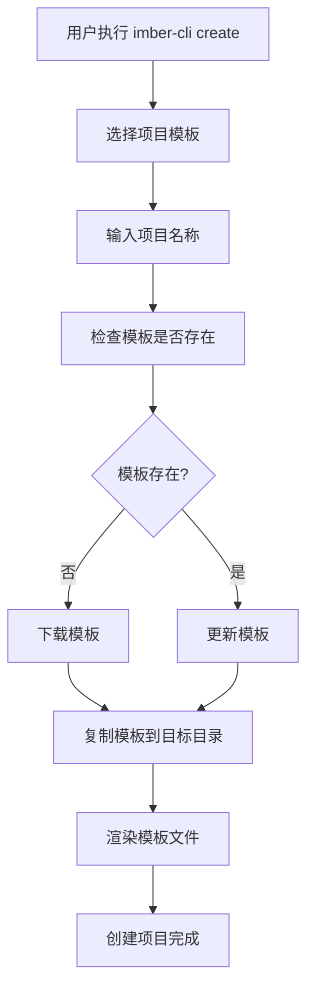

# Imber CLI Create 命令实现详解

## 概述

`create` 命令是 Imber CLI 的核心功能之一，负责创建新项目。它通过交互式界面引导用户选择项目模板，然后下载、渲染并创建项目结构。本文将深入解析 `create` 命令的实现原理和最佳实践。

## 核心架构

### 命令入口

```typescript
// packages/cli/src/index.ts
import create from '@imber-cli/create'

program
  .command('create')
  .description('创建项目')
  .action(async () => {
    create()
  })
```

### 主要流程



## 实现详解

### 1. 交互式界面设计

使用 `@inquirer/prompts` 实现用户友好的交互界面：

```typescript
import { select, input } from '@inquirer/prompts'

async function create() {
  // 选择项目模板
  const projectTemplate = await select({
    message: '请选择项目模板',
    choices: [
      {
        name: 'React 项目 (TypeScript + Vite)',
        value: '@imber-cli/template-react',
        description: '现代化的 React 开发环境'
      },
      {
        name: 'Vue 项目 (TypeScript + Vite)',
        value: '@imber-cli/template-vue',
        description: '现代化的 Vue 开发环境'
      }
    ]
  })

  // 输入项目名称
  let projectName = ''
  while (!projectName) {
    projectName = await input({
      message: '请输入项目名称',
      validate: (input) => {
        if (!input.trim()) {
          return '项目名称不能为空'
        }
        if (!/^[a-zA-Z][a-zA-Z0-9-_]*$/.test(input)) {
          return '项目名称只能包含字母、数字、连字符和下划线，且必须以字母开头'
        }
        return true
      }
    })
  }
}
```

**设计亮点：**

- **清晰的选项描述**：帮助用户理解每个模板的特点
- **输入验证**：确保项目名称符合 npm 包命名规范
- **循环验证**：直到用户输入有效值才继续

### 2. 模板包管理

通过 `NpmPackage` 类管理模板的下载、更新和缓存：

```typescript
import NpmPackage from '@imber-cli/utils'

// 创建包实例
const pkg = new NpmPackage({
  name: projectTemplate,
  targetPath: path.join(os.homedir(), '.imber-cli-template')
})

// 检查模板是否存在
if (!(await pkg.exists())) {
  const spinner = ora('下载模板中...').start()
  try {
    await pkg.install()
    spinner.succeed('下载模板成功')
  } catch (error) {
    spinner.fail('下载模板失败')
    console.error(error)
    process.exit(1)
  }
} else {
  const spinner = ora('更新模板中...').start()
  try {
    await pkg.update()
    spinner.succeed('更新模板成功')
  } catch (error) {
    spinner.fail('更新模板失败')
    console.error(error)
  }
}
```

**关键特性：**

- **本地缓存**：模板下载到用户主目录，避免重复下载
- **自动更新**：检查并更新到最新版本
- **错误处理**：完善的错误提示和异常处理
- **进度反馈**：使用 ora 提供友好的加载动画

### 3. 模板渲染机制

使用 EJS 模板引擎进行动态内容渲染：

```typescript
import ejs from 'ejs'
import glob from 'glob'

// 复制模板到目标目录
const targetPath = path.join(process.cwd(), projectName)
fse.copySync(templatePath, targetPath)

// 准备渲染数据
const renderData: Record<string, any> = {
  projectName,
  projectNameKebab: projectName
    .toLowerCase()
    .replace(/([A-Z])/g, '-$1')
    .replace(/^-/, ''),
  projectNamePascal: projectName.charAt(0).toUpperCase() + projectName.slice(1),
  author: process.env.USER || 'Developer',
  year: new Date().getFullYear()
}

// 获取所有需要渲染的文件
const files = await glob('**', {
  cwd: targetPath,
  nodir: true,
  ignore: ['node_modules/**', '.git/**']
})

// 渲染每个文件
for (const file of files) {
  const filePath = path.join(targetPath, file)

  try {
    // 读取文件内容
    const content = fse.readFileSync(filePath, 'utf-8')

    // 渲染模板
    const rendered = await ejs.render(content, renderData, {
      async: true
    })

    // 写回文件
    fse.writeFileSync(filePath, rendered)
  } catch (error) {
    console.warn(`渲染文件 ${file} 失败:`, error.message)
  }
}
```

**渲染数据包括：**

- `projectName`: 原始项目名称
- `projectNameKebab`: kebab-case 格式（用于文件名）
- `projectNamePascal`: PascalCase 格式（用于组件名）
- `author`: 当前用户
- `year`: 当前年份

### 4. 条件性文件生成

支持根据用户选择生成不同的文件结构：

```typescript
// 在模板中使用条件渲染
<% if (features.includes('typescript')) { %>
// 生成 TypeScript 配置文件
{
  "compilerOptions": {
    "target": "ES2020",
    "useDefineForClassFields": true,
    "lib": ["ES2020", "DOM", "DOM.Iterable"],
    "module": "ESNext",
    "skipLibCheck": true,
    "moduleResolution": "bundler",
    "allowImportingTsExtensions": true,
    "resolveJsonModule": true,
    "isolatedModules": true,
    "noEmit": true,
    "jsx": "react-jsx",
    "strict": true,
    "noUnusedLocals": true,
    "noUnusedParameters": true,
    "noFallthroughCasesInSwitch": true
  }
}
<% } %>
```

## 模板设计最佳实践

### 1. 目录结构设计

```
template/
├── src/
│   ├── components/
│   ├── pages/
│   ├── utils/
│   └── styles/
├── public/
├── package.json
├── tsconfig.json
├── vite.config.ts
├── .gitignore
└── README.md
```

### 2. 配置文件模板

**package.json 模板：**

```json
{
  "name": "<%= projectNameKebab %>",
  "version": "0.1.0",
  "private": true,
  "type": "module",
  "scripts": {
    "dev": "vite",
    "build": "tsc && vite build",
    "preview": "vite preview",
    "lint": "eslint . --ext ts,tsx --report-unused-disable-directives --max-warnings 0"
  },
  "dependencies": {
    "react": "^18.2.0",
    "react-dom": "^18.2.0"
  },
  "devDependencies": {
    "@types/react": "^18.2.43",
    "@types/react-dom": "^18.2.17",
    "@typescript-eslint/eslint-plugin": "^6.14.0",
    "@typescript-eslint/parser": "^6.14.0",
    "@vitejs/plugin-react": "^4.2.1",
    "eslint": "^8.55.0",
    "eslint-plugin-react-hooks": "^4.6.0",
    "eslint-plugin-react-refresh": "^0.4.5",
    "typescript": "^5.2.2",
    "vite": "^5.0.8"
  }
}
```

### 3. 代码模板示例

**React 组件模板：**

```typescript
// src/components/<%= projectNamePascal %>.tsx
import React from 'react'

interface <%= projectNamePascal %>Props {
  title?: string
  children?: React.ReactNode
}

const <%= projectNamePascal %>: React.FC<<%= projectNamePascal %>Props> = ({
  title = '<%= projectName %>',
  children
}) => {
  return (
    <div className="<%= projectNameKebab %>">
      <h1>{title}</h1>
      {children}
    </div>
  )
}

export default <%= projectNamePascal %>
```

## 错误处理与用户体验

### 1. 完善的错误处理

```typescript
async function create() {
  try {
    // 主要逻辑
  } catch (error) {
    console.error('创建项目失败:', error.message)

    // 清理已创建的文件
    if (fse.existsSync(targetPath)) {
      fse.removeSync(targetPath)
    }

    process.exit(1)
  }
}
```

### 2. 用户友好的提示

```typescript
// 成功创建后的提示
console.log(`
🎉 项目创建成功！

📁 项目路径: ${targetPath}
🚀 开始开发:
   cd ${projectName}
   npm install
   npm run dev

📚 更多信息请查看 README.md
`)
```

### 3. 进度反馈

```typescript
const steps = [
  { name: '选择模板', status: 'pending' },
  { name: '下载模板', status: 'pending' },
  { name: '复制文件', status: 'pending' },
  { name: '渲染模板', status: 'pending' },
  { name: '创建完成', status: 'pending' }
]

// 更新步骤状态
const updateStep = (index: number, status: 'pending' | 'running' | 'completed' | 'failed') => {
  steps[index].status = status
  // 显示进度
}
```

## 扩展性设计

### 1. 插件化架构

```typescript
interface CreatePlugin {
  name: string
  beforeCreate?: (context: CreateContext) => Promise<void>
  afterCreate?: (context: CreateContext) => Promise<void>
}

interface CreateContext {
  projectName: string
  templatePath: string
  targetPath: string
  renderData: Record<string, any>
}
```

### 2. 自定义模板支持

```typescript
// 支持本地模板
const localTemplate = await input({
  message: '是否使用本地模板？',
  type: 'confirm'
})

if (localTemplate) {
  const templatePath = await input({
    message: '请输入本地模板路径'
  })
  // 使用本地模板
}
```

## 性能优化

### 1. 并行处理

```typescript
// 并行下载多个依赖
const downloadPromises = dependencies.map((dep) => pkg.install(dep))

await Promise.all(downloadPromises)
```

### 2. 缓存策略

```typescript
// 检查模板版本
const cachedVersion = await getCachedVersion(templateName)
const latestVersion = await getLatestVersion(templateName)

if (cachedVersion === latestVersion) {
  console.log('使用缓存模板')
  return
}
```

## 总结

Imber CLI 的 `create` 命令展现了现代脚手架工具的最佳实践：

1. **用户体验优先**：交互式界面、进度反馈、错误处理
2. **模板系统**：灵活的模板渲染、条件性文件生成
3. **扩展性**：插件化架构、自定义模板支持
4. **性能优化**：本地缓存、并行处理
5. **代码质量**：TypeScript 类型安全、完善的错误处理

通过这种设计，开发者可以快速创建符合最佳实践的项目结构，大大提高了开发效率。
