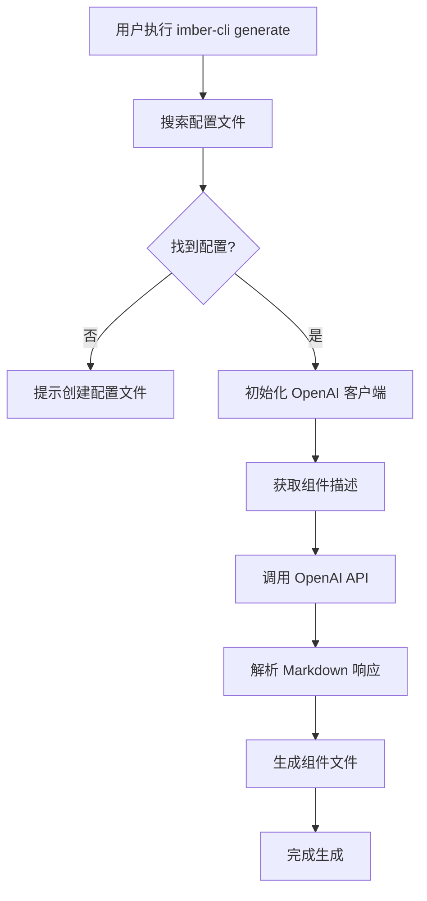

# Imber CLI Generate 命令实现详解

## 概述

`generate` 命令是 Imber CLI 的创新功能，基于 AI 技术实现智能组件生成。它通过 OpenAI API 分析用户需求，自动生成符合项目规范的 React/Vue 组件代码。本文将深入解析其实现原理和技术细节。

## 核心架构

### 命令入口

```typescript
// packages/cli/src/index.ts
import generate from '@imber-cli/generate'

program
  .command('generate')
  .description('生成组件（基于 AI）')
  .action(async () => {
    generate()
  })
```

### 主要流程



## 实现详解

### 1. 配置文件管理

使用 `cosmiconfig` 库实现灵活的配置管理：

```typescript
import { cosmiconfig } from 'cosmiconfig'

interface ConfigOptions {
  apiKey: string
  baseUrl?: string
  model?: string
  systemSetting: string
  outputDir?: string
  fileExtensions?: {
    component: string
    style: string
    test: string
  }
}

async function generate() {
  // 搜索配置文件
  const explorer = cosmiconfig('generate')
  const result = await explorer.search(process.cwd())

  if (!result?.config) {
    console.error('❌ 没找到配置文件 generate.config.js')
    console.log(`
请创建 generate.config.js 文件：

module.exports = {
  apiKey: 'your-openai-api-key',
  baseUrl: 'https://api.openai.com/v1', // 可选
  model: 'gpt-4', // 可选
  systemSetting: '你是一个专业的 React 组件开发工程师...',
  outputDir: './src/components', // 可选
  fileExtensions: {
    component: '.tsx',
    style: '.module.css',
    test: '.test.tsx'
  }
}
    `)
    process.exit(1)
  }

  const config: ConfigOptions = result.config
}
```

**配置文件示例：**

```javascript
// generate.config.js
module.exports = {
  apiKey: process.env.OPENAI_API_KEY,
  baseUrl: 'https://api.openai.com/v1',
  model: 'gpt-4',
  systemSetting: `你是一个专业的 React 组件开发工程师，请根据用户描述生成高质量的 React 组件代码。

要求：
1. 使用 TypeScript
2. 遵循 React 最佳实践
3. 包含完整的类型定义
4. 使用函数式组件和 Hooks
5. 包含适当的注释
6. 代码格式规范

输出格式：
请以 Markdown 格式输出，每个文件用 ## 文件名 作为标题，代码用 \`\`\`语言 包裹。`,
  outputDir: './src/components',
  fileExtensions: {
    component: '.tsx',
    style: '.module.css',
    test: '.test.tsx'
  }
}
```

### 2. OpenAI 客户端集成

```typescript
import OpenAI from 'openai'

// 初始化 OpenAI 客户端
const client = new OpenAI({
  apiKey: config.apiKey,
  baseURL: config.baseUrl || 'https://api.openai.com/v1'
})

// 获取组件描述
let componentDesc = ''
while (!componentDesc) {
  componentDesc = await input({
    message: '请描述要生成的组件',
    default: '生成一个 Table 组件，支持分页、排序、筛选功能',
    validate: (input) => {
      if (!input.trim()) {
        return '组件描述不能为空'
      }
      if (input.length < 10) {
        return '请提供更详细的组件描述'
      }
      return true
    }
  })
}
```

### 3. AI 代码生成

```typescript
// 调用 OpenAI API 生成组件代码
const spinner = ora('AI 正在生成组件代码...').start()

try {
  const response = await client.chat.completions.create({
    model: config.model || 'gpt-4',
    messages: [
      {
        role: 'system',
        content: config.systemSetting
      },
      {
        role: 'user',
        content: componentDesc
      }
    ],
    temperature: 0.7,
    max_tokens: 4000
  })

  const markdown = response.choices[0]?.message?.content || ''

  if (!markdown) {
    throw new Error('AI 没有返回任何内容')
  }

  spinner.succeed('AI 生成完成')

  // 解析并生成文件
  await parseAndGenerateFiles(markdown, config)
} catch (error) {
  spinner.fail('AI 生成失败')
  console.error('错误详情:', error.message)
  process.exit(1)
}
```

### 4. Markdown 解析与文件生成

使用 `remark` 解析 AI 返回的 Markdown 格式代码：

```typescript
import { remark } from 'remark'
import fse from 'fs-extra'
import path from 'node:path'

async function parseAndGenerateFiles(markdown: string, config: ConfigOptions) {
  const outputDir = config.outputDir || './src/components'

  // 确保输出目录存在
  fse.ensureDirSync(outputDir)

  let currentFileName = ''
  let currentContent = ''

  // 使用 remark 解析 Markdown
  await remark()
    .use(function () {
      return function (tree: any) {
        for (let i = 0; i < tree.children.length; i++) {
          const node = tree.children[i]

          // 处理标题（文件名）
          if (node.type === 'heading' && node.depth === 2) {
            // 保存上一个文件
            if (currentFileName && currentContent) {
              saveFile(currentFileName, currentContent, outputDir, config)
            }

            // 开始新文件
            currentFileName = node.children[0]?.value || ''
            currentContent = ''
          }
          // 处理代码块
          else if (node.type === 'code' && currentFileName) {
            const language = node.lang || ''
            const code = node.value || ''

            // 根据语言确定文件扩展名
            let extension = config.fileExtensions?.component || '.tsx'
            if (language.includes('css')) {
              extension = config.fileExtensions?.style || '.css'
            } else if (language.includes('test')) {
              extension = config.fileExtensions?.test || '.test.tsx'
            }

            // 构建完整文件名
            const fullFileName = currentFileName.endsWith(extension)
              ? currentFileName
              : `${currentFileName}${extension}`

            // 保存文件
            saveFile(fullFileName, code, outputDir, config)
          }
        }

        // 保存最后一个文件
        if (currentFileName && currentContent) {
          saveFile(currentFileName, currentContent, outputDir, config)
        }
      }
    })
    .process(markdown)
}

function saveFile(fileName: string, content: string, outputDir: string, config: ConfigOptions) {
  try {
    const filePath = path.join(outputDir, fileName)

    // 确保目录存在
    fse.ensureDirSync(path.dirname(filePath))

    // 写入文件
    fse.writeFileSync(filePath, content, 'utf-8')

    console.log(`✅ 文件创建成功: ${filePath}`)
  } catch (error) {
    console.warn(`⚠️  文件创建失败 ${fileName}:`, error.message)
  }
}
```

## 高级功能

### 1. 智能文件命名

```typescript
function generateFileName(componentName: string, type: 'component' | 'style' | 'test'): string {
  const kebabCase = componentName
    .replace(/([A-Z])/g, '-$1')
    .toLowerCase()
    .replace(/^-/, '')

  const extensions = {
    component: config.fileExtensions?.component || '.tsx',
    style: config.fileExtensions?.style || '.module.css',
    test: config.fileExtensions?.test || '.test.tsx'
  }

  return `${kebabCase}${extensions[type]}`
}
```

### 2. 代码质量检查

```typescript
import { ESLint } from 'eslint'

async function lintGeneratedCode(filePath: string) {
  try {
    const eslint = new ESLint({
      useEslintrc: false,
      baseConfig: {
        extends: ['@typescript-eslint/recommended'],
        parser: '@typescript-eslint/parser',
        rules: {
          '@typescript-eslint/no-unused-vars': 'error',
          'react-hooks/rules-of-hooks': 'error'
        }
      }
    })

    const results = await eslint.lintFiles([filePath])

    if (results.length > 0) {
      console.log(`🔍 代码检查结果: ${filePath}`)
      results.forEach((result) => {
        result.messages.forEach((message) => {
          console.log(`  ${message.severity === 2 ? '❌' : '⚠️'} ${message.message}`)
        })
      })
    }
  } catch (error) {
    console.warn('代码检查失败:', error.message)
  }
}
```

### 3. 模板变量替换

```typescript
function processTemplateVariables(content: string, componentName: string): string {
  const variables = {
    componentName,
    componentNameKebab: componentName
      .replace(/([A-Z])/g, '-$1')
      .toLowerCase()
      .replace(/^-/, ''),
    componentNamePascal: componentName.charAt(0).toUpperCase() + componentName.slice(1),
    author: process.env.USER || 'Developer',
    date: new Date().toISOString().split('T')[0]
  }

  return content.replace(/\{\{(\w+)\}\}/g, (match, key) => {
    return variables[key] || match
  })
}
```

## 错误处理与用户体验

### 1. 完善的错误处理

```typescript
async function generate() {
  try {
    // 主要逻辑
  } catch (error) {
    if (error.code === 'ENOENT') {
      console.error('❌ 配置文件不存在')
    } else if (error.code === 'INVALID_API_KEY') {
      console.error('❌ OpenAI API 密钥无效')
    } else if (error.code === 'RATE_LIMIT_EXCEEDED') {
      console.error('❌ API 调用频率超限，请稍后重试')
    } else {
      console.error('❌ 生成失败:', error.message)
    }

    process.exit(1)
  }
}
```

### 2. 进度反馈

```typescript
const steps = [
  { name: '加载配置', status: 'pending' },
  { name: '连接 AI', status: 'pending' },
  { name: '生成代码', status: 'pending' },
  { name: '解析文件', status: 'pending' },
  { name: '保存文件', status: 'pending' }
]

function updateStep(index: number, status: 'pending' | 'running' | 'completed' | 'failed') {
  steps[index].status = status

  // 显示进度
  console.log('\n📋 生成进度:')
  steps.forEach((step, i) => {
    const icon =
      step.status === 'completed' ? '✅' : step.status === 'running' ? '🔄' : step.status === 'failed' ? '❌' : '⏳'
    console.log(`  ${icon} ${step.name}`)
  })
}
```

### 3. 成功提示

```typescript
function showSuccessMessage(files: string[]) {
  console.log(`
🎉 组件生成成功！

📁 生成的文件:
${files.map((file) => `  ✅ ${file}`).join('\n')}

🚀 下一步:
  1. 检查生成的代码
  2. 根据需要调整代码
  3. 运行测试确保功能正常

💡 提示: 可以使用 imber-cli generate 继续生成更多组件
  `)
}
```

## 扩展功能

### 1. 批量生成

```typescript
async function batchGenerate(descriptions: string[]) {
  const results = []

  for (const desc of descriptions) {
    console.log(`\n🔄 生成组件: ${desc}`)
    const result = await generateSingleComponent(desc)
    results.push(result)
  }

  return results
}
```

### 2. 组件预览

```typescript
async function previewComponent(componentPath: string) {
  const content = fse.readFileSync(componentPath, 'utf-8')

  console.log('\n📄 组件预览:')
  console.log('─'.repeat(50))
  console.log(content)
  console.log('─'.repeat(50))
}
```

### 3. 智能建议

```typescript
async function suggestImprovements(componentCode: string) {
  const suggestions = await client.chat.completions.create({
    model: 'gpt-3.5-turbo',
    messages: [
      {
        role: 'system',
        content: '分析以下 React 组件代码，提供改进建议'
      },
      {
        role: 'user',
        content: componentCode
      }
    ]
  })

  return suggestions.choices[0]?.message?.content || ''
}
```

## 性能优化

### 1. 缓存机制

```typescript
import crypto from 'crypto'

function getCacheKey(description: string): string {
  return crypto.createHash('md5').update(description).digest('hex')
}

async function getCachedResult(key: string) {
  const cachePath = path.join(os.tmpdir(), 'imber-cli-cache', key)
  if (fse.existsSync(cachePath)) {
    return fse.readJSONSync(cachePath)
  }
  return null
}
```

### 2. 并发控制

```typescript
import pLimit from 'p-limit'

const limit = pLimit(3) // 最多同时处理 3 个请求

async function generateWithLimit(descriptions: string[]) {
  const promises = descriptions.map((desc) => limit(() => generateSingleComponent(desc)))

  return Promise.all(promises)
}
```

## 总结

Imber CLI 的 `generate` 命令展现了 AI 辅助开发的前沿实践：

1. **智能化**：基于 AI 的代码生成，理解自然语言需求
2. **灵活性**：支持多种文件类型和项目结构
3. **质量保证**：代码检查、格式规范、最佳实践
4. **用户体验**：友好的交互界面、进度反馈、错误处理
5. **扩展性**：插件化架构、批量处理、智能建议

通过这种设计，开发者可以用自然语言描述需求，快速生成高质量的组件代码，大大提高了开发效率。
