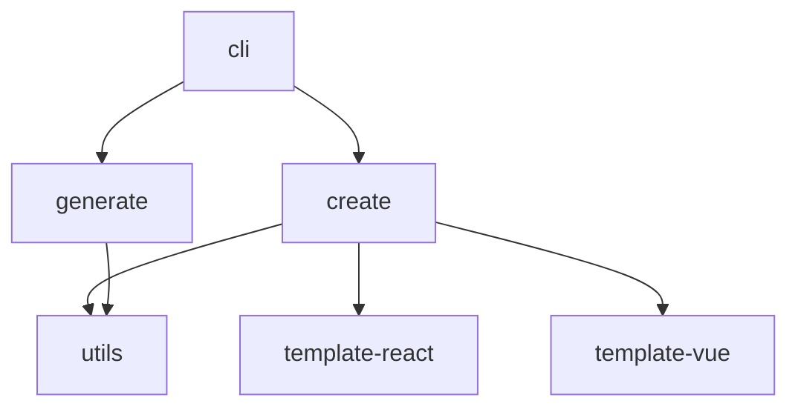

# Imber CLI Monorepo 架构设计与实现

## 项目概述

Imber CLI 是一个基于 Node.js 的脚手架工具，采用 monorepo 架构设计，旨在为开发者提供高效的项目创建和组件生成能力。该项目通过模块化的包管理方式，实现了代码复用、统一版本管理和简化发布流程。

## 架构设计

### 整体架构

Imber CLI 采用典型的 monorepo 架构，将功能拆分为多个独立的包：

```
imber-cli/
├── packages/
│   ├── cli/           # 主命令行工具
│   ├── create/        # 项目创建功能
│   ├── generate/      # AI 组件生成功能
│   ├── utils/         # 通用工具库
│   ├── template-react/ # React 项目模板
│   └── template-vue/   # Vue 项目模板
├── package.json
└── pnpm-workspace.yaml
```

### 包依赖关系



## 核心包详解

### 1. CLI 主包 (`@imber-cli/cli`)

作为整个工具的主入口，负责命令解析和分发：

```typescript
#!/usr/bin/env node
import create from '@imber-cli/create'
import generate from '@imber-cli/generate'
import { Command } from 'commander'
import fse from 'fs-extra'
import path from 'node:path'

// 读取package.json
const pkgJson = fse.readJSONSync(path.join(import.meta.dirname, '../package.json'))

// 创建命令
const program = new Command()

// 设置命令
program.name('imber-cli').description('脚手架 cli').version(pkgJson.version)

// 创建项目命令
program
  .command('create')
  .description('创建项目')
  .action(async () => {
    create()
  })

// 生成组件命令
program
  .command('generate')
  .description('生成组件（基于 AI）')
  .action(async () => {
    generate()
  })

// 解析命令
program.parse()
```

**关键特性：**

- 使用 `commander` 库进行命令行解析
- 支持 `create` 和 `generate` 两个主要命令
- 通过 `bin` 字段配置可执行文件

### 2. 项目创建包 (`@imber-cli/create`)

负责项目模板的下载、渲染和项目创建：

```typescript
async function create() {
  // 选择项目模板
  const projectTemplate = await select({
    message: '请选择项目模板',
    choices: [
      {
        name: 'react 项目',
        value: '@imber-cli/template-react'
      },
      {
        name: 'vue 项目',
        value: '@imber-cli/template-vue'
      }
    ]
  })

  // 输入项目名称
  let projectName = ''
  while (!projectName) {
    projectName = await input({
      message: '请输入项目名称'
    })
  }

  // 获取包实例对象
  const pkg = new NpmPackage({
    name: projectTemplate,
    targetPath: path.join(os.homedir(), '.imber-cli-template')
  })

  // 如果包不存在，则下载
  if (!(await pkg.exists())) {
    const spinner = ora('下载模版中...').start()
    await pkg.install()
    spinner.succeed('下载模版成功')
    spinner.stop()
  } else {
    const spinner = ora('更新模版中...').start()
    await pkg.update()
    spinner.succeed('更新模版成功')
    spinner.stop()
  }

  // 创建项目
  const spinner = ora('创建项目中...').start()
  const templatePath = path.join(pkg.npmFilePath, 'template')

  // 复制模版到目标目录
  fse.copySync(templatePath, targetPath)

  // 渲染数据
  const renderData: Record<string, any> = { projectName }

  // 获取文件
  const files = await glob('**', {
    cwd: targetPath,
    nodir: true,
    ignore: 'node_modules/**'
  })

  // 渲染模版
  for (let i = 0; i < files.length; i++) {
    const filePath = path.join(targetPath, files[i])
    const renderResult = await ejs.renderFile(filePath, renderData)
    fse.writeFileSync(filePath, renderResult)
  }

  console.log(`项目创建成功： ${targetPath}`)
}
```

**核心功能：**

- 交互式模板选择
- 动态包下载和缓存
- EJS 模板渲染
- 条件性文件生成

### 3. AI 组件生成包 (`@imber-cli/generate`)

基于 OpenAI API 的智能组件生成功能：

```typescript
async function generate() {
  // 搜索配置文件
  const explorer = cosmiconfig('generate')
  const result = await explorer.search(process.cwd())

  if (!result?.config) {
    console.error('没找到配置文件 generate.config.js')
    process.exit(1)
  }

  const config: ConfigOptions = result.config

  // 初始化 OpenAI 客户端
  const client = new OpenAI({
    apiKey: config.apiKey,
    baseURL: config.baseUrl
  })

  // 获取组件描述
  let componentDesc = ''
  while (!componentDesc) {
    componentDesc = await input({
      message: '组件描述',
      default: '生成一个 Table 的 React 组件，有包含 name、age、email 属性的 data 数组参数'
    })
  }

  // 调用 OpenAI API 生成组件代码
  const res = await client.chat.completions.create({
    model: 'gpt-5',
    messages: [
      { role: 'system', content: config.systemSetting },
      { role: 'user', content: componentDesc }
    ]
  })

  // 使用 remark 解析 Markdown 并生成文件
  await remark()
    .use(function (...args) {
      return function (tree: any) {
        let curPath = ''

        for (let i = 0; i < tree.children.length; i++) {
          const node = tree.children[i]

          if (node.type === 'heading') {
            curPath = path.join(componentDir, node.children[0].value)
          } else {
            try {
              fse.ensureFileSync(curPath)
              fse.writeFileSync(curPath, node.value)
              console.log('文件创建成功：', curPath)
            } catch (e) {
              // 忽略文件写入错误
            }
          }
        }
      }
    })
    .process(markdown)
}
```

**创新特性：**

- 基于 AI 的智能代码生成
- Markdown 格式的代码输出解析
- 配置文件驱动的生成规则

### 4. 工具库包 (`@imber-cli/utils`)

提供通用的工具函数和类：

```typescript
// 封装了 npminstall 安装逻辑
import NpmPackage from './NpmPackage.js'

// 封装了 npm 版本号获取逻辑
import * as versionUtils from './versionUtils.js'

export { NpmPackage, versionUtils }
```

**主要功能：**

- NPM 包管理（下载、更新、缓存）
- 版本号工具函数
- 通用工具方法

## Monorepo 管理策略

### 1. 包管理器选择

项目使用 `pnpm` 作为包管理器，通过 `pnpm-workspace.yaml` 配置工作空间：

```yaml
packages:
  - 'packages/*'
```

**优势：**

- 高效的依赖管理
- 严格的依赖隔离
- 支持工作空间协议

### 2. 版本管理

使用 `@changesets/cli` 进行版本管理：

```json
{
  "scripts": {
    "changeset": "changeset add",
    "version": "changeset version",
    "release": "pnpm build && changeset publish"
  }
}
```

**工作流程：**

1. 开发者使用 `changeset add` 记录变更
2. 使用 `changeset version` 更新版本号
3. 使用 `changeset publish` 发布包

### 3. 构建和开发

```json
{
  "scripts": {
    "build": "pnpm -r build",
    "dev": "pnpm -r dev"
  }
}
```

- `pnpm -r` 递归执行所有包的脚本
- 统一的构建和开发流程

## 包间依赖管理

### Workspace 协议

使用 `workspace:*` 协议管理内部依赖：

```json
{
  "dependencies": {
    "@imber-cli/create": "workspace:*",
    "@imber-cli/generate": "workspace:*"
  }
}
```

**优势：**

- 自动解析到本地包
- 避免版本冲突
- 简化开发流程

### 发布配置

每个包都有独立的发布配置：

```json
{
  "publishConfig": {
    "access": "public"
  }
}
```

## 开发最佳实践

### 1. 包设计原则

- **单一职责**：每个包只负责一个核心功能
- **最小依赖**：只引入必要的依赖
- **清晰接口**：提供简洁的 API 接口

### 2. 代码组织

- 使用 TypeScript 确保类型安全
- 统一的代码风格和格式化
- 完善的错误处理机制

### 3. 测试策略

- 单元测试覆盖核心功能
- 集成测试验证包间协作
- E2E 测试确保用户体验

## 部署和发布

### 1. 自动化发布

通过 GitHub Actions 实现自动化发布：

```yaml
name: Release
on:
  push:
    branches: [main]

jobs:
  release:
    runs-on: ubuntu-latest
    steps:
      - uses: actions/checkout@v3
      - uses: actions/setup-node@v3
        with:
          node-version: '18'
      - run: pnpm install
      - run: pnpm build
      - run: pnpm release
```

### 2. 版本策略

- 遵循语义化版本控制
- 主版本号：不兼容的 API 修改
- 次版本号：向下兼容的功能性新增
- 修订号：向下兼容的问题修正

## 总结

Imber CLI 的 monorepo 架构展现了现代前端工具链的最佳实践：

1. **模块化设计**：通过包拆分实现功能解耦
2. **统一管理**：使用 pnpm workspace 和 changesets 简化管理
3. **开发效率**：本地开发时自动链接，发布时独立版本控制
4. **扩展性**：新功能可以通过新增包的方式轻松扩展
5. **维护性**：清晰的包边界和依赖关系便于长期维护

这种架构不仅提高了开发效率，也为项目的长期发展奠定了坚实的基础。对于需要管理多个相关包的项目，monorepo 架构是一个值得考虑的选择。
