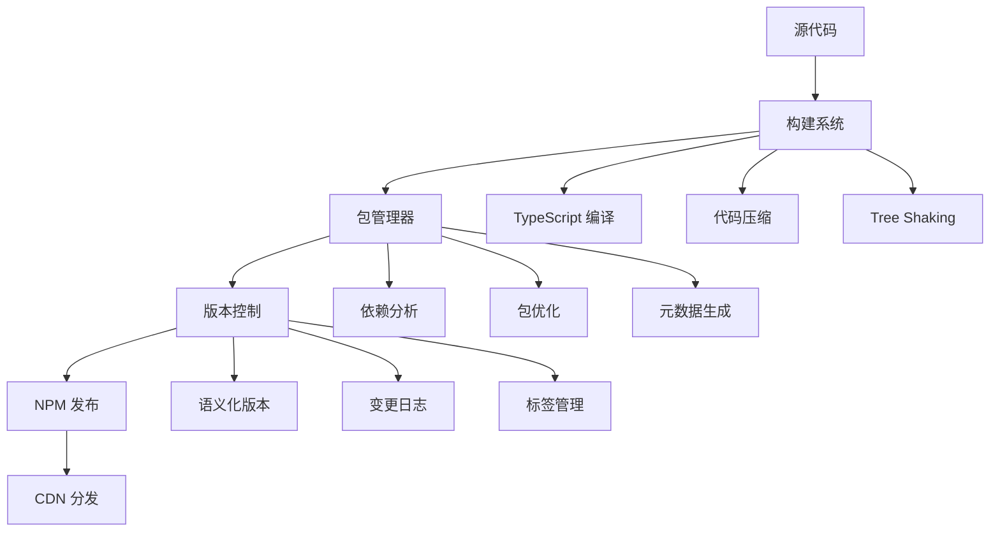

# Imber CLI 项目打包与发布 NPM 详解

## 概述

Imber CLI 的打包与发布系统是一个完整的 NPM 包管理解决方案，支持 monorepo 架构下的多包发布、版本管理、依赖优化和自动化部署。本文将深入解析其实现原理、最佳实践和高级功能。

## 打包系统架构

### 整体架构图



### 核心组件

1. **构建系统**：TypeScript 编译、代码优化、资源处理
2. **包管理器**：依赖分析、包结构生成、元数据管理
3. **版本控制**：语义化版本、变更记录、发布流程
4. **发布系统**：NPM 发布、CDN 同步、文档生成

## 构建系统实现

### 1. TypeScript 编译配置

```json
// tsconfig.build.json
{
  "extends": "./tsconfig.json",
  "compilerOptions": {
    "outDir": "./dist",
    "rootDir": "./src",
    "declaration": true,
    "declarationMap": true,
    "sourceMap": true,
    "removeComments": false,
    "importHelpers": true,
    "skipLibCheck": true
  },
  "include": ["src/**/*"],
  "exclude": ["**/*.test.ts", "**/*.spec.ts", "**/__tests__/**"]
}
```

### 2. 构建脚本

```typescript
// scripts/build.ts
import { execSync } from 'child_process'
import { readFileSync, writeFileSync } from 'fs'
import { join } from 'path'

interface BuildOptions {
  clean?: boolean
  watch?: boolean
  minify?: boolean
  sourcemap?: boolean
}

class BuildSystem {
  private options: BuildOptions

  constructor(options: BuildOptions = {}) {
    this.options = {
      clean: true,
      watch: false,
      minify: true,
      sourcemap: true,
      ...options
    }
  }

  async build(): Promise<void> {
    console.log('🚀 开始构建...')

    if (this.options.clean) {
      await this.clean()
    }

    await this.compileTypeScript()
    await this.processAssets()
    await this.generatePackageJson()
    await this.generateReadme()

    console.log('✅ 构建完成')
  }

  private async clean(): Promise<void> {
    console.log('🧹 清理构建目录...')
    execSync('rm -rf dist', { stdio: 'inherit' })
  }

  private async compileTypeScript(): Promise<void> {
    console.log('📝 编译 TypeScript...')

    const tscArgs = ['tsc', '--project tsconfig.build.json']

    if (this.options.watch) {
      tscArgs.push('--watch')
    }

    execSync(tscArgs.join(' '), { stdio: 'inherit' })
  }

  private async processAssets(): Promise<void> {
    console.log('📦 处理资源文件...')

    // 复制静态资源
    execSync('cp -r src/assets dist/', { stdio: 'inherit' })

    // 处理样式文件
    if (this.options.minify) {
      await this.minifyAssets()
    }
  }

  private async generatePackageJson(): Promise<void> {
    console.log('📋 生成 package.json...')

    const packageJson = JSON.parse(readFileSync('package.json', 'utf-8'))
    const buildPackageJson = {
      name: packageJson.name,
      version: packageJson.version,
      description: packageJson.description,
      main: './dist/index.js',
      module: './dist/index.esm.js',
      types: './dist/index.d.ts',
      files: ['dist/**/*'],
      exports: {
        '.': {
          import: './dist/index.esm.js',
          require: './dist/index.js',
          types: './dist/index.d.ts'
        },
        './package.json': './package.json'
      },
      scripts: {},
      dependencies: packageJson.dependencies,
      peerDependencies: packageJson.peerDependencies,
      keywords: packageJson.keywords,
      author: packageJson.author,
      license: packageJson.license,
      repository: packageJson.repository,
      bugs: packageJson.bugs,
      homepage: packageJson.homepage
    }

    writeFileSync('dist/package.json', JSON.stringify(buildPackageJson, null, 2))
  }

  private async generateReadme(): Promise<void> {
    console.log('📖 生成 README...')

    const readmeContent = this.generateReadmeContent()
    writeFileSync('dist/README.md', readmeContent)
  }

  private generateReadmeContent(): string {
    return `# ${this.getPackageName()}

## 安装

\`\`\`bash
npm install ${this.getPackageName()}
\`\`\`

## 使用

\`\`\`typescript
import { ${this.getMainExport()} } from '${this.getPackageName()}'
\`\`\`

## API 文档

详细文档请查看 [官方文档](${this.getHomepage()})

## 许可证

MIT
    `.trim()
  }
}

export default BuildSystem
```

### 3. 多包构建

```typescript
// scripts/build-monorepo.ts
import { execSync } from 'child_process'
import { readdirSync, statSync } from 'fs'
import { join } from 'path'

class MonorepoBuilder {
  private packages: string[] = []

  constructor() {
    this.packages = this.getPackages()
  }

  async buildAll(): Promise<void> {
    console.log('🏗️  构建 Monorepo...')

    for (const pkg of this.packages) {
      await this.buildPackage(pkg)
    }

    await this.buildRoot()
    console.log('✅ 所有包构建完成')
  }

  private async buildPackage(packageName: string): Promise<void> {
    console.log(`📦 构建包: ${packageName}`)

    const packagePath = join('packages', packageName)

    // 安装依赖
    execSync('pnpm install', { cwd: packagePath, stdio: 'inherit' })

    // 构建包
    execSync('pnpm build', { cwd: packagePath, stdio: 'inherit' })

    // 运行测试
    execSync('pnpm test', { cwd: packagePath, stdio: 'inherit' })
  }

  private async buildRoot(): Promise<void> {
    console.log('🏠 构建根包...')

    // 构建主包
    execSync('pnpm build', { stdio: 'inherit' })

    // 生成变更日志
    await this.generateChangelog()
  }

  private getPackages(): string[] {
    const packagesDir = 'packages'
    return readdirSync(packagesDir).filter((item) => statSync(join(packagesDir, item)).isDirectory())
  }
}

export default MonorepoBuilder
```

## 版本管理系统

### 1. 语义化版本控制

```typescript
// scripts/version-manager.ts
import { execSync } from 'child_process'
import { readFileSync, writeFileSync } from 'fs'
import semver from 'semver'

interface VersionInfo {
  current: string
  next: string
  type: 'major' | 'minor' | 'patch' | 'prerelease'
}

class VersionManager {
  async getCurrentVersion(): Promise<string> {
    const packageJson = JSON.parse(readFileSync('package.json', 'utf-8'))
    return packageJson.version
  }

  async getNextVersion(type: 'major' | 'minor' | 'patch' | 'prerelease'): Promise<string> {
    const current = await this.getCurrentVersion()
    return semver.inc(current, type) || current
  }

  async updateVersion(newVersion: string): Promise<void> {
    console.log(`📝 更新版本: ${newVersion}`)

    // 更新 package.json
    const packageJson = JSON.parse(readFileSync('package.json', 'utf-8'))
    packageJson.version = newVersion
    writeFileSync('package.json', JSON.stringify(packageJson, null, 2))

    // 更新所有子包
    await this.updateSubPackages(newVersion)
  }

  private async updateSubPackages(version: string): Promise<void> {
    const packages = this.getSubPackages()

    for (const pkg of packages) {
      const packageJsonPath = join('packages', pkg, 'package.json')
      const packageJson = JSON.parse(readFileSync(packageJsonPath, 'utf-8'))
      packageJson.version = version
      writeFileSync(packageJsonPath, JSON.stringify(packageJson, null, 2))
    }
  }

  private getSubPackages(): string[] {
    // 获取所有子包
    return []
  }
}

export default VersionManager
```

### 2. 变更日志生成

```typescript
// scripts/changelog-generator.ts
import { execSync } from 'child_process'
import { writeFileSync } from 'fs'

interface ChangelogEntry {
  type: 'feat' | 'fix' | 'docs' | 'style' | 'refactor' | 'test' | 'chore'
  scope?: string
  description: string
  breaking?: boolean
}

class ChangelogGenerator {
  async generateChangelog(): Promise<void> {
    console.log('📝 生成变更日志...')

    const commits = this.getCommits()
    const entries = this.parseCommits(commits)
    const changelog = this.formatChangelog(entries)

    writeFileSync('CHANGELOG.md', changelog)
  }

  private getCommits(): string[] {
    const output = execSync('git log --oneline', { encoding: 'utf-8' })
    return output.trim().split('\n')
  }

  private parseCommits(commits: string[]): ChangelogEntry[] {
    return commits.map((commit) => this.parseCommit(commit)).filter((entry) => entry !== null) as ChangelogEntry[]
  }

  private parseCommit(commit: string): ChangelogEntry | null {
    const match = commit.match(/^(\w+)(?:\(([^)]+)\))?: (.+)$/)

    if (!match) return null

    const [, type, scope, description] = match

    return {
      type: type as ChangelogEntry['type'],
      scope,
      description,
      breaking: description.includes('BREAKING CHANGE')
    }
  }

  private formatChangelog(entries: ChangelogEntry[]): string {
    const grouped = this.groupByType(entries)

    let changelog = '# 变更日志\n\n'

    for (const [type, items] of Object.entries(grouped)) {
      changelog += `## ${this.getTypeLabel(type)}\n\n`

      for (const item of items) {
        changelog += `- ${item.description}\n`
      }

      changelog += '\n'
    }

    return changelog
  }

  private groupByType(entries: ChangelogEntry[]): Record<string, ChangelogEntry[]> {
    return entries.reduce(
      (acc, entry) => {
        if (!acc[entry.type]) {
          acc[entry.type] = []
        }
        acc[entry.type].push(entry)
        return acc
      },
      {} as Record<string, ChangelogEntry[]>
    )
  }

  private getTypeLabel(type: string): string {
    const labels = {
      feat: '✨ 新功能',
      fix: '🐛 修复',
      docs: '📚 文档',
      style: '💄 样式',
      refactor: '♻️ 重构',
      test: '✅ 测试',
      chore: '🔧 构建'
    }

    return labels[type as keyof typeof labels] || type
  }
}

export default ChangelogGenerator
```

## 发布系统实现

### 1. NPM 发布

```typescript
// scripts/publisher.ts
import { execSync } from 'child_process'
import { readFileSync } from 'fs'
import { join } from 'path'

interface PublishOptions {
  dryRun?: boolean
  tag?: string
  access?: 'public' | 'restricted'
}

class NPMPublisher {
  async publish(options: PublishOptions = {}): Promise<void> {
    console.log('📦 发布到 NPM...')

    const packages = this.getPackagesToPublish()

    for (const pkg of packages) {
      await this.publishPackage(pkg, options)
    }
  }

  private async publishPackage(packageName: string, options: PublishOptions): Promise<void> {
    console.log(`📦 发布包: ${packageName}`)

    const packagePath = join('packages', packageName)
    const packageJson = JSON.parse(readFileSync(join(packagePath, 'package.json'), 'utf-8'))

    // 检查包是否已发布
    if (await this.isPackagePublished(packageName, packageJson.version)) {
      console.log(`⚠️  包 ${packageName}@${packageJson.version} 已存在，跳过发布`)
      return
    }

    // 发布包
    const publishArgs = ['npm', 'publish']

    if (options.dryRun) {
      publishArgs.push('--dry-run')
    }

    if (options.tag) {
      publishArgs.push('--tag', options.tag)
    }

    if (options.access) {
      publishArgs.push('--access', options.access)
    }

    execSync(publishArgs.join(' '), {
      cwd: packagePath,
      stdio: 'inherit'
    })

    console.log(`✅ 包 ${packageName}@${packageJson.version} 发布成功`)
  }

  private async isPackagePublished(packageName: string, version: string): Promise<boolean> {
    try {
      execSync(`npm view ${packageName}@${version} version`, { stdio: 'pipe' })
      return true
    } catch {
      return false
    }
  }

  private getPackagesToPublish(): string[] {
    // 获取需要发布的包列表
    return []
  }
}

export default NPMPublisher
```

### 2. 自动化发布流程

```typescript
// scripts/auto-publisher.ts
import { execSync } from 'child_process'
import { readFileSync } from 'fs'

class AutoPublisher {
  async publish(): Promise<void> {
    console.log('🚀 开始自动化发布流程...')

    // 1. 检查工作目录是否干净
    await this.checkWorkingDirectory()

    // 2. 运行测试
    await this.runTests()

    // 3. 构建项目
    await this.buildProject()

    // 4. 更新版本
    await this.updateVersion()

    // 5. 生成变更日志
    await this.generateChangelog()

    // 6. 提交更改
    await this.commitChanges()

    // 7. 创建标签
    await this.createTag()

    // 8. 推送到远程仓库
    await this.pushToRemote()

    // 9. 发布到 NPM
    await this.publishToNPM()

    console.log('✅ 自动化发布流程完成')
  }

  private async checkWorkingDirectory(): Promise<void> {
    console.log('🔍 检查工作目录...')

    const status = execSync('git status --porcelain', { encoding: 'utf-8' })

    if (status.trim()) {
      throw new Error('工作目录不干净，请先提交或暂存更改')
    }
  }

  private async runTests(): Promise<void> {
    console.log('🧪 运行测试...')

    execSync('pnpm test', { stdio: 'inherit' })
  }

  private async buildProject(): Promise<void> {
    console.log('🏗️  构建项目...')

    execSync('pnpm build', { stdio: 'inherit' })
  }

  private async updateVersion(): Promise<void> {
    console.log('📝 更新版本...')

    // 使用 changeset 更新版本
    execSync('pnpm changeset version', { stdio: 'inherit' })
  }

  private async generateChangelog(): Promise<void> {
    console.log('📋 生成变更日志...')

    execSync('pnpm changeset changelog', { stdio: 'inherit' })
  }

  private async commitChanges(): Promise<void> {
    console.log('💾 提交更改...')

    execSync('git add .', { stdio: 'inherit' })
    execSync('git commit -m "chore: release new version"', { stdio: 'inherit' })
  }

  private async createTag(): Promise<void> {
    console.log('🏷️  创建标签...')

    const version = this.getCurrentVersion()
    execSync(`git tag v${version}`, { stdio: 'inherit' })
  }

  private async pushToRemote(): Promise<void> {
    console.log('📤 推送到远程仓库...')

    execSync('git push origin main', { stdio: 'inherit' })
    execSync('git push origin --tags', { stdio: 'inherit' })
  }

  private async publishToNPM(): Promise<void> {
    console.log('📦 发布到 NPM...')

    execSync('pnpm changeset publish', { stdio: 'inherit' })
  }

  private getCurrentVersion(): string {
    const packageJson = JSON.parse(readFileSync('package.json', 'utf-8'))
    return packageJson.version
  }
}

export default AutoPublisher
```

## 高级功能

### 1. 依赖分析

```typescript
// scripts/dependency-analyzer.ts
import { execSync } from 'child_process'
import { readFileSync } from 'fs'
import { join } from 'path'

interface DependencyInfo {
  name: string
  version: string
  type: 'dependency' | 'devDependency' | 'peerDependency'
  size: number
  vulnerabilities: number
}

class DependencyAnalyzer {
  async analyzeDependencies(): Promise<DependencyInfo[]> {
    console.log('🔍 分析依赖...')

    const packages = this.getPackages()
    const dependencies: DependencyInfo[] = []

    for (const pkg of packages) {
      const packageDeps = await this.analyzePackage(pkg)
      dependencies.push(...packageDeps)
    }

    return this.deduplicateDependencies(dependencies)
  }

  private async analyzePackage(packageName: string): Promise<DependencyInfo[]> {
    const packagePath = join('packages', packageName)
    const packageJson = JSON.parse(readFileSync(join(packagePath, 'package.json'), 'utf-8'))

    const dependencies = [
      ...Object.entries(packageJson.dependencies || {}).map(([name, version]) => ({
        name,
        version: version as string,
        type: 'dependency' as const
      })),
      ...Object.entries(packageJson.devDependencies || {}).map(([name, version]) => ({
        name,
        version: version as string,
        type: 'devDependency' as const
      })),
      ...Object.entries(packageJson.peerDependencies || {}).map(([name, version]) => ({
        name,
        version: version as string,
        type: 'peerDependency' as const
      }))
    ]

    return Promise.all(dependencies.map((dep) => this.enrichDependencyInfo(dep)))
  }

  private async enrichDependencyInfo(dep: Omit<DependencyInfo, 'size' | 'vulnerabilities'>): Promise<DependencyInfo> {
    // 获取包大小
    const size = await this.getPackageSize(dep.name)

    // 检查安全漏洞
    const vulnerabilities = await this.checkVulnerabilities(dep.name)

    return {
      ...dep,
      size,
      vulnerabilities
    }
  }

  private async getPackageSize(packageName: string): Promise<number> {
    try {
      const output = execSync(`npm view ${packageName} size`, { encoding: 'utf-8' })
      return parseInt(output.trim()) || 0
    } catch {
      return 0
    }
  }

  private async checkVulnerabilities(packageName: string): Promise<number> {
    try {
      const output = execSync(`npm audit --json`, { encoding: 'utf-8' })
      const audit = JSON.parse(output)
      return audit.vulnerabilities?.total || 0
    } catch {
      return 0
    }
  }

  private getPackages(): string[] {
    // 获取所有包
    return []
  }

  private deduplicateDependencies(dependencies: DependencyInfo[]): DependencyInfo[] {
    const seen = new Set<string>()
    return dependencies.filter((dep) => {
      const key = `${dep.name}@${dep.version}`
      if (seen.has(key)) return false
      seen.add(key)
      return true
    })
  }
}

export default DependencyAnalyzer
```

### 2. 包大小优化

```typescript
// scripts/bundle-optimizer.ts
import { execSync } from 'child_process'
import { readFileSync, writeFileSync } from 'fs'

class BundleOptimizer {
  async optimizeBundle(): Promise<void> {
    console.log('📦 优化包大小...')

    await this.analyzeBundle()
    await this.optimizeDependencies()
    await this.treeShaking()
    await this.codeSplitting()
  }

  private async analyzeBundle(): Promise<void> {
    console.log('🔍 分析包大小...')

    // 使用 webpack-bundle-analyzer 分析包大小
    execSync('npx webpack-bundle-analyzer dist/stats.json', { stdio: 'inherit' })
  }

  private async optimizeDependencies(): Promise<void> {
    console.log('🔧 优化依赖...')

    // 检查未使用的依赖
    execSync('npx depcheck', { stdio: 'inherit' })

    // 更新依赖到最新版本
    execSync('npx npm-check-updates -u', { stdio: 'inherit' })
  }

  private async treeShaking(): Promise<void> {
    console.log('🌳 启用 Tree Shaking...')

    // 配置 webpack 启用 tree shaking
    const webpackConfig = {
      optimization: {
        usedExports: true,
        sideEffects: false
      }
    }
  }

  private async codeSplitting(): Promise<void> {
    console.log('✂️  代码分割...')

    // 配置动态导入
    const codeSplittingConfig = {
      optimization: {
        splitChunks: {
          chunks: 'all',
          cacheGroups: {
            vendor: {
              test: /[\\/]node_modules[\\/]/,
              name: 'vendors',
              chunks: 'all'
            }
          }
        }
      }
    }
  }
}

export default BundleOptimizer
```

## 部署配置

### 1. GitHub Actions 配置

```yaml
# .github/workflows/release.yml
name: Release

on:
  push:
    branches: [main]
  workflow_dispatch:

jobs:
  release:
    runs-on: ubuntu-latest
    steps:
      - name: Checkout
        uses: actions/checkout@v3
        with:
          fetch-depth: 0
          token: ${{ secrets.GITHUB_TOKEN }}

      - name: Setup Node.js
        uses: actions/setup-node@v3
        with:
          node-version: '18'
          registry-url: 'https://registry.npmjs.org'

      - name: Install pnpm
        uses: pnpm/action-setup@v2
        with:
          version: 8

      - name: Install dependencies
        run: pnpm install

      - name: Run tests
        run: pnpm test

      - name: Build packages
        run: pnpm build

      - name: Release
        run: pnpm changeset publish
        env:
          NODE_AUTH_TOKEN: ${{ secrets.NPM_TOKEN }}
```

### 2. 环境配置

```typescript
// scripts/env-config.ts
interface EnvironmentConfig {
  NODE_ENV: 'development' | 'production' | 'test'
  NPM_TOKEN: string
  GITHUB_TOKEN: string
  REGISTRY_URL: string
}

class EnvironmentConfig {
  static getConfig(): EnvironmentConfig {
    return {
      NODE_ENV: process.env.NODE_ENV as EnvironmentConfig['NODE_ENV'],
      NPM_TOKEN: process.env.NPM_TOKEN || '',
      GITHUB_TOKEN: process.env.GITHUB_TOKEN || '',
      REGISTRY_URL: process.env.REGISTRY_URL || 'https://registry.npmjs.org'
    }
  }

  static validateConfig(): void {
    const config = this.getConfig()

    if (!config.NPM_TOKEN) {
      throw new Error('NPM_TOKEN 环境变量未设置')
    }

    if (!config.GITHUB_TOKEN) {
      throw new Error('GITHUB_TOKEN 环境变量未设置')
    }
  }
}

export default EnvironmentConfig
```

## 最佳实践

### 1. 版本管理策略

```typescript
// 语义化版本控制
const versionStrategy = {
  major: '不兼容的 API 修改',
  minor: '向下兼容的功能性新增',
  patch: '向下兼容的问题修正',
  prerelease: '预发布版本'
}

// 版本号示例
const versionExamples = {
  '1.0.0': '初始版本',
  '1.0.1': '修复 bug',
  '1.1.0': '新增功能',
  '2.0.0': '重大更新',
  '1.0.0-beta.1': '预发布版本'
}
```

### 2. 发布流程

```typescript
// 发布检查清单
const releaseChecklist = [
  '✅ 所有测试通过',
  '✅ 代码质量检查通过',
  '✅ 文档更新完成',
  '✅ 版本号更新',
  '✅ 变更日志生成',
  '✅ 依赖关系检查',
  '✅ 安全漏洞扫描',
  '✅ 包大小优化'
]
```

### 3. 回滚策略

```typescript
// scripts/rollback.ts
class RollbackManager {
  async rollback(version: string): Promise<void> {
    console.log(`🔄 回滚到版本: ${version}`)

    // 1. 回滚代码
    execSync(`git checkout v${version}`, { stdio: 'inherit' })

    // 2. 重新构建
    execSync('pnpm build', { stdio: 'inherit' })

    // 3. 重新发布
    execSync('pnpm publish', { stdio: 'inherit' })

    console.log('✅ 回滚完成')
  }
}
```

## 总结

Imber CLI 的打包与发布系统提供了完整的 NPM 包管理解决方案：

1. **构建系统**：TypeScript 编译、代码优化、资源处理
2. **版本管理**：语义化版本、变更日志、自动化发布
3. **包管理**：依赖分析、大小优化、安全扫描
4. **自动化**：CI/CD 集成、环境配置、错误处理
5. **最佳实践**：发布流程、回滚策略、质量保证

通过这套系统，开发者可以：

- 自动化整个发布流程
- 确保代码质量和安全性
- 优化包大小和性能
- 管理复杂的依赖关系
- 实现可靠的版本控制

这为现代前端项目的包管理提供了完整的解决方案。
