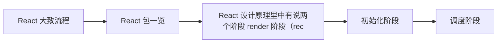

# React 源码（01） - React 源码流程预览

> 读完后，你应能完成以下任务：
> - 绘制“React 源码（01） - React 源码流程预览 / React 大致流程”的关键对象与数据流，解释“初始化阶段：初始化事件层，根 fiber 树 -> 调度阶段：scheduler 决定执行时机 -> 协调阶段：遍历 Fiber 树找到修改的节点打上标记（异步可中断） -> 提交阶段：根据标记渲染到页面（同步不可打断）”，并用源码位置、日志或 Trace 标注证据。
> - 为“React 源码（01） - React 源码流程预览 / React 包一览”设计正常与异常输入，验证“调度器负责任务的优先级管理和执行时机控制，让 React 不阻塞主线程来执行渲染工作”，输出首个偏差位置与回归测试结果。
> - 实现“React 源码（01） - React 源码流程预览 / react 包”的最小代码或配置，检验“提供了所有 React 组件/副作用/状态相关的基本API，没有提供渲染相关的代码，比如 Component，useEffect，useState”，输出命令、结果与 Diff，并说明不适用边界。

<!-- article-progressive-block:start -->
# 一、先建立全局：React 源码流程预览 是什么？

理解“React 源码流程预览”，先要把标题中的对象放进同一条处理链：它接收什么输入，经过哪些状态变化，最终用什么证据判断结果。下表不另造概念，只把作者正文已经解释的章节按依赖顺序连起来。

“React 源码流程预览”的第一个核心判断是：初始化阶段：初始化事件层，根 fiber 树 -> 调度阶段：scheduler 决定执行时机 -> 协调阶段：遍历 Fiber 树找到修改的节点打上标记（异步可中断） -> 提交阶段：根据标记渲染到页面（同步不可打断）。先弄清这个判断中的对象和输入输出，后面的实现、故障和验收才有共同语境。

| 顺序 | 章节 | 读完本节应抓住的结论 |
| --- | --- | --- |
| 1 | React 大致流程 | 初始化阶段：初始化事件层，根 fiber 树 -> 调度阶段：scheduler 决定执行时机 -> 协调阶段：遍历 Fiber 树找到修改的节点打上标记（异步可中断） -> 提交阶段：根据标记渲染到页面（同步不可打断） |
| 2 | React 包一览 | 调度器负责任务的优先级管理和执行时机控制，让 React 不阻塞主线程来执行渲染工作 |
| 3 | React 设计原理里中有说两个阶段 render 阶段（rec | React 设计原理里中有说两个阶段 render 阶段（reconciler 和 scheduler） 和 commit 阶段，所以我分为下面 4 个阶段来说 |
| 4 | 初始化阶段 | 初始化阶段：初始化事件层，根 fiber 树 |
| 5 | 调度阶段 | 调度阶段：scheduler 决定执行时机 |
| 6 | 协调阶段 | 协调阶段：遍历 Fiber 树找到修改的节点打上标记（异步可中断） |

## 1.1 核心对象之间怎样衔接



这张图只表达本文的讲解顺序，不替代正文机制。判断“React 源码流程预览”是否真正掌握，需要能从最后一个结果沿图回到前面每个章节的输入、状态变化和证据。

## 1.2 再看失败：问题最早会出现在哪一步？

在“React 源码流程预览”的对象和顺序已经明确后，再看可观察的失败：入口未命中、Lane 不符、更新丢失、重复提交或 DOM 结果不一致。定位时不从最后一条错误猜原因，而是沿上图找第一个偏离正文结论的节点。
<!-- article-progressive-block:end -->

# 二、React 大致流程

React 全流程大约有以下几步：

React 设计原理里中有说两个阶段 render 阶段（reconciler 和 scheduler） 和 commit 阶段，所以我分为下面 4 个阶段来说

1. 初始化阶段：初始化事件层，根 fiber 树
2. 调度阶段：scheduler 决定执行时机
3. 协调阶段：遍历 Fiber 树找到修改的节点打上标记（异步可中断）
4. 提交阶段：根据标记渲染到页面（同步不可打断）

# 三、React 包一览

```js
packages/
├── dom-event-testing-library/
├── eslint-plugin-react-hooks/
├── internal-test-utils/
├── jest-react/
├── react/
├── react-art/
├── react-cache/
├── react-client/
├── react-debug-tools/
├── react-devtools/
├── react-devtools-core/
├── react-devtools-extensions/
├── react-devtools-fusebox/
├── react-devtools-inline/
├── react-devtools-shared/
├── react-devtools-shell/
├── react-devtools-timeline/
├── react-dom/
├── react-dom-bindings/
├── react-is/
├── react-markup/
├── react-native-renderer/
├── react-noop-renderer/
├── react-reconciler/
├── react-refresh/
├── react-server/
├── react-server-dom-esm/
├── react-server-dom-fb/
├── react-server-dom-parcel/
├── react-server-dom-turbopack/
├── react-server-dom-webpack/
├── react-suspense-test-utils/
├── react-test-renderer/
├── scheduler/
├── shared/
├── use-subscription/
└── use-sync-external-store/
```

大约可以分为六大类：核心包、服务端渲染、渲染器、开发工具、工具包、试验性功能、绑定层；我们只需要关注核心包和渲染器

## 3.1 React 核心包

```js
├── react/
├── react-reconciler/
├── scheduler/
```

### react 包

提供了所有 React 组件/副作用/状态相关的基本API，没有提供渲染相关的代码，比如 Component，useEffect，useState


### react-reconciler 包

react 调和 fiber 用的，reconciler 会计算出 哪些 DOM 需要更新，然后交给 Commit，让浏览器渲染，比如 createContainer，updateContainer，batchedUpdates 一些更新相关的


### scheduler 包

调度器负责任务的优先级管理和执行时机控制，让 React 不阻塞主线程来执行渲染工作


## 3.2 渲染器相关

### react-dom 包

React 最常用的渲染器，负责将 React 组件渲染到浏览器 DOM 中。它包含了所有与浏览器 DOM 交互的代码，如事件系统、属性处理等。


<!-- article-progressive-block:start -->
# 四、动手验证：先跑通 React 源码流程预览，再改变一个变量

前面的章节已经建立问题、概念和机制。现在把“React 源码流程预览”放进同一套基线中运行；本节不再引入新术语，只验证前文结论能否被复现。

## 4.1 基线与候选只允许一个变量不同

验证“React 源码流程预览”时，先固定React 版本、组件输入、更新触发方式和浏览器事件。候选方案只能改变本次要验证的变量；如果同时更换数据、依赖和配置，即使结果改善，也不能知道是哪一项产生作用。

执行“React 源码流程预览”时，动作是：在对应源码入口设置断点，记录 Fiber、Lane、UpdateQueue 与提交阶段变化。原始结果不能只保留截图或汇总分数，必须同步保存：调用栈、Fiber 字段快照、Scheduler 任务、DOM 断言和源码行号，使下一次复查可以在同一输入上重放。

| 实验要素 | 本文要求 |
| --- | --- |
| 固定条件 | 固定 React 版本、组件输入、更新触发方式和浏览器事件 |
| 唯一变量 | 本次候选方案与基线之间的一项明确差异 |
| 原始证据 | 调用栈、Fiber 字段快照、Scheduler 任务、DOM 断言和源码行号 |
| 通过阈值 | 调用顺序与正文一致，状态变化能对应到最终 DOM 或副作用 |
| 立即停止 | 入口未命中、Lane 不符、更新丢失、重复提交或 DOM 结果不一致 |

## 4.2 执行前先排除不可比较条件

“React 源码流程预览”开始前先确认下面四项；任一项不成立，都应先修复实验条件，而不是解释结果。

- 基线能够在“React 源码流程预览”的当前环境重复运行。
- 候选只改变一个与“React 源码流程预览”结论直接相关的条件。
- “React 源码流程预览”的基线和候选使用同一批输入、同一版本依赖与同一通过阈值。
- “React 源码流程预览”的原始输出和失败现场不会被重试、格式化或汇总覆盖。

## 4.3 执行后先核对证据完整性

结果出来后先检查证据，再讨论“React 源码流程预览”是否通过。缺少中间状态时，最终输出只能说明现象，不能证明机制。

| 检查项 | 当前文章的判定 |
| --- | --- |
| 输入可追溯 | 固定 React 版本、组件输入、更新触发方式和浏览器事件 |
| 过程可回放 | 在对应源码入口设置断点，记录 Fiber、Lane、UpdateQueue 与提交阶段变化 |
| 结果可审计 | 调用栈、Fiber 字段快照、Scheduler 任务、DOM 断言和源码行号 |

“React 源码流程预览”的一次合格基线对照按以下顺序执行：

1. 保存“React 源码流程预览”基线版本及输入摘要，确认基线本身可以重复运行。
2. 写下“React 源码流程预览”候选方案唯一变化的变量，以及它预期影响的指标。
3. 在同一环境执行“React 源码流程预览”：在对应源码入口设置断点，记录 Fiber、Lane、UpdateQueue 与提交阶段变化。
4. 为“React 源码流程预览”保存：调用栈、Fiber 字段快照、Scheduler 任务、DOM 断言和源码行号。
5. 使用“React 源码流程预览”预登记条件判断：调用顺序与正文一致，状态变化能对应到最终 DOM 或副作用。
6. 如果“React 源码流程预览”未通过，不修改第二个变量，先恢复基线并保留失败现场。

# 五、用一张矩阵验证 React 源码流程预览 的关键结论

矩阵按正文顺序列出“React 源码流程预览”的结论。一次实验只选择一行，只改变这一行对应的条件；不要把多行合并成一个无法归因的大实验。

| 正文章节 | 已解释的结论 | 本轮唯一变量 | 必须保存的证据 |
| --- | --- | --- | --- |
| React 大致流程 | 初始化阶段：初始化事件层，根 fiber 树 -> 调度阶段：scheduler 决定执行时机 -> 协调阶段：遍历 Fiber 树找到修改的节点打上标记（异步可中断） -> 提交阶段：根据标记渲染到页面（同步不可打断） | 只改变与“React 大致流程”相关的条件 | 调用栈、Fiber 字段快照、Scheduler 任务、DOM 断言和源码行号 |
| React 包一览 | 调度器负责任务的优先级管理和执行时机控制，让 React 不阻塞主线程来执行渲染工作 | 只改变与“React 包一览”相关的条件 | 调用栈、Fiber 字段快照、Scheduler 任务、DOM 断言和源码行号 |
| React 设计原理里中有说两个阶段 render 阶段（rec | React 设计原理里中有说两个阶段 render 阶段（reconciler 和 scheduler） 和 commit 阶段，所以我分为下面 4 个阶段来说 | 只改变与“React 设计原理里中有说两个阶段 render 阶段（rec”相关的条件 | 调用栈、Fiber 字段快照、Scheduler 任务、DOM 断言和源码行号 |
| 初始化阶段 | 初始化阶段：初始化事件层，根 fiber 树 | 只改变与“初始化阶段”相关的条件 | 调用栈、Fiber 字段快照、Scheduler 任务、DOM 断言和源码行号 |
| 调度阶段 | 调度阶段：scheduler 决定执行时机 | 只改变与“调度阶段”相关的条件 | 调用栈、Fiber 字段快照、Scheduler 任务、DOM 断言和源码行号 |
| 协调阶段 | 协调阶段：遍历 Fiber 树找到修改的节点打上标记（异步可中断） | 只改变与“协调阶段”相关的条件 | 调用栈、Fiber 字段快照、Scheduler 任务、DOM 断言和源码行号 |

## 5.1 记录本次实际实验

下面的记录用于“React 源码流程预览”当前这一次实验，不是第二套知识目录。先从矩阵选择一个章节，再填写实际值；没有填写的字段表示尚未验证。

```yaml
topic: "React 源码流程预览"
selected_chapter: required
claim_from_article: required
baseline_version: required
changed_condition: exactly_one
execution: "在对应源码入口设置断点，记录 Fiber、Lane、UpdateQueue 与提交阶段变化"
evidence: "调用栈、Fiber 字段快照、Scheduler 任务、DOM 断言和源码行号"
pass_when: "调用顺序与正文一致，状态变化能对应到最终 DOM 或副作用"
stop_when: "入口未命中、Lane 不符、更新丢失、重复提交或 DOM 结果不一致"
observed_result: required
first_deviation: null_or_evidence
recovery_replay: required_after_failure
```

## 5.2 边界实验必须证明能够停止和恢复

成功路径只能证明“React 源码流程预览”在当前样本上工作，不能证明它可以进入生产。边界实验需要主动制造：入口未命中、Lane 不符、更新丢失、重复提交或 DOM 结果不一致，并观察系统是否在产生不可逆副作用前停止。

| 场景 | 只改变什么 | 应保存什么 | 通过标准 |
| --- | --- | --- | --- |
| 正常路径 | 使用已知有效输入 | 调用栈、Fiber 字段快照、Scheduler 任务、DOM 断言和源码行号 | 调用顺序与正文一致，状态变化能对应到最终 DOM 或副作用 |
| 边界路径 | 把一个输入推进到约束临界值 | 临界值前后的输出与指标 | 不静默降级，不把部分结果冒充成功 |
| 明确失败 | 注入：入口未命中、Lane 不符、更新丢失、重复提交或 DOM 结果不一致 | 原始错误、首个异常阶段和最终状态 | 失败被正确分类且没有扩大副作用 |
| 恢复重放 | 执行：从首个错误状态回查 Update 入队、调度、协调和提交边界 | 原失败样本的复测证据 | 原样本恢复，正常样本没有回归 |

恢复动作不是简单重启。对于“React 源码流程预览”，第一步是：从首个错误状态回查 Update 入队、调度、协调和提交边界。完成后使用原始失败样本复测；只验证一个新样本成功，不能证明触发条件已经消失。

“React 源码流程预览”边界实验结束后，应把正常、临界、失败和恢复四类记录放在同一个运行批次中。这样才能区分“候选方案真的修复问题”和“环境变化让问题暂时没有出现”。

# 六、React 源码流程预览 的结果解释

解释“React 源码流程预览”实验时先看首个偏差，而不是最后一条错误。最后的异常通常只是上游状态错误的结果；从末端反推容易误把症状当根因。

| 观察结果 | 可以支持的判断 | 下一步 |
| --- | --- | --- |
| 主链路没有达到预期 | 入口未命中、Lane 不符、更新丢失、重复提交或 DOM 结果不一致 | 先执行：从首个错误状态回查 Update 入队、调度、协调和提交边界 |
| 异常链路无法恢复 | 入口未命中、Lane 不符、更新丢失、重复提交或 DOM 结果不一致 | 先执行：从首个错误状态回查 Update 入队、调度、协调和提交边界 |
| 新样本成功但原样本仍失败 | 修复没有覆盖原始触发条件 | 固定原失败输入，恢复基线后重新比较 |
| 指标改善但证据无法回链 | 数据、版本或中间状态没有固定 | 暂停发布，补齐可追溯记录后重跑 |

“React 源码流程预览”只有同时满足“调用顺序与正文一致，状态变化能对应到最终 DOM 或副作用”，并且没有出现“入口未命中、Lane 不符、更新丢失、重复提交或 DOM 结果不一致”，才可以认为主链路通过。这里的“通过”只对当前固定版本、样本和环境有效，不能外推到尚未测试的容量、权限或数据分布。

如果“React 源码流程预览”候选方案与基线差异很小，先检查证据分辨率是否足够；如果差异很大，先排除数据泄漏、环境漂移和版本不一致。两种情况都不能只看一个汇总均值，需要回到逐样本输出和中间状态。

“React 源码流程预览”故障定位完成后，记录“现象、首个偏差、根因、改动、原样本复测”五项。缺少原样本复测时，只能标记为待观察，不能标记为已解决。

# 七、React 源码流程预览 的发布判断

发布判断需要把“React 源码流程预览”的质量、失败边界和恢复能力放在同一份记录中。以下任一条件缺失，都应停止扩量，而不是用“基本正常”替代证据。

- [ ] “React 源码流程预览”的基线与候选只存在一个计划内变量。
- [ ] “React 源码流程预览”的输入、代码、依赖、配置和数据版本可以追溯。
- [ ] “React 源码流程预览”的正常、临界、失败和恢复样本使用同一套断言。
- [ ] “React 源码流程预览”的原始输出、中间状态和失败现场已经保留。
- [ ] “React 源码流程预览”的日志、Trace、截图和测试数据已经脱敏。
- [ ] “React 源码流程预览”的停止条件、负责人和回滚入口已经演练。
- [ ] “React 源码流程预览”尚未覆盖的输入、权限、容量和外部依赖已经登记。

最终记录至少包含基线版本、唯一变量、原始证据、首个偏差、恢复复测和发布责任人。没有参与本次修改的人如果不能据此重放“React 源码流程预览”的判断，就不能发布。
<!-- article-progressive-block:end -->

# 八、总结

- **React 大致流程**：初始化阶段：初始化事件层，根 fiber 树 -> 调度阶段：scheduler 决定执行时机 -> 协调阶段：遍历 Fiber 树找到修改的节点打上标记（异步可中断） -> 提交阶段：根据标记渲染到页面（同步不可打断）
- **React 包一览**：调度器负责任务的优先级管理和执行时机控制，让 React 不阻塞主线程来执行渲染工作
- **React 核心包**：调度器负责任务的优先级管理和执行时机控制，让 React 不阻塞主线程来执行渲染工作
- **react 包**：提供了所有 React 组件/副作用/状态相关的基本API，没有提供渲染相关的代码，比如 Component，useEffect，useState
- **react-reconciler 包**：react 调和 fiber 用的，reconciler 会计算出 哪些 DOM 需要更新，然后交给 Commit，让浏览器渲染，比如 createContainer，updateContainer，batchedUpdates 一些更新相关的
- **scheduler 包**：调度器负责任务的优先级管理和执行时机控制，让 React 不阻塞主线程来执行渲染工作

## 参考资料

- [React 文档](https://react.dev/learn)
- [React 源码](https://github.com/facebook/react)
