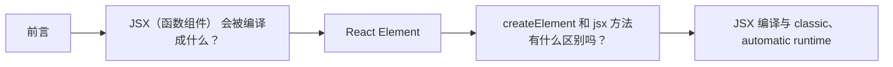

# React 源码（02） - JSX 和 ReactElement

> 读完后，你应能完成以下任务：
> - 绘制“React 源码（02） - JSX 和 ReactElement / 前言”的关键对象与数据流，解释“先固定这条边界，可以避免把编译期语法转换、运行时对象创建和后续渲染混成一个步骤。”，并用源码位置、日志或 Trace 标注证据。
> - 为“React 源码（02） - JSX 和 ReactElement / JSX（函数组件） 会被编译成什么？”设计正常与异常输入，验证“JSX 是 JavaScript 的语法扩展，”，输出首个偏差位置与回归测试结果。
> - 实现“React 源码（02） - JSX 和 ReactElement / React Element”的最小代码或配置，检验“React Element 是对“期望渲染什么”的不可变描述，”，输出命令、结果与 Diff，并说明不适用边界。

## 核心知识清单

- JSX 编译与 classic、automatic runtime
- React Element 的结构与职责边界
- createElement、jsx 与 jsxs 的差异

<!-- article-progressive-block:start -->
# 一、先建立全局：JSX 和 ReactElement 是什么？

理解“JSX 和 ReactElement”，先要把标题中的对象放进同一条处理链：它接收什么输入，经过哪些状态变化，最终用什么证据判断结果。下表不另造概念，只把作者正文已经解释的章节按依赖顺序连起来。

“JSX 和 ReactElement”的第一个核心判断是：先固定这条边界，可以避免把编译期语法转换、运行时对象创建和后续渲染混成一个步骤。。先弄清这个判断中的对象和输入输出，后面的实现、故障和验收才有共同语境。

| 顺序 | 章节 | 读完本节应抓住的结论 |
| --- | --- | --- |
| 1 | 前言 | 先固定这条边界，可以避免把编译期语法转换、运行时对象创建和后续渲染混成一个步骤。 |
| 2 | JSX（函数组件） 会被编译成什么？ | JSX 是 JavaScript 的语法扩展， |
| 3 | React Element | React Element 是对“期望渲染什么”的不可变描述， |
| 4 | createElement 和 jsx 方法有什么区别吗？ | 应用代码通常继续写 JSX，让构建工具选择 jsx 或 jsxs； |
| 5 | JSX 编译与 classic、automatic runtime | babel automatic 编译的代码（通过 @babel/plugin-transform-react-jsx 插件， |
| 6 | React Element 的结构与职责边界 | 两者都是构建 React Element 的入口，不会在这一阶段创建 DOM 或 Fiber。 |

## 1.1 核心对象之间怎样衔接



这张图只表达本文的讲解顺序，不替代正文机制。判断“JSX 和 ReactElement”是否真正掌握，需要能从最后一个结果沿图回到前面每个章节的输入、状态变化和证据。

## 1.2 再看失败：问题最早会出现在哪一步？

在“JSX 和 ReactElement”的对象和顺序已经明确后，再看可观察的失败：入口未命中、Lane 不符、更新丢失、重复提交或 DOM 结果不一致。定位时不从最后一条错误猜原因，而是沿上图找第一个偏离正文结论的节点。
<!-- article-progressive-block:end -->

# 二、前言

本章只追踪“JSX 源码如何变成 React Element”，
不进入 Fiber 调度和 DOM 提交。
先固定这条边界，可以避免把编译期语法转换、运行时对象创建和后续渲染混成一个步骤。

- 一些概念的问题，可以看卡颂大佬的 [React 技术揭秘](https://react.iamkasong.com/)
  ，永不过时
- 最精简的搞懂 React 核心逻辑，可以跟着国外一个大佬的博客写一遍，
[Build Your Own React](https://pomb.us/build-your-own-react/)
- 细看 React 源码的时候，可以比对下某位大佬的
[源码流程图](https://www.processon.com/view/link/63bcef8cf27176074bb81a21)
- [深入浅出 React 19 AI 视角下的源码解析与进阶](https://blog.xiguadev.com/)

# 三、JSX（函数组件） 会被编译成什么？

在分析 `ReactDOM.createRoot(document.getElementById('root'))` 之前，
需要先确认传给 `root.render` 的 JSX 如何变成普通 JavaScript。
JSX 是 JavaScript 的语法扩展，
Babel、SWC 等编译器会在构建阶段把它转换为函数调用；
浏览器和 React 运行时不会直接解析 JSX 源码。
转换结果可以在
[babel](https://www.babeljs.cn/repl#?browsers=defaults%2C%20not%20ie%2011%2C%20not%20ie_mob%2011&build=&builtIns=false&corejs=false&spec=false&loose=false&code_lz=GYVwdgxgLglg9mABAQQA6oBQEpEG8BQiiATgKZQjFIaFGIA8AJjAG6IQA2AhgM48ByXALakAvACI0qcQD5adBgAtSXRqWLtufQSIlSAtMtXrZANnP0A9EbXE5Cq8xb3EWfAF98-UgA9UcYihENWAuEA4gqXwgA&debug=false&forceAllTransforms=false&modules=false&shippedProposals=false&evaluate=false&fileSize=true&timeTravel=false&sourceType=module&lineWrap=true&presets=env%2Creact%2Cstage-2&prettier=true&targets=&version=7.28.4&externalPlugins=&assumptions=%7B%7D)
在线工具看

函数组件

```js
function App() {
  return (
    <div className="App">
      <header className="App-header">666</header>
    </div>
  )
}

export default App
```

babel classic 编译的代码

```js
function App() {
  return /*#__PURE__*/ React.createElement(
    "div",
    {
      className: "App"
    },
    /*#__PURE__*/ React.createElement(
      "header",
      {
        className: "App-header"
      },
      "666"
    )
  )
}
export default App
```

babel automatic 编译的代码（通过 @babel/plugin-transform-react-jsx 插件，
并配置 {
"runtime": "automatic" } ）

```js
import { jsx as _jsx } from "react/jsx-runtime"
function App() {
  return /*#__PURE__*/ _jsx("div", {
    className: "App",
    children: /*#__PURE__*/ _jsx("header", {
      className: "App-header",
      children: "666"
    })
  })
}
export default App
```

对于包含多个子元素的 JSX 如：

```js
const list = (
  <ul>
    <li>Item 1</li>
    <li>Item 2</li>
  </ul>
)
```

它会被编译为 jsxs 函数调用，以优化静态子元素的性能：

```js
import { jsxs } from "react/jsx-runtime"

const list = jsxs("ul", {
  children: [jsx("li", { children: "Item 1" }), jsx("li", { children: "Item 2" })]
})
```

这也解释了一个常见问题：React 17 并不是无条件地“不需要引入 React”，
而是新版工具链可以启用 automatic runtime。
classic runtime 生成 `React.createElement`，
因此当前模块必须让 `React` 标识符可用；
automatic runtime 会由编译器自动从 `react/jsx-runtime` 注入 `jsx` 或 `jsxs`，
仅使用 JSX 时才不需要为了编译结果手动导入 `React`。

`jsx` 用于单个或动态子节点，`jsxs` 用于编译器已经知道存在多个静态子节点的场景。
两者都是构建 React Element 的入口，不会在这一阶段创建 DOM 或 Fiber。

# 四、React Element

一个典型的 React Element 对象结构如下：

```js
{
  $$typeof: Symbol.for('react.element'), // 唯一标识，防止 XSS 攻击
  type: 'h1', // 元素类型：字符串（DOM 标签）或函数/类（组件）
  key: null, // 用于列表渲染的唯一标识
  ref: null, // 用于获取 DOM 实例或组件实例的引用
  props: { // 元素的属性，包括 children
    className: 'greeting',
    children: 'Hello, world!'
  },
  _owner: null, // 内部属性，指向创建该 Element 的 Fiber
  _store: {}, // 内部属性，用于开发模式下的检查
  // ... 其他内部属性，如 _source, _self 等，主要用于开发模式和调试
}
```

React Element 是对“期望渲染什么”的不可变描述，
不是 DOM 节点，
也不是 Fiber 工作单元。
`type` 决定宿主标签或组件类型，
`key` 帮助同级列表协调，
`ref` 保存实例引用意图，
`props` 携带属性和子元素；
Reconciler 后续才会根据 Element 创建或复用 Fiber。

`$$typeof` 是 React 用来识别 Element 类型的标记，
可以避免普通 JSON 被直接当作 Element 使用。
开发模式下的 `_owner`、`_store` 等字段用于警告和调试，
业务代码不应依赖这些内部字段。

# 五、createElement 和 jsx 方法有什么区别吗？

它们的入参结构不同：`createElement(type,
config,
...children)` 接收可变数量的子元素，
`jsx(type,
config,
maybeKey)` 与 `jsxs(type,
config,
maybeKey)` 则接收编译器已经整理好的 `props`。
两条路径最终都会构造同一种 React Element；
差异主要在调用约定、开发期校验和编译器可做的静态优化，
不应据此断言某个 API 在所有场景都“性能更好”。


应用代码通常继续写 JSX，让构建工具选择 `jsx` 或 `jsxs`；
只有在没有 JSX 编译步骤、动态创建元素或兼容旧代码时才直接调用 `createElement`。
验收这部分知识时，应比较编译后的调用和最终 Element 字段，而不是只记 API 名称。

<!-- article-progressive-block:start -->
# 六、动手验证：先跑通 JSX 和 ReactElement，再改变一个变量

前面的章节已经建立问题、概念和机制。现在把“JSX 和 ReactElement”放进同一套基线中运行；本节不再引入新术语，只验证前文结论能否被复现。

## 6.1 基线与候选只允许一个变量不同

验证“JSX 和 ReactElement”时，先固定React 版本、组件输入、更新触发方式和浏览器事件。候选方案只能改变本次要验证的变量；如果同时更换数据、依赖和配置，即使结果改善，也不能知道是哪一项产生作用。

执行“JSX 和 ReactElement”时，动作是：在对应源码入口设置断点，记录 Fiber、Lane、UpdateQueue 与提交阶段变化。原始结果不能只保留截图或汇总分数，必须同步保存：调用栈、Fiber 字段快照、Scheduler 任务、DOM 断言和源码行号，使下一次复查可以在同一输入上重放。

| 实验要素 | 本文要求 |
| --- | --- |
| 固定条件 | 固定 React 版本、组件输入、更新触发方式和浏览器事件 |
| 唯一变量 | 本次候选方案与基线之间的一项明确差异 |
| 原始证据 | 调用栈、Fiber 字段快照、Scheduler 任务、DOM 断言和源码行号 |
| 通过阈值 | 调用顺序与正文一致，状态变化能对应到最终 DOM 或副作用 |
| 立即停止 | 入口未命中、Lane 不符、更新丢失、重复提交或 DOM 结果不一致 |

## 6.2 执行前先排除不可比较条件

“JSX 和 ReactElement”开始前先确认下面四项；任一项不成立，都应先修复实验条件，而不是解释结果。

- 基线能够在“JSX 和 ReactElement”的当前环境重复运行。
- 候选只改变一个与“JSX 和 ReactElement”结论直接相关的条件。
- “JSX 和 ReactElement”的基线和候选使用同一批输入、同一版本依赖与同一通过阈值。
- “JSX 和 ReactElement”的原始输出和失败现场不会被重试、格式化或汇总覆盖。

## 6.3 执行后先核对证据完整性

结果出来后先检查证据，再讨论“JSX 和 ReactElement”是否通过。缺少中间状态时，最终输出只能说明现象，不能证明机制。

| 检查项 | 当前文章的判定 |
| --- | --- |
| 输入可追溯 | 固定 React 版本、组件输入、更新触发方式和浏览器事件 |
| 过程可回放 | 在对应源码入口设置断点，记录 Fiber、Lane、UpdateQueue 与提交阶段变化 |
| 结果可审计 | 调用栈、Fiber 字段快照、Scheduler 任务、DOM 断言和源码行号 |

“JSX 和 ReactElement”的一次合格基线对照按以下顺序执行：

1. 保存“JSX 和 ReactElement”基线版本及输入摘要，确认基线本身可以重复运行。
2. 写下“JSX 和 ReactElement”候选方案唯一变化的变量，以及它预期影响的指标。
3. 在同一环境执行“JSX 和 ReactElement”：在对应源码入口设置断点，记录 Fiber、Lane、UpdateQueue 与提交阶段变化。
4. 为“JSX 和 ReactElement”保存：调用栈、Fiber 字段快照、Scheduler 任务、DOM 断言和源码行号。
5. 使用“JSX 和 ReactElement”预登记条件判断：调用顺序与正文一致，状态变化能对应到最终 DOM 或副作用。
6. 如果“JSX 和 ReactElement”未通过，不修改第二个变量，先恢复基线并保留失败现场。

# 七、用一张矩阵验证 JSX 和 ReactElement 的关键结论

矩阵按正文顺序列出“JSX 和 ReactElement”的结论。一次实验只选择一行，只改变这一行对应的条件；不要把多行合并成一个无法归因的大实验。

| 正文章节 | 已解释的结论 | 本轮唯一变量 | 必须保存的证据 |
| --- | --- | --- | --- |
| 前言 | 先固定这条边界，可以避免把编译期语法转换、运行时对象创建和后续渲染混成一个步骤。 | 只改变与“前言”相关的条件 | 调用栈、Fiber 字段快照、Scheduler 任务、DOM 断言和源码行号 |
| JSX（函数组件） 会被编译成什么？ | JSX 是 JavaScript 的语法扩展， | 只改变与“JSX（函数组件） 会被编译成什么？”相关的条件 | 调用栈、Fiber 字段快照、Scheduler 任务、DOM 断言和源码行号 |
| React Element | React Element 是对“期望渲染什么”的不可变描述， | 只改变与“React Element”相关的条件 | 调用栈、Fiber 字段快照、Scheduler 任务、DOM 断言和源码行号 |
| createElement 和 jsx 方法有什么区别吗？ | 应用代码通常继续写 JSX，让构建工具选择 jsx 或 jsxs； | 只改变与“createElement 和 jsx 方法有什么区别吗？”相关的条件 | 调用栈、Fiber 字段快照、Scheduler 任务、DOM 断言和源码行号 |
| JSX 编译与 classic、automatic runtime | babel automatic 编译的代码（通过 @babel/plugin-transform-react-jsx 插件， | 只改变与“JSX 编译与 classic、automatic runtime”相关的条件 | 调用栈、Fiber 字段快照、Scheduler 任务、DOM 断言和源码行号 |
| React Element 的结构与职责边界 | 两者都是构建 React Element 的入口，不会在这一阶段创建 DOM 或 Fiber。 | 只改变与“React Element 的结构与职责边界”相关的条件 | 调用栈、Fiber 字段快照、Scheduler 任务、DOM 断言和源码行号 |

## 7.1 记录本次实际实验

下面的记录用于“JSX 和 ReactElement”当前这一次实验，不是第二套知识目录。先从矩阵选择一个章节，再填写实际值；没有填写的字段表示尚未验证。

```yaml
topic: "JSX 和 ReactElement"
selected_chapter: required
claim_from_article: required
baseline_version: required
changed_condition: exactly_one
execution: "在对应源码入口设置断点，记录 Fiber、Lane、UpdateQueue 与提交阶段变化"
evidence: "调用栈、Fiber 字段快照、Scheduler 任务、DOM 断言和源码行号"
pass_when: "调用顺序与正文一致，状态变化能对应到最终 DOM 或副作用"
stop_when: "入口未命中、Lane 不符、更新丢失、重复提交或 DOM 结果不一致"
observed_result: required
first_deviation: null_or_evidence
recovery_replay: required_after_failure
```

## 7.2 边界实验必须证明能够停止和恢复

成功路径只能证明“JSX 和 ReactElement”在当前样本上工作，不能证明它可以进入生产。边界实验需要主动制造：入口未命中、Lane 不符、更新丢失、重复提交或 DOM 结果不一致，并观察系统是否在产生不可逆副作用前停止。

| 场景 | 只改变什么 | 应保存什么 | 通过标准 |
| --- | --- | --- | --- |
| 正常路径 | 使用已知有效输入 | 调用栈、Fiber 字段快照、Scheduler 任务、DOM 断言和源码行号 | 调用顺序与正文一致，状态变化能对应到最终 DOM 或副作用 |
| 边界路径 | 把一个输入推进到约束临界值 | 临界值前后的输出与指标 | 不静默降级，不把部分结果冒充成功 |
| 明确失败 | 注入：入口未命中、Lane 不符、更新丢失、重复提交或 DOM 结果不一致 | 原始错误、首个异常阶段和最终状态 | 失败被正确分类且没有扩大副作用 |
| 恢复重放 | 执行：从首个错误状态回查 Update 入队、调度、协调和提交边界 | 原失败样本的复测证据 | 原样本恢复，正常样本没有回归 |

恢复动作不是简单重启。对于“JSX 和 ReactElement”，第一步是：从首个错误状态回查 Update 入队、调度、协调和提交边界。完成后使用原始失败样本复测；只验证一个新样本成功，不能证明触发条件已经消失。

“JSX 和 ReactElement”边界实验结束后，应把正常、临界、失败和恢复四类记录放在同一个运行批次中。这样才能区分“候选方案真的修复问题”和“环境变化让问题暂时没有出现”。

# 八、JSX 和 ReactElement 的结果解释

解释“JSX 和 ReactElement”实验时先看首个偏差，而不是最后一条错误。最后的异常通常只是上游状态错误的结果；从末端反推容易误把症状当根因。

| 观察结果 | 可以支持的判断 | 下一步 |
| --- | --- | --- |
| 主链路没有达到预期 | 入口未命中、Lane 不符、更新丢失、重复提交或 DOM 结果不一致 | 先执行：从首个错误状态回查 Update 入队、调度、协调和提交边界 |
| 异常链路无法恢复 | 入口未命中、Lane 不符、更新丢失、重复提交或 DOM 结果不一致 | 先执行：从首个错误状态回查 Update 入队、调度、协调和提交边界 |
| 新样本成功但原样本仍失败 | 修复没有覆盖原始触发条件 | 固定原失败输入，恢复基线后重新比较 |
| 指标改善但证据无法回链 | 数据、版本或中间状态没有固定 | 暂停发布，补齐可追溯记录后重跑 |

“JSX 和 ReactElement”只有同时满足“调用顺序与正文一致，状态变化能对应到最终 DOM 或副作用”，并且没有出现“入口未命中、Lane 不符、更新丢失、重复提交或 DOM 结果不一致”，才可以认为主链路通过。这里的“通过”只对当前固定版本、样本和环境有效，不能外推到尚未测试的容量、权限或数据分布。

如果“JSX 和 ReactElement”候选方案与基线差异很小，先检查证据分辨率是否足够；如果差异很大，先排除数据泄漏、环境漂移和版本不一致。两种情况都不能只看一个汇总均值，需要回到逐样本输出和中间状态。

“JSX 和 ReactElement”故障定位完成后，记录“现象、首个偏差、根因、改动、原样本复测”五项。缺少原样本复测时，只能标记为待观察，不能标记为已解决。

# 九、JSX 和 ReactElement 的发布判断

发布判断需要把“JSX 和 ReactElement”的质量、失败边界和恢复能力放在同一份记录中。以下任一条件缺失，都应停止扩量，而不是用“基本正常”替代证据。

- [ ] “JSX 和 ReactElement”的基线与候选只存在一个计划内变量。
- [ ] “JSX 和 ReactElement”的输入、代码、依赖、配置和数据版本可以追溯。
- [ ] “JSX 和 ReactElement”的正常、临界、失败和恢复样本使用同一套断言。
- [ ] “JSX 和 ReactElement”的原始输出、中间状态和失败现场已经保留。
- [ ] “JSX 和 ReactElement”的日志、Trace、截图和测试数据已经脱敏。
- [ ] “JSX 和 ReactElement”的停止条件、负责人和回滚入口已经演练。
- [ ] “JSX 和 ReactElement”尚未覆盖的输入、权限、容量和外部依赖已经登记。

最终记录至少包含基线版本、唯一变量、原始证据、首个偏差、恢复复测和发布责任人。没有参与本次修改的人如果不能据此重放“JSX 和 ReactElement”的判断，就不能发布。
<!-- article-progressive-block:end -->

# 十、总结

- **前言**：带着问题学习 React 源码，下面是一些参考资料
- **JSX（函数组件） 会被编译成什么？**：之前，需要先了解 JSX，JSX 也就是 JS 的扩展，它可以通过 babel 编译成 JS ，这个结果可以在
- **React Element**：一个典型的 React Element 对象结构如下：
- **createElement 和 jsx 方法有什么区别吗？**：它们的入参结构是不同的，createElement的入参是 (type, config,

## 参考资料

- [React 文档](https://react.dev/learn)
- [React 源码](https://github.com/facebook/react)
