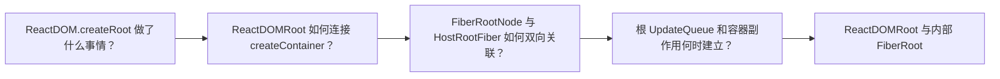

# React 源码（03） - 入口和初始化流程

> 读完后，你应能完成以下任务：
> - 从 `ReactDOM.createRoot(container)` 追踪到 `createContainer` 与 `createFiberRoot`，输出包含函数名、源码位置和返回对象的调用链图。
> - 检查 `FiberRootNode.current` 与 `HostRootFiber.stateNode` 的双向关联，输出断点快照并说明任一关联缺失会破坏什么能力。
> - 验证根 `UpdateQueue`、容器标记和事件监听只在初始化阶段建立，输出第二次 `root.render` 前后的对象引用与 DOM 断言。

## 核心知识清单

- ReactDOMRoot 与内部 FiberRoot
- createContainer 与 createFiberRoot
- HostRootFiber 与 current 双向关联
- 根容器标记与合成事件监听
- 根 UpdateQueue 初始化

<!-- article-progressive-block:start -->
# 一、先建立全局：入口和初始化流程 是什么？

理解“入口和初始化流程”，先要把标题中的对象放进同一条处理链：它接收什么输入，经过哪些状态变化，最终用什么证据判断结果。下表不另造概念，只把作者正文已经解释的章节按依赖顺序连起来。

“入口和初始化流程”的第一个核心判断是：第一个需要回答的问题是：ReactDOM.createRoot 初始化了哪些对象，。先弄清这个判断中的对象和输入输出，后面的实现、故障和验收才有共同语境。

| 顺序 | 章节 | 读完本节应抓住的结论 |
| --- | --- | --- |
| 1 | ReactDOM.createRoot 做了什么事情？ | 第一个需要回答的问题是：ReactDOM.createRoot 初始化了哪些对象， |
| 2 | ReactDOMRoot 如何连接 createContainer？ | 也就是生成了一个 ReactDOMRoot, |
| 3 | FiberRootNode 与 HostRootFiber 如何双向关联？ | 与初始化链路直接相关的字段是 containerInfo、current、Lane 状态和回调状态； |
| 4 | 根 UpdateQueue 和容器副作用何时建立？ | 这个方法在 uninitializedFiber 里挂载了一个初始化的 updateQueue |
| 5 | ReactDOMRoot 与内部 FiberRoot | 应该是创建一颗 fiber 树(FiberRoot)， |
| 6 | createContainer 与 createFiberRoot | 这个属性是 createContainer 的返回， |

## 1.1 核心对象之间怎样衔接



这张图只表达本文的讲解顺序，不替代正文机制。判断“入口和初始化流程”是否真正掌握，需要能从最后一个结果沿图回到前面每个章节的输入、状态变化和证据。

## 1.2 再看失败：问题最早会出现在哪一步？

在“入口和初始化流程”的对象和顺序已经明确后，再看可观察的失败：入口未命中、Lane 不符、更新丢失、重复提交或 DOM 结果不一致。定位时不从最后一条错误猜原因，而是沿上图找第一个偏离正文结论的节点。
<!-- article-progressive-block:end -->

# 二、ReactDOM.createRoot 做了什么事情？

React 渲染一个组件只有两步代码，也就是：

```js
import React from 'react'
import ReactDOM from 'react-dom/client'

// 客户端初始化阶段
const root = ReactDOM.createRoot(document.getElementById('root'))

// 渲染组件
// AppJsx 组件也就是上面分析过的一个函数，里面有 jsx 方法，这个函数的执行返回结果是 ReactElement 对象
root.render(<AppJsx />)
```

第一个需要回答的问题是：`ReactDOM.createRoot` 初始化了哪些对象，
最终返回的 `root` 为什么拥有 `render` 方法？

这里能想到大概的核心逻辑，
应该是创建一颗 fiber 树(FiberRoot)，
root 作为 fiber 树返回


# 三、ReactDOMRoot 如何连接 createContainer？

可以看到最终 new 了个构造函数，
也就是生成了一个 ReactDOMRoot,
返回一个实例对象，
实例对象身上有个`\_internalRoot` 属性，
这个属性是 createContainer 的返回，
所以核心内容在 `createContainer` 方法里，
并且只有第一个参数 container 有意义，
所以后续都需要关注这个参数，
传下去的时候后面叫 `containerInfo`

另外还需要注意里面还有两个方法 markContainerAsRoot 和 listenToAllSupportedEvents，
markContainerAsRoot 是给根 fiber 一个标记，
方便每次找到根 fiber，
listenToAllSupportedEvents 函数的作用是在根容器元素上监听所有React支持的原生事件（事件机制）


从 createRoot 到了 createFiberRoot 方法，
终于到了 fiber 的创建，
这个逻辑从 react-dom 包走到 react-scheduler 包里；
最终返回了一个 `root`，
这个 root 是 FiberRootNode 创建的实例对象，
并且这个 root 上有个 `current` 属性，
它的值是 createHostRootFiber 函数执行的返回，
所以接下来关心的逻辑是 `FiberRootNode` 构造函数和 `createHostRootFiber` 方法，
另外还有 `initializeUpdateQueue` 方法初始化更新队列

# 四、FiberRootNode 与 HostRootFiber 如何双向关联？

先看 FiberRootNode。
与初始化链路直接相关的字段是 `containerInfo`、`current`、Lane 状态和回调状态；
其余字段可以在进入对应阶段时再分析。

```js
function FiberRootNode(containerInfo, tag, hydrate, identifierPrefix, onRecoverableError) {
  this.tag = tag
  this.containerInfo = containerInfo
  this.pendingChildren = null
  this.current = null
  this.pingCache = null
  this.finishedWork = null
  this.timeoutHandle = noTimeout
  this.context = null
  this.pendingContext = null
  this.callbackNode = null
  this.callbackPriority = NoLane
  this.eventTimes = createLaneMap(NoLanes)
  this.expirationTimes = createLaneMap(NoTimestamp)

  this.pendingLanes = NoLanes
  this.suspendedLanes = NoLanes
  this.pingedLanes = NoLanes
  this.expiredLanes = NoLanes
  this.mutableReadLanes = NoLanes
  this.finishedLanes = NoLanes

  this.entangledLanes = NoLanes
  this.entanglements = createLaneMap(NoLanes)

  this.hiddenUpdates = createLaneMap(null)

  this.identifierPrefix = identifierPrefix
  this.onRecoverableError = onRecoverableError

  if (enableCache) {
    this.pooledCache = null
    this.pooledCacheLanes = NoLanes
  }

  this.incompleteTransitions = new Map()
}
```

FiberRootNode 构造函数的可以直接打印出来

```js
js const root = ReactDOM.createRoot(document.getElementById('root'))

console.log('root', root)
```

这几个属性，
是常见的，
容器，
current 正在处理的树指向 alternate 树，
render 方法


接下来是 createHostRootFiber 方法，
可以看到最终返回了一个 FiberNode 构造函数生成的实例对象，
当前的这个 fiber 是 uninitializedFiber ，
并且 FiberRootNode.current = uninitializedFiber（current 就是当前的 fiber 树），
uninitializedFiber.stateNode = FiberRootNode;
到这里，生成的实例等东西都结束了。


# 五、根 UpdateQueue 和容器副作用何时建立？

最后是 initializeUpdateQueue 方法，
总的来说前面都是生成对象，
这个方法在 uninitializedFiber 里挂载了一个初始化的 updateQueue

```js
export function initializeUpdateQueue<State>(fiber: Fiber): void {
  const queue: UpdateQueue<State> = {
    baseState: fiber.memoizedState,
    firstBaseUpdate: null,
    lastBaseUpdate: null,
    shared: {
      pending: null,
      lanes: NoLanes,
      hiddenCallbacks: null,
    },
    callbacks: null,
  };
  fiber.updateQueue = queue;
}
```

<!-- article-progressive-block:start -->
# 六、动手验证：先跑通 入口和初始化流程，再改变一个变量

前面的章节已经建立问题、概念和机制。现在把“入口和初始化流程”放进同一套基线中运行；本节不再引入新术语，只验证前文结论能否被复现。

## 6.1 基线与候选只允许一个变量不同

验证“入口和初始化流程”时，先固定React 版本、组件输入、更新触发方式和浏览器事件。候选方案只能改变本次要验证的变量；如果同时更换数据、依赖和配置，即使结果改善，也不能知道是哪一项产生作用。

执行“入口和初始化流程”时，动作是：在对应源码入口设置断点，记录 Fiber、Lane、UpdateQueue 与提交阶段变化。原始结果不能只保留截图或汇总分数，必须同步保存：调用栈、Fiber 字段快照、Scheduler 任务、DOM 断言和源码行号，使下一次复查可以在同一输入上重放。

| 实验要素 | 本文要求 |
| --- | --- |
| 固定条件 | 固定 React 版本、组件输入、更新触发方式和浏览器事件 |
| 唯一变量 | 本次候选方案与基线之间的一项明确差异 |
| 原始证据 | 调用栈、Fiber 字段快照、Scheduler 任务、DOM 断言和源码行号 |
| 通过阈值 | 调用顺序与正文一致，状态变化能对应到最终 DOM 或副作用 |
| 立即停止 | 入口未命中、Lane 不符、更新丢失、重复提交或 DOM 结果不一致 |

## 6.2 执行前先排除不可比较条件

“入口和初始化流程”开始前先确认下面四项；任一项不成立，都应先修复实验条件，而不是解释结果。

- 基线能够在“入口和初始化流程”的当前环境重复运行。
- 候选只改变一个与“入口和初始化流程”结论直接相关的条件。
- “入口和初始化流程”的基线和候选使用同一批输入、同一版本依赖与同一通过阈值。
- “入口和初始化流程”的原始输出和失败现场不会被重试、格式化或汇总覆盖。

## 6.3 执行后先核对证据完整性

结果出来后先检查证据，再讨论“入口和初始化流程”是否通过。缺少中间状态时，最终输出只能说明现象，不能证明机制。

| 检查项 | 当前文章的判定 |
| --- | --- |
| 输入可追溯 | 固定 React 版本、组件输入、更新触发方式和浏览器事件 |
| 过程可回放 | 在对应源码入口设置断点，记录 Fiber、Lane、UpdateQueue 与提交阶段变化 |
| 结果可审计 | 调用栈、Fiber 字段快照、Scheduler 任务、DOM 断言和源码行号 |

“入口和初始化流程”的一次合格基线对照按以下顺序执行：

1. 保存“入口和初始化流程”基线版本及输入摘要，确认基线本身可以重复运行。
2. 写下“入口和初始化流程”候选方案唯一变化的变量，以及它预期影响的指标。
3. 在同一环境执行“入口和初始化流程”：在对应源码入口设置断点，记录 Fiber、Lane、UpdateQueue 与提交阶段变化。
4. 为“入口和初始化流程”保存：调用栈、Fiber 字段快照、Scheduler 任务、DOM 断言和源码行号。
5. 使用“入口和初始化流程”预登记条件判断：调用顺序与正文一致，状态变化能对应到最终 DOM 或副作用。
6. 如果“入口和初始化流程”未通过，不修改第二个变量，先恢复基线并保留失败现场。

# 七、用一张矩阵验证 入口和初始化流程 的关键结论

矩阵按正文顺序列出“入口和初始化流程”的结论。一次实验只选择一行，只改变这一行对应的条件；不要把多行合并成一个无法归因的大实验。

| 正文章节 | 已解释的结论 | 本轮唯一变量 | 必须保存的证据 |
| --- | --- | --- | --- |
| ReactDOM.createRoot 做了什么事情？ | 第一个需要回答的问题是：ReactDOM.createRoot 初始化了哪些对象， | 只改变与“ReactDOM.createRoot 做了什么事情？”相关的条件 | 调用栈、Fiber 字段快照、Scheduler 任务、DOM 断言和源码行号 |
| ReactDOMRoot 如何连接 createContainer？ | 也就是生成了一个 ReactDOMRoot, | 只改变与“ReactDOMRoot 如何连接 createContainer？”相关的条件 | 调用栈、Fiber 字段快照、Scheduler 任务、DOM 断言和源码行号 |
| FiberRootNode 与 HostRootFiber 如何双向关联？ | 与初始化链路直接相关的字段是 containerInfo、current、Lane 状态和回调状态； | 只改变与“FiberRootNode 与 HostRootFiber 如何双向关联？”相关的条件 | 调用栈、Fiber 字段快照、Scheduler 任务、DOM 断言和源码行号 |
| 根 UpdateQueue 和容器副作用何时建立？ | 这个方法在 uninitializedFiber 里挂载了一个初始化的 updateQueue | 只改变与“根 UpdateQueue 和容器副作用何时建立？”相关的条件 | 调用栈、Fiber 字段快照、Scheduler 任务、DOM 断言和源码行号 |
| ReactDOMRoot 与内部 FiberRoot | 应该是创建一颗 fiber 树(FiberRoot)， | 只改变与“ReactDOMRoot 与内部 FiberRoot”相关的条件 | 调用栈、Fiber 字段快照、Scheduler 任务、DOM 断言和源码行号 |
| createContainer 与 createFiberRoot | 这个属性是 createContainer 的返回， | 只改变与“createContainer 与 createFiberRoot”相关的条件 | 调用栈、Fiber 字段快照、Scheduler 任务、DOM 断言和源码行号 |

## 7.1 记录本次实际实验

下面的记录用于“入口和初始化流程”当前这一次实验，不是第二套知识目录。先从矩阵选择一个章节，再填写实际值；没有填写的字段表示尚未验证。

```yaml
topic: "入口和初始化流程"
selected_chapter: required
claim_from_article: required
baseline_version: required
changed_condition: exactly_one
execution: "在对应源码入口设置断点，记录 Fiber、Lane、UpdateQueue 与提交阶段变化"
evidence: "调用栈、Fiber 字段快照、Scheduler 任务、DOM 断言和源码行号"
pass_when: "调用顺序与正文一致，状态变化能对应到最终 DOM 或副作用"
stop_when: "入口未命中、Lane 不符、更新丢失、重复提交或 DOM 结果不一致"
observed_result: required
first_deviation: null_or_evidence
recovery_replay: required_after_failure
```

## 7.2 边界实验必须证明能够停止和恢复

成功路径只能证明“入口和初始化流程”在当前样本上工作，不能证明它可以进入生产。边界实验需要主动制造：入口未命中、Lane 不符、更新丢失、重复提交或 DOM 结果不一致，并观察系统是否在产生不可逆副作用前停止。

| 场景 | 只改变什么 | 应保存什么 | 通过标准 |
| --- | --- | --- | --- |
| 正常路径 | 使用已知有效输入 | 调用栈、Fiber 字段快照、Scheduler 任务、DOM 断言和源码行号 | 调用顺序与正文一致，状态变化能对应到最终 DOM 或副作用 |
| 边界路径 | 把一个输入推进到约束临界值 | 临界值前后的输出与指标 | 不静默降级，不把部分结果冒充成功 |
| 明确失败 | 注入：入口未命中、Lane 不符、更新丢失、重复提交或 DOM 结果不一致 | 原始错误、首个异常阶段和最终状态 | 失败被正确分类且没有扩大副作用 |
| 恢复重放 | 执行：从首个错误状态回查 Update 入队、调度、协调和提交边界 | 原失败样本的复测证据 | 原样本恢复，正常样本没有回归 |

恢复动作不是简单重启。对于“入口和初始化流程”，第一步是：从首个错误状态回查 Update 入队、调度、协调和提交边界。完成后使用原始失败样本复测；只验证一个新样本成功，不能证明触发条件已经消失。

“入口和初始化流程”边界实验结束后，应把正常、临界、失败和恢复四类记录放在同一个运行批次中。这样才能区分“候选方案真的修复问题”和“环境变化让问题暂时没有出现”。

# 八、入口和初始化流程 的结果解释

解释“入口和初始化流程”实验时先看首个偏差，而不是最后一条错误。最后的异常通常只是上游状态错误的结果；从末端反推容易误把症状当根因。

| 观察结果 | 可以支持的判断 | 下一步 |
| --- | --- | --- |
| 主链路没有达到预期 | 入口未命中、Lane 不符、更新丢失、重复提交或 DOM 结果不一致 | 先执行：从首个错误状态回查 Update 入队、调度、协调和提交边界 |
| 异常链路无法恢复 | 入口未命中、Lane 不符、更新丢失、重复提交或 DOM 结果不一致 | 先执行：从首个错误状态回查 Update 入队、调度、协调和提交边界 |
| 新样本成功但原样本仍失败 | 修复没有覆盖原始触发条件 | 固定原失败输入，恢复基线后重新比较 |
| 指标改善但证据无法回链 | 数据、版本或中间状态没有固定 | 暂停发布，补齐可追溯记录后重跑 |

“入口和初始化流程”只有同时满足“调用顺序与正文一致，状态变化能对应到最终 DOM 或副作用”，并且没有出现“入口未命中、Lane 不符、更新丢失、重复提交或 DOM 结果不一致”，才可以认为主链路通过。这里的“通过”只对当前固定版本、样本和环境有效，不能外推到尚未测试的容量、权限或数据分布。

如果“入口和初始化流程”候选方案与基线差异很小，先检查证据分辨率是否足够；如果差异很大，先排除数据泄漏、环境漂移和版本不一致。两种情况都不能只看一个汇总均值，需要回到逐样本输出和中间状态。

“入口和初始化流程”故障定位完成后，记录“现象、首个偏差、根因、改动、原样本复测”五项。缺少原样本复测时，只能标记为待观察，不能标记为已解决。

# 九、入口和初始化流程 的发布判断

发布判断需要把“入口和初始化流程”的质量、失败边界和恢复能力放在同一份记录中。以下任一条件缺失，都应停止扩量，而不是用“基本正常”替代证据。

- [ ] “入口和初始化流程”的基线与候选只存在一个计划内变量。
- [ ] “入口和初始化流程”的输入、代码、依赖、配置和数据版本可以追溯。
- [ ] “入口和初始化流程”的正常、临界、失败和恢复样本使用同一套断言。
- [ ] “入口和初始化流程”的原始输出、中间状态和失败现场已经保留。
- [ ] “入口和初始化流程”的日志、Trace、截图和测试数据已经脱敏。
- [ ] “入口和初始化流程”的停止条件、负责人和回滚入口已经演练。
- [ ] “入口和初始化流程”尚未覆盖的输入、权限、容量和外部依赖已经登记。

最终记录至少包含基线版本、唯一变量、原始证据、首个偏差、恢复复测和发布责任人。没有参与本次修改的人如果不能据此重放“入口和初始化流程”的判断，就不能发布。
<!-- article-progressive-block:end -->

# 十、总结

- **ReactDOM.createRoot 做了什么事情？**：第一个需要回答的问题是：ReactDOM.createRoot 初始化了哪些对象，
- **ReactDOMRoot 如何连接 createContainer？**：也就是生成了一个 ReactDOMRoot,
- **FiberRootNode 与 HostRootFiber 如何双向关联？**：与初始化链路直接相关的字段是 containerInfo、current、Lane 状态和回调状态；
- **ReactDOMRoot 与内部 FiberRoot**：应该是创建一颗 fiber 树(FiberRoot)，
- **createContainer 与 createFiberRoot**：这个属性是 createContainer 的返回，
- **HostRootFiber 与 current 双向关联**：它的值是 createHostRootFiber 函数执行的返回，

## 参考资料

- [React 文档](https://react.dev/learn)
- [React 源码](https://github.com/facebook/react)
