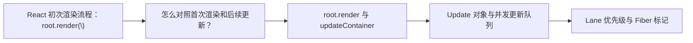
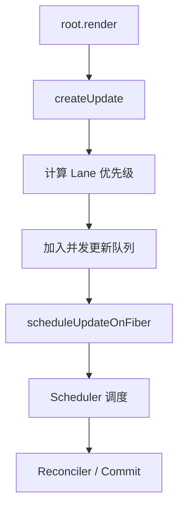

# React 源码（07） - 初始化和更新流程

> 读完后，你应能完成以下任务：
> - 绘制“React 源码（07） - 初始化和更新流程 / React 初次渲染流程：root.render(\</APP>)”的关键对象与数据流，解释“一个是 eventTime，”，并用源码位置、日志或 Trace 标注证据。
> - 为“React 源码（07） - 初始化和更新流程 / 怎么对照首次渲染和后续更新？”设计正常与异常输入，验证“验证时准备同一个根节点和两个可区分的组件状态，连续调用两次 root.render。”，输出首个偏差位置与回归测试结果。
> - 实现“React 源码（07） - 初始化和更新流程 / 补充结论 1”的最小代码或配置，检验“主要是创建 update 对象，”，输出命令、结果与 Diff，并说明不适用边界。

## 核心知识清单

- root.render 与 updateContainer
- Update 对象与并发更新队列
- Lane 优先级与 Fiber 标记
- scheduleUpdateOnFiber 调度入口
- ensureRootIsScheduled 与 Scheduler 桥接

<!-- article-progressive-block:start -->
# 一、先建立全局：初始化和更新流程 是什么？

理解“初始化和更新流程”，先要把标题中的对象放进同一条处理链：它接收什么输入，经过哪些状态变化，最终用什么证据判断结果。下表不另造概念，只把作者正文已经解释的章节按依赖顺序连起来。

“初始化和更新流程”的第一个核心判断是：一个是 eventTime，。先弄清这个判断中的对象和输入输出，后面的实现、故障和验收才有共同语境。

| 顺序 | 章节 | 读完本节应抓住的结论 |
| --- | --- | --- |
| 1 | React 初次渲染流程：root.render(\</APP>) | 一个是 eventTime， |
| 2 | 怎么对照首次渲染和后续更新？ | 验证时准备同一个根节点和两个可区分的组件状态，连续调用两次 root.render。 |
| 3 | root.render 与 updateContainer | updateContainer 大约是这样的流程， |
| 4 | Update 对象与并发更新队列 | 主要是创建 update 对象， |
| 5 | Lane 优先级与 Fiber 标记 | 先检查 Update 是否入队、根 Fiber 是否被标记， |
| 6 | ensureRootIsScheduled 与 Scheduler 桥接 | 再检查 Scheduler 是否已有更高优先级任务。 |

## 1.1 核心对象之间怎样衔接



这张图只表达本文的讲解顺序，不替代正文机制。判断“初始化和更新流程”是否真正掌握，需要能从最后一个结果沿图回到前面每个章节的输入、状态变化和证据。

## 1.2 再看失败：问题最早会出现在哪一步？

在“初始化和更新流程”的对象和顺序已经明确后，再看可观察的失败：入口未命中、Lane 不符、更新丢失、重复提交或 DOM 结果不一致。定位时不从最后一条错误猜原因，而是沿上图找第一个偏离正文结论的节点。
<!-- article-progressive-block:end -->

# 二、React 初次渲染流程：root.render(\</APP>)

如下图，
会去拿到两个信息，
一个是 eventTime，
可以粗略的理解为 performance.now()，
另一个 lane，
获取当前根容器的 fiber 的车道模型，
当前为 defaultLane


如下图，
接着看 `updateContainer` 逻辑，
主要是创建 update 对象，
计算优先级 Lane，
然后放入全局队列，
供后续消费



图示说明：首次渲染从 `root.render` 创建 Update，
计算 Lane 并入队，
然后由 Scheduler 驱动 Reconciler 和 Commit。

updateContainer 大约是这样的流程，
走到 `scheduleUpdateOnFiber` - Reconciler 的调度入口

```js
// 用户首次调用
root.render(<App />)

// 执行流程：
// 1. 创建更新对象 createUpdate
const update = {
  eventTime: now(),
  lane: 16,
  payload: { element: <App /> },
  callback: null
}

// 2. 检查是否为渲染阶段更新
// 首次渲染：isUnsafeClassRenderPhaseUpdate(fiber) = false
// 走正常并发更新路径

// 3. 加入并发队列（全局数组） enqueueUpdate
concurrentQueues = [fiber, queue, update, 16]
concurrentQueuesIndex = 4

// 4. 更新Fiber状态
fiber.lanes = 16 // 标记这个Fiber有工作要做

// 5. 返回根节点
return fiberRoot

// 6. 后续调度 packages/react-reconciler/src/ReactFiberReconciler.old.js
scheduleUpdateOnFiber(fiberRoot, current, 16, eventTime)

// 7. 确保根节点被调度 - 连接到 Scheduler 的桥梁 packages/react-reconciler/src/ReactFiberWorkLoop.old.js
ensureRootIsScheduled(root, eventTime)
```

接下来就是 scheduler 的处理

# 三、怎么对照首次渲染和后续更新？

验证时准备同一个根节点和两个可区分的组件状态，连续调用两次 `root.render`。

第一次调用前，
在 `updateContainer`、Update 入队位置和 `scheduleUpdateOnFiber` 设置断点，
记录 `eventTime`、Lane、Update 内容与目标 Fiber。

第一次调用后保存调用栈和页面 DOM，
确认 Update 已进入队列，
并由调度入口继续推进到协调与提交阶段。

第二次只改变一个可见文本值，再次记录相同字段。
两次记录应指向同一个根容器，但 Update 内容和待处理 Lane 应能反映本次变化。

若第二次调用没有进入调度入口，
先检查 Update 是否入队、根 Fiber 是否被标记，
再检查 Scheduler 是否已有更高优先级任务。

若调度和提交都执行了但 DOM 没变化，
对比 Reconciler 产出的变更标记，
不要把问题直接归因于浏览器渲染。

最终验收证据至少包括两次调用栈、关键字段快照、提交前后的 DOM 断言，
以及所用 React 源码版本。

<!-- article-progressive-block:start -->
# 四、动手验证：先跑通 初始化和更新流程，再改变一个变量

前面的章节已经建立问题、概念和机制。现在把“初始化和更新流程”放进同一套基线中运行；本节不再引入新术语，只验证前文结论能否被复现。

## 4.1 基线与候选只允许一个变量不同

验证“初始化和更新流程”时，先固定React 版本、组件输入、更新触发方式和浏览器事件。候选方案只能改变本次要验证的变量；如果同时更换数据、依赖和配置，即使结果改善，也不能知道是哪一项产生作用。

执行“初始化和更新流程”时，动作是：在对应源码入口设置断点，记录 Fiber、Lane、UpdateQueue 与提交阶段变化。原始结果不能只保留截图或汇总分数，必须同步保存：调用栈、Fiber 字段快照、Scheduler 任务、DOM 断言和源码行号，使下一次复查可以在同一输入上重放。

| 实验要素 | 本文要求 |
| --- | --- |
| 固定条件 | 固定 React 版本、组件输入、更新触发方式和浏览器事件 |
| 唯一变量 | 本次候选方案与基线之间的一项明确差异 |
| 原始证据 | 调用栈、Fiber 字段快照、Scheduler 任务、DOM 断言和源码行号 |
| 通过阈值 | 调用顺序与正文一致，状态变化能对应到最终 DOM 或副作用 |
| 立即停止 | 入口未命中、Lane 不符、更新丢失、重复提交或 DOM 结果不一致 |

## 4.2 执行前先排除不可比较条件

“初始化和更新流程”开始前先确认下面四项；任一项不成立，都应先修复实验条件，而不是解释结果。

- 基线能够在“初始化和更新流程”的当前环境重复运行。
- 候选只改变一个与“初始化和更新流程”结论直接相关的条件。
- “初始化和更新流程”的基线和候选使用同一批输入、同一版本依赖与同一通过阈值。
- “初始化和更新流程”的原始输出和失败现场不会被重试、格式化或汇总覆盖。

## 4.3 执行后先核对证据完整性

结果出来后先检查证据，再讨论“初始化和更新流程”是否通过。缺少中间状态时，最终输出只能说明现象，不能证明机制。

| 检查项 | 当前文章的判定 |
| --- | --- |
| 输入可追溯 | 固定 React 版本、组件输入、更新触发方式和浏览器事件 |
| 过程可回放 | 在对应源码入口设置断点，记录 Fiber、Lane、UpdateQueue 与提交阶段变化 |
| 结果可审计 | 调用栈、Fiber 字段快照、Scheduler 任务、DOM 断言和源码行号 |

“初始化和更新流程”的一次合格基线对照按以下顺序执行：

1. 保存“初始化和更新流程”基线版本及输入摘要，确认基线本身可以重复运行。
2. 写下“初始化和更新流程”候选方案唯一变化的变量，以及它预期影响的指标。
3. 在同一环境执行“初始化和更新流程”：在对应源码入口设置断点，记录 Fiber、Lane、UpdateQueue 与提交阶段变化。
4. 为“初始化和更新流程”保存：调用栈、Fiber 字段快照、Scheduler 任务、DOM 断言和源码行号。
5. 使用“初始化和更新流程”预登记条件判断：调用顺序与正文一致，状态变化能对应到最终 DOM 或副作用。
6. 如果“初始化和更新流程”未通过，不修改第二个变量，先恢复基线并保留失败现场。

# 五、用一张矩阵验证 初始化和更新流程 的关键结论

矩阵按正文顺序列出“初始化和更新流程”的结论。一次实验只选择一行，只改变这一行对应的条件；不要把多行合并成一个无法归因的大实验。

| 正文章节 | 已解释的结论 | 本轮唯一变量 | 必须保存的证据 |
| --- | --- | --- | --- |
| React 初次渲染流程：root.render(\</APP>) | 一个是 eventTime， | 只改变与“React 初次渲染流程：root.render(\</APP>)”相关的条件 | 调用栈、Fiber 字段快照、Scheduler 任务、DOM 断言和源码行号 |
| 怎么对照首次渲染和后续更新？ | 验证时准备同一个根节点和两个可区分的组件状态，连续调用两次 root.render。 | 只改变与“怎么对照首次渲染和后续更新？”相关的条件 | 调用栈、Fiber 字段快照、Scheduler 任务、DOM 断言和源码行号 |
| root.render 与 updateContainer | updateContainer 大约是这样的流程， | 只改变与“root.render 与 updateContainer”相关的条件 | 调用栈、Fiber 字段快照、Scheduler 任务、DOM 断言和源码行号 |
| Update 对象与并发更新队列 | 主要是创建 update 对象， | 只改变与“Update 对象与并发更新队列”相关的条件 | 调用栈、Fiber 字段快照、Scheduler 任务、DOM 断言和源码行号 |
| Lane 优先级与 Fiber 标记 | 先检查 Update 是否入队、根 Fiber 是否被标记， | 只改变与“Lane 优先级与 Fiber 标记”相关的条件 | 调用栈、Fiber 字段快照、Scheduler 任务、DOM 断言和源码行号 |
| ensureRootIsScheduled 与 Scheduler 桥接 | 再检查 Scheduler 是否已有更高优先级任务。 | 只改变与“ensureRootIsScheduled 与 Scheduler 桥接”相关的条件 | 调用栈、Fiber 字段快照、Scheduler 任务、DOM 断言和源码行号 |

## 5.1 记录本次实际实验

下面的记录用于“初始化和更新流程”当前这一次实验，不是第二套知识目录。先从矩阵选择一个章节，再填写实际值；没有填写的字段表示尚未验证。

```yaml
topic: "初始化和更新流程"
selected_chapter: required
claim_from_article: required
baseline_version: required
changed_condition: exactly_one
execution: "在对应源码入口设置断点，记录 Fiber、Lane、UpdateQueue 与提交阶段变化"
evidence: "调用栈、Fiber 字段快照、Scheduler 任务、DOM 断言和源码行号"
pass_when: "调用顺序与正文一致，状态变化能对应到最终 DOM 或副作用"
stop_when: "入口未命中、Lane 不符、更新丢失、重复提交或 DOM 结果不一致"
observed_result: required
first_deviation: null_or_evidence
recovery_replay: required_after_failure
```

## 5.2 边界实验必须证明能够停止和恢复

成功路径只能证明“初始化和更新流程”在当前样本上工作，不能证明它可以进入生产。边界实验需要主动制造：入口未命中、Lane 不符、更新丢失、重复提交或 DOM 结果不一致，并观察系统是否在产生不可逆副作用前停止。

| 场景 | 只改变什么 | 应保存什么 | 通过标准 |
| --- | --- | --- | --- |
| 正常路径 | 使用已知有效输入 | 调用栈、Fiber 字段快照、Scheduler 任务、DOM 断言和源码行号 | 调用顺序与正文一致，状态变化能对应到最终 DOM 或副作用 |
| 边界路径 | 把一个输入推进到约束临界值 | 临界值前后的输出与指标 | 不静默降级，不把部分结果冒充成功 |
| 明确失败 | 注入：入口未命中、Lane 不符、更新丢失、重复提交或 DOM 结果不一致 | 原始错误、首个异常阶段和最终状态 | 失败被正确分类且没有扩大副作用 |
| 恢复重放 | 执行：从首个错误状态回查 Update 入队、调度、协调和提交边界 | 原失败样本的复测证据 | 原样本恢复，正常样本没有回归 |

恢复动作不是简单重启。对于“初始化和更新流程”，第一步是：从首个错误状态回查 Update 入队、调度、协调和提交边界。完成后使用原始失败样本复测；只验证一个新样本成功，不能证明触发条件已经消失。

“初始化和更新流程”边界实验结束后，应把正常、临界、失败和恢复四类记录放在同一个运行批次中。这样才能区分“候选方案真的修复问题”和“环境变化让问题暂时没有出现”。

# 六、初始化和更新流程 的结果解释

解释“初始化和更新流程”实验时先看首个偏差，而不是最后一条错误。最后的异常通常只是上游状态错误的结果；从末端反推容易误把症状当根因。

| 观察结果 | 可以支持的判断 | 下一步 |
| --- | --- | --- |
| 主链路没有达到预期 | 入口未命中、Lane 不符、更新丢失、重复提交或 DOM 结果不一致 | 先执行：从首个错误状态回查 Update 入队、调度、协调和提交边界 |
| 异常链路无法恢复 | 入口未命中、Lane 不符、更新丢失、重复提交或 DOM 结果不一致 | 先执行：从首个错误状态回查 Update 入队、调度、协调和提交边界 |
| 新样本成功但原样本仍失败 | 修复没有覆盖原始触发条件 | 固定原失败输入，恢复基线后重新比较 |
| 指标改善但证据无法回链 | 数据、版本或中间状态没有固定 | 暂停发布，补齐可追溯记录后重跑 |

“初始化和更新流程”只有同时满足“调用顺序与正文一致，状态变化能对应到最终 DOM 或副作用”，并且没有出现“入口未命中、Lane 不符、更新丢失、重复提交或 DOM 结果不一致”，才可以认为主链路通过。这里的“通过”只对当前固定版本、样本和环境有效，不能外推到尚未测试的容量、权限或数据分布。

如果“初始化和更新流程”候选方案与基线差异很小，先检查证据分辨率是否足够；如果差异很大，先排除数据泄漏、环境漂移和版本不一致。两种情况都不能只看一个汇总均值，需要回到逐样本输出和中间状态。

“初始化和更新流程”故障定位完成后，记录“现象、首个偏差、根因、改动、原样本复测”五项。缺少原样本复测时，只能标记为待观察，不能标记为已解决。

# 七、初始化和更新流程 的发布判断

发布判断需要把“初始化和更新流程”的质量、失败边界和恢复能力放在同一份记录中。以下任一条件缺失，都应停止扩量，而不是用“基本正常”替代证据。

- [ ] “初始化和更新流程”的基线与候选只存在一个计划内变量。
- [ ] “初始化和更新流程”的输入、代码、依赖、配置和数据版本可以追溯。
- [ ] “初始化和更新流程”的正常、临界、失败和恢复样本使用同一套断言。
- [ ] “初始化和更新流程”的原始输出、中间状态和失败现场已经保留。
- [ ] “初始化和更新流程”的日志、Trace、截图和测试数据已经脱敏。
- [ ] “初始化和更新流程”的停止条件、负责人和回滚入口已经演练。
- [ ] “初始化和更新流程”尚未覆盖的输入、权限、容量和外部依赖已经登记。

最终记录至少包含基线版本、唯一变量、原始证据、首个偏差、恢复复测和发布责任人。没有参与本次修改的人如果不能据此重放“初始化和更新流程”的判断，就不能发布。
<!-- article-progressive-block:end -->

# 八、总结

- **React 初次渲染流程：root.render(\</APP>)**：updateContainer 大约是这样的流程，走到 scheduleUpdateOnFiber - Reconciler 的调度入口
- **怎么对照首次渲染和后续更新？**：验证时准备同一个根节点和两个可区分的组件状态，连续调用两次 root.render。
- **Lane 优先级与 Fiber 标记**：若第二次调用没有进入调度入口，先检查 Update 是否入队、根 Fiber 是否被标记，再检查 Scheduler 是否已有更高优先级任务。
- **补充结论 4**：两次记录应指向同一个根容器，但 Update 内容和待处理 Lane 应能反映本次变化。

## 参考资料

- [React 文档](https://react.dev/learn)
- [React 源码](https://github.com/facebook/react)
