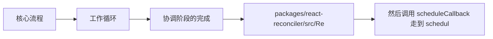

# React 源码（09） - Reconciler 协调阶段

> 读完后，你应能完成以下任务：
> - 绘制“React 源码（09） - Reconciler 协调阶段 / 核心流程”的关键对象与数据流，解释“先是在 reconciler 里 updateContainer，”，并用源码位置、日志或 Trace 标注证据。
> - 为“React 源码（09） - Reconciler 协调阶段 / 工作循环”设计正常与异常输入，验证“这个过程就像是在一个巨大的城市地图（Fiber 树）上寻路和规划。”，输出首个偏差位置与回归测试结果。
> - 实现“React 源码（09） - Reconciler 协调阶段 / "向下看" (Begin Phase - beginWork 函数):”的最小代码或配置，检验“协调算法（Reconciliation）： React 会比较当前 Fiber 节点与对应的旧 Fiber 节点，检查 props、state、context 等是否发生变化。”，输出命令、结果与 Diff，并说明不适用边界。

`packages/react-reconciler/src/ReactFiberWorkLoop.old.js`

<!-- article-progressive-block:start -->
# 一、先建立全局：Reconciler 协调阶段 是什么？

理解“Reconciler 协调阶段”，先要把标题中的对象放进同一条处理链：它接收什么输入，经过哪些状态变化，最终用什么证据判断结果。下表不另造概念，只把作者正文已经解释的章节按依赖顺序连起来。

“Reconciler 协调阶段”的第一个核心判断是：先是在 reconciler 里 updateContainer，。先弄清这个判断中的对象和输入输出，后面的实现、故障和验收才有共同语境。

| 顺序 | 章节 | 读完本节应抓住的结论 |
| --- | --- | --- |
| 1 | 核心流程 | 先是在 reconciler 里 updateContainer， |
| 2 | 工作循环 | 这个过程就像是在一个巨大的城市地图（Fiber 树）上寻路和规划。 |
| 3 | 协调阶段的完成 | 构建了一个新的 Fiber 树 (work-in-progress tree)，这个树代表了下一次要渲染的 UI 状态。 -> 计算出了所有必要的 DOM 变更、生命周期调用等，并以副作用标记 (flags) 的形式记录在各个 Fiber 节点上。 -> 生成了一个副作用列表 (effect list)，按顺序排列了所有需要执行副作用的 Fiber 节点。 |
| 4 | packages/react-reconciler/src/Re | packages/react-reconciler/src/ReactFiberWorkLoop.old.js |
| 5 | 然后调用 scheduleCallback 走到 schedul | 然后调用 scheduleCallback 走到 scheduler， |
| 6 | 它传入的参数 performConcurrentWorkOnRo | 它传入的参数 performConcurrentWorkOnRoot.bind(null, |

## 1.1 核心对象之间怎样衔接



这张图只表达本文的讲解顺序，不替代正文机制。判断“Reconciler 协调阶段”是否真正掌握，需要能从最后一个结果沿图回到前面每个章节的输入、状态变化和证据。

## 1.2 再看失败：问题最早会出现在哪一步？

在“Reconciler 协调阶段”的对象和顺序已经明确后，再看可观察的失败：入口未命中、Lane 不符、更新丢失、重复提交或 DOM 结果不一致。定位时不从最后一条错误猜原因，而是沿上图找第一个偏离正文结论的节点。
<!-- article-progressive-block:end -->

# 二、核心流程


先是在 `reconciler` 里 `updateContainer`，
然后调用 `scheduleCallback` 走到 `scheduler`，
它传入的参数 `performConcurrentWorkOnRoot.bind(null,
root)` 很重要，
又回到 `reconciler`

- 其中 `renderRootConcurrent` 有个函数 `prepareFreshStack` 是初始化 `workInProgress` 树的
- `!shouldYield()` 来自 `scheduler` 里的 `shouldYieldToHost`，里面的比如 timeElapsed < frameInterval，是当前执行时间和默认的 5ms 对比，在5ms内则不让给宿主（浏览器一帧是 16.6ms，5ms 用来做 react 任务）

# 三、工作循环

当调度器（Scheduler）确定当前更新任务具有足够的优先级并且浏览器有可用的时间片时，
协调阶段就正式启动它的核心工作循环（`workLoop`）。
这个过程就像是在一个巨大的城市地图（Fiber 树）上寻路和规划。

`workLoopConcurrent` 就是最关键的打断，
判断是否还有剩余时间，
是否还有执行任务

```js
// React 19 工作循环的简化版本
function workLoopConcurrent() {
  while (workInProgress !== null && !shouldYield()) {
    performUnitOfWork(workInProgress)
  }
}

function performUnitOfWork(unitOfWork) {
  const next = beginWork(unitOfWork)
  if (next === null) {
    completeUnitOfWork(unitOfWork)
  } else {
    workInProgress = next
  }
}
```

### "向下看" (Begin Phase - beginWork 函数):

- 将虚拟 dom 变成 fiber， 从上往下创建 fiber
- 协调算法（Reconciliation）： React 会比较当前 Fiber 节点与对应的旧 Fiber 节点，检查 props、state、context 等是否发生变化。
子节点协调： 根据比较结果，
决定子 Fiber 节点的处理策略：复用（bailout）、更新、创建或删除。
- 副作用标记： 如果检测到需要 DOM 操作，会在 Fiber 节点的 flags 字段上标记相应的副作用（如 Placement、Update、Deletion）。
- 性能优化： 通过 React.memo、useMemo、shouldComponentUpdate 等机制实现 bailout 优化，跳过不必要的子树协调。

```js
// beginWork 的简化逻辑
function beginWork(current, workInProgress, renderLanes) {
  // 检查是否可以复用当前节点，下面的两句代码是在具体函数里面，为了简洁这样写
  if (current !== null && !didReceiveUpdate) {
    return bailoutOnAlreadyFinishedWork(current, workInProgress, renderLanes)
  }

  // 根据组件类型进行不同的处理
  switch (workInProgress.tag) {
    case FunctionComponent:
      return updateFunctionComponent(current, workInProgress, renderLanes)
    case ClassComponent:
      return updateClassComponent(current, workInProgress, renderLanes)
    case HostComponent:
      return updateHostComponent(current, workInProgress, renderLanes)
    // ... 其他组件类型
  }
}
```

updateXXX 也就是更新用的，
mountXXX是挂载用的函数，
重点关注 `updateFunctionComponent` 函数的更新

### "向上走" (Complete Phase - completeWork 函数):

- 将 fiber 变成真实 dom 节点 从下往上
- 当一个 Fiber 节点的所有子节点都处理完毕后，或者该节点本身没有子节点，React 开始执行 completeWork。
- DOM 实例创建： 对于 Host 组件（如 <div>、<span>），如果是新创建的节点，会在此阶段创建对应的 DOM 实例。
- 属性处理： 处理和收集需要更新的 DOM 属性，为后续的 Commit 阶段做准备。
- 副作用收集： 将当前节点及其子树的副作用标记向上冒泡，构建副作用链表。
- Effect List 构建： 在 React 18 之前，会构建 Effect List；React 18+ 使用不同的副作用收集机制。

```js
// completeWork 的简化逻辑
// function completeWork(current, workInProgress, renderLanes) {
// unitOfWork 就是 WIP 树
function completeWork(unitOfWork) {
  switch (workInProgress.tag) {
    case HostComponent: {
      const type = workInProgress.type
      if (current !== null && workInProgress.stateNode != null) {
        // 更新现有的 DOM 节点
        updateHostComponent(current, workInProgress, type)
      } else {
        // 创建新的 DOM 节点
        const instance = createInstance(type, workInProgress.pendingProps)
        appendAllChildren(instance, workInProgress)
        workInProgress.stateNode = instance
      }
      break
    }
    case FunctionComponent:
    case ClassComponent:
      // 函数组件和类组件通常不需要特殊处理
      break
  }
  return null
}
```

这个"向下看"再"向上走"的过程会持续进行，直到整个地图（Fiber 树）都规划完毕。

# 四、协调阶段的完成

当工作循环处理完 Root Fiber 的 completeWork 后，
整个协调阶段（Render Phase）就结束了。
此时，React 已经：

1. 构建了一个新的 Fiber 树 (work-in-progress tree)，这个树代表了下一次要渲染的 UI 状态。
2. 计算出了所有必要的 DOM 变更、生命周期调用等，并以副作用标记 (flags) 的形式记录在各个 Fiber 节点上。
3. 生成了一个副作用列表 (effect list)，按顺序排列了所有需要执行副作用的 Fiber 节点。

接下来，React 会进入 `Commit` 阶段，根据副作用列表来实际执行这些变更。

关于 Diff，
也就是 `beginWork` -> `updateFunctionComponent(updateHostComponent)` -> `reconcileSingleElement/reconcileChildrenArray`，
在后面单独讲。

关于 Hook，
也就是 `beginWork` -> `updateFunctionComponent` -> `renderWithHooks` 中的逻辑，
在后面单独讲。

<!-- article-progressive-block:start -->
# 五、动手验证：先跑通 Reconciler 协调阶段，再改变一个变量

前面的章节已经建立问题、概念和机制。现在把“Reconciler 协调阶段”放进同一套基线中运行；本节不再引入新术语，只验证前文结论能否被复现。

## 5.1 基线与候选只允许一个变量不同

验证“Reconciler 协调阶段”时，先固定React 版本、组件输入、更新触发方式和浏览器事件。候选方案只能改变本次要验证的变量；如果同时更换数据、依赖和配置，即使结果改善，也不能知道是哪一项产生作用。

执行“Reconciler 协调阶段”时，动作是：在对应源码入口设置断点，记录 Fiber、Lane、UpdateQueue 与提交阶段变化。原始结果不能只保留截图或汇总分数，必须同步保存：调用栈、Fiber 字段快照、Scheduler 任务、DOM 断言和源码行号，使下一次复查可以在同一输入上重放。

| 实验要素 | 本文要求 |
| --- | --- |
| 固定条件 | 固定 React 版本、组件输入、更新触发方式和浏览器事件 |
| 唯一变量 | 本次候选方案与基线之间的一项明确差异 |
| 原始证据 | 调用栈、Fiber 字段快照、Scheduler 任务、DOM 断言和源码行号 |
| 通过阈值 | 调用顺序与正文一致，状态变化能对应到最终 DOM 或副作用 |
| 立即停止 | 入口未命中、Lane 不符、更新丢失、重复提交或 DOM 结果不一致 |

## 5.2 执行前先排除不可比较条件

“Reconciler 协调阶段”开始前先确认下面四项；任一项不成立，都应先修复实验条件，而不是解释结果。

- 基线能够在“Reconciler 协调阶段”的当前环境重复运行。
- 候选只改变一个与“Reconciler 协调阶段”结论直接相关的条件。
- “Reconciler 协调阶段”的基线和候选使用同一批输入、同一版本依赖与同一通过阈值。
- “Reconciler 协调阶段”的原始输出和失败现场不会被重试、格式化或汇总覆盖。

## 5.3 执行后先核对证据完整性

结果出来后先检查证据，再讨论“Reconciler 协调阶段”是否通过。缺少中间状态时，最终输出只能说明现象，不能证明机制。

| 检查项 | 当前文章的判定 |
| --- | --- |
| 输入可追溯 | 固定 React 版本、组件输入、更新触发方式和浏览器事件 |
| 过程可回放 | 在对应源码入口设置断点，记录 Fiber、Lane、UpdateQueue 与提交阶段变化 |
| 结果可审计 | 调用栈、Fiber 字段快照、Scheduler 任务、DOM 断言和源码行号 |

“Reconciler 协调阶段”的一次合格基线对照按以下顺序执行：

1. 保存“Reconciler 协调阶段”基线版本及输入摘要，确认基线本身可以重复运行。
2. 写下“Reconciler 协调阶段”候选方案唯一变化的变量，以及它预期影响的指标。
3. 在同一环境执行“Reconciler 协调阶段”：在对应源码入口设置断点，记录 Fiber、Lane、UpdateQueue 与提交阶段变化。
4. 为“Reconciler 协调阶段”保存：调用栈、Fiber 字段快照、Scheduler 任务、DOM 断言和源码行号。
5. 使用“Reconciler 协调阶段”预登记条件判断：调用顺序与正文一致，状态变化能对应到最终 DOM 或副作用。
6. 如果“Reconciler 协调阶段”未通过，不修改第二个变量，先恢复基线并保留失败现场。

# 六、用一张矩阵验证 Reconciler 协调阶段 的关键结论

矩阵按正文顺序列出“Reconciler 协调阶段”的结论。一次实验只选择一行，只改变这一行对应的条件；不要把多行合并成一个无法归因的大实验。

| 正文章节 | 已解释的结论 | 本轮唯一变量 | 必须保存的证据 |
| --- | --- | --- | --- |
| 核心流程 | 先是在 reconciler 里 updateContainer， | 只改变与“核心流程”相关的条件 | 调用栈、Fiber 字段快照、Scheduler 任务、DOM 断言和源码行号 |
| 工作循环 | 这个过程就像是在一个巨大的城市地图（Fiber 树）上寻路和规划。 | 只改变与“工作循环”相关的条件 | 调用栈、Fiber 字段快照、Scheduler 任务、DOM 断言和源码行号 |
| 协调阶段的完成 | 构建了一个新的 Fiber 树 (work-in-progress tree)，这个树代表了下一次要渲染的 UI 状态。 -> 计算出了所有必要的 DOM 变更、生命周期调用等，并以副作用标记 (flags) 的形式记录在各个 Fiber 节点上。 -> 生成了一个副作用列表 (effect list)，按顺序排列了所有需要执行副作用的 Fiber 节点。 | 只改变与“协调阶段的完成”相关的条件 | 调用栈、Fiber 字段快照、Scheduler 任务、DOM 断言和源码行号 |
| packages/react-reconciler/src/Re | packages/react-reconciler/src/ReactFiberWorkLoop.old.js | 只改变与“packages/react-reconciler/src/Re”相关的条件 | 调用栈、Fiber 字段快照、Scheduler 任务、DOM 断言和源码行号 |
| 然后调用 scheduleCallback 走到 schedul | 然后调用 scheduleCallback 走到 scheduler， | 只改变与“然后调用 scheduleCallback 走到 schedul”相关的条件 | 调用栈、Fiber 字段快照、Scheduler 任务、DOM 断言和源码行号 |
| 它传入的参数 performConcurrentWorkOnRo | 它传入的参数 performConcurrentWorkOnRoot.bind(null, | 只改变与“它传入的参数 performConcurrentWorkOnRo”相关的条件 | 调用栈、Fiber 字段快照、Scheduler 任务、DOM 断言和源码行号 |

## 6.1 记录本次实际实验

下面的记录用于“Reconciler 协调阶段”当前这一次实验，不是第二套知识目录。先从矩阵选择一个章节，再填写实际值；没有填写的字段表示尚未验证。

```yaml
topic: "Reconciler 协调阶段"
selected_chapter: required
claim_from_article: required
baseline_version: required
changed_condition: exactly_one
execution: "在对应源码入口设置断点，记录 Fiber、Lane、UpdateQueue 与提交阶段变化"
evidence: "调用栈、Fiber 字段快照、Scheduler 任务、DOM 断言和源码行号"
pass_when: "调用顺序与正文一致，状态变化能对应到最终 DOM 或副作用"
stop_when: "入口未命中、Lane 不符、更新丢失、重复提交或 DOM 结果不一致"
observed_result: required
first_deviation: null_or_evidence
recovery_replay: required_after_failure
```

## 6.2 边界实验必须证明能够停止和恢复

成功路径只能证明“Reconciler 协调阶段”在当前样本上工作，不能证明它可以进入生产。边界实验需要主动制造：入口未命中、Lane 不符、更新丢失、重复提交或 DOM 结果不一致，并观察系统是否在产生不可逆副作用前停止。

| 场景 | 只改变什么 | 应保存什么 | 通过标准 |
| --- | --- | --- | --- |
| 正常路径 | 使用已知有效输入 | 调用栈、Fiber 字段快照、Scheduler 任务、DOM 断言和源码行号 | 调用顺序与正文一致，状态变化能对应到最终 DOM 或副作用 |
| 边界路径 | 把一个输入推进到约束临界值 | 临界值前后的输出与指标 | 不静默降级，不把部分结果冒充成功 |
| 明确失败 | 注入：入口未命中、Lane 不符、更新丢失、重复提交或 DOM 结果不一致 | 原始错误、首个异常阶段和最终状态 | 失败被正确分类且没有扩大副作用 |
| 恢复重放 | 执行：从首个错误状态回查 Update 入队、调度、协调和提交边界 | 原失败样本的复测证据 | 原样本恢复，正常样本没有回归 |

恢复动作不是简单重启。对于“Reconciler 协调阶段”，第一步是：从首个错误状态回查 Update 入队、调度、协调和提交边界。完成后使用原始失败样本复测；只验证一个新样本成功，不能证明触发条件已经消失。

“Reconciler 协调阶段”边界实验结束后，应把正常、临界、失败和恢复四类记录放在同一个运行批次中。这样才能区分“候选方案真的修复问题”和“环境变化让问题暂时没有出现”。

# 七、Reconciler 协调阶段 的结果解释

解释“Reconciler 协调阶段”实验时先看首个偏差，而不是最后一条错误。最后的异常通常只是上游状态错误的结果；从末端反推容易误把症状当根因。

| 观察结果 | 可以支持的判断 | 下一步 |
| --- | --- | --- |
| 主链路没有达到预期 | 入口未命中、Lane 不符、更新丢失、重复提交或 DOM 结果不一致 | 先执行：从首个错误状态回查 Update 入队、调度、协调和提交边界 |
| 异常链路无法恢复 | 入口未命中、Lane 不符、更新丢失、重复提交或 DOM 结果不一致 | 先执行：从首个错误状态回查 Update 入队、调度、协调和提交边界 |
| 新样本成功但原样本仍失败 | 修复没有覆盖原始触发条件 | 固定原失败输入，恢复基线后重新比较 |
| 指标改善但证据无法回链 | 数据、版本或中间状态没有固定 | 暂停发布，补齐可追溯记录后重跑 |

“Reconciler 协调阶段”只有同时满足“调用顺序与正文一致，状态变化能对应到最终 DOM 或副作用”，并且没有出现“入口未命中、Lane 不符、更新丢失、重复提交或 DOM 结果不一致”，才可以认为主链路通过。这里的“通过”只对当前固定版本、样本和环境有效，不能外推到尚未测试的容量、权限或数据分布。

如果“Reconciler 协调阶段”候选方案与基线差异很小，先检查证据分辨率是否足够；如果差异很大，先排除数据泄漏、环境漂移和版本不一致。两种情况都不能只看一个汇总均值，需要回到逐样本输出和中间状态。

“Reconciler 协调阶段”故障定位完成后，记录“现象、首个偏差、根因、改动、原样本复测”五项。缺少原样本复测时，只能标记为待观察，不能标记为已解决。

# 八、Reconciler 协调阶段 的发布判断

发布判断需要把“Reconciler 协调阶段”的质量、失败边界和恢复能力放在同一份记录中。以下任一条件缺失，都应停止扩量，而不是用“基本正常”替代证据。

- [ ] “Reconciler 协调阶段”的基线与候选只存在一个计划内变量。
- [ ] “Reconciler 协调阶段”的输入、代码、依赖、配置和数据版本可以追溯。
- [ ] “Reconciler 协调阶段”的正常、临界、失败和恢复样本使用同一套断言。
- [ ] “Reconciler 协调阶段”的原始输出、中间状态和失败现场已经保留。
- [ ] “Reconciler 协调阶段”的日志、Trace、截图和测试数据已经脱敏。
- [ ] “Reconciler 协调阶段”的停止条件、负责人和回滚入口已经演练。
- [ ] “Reconciler 协调阶段”尚未覆盖的输入、权限、容量和外部依赖已经登记。

最终记录至少包含基线版本、唯一变量、原始证据、首个偏差、恢复复测和发布责任人。没有参与本次修改的人如果不能据此重放“Reconciler 协调阶段”的判断，就不能发布。
<!-- article-progressive-block:end -->

# 九、总结

- **核心流程**：先是在 reconciler 里 updateContainer，然后调用 scheduleCallback 走到 scheduler，它传入的参数 performConcurrentWorkOnRoot.bind(null, root) 很重要，又回到 reconciler
- **工作循环**：这个过程就像是在一个巨大的城市地图（Fiber 树）上寻路和规划。
- **协调阶段的完成**：构建了一个新的 Fiber 树 (work-in-progress tree)，这个树代表了下一次要渲染的 UI 状态。 -> 计算出了所有必要的 DOM 变更、生命周期调用等，并以副作用标记 (flags) 的形式记录在各个 Fiber 节点上。 -> 生成了一个副作用列表 (effect list)，按顺序排列了所有需要执行副作用的 Fiber 节点。
- **"向下看" (Begin Phase - beginWork 函数):**：协调算法（Reconciliation）： React 会比较当前 Fiber 节点与对应的旧 Fiber 节点，检查 props、state、context 等是否发生变化。
- **"向上走" (Complete Phase - completeWork 函数):**：DOM 实例创建： 对于 Host 组件（如 、 ），如果是新创建的节点，会在此阶段创建对应的 DOM 实例。

## 参考资料

- [React 文档](https://react.dev/learn)
- [React 源码](https://github.com/facebook/react)
