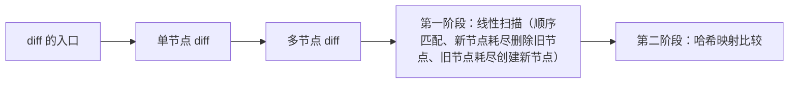

# React 源码（11） - Diff 算法

> 读完后，你应能完成以下任务：
> - 绘制“React 源码（11） - Diff 算法 / diff 的入口”的关键对象与数据流，解释“react diff 不管是 FunctionComponent 还是 HostComponent 都会来到 reconcileChildren，”，并用源码位置、日志或 Trace 标注证据。
> - 为“React 源码（11） - Diff 算法 / 单节点 diff”设计正常与异常输入，验证“diff 的时候，如果它是个 ReactElement 类型，则是单节点”，输出首个偏差位置与回归测试结果。
> - 实现“React 源码（11） - Diff 算法 / 多节点 diff”的最小代码或配置，检验“当一个组件的子节点列表发生变化时，Diff 算法会采用更复杂的策略来优化更新过程。”，输出命令、结果与 Diff，并说明不适用边界。

`packages/react-reconciler/src/ReactChildFiber.old.js`

<!-- article-progressive-block:start -->
# 一、先建立全局：Diff 算法 是什么？

理解“Diff 算法”，先要把标题中的对象放进同一条处理链：它接收什么输入，经过哪些状态变化，最终用什么证据判断结果。下表不另造概念，只把作者正文已经解释的章节按依赖顺序连起来。

“Diff 算法”的第一个核心判断是：react diff 不管是 FunctionComponent 还是 HostComponent 都会来到 reconcileChildren，。先弄清这个判断中的对象和输入输出，后面的实现、故障和验收才有共同语境。

| 顺序 | 章节 | 读完本节应抓住的结论 |
| --- | --- | --- |
| 1 | diff 的入口 | react diff 不管是 FunctionComponent 还是 HostComponent 都会来到 reconcileChildren， |
| 2 | 单节点 diff | diff 的时候，如果它是个 ReactElement 类型，则是单节点 |
| 3 | 多节点 diff | 当一个组件的子节点列表发生变化时，Diff 算法会采用更复杂的策略来优化更新过程。 |
| 4 | 第一阶段：线性扫描（顺序匹配、新节点耗尽删除旧节点、旧节点耗尽创建新节点） | 直到新旧列表中的某个指针到达末尾， |
| 5 | 第二阶段：哈希映射比较 | 第一阶段的线性扫描可以快速处理最常见的情况（列表末尾添加或不变） -> 第二阶段的哈希映射让查找复用节点的时间复杂度从 O(n) 降低到 O(1) -> lastPlacedIndex 的使用让 React 能够最小化 DOM 移动操作 |
| 6 | 示例 | 处理 B：从 Map 中找到，但因为 B 的原始位置(1) < lastPlacedIndex(2)，需要移动 |

## 1.1 核心对象之间怎样衔接



这张图只表达本文的讲解顺序，不替代正文机制。判断“Diff 算法”是否真正掌握，需要能从最后一个结果沿图回到前面每个章节的输入、状态变化和证据。

## 1.2 再看失败：问题最早会出现在哪一步？

在“Diff 算法”的对象和顺序已经明确后，再看可观察的失败：入口未命中、Lane 不符、更新丢失、重复提交或 DOM 结果不一致。定位时不从最后一条错误猜原因，而是沿上图找第一个偏离正文结论的节点。
<!-- article-progressive-block:end -->

# 二、diff 的入口

如下图，
`react diff` 不管是 `FunctionComponent` 还是 `HostComponent` 都会来到 `reconcileChildren`，
然后分为单节点 `reconcileSingleElement` 和 多节点 `reconcileChildrenArray` 的 `diff`(忽略一些别的情况，
如文本节点 diff)


# 三、单节点 diff

`diff` 的时候，如果它是个 `ReactElement` 类型，则是单节点

当新旧 Fiber 节点进行比较时，
Diff 算法会根据节点的类型（type）和 key 属性进行判断：

- 类型不同：如果新旧节点的 type 不同，React 会直接销毁旧节点及其子树，并创建新节点及其子树。例如，一个 <p> 标签变为 <div> 标签。

- 类型相同，但 key 不同：如果新旧节点的 type 相同，但 key 不同，React 也会销毁旧节点，并创建新节点。key 的作用是帮助 React 识别列表中的唯一元素，当 key 改变时，意味着元素本身发生了变化。

类型和 key 都相同：这是最理想的情况。
React 会复用旧的 Fiber 节点，并继续比较它们的属性（props）。
如果属性有变化，React 会标记该节点需要更新，并继续递归比较其子节点。
（但是 props 的比较在 `beginWork` 中）

# 四、多节点 diff

当一个组件的子节点列表发生变化时，Diff 算法会采用更复杂的策略来优化更新过程。
它会分两个阶段进行比较：

# 五、第一阶段：线性扫描（顺序匹配、新节点耗尽删除旧节点、旧节点耗尽创建新节点）

React 会从左到右线性扫描新旧两个列表，尝试直接按位置进行节点的复用。
这个阶段会处理以下几种情况：

- 更新：如果新旧节点在相同位置且 `key` 和 `type` 都相同，React 会复用旧节点并更新其属性，然后继续比较它们的子节点。

- 删除：如果旧列表中某个位置的节点在新列表中没有对应的 `key` 或 `type` 匹配，或者新列表提前结束，那么旧列表中剩余的节点会被标记为删除。

- 插入/移动：如果新列表中某个位置的节点在旧列表中没有对应的 `key` 或 `type` 匹配，或者在旧列表中找到了匹配但位置不同，那么该节点会被标记为插入或移动。

这个阶段会一直进行，
直到新旧列表中的某个指针到达末尾，
或者遇到第一个 `key` 或 `type` 不匹配的节点，
这个时候就会跳转到第二阶段进行哈希比较。

# 六、第二阶段：哈希映射比较

如果第一阶段没有完全匹配所有节点（即新旧列表的长度不同，
或者中间出现了不匹配的节点），
React 会进入第二阶段。
在这个阶段，
React 会将旧列表中剩余的未处理节点存储在一个 Map 结构中，
以 key 为键，
Fiber 节点为值。
需要特别指出的是react内部通过`lastPlacedIndex`机制来高效的判断哪些既有元素（在上次渲染中已存在的元素）需要移动位置，
哪些可以保持在原位。
lastPlacedIndex会被赋值为在上一个阶段中最后一个被成功复用且不需要移动的元素其原始索引（ oldIndex ），
如果没有，
则为0；

然后，React 会继续遍历新列表中剩余的未处理节点，并尝试在 Map 中查找匹配的 key：

- 找到匹配：如果在新列表中找到了一个节点，其 key 在 Map 中有匹配的旧节点，React 会比较这个旧元素的原始索引 ( current.index 或 oldIndex ) 与当前的 lastPlacedIndex
  - 如果 `oldIndex` < `lastPlacedIndex` ：这意味着这个旧元素在旧列表中的位置，比我们上一个放置的、不需要移动的元素的位置还要靠前。为了维持新列表的顺序，这个旧元素必须向右移动到新的位置。所以，React 会给这个元素的 Fiber 节点打上 Placement 标记，表示它需要被移动。
  - 如果 `oldIndex` >= `lastPlacedIndex` ：这意味着这个旧元素在旧列表中的位置，不小于（即等于或在其后）我们上一个放置的、不需要移动的元素的位置。这表明该元素可以保持其相对顺序，不需要移动。在这种情况下，React 会更新 lastPlacedIndex = oldIndex ，因为这个元素现在是新的 “最后一个不需要移动的元素” 中在旧列表里索引最大的那个。

-未找到匹配：如果一个新的子元素在旧列表中找不到对应的元素，那么它就是一个新插入的元素。
React 会为它创建一个新的 Fiber 节点，并打上 Placement 标记。
这种情况下，
lastPlacedIndex 通常不会因为这个插入操作而改变，
因为它只关心旧元素的位置。

最后，Map 中剩余的旧节点（即在新列表中没有找到匹配的节点）会被标记为删除。

这种两阶段的处理方式有几个重要的优势：

1. 第一阶段的线性扫描可以快速处理最常见的情况（列表末尾添加或不变）
2. 第二阶段的哈希映射让查找复用节点的时间复杂度从 O(n) 降低到 O(1)
3. lastPlacedIndex 的使用让 React 能够最小化 DOM 移动操作
这个算法在处理大型列表更新时特别高效，
因为它能够在保持较低时间复杂度的同时，
最小化 DOM 操作的次数。

# 七、示例

```js
// 旧列表
<ul>
  <li key="A">A</li>
  <li key="B">B</li>
  <li key="C">C</li>
  <li key="D">D</li>
</ul>

// 新列表
<ul>
  <li key="A">A</li>
  <li key="C">C</li>
  <li key="B">B</li>
  <li key="D">D</li>
</ul>
```

处理过程：

1. 第一阶段：

- A 可以直接复用
  到 B/C 时发现不匹配，进入第二阶段
- 第二阶段：

2. 将剩余的旧节点（B、C、D）放入 Map

- 处理 C：从 Map 中找到并复用，lastPlacedIndex = 2
- 处理 B：从 Map 中找到，但因为 B 的原始位置(1) < lastPlacedIndex(2)，需要移动
- 处理 D：从 Map 中找到并复用，位置正确

<!-- article-progressive-block:start -->
# 八、动手验证：先跑通 Diff 算法，再改变一个变量

前面的章节已经建立问题、概念和机制。现在把“Diff 算法”放进同一套基线中运行；本节不再引入新术语，只验证前文结论能否被复现。

## 8.1 基线与候选只允许一个变量不同

验证“Diff 算法”时，先固定React 版本、组件输入、更新触发方式和浏览器事件。候选方案只能改变本次要验证的变量；如果同时更换数据、依赖和配置，即使结果改善，也不能知道是哪一项产生作用。

执行“Diff 算法”时，动作是：在对应源码入口设置断点，记录 Fiber、Lane、UpdateQueue 与提交阶段变化。原始结果不能只保留截图或汇总分数，必须同步保存：调用栈、Fiber 字段快照、Scheduler 任务、DOM 断言和源码行号，使下一次复查可以在同一输入上重放。

| 实验要素 | 本文要求 |
| --- | --- |
| 固定条件 | 固定 React 版本、组件输入、更新触发方式和浏览器事件 |
| 唯一变量 | 本次候选方案与基线之间的一项明确差异 |
| 原始证据 | 调用栈、Fiber 字段快照、Scheduler 任务、DOM 断言和源码行号 |
| 通过阈值 | 调用顺序与正文一致，状态变化能对应到最终 DOM 或副作用 |
| 立即停止 | 入口未命中、Lane 不符、更新丢失、重复提交或 DOM 结果不一致 |

## 8.2 执行前先排除不可比较条件

“Diff 算法”开始前先确认下面四项；任一项不成立，都应先修复实验条件，而不是解释结果。

- 基线能够在“Diff 算法”的当前环境重复运行。
- 候选只改变一个与“Diff 算法”结论直接相关的条件。
- “Diff 算法”的基线和候选使用同一批输入、同一版本依赖与同一通过阈值。
- “Diff 算法”的原始输出和失败现场不会被重试、格式化或汇总覆盖。

## 8.3 执行后先核对证据完整性

结果出来后先检查证据，再讨论“Diff 算法”是否通过。缺少中间状态时，最终输出只能说明现象，不能证明机制。

| 检查项 | 当前文章的判定 |
| --- | --- |
| 输入可追溯 | 固定 React 版本、组件输入、更新触发方式和浏览器事件 |
| 过程可回放 | 在对应源码入口设置断点，记录 Fiber、Lane、UpdateQueue 与提交阶段变化 |
| 结果可审计 | 调用栈、Fiber 字段快照、Scheduler 任务、DOM 断言和源码行号 |

“Diff 算法”的一次合格基线对照按以下顺序执行：

1. 保存“Diff 算法”基线版本及输入摘要，确认基线本身可以重复运行。
2. 写下“Diff 算法”候选方案唯一变化的变量，以及它预期影响的指标。
3. 在同一环境执行“Diff 算法”：在对应源码入口设置断点，记录 Fiber、Lane、UpdateQueue 与提交阶段变化。
4. 为“Diff 算法”保存：调用栈、Fiber 字段快照、Scheduler 任务、DOM 断言和源码行号。
5. 使用“Diff 算法”预登记条件判断：调用顺序与正文一致，状态变化能对应到最终 DOM 或副作用。
6. 如果“Diff 算法”未通过，不修改第二个变量，先恢复基线并保留失败现场。

# 九、用一张矩阵验证 Diff 算法 的关键结论

矩阵按正文顺序列出“Diff 算法”的结论。一次实验只选择一行，只改变这一行对应的条件；不要把多行合并成一个无法归因的大实验。

| 正文章节 | 已解释的结论 | 本轮唯一变量 | 必须保存的证据 |
| --- | --- | --- | --- |
| diff 的入口 | react diff 不管是 FunctionComponent 还是 HostComponent 都会来到 reconcileChildren， | 只改变与“diff 的入口”相关的条件 | 调用栈、Fiber 字段快照、Scheduler 任务、DOM 断言和源码行号 |
| 单节点 diff | diff 的时候，如果它是个 ReactElement 类型，则是单节点 | 只改变与“单节点 diff”相关的条件 | 调用栈、Fiber 字段快照、Scheduler 任务、DOM 断言和源码行号 |
| 多节点 diff | 当一个组件的子节点列表发生变化时，Diff 算法会采用更复杂的策略来优化更新过程。 | 只改变与“多节点 diff”相关的条件 | 调用栈、Fiber 字段快照、Scheduler 任务、DOM 断言和源码行号 |
| 第一阶段：线性扫描（顺序匹配、新节点耗尽删除旧节点、旧节点耗尽创建新节点） | 直到新旧列表中的某个指针到达末尾， | 只改变与“第一阶段：线性扫描（顺序匹配、新节点耗尽删除旧节点、旧节点耗尽创建新节点）”相关的条件 | 调用栈、Fiber 字段快照、Scheduler 任务、DOM 断言和源码行号 |
| 第二阶段：哈希映射比较 | 第一阶段的线性扫描可以快速处理最常见的情况（列表末尾添加或不变） -> 第二阶段的哈希映射让查找复用节点的时间复杂度从 O(n) 降低到 O(1) -> lastPlacedIndex 的使用让 React 能够最小化 DOM 移动操作 | 只改变与“第二阶段：哈希映射比较”相关的条件 | 调用栈、Fiber 字段快照、Scheduler 任务、DOM 断言和源码行号 |
| 示例 | 处理 B：从 Map 中找到，但因为 B 的原始位置(1) < lastPlacedIndex(2)，需要移动 | 只改变与“示例”相关的条件 | 调用栈、Fiber 字段快照、Scheduler 任务、DOM 断言和源码行号 |

## 9.1 记录本次实际实验

下面的记录用于“Diff 算法”当前这一次实验，不是第二套知识目录。先从矩阵选择一个章节，再填写实际值；没有填写的字段表示尚未验证。

```yaml
topic: "Diff 算法"
selected_chapter: required
claim_from_article: required
baseline_version: required
changed_condition: exactly_one
execution: "在对应源码入口设置断点，记录 Fiber、Lane、UpdateQueue 与提交阶段变化"
evidence: "调用栈、Fiber 字段快照、Scheduler 任务、DOM 断言和源码行号"
pass_when: "调用顺序与正文一致，状态变化能对应到最终 DOM 或副作用"
stop_when: "入口未命中、Lane 不符、更新丢失、重复提交或 DOM 结果不一致"
observed_result: required
first_deviation: null_or_evidence
recovery_replay: required_after_failure
```

## 9.2 边界实验必须证明能够停止和恢复

成功路径只能证明“Diff 算法”在当前样本上工作，不能证明它可以进入生产。边界实验需要主动制造：入口未命中、Lane 不符、更新丢失、重复提交或 DOM 结果不一致，并观察系统是否在产生不可逆副作用前停止。

| 场景 | 只改变什么 | 应保存什么 | 通过标准 |
| --- | --- | --- | --- |
| 正常路径 | 使用已知有效输入 | 调用栈、Fiber 字段快照、Scheduler 任务、DOM 断言和源码行号 | 调用顺序与正文一致，状态变化能对应到最终 DOM 或副作用 |
| 边界路径 | 把一个输入推进到约束临界值 | 临界值前后的输出与指标 | 不静默降级，不把部分结果冒充成功 |
| 明确失败 | 注入：入口未命中、Lane 不符、更新丢失、重复提交或 DOM 结果不一致 | 原始错误、首个异常阶段和最终状态 | 失败被正确分类且没有扩大副作用 |
| 恢复重放 | 执行：从首个错误状态回查 Update 入队、调度、协调和提交边界 | 原失败样本的复测证据 | 原样本恢复，正常样本没有回归 |

恢复动作不是简单重启。对于“Diff 算法”，第一步是：从首个错误状态回查 Update 入队、调度、协调和提交边界。完成后使用原始失败样本复测；只验证一个新样本成功，不能证明触发条件已经消失。

“Diff 算法”边界实验结束后，应把正常、临界、失败和恢复四类记录放在同一个运行批次中。这样才能区分“候选方案真的修复问题”和“环境变化让问题暂时没有出现”。

# 十、Diff 算法 的结果解释

解释“Diff 算法”实验时先看首个偏差，而不是最后一条错误。最后的异常通常只是上游状态错误的结果；从末端反推容易误把症状当根因。

| 观察结果 | 可以支持的判断 | 下一步 |
| --- | --- | --- |
| 主链路没有达到预期 | 入口未命中、Lane 不符、更新丢失、重复提交或 DOM 结果不一致 | 先执行：从首个错误状态回查 Update 入队、调度、协调和提交边界 |
| 异常链路无法恢复 | 入口未命中、Lane 不符、更新丢失、重复提交或 DOM 结果不一致 | 先执行：从首个错误状态回查 Update 入队、调度、协调和提交边界 |
| 新样本成功但原样本仍失败 | 修复没有覆盖原始触发条件 | 固定原失败输入，恢复基线后重新比较 |
| 指标改善但证据无法回链 | 数据、版本或中间状态没有固定 | 暂停发布，补齐可追溯记录后重跑 |

“Diff 算法”只有同时满足“调用顺序与正文一致，状态变化能对应到最终 DOM 或副作用”，并且没有出现“入口未命中、Lane 不符、更新丢失、重复提交或 DOM 结果不一致”，才可以认为主链路通过。这里的“通过”只对当前固定版本、样本和环境有效，不能外推到尚未测试的容量、权限或数据分布。

如果“Diff 算法”候选方案与基线差异很小，先检查证据分辨率是否足够；如果差异很大，先排除数据泄漏、环境漂移和版本不一致。两种情况都不能只看一个汇总均值，需要回到逐样本输出和中间状态。

“Diff 算法”故障定位完成后，记录“现象、首个偏差、根因、改动、原样本复测”五项。缺少原样本复测时，只能标记为待观察，不能标记为已解决。

# 十一、Diff 算法 的发布判断

发布判断需要把“Diff 算法”的质量、失败边界和恢复能力放在同一份记录中。以下任一条件缺失，都应停止扩量，而不是用“基本正常”替代证据。

- [ ] “Diff 算法”的基线与候选只存在一个计划内变量。
- [ ] “Diff 算法”的输入、代码、依赖、配置和数据版本可以追溯。
- [ ] “Diff 算法”的正常、临界、失败和恢复样本使用同一套断言。
- [ ] “Diff 算法”的原始输出、中间状态和失败现场已经保留。
- [ ] “Diff 算法”的日志、Trace、截图和测试数据已经脱敏。
- [ ] “Diff 算法”的停止条件、负责人和回滚入口已经演练。
- [ ] “Diff 算法”尚未覆盖的输入、权限、容量和外部依赖已经登记。

最终记录至少包含基线版本、唯一变量、原始证据、首个偏差、恢复复测和发布责任人。没有参与本次修改的人如果不能据此重放“Diff 算法”的判断，就不能发布。
<!-- article-progressive-block:end -->

# 十二、总结

- **单节点 diff**：diff 的时候，如果它是个 ReactElement 类型，则是单节点
- **第一阶段：线性扫描（顺序匹配、新节点耗尽删除旧节点、旧节点耗尽创建新节点）**：这个阶段会一直进行，直到新旧列表中的某个指针到达末尾，或者遇到第一个 key 或 type 不匹配的节点，这个时候就会跳转到第二阶段进行哈希比较。
- **工程边界**：为了维持新列表的顺序，这个旧元素必须向右移动到新的位置。
- **实现机制**：需要特别指出的是react内部通过lastPlacedIndex机制来高效的判断哪些既有元素（在上次渲染中已存在的元素）需要移动位置，哪些可以保持在原位。

## 参考资料

- [React 文档](https://react.dev/learn)
- [React 源码](https://github.com/facebook/react)
