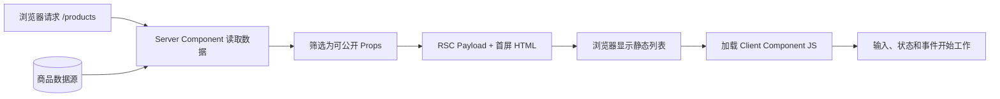

# Next.js（02） - Server Component 与 Client Component

> 读完后，你应能完成以下任务：
> - 绘制“Next.js（02） - Server Component 与 Client Component / 先别问“这个组件在哪渲染”，先问“浏览器需要拿到什么””的关键对象与数据流，解释“App Router 的 page.tsx 和 layout.tsx 默认是 Server Component。”，并用源码位置、日志或 Trace 标注证据。
> - 为“Next.js（02） - Server Component 与 Client Component / 一次页面请求经过了什么”设计正常与异常输入，验证“首次请求时，Next.js 会在服务端协调 Server Component 和 Client Component：Server Component 生成 React Server Component Payload，Client Component 相关信息用于生成首屏 HTML；”，输出首个偏差位置与回归测试结果。
> - 实现“Next.js（02） - Server Component 与 Client Component / 两类组件怎么选”的最小代码或配置，检验“最稳妥的默认做法是“服务端页面 + 客户端叶子”。”，输出命令、结果与 Diff，并说明不适用边界。

> 本文面向已经会 React 组件、但还习惯先写 `'use client'` 的开发者，示例基于 Next.js 16.3.0。读完后，你能根据数据、交互和安全边界决定组件放在哪里，并能解释一行 `'use client'` 会怎样改变依赖图和浏览器负担。

# 一、先别问“这个组件在哪渲染”，先问“浏览器需要拿到什么”

App Router 的 `page.tsx` 和 `layout.tsx` 默认是 Server Component。它们可以直接读取数据库、文件系统或内部服务，也可以把不需要交互的 UI 在服务端准备好。这样做的关键价值不是“服务器比浏览器快”，而是 **数据库驱动、密钥和大体积依赖不必进入客户端 JavaScript**。

Client Component 解决另一类问题：点击事件、输入状态、Effect、Context、`window`、`localStorage` 等浏览器能力。文件顶部的 `'use client'` 不是“只在浏览器渲染”的开关，而是客户端模块图的入口。这个文件静态导入的模块通常也会进入客户端依赖图，所以边界放得越高，浏览器需要下载、解析和 hydration 的代码越多。

本文完成后的可验证结果是：

- 能区分 Server Component、Client Component 和“首次在服务端生成 HTML”这三个概念。
- 能把数据读取留在服务端，只把可序列化、允许公开的数据传给交互叶子。
- 能识别 `'use client'` 上移造成的包体、安全和 hydration 风险。
- 能为第三方交互组件、Context Provider 和服务端 `children` 选择合适边界。

# 二、一次页面请求经过了什么

首次请求时，Next.js 会在服务端协调 Server Component 和 Client Component：Server Component 生成 React Server Component Payload，Client Component 相关信息用于生成首屏 HTML；浏览器随后用 Payload 对齐组件树，再下载客户端 JavaScript 完成 hydration。后续导航可以复用已加载的客户端代码，并通过 Payload 更新必要部分。



`DIAGRAM_DESCRIPTION`：图中必须包含浏览器请求、Server Component 数据读取、服务端数据裁剪、RSC Payload 与首屏 HTML、客户端 hydration 和用户交互，重点说明传给 Client Component 的 Props 已经跨过公开边界。

## 2.1 两类组件怎么选

| 判断问题 | Server Component | Client Component |
|---|---|---|
| 需要访问数据库、私有 API 或密钥吗 | 适合 | 不应直接访问 |
| 需要 `useState`、事件或浏览器 API 吗 | 不支持 | 适合 |
| 代码会进入客户端模块图吗 | 不会作为组件 JS 下发 | 会 |
| Props 能否跨边界 | 可以向客户端传可序列化数据 | 接收后数据对浏览器可见 |
| 典型职责 | 查询、鉴权、数据裁剪、静态内容 | 表单、筛选、弹窗、实时交互 |

最稳妥的默认做法是“服务端页面 + 客户端叶子”。不要先给整个页面加 `'use client'` 再逐步补救，因为一旦边界上移，它下面的静态导入都会受到影响。

## 2.2 Server Component 不等于传统 SSR

传统 SSR 常见模式是服务端生成 HTML，客户端再用同一套组件 JavaScript hydration。Server Component 本身不会作为组件 JavaScript 发到浏览器，它的结果通过 RSC Payload 表达。Client Component 在首次访问时仍可参与服务端预渲染，所以“Client Component”也不等于“首屏一定只在浏览器生成”。

这个区别能解释两个常见误区：看到首屏 HTML 不代表组件是 Server Component；文件没有 `'use client'` 也不代表其中的数据可以不做权限判断。

# 三、做一个服务端取数、客户端筛选的商品页

示例目标很具体：服务端拿到商品和内部成本，只把 `id`、`name` 传给浏览器；浏览器负责即时筛选。内部成本不应出现在 HTML、RSC Payload 或客户端 Props 中。

## 3.1 创建项目和文件

```bash
pnpm create next-app@16.3.0 next-component-boundary \
  --ts --eslint --app --use-pnpm --empty --yes \
  --import-alias "@/*"
cd next-component-boundary
pnpm add server-only@0.0.1
```

保留脚手架配置，删除示例 `app/page.tsx`，新增：

```text
next-component-boundary/
├── app/
│   └── products/
│       ├── page.tsx
│       └── product-filter.tsx
└── lib/
    └── products.ts
```

## 3.2 服务端模块只返回允许公开的数据

```typescript
// lib/products.ts
import 'server-only'

/** 数据源中的完整商品，包含不能下发到浏览器的内部成本。 */
interface ProductRecord {
  /** 商品稳定 ID。 */
  id: string
  /** 商品展示名称。 */
  name: string
  /** 仅供内部使用的成本，不能进入客户端 Props。 */
  internalCost: number
}

/** 允许跨 Server/Client 边界的公开商品字段。 */
export interface PublicProduct {
  /** 商品稳定 ID。 */
  id: string
  /** 商品展示名称。 */
  name: string
}

/** 模拟数据库中的完整商品记录。 */
const PRODUCT_RECORDS: readonly ProductRecord[] = [
  { id: 'p1', name: 'Keyboard', internalCost: 120 },
  { id: 'p2', name: 'Monitor', internalCost: 800 }
]

/** 在服务端读取数据，并显式裁剪为允许公开的字段。 */
export async function listPublicProducts(): Promise<PublicProduct[]> {
  return PRODUCT_RECORDS.map(({ id, name }) => ({ id, name }))
}
```

`server-only` 会在这个模块被 Client Component 导入时给出构建错误，防止服务端模块误入客户端依赖图。真正的安全边界仍是数据访问层：返回值必须主动裁剪，不能把完整数据库对象传给客户端后再靠 UI 隐藏字段。

## 3.3 页面取数，交互组件只管筛选

```tsx
// app/products/page.tsx
import { listPublicProducts } from '@/lib/products'
import { ProductFilter } from './product-filter'

/** 在服务端读取公开商品，并把交互交给客户端叶子。 */
export default async function ProductsPage() {
  /** 已完成权限判断和字段裁剪的公开商品。 */
  const products = await listPublicProducts()

  return (
    <main>
      <h1>商品</h1>
      <ProductFilter products={products} />
    </main>
  )
}
```

```tsx
// app/products/product-filter.tsx
'use client'

import { useMemo, useState } from 'react'
import type { PublicProduct } from '@/lib/products'

/** 商品筛选组件接收的公开数据。 */
interface ProductFilterProps {
  /** 服务端已经完成裁剪的商品列表。 */
  products: PublicProduct[]
}

/** 在浏览器中按名称即时筛选商品。 */
export function ProductFilter({ products }: ProductFilterProps) {
  /** 用户当前输入的筛选词。 */
  const [keyword, setKeyword] = useState('')
  /** 与筛选词匹配的可见商品。 */
  const visibleProducts = useMemo(() => {
    /** 用于忽略大小写和首尾空格的规范关键词。 */
    const normalizedKeyword = keyword.trim().toLowerCase()
    return products.filter((product) => product.name.toLowerCase().includes(normalizedKeyword))
  }, [keyword, products])

  return (
    <section>
      <label>
        筛选商品
        <input
          value={keyword}
          onChange={(event) => setKeyword(event.target.value)}
          placeholder="输入 keyboard"
        />
      </label>
      <ul>
        {visibleProducts.map((product) => <li key={product.id}>{product.name}</li>)}
      </ul>
    </section>
  )
}
```

静态审查时确认三点：`products.ts` 有 `server-only`；传入客户端的类型没有 `internalCost`；`'use client'` 只出现在真正使用状态和事件的叶子文件。

运行和验收方法：

```bash
pnpm dev
# 浏览器访问 http://localhost:3000/products
pnpm build
```

输入 `key` 时列表只剩 `Keyboard`；清空输入后两项恢复。浏览器页面源码和开发工具数据中不应出现 `internalCost`。

# 四、复杂组件树怎么保持边界清楚

## 4.1 Client Component 可以接收服务端 children

客户端外壳可以接收 Server Component 生成的 `children`。这相当于服务端先把内容准备好，再把它插进需要交互的客户端“槽位”，不会因为外壳是客户端组件就自动把服务端子树改成客户端代码。

适用场景包括可开关弹窗、抽屉和带客户端状态的布局壳。关键限制是：Client Component 不能在自己的模块中直接导入 Server Component，再期待它保持服务端语义；应由共同的 Server Component 父级完成组合。

## 4.2 Provider 放多深，客户端边界就影响多大

Context Provider 必须是 Client Component，但不等于要包住整个 `<html>`。主题 Provider 可以包住 `body`；只服务编辑器的 Provider 应放到编辑器子树。Provider 越靠近叶子，Next.js 越容易静态优化外围内容，客户端包也更容易控制。

第三方组件如果使用状态或浏览器 API，却没有在入口声明 `'use client'`，可以写一个很薄的本地包装组件。不要把整个页面改成客户端组件来迁就一个按钮。

# 五、安全和生产边界不能靠组件类型兜底

- **客户端拿到的数据就是公开数据。** 即使页面没有展示，Props、RSC Payload 或请求响应仍可能被检查。
- **`NEXT_PUBLIC_` 会把值内联进客户端包。** 构建后修改服务器环境变量也不会替换已公开值，密钥不得使用这个前缀。
- **服务端也必须鉴权。** Server Component、Server Action 和 Route Handler 是不同入口，不能因为页面查过会话就省略下层资源级授权。
- **不要把完整 ORM 实体跨边界传递。** 在数据访问层建立显式 DTO，只返回当前 UI 确实需要且允许公开的字段。
- **关注客户端包变化。** 给高层文件加 `'use client'` 时，应比较构建分析结果，而不是只确认页面还能运行。

# 六、常见问题怎么定位

| 现象 | 根因 | 怎么定位 | 修复方式 | 防止复发 |
|---|---|---|---|---|
| `useState` 或 `onClick` 报 Server Component 错误 | 交互逻辑写在默认服务端文件 | 从报错文件向上找最近的客户端边界 | 把最小交互部分下沉到独立 Client Component | 组件评审先标注数据和交互边界 |
| 客户端构建出现 `fs`、数据库驱动错误 | Client Component 静态导入了服务端模块 | 沿 import 链找到第一个 `'use client'` | 服务端取数后传 DTO，并给服务端模块加 `server-only` | lint 或架构测试禁止客户端导入服务端目录 |
| 页面 hydration mismatch | 首次服务端输出与浏览器首次渲染不同 | 比较服务端 HTML 与 hydration 前状态，检查时间、随机数和浏览器 API | 把不稳定值移到 Effect，或从服务端传稳定初值 | 对时间和随机值建立固定输入测试 |
| 一个小按钮让整页 JS 明显增大 | `'use client'` 放在页面或高层布局 | 使用 bundle analyzer 比较改动前后客户端模块 | 只把按钮及其必要状态下沉为客户端叶子 | 对关键路由设置客户端包体预算 |
| 页面没显示成本字段，但浏览器能找到 | 完整对象已经作为 Props 跨边界 | 检查 RSC 响应、Props 类型和数据访问返回值 | 服务端显式映射公开 DTO | 安全测试扫描敏感字段名和样例值 |

# 七、完成后按什么验收

- [ ] 默认页面和布局保持 Server Component，没有无理由的 `'use client'`。
- [ ] 每个 Client Component 都能说明自己需要的状态、事件或浏览器 API。
- [ ] 服务端模块使用 `server-only`，客户端 import 链没有数据库或文件系统模块。
- [ ] 跨边界 Props 可序列化，并经过权限过滤和字段裁剪。
- [ ] 浏览器响应、源码和客户端状态中没有密钥或内部字段。
- [ ] 客户端包体变化有对比依据，关键页面没有因边界上移明显膨胀。
- [ ] 静态正文在 JavaScript 尚未 hydration 时仍能显示。

## 学完自测

## 7.1 场景选择：搜索框放在哪里

商品页需要从数据库读取商品，并支持浏览器内即时筛选。哪种结构最合理？

A. 整个 `page.tsx` 加 `'use client'`，在浏览器连接数据库。  
B. Server Component 查询并裁剪商品，Client Component 接收公开字段并负责筛选。  
C. Server Component 使用 `useState` 保存筛选词。  
D. 把数据库连接对象作为 Props 传给 Client Component。

**答案：B。** 数据库访问和字段裁剪属于服务端，输入状态和事件属于客户端。A 会暴露错误边界且浏览器不能安全直连数据库；C 使用了 Server Component 不支持的状态 Hook；D 既不可序列化，也泄露服务端能力。

## 7.2 多选：'use client' 到底意味着什么

哪些说法正确？

A. 它定义客户端模块图的入口。  
B. 文件静态导入的模块可能进入客户端依赖图。  
C. Client Component 首次访问时绝不会生成服务端 HTML。  
D. 传给 Client Component 的数据应视为浏览器可见。

**答案：A、B、D。** Client Component 首次请求仍可参与服务端预渲染，因此 C 错。工程上应把边界放到交互叶子，并把跨边界数据当成公开数据审查。

## 7.3 故障分析：为什么成本字段泄露了

页面把完整商品 ORM 对象传给客户端表格，表格只渲染名称。安全测试仍在响应中发现 `internalCost`。应该怎么修？

**答案：** 根因是“未渲染”被误当成“未下发”。应在服务端数据访问层映射为明确的公开 DTO，只传 `id`、`name` 等允许字段，并增加响应扫描测试。仅从 JSX 删除成本列不会改变已经跨边界的数据。

## 7.4 架构设计：Provider 应该放多高

一个编辑器页面需要专用 Context，站内其他页面不用。Provider 应放在根布局还是编辑器子树？

**答案：** 放在编辑器子树。Context Provider 必须是 Client Component，放在根布局会扩大客户端边界和 hydration 范围。只有真正全站共享且依赖客户端状态的能力，才有理由提升到更高层。

# 八、总结

- **先别问“这个组件在哪渲染”，先问“浏览器需要拿到什么”**：App Router 的 page.tsx 和 layout.tsx 默认是 Server Component。
- **一次页面请求经过了什么**：首次请求时，Next.js 会在服务端协调 Server Component 和 Client Component：Server Component 生成 React Server Component Payload，Client Component 相关信息用于生成首屏 HTML；
- **做一个服务端取数、客户端筛选的商品页**：真正的安全边界仍是数据访问层：返回值必须主动裁剪，不能把完整数据库对象传给客户端后再靠 UI 隐藏字段。
- **复杂组件树怎么保持边界清楚**：这相当于服务端先把内容准备好，再把它插进需要交互的客户端“槽位”，不会因为外壳是客户端组件就自动把服务端子树改成客户端代码。
- **安全和生产边界不能靠组件类型兜底**：客户端拿到的数据就是公开数据。
- **常见问题怎么定位**：| useState 或 onClick 报 Server Component 错误 | 交互逻辑写在默认服务端文件 | 从报错文件向上找最近的客户端边界 | 把最小交互部分下沉到独立 Client Component | 组件评审先标注数据和交互边界 |

## 参考资料

- [Next.js：Server and Client Components](https://nextjs.org/docs/app/getting-started/server-and-client-components)
- [Next.js：Data Security](https://nextjs.org/docs/app/guides/data-security)
- [Next.js：Environment Variables](https://nextjs.org/docs/app/guides/environment-variables)
- [React：Server Components](https://react.dev/reference/rsc/server-components)
