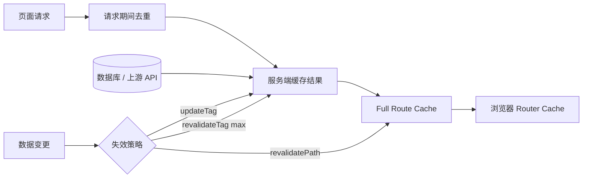

# Next.js（03） - 数据获取、缓存与重新验证

> 读完后，你应能完成以下任务：
> - 绘制“Next.js（03） - 数据获取、缓存与重新验证 / 先回答“允许旧多久”，再决定要不要缓存”的关键对象与数据流，解释“缓存不是一个让页面自动变快的开关。”，并用源码位置、日志或 Trace 标注证据。
> - 为“Next.js（03） - 数据获取、缓存与重新验证 / Next.js 里不是只有一个缓存”设计正常与异常输入，验证“DIAGRAM_DESCRIPTION：图中必须包含请求内去重、服务端数据缓存、Full Route Cache、浏览器 Router Cache、真实数据源和三种失效入口，重点表达“清理某一层不等于所有层立即消失”。”，输出首个偏差位置与回归测试结果。
> - 实现“Next.js（03） - 数据获取、缓存与重新验证 / 四层分别解决什么问题”的最小代码或配置，检验“Next.js 16 推荐通过 Cache Components 和 'use cache' 清楚标记要复用的函数、组件或文件，避免读者靠猜默认行为。”，输出命令、结果与 Diff，并说明不适用边界。

> 本文面向已经会在 Server Component 中取数、但遇到过“数据库更新了，页面还是旧的”问题的开发者，示例基于 Next.js 16.3.0。读完后，你能分清请求去重、服务端数据缓存、完整路由缓存和浏览器 Router Cache，并能按业务一致性选择 TTL、`updateTag`、`revalidateTag` 或 `revalidatePath`。

# 一、先回答“允许旧多久”，再决定要不要缓存

缓存不是一个让页面自动变快的开关。它用“暂时复用旧结果”换取更少的数据库或上游请求，因此第一个问题永远不是“缓存几分钟”，而是：

- 这份数据允许旧多久？价格、库存和文章正文的答案通常不同。
- 谁能触发更新？只有后台编辑，还是外部 Webhook 也会改？
- 写入成功后，当前操作者是否必须立刻读到新值？
- 数据是否按用户、角色或租户变化？缓存键能否完整表达这些维度？
- 缓存失效失败时，应该继续展示旧值、降级，还是阻断请求？

没有这些约束，常见结果是两种极端：所有请求都不缓存，数据库被重复读取；或者所有页面缓存五分钟，用户修改后一直看到旧数据。

本文完成后的可验证结果是：

- 能画出一次读取经过的缓存层，并知道旧数据可能停在哪一层。
- 能用 Next.js 16 Cache Components 显式缓存函数并附加业务标签。
- 能区分 `updateTag` 的写后读一致性与 `revalidateTag(tag, 'max')` 的 stale-while-revalidate。
- 能为公共数据、用户私有数据和强一致库存分别制定策略。

# 二、Next.js 里不是只有一个缓存



`DIAGRAM_DESCRIPTION`：图中必须包含请求内去重、服务端数据缓存、Full Route Cache、浏览器 Router Cache、真实数据源和三种失效入口，重点表达“清理某一层不等于所有层立即消失”。

## 2.1 四层分别解决什么问题

| 层次 | 生命周期 | 解决的问题 | 常见误区 |
|---|---|---|---|
| 请求期间去重 | 一次服务端渲染 | 同一请求内避免重复执行相同读取 | 误以为它会跨请求保存结果 |
| 服务端数据缓存 | 跨请求、跨部署策略而定 | 减少数据库或 API 回源 | 缓存键漏掉租户、语言或权限维度 |
| Full Route Cache | 服务端持久化路由输出 | 复用静态生成的 HTML 与 RSC Payload | 数据变了只刷新浏览器，不失效服务端输出 |
| Router Cache | 当前浏览器会话 | 加快已访问 segment 的客户端导航 | 以为 `router.refresh()` 会删除服务端数据缓存 |

React 会在服务端渲染期间对相同的 `GET`/`HEAD` `fetch` 做请求记忆化；它只服务当前渲染过程。跨请求缓存需要显式策略。Next.js 16 推荐通过 Cache Components 和 `'use cache'` 清楚标记要复用的函数、组件或文件，避免读者靠猜默认行为。

## 2.2 两种缓存模式不要混着讲

启用 `cacheComponents: true` 后，可以使用 `'use cache'`、`cacheLife` 和 `cacheTag`。未启用 Cache Components 的项目仍可使用 `fetch` 的 `cache: 'force-cache'`、`next.revalidate` 等传统方式，但团队应在升级时明确当前模式，不要在同一段代码里同时堆多套语义。

本文示例使用 Cache Components，因为缓存范围、生命周期和标签都能放在被缓存函数旁边，代码评审时更容易看懂。

# 三、做一个可以观察缓存命中和主动失效的页面

示例不连接外部服务，而是缓存一个带生成时间的商品快照。重复刷新时生成时间保持不变；点击按钮调用 Server Action 和 `updateTag` 后，下一次读取会产生新快照。这能单独验证缓存机制，不把数据库安装混进本篇。

## 3.1 创建项目并启用 Cache Components

```bash
pnpm create next-app@16.3.0 next-cache-lab \
  --ts --eslint --app --use-pnpm --empty --yes \
  --import-alias "@/*"
cd next-cache-lab
```

文件结构：

```text
next-cache-lab/
├── next.config.ts
├── lib/
│   └── product-snapshot.ts
└── app/
    └── products/
        └── [id]/
            ├── actions.ts
            └── page.tsx
```

```typescript
// next.config.ts
import type { NextConfig } from 'next'

/** 为示例启用 Next.js 16 Cache Components。 */
const nextConfig: NextConfig = {
  cacheComponents: true
}

export default nextConfig
```

## 3.2 给缓存结果设置生命周期和业务标签

```typescript
// lib/product-snapshot.ts
import { cacheLife, cacheTag } from 'next/cache'

/** 页面展示的商品快照。 */
export interface ProductSnapshot {
  /** 商品稳定 ID。 */
  id: string
  /** 商品展示名称。 */
  name: string
  /** 本次缓存结果生成时的时间戳。 */
  generatedAt: number
}

/** 允许进入缓存键和标签的商品 ID。 */
const PRODUCT_ID_PATTERN = /^[a-zA-Z0-9_-]+$/

/** 商品 ID 允许的最多字符数。 */
const MAX_PRODUCT_ID_LENGTH = 64

/** 返回可复用的商品快照，并按商品 ID 建立精确失效标签。 */
export async function getProductSnapshot(productId: string): Promise<ProductSnapshot> {
  'use cache'

  if (!PRODUCT_ID_PATTERN.test(productId) || productId.length > MAX_PRODUCT_ID_LENGTH) {
    throw new Error('INVALID_PRODUCT_ID')
  }

  cacheLife({
    stale: 30, // 客户端 30 秒内可直接复用已有结果。
    revalidate: 60, // 60 秒后允许后台重新生成。
    expire: 300 // 300 秒后没有新结果就必须等待重新生成。
  })
  cacheTag(`product:${productId}`)

  return {
    id: productId,
    name: productId === 'p1' ? 'Keyboard' : 'Unknown Product',
    generatedAt: Date.now()
  }
}
```

`stale`、`revalidate` 和 `expire` 都是秒。它们不是通用推荐值，只是让本地实验容易观察。生产值要来自业务陈旧容忍度、回源成本和更新频率。

## 3.3 用 updateTag 做写后读一致

```typescript
// app/products/[id]/actions.ts
'use server'

import { updateTag } from 'next/cache'

/** 允许主动刷新的商品 ID。 */
const PRODUCT_ID_PATTERN = /^[a-zA-Z0-9_-]+$/

/** 商品 ID 允许的最多字符数。 */
const MAX_PRODUCT_ID_LENGTH = 64

/** 让当前 Server Action 后的下一次读取获得新商品快照。 */
export async function refreshProductSnapshot(productId: string): Promise<void> {
  if (!PRODUCT_ID_PATTERN.test(productId) || productId.length > MAX_PRODUCT_ID_LENGTH) {
    throw new Error('INVALID_PRODUCT_ID')
  }

  // 真实写操作必须先鉴权并提交数据库，再失效对应业务标签。
  updateTag(`product:${productId}`)
}
```

```tsx
// app/products/[id]/page.tsx
import { getProductSnapshot } from '@/lib/product-snapshot'
import { refreshProductSnapshot } from './actions'

/** 商品快照页接收的动态路由参数。 */
interface ProductPageProps {
  /** Next.js 延迟解析的商品 ID。 */
  params: Promise<{ id: string }>
}

/** 展示缓存快照，并提供主动失效按钮。 */
export default async function ProductPage({ params }: ProductPageProps) {
  /** URL 中的商品 ID。 */
  const { id } = await params
  /** 当前缓存返回的商品快照。 */
  const product = await getProductSnapshot(id)
  /** 绑定当前商品 ID 的刷新 Action。 */
  const refreshCurrentProduct = refreshProductSnapshot.bind(null, id)

  return (
    <main>
      <h1>{product.name}</h1>
      <p>快照时间：{new Date(product.generatedAt).toISOString()}</p>
      <form action={refreshCurrentProduct}>
        <button type="submit">生成新快照</button>
      </form>
    </main>
  )
}
```

运行和验收方法：

```bash
pnpm dev
# 访问 http://localhost:3000/products/p1
pnpm build
```

在短时间内刷新页面，快照时间应保持不变；点击“生成新快照”后，页面重新读取并显示新的时间。静态审查时确认缓存函数声明了 `'use cache'`，标签包含商品 ID，Action 在失效前校验了同一 ID。

# 四、四种失效手段怎么选

| 手段 | 适用场景 | 一致性表现 | 代价与边界 |
|---|---|---|---|
| TTL / `cacheLife` | 公共文章、目录等允许短暂陈旧的数据 | 到期后重新生成 | 配置简单，但无法表达突发业务更新 |
| `updateTag(tag)` | 用户刚完成写入，必须立即读到新值 | 标签立即过期，下一次读取等待新结果 | 只能在 Server Action 使用，适合 read-your-own-writes |
| `revalidateTag(tag, 'max')` | 后台更新、Webhook、大量读者访问 | 先返回旧值，再后台刷新 | 用户可能短暂看到旧值，但能减少失效瞬间阻塞 |
| `revalidatePath(path)` | 页面结构或整条路径输出需要失效 | 让指定路径重新验证 | 范围比标签粗，滥用可能扩大回源流量 |
| `router.refresh()` | 当前浏览器需要重新请求 Server Component | 更新当前客户端路由视图 | 不等于删除服务端 Data Cache |

写操作的顺序也很重要：先鉴权和校验，再提交数据库事务，最后失效缓存。如果数据库提交成功但失效调用失败，应记录事件并允许异步补偿；不要回滚已经成功的业务写入来假装缓存没有问题。

# 五、哪些数据不该进入公共缓存

用户会话、购物车、权限结果和租户私有数据不能只用资源 ID 作为公共缓存键。至少要考虑用户、租户、语言、币种、角色和实验分组中哪些维度会改变结果。漏掉维度会串数据，维度过多又会造成高基数、低命中率和容量膨胀。

更稳妥的决策是：

- 公共产品目录可以按产品标签缓存。
- 权限过滤后的私有列表优先动态读取，除非能证明缓存隔离完整。
- 库存扣减和支付状态通常走强一致数据源，不能靠长 TTL 推测。
- 价格页面可缓存展示数据，但下单时必须重新校验权威价格。

调用 `cookies()`、`headers()` 等请求期 API 时，不要在缓存函数内部直接读取并隐式决定结果。应在缓存边界外读取必要值，再谨慎决定是否作为参数进入缓存键；敏感值和高基数令牌不应直接成为公共缓存维度。

# 六、旧数据问题怎么定位

| 现象 | 根因 | 怎么定位 | 修复方式 | 防止复发 |
|---|---|---|---|---|
| 数据库已更新，页面仍旧 | 写入后没有失效对应 tag | 记录数据版本、tag 和失效事件 ID，对比写入与读取日志 | 写成功后调用精确 `updateTag` 或 `revalidateTag` | 把失效封装进业务写流程并做集成测试 |
| `router.refresh()` 后仍旧 | 只刷新客户端路由，没有清服务端缓存 | 对比 Router Cache 与服务端缓存命中日志 | 先失效服务端 tag，再刷新视图 | 文档明确每个刷新 API 的层次 |
| 多实例返回不同版本 | 每个实例使用独立本地缓存 | 响应记录实例 ID、数据版本和缓存状态 | 使用共享缓存和一致失效机制 | 上线前执行跨实例一致性用例 |
| 失效后数据库流量陡增 | 清理范围过大或大量 key 同时过期 | 查看失效 tag 数量、MISS、回源并发和数据库连接池 | 改用细粒度标签、错峰 TTL、预热或 SWR | 为回源量和缓存命中率设置告警 |
| A 租户看见 B 租户数据 | 缓存键漏掉租户或权限维度 | 用两个租户请求同一资源 ID，检查 key 构造 | 私有数据动态读取或加入完整隔离维度 | 增加跨租户负向测试和 key 审计 |

排查顺序应从权威数据源开始：先确认数据库版本，再看服务端缓存 key/tag，然后看路由输出，最后看浏览器和 CDN。直接让用户清浏览器缓存，只会掩盖问题停在哪一层。

# 七、上线前按什么验收

- [ ] 每类数据都写明陈旧容忍度、权威来源和失效触发者。
- [ ] 缓存 key 包含所有会改变结果的稳定隔离维度。
- [ ] 标签使用业务实体命名，能精确失效单个资源或集合。
- [ ] 写操作先提交权威数据，再失效缓存，并有失败补偿记录。
- [ ] 用例覆盖首次 MISS、后续复用、TTL、主动失效和并发回源。
- [ ] 多租户数据有跨租户负向测试，不依赖前端隐藏。
- [ ] 指标包含命中率、回源量、P95、数据陈旧时间和失效失败数。
- [ ] 多实例和 CDN 环境下能解释缓存是否共享、如何传播失效。

## 学完自测

## 7.1 场景选择：文章发布后怎么更新

内容平台发布文章后，编辑者必须马上看到新版本；普通读者访问热门文章时允许先看到几秒旧内容。哪种组合更合理？

A. 所有人都只等固定一小时 TTL。  
B. 编辑提交的 Server Action 使用 `updateTag`，外部同步使用 `revalidateTag(tag, 'max')`。  
C. 只调用浏览器 `router.refresh()`。  
D. 每次发布执行 `revalidatePath('/')`。

**答案：B。** `updateTag` 满足编辑者写后读一致，`revalidateTag(tag, 'max')` 适合普通流量的 stale-while-revalidate。A 不能满足即时查看；C 不会删除服务端缓存；D 范围过大，容易造成无关页面回源。

## 7.2 多选：哪些会造成缓存串租户

A. key 只有 `projectId`，不同租户可能使用相同 ID。  
B. 缓存公开且所有用户结果完全相同的产品目录。  
C. 权限过滤结果只按角色缓存，但同角色能访问的项目不同。  
D. 把完整会话令牌直接拼进缓存 key。

**答案：A、C、D。** A、C 都漏掉了真正影响结果的授权主体；D 虽然可能避免串值，却泄露敏感信息并制造极高基数。B 在确认结果确实公共且一致时是合理缓存对象。

## 7.3 故障分析：为什么刷新按钮没用

页面数据过期，前端点击按钮执行 `router.refresh()`，Server Component 重新请求后仍得到旧值。根因是什么？

**答案：** `router.refresh()` 更新当前客户端路由，但服务端读取仍命中了旧的数据缓存。应该在权威写入成功后失效对应 tag，再让页面重新读取。定位时要分别记录客户端刷新、服务端缓存命中和数据版本，不能把它们当成一个动作。

## 7.4 架构设计：库存能不能缓存

商品详情流量很大，库存每秒变化。详情页应该完全不缓存吗？

**答案：** 不必把所有字段绑成同一策略。名称、图片和描述可以长时间缓存，库存展示可以短 TTL 或动态读取，真正下单扣减必须访问权威库存并做并发控制。拆开数据时效，比给整个页面套一个统一缓存时间更准确。

# 八、总结

- **先回答“允许旧多久”，再决定要不要缓存**：缓存不是一个让页面自动变快的开关。
- **Next.js 里不是只有一个缓存**：DIAGRAM_DESCRIPTION：图中必须包含请求内去重、服务端数据缓存、Full Route Cache、浏览器 Router Cache、真实数据源和三种失效入口，重点表达“清理某一层不等于所有层立即消失”。
- **做一个可以观察缓存命中和主动失效的页面**：这能单独验证缓存机制，不把数据库安装混进本篇。
- **四种失效手段怎么选**：| 手段 | 适用场景 | 一致性表现 | 代价与边界 |
- **哪些数据不该进入公共缓存**：用户会话、购物车、权限结果和租户私有数据不能只用资源 ID 作为公共缓存键。
- **旧数据问题怎么定位**：排查顺序应从权威数据源开始：先确认数据库版本，再看服务端缓存 key/tag，然后看路由输出，最后看浏览器和 CDN。

## 参考资料

- [Next.js：Caching](https://nextjs.org/docs/app/getting-started/caching)
- [Next.js：cacheComponents 配置](https://nextjs.org/docs/app/api-reference/config/next-config-js/cacheComponents)
- [Next.js：use cache](https://nextjs.org/docs/app/api-reference/directives/use-cache)
- [Next.js：revalidateTag](https://nextjs.org/docs/app/api-reference/functions/revalidateTag)
- [Next.js：updateTag](https://nextjs.org/docs/app/api-reference/functions/updateTag)
- [Next.js：cacheLife](https://nextjs.org/docs/app/api-reference/functions/cacheLife)
