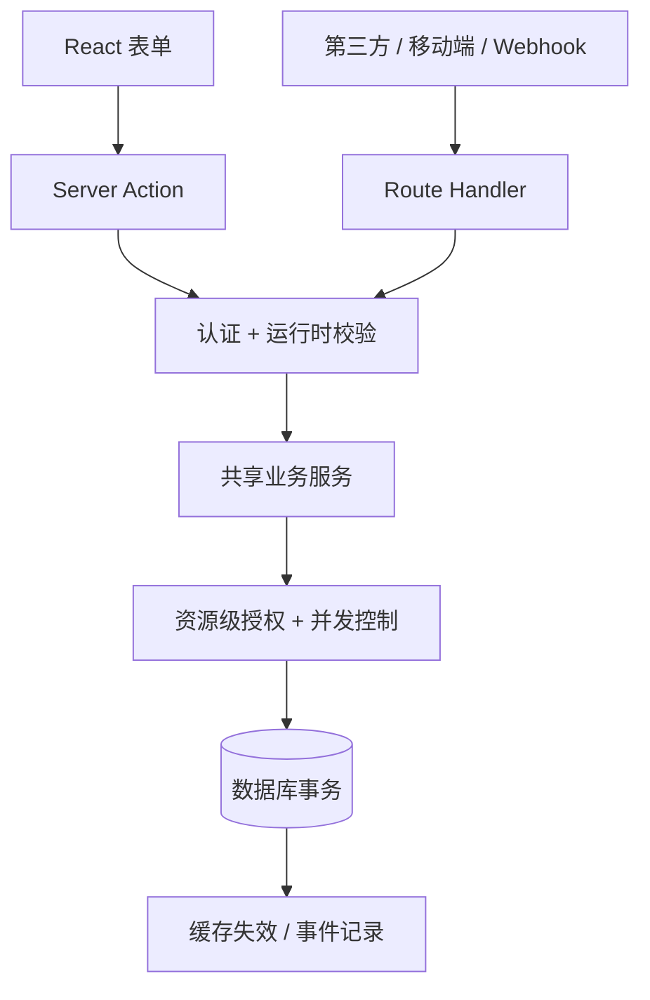

# Next.js（04） - Route Handler 与 Server Action

> 读完后，你应能完成以下任务：
> - 绘制“Next.js（04） - Route Handler 与 Server Action / 先判断调用者是谁，不要先争论用哪个 API”的关键对象与数据流，解释“两个入口都需要相同业务规则时，应调用同一个 service，而不是互相发 HTTP 请求。”，并用源码位置、日志或 Trace 标注证据。
> - 为“Next.js（04） - Route Handler 与 Server Action / 两类入口最终都要进入同一个业务服务”设计正常与异常输入，验证“DIAGRAM_DESCRIPTION：图中必须包含 React 表单、外部客户端、两种服务端入口、认证和运行时校验、共享业务服务、资源级授权、数据库事务及缓存失效，重点说明入口层只转换协议，业务规则不能复制两份。”，输出首个偏差位置与回归测试结果。
> - 实现“Next.js（04） - Route Handler 与 Server Action / 怎么选”的最小代码或配置，检验“Route Handler 支持 GET、POST、PUT、PATCH、DELETE、HEAD 和 OPTIONS，基于标准 Web Request/Response。”，输出命令、结果与 Diff，并说明不适用边界。

> 本文面向准备在 App Router 中实现写操作的开发者，示例基于 Next.js 16.3.0。读完后，你能判断一个入口应该使用 Route Handler 还是 Server Action，并能为它补齐运行时校验、身份认证、资源级授权、幂等、并发冲突和缓存失效。

# 一、先判断调用者是谁，不要先争论用哪个 API

Route Handler 和 Server Action 都能在服务端执行代码，但它们服务的调用者不同。

- 第三方平台、移动端、Webhook、公开 SDK 或明确的 HTTP 资源，需要 Route Handler。
- 当前 React 页面里的表单和按钮，只需要完成应用内 mutation，优先考虑 Server Action。
- 两个入口都需要相同业务规则时，应调用同一个 service，而不是互相发 HTTP 请求。

最大的误区是把 Server Action 当成“浏览器看不到的内部函数”。它仍可被客户端触发，参数仍来自不可信请求。框架能提供 POST、加密 Action ID 和同源检查等保护，但不能替你判断“当前用户是否有权修改项目 p1”。

本文完成后的可验证结果是：

- 能按调用方、协议稳定性和错误语义选择入口。
- 能让 Handler 返回稳定 HTTP 状态，让 Action 返回稳定 UI 状态。
- 能把认证、授权、校验和并发控制放到正确层次。
- 能解释重复提交、Webhook 重放和缓存失效失败如何处理。

# 二、两类入口最终都要进入同一个业务服务



`DIAGRAM_DESCRIPTION`：图中必须包含 React 表单、外部客户端、两种服务端入口、认证和运行时校验、共享业务服务、资源级授权、数据库事务及缓存失效，重点说明入口层只转换协议，业务规则不能复制两份。

## 2.1 怎么选

| 判断维度 | Route Handler | Server Action |
|---|---|---|
| 主要调用者 | 第三方、多端客户端、Webhook | 当前 Next.js React 树 |
| 契约 | URL、HTTP 方法、状态码、JSON | TypeScript 函数参数和返回状态 |
| 错误表达 | 400、401、403、404、409、5xx | 可序列化结果、抛错或错误边界 |
| 缓存控制 | 显式响应和失效 API | mutation 后可直接失效并刷新 UI |
| 幂等依据 | `Idempotency-Key`、事件 ID、资源版本 | 业务唯一键、资源版本、提交令牌 |
| 不适合 | 只为本页按钮额外包一层 HTTP | 对外公开、长期稳定的多端 API |

Route Handler 支持 `GET`、`POST`、`PUT`、`PATCH`、`DELETE`、`HEAD` 和 `OPTIONS`，基于标准 Web `Request`/`Response`。Server Action 是声明 `'use server'` 的异步函数，通常通过表单 `action` 或客户端事件触发。

# 三、做一个两种入口共用服务的改名功能

示例用内存仓库演示协议和业务边界，便于只关注本章主题。它不适合多实例或 Serverless 生产部署；生产环境必须把项目、幂等记录和版本约束放入数据库事务。

## 3.1 创建项目和文件结构

```bash
pnpm create next-app@16.3.0 next-mutation-lab \
  --ts --eslint --app --use-pnpm --empty --yes \
  --import-alias "@/*"
cd next-mutation-lab
```

```text
next-mutation-lab/
├── lib/
│   └── project-service.ts
└── app/
    ├── api/
    │   └── projects/
    │       └── [id]/
    │           └── route.ts
    └── projects/
        ├── actions.ts
        └── rename-form.tsx
```

## 3.2 共享服务负责真正的业务规则

```typescript
// lib/project-service.ts
/** 项目的可修改状态。 */
interface ProjectRecord {
  /** 项目稳定 ID。 */
  id: string
  /** 有权管理项目的用户 ID。 */
  ownerId: string
  /** 项目名称。 */
  name: string
  /** 用于乐观并发控制的版本号。 */
  version: number
}

/** 项目改名服务的输入。 */
export interface RenameProjectInput {
  /** 发起操作的用户 ID。 */
  actorId: string
  /** 目标项目 ID。 */
  projectId: string
  /** 期望写入的新名称。 */
  name: string
  /** 客户端读取项目时获得的版本号。 */
  expectedVersion: number
}

/** 项目改名可能返回的稳定结果。 */
export type RenameProjectResult =
  | { ok: true; project: { id: string; name: string; version: number } }
  | { ok: false; code: 'INVALID_INPUT' | 'NOT_FOUND' | 'FORBIDDEN' | 'VERSION_CONFLICT' }

/** 项目名称允许的最少字符数。 */
const MIN_PROJECT_NAME_LENGTH = 2

/** 项目名称允许的最多字符数。 */
const MAX_PROJECT_NAME_LENGTH = 80

/** 客户端可提交的最小项目版本。 */
const MIN_PROJECT_VERSION = 1

/** 项目 ID 允许的最多字符数。 */
const MAX_PROJECT_ID_LENGTH = 64

/** 项目 ID 允许使用的字符。 */
const PROJECT_ID_PATTERN = /^[a-zA-Z0-9_-]+$/

/** 本地教学示例使用的项目仓库；生产环境应替换为数据库。 */
const PROJECTS = new Map<string, ProjectRecord>([
  ['p1', { id: 'p1', ownerId: 'u1', name: 'Knowledge Base', version: 1 }]
])

/** 校验权限和版本后修改项目名称。 */
export async function renameProject(input: RenameProjectInput): Promise<RenameProjectResult> {
  /** 去除首尾空白后的项目名称。 */
  const normalizedName = input.name.trim()
  if (
    !PROJECT_ID_PATTERN.test(input.projectId) ||
    input.projectId.length > MAX_PROJECT_ID_LENGTH ||
    normalizedName.length < MIN_PROJECT_NAME_LENGTH ||
    normalizedName.length > MAX_PROJECT_NAME_LENGTH ||
    !Number.isInteger(input.expectedVersion) ||
    input.expectedVersion < MIN_PROJECT_VERSION
  ) {
    return { ok: false, code: 'INVALID_INPUT' }
  }

  /** 当前项目仓库中的权威记录。 */
  const project = PROJECTS.get(input.projectId)
  if (!project) return { ok: false, code: 'NOT_FOUND' }
  if (project.ownerId !== input.actorId) return { ok: false, code: 'FORBIDDEN' }
  if (project.version !== input.expectedVersion) return { ok: false, code: 'VERSION_CONFLICT' }

  /** 完成本次更新后的新版本项目。 */
  const updatedProject: ProjectRecord = {
    ...project,
    name: normalizedName,
    version: project.version + 1
  }
  PROJECTS.set(project.id, updatedProject)

  return {
    ok: true,
    project: { id: updatedProject.id, name: updatedProject.name, version: updatedProject.version }
  }
}
```

`expectedVersion` 不是装饰字段。两个用户同时基于版本 1 修改时，只允许第一个提交成功；第二个得到 `VERSION_CONFLICT`，重新读取后再决定是否覆盖。数据库中应使用 `UPDATE ... WHERE id = ? AND version = ?` 并检查影响行数，不能只在 Node 内存先比较再写。

## 3.3 Route Handler 把业务结果翻译成 HTTP

```typescript
// app/api/projects/[id]/route.ts
import { NextResponse } from 'next/server'
import { renameProject } from '@/lib/project-service'

/** 本接口使用的 HTTP 状态码。 */
const HTTP_STATUS = {
  badRequest: 400, // 请求体或字段格式错误。
  unauthorized: 401, // 请求没有通过身份认证。
  forbidden: 403, // 身份有效但没有目标资源权限。
  notFound: 404, // 当前权限范围内不存在目标资源。
  conflict: 409 // 客户端版本与权威版本冲突。
} as const

/** 动态项目接口接收的路由上下文。 */
interface ProjectRouteContext {
  /** Next.js 延迟解析的项目 ID。 */
  params: Promise<{ id: string }>
}

/** 外部客户端提交的改名 JSON。 */
interface RenameProjectBody {
  /** 新项目名称。 */
  name?: unknown
  /** 客户端读取时获得的版本。 */
  expectedVersion?: unknown
}

/** 接收外部 HTTP 请求并修改项目。 */
export async function PATCH(request: Request, context: ProjectRouteContext): Promise<Response> {
  /** 示例使用请求头模拟身份；生产环境应验证真实 Session 或 Access Token。 */
  const actorId = request.headers.get('x-demo-user')
  if (!actorId) {
    return NextResponse.json({ code: 'UNAUTHENTICATED' }, { status: HTTP_STATUS.unauthorized })
  }

  /** 经过 JSON 解析的未知请求体。 */
  let body: RenameProjectBody
  try {
    body = await request.json() as RenameProjectBody
  } catch {
    return NextResponse.json({ code: 'INVALID_JSON' }, { status: HTTP_STATUS.badRequest })
  }

  /** URL 中的目标项目 ID。 */
  const { id } = await context.params
  /** 共享服务返回的业务结果。 */
  const result = await renameProject({
    actorId,
    projectId: id,
    name: typeof body.name === 'string' ? body.name : '',
    expectedVersion: typeof body.expectedVersion === 'number' ? body.expectedVersion : Number.NaN
  })

  if (result.ok) return NextResponse.json(result.project)

  /** 业务错误码到 HTTP 状态码的稳定映射。 */
  const statusByCode = {
    INVALID_INPUT: HTTP_STATUS.badRequest, // 运行时输入校验失败。
    NOT_FOUND: HTTP_STATUS.notFound, // 项目不存在。
    FORBIDDEN: HTTP_STATUS.forbidden, // 用户没有项目管理权限。
    VERSION_CONFLICT: HTTP_STATUS.conflict // 乐观锁版本已经落后。
  } as const
  return NextResponse.json({ code: result.code }, { status: statusByCode[result.code] })
}
```

静态审查重点是：JSON 解析有异常分支；TypeScript 类型没有替代运行时判断；身份来自服务端验证位置；业务错误被映射为稳定状态码；响应没有返回异常堆栈。

请求示例：

```bash
curl -X PATCH http://localhost:3000/api/projects/p1 \
  -H 'content-type: application/json' \
  -H 'x-demo-user: u1' \
  -d '{"name":"AI Workspace","expectedVersion":1}'
```

预期首次返回 `200` 和版本 2；再次提交同一个版本返回 `409 VERSION_CONFLICT`。省略用户头返回 401，改成 `u2` 返回 403。

## 3.4 Server Action 把业务结果翻译成页面状态

```typescript
// app/projects/actions.ts
'use server'

import { revalidatePath } from 'next/cache'
import { renameProject } from '@/lib/project-service'

/** 表单可以稳定展示的提交状态。 */
export interface RenameFormState {
  /** 本次提交是否成功。 */
  ok: boolean
  /** 失败时供 UI 展示的业务错误码。 */
  code?: 'INVALID_INPUT' | 'NOT_FOUND' | 'FORBIDDEN' | 'VERSION_CONFLICT'
}

/** 处理当前应用内的项目改名表单。 */
export async function renameProjectAction(_previousState: RenameFormState, formData: FormData): Promise<RenameFormState> {
  // 教学示例固定为 u1；生产环境必须从服务端 Session 读取，绝不能信任隐藏表单中的用户 ID。
  const actorId = 'u1'
  /** 表单中的目标项目 ID。 */
  const projectId = String(formData.get('projectId') ?? '')
  /** 表单中的新项目名称。 */
  const name = String(formData.get('name') ?? '')
  /** 表单中的资源版本。 */
  const expectedVersion = Number(formData.get('expectedVersion'))
  /** 共享业务服务返回的改名结果。 */
  const result = await renameProject({ actorId, projectId, name, expectedVersion })

  if (!result.ok) return { ok: false, code: result.code }

  revalidatePath(`/projects/${projectId}`)
  return { ok: true }
}
```

```tsx
// app/projects/rename-form.tsx
'use client'

import { useActionState } from 'react'
import { renameProjectAction, type RenameFormState } from './actions'

/** 表单允许的最少项目名称字符数。 */
const MIN_PROJECT_NAME_LENGTH = 2

/** 表单允许的最多项目名称字符数。 */
const MAX_PROJECT_NAME_LENGTH = 80

/** 表单首次渲染时没有成功结果或错误码。 */
const INITIAL_STATE: RenameFormState = { ok: false }

/** 提交项目改名并展示稳定业务结果。 */
export function RenameProjectForm() {
  /** 当前提交结果、Action 和 pending 状态。 */
  const [state, formAction, isPending] = useActionState(renameProjectAction, INITIAL_STATE)

  return (
    <form action={formAction}>
      <input type="hidden" name="projectId" value="p1" />
      <input type="hidden" name="expectedVersion" value="1" />
      <label>
        项目名称
        <input
          name="name"
          minLength={MIN_PROJECT_NAME_LENGTH}
          maxLength={MAX_PROJECT_NAME_LENGTH}
          required
        />
      </label>
      <button type="submit" disabled={isPending}>{isPending ? '保存中...' : '保存'}</button>
      {state.code ? <p role="alert">保存失败：{state.code}</p> : null}
      {state.ok ? <p>保存成功</p> : null}
    </form>
  )
}
```

按钮 `disabled` 只改善交互，不能保证幂等。用户双击、网络重试或两个标签页提交都可能绕过它，最终约束必须落在业务唯一键、资源版本或数据库幂等记录上。

# 四、生产环境还要补哪些边界

## 4.1 认证和授权不是一回事

认证回答“是谁”，授权回答“这个人能不能对这个资源执行这个动作”。只检查登录状态会留下 IDOR 越权。更安全的查询把 actor/tenant 条件放进数据访问语句，避免先查出其他租户资源再在 UI 层隐藏。

## 4.2 幂等键必须和副作用一起提交

Webhook 使用提供方事件 ID，支付和创建订单使用 `Idempotency-Key`。服务端应在同一数据库事务中记录幂等键和业务结果；重复请求返回已有结果，不再次扣款或发消息。只把 key 存在进程内存，重启或多实例后都会失效。

## 4.3 大文件不要硬塞进 Action

Server Action 请求体有大小限制，适合普通表单，不适合大文件。文件上传应使用受控 Route Handler，或由服务端签发短期上传凭证后直传对象存储；随后再提交文件元数据。无论哪条路，都要校验文件大小、类型、归属和扫描状态。

## 4.4 写成功、失效失败要能补偿

数据库提交与缓存失效通常不是同一事务。写成功后失效失败，应记录 outbox/任务并重试，同时让响应携带数据版本；不要为了缓存调用失败回滚已经完成的外部副作用。

# 五、常见故障怎么排查

| 现象 | 根因 | 怎么定位 | 修复方式 | 防止复发 |
|---|---|---|---|---|
| Action 能被越权调用 | 只在页面加载时鉴权，Action 自己没校验资源 | 直接构造 Action 请求并更换资源 ID | Action 内重新读取会话，并在 service/data layer 做资源授权 | 为每个 mutation 增加未登录和跨租户负向测试 |
| Webhook 重复创建订单 | 没保存事件 ID，重试被当成新请求 | 按提供方事件 ID 查询日志和业务记录 | 事务内写入唯一事件 ID并返回已有结果 | 唯一索引 + 重放测试 |
| 两个编辑者互相覆盖 | 更新没有版本条件 | 对比读取版本、提交版本和数据库版本 | 使用乐观锁并返回 409 | UI 携带版本，接口契约定义冲突处理 |
| Handler 总返回 500 | JSON、校验、业务异常没有分类 | 查 request ID 对应的解析、授权和 service 日志 | 稳定映射 400/401/403/404/409/5xx | 契约测试覆盖每个错误分支 |
| 写成功后页面还是旧数据 | service 成功但缓存标签或路径未失效 | 对比事务提交、数据版本和失效事件 | 写后精确失效，并为失败建立补偿任务 | 监控失效失败数和数据陈旧时间 |

# 六、上线前按什么验收

- [ ] 每个入口都明确调用者、协议、认证方式和稳定错误语义。
- [ ] 运行时输入校验覆盖 JSON 解析、长度、格式和类型。
- [ ] 认证与资源级授权都在服务端执行，不信任隐藏字段中的用户身份。
- [ ] Handler 和 Action 调用同一个业务 service，没有互相发内部 HTTP 请求。
- [ ] 重复提交、Webhook 重放和并发更新都有数据库级约束。
- [ ] 日志记录 request ID、actor、resource、action、outcome 和版本，不记录密钥或原始敏感内容。
- [ ] 写入、缓存失效和事件发布的部分失败有补偿路径。
- [ ] 用例覆盖 400、401、403、404、409、5xx 和成功分支。

## 学完自测

## 6.1 场景选择：Webhook 用什么

支付平台需要向你的系统推送支付结果，应该使用什么入口？

A. Server Action，因为它运行在服务端。  
B. Route Handler，因为第三方需要稳定 URL、签名验证和 HTTP 状态。  
C. Client Component，因为浏览器可以接收请求。  
D. 页面 `page.tsx`，根据查询参数执行扣款。

**答案：B。** Webhook 是外部协议契约，需要独立 URL、签名、事件 ID 和明确状态码。Server Action 服务 React 应用内 mutation，不是对外 API；C、D 都把服务端副作用放到了错误边界。

## 6.2 多选：哪些措施真正防重复副作用

A. 提交时禁用按钮。  
B. 数据库唯一幂等键。  
C. 带版本条件的更新语句。  
D. 把最近请求 ID 存在单实例内存。

**答案：B、C。** 唯一幂等键防止同一业务事件重复执行，版本条件防止并发覆盖。A 只能改善 UI，网络重试仍会重复；D 在重启和多实例下不可靠。

## 6.3 故障分析：为什么登录用户还能越权

Action 检查用户已经登录，然后按表单中的 `projectId` 更新项目。攻击者修改隐藏字段后更新了他人的项目。根因是什么？

**答案：** 代码只完成认证，没有完成资源级授权。应在服务端根据 actor/tenant 和 projectId 一起查询可修改资源，并让数据访问层保证边界。隐藏字段是不可信输入，不能作为授权证据。

## 6.4 架构设计：同一改名逻辑如何复用

后台表单用 Server Action，移动端用 Route Handler，两者都要修改项目名称。业务代码放哪里？

**答案：** 放在独立 service/use-case 层。Handler 负责 HTTP 解析和状态码，Action 负责 FormData 与 UI 状态，它们都调用同一服务完成校验、资源授权、并发控制和事务。让 Handler 调 Action 或复制两份规则都会制造耦合和行为漂移。

# 七、总结

- **先判断调用者是谁，不要先争论用哪个 API**：两个入口都需要相同业务规则时，应调用同一个 service，而不是互相发 HTTP 请求。
- **两类入口最终都要进入同一个业务服务**：DIAGRAM_DESCRIPTION：图中必须包含 React 表单、外部客户端、两种服务端入口、认证和运行时校验、共享业务服务、资源级授权、数据库事务及缓存失效，重点说明入口层只转换协议，业务规则不能复制两份。
- **做一个两种入口共用服务的改名功能**：它不适合多实例或 Serverless 生产部署；
- **生产环境还要补哪些边界**：认证回答“是谁”，授权回答“这个人能不能对这个资源执行这个动作”。
- **常见故障怎么排查**：| 写成功后页面还是旧数据 | service 成功但缓存标签或路径未失效 | 对比事务提交、数据版本和失效事件 | 写后精确失效，并为失败建立补偿任务 | 监控失效失败数和数据陈旧时间 |
- **上线前按什么验收**：[ ] 运行时输入校验覆盖 JSON 解析、长度、格式和类型。

## 参考资料

- [Next.js：Route Handlers](https://nextjs.org/docs/app/getting-started/route-handlers)
- [Next.js：Mutating Data](https://nextjs.org/docs/app/getting-started/mutating-data)
- [Next.js：Data Security](https://nextjs.org/docs/app/guides/data-security)
- [Next.js：use server](https://nextjs.org/docs/app/api-reference/directives/use-server)
