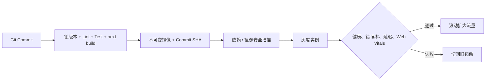

# Next.js（05） - 构建、部署与性能优化

> 读完后，你应能完成以下任务：
> - 绘制“Next.js（05） - 构建、部署与性能优化 / 本地能跑，离“可以上线”还差什么”的关键对象与数据流，解释“如果每次部署都在服务器现装依赖、现拉代码，或者出问题后只能“重新构建上一版”，就没有真正的可回滚能力。”，并用源码位置、日志或 Trace 标注证据。
> - 为“Next.js（05） - 构建、部署与性能优化 / 部署的核心是“同一制品逐级晋级””设计正常与异常输入，验证“DIAGRAM_DESCRIPTION：图中必须包含 Git 提交、CI 质量门禁、不可变镜像、安全扫描、灰度实例、指标判断、扩大流量和回滚旧镜像，重点表达测试过的镜像不能在环境之间重新构建。”，输出首个偏差位置与回归测试结果。
> - 实现“Next.js（05） - 构建、部署与性能优化 / 构建时变量和运行时变量不是一回事”的最小代码或配置，检验“浏览器需要的公开配置也要当成产品数据管理，不能因为“不是密钥”就允许任意值进入生产包。”，输出命令、结果与 Diff，并说明不适用边界。

> 本文面向已经能在本地运行 Next.js、准备部署到生产环境的开发者，示例基于 Next.js 16.3.0。读完后，你能构建可追溯的 standalone 容器制品，区分构建时和运行时配置，设计灰度与回滚，并用 Core Web Vitals 和服务端指标判断瓶颈在哪里。

# 一、本地能跑，离“可以上线”还差什么

`next build` 成功只说明当前源码能生成生产产物。真正上线还要回答：

- 生产运行的代码是不是 CI 构建并测试过的同一个制品？
- 环境变量哪些在构建时写入，哪些可以在容器启动时修改？
- 多实例之间的缓存和失效是否一致？
- 新版本出错时，旧版本的静态资源、数据库结构和镜像还在不在？
- 页面慢是图片、客户端 JavaScript、服务端查询还是上游接口造成的？

如果每次部署都在服务器现装依赖、现拉代码，或者出问题后只能“重新构建上一版”，就没有真正的可回滚能力。

本文完成后的可验证结果是：

- 能解释 `.next/standalone`、`.next/static` 和 `public` 各自负责什么。
- 能静态审查一个非 root、多阶段构建的 Next.js Dockerfile。
- 能设计带健康检查、灰度指标和不可变版本号的发布链路。
- 能同时使用 LCP、INP、CLS、TTFB、上游耗时和缓存命中率定位性能问题。

# 二、部署的核心是“同一制品逐级晋级”



`DIAGRAM_DESCRIPTION`：图中必须包含 Git 提交、CI 质量门禁、不可变镜像、安全扫描、灰度实例、指标判断、扩大流量和回滚旧镜像，重点表达测试过的镜像不能在环境之间重新构建。

## 2.1 构建时变量和运行时变量不是一回事

| 配置类型 | 例子 | 何时生效 | 风险 |
|---|---|---|---|
| 客户端公开变量 | `NEXT_PUBLIC_ANALYTICS_ID` | `next build` 时内联 | 构建后修改容器环境不会替换；内容对浏览器公开 |
| 服务端运行时变量 | `DATABASE_URL` | 服务端请求或启动时读取 | 不能进入客户端模块和构建日志 |
| 构建行为配置 | `output: 'standalone'` | 构建时 | 改动后必须重新生成制品 |
| 发布元数据 | `APP_VERSION`、Commit SHA | 构建或发布注入 | 缺失后日志和告警无法关联版本 |

不要把密钥写进 `next.config.ts` 的 `env` 或 `NEXT_PUBLIC_`。浏览器需要的公开配置也要当成产品数据管理，不能因为“不是密钥”就允许任意值进入生产包。

# 三、做一个可以交给容器平台的 standalone 制品

## 3.1 开启 standalone 输出并提供健康入口

```typescript
// next.config.ts
import type { NextConfig } from 'next'

/** 生产构建和响应安全使用的 Next.js 配置。 */
const nextConfig: NextConfig = {
  output: 'standalone', // 裁剪 Node 运行时真正依赖的文件。
  poweredByHeader: false, // 删除无业务用途的 X-Powered-By 响应头。
  images: {
    formats: ['image/avif', 'image/webp'] // 优先协商现代图片格式。
  }
}

export default nextConfig
```

```typescript
// app/api/health/live/route.ts
import { NextResponse } from 'next/server'

/** 仅证明 Next.js 进程能够处理请求的存活探针。 */
export function GET(): Response {
  return NextResponse.json({ status: 'ok' })
}
```

存活探针不要每次都访问数据库，否则数据库抖动会让平台同时重启全部健康实例。就绪探针可以检查关键依赖，但必须有严格超时和降载策略，用来决定是否接收新流量，而不是替代业务监控。

## 3.2 用多阶段 Dockerfile 固定运行边界

项目需要提交 `pnpm-lock.yaml`，并保留脚手架生成的 `public` 目录：

```dockerfile
# syntax=docker/dockerfile:1
FROM node:20-alpine AS dependencies
WORKDIR /app
RUN corepack enable
COPY package.json pnpm-lock.yaml ./
RUN pnpm install --frozen-lockfile

FROM node:20-alpine AS builder
WORKDIR /app
RUN corepack enable
COPY --from=dependencies /app/node_modules ./node_modules
COPY . .
ENV NEXT_TELEMETRY_DISABLED=1
RUN pnpm build

FROM node:20-alpine AS runner
WORKDIR /app
ENV NODE_ENV=production
ENV NEXT_TELEMETRY_DISABLED=1
ENV HOSTNAME=0.0.0.0
ENV PORT=3000

RUN addgroup --system --gid 1001 nodejs \
  && adduser --system --uid 1001 nextjs

COPY --from=builder --chown=nextjs:nodejs /app/public ./public
COPY --from=builder --chown=nextjs:nodejs /app/.next/standalone ./
COPY --from=builder --chown=nextjs:nodejs /app/.next/static ./.next/static

USER nextjs
EXPOSE 3000
CMD ["node", "server.js"]
```

三类文件缺一不可：standalone 包含最小 Node 服务和依赖，`.next/static` 包含带哈希的客户端资源，`public` 保存原样公开文件。基础镜像在正式项目中还应固定到经过安全扫描的 digest；只写浮动标签会让同一提交在不同日期构建出不同系统层。

静态审查清单：安装使用冻结锁文件；构建和运行分层；最终镜像不携带完整源码与开发依赖；进程使用非 root 用户；运行时没有把密钥写在 Dockerfile；启动命令是 standalone 生成的 `server.js`。

构建和本地验收命令应写入项目文档，但默认不因文章优化而执行：

```bash
docker build -t next-app:git-<commit-sha> .
docker run --rm -p 3000:3000 --env-file .env.production next-app:git-<commit-sha>
curl -i http://localhost:3000/api/health/live
```

预期探针返回 200 和 `{"status":"ok"}`。镜像标签应使用 Commit SHA 或制品摘要，不使用无法追溯内容的 `latest` 作为唯一发布依据。

# 四、多实例部署最容易漏掉哪些状态

## 4.1 缓存不能默认依赖单机磁盘

多实例自托管时，要明确 Data Cache、增量静态生成、图片优化缓存和标签失效如何共享。如果每个实例只保留本地状态，同一个 URL 可能随负载均衡命中不同版本。解决方案可能是共享缓存处理器、外部 CDN、统一失效消息或业务数据版本校验，具体取决于一致性要求。

不要用“会话粘滞”掩盖缓存不一致。它只能暂时让同一用户命中同一实例，扩缩容、故障切换和后台任务仍会暴露问题。

## 4.2 发布时要保留上一版静态资源

用户打开旧页面后再加载分包，可能仍请求上一 Build ID 的资源。CDN 如果在新版本上线时立刻删除旧静态文件，就会出现间歇性 Chunk 404。带内容哈希的静态资源适合长期不可变缓存，旧版本资源应保留超过页面和 CDN 的最大存活窗口。

## 4.3 数据库迁移必须兼容新旧应用共存

滚动发布期间，新旧版本会同时运行。安全做法是 expand-contract：先增加兼容字段或表，让新旧版本都能工作；再切流量和数据；最后在确认没有旧实例后删除旧结构。把破坏性迁移绑定到每个应用容器启动，会导致并发执行、扩容失败和无法回滚。

# 五、性能优化先定位瓶颈，别先加技巧

## 5.1 浏览器看 Core Web Vitals

| 指标 | 回答的问题 | “良好”参考线 | 常见优化方向 |
|---|---|---:|---|
| LCP | 主要内容多久可见 | ≤ 2.5 秒 | 首屏图片、字体、TTFB、阻塞资源 |
| INP | 交互后多久有视觉反馈 | ≤ 200 毫秒 | 长任务、客户端 JS、事件处理 |
| CLS | 页面是否发生意外位移 | ≤ 0.1 | 图片尺寸、字体替换、动态插入内容 |

这些阈值应看真实用户第 75 百分位，并同时覆盖移动端和桌面端。实验室工具适合复现，RUM 才能告诉你真实网络、设备和地区下发生了什么。

`next/image` 可控制尺寸和响应式图片，`next/font` 减少字体请求与布局偏移，动态导入可以延后低频重组件，Server Component 可以减少客户端 JavaScript。但每个优化都有边界：图片转换会消耗 CPU 和缓存，拆包过碎会增加请求与 loading 闪烁，把组件改成服务端也不能消除慢数据库。

## 5.2 服务端指标解释 TTFB 为什么慢

至少按路由模板和版本记录：

- TTFB、总耗时和流式首块时间。
- 数据库、上游 API、缓存读取各自耗时。
- 缓存命中率、回源量和失效失败数。
- 错误率、超时率、连接池等待和事件循环延迟。

相互独立的数据请求应尽早启动并并行等待，存在依赖的数据保持顺序。慢请求要有超时和取消边界；盲目重试非幂等请求可能把一次故障放大成重复写入和连接池耗尽。

## 5.3 把 Web Vitals 发回自己的监控入口

```tsx
// app/web-vitals.tsx
'use client'

import { useReportWebVitals } from 'next/web-vitals'
import type { NextWebVitalsMetric } from 'next/app'

/** 把单条浏览器性能指标发送到站内采集接口。 */
function reportMetric(metric: NextWebVitalsMetric): void {
  /** 只包含性能字段和发布版本的监控载荷。 */
  const payload = JSON.stringify({
    id: metric.id,
    name: metric.name,
    value: metric.value,
    rating: metric.rating,
    version: process.env.NEXT_PUBLIC_APP_VERSION ?? 'unknown'
  })
  navigator.sendBeacon('/api/vitals', payload)
}

/** 注册一次稳定的 Web Vitals 上报回调。 */
export function WebVitals() {
  useReportWebVitals(reportMetric)
  return null
}
```

接收端至少要限制请求体并校验指标名。下面只演示契约，生产环境应把指标写入监控系统，而不是依赖应用日志长期存储：

```typescript
// app/api/vitals/route.ts
/** 允许采集的核心性能指标。 */
const ALLOWED_METRICS = new Set(['LCP', 'INP', 'CLS'])

/** 单次性能上报允许的最大字符数。 */
const MAX_PAYLOAD_CHARACTERS = 2048

/** 性能采集接口使用的 HTTP 状态码。 */
const HTTP_STATUS = {
  badRequest: 400, // JSON 或指标字段不符合契约。
  contentTooLarge: 413, // 请求体超过采集接口上限。
  noContent: 204 // 指标接收成功且无需响应正文。
} as const

/** 浏览器上报的性能载荷。 */
interface WebVitalsPayload {
  /** 单次指标测量的 ID。 */
  id?: unknown
  /** 性能指标名称。 */
  name?: unknown
  /** 性能指标数值。 */
  value?: unknown
  /** 产生该指标的应用版本。 */
  version?: unknown
}

/** 接收经过白名单校验的 Web Vitals 指标。 */
export async function POST(request: Request): Promise<Response> {
  /** 浏览器发送的原始文本，先限制长度再解析。 */
  const rawBody = await request.text()
  if (rawBody.length > MAX_PAYLOAD_CHARACTERS) {
    return new Response(null, { status: HTTP_STATUS.contentTooLarge })
  }

  /** 经过 JSON 解析的未知监控载荷。 */
  let payload: WebVitalsPayload
  try {
    payload = JSON.parse(rawBody) as WebVitalsPayload
  } catch {
    return new Response(null, { status: HTTP_STATUS.badRequest })
  }

  if (typeof payload.name !== 'string' || !ALLOWED_METRICS.has(payload.name) || typeof payload.value !== 'number') {
    return new Response(null, { status: HTTP_STATUS.badRequest })
  }

  // 生产环境在这里写入指标系统，并按版本、设备和路由聚合；不要记录用户身份。
  console.info('web-vital', { name: payload.name, value: payload.value, version: payload.version })
  return new Response(null, { status: HTTP_STATUS.noContent })
}
```

把 `<WebVitals />` 放进根布局的 `body`。采集接口还应增加采样、限流和来源控制，不能直接把任意 JSON 打进日志。版本字段用于比较灰度和稳定版，而不是收集用户身份。

# 六、灰度、回滚和成本怎么权衡

灰度不只是“先上一台”。要提前定义停止扩量的阈值，例如新版本相对基线的错误率、P95/P99、关键转化和 Web Vitals。如果阈值超出，发布系统停止扩大流量并切回已经验证过的旧镜像。

回滚前要确认数据库迁移仍向后兼容、旧静态资源还在、旧镜像可以拉取、旧环境变量仍有效。没有这些条件，按钮叫“回滚”也只能重新构建和碰运气。

成本优化同时看计算、带宽、图片转换、缓存存储和可观测性采样。减少客户端 JS 可能降低浏览器成本，却增加服务端渲染；扩大缓存可能降低数据库压力，却增加存储和一致性复杂度。结论必须基于流量、命中率和延迟数据，不能只比较单次请求。

# 七、常见故障怎么排查

| 现象 | 根因 | 怎么定位 | 修复方式 | 防止复发 |
|---|---|---|---|---|
| 新版偶发 Chunk 404 | CDN 过早删除旧 Build ID 静态资源 | 按版本和资源哈希检查 404，复现旧页面延迟加载 | 恢复旧静态资源并延长不可变资源保留时间 | 发布验收包含跨版本分包加载 |
| 多实例同一 URL 内容不同 | 缓存和失效只在本机 | 响应记录实例 ID、数据版本和缓存命中 | 使用共享缓存或统一失效传播 | 跨实例一致性冒烟和告警 |
| 容器健康却无法服务 | 存活探针没覆盖就绪条件 | 分别检查进程、数据库、上游和连接池 | 增加有超时的就绪探针，摘除而非重启进程 | 明确 liveness/readiness 职责 |
| LCP 变差但服务端耗时正常 | 首屏图片、字体或客户端资源变大 | 对比 RUM、资源瀑布和版本包体 | 优化首屏资源尺寸、优先级和缓存 | Core Web Vitals 按版本设回归门禁 |
| 回滚后服务启动失败 | 数据库已执行不兼容删除 | 对比旧应用查询和迁移记录 | 恢复兼容结构或前滚修复 | 使用 expand-contract 并演练回滚 |

# 八、上线前按什么验收

- [ ] Node、pnpm、锁文件和基础镜像版本明确，制品可关联 Commit SHA。
- [ ] 同一个镜像从测试环境晋级生产，没有在生产重新构建。
- [ ] 最终容器使用非 root 用户，不包含开发依赖、源码密钥和构建缓存。
- [ ] `public`、`.next/static` 和 standalone 服务文件完整，旧静态资源有保留策略。
- [ ] 存活和就绪探针职责分开，依赖检查有超时。
- [ ] 多实例缓存、图片转换和失效传播有明确方案。
- [ ] 数据库迁移兼容新旧版本共存，并实际设计了回滚路径。
- [ ] 灰度阈值覆盖错误率、P95/P99、关键业务指标和 Core Web Vitals。
- [ ] 性能数据按路由、设备、地区和应用版本拆分，能关联 Trace。

## 学完自测

## 8.1 场景选择：为什么不能在生产重新构建

测试环境验证过镜像 A，生产部署时服务器重新拉源码构建镜像 B。主要风险是什么？

A. 只要 Git Commit 相同就完全一致。  
B. 依赖、基础镜像和构建环境可能变化，生产运行的不是已验证制品。  
C. 生产构建一定比 CI 慢。  
D. Next.js 不支持在服务器构建。

**答案：B。** 相同提交不保证依赖元数据、基础镜像和工具链完全相同。正确做法是构建一次不可变制品，经过测试、安全扫描和灰度后逐级晋级。C 不是核心风险，D 也不是事实。

## 8.2 多选：哪些会造成多实例不一致

A. 每个实例使用独立本地 Data Cache。  
B. 标签失效消息只发送给接收写请求的实例。  
C. 带哈希静态资源在 CDN 长期缓存。  
D. 图片转换结果只存在各实例临时磁盘。

**答案：A、B、D。** 三者都让相同请求依赖命中的实例。C 对内容寻址的不可变资源是正常优化，前提是文件内容和 URL 哈希一致，并保留旧版本资源。

## 8.3 故障分析：健康检查为什么制造重启风暴

存活探针每秒查询数据库。数据库短暂抖动后，平台把所有应用容器判死并重启。应该怎么改？

**答案：** 根因是把依赖就绪状态塞进了进程存活判断。存活探针只判断进程能否处理请求；数据库检查放进带超时和失败阈值的就绪探针，用于摘除流量。数据库故障应单独告警，不能通过同时重启所有应用放大故障。

## 8.4 架构设计：LCP 变差从哪里查

灰度版本 LCP 变差，但服务端 TTFB 与旧版相同。下一步优先检查什么？

**答案：** 优先比较首屏资源瀑布、LCP 元素、图片尺寸和格式、字体、阻塞 CSS 以及客户端包体。TTFB 相同说明服务端首字节不是主要变化，但仍需用版本化 RUM 和 Trace 佐证，不能仅凭单次 Lighthouse 结果下结论。

# 九、总结

- **本地能跑，离“可以上线”还差什么**：生产运行的代码是不是 CI 构建并测试过的同一个制品？
- **部署的核心是“同一制品逐级晋级”**：DIAGRAM_DESCRIPTION：图中必须包含 Git 提交、CI 质量门禁、不可变镜像、安全扫描、灰度实例、指标判断、扩大流量和回滚旧镜像，重点表达测试过的镜像不能在环境之间重新构建。
- **做一个可以交给容器平台的 standalone 制品**：就绪探针可以检查关键依赖，但必须有严格超时和降载策略，用来决定是否接收新流量，而不是替代业务监控。
- **多实例部署最容易漏掉哪些状态**：解决方案可能是共享缓存处理器、外部 CDN、统一失效消息或业务数据版本校验，具体取决于一致性要求。
- **性能优化先定位瓶颈，别先加技巧**：| 指标 | 回答的问题 | “良好”参考线 | 常见优化方向 |
- **灰度、回滚和成本怎么权衡**：灰度不只是“先上一台”。

## 参考资料

- [Next.js：Self-Hosting](https://nextjs.org/docs/app/guides/self-hosting)
- [Next.js：Production Checklist](https://nextjs.org/docs/app/guides/production-checklist)
- [Next.js：Package Bundling](https://nextjs.org/docs/app/guides/package-bundling)
- [Next.js：Image Optimization](https://nextjs.org/docs/app/getting-started/images)
- [Next.js：useReportWebVitals](https://nextjs.org/docs/app/api-reference/functions/use-report-web-vitals)
- [MDN：Largest Contentful Paint](https://developer.mozilla.org/en-US/docs/Glossary/Largest_contentful_paint)
- [MDN：Interaction to Next Paint](https://developer.mozilla.org/en-US/docs/Glossary/Interaction_to_next_paint)
- [Next.js Learn：Cumulative Layout Shift](https://nextjs.org/learn/seo/cls)
