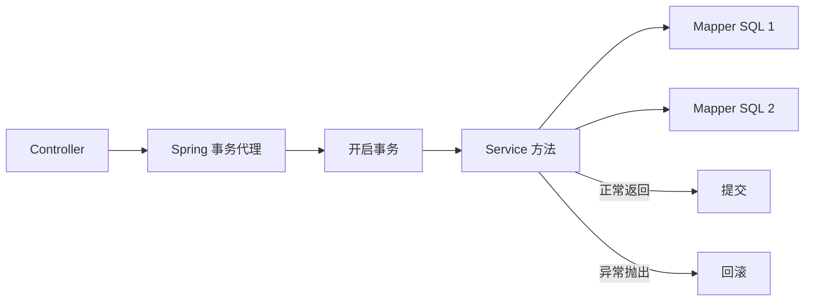

# Spring 事务与 @Transactional

> 读完你能：为一组数据库写操作划定正确事务边界，解释 Spring 事务的代理机制，并定位“明明加了
> `@Transactional` 却没有回滚”的常见问题。

一次业务操作经常不止一条 SQL。例如创建订单时，需要同时写订单、扣库存、记录流水。三步只成功两步，数据库就进入了业务上不允许的中间状态。事务解决的不是“代码报错”，而是保证一组数据库操作要么全部提交，要么全部回滚。

## 一、事务边界应该放在哪里

事务通常放在 Service 的公开方法上，因为 Service 表达一个完整业务动作，能够覆盖多个 Mapper 调用。

```java
@Service
public class TransferService {
    /** 账户数据访问对象，用于读取和更新余额。 */
    private final AccountMapper accountMapper;

    /**
     * 创建转账服务。
     * @param accountMapper 账户数据访问对象
     */
    public TransferService(AccountMapper accountMapper) {
        this.accountMapper = accountMapper;
    }

    /**
     * 在同一事务中完成扣款和入账。
     * @param fromAccountId 转出账户 ID
     * @param toAccountId 转入账户 ID
     * @param amount 转账金额，必须大于零
     */
    @Transactional(rollbackFor = Exception.class, timeout = 5)
    public void transfer(long fromAccountId, long toAccountId, BigDecimal amount) {
        if (amount == null || amount.signum() <= 0) {
            throw new IllegalArgumentException("转账金额必须大于零");
        }

        /** 成功扣减余额的记录数，用于识别余额不足或并发竞争。 */
        int deductedRows = accountMapper.deductIfEnough(fromAccountId, amount);
        if (deductedRows != 1) {
            throw new IllegalStateException("余额不足或账户不存在");
        }

        /** 成功增加余额的记录数，用于确保收款账户真实存在。 */
        int creditedRows = accountMapper.credit(toAccountId, amount);
        if (creditedRows != 1) {
            throw new IllegalStateException("收款账户不存在");
        }
    }
}
```

关键点不是注解本身，而是边界：校验可以在事务前完成；两条更新必须在同一个事务内；任何一步不满足预期都要抛异常，不能带着错误继续提交。

## 二、为什么注解能控制提交和回滚

Spring 会为 Bean 创建代理对象。外部调用 `transfer()`
时，代理先开启事务，再调用真实方法；方法正常返回就提交，抛出符合规则的异常就回滚。



这也解释了一个高频坑：同一个类中用 `this`
调用另一个事务方法，没有经过代理，事务配置可能不会生效。

```java
@Service
public class ImportService {
    /**
     * 错误示例：类内部调用绕过 Spring 代理。
     * @param rows 待导入的数据行
     */
    public void importAll(List<ImportRow> rows) {
        this.saveBatch(rows);
    }

    /**
     * 保存一批数据。
     * @param rows 待保存的数据行
     */
    @Transactional(rollbackFor = Exception.class)
    public void saveBatch(List<ImportRow> rows) {
        // 这里的事务可能不会生效，因为调用没有经过代理对象。
    }
}
```

可靠做法是把事务方法移动到另一个 Spring
Bean，由调用方注入后调用；不要通过暴露代理或自注入来掩盖职责混乱。

## 三、回滚规则不要靠猜

Spring 默认只对 `RuntimeException` 和 `Error`
回滚。企业项目经常使用受检异常或统一业务异常，因此通常显式声明：

```java
@Transactional(rollbackFor = Exception.class)
```

下面这种写法会吞掉异常，代理看到方法“正常返回”，于是提交事务：

```java
try {
    paymentMapper.createPayment(payment);
    ledgerMapper.createLedger(ledger);
} catch (Exception exception) {
    log.error("写入失败", exception);
    // 错误：异常被吞掉，事务代理无法感知失败。
}
```

应该让异常继续抛出；如果业务必须返回错误对象，也要先抛到事务边界之外再转换，或明确调用
`TransactionAspectSupport.currentTransactionStatus().setRollbackOnly()`，但后者会让控制流更难理解，只适合确有必要的兼容场景。

## 四、传播行为怎么选

| 传播行为       | 含义                       | 典型用途               | 风险                         |
| -------------- | -------------------------- | ---------------------- | ---------------------------- |
| `REQUIRED`     | 有事务就加入，没有就新建   | 默认业务写操作         | 外层失败会整体回滚           |
| `REQUIRES_NEW` | 挂起外层事务，创建独立事务 | 必须独立落库的审计记录 | 连接占用增加，容易误解一致性 |
| `SUPPORTS`     | 有事务就加入，没有也可运行 | 只读查询               | 调用者可能误以为它强制事务   |
| `MANDATORY`    | 必须运行在已有事务中       | 强制由上层控制边界     | 单独调用会直接报错           |

不要为了“保证写成功”随意使用
`REQUIRES_NEW`。例如订单事务失败，但独立事务中的流水已经提交，反而会制造不一致。只有当数据在业务上允许独立提交时才使用它。

## 五、隔离级别与并发更新

事务保证原子性，不自动解决所有并发问题。两个请求同时读取余额再各自扣减，仍可能发生丢失更新。金额、库存等场景应优先使用带条件的原子更新：

```sql
UPDATE account
SET balance = balance - #{amount}
WHERE id = #{accountId}
  AND balance >= #{amount};
```

随后检查影响行数是否为 `1`。复杂计算必须“先查再改”时，可在事务内使用
`SELECT ... FOR UPDATE`
加行锁，但必须保持固定加锁顺序并缩短事务时间，避免死锁和连接池耗尽。

## 六、六类不生效问题

1. **类内部调用**：`this.transactionalMethod()` 绕过代理。
2. **异常被捕获**：方法正常返回，代理执行提交。
3. **回滚类型不匹配**：抛出受检异常，但没有配置 `rollbackFor`。
4. **对象不是 Spring Bean**：手动 `new` 出来的对象没有事务代理。
5. **事务管理器选错**：多数据源项目使用了错误的 `transactionManager`。
6. **跨线程执行**：`@Async`、线程池任务不继承调用线程的事务上下文。

排查时不要只看有没有注解。应打开事务日志，确认调用对象是否为代理、事务是否创建、SQL 使用的连接是否相同，以及最终执行了 commit 还是 rollback。

```yaml
logging:
  level:
    org.springframework.transaction: DEBUG # 输出事务创建、提交和回滚过程。
    org.springframework.jdbc.datasource: DEBUG # 输出连接获取与释放过程。
```

## 七、最小集成测试

事务测试必须验证数据库最终状态，不能只断言“抛出了异常”。

```java
@SpringBootTest
class TransferServiceTest {
    /** 转账业务服务。 */
    @Autowired
    private TransferService transferService;

    /** 账户数据访问对象。 */
    @Autowired
    private AccountMapper accountMapper;

    /** 验证第二步失败时第一步扣款也被回滚。 */
    @Test
    void shouldRollbackDeductionWhenTargetAccountDoesNotExist() {
        /** 转账前的原始余额。 */
        BigDecimal originalBalance = accountMapper.findBalance(1001L);

        assertThrows(
            IllegalStateException.class,
            () -> transferService.transfer(1001L, -1L, new BigDecimal("10.00"))
        );

        /** 失败后的实际余额。 */
        BigDecimal actualBalance = accountMapper.findBalance(1001L);
        assertEquals(0, originalBalance.compareTo(actualBalance));
    }
}
```

## 八、上线前检查

- 事务是否包住一个完整业务动作，而不是包住 Controller 或单条 Mapper。
- 外部网络调用、文件上传和大模型调用是否移出数据库事务，避免长时间占用连接。
- 所有失败分支是否抛出可触发回滚的异常。
- 并发更新是否使用条件更新、行锁或版本号，而不是“先查再裸改”。
- 多数据源是否明确事务管理器，跨库一致性是否采用消息、Outbox 或补偿机制。
- 集成测试是否验证了提交和回滚后的真实数据库状态。

掌握这篇后，再进入企业项目代码导读时，就能准确判断 Service 为什么是业务边界，也能看懂
`@Transactional`、Mapper 调用和数据库一致性之间的关系。
