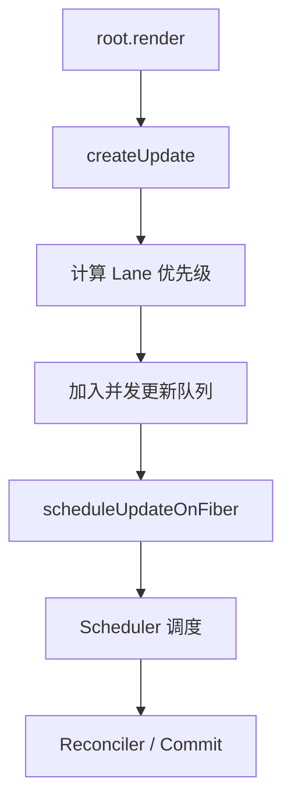

# React 源码（08） - 初始化和更新流程

> 读完后，你应能解释“root.render 与 updateContainer”，复现“Update 对象与并发更新队列”的最小实现，并用“Lane 优先级与 Fiber 标记”检查结果与失败边界。

## 核心知识清单

- root.render 与 updateContainer
- Update 对象与并发更新队列
- Lane 优先级与 Fiber 标记
- scheduleUpdateOnFiber 调度入口
- ensureRootIsScheduled 与 Scheduler 桥接

# 一、React 初次渲染流程：root.render(\</APP>)

如下图，会去拿到两个信息，一个是 eventTime，可以粗略的理解为 performance.now()，另一个 lane，获取当前根容器的 fiber 的车道模型，当前为 defaultLane


如下图，接着看 `updateContainer` 逻辑，主要是创建 update 对象，计算优先级 Lane，然后放入全局队列，供后续消费



图示说明：首次渲染从 `root.render` 创建 Update，计算 Lane 并入队，然后由 Scheduler 驱动 Reconciler 和 Commit。

updateContainer 大约是这样的流程，走到 `scheduleUpdateOnFiber` - Reconciler 的调度入口

```js
// 用户首次调用
root.render(<App />)

// 执行流程：
// 1. 创建更新对象 createUpdate
const update = {
  eventTime: now(),
  lane: 16,
  payload: { element: <App /> },
  callback: null
}

// 2. 检查是否为渲染阶段更新
// 首次渲染：isUnsafeClassRenderPhaseUpdate(fiber) = false
// 走正常并发更新路径

// 3. 加入并发队列（全局数组） enqueueUpdate
concurrentQueues = [fiber, queue, update, 16]
concurrentQueuesIndex = 4

// 4. 更新Fiber状态
fiber.lanes = 16 // 标记这个Fiber有工作要做

// 5. 返回根节点
return fiberRoot

// 6. 后续调度 packages/react-reconciler/src/ReactFiberReconciler.old.js
scheduleUpdateOnFiber(fiberRoot, current, 16, eventTime)

// 7. 确保根节点被调度 - 连接到 Scheduler 的桥梁 packages/react-reconciler/src/ReactFiberWorkLoop.old.js
ensureRootIsScheduled(root, eventTime)
```

接下来就是 scheduler 的处理

# 二、总结

- **React 初次渲染流程：root.render(\</APP>)**：如下图，会去拿到两个信息，一个是 eventTime，可以粗略的理解为 performance.now()，另一个 lane，获取当前根容器的 fiber 的车道模型，当前为 defaultLane

## 参考资料

- [React 文档](https://react.dev/learn)
- [React 源码](https://github.com/facebook/react)
