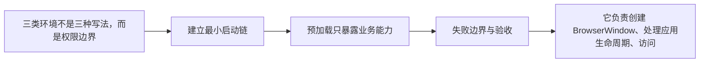
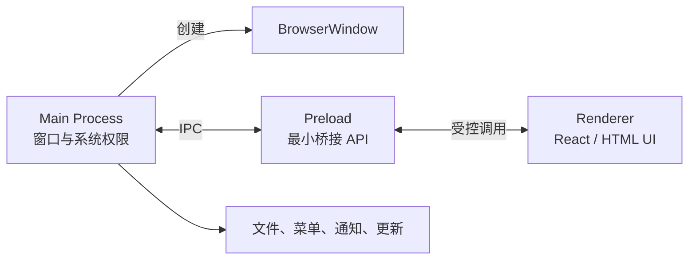

# Electron（01） - 主进程、渲染进程与预加载脚本

> 读完后，你应能完成以下任务：
> - 绘制“Electron（01） - 主进程、渲染进程与预加载脚本 / 三类环境不是三种写法，而是权限边界”的关键对象与数据流，解释“主进程是应用入口，每个应用只有一个主进程。”，并用源码位置、日志或 Trace 标注证据。
> - 为“Electron（01） - 主进程、渲染进程与预加载脚本 / 建立最小启动链”设计正常与异常输入，验证“窗口创建失败、页面加载失败和渲染进程崩溃都应进入日志与恢复策略。”，输出首个偏差位置与回归测试结果。
> - 实现“Electron（01） - 主进程、渲染进程与预加载脚本 / 预加载只暴露业务能力”的最小代码或配置，检验“接口要按业务动词命名，并为输入、输出、错误码和版本建立 TypeScript 契约。”，输出命令、结果与 Diff，并说明不适用边界。

<!-- article-progressive-block:start -->
# 一、先建立全局：主进程、渲染进程与预加载脚本 是什么？

理解“主进程、渲染进程与预加载脚本”，先要把标题中的对象放进同一条处理链：它接收什么输入，经过哪些状态变化，最终用什么证据判断结果。下表不另造概念，只把作者正文已经解释的章节按依赖顺序连起来。

“主进程、渲染进程与预加载脚本”的第一个核心判断是：主进程是应用入口，每个应用只有一个主进程。。先弄清这个判断中的对象和输入输出，后面的实现、故障和验收才有共同语境。

| 顺序 | 章节 | 读完本节应抓住的结论 |
| --- | --- | --- |
| 1 | 三类环境不是三种写法，而是权限边界 | 主进程是应用入口，每个应用只有一个主进程。 |
| 2 | 建立最小启动链 | 窗口创建失败、页面加载失败和渲染进程崩溃都应进入日志与恢复策略。 |
| 3 | 预加载只暴露业务能力 | 接口要按业务动词命名，并为输入、输出、错误码和版本建立 TypeScript 契约。 |
| 4 | 失败边界与验收 | 开启 nodeIntegration 会让 XSS 直接升级为本地代码执行风险。 |
| 5 | 它负责创建 BrowserWindow、处理应用生命周期、访问  | 它负责创建 BrowserWindow、处理应用生命周期、访问 Node.js 和操作系统能力。 |
| 6 | 每个窗口中的网页运行在独立渲染进程 | 每个窗口中的网页运行在独立渲染进程，按 Chromium 的多进程模型显示 UI； |

## 1.1 核心对象之间怎样衔接



这张图只表达本文的讲解顺序，不替代正文机制。判断“主进程、渲染进程与预加载脚本”是否真正掌握，需要能从最后一个结果沿图回到前面每个章节的输入、状态变化和证据。

## 1.2 再看失败：问题最早会出现在哪一步？

在“主进程、渲染进程与预加载脚本”的对象和顺序已经明确后，再看可观察的失败：状态不同步、事件重复、事务丢失、IPC 越权或页面不可交互。定位时不从最后一条错误猜原因，而是沿上图找第一个偏离正文结论的节点。
<!-- article-progressive-block:end -->

# 二、三类环境不是三种写法，而是权限边界

主进程是应用入口，每个应用只有一个主进程。它负责创建 `BrowserWindow`、处理应用生命周期、访问 Node.js 和操作系统能力。每个窗口中的网页运行在独立渲染进程，按 Chromium 的多进程模型显示 UI；渲染进程应按普通不可信网页看待，不能直接获得文件系统和 Shell 权限。

预加载脚本在页面加载前运行，能访问受限的 Electron/Node 能力，并通过 `contextBridge` 提供经过设计的 API。它不是“把 Node 全局变量搬到 window”的捷径，而是主进程与不可信页面之间的适配层。



# 三、建立最小启动链

```ts
// main.ts
import { app, BrowserWindow } from 'electron'
import path from 'node:path'

/** 创建并配置应用主窗口。 */
function createMainWindow(): void {
  /** 承载前端页面的主窗口。 */
  const mainWindow = new BrowserWindow({
    width: 1200,
    height: 800,
    webPreferences: {
      preload: path.join(__dirname, 'preload.js'), // 只加载经过构建和审计的桥接脚本。
      contextIsolation: true, // 隔离页面世界与预加载脚本的高权限世界。
      nodeIntegration: false, // 禁止页面直接调用 Node.js。
      sandbox: true // 让渲染进程使用 Chromium 沙盒。
    }
  })

  void mainWindow.loadFile('index.html')
}

// Electron 完成初始化后再创建依赖原生能力的窗口。
void app.whenReady().then(() => {
  createMainWindow()

  app.on('activate', () => {
    // macOS 点击 Dock 且没有窗口时重新创建主窗口。
    if (BrowserWindow.getAllWindows().length === 0) createMainWindow()
  })
})

app.on('window-all-closed', () => {
  // macOS 应用通常保留菜单栏进程，其它平台关闭全部窗口后退出。
  if (process.platform !== 'darwin') app.quit()
})
```

不要在模块顶层长期持有已经销毁的窗口引用；需要全局引用时监听 `closed` 并清空。窗口创建失败、页面加载失败和渲染进程崩溃都应进入日志与恢复策略。

# 四、预加载只暴露业务能力

```ts
// preload.ts
import { contextBridge, ipcRenderer } from 'electron'

/** 页面允许读取的应用信息 API。 */
interface DesktopApi {
  /** 返回当前桌面应用版本。 */
  getVersion(): Promise<string>
}

/** 暴露给页面的冻结业务 API。 */
const desktopApi: DesktopApi = {
  getVersion: () => ipcRenderer.invoke('app:get-version') as Promise<string>
}

contextBridge.exposeInMainWorld('desktopApi', Object.freeze(desktopApi))
```

页面只能看到 `getVersion()`，看不到通用 `ipcRenderer.send`、文件路径或任意 Channel。接口要按业务动词命名，并为输入、输出、错误码和版本建立 TypeScript 契约。

# 五、失败边界与验收

- 开启 `nodeIntegration` 会让 XSS 直接升级为本地代码执行风险。
- 关闭 `contextIsolation` 会让页面脚本污染预加载环境，破坏可信边界。
- 将 `ipcRenderer` 整体暴露给页面等于允许调用未来新增的高权限 Channel。
- 主进程执行 CPU 密集任务会冻结所有窗口，应移到 Utility Process、Worker 或独立服务。
- 渲染进程崩溃不等于主进程退出，需要监听并提供重载、故障页或安全退出。

验收时检查所有窗口的 `webPreferences`，确认页面无法访问 `require` 和 `process` 高权限字段；构造页面 XSS 测试，验证其只能调用白名单 API；同时覆盖 Windows、macOS 至少一种“关闭全部窗口”和“重新激活”流程。

<!-- article-progressive-block:start -->
# 六、动手验证：先跑通 主进程、渲染进程与预加载脚本，再改变一个变量

前面的章节已经建立问题、概念和机制。现在把“主进程、渲染进程与预加载脚本”放进同一套基线中运行；本节不再引入新术语，只验证前文结论能否被复现。

## 6.1 基线与候选只允许一个变量不同

验证“主进程、渲染进程与预加载脚本”时，先固定运行时版本、页面状态、用户操作、权限设置和持久化数据。候选方案只能改变本次要验证的变量；如果同时更换数据、依赖和配置，即使结果改善，也不能知道是哪一项产生作用。

执行“主进程、渲染进程与预加载脚本”时，动作是：从用户事件回放渲染、进程通信或编辑器事务，覆盖成功与拒绝路径。原始结果不能只保留截图或汇总分数，必须同步保存：DOM 断言、事件序列、事务步骤、IPC 记录、控制台和页面截图，使下一次复查可以在同一输入上重放。

| 实验要素 | 本文要求 |
| --- | --- |
| 固定条件 | 固定运行时版本、页面状态、用户操作、权限设置和持久化数据 |
| 唯一变量 | 本次候选方案与基线之间的一项明确差异 |
| 原始证据 | DOM 断言、事件序列、事务步骤、IPC 记录、控制台和页面截图 |
| 通过阈值 | 界面状态与数据状态一致，越权输入在产生副作用前被拒绝 |
| 立即停止 | 状态不同步、事件重复、事务丢失、IPC 越权或页面不可交互 |

## 6.2 执行前先排除不可比较条件

“主进程、渲染进程与预加载脚本”开始前先确认下面四项；任一项不成立，都应先修复实验条件，而不是解释结果。

- 基线能够在“主进程、渲染进程与预加载脚本”的当前环境重复运行。
- 候选只改变一个与“主进程、渲染进程与预加载脚本”结论直接相关的条件。
- “主进程、渲染进程与预加载脚本”的基线和候选使用同一批输入、同一版本依赖与同一通过阈值。
- “主进程、渲染进程与预加载脚本”的原始输出和失败现场不会被重试、格式化或汇总覆盖。

## 6.3 执行后先核对证据完整性

结果出来后先检查证据，再讨论“主进程、渲染进程与预加载脚本”是否通过。缺少中间状态时，最终输出只能说明现象，不能证明机制。

| 检查项 | 当前文章的判定 |
| --- | --- |
| 输入可追溯 | 固定运行时版本、页面状态、用户操作、权限设置和持久化数据 |
| 过程可回放 | 从用户事件回放渲染、进程通信或编辑器事务，覆盖成功与拒绝路径 |
| 结果可审计 | DOM 断言、事件序列、事务步骤、IPC 记录、控制台和页面截图 |

“主进程、渲染进程与预加载脚本”的一次合格基线对照按以下顺序执行：

1. 保存“主进程、渲染进程与预加载脚本”基线版本及输入摘要，确认基线本身可以重复运行。
2. 写下“主进程、渲染进程与预加载脚本”候选方案唯一变化的变量，以及它预期影响的指标。
3. 在同一环境执行“主进程、渲染进程与预加载脚本”：从用户事件回放渲染、进程通信或编辑器事务，覆盖成功与拒绝路径。
4. 为“主进程、渲染进程与预加载脚本”保存：DOM 断言、事件序列、事务步骤、IPC 记录、控制台和页面截图。
5. 使用“主进程、渲染进程与预加载脚本”预登记条件判断：界面状态与数据状态一致，越权输入在产生副作用前被拒绝。
6. 如果“主进程、渲染进程与预加载脚本”未通过，不修改第二个变量，先恢复基线并保留失败现场。

# 七、用一张矩阵验证 主进程、渲染进程与预加载脚本 的关键结论

矩阵按正文顺序列出“主进程、渲染进程与预加载脚本”的结论。一次实验只选择一行，只改变这一行对应的条件；不要把多行合并成一个无法归因的大实验。

| 正文章节 | 已解释的结论 | 本轮唯一变量 | 必须保存的证据 |
| --- | --- | --- | --- |
| 三类环境不是三种写法，而是权限边界 | 主进程是应用入口，每个应用只有一个主进程。 | 只改变与“三类环境不是三种写法，而是权限边界”相关的条件 | DOM 断言、事件序列、事务步骤、IPC 记录、控制台和页面截图 |
| 建立最小启动链 | 窗口创建失败、页面加载失败和渲染进程崩溃都应进入日志与恢复策略。 | 只改变与“建立最小启动链”相关的条件 | DOM 断言、事件序列、事务步骤、IPC 记录、控制台和页面截图 |
| 预加载只暴露业务能力 | 接口要按业务动词命名，并为输入、输出、错误码和版本建立 TypeScript 契约。 | 只改变与“预加载只暴露业务能力”相关的条件 | DOM 断言、事件序列、事务步骤、IPC 记录、控制台和页面截图 |
| 失败边界与验收 | 开启 nodeIntegration 会让 XSS 直接升级为本地代码执行风险。 | 只改变与“失败边界与验收”相关的条件 | DOM 断言、事件序列、事务步骤、IPC 记录、控制台和页面截图 |
| 它负责创建 BrowserWindow、处理应用生命周期、访问  | 它负责创建 BrowserWindow、处理应用生命周期、访问 Node.js 和操作系统能力。 | 只改变与“它负责创建 BrowserWindow、处理应用生命周期、访问 ”相关的条件 | DOM 断言、事件序列、事务步骤、IPC 记录、控制台和页面截图 |
| 每个窗口中的网页运行在独立渲染进程 | 每个窗口中的网页运行在独立渲染进程，按 Chromium 的多进程模型显示 UI； | 只改变与“每个窗口中的网页运行在独立渲染进程”相关的条件 | DOM 断言、事件序列、事务步骤、IPC 记录、控制台和页面截图 |

## 7.1 记录本次实际实验

下面的记录用于“主进程、渲染进程与预加载脚本”当前这一次实验，不是第二套知识目录。先从矩阵选择一个章节，再填写实际值；没有填写的字段表示尚未验证。

```yaml
topic: "主进程、渲染进程与预加载脚本"
selected_chapter: required
claim_from_article: required
baseline_version: required
changed_condition: exactly_one
execution: "从用户事件回放渲染、进程通信或编辑器事务，覆盖成功与拒绝路径"
evidence: "DOM 断言、事件序列、事务步骤、IPC 记录、控制台和页面截图"
pass_when: "界面状态与数据状态一致，越权输入在产生副作用前被拒绝"
stop_when: "状态不同步、事件重复、事务丢失、IPC 越权或页面不可交互"
observed_result: required
first_deviation: null_or_evidence
recovery_replay: required_after_failure
```

## 7.2 边界实验必须证明能够停止和恢复

成功路径只能证明“主进程、渲染进程与预加载脚本”在当前样本上工作，不能证明它可以进入生产。边界实验需要主动制造：状态不同步、事件重复、事务丢失、IPC 越权或页面不可交互，并观察系统是否在产生不可逆副作用前停止。

| 场景 | 只改变什么 | 应保存什么 | 通过标准 |
| --- | --- | --- | --- |
| 正常路径 | 使用已知有效输入 | DOM 断言、事件序列、事务步骤、IPC 记录、控制台和页面截图 | 界面状态与数据状态一致，越权输入在产生副作用前被拒绝 |
| 边界路径 | 把一个输入推进到约束临界值 | 临界值前后的输出与指标 | 不静默降级，不把部分结果冒充成功 |
| 明确失败 | 注入：状态不同步、事件重复、事务丢失、IPC 越权或页面不可交互 | 原始错误、首个异常阶段和最终状态 | 失败被正确分类且没有扩大副作用 |
| 恢复重放 | 执行：按事件、状态、渲染或进程边界定位第一处偏差并重放 | 原失败样本的复测证据 | 原样本恢复，正常样本没有回归 |

恢复动作不是简单重启。对于“主进程、渲染进程与预加载脚本”，第一步是：按事件、状态、渲染或进程边界定位第一处偏差并重放。完成后使用原始失败样本复测；只验证一个新样本成功，不能证明触发条件已经消失。

“主进程、渲染进程与预加载脚本”边界实验结束后，应把正常、临界、失败和恢复四类记录放在同一个运行批次中。这样才能区分“候选方案真的修复问题”和“环境变化让问题暂时没有出现”。

# 八、主进程、渲染进程与预加载脚本 的结果解释

解释“主进程、渲染进程与预加载脚本”实验时先看首个偏差，而不是最后一条错误。最后的异常通常只是上游状态错误的结果；从末端反推容易误把症状当根因。

| 观察结果 | 可以支持的判断 | 下一步 |
| --- | --- | --- |
| 主链路没有达到预期 | 状态不同步、事件重复、事务丢失、IPC 越权或页面不可交互 | 先执行：按事件、状态、渲染或进程边界定位第一处偏差并重放 |
| 异常链路无法恢复 | 状态不同步、事件重复、事务丢失、IPC 越权或页面不可交互 | 先执行：按事件、状态、渲染或进程边界定位第一处偏差并重放 |
| 新样本成功但原样本仍失败 | 修复没有覆盖原始触发条件 | 固定原失败输入，恢复基线后重新比较 |
| 指标改善但证据无法回链 | 数据、版本或中间状态没有固定 | 暂停发布，补齐可追溯记录后重跑 |

“主进程、渲染进程与预加载脚本”只有同时满足“界面状态与数据状态一致，越权输入在产生副作用前被拒绝”，并且没有出现“状态不同步、事件重复、事务丢失、IPC 越权或页面不可交互”，才可以认为主链路通过。这里的“通过”只对当前固定版本、样本和环境有效，不能外推到尚未测试的容量、权限或数据分布。

如果“主进程、渲染进程与预加载脚本”候选方案与基线差异很小，先检查证据分辨率是否足够；如果差异很大，先排除数据泄漏、环境漂移和版本不一致。两种情况都不能只看一个汇总均值，需要回到逐样本输出和中间状态。

“主进程、渲染进程与预加载脚本”故障定位完成后，记录“现象、首个偏差、根因、改动、原样本复测”五项。缺少原样本复测时，只能标记为待观察，不能标记为已解决。

# 九、主进程、渲染进程与预加载脚本 的发布判断

发布判断需要把“主进程、渲染进程与预加载脚本”的质量、失败边界和恢复能力放在同一份记录中。以下任一条件缺失，都应停止扩量，而不是用“基本正常”替代证据。

- [ ] “主进程、渲染进程与预加载脚本”的基线与候选只存在一个计划内变量。
- [ ] “主进程、渲染进程与预加载脚本”的输入、代码、依赖、配置和数据版本可以追溯。
- [ ] “主进程、渲染进程与预加载脚本”的正常、临界、失败和恢复样本使用同一套断言。
- [ ] “主进程、渲染进程与预加载脚本”的原始输出、中间状态和失败现场已经保留。
- [ ] “主进程、渲染进程与预加载脚本”的日志、Trace、截图和测试数据已经脱敏。
- [ ] “主进程、渲染进程与预加载脚本”的停止条件、负责人和回滚入口已经演练。
- [ ] “主进程、渲染进程与预加载脚本”尚未覆盖的输入、权限、容量和外部依赖已经登记。

最终记录至少包含基线版本、唯一变量、原始证据、首个偏差、恢复复测和发布责任人。没有参与本次修改的人如果不能据此重放“主进程、渲染进程与预加载脚本”的判断，就不能发布。
<!-- article-progressive-block:end -->

# 十、总结

- **三类环境不是三种写法，而是权限边界**：主进程是应用入口，每个应用只有一个主进程。
- **建立最小启动链**：窗口创建失败、页面加载失败和渲染进程崩溃都应进入日志与恢复策略。
- **预加载只暴露业务能力**：接口要按业务动词命名，并为输入、输出、错误码和版本建立 TypeScript 契约。
- **失败边界与验收**：开启 nodeIntegration 会让 XSS 直接升级为本地代码执行风险。

## 参考资料

- [Electron：Process Model](https://www.electronjs.org/docs/latest/tutorial/process-model)
- [Electron：Process Sandboxing](https://www.electronjs.org/docs/latest/tutorial/sandbox)
- [Electron：BrowserWindow](https://www.electronjs.org/docs/latest/api/browser-window)
