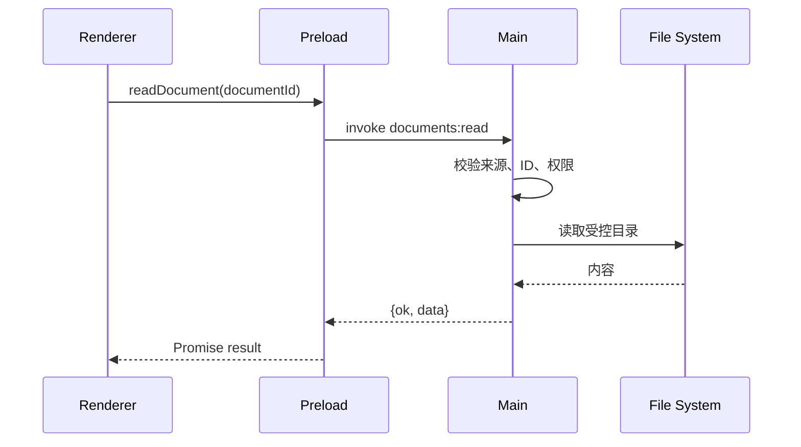

# Electron（02） - IPC 通信与上下文隔离

> 读完后，你应能完成以下任务：
> - 绘制“Electron（02） - IPC 通信与上下文隔离 / IPC 是本地 API，不是内部函数调用”的关键对象与数据流，解释“渲染进程与主进程内存隔离，通信必须经过序列化。”，并用源码位置、日志或 Trace 标注证据。
> - 为“Electron（02） - IPC 通信与上下文隔离 / 类型契约不能代替运行时校验”设计正常与异常输入，验证“Channel 名使用 domain:action，输入和输出保持小而稳定。”，输出首个偏差位置与回归测试结果。
> - 实现“Electron（02） - IPC 通信与上下文隔离 / Context Isolation 的正确桥接”的最小代码或配置，检验“而不是暴露 send(channel,”，输出命令、结果与 Diff，并说明不适用边界。

<!-- article-progressive-block:start -->
# 一、先建立全局：IPC 通信与上下文隔离 是什么？

理解“IPC 通信与上下文隔离”，先要把标题中的对象放进同一条处理链：它接收什么输入，经过哪些状态变化，最终用什么证据判断结果。下表不另造概念，只把作者正文已经解释的章节按依赖顺序连起来。

“IPC 通信与上下文隔离”的第一个核心判断是：渲染进程与主进程内存隔离，通信必须经过序列化。。先弄清这个判断中的对象和输入输出，后面的实现、故障和验收才有共同语境。

| 顺序 | 章节 | 读完本节应抓住的结论 |
| --- | --- | --- |
| 1 | IPC 是本地 API，不是内部函数调用 | 渲染进程与主进程内存隔离，通信必须经过序列化。 |
| 2 | 类型契约不能代替运行时校验 | Channel 名使用 domain:action，输入和输出保持小而稳定。 |
| 3 | Context Isolation 的正确桥接 | 而不是暴露 send(channel, |
| 4 | 故障、性能与验收 | 同一个 Channel 重复 handle 会抛错，注册逻辑必须与应用生命周期一致。 |
| 5 | ipcRenderer.invoke 与 ipcMain.han | ipcRenderer.invoke 与 ipcMain.handle 适合请求响应； |
| 6 | send/on 适合单向事件 | send/on 适合单向事件； |

## 1.1 核心对象之间怎样衔接


这张图只表达本文的讲解顺序，不替代正文机制。判断“IPC 通信与上下文隔离”是否真正掌握，需要能从最后一个结果沿图回到前面每个章节的输入、状态变化和证据。

## 1.2 再看失败：问题最早会出现在哪一步？

在“IPC 通信与上下文隔离”的对象和顺序已经明确后，再看可观察的失败：状态不同步、事件重复、事务丢失、IPC 越权或页面不可交互。定位时不从最后一条错误猜原因，而是沿上图找第一个偏离正文结论的节点。
<!-- article-progressive-block:end -->

# 二、IPC 是本地 API，不是内部函数调用

渲染进程与主进程内存隔离，通信必须经过序列化。
`ipcRenderer.invoke` 与 `ipcMain.handle` 适合请求响应；
`send`/`on` 适合单向事件；
主进程向页面推送时使用目标 `webContents.send`。
传输值遵循 Structured Clone，函数、DOM 对象和部分原生对象不能直接发送。

每个 Channel 都是一个攻击面。
页面内容、第三方脚本甚至被利用的 XSS 都可能调用预加载暴露的函数，
因此主进程必须把请求当成不可信输入，
检查参数、窗口来源、用户权限和允许访问的资源路径。



# 三、类型契约不能代替运行时校验

```ts
// main/ipc/documents.ts
import { ipcMain } from 'electron'

/** 文档读取成功或失败的稳定返回值。 */
type ReadDocumentResult =
  | { ok: true; content: string }
  | { ok: false; code: 'INVALID_ID' | 'FORBIDDEN' | 'NOT_FOUND' }

/** 注册文档读取 IPC，并校验调用方和参数。 */
export function registerDocumentIpc(): void {
  ipcMain.handle('documents:read', async (event, documentId: unknown): Promise<ReadDocumentResult> => {
    /** 发起 IPC 的页面 URL。 */
    const senderUrl = event.senderFrame.url

    if (!senderUrl.startsWith('file://')) {
      return { ok: false, code: 'FORBIDDEN' }
    }

    if (typeof documentId !== 'string' || !/^[a-z0-9_-]{1,64}$/i.test(documentId)) {
      return { ok: false, code: 'INVALID_ID' }
    }

    // 真实项目应从 ID 映射受控文件，不能把页面传入值直接拼成本地路径。
    return documentId === 'demo'
      ? { ok: true, content: 'Hello Electron' }
      : { ok: false, code: 'NOT_FOUND' }
  })
}
```

Channel 名使用 `domain:action`，输入和输出保持小而稳定。
不要在返回值中泄露绝对路径、堆栈或系统用户名。
错误应转换成业务码，详细异常只写入脱敏日志并关联 request ID。

# 四、Context Isolation 的正确桥接

预加载脚本应逐个包装业务方法，
而不是暴露 `send(channel,
...args)` 这类通用入口。
主进程推送事件时，预加载注册固定 Channel，并返回取消订阅函数；
否则页面重复挂载会积累监听器。

对于文件选择，
页面调用“选择导入文件”，
主进程打开 `dialog` 并返回经过校验的元数据，
而不是允许页面提交任意绝对路径。
对于 Shell 打开链接，只允许 `https:` 且匹配可信域名；
不能把任意 URL 直接交给 `shell.openExternal`。

# 五、故障、性能与验收

- 同一个 Channel 重复 `handle` 会抛错，注册逻辑必须与应用生命周期一致。
- 窗口销毁后继续推送会失败，发送前检查 `webContents.isDestroyed()`。
- 高频进度事件会压满 IPC 队列，应节流、合并或改用 MessagePort 流式传输。
- 只校验文件扩展名无法防止路径穿越和伪造内容，应使用 ID 映射、规范化路径和 MIME/内容检查。
- TypeScript 类型在恶意调用时不存在，主进程仍要执行运行时校验。

验收至少覆盖非法 Channel 不可达、非法参数、伪造来源、重复监听、窗口关闭后推送和处理器异常。
安全检查应确认 DevTools 中无法取得原始 `ipcRenderer`，
并对全部暴露 API 建立清单和负责人。

<!-- article-progressive-block:start -->
# 六、动手验证：先跑通 IPC 通信与上下文隔离，再改变一个变量

前面的章节已经建立问题、概念和机制。现在把“IPC 通信与上下文隔离”放进同一套基线中运行；本节不再引入新术语，只验证前文结论能否被复现。

## 6.1 基线与候选只允许一个变量不同

验证“IPC 通信与上下文隔离”时，先固定运行时版本、页面状态、用户操作、权限设置和持久化数据。候选方案只能改变本次要验证的变量；如果同时更换数据、依赖和配置，即使结果改善，也不能知道是哪一项产生作用。

执行“IPC 通信与上下文隔离”时，动作是：从用户事件回放渲染、进程通信或编辑器事务，覆盖成功与拒绝路径。原始结果不能只保留截图或汇总分数，必须同步保存：DOM 断言、事件序列、事务步骤、IPC 记录、控制台和页面截图，使下一次复查可以在同一输入上重放。

| 实验要素 | 本文要求 |
| --- | --- |
| 固定条件 | 固定运行时版本、页面状态、用户操作、权限设置和持久化数据 |
| 唯一变量 | 本次候选方案与基线之间的一项明确差异 |
| 原始证据 | DOM 断言、事件序列、事务步骤、IPC 记录、控制台和页面截图 |
| 通过阈值 | 界面状态与数据状态一致，越权输入在产生副作用前被拒绝 |
| 立即停止 | 状态不同步、事件重复、事务丢失、IPC 越权或页面不可交互 |

## 6.2 执行前先排除不可比较条件

“IPC 通信与上下文隔离”开始前先确认下面四项；任一项不成立，都应先修复实验条件，而不是解释结果。

- 基线能够在“IPC 通信与上下文隔离”的当前环境重复运行。
- 候选只改变一个与“IPC 通信与上下文隔离”结论直接相关的条件。
- “IPC 通信与上下文隔离”的基线和候选使用同一批输入、同一版本依赖与同一通过阈值。
- “IPC 通信与上下文隔离”的原始输出和失败现场不会被重试、格式化或汇总覆盖。

## 6.3 执行后先核对证据完整性

结果出来后先检查证据，再讨论“IPC 通信与上下文隔离”是否通过。缺少中间状态时，最终输出只能说明现象，不能证明机制。

| 检查项 | 当前文章的判定 |
| --- | --- |
| 输入可追溯 | 固定运行时版本、页面状态、用户操作、权限设置和持久化数据 |
| 过程可回放 | 从用户事件回放渲染、进程通信或编辑器事务，覆盖成功与拒绝路径 |
| 结果可审计 | DOM 断言、事件序列、事务步骤、IPC 记录、控制台和页面截图 |

“IPC 通信与上下文隔离”的一次合格基线对照按以下顺序执行：

1. 保存“IPC 通信与上下文隔离”基线版本及输入摘要，确认基线本身可以重复运行。
2. 写下“IPC 通信与上下文隔离”候选方案唯一变化的变量，以及它预期影响的指标。
3. 在同一环境执行“IPC 通信与上下文隔离”：从用户事件回放渲染、进程通信或编辑器事务，覆盖成功与拒绝路径。
4. 为“IPC 通信与上下文隔离”保存：DOM 断言、事件序列、事务步骤、IPC 记录、控制台和页面截图。
5. 使用“IPC 通信与上下文隔离”预登记条件判断：界面状态与数据状态一致，越权输入在产生副作用前被拒绝。
6. 如果“IPC 通信与上下文隔离”未通过，不修改第二个变量，先恢复基线并保留失败现场。

# 七、用一张矩阵验证 IPC 通信与上下文隔离 的关键结论

矩阵按正文顺序列出“IPC 通信与上下文隔离”的结论。一次实验只选择一行，只改变这一行对应的条件；不要把多行合并成一个无法归因的大实验。

| 正文章节 | 已解释的结论 | 本轮唯一变量 | 必须保存的证据 |
| --- | --- | --- | --- |
| IPC 是本地 API，不是内部函数调用 | 渲染进程与主进程内存隔离，通信必须经过序列化。 | 只改变与“IPC 是本地 API，不是内部函数调用”相关的条件 | DOM 断言、事件序列、事务步骤、IPC 记录、控制台和页面截图 |
| 类型契约不能代替运行时校验 | Channel 名使用 domain:action，输入和输出保持小而稳定。 | 只改变与“类型契约不能代替运行时校验”相关的条件 | DOM 断言、事件序列、事务步骤、IPC 记录、控制台和页面截图 |
| Context Isolation 的正确桥接 | 而不是暴露 send(channel, | 只改变与“Context Isolation 的正确桥接”相关的条件 | DOM 断言、事件序列、事务步骤、IPC 记录、控制台和页面截图 |
| 故障、性能与验收 | 同一个 Channel 重复 handle 会抛错，注册逻辑必须与应用生命周期一致。 | 只改变与“故障、性能与验收”相关的条件 | DOM 断言、事件序列、事务步骤、IPC 记录、控制台和页面截图 |
| ipcRenderer.invoke 与 ipcMain.han | ipcRenderer.invoke 与 ipcMain.handle 适合请求响应； | 只改变与“ipcRenderer.invoke 与 ipcMain.han”相关的条件 | DOM 断言、事件序列、事务步骤、IPC 记录、控制台和页面截图 |
| send/on 适合单向事件 | send/on 适合单向事件； | 只改变与“send/on 适合单向事件”相关的条件 | DOM 断言、事件序列、事务步骤、IPC 记录、控制台和页面截图 |

## 7.1 记录本次实际实验

下面的记录用于“IPC 通信与上下文隔离”当前这一次实验，不是第二套知识目录。先从矩阵选择一个章节，再填写实际值；没有填写的字段表示尚未验证。

```yaml
topic: "IPC 通信与上下文隔离"
selected_chapter: required
claim_from_article: required
baseline_version: required
changed_condition: exactly_one
execution: "从用户事件回放渲染、进程通信或编辑器事务，覆盖成功与拒绝路径"
evidence: "DOM 断言、事件序列、事务步骤、IPC 记录、控制台和页面截图"
pass_when: "界面状态与数据状态一致，越权输入在产生副作用前被拒绝"
stop_when: "状态不同步、事件重复、事务丢失、IPC 越权或页面不可交互"
observed_result: required
first_deviation: null_or_evidence
recovery_replay: required_after_failure
```

## 7.2 边界实验必须证明能够停止和恢复

成功路径只能证明“IPC 通信与上下文隔离”在当前样本上工作，不能证明它可以进入生产。边界实验需要主动制造：状态不同步、事件重复、事务丢失、IPC 越权或页面不可交互，并观察系统是否在产生不可逆副作用前停止。

| 场景 | 只改变什么 | 应保存什么 | 通过标准 |
| --- | --- | --- | --- |
| 正常路径 | 使用已知有效输入 | DOM 断言、事件序列、事务步骤、IPC 记录、控制台和页面截图 | 界面状态与数据状态一致，越权输入在产生副作用前被拒绝 |
| 边界路径 | 把一个输入推进到约束临界值 | 临界值前后的输出与指标 | 不静默降级，不把部分结果冒充成功 |
| 明确失败 | 注入：状态不同步、事件重复、事务丢失、IPC 越权或页面不可交互 | 原始错误、首个异常阶段和最终状态 | 失败被正确分类且没有扩大副作用 |
| 恢复重放 | 执行：按事件、状态、渲染或进程边界定位第一处偏差并重放 | 原失败样本的复测证据 | 原样本恢复，正常样本没有回归 |

恢复动作不是简单重启。对于“IPC 通信与上下文隔离”，第一步是：按事件、状态、渲染或进程边界定位第一处偏差并重放。完成后使用原始失败样本复测；只验证一个新样本成功，不能证明触发条件已经消失。

“IPC 通信与上下文隔离”边界实验结束后，应把正常、临界、失败和恢复四类记录放在同一个运行批次中。这样才能区分“候选方案真的修复问题”和“环境变化让问题暂时没有出现”。

# 八、IPC 通信与上下文隔离 的结果解释

解释“IPC 通信与上下文隔离”实验时先看首个偏差，而不是最后一条错误。最后的异常通常只是上游状态错误的结果；从末端反推容易误把症状当根因。

| 观察结果 | 可以支持的判断 | 下一步 |
| --- | --- | --- |
| 主链路没有达到预期 | 状态不同步、事件重复、事务丢失、IPC 越权或页面不可交互 | 先执行：按事件、状态、渲染或进程边界定位第一处偏差并重放 |
| 异常链路无法恢复 | 状态不同步、事件重复、事务丢失、IPC 越权或页面不可交互 | 先执行：按事件、状态、渲染或进程边界定位第一处偏差并重放 |
| 新样本成功但原样本仍失败 | 修复没有覆盖原始触发条件 | 固定原失败输入，恢复基线后重新比较 |
| 指标改善但证据无法回链 | 数据、版本或中间状态没有固定 | 暂停发布，补齐可追溯记录后重跑 |

“IPC 通信与上下文隔离”只有同时满足“界面状态与数据状态一致，越权输入在产生副作用前被拒绝”，并且没有出现“状态不同步、事件重复、事务丢失、IPC 越权或页面不可交互”，才可以认为主链路通过。这里的“通过”只对当前固定版本、样本和环境有效，不能外推到尚未测试的容量、权限或数据分布。

如果“IPC 通信与上下文隔离”候选方案与基线差异很小，先检查证据分辨率是否足够；如果差异很大，先排除数据泄漏、环境漂移和版本不一致。两种情况都不能只看一个汇总均值，需要回到逐样本输出和中间状态。

“IPC 通信与上下文隔离”故障定位完成后，记录“现象、首个偏差、根因、改动、原样本复测”五项。缺少原样本复测时，只能标记为待观察，不能标记为已解决。

# 九、IPC 通信与上下文隔离 的发布判断

发布判断需要把“IPC 通信与上下文隔离”的质量、失败边界和恢复能力放在同一份记录中。以下任一条件缺失，都应停止扩量，而不是用“基本正常”替代证据。

- [ ] “IPC 通信与上下文隔离”的基线与候选只存在一个计划内变量。
- [ ] “IPC 通信与上下文隔离”的输入、代码、依赖、配置和数据版本可以追溯。
- [ ] “IPC 通信与上下文隔离”的正常、临界、失败和恢复样本使用同一套断言。
- [ ] “IPC 通信与上下文隔离”的原始输出、中间状态和失败现场已经保留。
- [ ] “IPC 通信与上下文隔离”的日志、Trace、截图和测试数据已经脱敏。
- [ ] “IPC 通信与上下文隔离”的停止条件、负责人和回滚入口已经演练。
- [ ] “IPC 通信与上下文隔离”尚未覆盖的输入、权限、容量和外部依赖已经登记。

最终记录至少包含基线版本、唯一变量、原始证据、首个偏差、恢复复测和发布责任人。没有参与本次修改的人如果不能据此重放“IPC 通信与上下文隔离”的判断，就不能发布。
<!-- article-progressive-block:end -->

# 十、总结

- **IPC 是本地 API，不是内部函数调用**：渲染进程与主进程内存隔离，通信必须经过序列化。
- **类型契约不能代替运行时校验**：Channel 名使用 domain:action，输入和输出保持小而稳定。
- **Context Isolation 的正确桥接**：预加载脚本应逐个包装业务方法，而不是暴露 send(channel, ...args) 这类通用入口。
- **故障、性能与验收**：同一个 Channel 重复 handle 会抛错，注册逻辑必须与应用生命周期一致。

## 参考资料

- [Electron：Inter-Process Communication](https://www.electronjs.org/docs/latest/tutorial/ipc)
- [Electron：Context Isolation](https://www.electronjs.org/docs/latest/tutorial/context-isolation)
- [Electron：Security](https://www.electronjs.org/docs/latest/tutorial/security)
