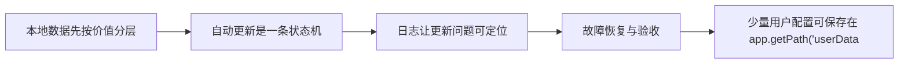
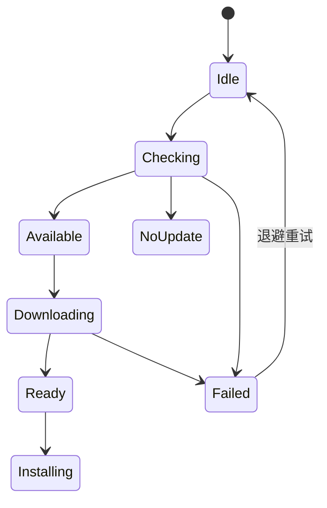

# Electron（04） - 本地存储、自动更新与日志

> 读完后，你应能完成以下任务：
> - 绘制“Electron（04） - 本地存储、自动更新与日志 / 本地数据先按价值分层”的关键对象与数据流，解释“访问令牌应进入系统 Keychain/Credential Vault，而不是明文配置。”，并用源码位置、日志或 Trace 标注证据。
> - 为“Electron（04） - 本地存储、自动更新与日志 / 自动更新是一条状态机”设计正常与异常输入，验证“更新流程至少包含检查、发现版本、下载进度、下载完成、安装、失败和下次重试。”，输出首个偏差位置与回归测试结果。
> - 实现“Electron（04） - 本地存储、自动更新与日志 / 日志让更新问题可定位”的最小代码或配置，检验“至少包含 timestamp、level、event、app_version、os、request_id 和 error_code。”，输出命令、结果与 Diff，并说明不适用边界。

<!-- article-progressive-block:start -->
# 一、先建立全局：本地存储、自动更新与日志 是什么？

理解“本地存储、自动更新与日志”，先要把标题中的对象放进同一条处理链：它接收什么输入，经过哪些状态变化，最终用什么证据判断结果。下表不另造概念，只把作者正文已经解释的章节按依赖顺序连起来。

“本地存储、自动更新与日志”的第一个核心判断是：访问令牌应进入系统 Keychain/Credential Vault，而不是明文配置。。先弄清这个判断中的对象和输入输出，后面的实现、故障和验收才有共同语境。

| 顺序 | 章节 | 读完本节应抓住的结论 |
| --- | --- | --- |
| 1 | 本地数据先按价值分层 | 访问令牌应进入系统 Keychain/Credential Vault，而不是明文配置。 |
| 2 | 自动更新是一条状态机 | 更新流程至少包含检查、发现版本、下载进度、下载完成、安装、失败和下次重试。 |
| 3 | 日志让更新问题可定位 | 至少包含 timestamp、level、event、app_version、os、request_id 和 error_code。 |
| 4 | 故障恢复与验收 | 配置解析失败时从备份恢复，不能直接用默认值覆盖损坏文件导致证据丢失。 |
| 5 | 少量用户配置可保存在 app.getPath('userData | 少量用户配置可保存在 app.getPath('userData') 下的 JSON； |
| 6 | 需要查询、事务或大量记录时使用 SQLite 等嵌入式数据库 | 需要查询、事务或大量记录时使用 SQLite 等嵌入式数据库； |

## 1.1 核心对象之间怎样衔接



这张图只表达本文的讲解顺序，不替代正文机制。判断“本地存储、自动更新与日志”是否真正掌握，需要能从最后一个结果沿图回到前面每个章节的输入、状态变化和证据。

## 1.2 再看失败：问题最早会出现在哪一步？

在“本地存储、自动更新与日志”的对象和顺序已经明确后，再看可观察的失败：状态不同步、事件重复、事务丢失、IPC 越权或页面不可交互。定位时不从最后一条错误猜原因，而是沿上图找第一个偏离正文结论的节点。
<!-- article-progressive-block:end -->

# 二、本地数据先按价值分层

少量用户配置可保存在 `app.getPath('userData')` 下的 JSON；
需要查询、事务或大量记录时使用 SQLite 等嵌入式数据库；
可重新生成的图片和索引放 Cache；
访问令牌应进入系统 Keychain/Credential Vault，而不是明文配置。
日志单独放 `logs` 目录并设置轮转与脱敏。

写 JSON 时不能直接覆盖正式文件：进程崩溃可能留下半截内容。
应写临时文件、刷新后原子替换，并保留上一版本备份。
所有持久数据都要带 `schemaVersion`，启动时按版本逐步迁移；
迁移失败应停止使用新 Schema，并提供恢复或只读模式。

```ts
import { app } from 'electron'
import { mkdir, rename, writeFile } from 'node:fs/promises'
import path from 'node:path'

/** 应用本地配置的数据契约。 */
interface AppSettings {
  /** 配置结构版本。 */
  schemaVersion: 1
  /** 用户选择的界面主题。 */
  theme: 'light' | 'dark' | 'system'
}

/** 使用临时文件和原子替换保存设置。 */
export async function saveSettings(settings: AppSettings): Promise<void> {
  /** 应用可写的用户数据目录。 */
  const userDataDirectory = app.getPath('userData')
  /** 正式设置文件路径。 */
  const settingsPath = path.join(userDataDirectory, 'settings.json')
  /** 同目录临时文件路径，保证 rename 可原子替换。 */
  const temporaryPath = `${settingsPath}.tmp`

  await mkdir(userDataDirectory, { recursive: true })
  await writeFile(temporaryPath, JSON.stringify(settings, null, 2), { encoding: 'utf8', mode: 0o600 })
  await rename(temporaryPath, settingsPath)
}
```

# 三、自动更新是一条状态机

更新流程至少包含检查、发现版本、下载进度、下载完成、安装、失败和下次重试。
UI 只展示状态，不直接拼更新 URL。
主进程验证发布渠道、当前平台和签名后再调用 `autoUpdater`。
强制更新必须有明确的最低兼容版本依据，否则下载失败会把用户锁死。



应用退出安装前要处理未保存文档，不能静默丢数据。
分批发布时 Channel 与版本策略必须服务端可控，并保留快速撤回更新清单的能力。
不同平台的更新支持和打包格式不同，需要以真实签名制品测试，开发包不能证明生产更新有效。

# 四、日志让更新问题可定位

日志使用 JSON 或稳定键值，
至少包含 timestamp、level、event、app_version、os、request_id 和 error_code。
IPC、窗口崩溃、数据库迁移和更新状态使用同一会话标识串联。
禁止记录令牌、完整用户正文和绝对个人路径；
必要字段做摘要或脱敏。

日志文件按大小与天数轮转，崩溃前缓冲应及时刷新。
用户反馈入口可生成诊断包，但必须先展示包含范围并允许用户确认。
远程上传使用限流、压缩和失败重试，不能因日志服务不可用阻塞主功能。

# 五、故障恢复与验收

- 配置解析失败时从备份恢复，不能直接用默认值覆盖损坏文件导致证据丢失。
- 数据库迁移要在事务或备份保护下执行，失败后禁止继续写新格式。
- 更新下载成功不代表安装成功，应在新版本首次启动记录确认事件。
- 日志目录写满会影响业务写入，需要容量上限和磁盘不足告警。
- 多窗口并发写配置要串行化，否则原子 rename 仍可能发生最后写入覆盖。

验收包括断电式中断写入、旧版本数据升级、迁移失败回滚、无网络检查更新、下载中断续传、签名无效和新版本启动确认。
每个失败都应能通过一组连续日志还原状态变化。

<!-- article-progressive-block:start -->
# 六、动手验证：先跑通 本地存储、自动更新与日志，再改变一个变量

前面的章节已经建立问题、概念和机制。现在把“本地存储、自动更新与日志”放进同一套基线中运行；本节不再引入新术语，只验证前文结论能否被复现。

## 6.1 基线与候选只允许一个变量不同

验证“本地存储、自动更新与日志”时，先固定运行时版本、页面状态、用户操作、权限设置和持久化数据。候选方案只能改变本次要验证的变量；如果同时更换数据、依赖和配置，即使结果改善，也不能知道是哪一项产生作用。

执行“本地存储、自动更新与日志”时，动作是：从用户事件回放渲染、进程通信或编辑器事务，覆盖成功与拒绝路径。原始结果不能只保留截图或汇总分数，必须同步保存：DOM 断言、事件序列、事务步骤、IPC 记录、控制台和页面截图，使下一次复查可以在同一输入上重放。

| 实验要素 | 本文要求 |
| --- | --- |
| 固定条件 | 固定运行时版本、页面状态、用户操作、权限设置和持久化数据 |
| 唯一变量 | 本次候选方案与基线之间的一项明确差异 |
| 原始证据 | DOM 断言、事件序列、事务步骤、IPC 记录、控制台和页面截图 |
| 通过阈值 | 界面状态与数据状态一致，越权输入在产生副作用前被拒绝 |
| 立即停止 | 状态不同步、事件重复、事务丢失、IPC 越权或页面不可交互 |

## 6.2 执行前先排除不可比较条件

“本地存储、自动更新与日志”开始前先确认下面四项；任一项不成立，都应先修复实验条件，而不是解释结果。

- 基线能够在“本地存储、自动更新与日志”的当前环境重复运行。
- 候选只改变一个与“本地存储、自动更新与日志”结论直接相关的条件。
- “本地存储、自动更新与日志”的基线和候选使用同一批输入、同一版本依赖与同一通过阈值。
- “本地存储、自动更新与日志”的原始输出和失败现场不会被重试、格式化或汇总覆盖。

## 6.3 执行后先核对证据完整性

结果出来后先检查证据，再讨论“本地存储、自动更新与日志”是否通过。缺少中间状态时，最终输出只能说明现象，不能证明机制。

| 检查项 | 当前文章的判定 |
| --- | --- |
| 输入可追溯 | 固定运行时版本、页面状态、用户操作、权限设置和持久化数据 |
| 过程可回放 | 从用户事件回放渲染、进程通信或编辑器事务，覆盖成功与拒绝路径 |
| 结果可审计 | DOM 断言、事件序列、事务步骤、IPC 记录、控制台和页面截图 |

“本地存储、自动更新与日志”的一次合格基线对照按以下顺序执行：

1. 保存“本地存储、自动更新与日志”基线版本及输入摘要，确认基线本身可以重复运行。
2. 写下“本地存储、自动更新与日志”候选方案唯一变化的变量，以及它预期影响的指标。
3. 在同一环境执行“本地存储、自动更新与日志”：从用户事件回放渲染、进程通信或编辑器事务，覆盖成功与拒绝路径。
4. 为“本地存储、自动更新与日志”保存：DOM 断言、事件序列、事务步骤、IPC 记录、控制台和页面截图。
5. 使用“本地存储、自动更新与日志”预登记条件判断：界面状态与数据状态一致，越权输入在产生副作用前被拒绝。
6. 如果“本地存储、自动更新与日志”未通过，不修改第二个变量，先恢复基线并保留失败现场。

# 七、用一张矩阵验证 本地存储、自动更新与日志 的关键结论

矩阵按正文顺序列出“本地存储、自动更新与日志”的结论。一次实验只选择一行，只改变这一行对应的条件；不要把多行合并成一个无法归因的大实验。

| 正文章节 | 已解释的结论 | 本轮唯一变量 | 必须保存的证据 |
| --- | --- | --- | --- |
| 本地数据先按价值分层 | 访问令牌应进入系统 Keychain/Credential Vault，而不是明文配置。 | 只改变与“本地数据先按价值分层”相关的条件 | DOM 断言、事件序列、事务步骤、IPC 记录、控制台和页面截图 |
| 自动更新是一条状态机 | 更新流程至少包含检查、发现版本、下载进度、下载完成、安装、失败和下次重试。 | 只改变与“自动更新是一条状态机”相关的条件 | DOM 断言、事件序列、事务步骤、IPC 记录、控制台和页面截图 |
| 日志让更新问题可定位 | 至少包含 timestamp、level、event、app_version、os、request_id 和 error_code。 | 只改变与“日志让更新问题可定位”相关的条件 | DOM 断言、事件序列、事务步骤、IPC 记录、控制台和页面截图 |
| 故障恢复与验收 | 配置解析失败时从备份恢复，不能直接用默认值覆盖损坏文件导致证据丢失。 | 只改变与“故障恢复与验收”相关的条件 | DOM 断言、事件序列、事务步骤、IPC 记录、控制台和页面截图 |
| 少量用户配置可保存在 app.getPath('userData | 少量用户配置可保存在 app.getPath('userData') 下的 JSON； | 只改变与“少量用户配置可保存在 app.getPath('userData”相关的条件 | DOM 断言、事件序列、事务步骤、IPC 记录、控制台和页面截图 |
| 需要查询、事务或大量记录时使用 SQLite 等嵌入式数据库 | 需要查询、事务或大量记录时使用 SQLite 等嵌入式数据库； | 只改变与“需要查询、事务或大量记录时使用 SQLite 等嵌入式数据库”相关的条件 | DOM 断言、事件序列、事务步骤、IPC 记录、控制台和页面截图 |

## 7.1 记录本次实际实验

下面的记录用于“本地存储、自动更新与日志”当前这一次实验，不是第二套知识目录。先从矩阵选择一个章节，再填写实际值；没有填写的字段表示尚未验证。

```yaml
topic: "本地存储、自动更新与日志"
selected_chapter: required
claim_from_article: required
baseline_version: required
changed_condition: exactly_one
execution: "从用户事件回放渲染、进程通信或编辑器事务，覆盖成功与拒绝路径"
evidence: "DOM 断言、事件序列、事务步骤、IPC 记录、控制台和页面截图"
pass_when: "界面状态与数据状态一致，越权输入在产生副作用前被拒绝"
stop_when: "状态不同步、事件重复、事务丢失、IPC 越权或页面不可交互"
observed_result: required
first_deviation: null_or_evidence
recovery_replay: required_after_failure
```

## 7.2 边界实验必须证明能够停止和恢复

成功路径只能证明“本地存储、自动更新与日志”在当前样本上工作，不能证明它可以进入生产。边界实验需要主动制造：状态不同步、事件重复、事务丢失、IPC 越权或页面不可交互，并观察系统是否在产生不可逆副作用前停止。

| 场景 | 只改变什么 | 应保存什么 | 通过标准 |
| --- | --- | --- | --- |
| 正常路径 | 使用已知有效输入 | DOM 断言、事件序列、事务步骤、IPC 记录、控制台和页面截图 | 界面状态与数据状态一致，越权输入在产生副作用前被拒绝 |
| 边界路径 | 把一个输入推进到约束临界值 | 临界值前后的输出与指标 | 不静默降级，不把部分结果冒充成功 |
| 明确失败 | 注入：状态不同步、事件重复、事务丢失、IPC 越权或页面不可交互 | 原始错误、首个异常阶段和最终状态 | 失败被正确分类且没有扩大副作用 |
| 恢复重放 | 执行：按事件、状态、渲染或进程边界定位第一处偏差并重放 | 原失败样本的复测证据 | 原样本恢复，正常样本没有回归 |

恢复动作不是简单重启。对于“本地存储、自动更新与日志”，第一步是：按事件、状态、渲染或进程边界定位第一处偏差并重放。完成后使用原始失败样本复测；只验证一个新样本成功，不能证明触发条件已经消失。

“本地存储、自动更新与日志”边界实验结束后，应把正常、临界、失败和恢复四类记录放在同一个运行批次中。这样才能区分“候选方案真的修复问题”和“环境变化让问题暂时没有出现”。

# 八、本地存储、自动更新与日志 的结果解释

解释“本地存储、自动更新与日志”实验时先看首个偏差，而不是最后一条错误。最后的异常通常只是上游状态错误的结果；从末端反推容易误把症状当根因。

| 观察结果 | 可以支持的判断 | 下一步 |
| --- | --- | --- |
| 主链路没有达到预期 | 状态不同步、事件重复、事务丢失、IPC 越权或页面不可交互 | 先执行：按事件、状态、渲染或进程边界定位第一处偏差并重放 |
| 异常链路无法恢复 | 状态不同步、事件重复、事务丢失、IPC 越权或页面不可交互 | 先执行：按事件、状态、渲染或进程边界定位第一处偏差并重放 |
| 新样本成功但原样本仍失败 | 修复没有覆盖原始触发条件 | 固定原失败输入，恢复基线后重新比较 |
| 指标改善但证据无法回链 | 数据、版本或中间状态没有固定 | 暂停发布，补齐可追溯记录后重跑 |

“本地存储、自动更新与日志”只有同时满足“界面状态与数据状态一致，越权输入在产生副作用前被拒绝”，并且没有出现“状态不同步、事件重复、事务丢失、IPC 越权或页面不可交互”，才可以认为主链路通过。这里的“通过”只对当前固定版本、样本和环境有效，不能外推到尚未测试的容量、权限或数据分布。

如果“本地存储、自动更新与日志”候选方案与基线差异很小，先检查证据分辨率是否足够；如果差异很大，先排除数据泄漏、环境漂移和版本不一致。两种情况都不能只看一个汇总均值，需要回到逐样本输出和中间状态。

“本地存储、自动更新与日志”故障定位完成后，记录“现象、首个偏差、根因、改动、原样本复测”五项。缺少原样本复测时，只能标记为待观察，不能标记为已解决。

# 九、本地存储、自动更新与日志 的发布判断

发布判断需要把“本地存储、自动更新与日志”的质量、失败边界和恢复能力放在同一份记录中。以下任一条件缺失，都应停止扩量，而不是用“基本正常”替代证据。

- [ ] “本地存储、自动更新与日志”的基线与候选只存在一个计划内变量。
- [ ] “本地存储、自动更新与日志”的输入、代码、依赖、配置和数据版本可以追溯。
- [ ] “本地存储、自动更新与日志”的正常、临界、失败和恢复样本使用同一套断言。
- [ ] “本地存储、自动更新与日志”的原始输出、中间状态和失败现场已经保留。
- [ ] “本地存储、自动更新与日志”的日志、Trace、截图和测试数据已经脱敏。
- [ ] “本地存储、自动更新与日志”的停止条件、负责人和回滚入口已经演练。
- [ ] “本地存储、自动更新与日志”尚未覆盖的输入、权限、容量和外部依赖已经登记。

最终记录至少包含基线版本、唯一变量、原始证据、首个偏差、恢复复测和发布责任人。没有参与本次修改的人如果不能据此重放“本地存储、自动更新与日志”的判断，就不能发布。
<!-- article-progressive-block:end -->

# 十、总结

- **本地数据先按价值分层**：访问令牌应进入系统 Keychain/Credential Vault，而不是明文配置。
- **自动更新是一条状态机**：更新流程至少包含检查、发现版本、下载进度、下载完成、安装、失败和下次重试。
- **日志让更新问题可定位**：日志使用 JSON 或稳定键值，至少包含 timestamp、level、event、app_version、os、request_id 和 error_code。
- **故障恢复与验收**：配置解析失败时从备份恢复，不能直接用默认值覆盖损坏文件导致证据丢失。

## 参考资料

- [Electron：app.getPath](https://www.electronjs.org/docs/latest/api/app#appgetpathname)
- [Electron：Updating Applications](https://www.electronjs.org/docs/latest/tutorial/updates)
- [Electron：autoUpdater](https://www.electronjs.org/docs/latest/api/auto-updater)
