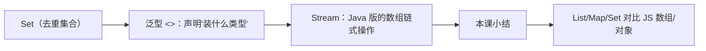

# Java（06） - 集合与泛型

> 读完后，你应能完成以下任务：
> - 绘制“Java（06） - 集合与泛型 / Set（去重集合）”的关键对象与数据流，解释“类比 JS 的 new Set()，自动去重。”，并用源码位置、日志或 Trace 标注证据。
> - 为“Java（06） - 集合与泛型 / 泛型 <>：声明"装什么类型"”设计正常与异常输入，验证“好处：编译时就能检查类型，避免装错东西。”，输出首个偏差位置与回归测试结果。
> - 实现“Java（06） - 集合与泛型 / Stream：Java 版的数组链式操作”的最小代码或配置，检验“Java 要 .stream() 开头、.collect(...) 结尾（把流收集回 List） -> Java 的 lambda 用 ->（JS 用 =>） -> DriverOrganization::getGroupId 是方法引用，等价于 item -> item.getGroupId()”，输出命令、结果与 Diff，并说明不适用边界。

> List/Map/Set 对比 JS 数组/对象。demo 里 stream 操作随处可见，正好对照 JS 数组方法。

<!-- article-progressive-block:start -->
# 一、先建立全局：集合与泛型 是什么？

理解“集合与泛型”，先要把标题中的对象放进同一条处理链：它接收什么输入，经过哪些状态变化，最终用什么证据判断结果。下表不另造概念，只把作者正文已经解释的章节按依赖顺序连起来。

“集合与泛型”的第一个核心判断是：类比 JS 的 new Set()，自动去重。。先弄清这个判断中的对象和输入输出，后面的实现、故障和验收才有共同语境。

| 顺序 | 章节 | 读完本节应抓住的结论 |
| --- | --- | --- |
| 1 | Set（去重集合） | 类比 JS 的 new Set()，自动去重。 |
| 2 | 泛型 <>：声明"装什么类型" | 好处：编译时就能检查类型，避免装错东西。 |
| 3 | Stream：Java 版的数组链式操作 | Java 要 .stream() 开头、.collect(...) 结尾（把流收集回 List） -> Java 的 lambda 用 ->（JS 用 =>） -> DriverOrganization::getGroupId 是方法引用，等价于 item -> item.getGroupId() |
| 4 | 本课小结 | lambda 用 ->（JS 是 =>），X::getId 是方法引用 |
| 5 | List/Map/Set 对比 JS 数组/对象 | List/Map/Set 对比 JS 数组/对象。 |
| 6 | demo 里 stream 操作随处可见 | demo 里 stream 操作随处可见，正好对照 JS 数组方法。 |

## 1.1 核心对象之间怎样衔接



这张图只表达本文的讲解顺序，不替代正文机制。判断“集合与泛型”是否真正掌握，需要能从最后一个结果沿图回到前面每个章节的输入、状态变化和证据。

## 1.2 再看失败：问题最早会出现在哪一步？

在“集合与泛型”的对象和顺序已经明确后，再看可观察的失败：依赖漂移、参数未校验、异常被吞、事务未回滚或状态残留。定位时不从最后一条错误猜原因，而是沿上图找第一个偏离正文结论的节点。
<!-- article-progressive-block:end -->

# 二、三种集合速览

| Java 集合 | 是什么 | JS 类比 |
|-----------|--------|---------|
| `List` | 有序、可重复的列表 | 数组 `[]` |
| `Set` | 无序、不可重复 | `Set` / 去重数组 |
| `Map` | 键值对 | 对象 `{}` / `Map` |

---

# 三、List（动态数组）

## 3.1 创建和基本操作

```java
// 创建（注意泛型 <Integer> 声明里面装什么类型）
List<Integer> list = new ArrayList<>();
list.add(1);              // push → add
list.add(2);
Integer first = list.get(0);  // arr[0] → get(0)
int size = list.size();   // arr.length → size()
list.remove(0);           // 删除索引 0
boolean has = list.contains(2);  // arr.includes → contains
```

对照表：

| JS | Java |
|------|------|
| `arr.push(x)` | `list.add(x)` |
| `arr[i]` | `list.get(i)` |
| `arr.length` | `list.size()` |
| `arr.includes(x)` | `list.contains(x)` |
| `arr.splice(i, 1)` | `list.remove(i)` |

## 3.2 快速创建带初值的 List

```java
List<String> list = Arrays.asList("a", "b", "c");  // 类似 ['a','b','c']
```

---

# 四、Map（键值对）

```java
Map<String, Integer> map = new HashMap<>();
map.put("age", 18);            // obj[key] = val
Integer age = map.get("age");  // obj[key]
map.remove("age");             // delete obj[key]
boolean has = map.containsKey("age");  // 'age' in obj
Set<String> keys = map.keySet();       // Object.keys(obj)
```

对照表：

| JS | Java |
|------|------|
| `obj[key] = val` | `map.put(key, val)` |
| `obj[key]` | `map.get(key)` |
| `delete obj[key]` | `map.remove(key)` |
| `key in obj` | `map.containsKey(key)` |
| `Object.keys(obj)` | `map.keySet()` |
| `Object.values(obj)` | `map.values()` |

---

# 五、Set（去重集合）

```java
Set<Integer> set = new HashSet<>();
set.add(1);
set.add(1);   // 重复，无效
set.add(2);
// set 里只有 {1, 2}
```

类比 JS 的 `new Set()`，自动去重。

---

# 六、泛型 <>：声明"装什么类型"

你注意到 `List<Integer>`、`Map<String,
Integer>` 里的尖括号了吗？
这叫**泛型**，告诉编译器"这个容器里装什么类型"。

```java
List<String> names = new ArrayList<>();  // 只能装 String
names.add("Tom");      // ✅
names.add(123);        // ❌ 编译报错，不是 String
```

类比 TS：

```typescript
let names: Array<string> = []   // ≈ List<String>
let names: string[] = []        // 同上
```

**好处**：编译时就能检查类型，避免装错东西。
`<>` 就是 Java 版的 TS 泛型。

---

# 七、Stream：Java 版的数组链式操作

demo 代码里大量用 `stream()`，
它就是 **Java 版的数组方法链**（map/filter/reduce）。

## 7.1 匿名化示例代码对照（OrganizationService.java）

```java
// demo 匿名化示例代码：取出所有 groupId 去重成 Set
Set<Integer> groupSet = driverOrganizationList.stream()
        .map(DriverOrganization::getGroupId)    // 取每个元素的 groupId
        .collect(Collectors.toSet());      // 收集成 Set
```

对应的 JS 写法：

```javascript
// JS：你熟悉的写法
const groupSet = new Set(
  driverOrganizationList.map(item => item.groupId)
)
```

## 7.2 常用 stream 操作对照

| JS 数组方法 | Java Stream |
|------------|-------------|
| `arr.map(x => x.id)` | `list.stream().map(X::getId).collect(Collectors.toList())` |
| `arr.filter(x => x.age > 18)` | `list.stream().filter(x -> x.getAge() > 18).collect(Collectors.toList())` |
| `arr.find(x => ...)` | `list.stream().filter(...).findFirst()` |
| 按字段分组 | `list.stream().collect(Collectors.groupingBy(X::getType))` |

## 7.3 filter 示例（OrganizationService.java:355）

```java
// demo：过滤掉 id 等于 parentId 的元素
organizationList = organizationList.stream()
        .filter(item -> !item.getId().equals(parentId))
        .collect(Collectors.toList());
```

JS 等价：

```javascript
organizationList = organizationList.filter(item => item.id !== parentId)
```

**关键差异：**
1. Java 要 `.stream()` 开头、`.collect(...)` 结尾（把流收集回 List）
2. Java 的 lambda 用 `->`（JS 用 `=>`）
3. `DriverOrganization::getGroupId` 是方法引用，等价于 `item -> item.getGroupId()`

---

# 八、本课小结

- **List**（≈数组）、**Map**（≈对象）、**Set**（≈去重集合）
- 操作变了：`push/[i]` → `add/get(i)`，`obj[k]` → `map.put/get(k)`
- **泛型 `<>`** = 声明容器装什么类型，≈ TS 泛型
- **Stream** = Java 版数组链式操作，`.stream().map().filter().collect()`
- lambda 用 `->`（JS 是 `=>`），`X::getId` 是方法引用
- 下一篇：异常处理

<!-- article-progressive-block:start -->
# 九、动手验证：先跑通 集合与泛型，再改变一个变量

前面的章节已经建立问题、概念和机制。现在把“集合与泛型”放进同一套基线中运行；本节不再引入新术语，只验证前文结论能否被复现。

## 9.1 基线与候选只允许一个变量不同

验证“集合与泛型”时，先固定语言与依赖版本、请求参数、数据库初始状态和环境配置。候选方案只能改变本次要验证的变量；如果同时更换数据、依赖和配置，即使结果改善，也不能知道是哪一项产生作用。

执行“集合与泛型”时，动作是：运行最小程序或接口测试，覆盖正常输入、边界值和异常传播。原始结果不能只保留截图或汇总分数，必须同步保存：退出码、响应状态、断言、数据库前后状态、异常栈和测试报告，使下一次复查可以在同一输入上重放。

| 实验要素 | 本文要求 |
| --- | --- |
| 固定条件 | 固定语言与依赖版本、请求参数、数据库初始状态和环境配置 |
| 唯一变量 | 本次候选方案与基线之间的一项明确差异 |
| 原始证据 | 退出码、响应状态、断言、数据库前后状态、异常栈和测试报告 |
| 通过阈值 | 输出满足契约，异常不会留下部分写入，结果可在干净环境复现 |
| 立即停止 | 依赖漂移、参数未校验、异常被吞、事务未回滚或状态残留 |

## 9.2 执行前先排除不可比较条件

“集合与泛型”开始前先确认下面四项；任一项不成立，都应先修复实验条件，而不是解释结果。

- 基线能够在“集合与泛型”的当前环境重复运行。
- 候选只改变一个与“集合与泛型”结论直接相关的条件。
- “集合与泛型”的基线和候选使用同一批输入、同一版本依赖与同一通过阈值。
- “集合与泛型”的原始输出和失败现场不会被重试、格式化或汇总覆盖。

## 9.3 执行后先核对证据完整性

结果出来后先检查证据，再讨论“集合与泛型”是否通过。缺少中间状态时，最终输出只能说明现象，不能证明机制。

| 检查项 | 当前文章的判定 |
| --- | --- |
| 输入可追溯 | 固定语言与依赖版本、请求参数、数据库初始状态和环境配置 |
| 过程可回放 | 运行最小程序或接口测试，覆盖正常输入、边界值和异常传播 |
| 结果可审计 | 退出码、响应状态、断言、数据库前后状态、异常栈和测试报告 |

“集合与泛型”的一次合格基线对照按以下顺序执行：

1. 保存“集合与泛型”基线版本及输入摘要，确认基线本身可以重复运行。
2. 写下“集合与泛型”候选方案唯一变化的变量，以及它预期影响的指标。
3. 在同一环境执行“集合与泛型”：运行最小程序或接口测试，覆盖正常输入、边界值和异常传播。
4. 为“集合与泛型”保存：退出码、响应状态、断言、数据库前后状态、异常栈和测试报告。
5. 使用“集合与泛型”预登记条件判断：输出满足契约，异常不会留下部分写入，结果可在干净环境复现。
6. 如果“集合与泛型”未通过，不修改第二个变量，先恢复基线并保留失败现场。

# 十、用一张矩阵验证 集合与泛型 的关键结论

矩阵按正文顺序列出“集合与泛型”的结论。一次实验只选择一行，只改变这一行对应的条件；不要把多行合并成一个无法归因的大实验。

| 正文章节 | 已解释的结论 | 本轮唯一变量 | 必须保存的证据 |
| --- | --- | --- | --- |
| Set（去重集合） | 类比 JS 的 new Set()，自动去重。 | 只改变与“Set（去重集合）”相关的条件 | 退出码、响应状态、断言、数据库前后状态、异常栈和测试报告 |
| 泛型 <>：声明"装什么类型" | 好处：编译时就能检查类型，避免装错东西。 | 只改变与“泛型 <>：声明"装什么类型"”相关的条件 | 退出码、响应状态、断言、数据库前后状态、异常栈和测试报告 |
| Stream：Java 版的数组链式操作 | Java 要 .stream() 开头、.collect(...) 结尾（把流收集回 List） -> Java 的 lambda 用 ->（JS 用 =>） -> DriverOrganization::getGroupId 是方法引用，等价于 item -> item.getGroupId() | 只改变与“Stream：Java 版的数组链式操作”相关的条件 | 退出码、响应状态、断言、数据库前后状态、异常栈和测试报告 |
| 本课小结 | lambda 用 ->（JS 是 =>），X::getId 是方法引用 | 只改变与“本课小结”相关的条件 | 退出码、响应状态、断言、数据库前后状态、异常栈和测试报告 |
| List/Map/Set 对比 JS 数组/对象 | List/Map/Set 对比 JS 数组/对象。 | 只改变与“List/Map/Set 对比 JS 数组/对象”相关的条件 | 退出码、响应状态、断言、数据库前后状态、异常栈和测试报告 |
| demo 里 stream 操作随处可见 | demo 里 stream 操作随处可见，正好对照 JS 数组方法。 | 只改变与“demo 里 stream 操作随处可见”相关的条件 | 退出码、响应状态、断言、数据库前后状态、异常栈和测试报告 |

## 10.1 记录本次实际实验

下面的记录用于“集合与泛型”当前这一次实验，不是第二套知识目录。先从矩阵选择一个章节，再填写实际值；没有填写的字段表示尚未验证。

```yaml
topic: "集合与泛型"
selected_chapter: required
claim_from_article: required
baseline_version: required
changed_condition: exactly_one
execution: "运行最小程序或接口测试，覆盖正常输入、边界值和异常传播"
evidence: "退出码、响应状态、断言、数据库前后状态、异常栈和测试报告"
pass_when: "输出满足契约，异常不会留下部分写入，结果可在干净环境复现"
stop_when: "依赖漂移、参数未校验、异常被吞、事务未回滚或状态残留"
observed_result: required
first_deviation: null_or_evidence
recovery_replay: required_after_failure
```

## 10.2 边界实验必须证明能够停止和恢复

成功路径只能证明“集合与泛型”在当前样本上工作，不能证明它可以进入生产。边界实验需要主动制造：依赖漂移、参数未校验、异常被吞、事务未回滚或状态残留，并观察系统是否在产生不可逆副作用前停止。

| 场景 | 只改变什么 | 应保存什么 | 通过标准 |
| --- | --- | --- | --- |
| 正常路径 | 使用已知有效输入 | 退出码、响应状态、断言、数据库前后状态、异常栈和测试报告 | 输出满足契约，异常不会留下部分写入，结果可在干净环境复现 |
| 边界路径 | 把一个输入推进到约束临界值 | 临界值前后的输出与指标 | 不静默降级，不把部分结果冒充成功 |
| 明确失败 | 注入：依赖漂移、参数未校验、异常被吞、事务未回滚或状态残留 | 原始错误、首个异常阶段和最终状态 | 失败被正确分类且没有扩大副作用 |
| 恢复重放 | 执行：从入口参数、调用栈、事务边界和外部依赖逐层缩小根因 | 原失败样本的复测证据 | 原样本恢复，正常样本没有回归 |

恢复动作不是简单重启。对于“集合与泛型”，第一步是：从入口参数、调用栈、事务边界和外部依赖逐层缩小根因。完成后使用原始失败样本复测；只验证一个新样本成功，不能证明触发条件已经消失。

“集合与泛型”边界实验结束后，应把正常、临界、失败和恢复四类记录放在同一个运行批次中。这样才能区分“候选方案真的修复问题”和“环境变化让问题暂时没有出现”。

# 十一、集合与泛型 的结果解释

解释“集合与泛型”实验时先看首个偏差，而不是最后一条错误。最后的异常通常只是上游状态错误的结果；从末端反推容易误把症状当根因。

| 观察结果 | 可以支持的判断 | 下一步 |
| --- | --- | --- |
| 主链路没有达到预期 | 依赖漂移、参数未校验、异常被吞、事务未回滚或状态残留 | 先执行：从入口参数、调用栈、事务边界和外部依赖逐层缩小根因 |
| 异常链路无法恢复 | 依赖漂移、参数未校验、异常被吞、事务未回滚或状态残留 | 先执行：从入口参数、调用栈、事务边界和外部依赖逐层缩小根因 |
| 新样本成功但原样本仍失败 | 修复没有覆盖原始触发条件 | 固定原失败输入，恢复基线后重新比较 |
| 指标改善但证据无法回链 | 数据、版本或中间状态没有固定 | 暂停发布，补齐可追溯记录后重跑 |

“集合与泛型”只有同时满足“输出满足契约，异常不会留下部分写入，结果可在干净环境复现”，并且没有出现“依赖漂移、参数未校验、异常被吞、事务未回滚或状态残留”，才可以认为主链路通过。这里的“通过”只对当前固定版本、样本和环境有效，不能外推到尚未测试的容量、权限或数据分布。

如果“集合与泛型”候选方案与基线差异很小，先检查证据分辨率是否足够；如果差异很大，先排除数据泄漏、环境漂移和版本不一致。两种情况都不能只看一个汇总均值，需要回到逐样本输出和中间状态。

“集合与泛型”故障定位完成后，记录“现象、首个偏差、根因、改动、原样本复测”五项。缺少原样本复测时，只能标记为待观察，不能标记为已解决。

# 十二、集合与泛型 的发布判断

发布判断需要把“集合与泛型”的质量、失败边界和恢复能力放在同一份记录中。以下任一条件缺失，都应停止扩量，而不是用“基本正常”替代证据。

- [ ] “集合与泛型”的基线与候选只存在一个计划内变量。
- [ ] “集合与泛型”的输入、代码、依赖、配置和数据版本可以追溯。
- [ ] “集合与泛型”的正常、临界、失败和恢复样本使用同一套断言。
- [ ] “集合与泛型”的原始输出、中间状态和失败现场已经保留。
- [ ] “集合与泛型”的日志、Trace、截图和测试数据已经脱敏。
- [ ] “集合与泛型”的停止条件、负责人和回滚入口已经演练。
- [ ] “集合与泛型”尚未覆盖的输入、权限、容量和外部依赖已经登记。

最终记录至少包含基线版本、唯一变量、原始证据、首个偏差、恢复复测和发布责任人。没有参与本次修改的人如果不能据此重放“集合与泛型”的判断，就不能发布。
<!-- article-progressive-block:end -->

# 十三、总结

- **三种集合速览**：| Java 集合 | 是什么 | JS 类比 |
- **List（动态数组）**：| JS | Java |
- **Map（键值对）**：| JS | Java |
- **Set（去重集合）**：类比 JS 的 new Set()，自动去重。
- **泛型 <>：声明"装什么类型"**：好处：编译时就能检查类型，避免装错东西。
- **Stream：Java 版的数组链式操作**：Java 要 .stream() 开头、.collect(...) 结尾（把流收集回 List） -> Java 的 lambda 用 ->（JS 用 =>） -> DriverOrganization::getGroupId 是方法引用，等价于 item -> item.getGroupId()

## 参考资料

- [Dev.java 学习路径](https://dev.java/learn/)
- [Spring Boot 文档](https://docs.spring.io/spring-boot/)
