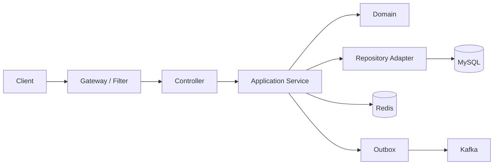

# Java（36） - 真实开发 JAVA 项目架构（Spring Boot）

> 读完后，你应能完成以下任务：
> - 绘制“Java（36） - 真实开发 JAVA 项目架构（Spring Boot） / 先从业务边界确定模块”的关键对象与数据流，解释“真实项目不是把 controller、service、mapper 各建一个包就结束。”，并用源码位置、日志或 Trace 标注证据。
> - 为“Java（36） - 真实开发 JAVA 项目架构（Spring Boot） / 请求如何穿过系统”设计正常与异常输入，验证“Controller 只完成协议转换、输入校验和身份上下文提取；”，输出首个偏差位置与回归测试结果。
> - 实现“Java（36） - 真实开发 JAVA 项目架构（Spring Boot） / JVM 与容器运行边界”的最小代码或配置，检验“堆只是 JVM 内存的一部分，容器还要容纳 Metaspace、线程栈、直接内存和本地库。”，输出命令、结果与 Diff，并说明不适用边界。

<!-- article-progressive-block:start -->
# 一、先建立全局：真实开发 JAVA 项目架构（Spring Boot） 是什么？

理解“真实开发 JAVA 项目架构（Spring Boot）”，先要把标题中的对象放进同一条处理链：它接收什么输入，经过哪些状态变化，最终用什么证据判断结果。下表不另造概念，只把作者正文已经解释的章节按依赖顺序连起来。

“真实开发 JAVA 项目架构（Spring Boot）”的第一个核心判断是：真实项目不是把 controller、service、mapper 各建一个包就结束。。先弄清这个判断中的对象和输入输出，后面的实现、故障和验收才有共同语境。

| 顺序 | 章节 | 读完本节应抓住的结论 |
| --- | --- | --- |
| 1 | 先从业务边界确定模块 | 真实项目不是把 controller、service、mapper 各建一个包就结束。 |
| 2 | 请求如何穿过系统 | Controller 只完成协议转换、输入校验和身份上下文提取； |
| 3 | JVM 与容器运行边界 | 堆只是 JVM 内存的一部分，容器还要容纳 Metaspace、线程栈、直接内存和本地库。 |
| 4 | 配置、迁移与交付步骤 | 用 java -version、mvn -version 和 mvn help:effective-pom 确认真正参与编译的 JDK、父 POM 与依赖管理版本。 -> 使用 Profile 选择环境差异，但密钥由 Secret 或密钥服务注入，不提交到仓库，也不写入普通启动日志。 -> 数据库 Schema 通过 Flyway 或 Liquibase 版本化； -> CI 只构建一次不可变制品； |
| 5 | 生产故障与排查顺序 | 服务调用失败时沿 trace_id 依次确认网关路由、服务发现、客户端超时、目标实例和数据层， |
| 6 | 模块边界要同时回答三个问题 | 模块边界要同时回答三个问题：谁拥有业务规则，谁暴露跨服务契约，谁负责把框架能力装配起来。 |

## 1.1 核心对象之间怎样衔接


这张图只表达本文的讲解顺序，不替代正文机制。判断“真实开发 JAVA 项目架构（Spring Boot）”是否真正掌握，需要能从最后一个结果沿图回到前面每个章节的输入、状态变化和证据。

## 1.2 再看失败：问题最早会出现在哪一步？

在“真实开发 JAVA 项目架构（Spring Boot）”的对象和顺序已经明确后，再看可观察的失败：依赖漂移、参数未校验、异常被吞、事务未回滚或状态残留。定位时不从最后一条错误猜原因，而是沿上图找第一个偏离正文结论的节点。
<!-- article-progressive-block:end -->

# 二、先从业务边界确定模块

真实项目不是把 `controller`、`service`、`mapper` 各建一个包就结束。
模块边界要同时回答三个问题：谁拥有业务规则，谁暴露跨服务契约，谁负责把框架能力装配起来。
推荐让依赖从外向内流动，领域代码不反向依赖 HTTP、数据库或消息中间件。

```text
order-service/
├── order-bootstrap/       # 启动类、Spring 配置、Controller
├── order-application/     # 用例编排、事务边界、DTO 转换
├── order-domain/          # 聚合、值对象、领域规则
├── order-infrastructure/  # MyBatis、Redis、Kafka、外部客户端
└── order-client/          # 对外 Feign 契约与稳定 DTO
```

`common` 不能成为杂物箱。
只有两个以上模块真实复用、变更节奏一致的基础类型才进入公共模块；
页面专用 DTO、某个服务的数据库实体和临时工具函数都应留在所有者模块。
否则一次小改动会迫使所有服务联动升级。

# 三、请求如何穿过系统



Controller 只完成协议转换、输入校验和身份上下文提取；
Application Service 定义事务边界并编排领域对象；
Domain 保存不依赖 Spring 的业务不变量；
Infrastructure 实现数据库、缓存、消息和远程调用。
跨服务写操作不能把“写数据库”和“发消息”当成一个原子动作，
通常使用同事务 Outbox，
再由发布器投递，
消费者按业务唯一键幂等。

统一错误模型至少包含稳定错误码、可公开消息和 `trace_id`。
异常不能直接把堆栈、SQL 或内部服务名返回给前端；
日志保留完整原因，并通过 `trace_id` 关联网关、服务、数据库慢查询和消息消费记录。

# 四、JVM 与容器运行边界

堆只是 JVM 内存的一部分，容器还要容纳 Metaspace、线程栈、直接内存和本地库。
把 `-Xmx` 设置成 Pod 内存上限会让进程在堆未溢出时被 OOMKill。
容量测试必须同时观察堆使用、GC 暂停、线程数、连接池等待和容器 RSS。

虚拟线程适合大量阻塞 I/O，但不会提高 CPU 密集计算速度，也不会扩大数据库连接池。
无论平台线程还是虚拟线程，下游并发仍要通过连接池、Bulkhead 和超时预算限制。
异步任务必须携带 Trace 上下文，并设置有界队列或明确拒绝策略，不能默认无限堆积。

```yaml
server:
  shutdown: graceful

spring:
  lifecycle:
    timeout-per-shutdown-phase: 30s

management:
  endpoint:
    health:
      probes:
        enabled: true
  endpoints:
    web:
      exposure:
        include: health,info,prometheus
```

Liveness 只判断进程是否需要重启，不能依赖数据库等外部组件；
Readiness 判断实例当前能否接流量，可以在迁移未完成或关键依赖不可用时失败。
Actuator 端点必须限制暴露范围并单独鉴权，
不能把环境变量、配置和线程信息直接开放到公网。

# 五、配置、迁移与交付步骤

1. 用 `java -version`、`mvn -version` 和 `mvn help:effective-pom` 确认真正参与编译的 JDK、父 POM 与依赖管理版本。
2. 使用 Profile 选择环境差异，但密钥由 Secret 或密钥服务注入，不提交到仓库，也不写入普通启动日志。
3. 数据库 Schema 通过 Flyway 或 Liquibase 版本化；先做向前兼容变更，再发布读写新字段的代码，最后清理旧字段。
4. CI 只构建一次不可变制品；测试、预发布和生产部署同一镜像摘要，环境差异只来自受控配置。
5. 发布前运行单元测试、接口契约测试和 Testcontainers 集成测试；发布后验证 Readiness、关键接口、指标和日志。

Spring 的事务、缓存和异步常通过代理实现，同一个 Bean 内自调用可能绕开代理语义。
代码审查时要检查 `@Transactional` 边界、异常是否触发回滚、远程调用是否发生在持锁事务内，
以及缓存失效是否与数据库提交顺序一致。

# 六、生产故障与排查顺序

接口 P99 突增但 CPU 不高时，先看线程池和数据库连接池排队，再看锁等待与下游超时；
频繁 Full GC 时先保存 GC 日志和 Heap Dump，
确认对象增长来源，
不直接扩大堆；
实例反复重启时区分 JVM OOM、容器 OOMKill、探针误判和启动迁移超时。

配置未生效时记录 Active Profile、配置来源优先级和脱敏后的关键配置摘要。
服务调用失败时沿 `trace_id` 依次确认网关路由、服务发现、客户端超时、目标实例和数据层，
不能先重启全部组件破坏现场。
消息积压则同时检查生产速率、消费耗时、失败重试和分区分配，避免只增加消费者却受限于分区数。

## 验收清单

- `mvn test` 与目标模块打包退出码为 `0`，依赖树没有意外版本覆盖。
- 模块依赖方向符合约束，Domain 不依赖 Web、MyBatis、Redis 或 Kafka 实现。
- 启动日志中的环境、服务名和端口正确，密钥与个人信息已脱敏。
- Readiness、Liveness 和 Prometheus 指标语义正确，关键端点受到权限保护。
- 一次携带 `trace_id` 的真实请求可以贯穿网关、数据库和消息链路，失败时能够定位和回滚。

<!-- article-progressive-block:start -->
# 七、动手验证：先跑通 真实开发 JAVA 项目架构（Spring Boot），再改变一个变量

前面的章节已经建立问题、概念和机制。现在把“真实开发 JAVA 项目架构（Spring Boot）”放进同一套基线中运行；本节不再引入新术语，只验证前文结论能否被复现。

## 7.1 基线与候选只允许一个变量不同

验证“真实开发 JAVA 项目架构（Spring Boot）”时，先固定语言与依赖版本、请求参数、数据库初始状态和环境配置。候选方案只能改变本次要验证的变量；如果同时更换数据、依赖和配置，即使结果改善，也不能知道是哪一项产生作用。

执行“真实开发 JAVA 项目架构（Spring Boot）”时，动作是：运行最小程序或接口测试，覆盖正常输入、边界值和异常传播。原始结果不能只保留截图或汇总分数，必须同步保存：退出码、响应状态、断言、数据库前后状态、异常栈和测试报告，使下一次复查可以在同一输入上重放。

| 实验要素 | 本文要求 |
| --- | --- |
| 固定条件 | 固定语言与依赖版本、请求参数、数据库初始状态和环境配置 |
| 唯一变量 | 本次候选方案与基线之间的一项明确差异 |
| 原始证据 | 退出码、响应状态、断言、数据库前后状态、异常栈和测试报告 |
| 通过阈值 | 输出满足契约，异常不会留下部分写入，结果可在干净环境复现 |
| 立即停止 | 依赖漂移、参数未校验、异常被吞、事务未回滚或状态残留 |

## 7.2 执行前先排除不可比较条件

“真实开发 JAVA 项目架构（Spring Boot）”开始前先确认下面四项；任一项不成立，都应先修复实验条件，而不是解释结果。

- 基线能够在“真实开发 JAVA 项目架构（Spring Boot）”的当前环境重复运行。
- 候选只改变一个与“真实开发 JAVA 项目架构（Spring Boot）”结论直接相关的条件。
- “真实开发 JAVA 项目架构（Spring Boot）”的基线和候选使用同一批输入、同一版本依赖与同一通过阈值。
- “真实开发 JAVA 项目架构（Spring Boot）”的原始输出和失败现场不会被重试、格式化或汇总覆盖。

## 7.3 执行后先核对证据完整性

结果出来后先检查证据，再讨论“真实开发 JAVA 项目架构（Spring Boot）”是否通过。缺少中间状态时，最终输出只能说明现象，不能证明机制。

| 检查项 | 当前文章的判定 |
| --- | --- |
| 输入可追溯 | 固定语言与依赖版本、请求参数、数据库初始状态和环境配置 |
| 过程可回放 | 运行最小程序或接口测试，覆盖正常输入、边界值和异常传播 |
| 结果可审计 | 退出码、响应状态、断言、数据库前后状态、异常栈和测试报告 |

“真实开发 JAVA 项目架构（Spring Boot）”的一次合格基线对照按以下顺序执行：

1. 保存“真实开发 JAVA 项目架构（Spring Boot）”基线版本及输入摘要，确认基线本身可以重复运行。
2. 写下“真实开发 JAVA 项目架构（Spring Boot）”候选方案唯一变化的变量，以及它预期影响的指标。
3. 在同一环境执行“真实开发 JAVA 项目架构（Spring Boot）”：运行最小程序或接口测试，覆盖正常输入、边界值和异常传播。
4. 为“真实开发 JAVA 项目架构（Spring Boot）”保存：退出码、响应状态、断言、数据库前后状态、异常栈和测试报告。
5. 使用“真实开发 JAVA 项目架构（Spring Boot）”预登记条件判断：输出满足契约，异常不会留下部分写入，结果可在干净环境复现。
6. 如果“真实开发 JAVA 项目架构（Spring Boot）”未通过，不修改第二个变量，先恢复基线并保留失败现场。

# 八、用一张矩阵验证 真实开发 JAVA 项目架构（Spring Boot） 的关键结论

矩阵按正文顺序列出“真实开发 JAVA 项目架构（Spring Boot）”的结论。一次实验只选择一行，只改变这一行对应的条件；不要把多行合并成一个无法归因的大实验。

| 正文章节 | 已解释的结论 | 本轮唯一变量 | 必须保存的证据 |
| --- | --- | --- | --- |
| 先从业务边界确定模块 | 真实项目不是把 controller、service、mapper 各建一个包就结束。 | 只改变与“先从业务边界确定模块”相关的条件 | 退出码、响应状态、断言、数据库前后状态、异常栈和测试报告 |
| 请求如何穿过系统 | Controller 只完成协议转换、输入校验和身份上下文提取； | 只改变与“请求如何穿过系统”相关的条件 | 退出码、响应状态、断言、数据库前后状态、异常栈和测试报告 |
| JVM 与容器运行边界 | 堆只是 JVM 内存的一部分，容器还要容纳 Metaspace、线程栈、直接内存和本地库。 | 只改变与“JVM 与容器运行边界”相关的条件 | 退出码、响应状态、断言、数据库前后状态、异常栈和测试报告 |
| 配置、迁移与交付步骤 | 用 java -version、mvn -version 和 mvn help:effective-pom 确认真正参与编译的 JDK、父 POM 与依赖管理版本。 -> 使用 Profile 选择环境差异，但密钥由 Secret 或密钥服务注入，不提交到仓库，也不写入普通启动日志。 -> 数据库 Schema 通过 Flyway 或 Liquibase 版本化； -> CI 只构建一次不可变制品； | 只改变与“配置、迁移与交付步骤”相关的条件 | 退出码、响应状态、断言、数据库前后状态、异常栈和测试报告 |
| 生产故障与排查顺序 | 服务调用失败时沿 trace_id 依次确认网关路由、服务发现、客户端超时、目标实例和数据层， | 只改变与“生产故障与排查顺序”相关的条件 | 退出码、响应状态、断言、数据库前后状态、异常栈和测试报告 |
| 模块边界要同时回答三个问题 | 模块边界要同时回答三个问题：谁拥有业务规则，谁暴露跨服务契约，谁负责把框架能力装配起来。 | 只改变与“模块边界要同时回答三个问题”相关的条件 | 退出码、响应状态、断言、数据库前后状态、异常栈和测试报告 |

## 8.1 记录本次实际实验

下面的记录用于“真实开发 JAVA 项目架构（Spring Boot）”当前这一次实验，不是第二套知识目录。先从矩阵选择一个章节，再填写实际值；没有填写的字段表示尚未验证。

```yaml
topic: "真实开发 JAVA 项目架构（Spring Boot）"
selected_chapter: required
claim_from_article: required
baseline_version: required
changed_condition: exactly_one
execution: "运行最小程序或接口测试，覆盖正常输入、边界值和异常传播"
evidence: "退出码、响应状态、断言、数据库前后状态、异常栈和测试报告"
pass_when: "输出满足契约，异常不会留下部分写入，结果可在干净环境复现"
stop_when: "依赖漂移、参数未校验、异常被吞、事务未回滚或状态残留"
observed_result: required
first_deviation: null_or_evidence
recovery_replay: required_after_failure
```

## 8.2 边界实验必须证明能够停止和恢复

成功路径只能证明“真实开发 JAVA 项目架构（Spring Boot）”在当前样本上工作，不能证明它可以进入生产。边界实验需要主动制造：依赖漂移、参数未校验、异常被吞、事务未回滚或状态残留，并观察系统是否在产生不可逆副作用前停止。

| 场景 | 只改变什么 | 应保存什么 | 通过标准 |
| --- | --- | --- | --- |
| 正常路径 | 使用已知有效输入 | 退出码、响应状态、断言、数据库前后状态、异常栈和测试报告 | 输出满足契约，异常不会留下部分写入，结果可在干净环境复现 |
| 边界路径 | 把一个输入推进到约束临界值 | 临界值前后的输出与指标 | 不静默降级，不把部分结果冒充成功 |
| 明确失败 | 注入：依赖漂移、参数未校验、异常被吞、事务未回滚或状态残留 | 原始错误、首个异常阶段和最终状态 | 失败被正确分类且没有扩大副作用 |
| 恢复重放 | 执行：从入口参数、调用栈、事务边界和外部依赖逐层缩小根因 | 原失败样本的复测证据 | 原样本恢复，正常样本没有回归 |

恢复动作不是简单重启。对于“真实开发 JAVA 项目架构（Spring Boot）”，第一步是：从入口参数、调用栈、事务边界和外部依赖逐层缩小根因。完成后使用原始失败样本复测；只验证一个新样本成功，不能证明触发条件已经消失。

“真实开发 JAVA 项目架构（Spring Boot）”边界实验结束后，应把正常、临界、失败和恢复四类记录放在同一个运行批次中。这样才能区分“候选方案真的修复问题”和“环境变化让问题暂时没有出现”。

# 九、真实开发 JAVA 项目架构（Spring Boot） 的结果解释

解释“真实开发 JAVA 项目架构（Spring Boot）”实验时先看首个偏差，而不是最后一条错误。最后的异常通常只是上游状态错误的结果；从末端反推容易误把症状当根因。

| 观察结果 | 可以支持的判断 | 下一步 |
| --- | --- | --- |
| 主链路没有达到预期 | 依赖漂移、参数未校验、异常被吞、事务未回滚或状态残留 | 先执行：从入口参数、调用栈、事务边界和外部依赖逐层缩小根因 |
| 异常链路无法恢复 | 依赖漂移、参数未校验、异常被吞、事务未回滚或状态残留 | 先执行：从入口参数、调用栈、事务边界和外部依赖逐层缩小根因 |
| 新样本成功但原样本仍失败 | 修复没有覆盖原始触发条件 | 固定原失败输入，恢复基线后重新比较 |
| 指标改善但证据无法回链 | 数据、版本或中间状态没有固定 | 暂停发布，补齐可追溯记录后重跑 |

“真实开发 JAVA 项目架构（Spring Boot）”只有同时满足“输出满足契约，异常不会留下部分写入，结果可在干净环境复现”，并且没有出现“依赖漂移、参数未校验、异常被吞、事务未回滚或状态残留”，才可以认为主链路通过。这里的“通过”只对当前固定版本、样本和环境有效，不能外推到尚未测试的容量、权限或数据分布。

如果“真实开发 JAVA 项目架构（Spring Boot）”候选方案与基线差异很小，先检查证据分辨率是否足够；如果差异很大，先排除数据泄漏、环境漂移和版本不一致。两种情况都不能只看一个汇总均值，需要回到逐样本输出和中间状态。

“真实开发 JAVA 项目架构（Spring Boot）”故障定位完成后，记录“现象、首个偏差、根因、改动、原样本复测”五项。缺少原样本复测时，只能标记为待观察，不能标记为已解决。

# 十、真实开发 JAVA 项目架构（Spring Boot） 的发布判断

发布判断需要把“真实开发 JAVA 项目架构（Spring Boot）”的质量、失败边界和恢复能力放在同一份记录中。以下任一条件缺失，都应停止扩量，而不是用“基本正常”替代证据。

- [ ] “真实开发 JAVA 项目架构（Spring Boot）”的基线与候选只存在一个计划内变量。
- [ ] “真实开发 JAVA 项目架构（Spring Boot）”的输入、代码、依赖、配置和数据版本可以追溯。
- [ ] “真实开发 JAVA 项目架构（Spring Boot）”的正常、临界、失败和恢复样本使用同一套断言。
- [ ] “真实开发 JAVA 项目架构（Spring Boot）”的原始输出、中间状态和失败现场已经保留。
- [ ] “真实开发 JAVA 项目架构（Spring Boot）”的日志、Trace、截图和测试数据已经脱敏。
- [ ] “真实开发 JAVA 项目架构（Spring Boot）”的停止条件、负责人和回滚入口已经演练。
- [ ] “真实开发 JAVA 项目架构（Spring Boot）”尚未覆盖的输入、权限、容量和外部依赖已经登记。

最终记录至少包含基线版本、唯一变量、原始证据、首个偏差、恢复复测和发布责任人。没有参与本次修改的人如果不能据此重放“真实开发 JAVA 项目架构（Spring Boot）”的判断，就不能发布。
<!-- article-progressive-block:end -->

# 十一、总结

- **先从业务边界确定模块**：真实项目不是把 controller、service、mapper 各建一个包就结束。
- **请求如何穿过系统**：Controller 只完成协议转换、输入校验和身份上下文提取；
- **JVM 与容器运行边界**：堆只是 JVM 内存的一部分，容器还要容纳 Metaspace、线程栈、直接内存和本地库。
- **配置、迁移与交付步骤**：用 java -version、mvn -version 和 mvn help:effective-pom 确认真正参与编译的 JDK、父 POM 与依赖管理版本。 -> 使用 Profile 选择环境差异，但密钥由 Secret 或密钥服务注入，不提交到仓库，也不写入普通启动日志。 -> 数据库 Schema 通过 Flyway 或 Liquibase 版本化； -> CI 只构建一次不可变制品；
- **生产故障与排查顺序**：服务调用失败时沿 trace_id 依次确认网关路由、服务发现、客户端超时、目标实例和数据层，不能先重启全部组件破坏现场。

## 参考资料

- [Spring Boot：Structuring Your Code](https://docs.spring.io/spring-boot/reference/using/structuring-your-code.html)
- [Spring Boot Actuator Endpoints](https://docs.spring.io/spring-boot/reference/actuator/endpoints.html)
- [Java Virtual Threads](https://docs.oracle.com/en/java/javase/21/core/virtual-threads.html)
- [Testcontainers for Java](https://java.testcontainers.org/)
