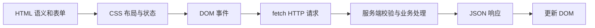

# Web 基础（02） - 页面、样式、JavaScript 与 HTTP 链路

> 目标是独立完成“填写表单 -> 调接口 -> 渲染结果 -> 处理失败”的闭环，并知道每一层应该承担什么责任。

## 学习目标

- 用语义 HTML、CSS 布局和 JavaScript 事件完成页面交互。
- 设计可校验的 HTTP/JSON 契约并正确处理错误状态码。
- 用 DevTools 定位请求、渲染、可访问性和跨域问题。

## 一、先看完整链路



`HTML` 描述内容语义，`CSS` 负责布局和视觉状态，JavaScript 监听事件并协调网络请求。不要用可点击的 `div` 替代 `button`，也不要用 JavaScript 硬算本该由 Flex/Grid 完成的布局。

## 二、最小可运行闭环

```html
<form id="search-form">
  <label>关键词 <input name="keyword" required maxlength="50" /></label>
  <button type="submit">搜索</button>
</form>
<p id="status" aria-live="polite"></p>
<script type="module">
  /** 当前页面的搜索表单。 */
  const form = document.querySelector('#search-form');
  /** 向用户播报加载、成功和失败状态的区域。 */
  const status = document.querySelector('#status');

  form.addEventListener('submit', async (event) => {
    event.preventDefault();
    /** 浏览器根据表单控件生成的当前输入数据。 */
    const formData = new FormData(form);
    /** 经过编码、可以安全放入查询字符串的关键词。 */
    const keyword = encodeURIComponent(String(formData.get('keyword') ?? ''));
    status.textContent = '加载中';

    try {
      /** 后端返回的 HTTP 响应，成功与否仍需检查状态码。 */
      const response = await fetch(`/api/search?keyword=${keyword}`);
      if (!response.ok) throw new Error(`HTTP ${response.status}`);
      /** 已通过 HTTP 层、等待业务层使用的 JSON 数据。 */
      const result = await response.json();
      status.textContent = `找到 ${result.total ?? 0} 条结果`;
    } catch (error) {
      status.textContent = error instanceof Error ? error.message : '请求失败';
    }
  });
</script>
```

这里有三个边界：`required` 只改善用户体验，服务端仍要校验；`fetch` 遇到 404/500 不会自动抛错，所以要检查 `response.ok`；DOM 输出优先用 `textContent`，避免把不可信字符串当 HTML 注入。

## 三、HTTP 契约

| 事项 | 推荐做法 | 常见错误 |
| --- | --- | --- |
| 方法 | GET 查询，POST 创建，PUT/PATCH 更新 | 所有动作都用 POST |
| 状态码 | 400 参数错，401 未认证，403 无权限，404 不存在，409 冲突 | 业务失败仍返回 200 |
| JSON | 固定字段、类型和错误结构 | 前端猜测任意返回值 |
| Cookie | 设置 Secure、HttpOnly、SameSite | 把会话令牌暴露给脚本 |
| CORS | 服务端按可信 Origin 放行 | 使用 `*` 同时携带凭据 |

## 四、布局与响应式决策

- 一维排列使用 Flex，二维区域使用 Grid；不要靠固定像素和绝对定位拼页面。
- 使用移动优先媒体查询，并允许文字换行；固定格式组件用 `minmax()`、`aspect-ratio` 等稳定尺寸。
- 表单必须有 `label`，动态状态使用 `aria-live`，键盘焦点不能只靠鼠标悬停才能看见。

## 五、排障顺序

1. Elements 检查语义结构、计算样式和事件目标。
2. Network 检查 URL、方法、请求头、状态码和响应体。
3. Console 查看异常，但不要用“没有报错”证明业务正确。
4. 用空输入、慢网、401、500 和重复提交验证边界。

## 参考资料

- [MDN HTML 表单](https://developer.mozilla.org/en-US/docs/Learn_web_development/Extensions/Forms)
- [MDN HTTP Overview](https://developer.mozilla.org/en-US/docs/Web/HTTP/Guides/Overview)
- [MDN CORS](https://developer.mozilla.org/en-US/docs/Web/HTTP/Guides/CORS)
