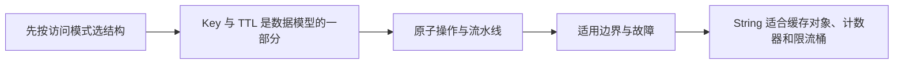

# Redis（01） - 数据结构与典型场景

> 读完后，你应能完成以下任务：
> - 绘制“Redis（01） - 数据结构与典型场景 / 先按访问模式选结构”的关键对象与数据流，解释“Redis 的价值不只是“比数据库快”，而是服务器端数据结构和单命令原子语义。”，并用源码位置、日志或 Trace 标注证据。
> - 为“Redis（01） - 数据结构与典型场景 / Key 与 TTL 是数据模型的一部分”设计正常与异常输入，验证“Key 应包含业务域、租户、实体和版本，避免不同应用互相覆盖。”，输出首个偏差位置与回归测试结果。
> - 实现“Redis（01） - 数据结构与典型场景 / 原子操作与流水线”的最小代码或配置，检验“MULTI/EXEC 保证命令顺序执行，但不会自动回滚已经执行的命令。”，输出命令、结果与 Diff，并说明不适用边界。

<!-- article-progressive-block:start -->
# 一、先建立全局：数据结构与典型场景 是什么？

理解“数据结构与典型场景”，先要把标题中的对象放进同一条处理链：它接收什么输入，经过哪些状态变化，最终用什么证据判断结果。下表不另造概念，只把作者正文已经解释的章节按依赖顺序连起来。

“数据结构与典型场景”的第一个核心判断是：Redis 的价值不只是“比数据库快”，而是服务器端数据结构和单命令原子语义。。先弄清这个判断中的对象和输入输出，后面的实现、故障和验收才有共同语境。

| 顺序 | 章节 | 读完本节应抓住的结论 |
| --- | --- | --- |
| 1 | 先按访问模式选结构 | Redis 的价值不只是“比数据库快”，而是服务器端数据结构和单命令原子语义。 |
| 2 | Key 与 TTL 是数据模型的一部分 | Key 应包含业务域、租户、实体和版本，避免不同应用互相覆盖。 |
| 3 | 原子操作与流水线 | MULTI/EXEC 保证命令顺序执行，但不会自动回滚已经执行的命令。 |
| 4 | 适用边界与故障 | Redis 不适合作为没有持久化和恢复设计的唯一事实库。 |
| 5 | String 适合缓存对象、计数器和限流桶 | String 适合缓存对象、计数器和限流桶； |
| 6 | Hash 适合字段独立更新的小对象 | Hash 适合字段独立更新的小对象； |

## 1.1 核心对象之间怎样衔接



这张图只表达本文的讲解顺序，不替代正文机制。判断“数据结构与典型场景”是否真正掌握，需要能从最后一个结果沿图回到前面每个章节的输入、状态变化和证据。

## 1.2 再看失败：问题最早会出现在哪一步？

在“数据结构与典型场景”的对象和顺序已经明确后，再看可观察的失败：计划退化、死锁、热点击穿、消息重复丢失或恢复后数据不一致。定位时不从最后一条错误猜原因，而是沿上图找第一个偏离正文结论的节点。
<!-- article-progressive-block:end -->

# 二、先按访问模式选结构

Redis 的价值不只是“比数据库快”，而是服务器端数据结构和单命令原子语义。
String 适合缓存对象、计数器和限流桶；
Hash 适合字段独立更新的小对象；
List 适合简单队列但不具备消费组治理；
Set 适合去重和集合运算；
Sorted Set 适合排行榜、延迟队列和按分数范围检索；
Stream 适合带消费组、确认和待处理列表的事件流。

选择结构前写出读写命令、复杂度、单 Key 最大元素数和过期语义。
把所有信息序列化成一个巨大 JSON String 会失去局部更新能力；
把每个字段拆成独立 Key 又会增加网络往返和一致性处理。

# 三、Key 与 TTL 是数据模型的一部分

```text
app:{tenant:42}:user:1001:profile
app:{tenant:42}:product:889:stock
app:{tenant:42}:rank:weekly:2026-W33
```

Key 应包含业务域、租户、实体和版本，避免不同应用互相覆盖。
Cluster 模式中花括号 Hash Tag 控制相关 Key 落到同一 Slot，
但把大量热点 Key 固定到一个 Slot 会造成倾斜。
禁止把手机号、Token 或完整查询参数直接写进 Key 和日志。

TTL 表达数据生命周期，不是上线后随手补的参数。
缓存应有过期时间和随机抖动；
会话使用滑动或绝对过期需由安全策略决定；
永久 Key 必须能解释为何不会无限增长。
更新值时要确认命令是否保留 TTL，避免一次覆盖把临时数据变成永久数据。

# 四、原子操作与流水线

计数、集合添加等单命令天然原子；
读后改的组合逻辑应使用 Lua、事务或可重试的乐观锁。
Pipeline 只减少网络往返，不提供事务原子性；
`MULTI/EXEC` 保证命令顺序执行，但不会自动回滚已经执行的命令。

```lua
local current = tonumber(redis.call('GET', KEYS[1]) or '0')
local delta = tonumber(ARGV[1])
if current + delta < 0 then
  return {err = 'insufficient stock'}
end
redis.call('INCRBY', KEYS[1], delta)
return current + delta
```

Lua 脚本应短小、确定且有超时预算，长脚本会阻塞事件循环。
Cluster 中脚本涉及的多个 Key 必须位于同一 Slot。

# 五、适用边界与故障

Redis 不适合作为没有持久化和恢复设计的唯一事实库。
复杂多条件分析、强关系约束和超大冷数据通常更适合数据库或搜索系统。
缓存命中率低时，Redis 可能只增加一次网络调用；
高频写且对象很大时，序列化、网络和内存成本可能超过收益。

排障同时观察命令延迟、命中率、内存、淘汰数、连接数、网络和热点 Key。
延迟尖峰可能来自慢命令、大 Key 删除、Fork、持久化、网络拥塞或客户端连接池，
而不是笼统归因于“Redis 卡了”。

## 验收清单

- 每类 Key 都有命名、结构、最大规模、TTL 和所有者。
- 复合操作明确使用单命令、Lua 或可重试事务，不依赖客户端竞态窗口。
- 压测覆盖命中与未命中、热点与普通 Key、正常和故障降级。
- 数据丢失、Redis 不可用和 Cluster 迁移时，应用有明确回退语义。

<!-- article-progressive-block:start -->
# 六、动手验证：先跑通 数据结构与典型场景，再改变一个变量

前面的章节已经建立问题、概念和机制。现在把“数据结构与典型场景”放进同一套基线中运行；本节不再引入新术语，只验证前文结论能否被复现。

## 6.1 基线与候选只允许一个变量不同

验证“数据结构与典型场景”时，先固定数据快照、并发条件、客户端配置、拓扑和故障注入点。候选方案只能改变本次要验证的变量；如果同时更换数据、依赖和配置，即使结果改善，也不能知道是哪一项产生作用。

执行“数据结构与典型场景”时，动作是：执行正常读写与故障场景，记录查询计划、锁、复制或消费状态。原始结果不能只保留截图或汇总分数，必须同步保存：执行计划、慢日志、锁等待、Offset、复制延迟、指标和数据校验，使下一次复查可以在同一输入上重放。

| 实验要素 | 本文要求 |
| --- | --- |
| 固定条件 | 固定数据快照、并发条件、客户端配置、拓扑和故障注入点 |
| 唯一变量 | 本次候选方案与基线之间的一项明确差异 |
| 原始证据 | 执行计划、慢日志、锁等待、Offset、复制延迟、指标和数据校验 |
| 通过阈值 | 一致性与性能满足正文约束，故障恢复后没有丢失或重复副作用 |
| 立即停止 | 计划退化、死锁、热点击穿、消息重复丢失或恢复后数据不一致 |

## 6.2 执行前先排除不可比较条件

“数据结构与典型场景”开始前先确认下面四项；任一项不成立，都应先修复实验条件，而不是解释结果。

- 基线能够在“数据结构与典型场景”的当前环境重复运行。
- 候选只改变一个与“数据结构与典型场景”结论直接相关的条件。
- “数据结构与典型场景”的基线和候选使用同一批输入、同一版本依赖与同一通过阈值。
- “数据结构与典型场景”的原始输出和失败现场不会被重试、格式化或汇总覆盖。

## 6.3 执行后先核对证据完整性

结果出来后先检查证据，再讨论“数据结构与典型场景”是否通过。缺少中间状态时，最终输出只能说明现象，不能证明机制。

| 检查项 | 当前文章的判定 |
| --- | --- |
| 输入可追溯 | 固定数据快照、并发条件、客户端配置、拓扑和故障注入点 |
| 过程可回放 | 执行正常读写与故障场景，记录查询计划、锁、复制或消费状态 |
| 结果可审计 | 执行计划、慢日志、锁等待、Offset、复制延迟、指标和数据校验 |

“数据结构与典型场景”的一次合格基线对照按以下顺序执行：

1. 保存“数据结构与典型场景”基线版本及输入摘要，确认基线本身可以重复运行。
2. 写下“数据结构与典型场景”候选方案唯一变化的变量，以及它预期影响的指标。
3. 在同一环境执行“数据结构与典型场景”：执行正常读写与故障场景，记录查询计划、锁、复制或消费状态。
4. 为“数据结构与典型场景”保存：执行计划、慢日志、锁等待、Offset、复制延迟、指标和数据校验。
5. 使用“数据结构与典型场景”预登记条件判断：一致性与性能满足正文约束，故障恢复后没有丢失或重复副作用。
6. 如果“数据结构与典型场景”未通过，不修改第二个变量，先恢复基线并保留失败现场。

# 七、用一张矩阵验证 数据结构与典型场景 的关键结论

矩阵按正文顺序列出“数据结构与典型场景”的结论。一次实验只选择一行，只改变这一行对应的条件；不要把多行合并成一个无法归因的大实验。

| 正文章节 | 已解释的结论 | 本轮唯一变量 | 必须保存的证据 |
| --- | --- | --- | --- |
| 先按访问模式选结构 | Redis 的价值不只是“比数据库快”，而是服务器端数据结构和单命令原子语义。 | 只改变与“先按访问模式选结构”相关的条件 | 执行计划、慢日志、锁等待、Offset、复制延迟、指标和数据校验 |
| Key 与 TTL 是数据模型的一部分 | Key 应包含业务域、租户、实体和版本，避免不同应用互相覆盖。 | 只改变与“Key 与 TTL 是数据模型的一部分”相关的条件 | 执行计划、慢日志、锁等待、Offset、复制延迟、指标和数据校验 |
| 原子操作与流水线 | MULTI/EXEC 保证命令顺序执行，但不会自动回滚已经执行的命令。 | 只改变与“原子操作与流水线”相关的条件 | 执行计划、慢日志、锁等待、Offset、复制延迟、指标和数据校验 |
| 适用边界与故障 | Redis 不适合作为没有持久化和恢复设计的唯一事实库。 | 只改变与“适用边界与故障”相关的条件 | 执行计划、慢日志、锁等待、Offset、复制延迟、指标和数据校验 |
| String 适合缓存对象、计数器和限流桶 | String 适合缓存对象、计数器和限流桶； | 只改变与“String 适合缓存对象、计数器和限流桶”相关的条件 | 执行计划、慢日志、锁等待、Offset、复制延迟、指标和数据校验 |
| Hash 适合字段独立更新的小对象 | Hash 适合字段独立更新的小对象； | 只改变与“Hash 适合字段独立更新的小对象”相关的条件 | 执行计划、慢日志、锁等待、Offset、复制延迟、指标和数据校验 |

## 7.1 记录本次实际实验

下面的记录用于“数据结构与典型场景”当前这一次实验，不是第二套知识目录。先从矩阵选择一个章节，再填写实际值；没有填写的字段表示尚未验证。

```yaml
topic: "数据结构与典型场景"
selected_chapter: required
claim_from_article: required
baseline_version: required
changed_condition: exactly_one
execution: "执行正常读写与故障场景，记录查询计划、锁、复制或消费状态"
evidence: "执行计划、慢日志、锁等待、Offset、复制延迟、指标和数据校验"
pass_when: "一致性与性能满足正文约束，故障恢复后没有丢失或重复副作用"
stop_when: "计划退化、死锁、热点击穿、消息重复丢失或恢复后数据不一致"
observed_result: required
first_deviation: null_or_evidence
recovery_replay: required_after_failure
```

## 7.2 边界实验必须证明能够停止和恢复

成功路径只能证明“数据结构与典型场景”在当前样本上工作，不能证明它可以进入生产。边界实验需要主动制造：计划退化、死锁、热点击穿、消息重复丢失或恢复后数据不一致，并观察系统是否在产生不可逆副作用前停止。

| 场景 | 只改变什么 | 应保存什么 | 通过标准 |
| --- | --- | --- | --- |
| 正常路径 | 使用已知有效输入 | 执行计划、慢日志、锁等待、Offset、复制延迟、指标和数据校验 | 一致性与性能满足正文约束，故障恢复后没有丢失或重复副作用 |
| 边界路径 | 把一个输入推进到约束临界值 | 临界值前后的输出与指标 | 不静默降级，不把部分结果冒充成功 |
| 明确失败 | 注入：计划退化、死锁、热点击穿、消息重复丢失或恢复后数据不一致 | 原始错误、首个异常阶段和最终状态 | 失败被正确分类且没有扩大副作用 |
| 恢复重放 | 执行：从数据入口、存储状态、复制消费链路和恢复步骤定位根因 | 原失败样本的复测证据 | 原样本恢复，正常样本没有回归 |

恢复动作不是简单重启。对于“数据结构与典型场景”，第一步是：从数据入口、存储状态、复制消费链路和恢复步骤定位根因。完成后使用原始失败样本复测；只验证一个新样本成功，不能证明触发条件已经消失。

“数据结构与典型场景”边界实验结束后，应把正常、临界、失败和恢复四类记录放在同一个运行批次中。这样才能区分“候选方案真的修复问题”和“环境变化让问题暂时没有出现”。

# 八、数据结构与典型场景 的结果解释

解释“数据结构与典型场景”实验时先看首个偏差，而不是最后一条错误。最后的异常通常只是上游状态错误的结果；从末端反推容易误把症状当根因。

| 观察结果 | 可以支持的判断 | 下一步 |
| --- | --- | --- |
| 主链路没有达到预期 | 计划退化、死锁、热点击穿、消息重复丢失或恢复后数据不一致 | 先执行：从数据入口、存储状态、复制消费链路和恢复步骤定位根因 |
| 异常链路无法恢复 | 计划退化、死锁、热点击穿、消息重复丢失或恢复后数据不一致 | 先执行：从数据入口、存储状态、复制消费链路和恢复步骤定位根因 |
| 新样本成功但原样本仍失败 | 修复没有覆盖原始触发条件 | 固定原失败输入，恢复基线后重新比较 |
| 指标改善但证据无法回链 | 数据、版本或中间状态没有固定 | 暂停发布，补齐可追溯记录后重跑 |

“数据结构与典型场景”只有同时满足“一致性与性能满足正文约束，故障恢复后没有丢失或重复副作用”，并且没有出现“计划退化、死锁、热点击穿、消息重复丢失或恢复后数据不一致”，才可以认为主链路通过。这里的“通过”只对当前固定版本、样本和环境有效，不能外推到尚未测试的容量、权限或数据分布。

如果“数据结构与典型场景”候选方案与基线差异很小，先检查证据分辨率是否足够；如果差异很大，先排除数据泄漏、环境漂移和版本不一致。两种情况都不能只看一个汇总均值，需要回到逐样本输出和中间状态。

“数据结构与典型场景”故障定位完成后，记录“现象、首个偏差、根因、改动、原样本复测”五项。缺少原样本复测时，只能标记为待观察，不能标记为已解决。

# 九、数据结构与典型场景 的发布判断

发布判断需要把“数据结构与典型场景”的质量、失败边界和恢复能力放在同一份记录中。以下任一条件缺失，都应停止扩量，而不是用“基本正常”替代证据。

- [ ] “数据结构与典型场景”的基线与候选只存在一个计划内变量。
- [ ] “数据结构与典型场景”的输入、代码、依赖、配置和数据版本可以追溯。
- [ ] “数据结构与典型场景”的正常、临界、失败和恢复样本使用同一套断言。
- [ ] “数据结构与典型场景”的原始输出、中间状态和失败现场已经保留。
- [ ] “数据结构与典型场景”的日志、Trace、截图和测试数据已经脱敏。
- [ ] “数据结构与典型场景”的停止条件、负责人和回滚入口已经演练。
- [ ] “数据结构与典型场景”尚未覆盖的输入、权限、容量和外部依赖已经登记。

最终记录至少包含基线版本、唯一变量、原始证据、首个偏差、恢复复测和发布责任人。没有参与本次修改的人如果不能据此重放“数据结构与典型场景”的判断，就不能发布。
<!-- article-progressive-block:end -->

# 十、总结

- **先按访问模式选结构**：Redis 的价值不只是“比数据库快”，而是服务器端数据结构和单命令原子语义。
- **Key 与 TTL 是数据模型的一部分**：Key 应包含业务域、租户、实体和版本，避免不同应用互相覆盖。
- **原子操作与流水线**：MULTI/EXEC 保证命令顺序执行，但不会自动回滚已经执行的命令。
- **适用边界与故障**：Redis 不适合作为没有持久化和恢复设计的唯一事实库。

## 参考资料

- [Redis Data Types](https://redis.io/docs/latest/develop/data-types/)
- [Redis Commands](https://redis.io/docs/latest/commands/)
- [Redis Pipelining](https://redis.io/docs/latest/develop/use/pipelining/)
