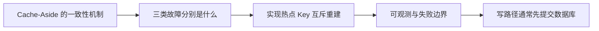

# Redis（02） - 缓存穿透、击穿与雪崩

> 读完后，你应能完成以下任务：
> - 绘制“Redis（02） - 缓存穿透、击穿与雪崩 / Cache-Aside 的一致性机制”的关键对象与数据流，解释“典型读路径是先查缓存，未命中再查数据库并回填；”，并用源码位置、日志或 Trace 标注证据。
> - 为“Redis（02） - 缓存穿透、击穿与雪崩 / 三类故障分别是什么”设计正常与异常输入，验证“缓存穿透是请求的数据根本不存在，每次都绕过缓存打到数据库，常见于恶意随机 ID 或已删除数据。”，输出首个偏差位置与回归测试结果。
> - 实现“Redis（02） - 缓存穿透、击穿与雪崩 / 实现热点 Key 互斥重建”的最小代码或配置，检验“锁必须有过期时间且只能由持有者释放，回源还要受数据库连接池和并发信号量限制。”，输出命令、结果与 Diff，并说明不适用边界。

<!-- article-progressive-block:start -->
# 一、先建立全局：缓存穿透、击穿与雪崩 是什么？

理解“缓存穿透、击穿与雪崩”，先要把标题中的对象放进同一条处理链：它接收什么输入，经过哪些状态变化，最终用什么证据判断结果。下表不另造概念，只把作者正文已经解释的章节按依赖顺序连起来。

“缓存穿透、击穿与雪崩”的第一个核心判断是：典型读路径是先查缓存，未命中再查数据库并回填；。先弄清这个判断中的对象和输入输出，后面的实现、故障和验收才有共同语境。

| 顺序 | 章节 | 读完本节应抓住的结论 |
| --- | --- | --- |
| 1 | Cache-Aside 的一致性机制 | 典型读路径是先查缓存，未命中再查数据库并回填； |
| 2 | 三类故障分别是什么 | 缓存穿透是请求的数据根本不存在，每次都绕过缓存打到数据库，常见于恶意随机 ID 或已删除数据。 |
| 3 | 实现热点 Key 互斥重建 | 锁必须有过期时间且只能由持有者释放，回源还要受数据库连接池和并发信号量限制。 |
| 4 | 可观测与失败边界 | 至少记录命中、空值命中、回源、重建等待、旧值降级和数据库失败六类指标。 |
| 5 | 写路径通常先提交数据库 | 写路径通常先提交数据库，再删除缓存。 |
| 6 | 删除而非直接更新缓存 | 删除而非直接更新缓存，是因为数据库可能聚合多表且并发写顺序会让旧值覆盖新值。 |

## 1.1 核心对象之间怎样衔接



这张图只表达本文的讲解顺序，不替代正文机制。判断“缓存穿透、击穿与雪崩”是否真正掌握，需要能从最后一个结果沿图回到前面每个章节的输入、状态变化和证据。

## 1.2 再看失败：问题最早会出现在哪一步？

在“缓存穿透、击穿与雪崩”的对象和顺序已经明确后，再看可观察的失败：计划退化、死锁、热点击穿、消息重复丢失或恢复后数据不一致。定位时不从最后一条错误猜原因，而是沿上图找第一个偏离正文结论的节点。
<!-- article-progressive-block:end -->

# 二、Cache-Aside 的一致性机制

典型读路径是先查缓存，未命中再查数据库并回填；写路径通常先提交数据库，再删除缓存。删除而非直接更新缓存，是因为数据库可能聚合多表且并发写顺序会让旧值覆盖新值。该方案提供最终一致性，不保证写后所有请求立即读到新值，因此关键业务要定义允许的不一致窗口。

```text
读：GET cache -> miss -> SELECT DB -> SET key value EX ttl
写：UPDATE DB -> COMMIT -> DEL key
```

删除失败必须有重试或事件补偿；事务提交前删除会产生旧值重新回填窗口。对极高一致性要求的数据，应读主库、使用版本号或重新设计契约，不能把缓存伪装成强一致存储。

# 三、三类故障分别是什么

缓存穿透是请求的数据根本不存在，每次都绕过缓存打到数据库，常见于恶意随机 ID 或已删除数据。解决手段包括输入校验、短 TTL 空值、Bloom Filter 和限流；Bloom Filter 有假阳性且删除困难，不能替代数据库确认。

缓存击穿是单个热点 Key 失效，大量并发同时回源。可使用互斥重建、逻辑过期加后台刷新或请求合并。拿到锁的请求负责回源，其他请求应等待有限时间、返回旧值或降级，不能无限自旋。

缓存雪崩是大量 Key 同时失效或 Redis 整体不可用，引发数据库流量洪峰。使用 TTL 抖动、分批预热、多级缓存、隔离、限流和熔断；高可用 Redis 只能降低节点故障概率，不能解决同一时刻业务 Key 集体过期。

# 四、实现热点 Key 互斥重建

```java
String value = redis.get(key);
if (value != null) return decode(value);

if (redis.set(lockKey, requestId, NX, PX, 3000)) {
    try {
        Product product = repository.findById(productId);
        redis.setex(key, ttlWithJitter(), encodeNullable(product));
        return product;
    } finally {
        unlockWithLua(lockKey, requestId);
    }
}
return readStaleOrFailFast(productId);
```

锁必须有过期时间且只能由持有者释放，回源还要受数据库连接池和并发信号量限制。空值缓存要区分“确实不存在”和“数据库暂时失败”，后者不能写成长期空值。

# 五、可观测与失败边界

至少记录命中、空值命中、回源、重建等待、旧值降级和数据库失败六类指标。只看总命中率会掩盖单个热点 Key 的问题，应按业务域和 Key 模板聚合，日志只输出脱敏模板或哈希。

压测需要主动让热点 Key 过期、批量过期和断开 Redis，观察数据库 QPS、连接池等待、错误率与恢复时间。恢复时限制缓存回填速度，避免数据库刚恢复就被预热任务再次打满。

## 验收清单

- 不存在数据、热点失效和 Redis 故障分别有独立策略与指标。
- TTL 带抖动，空值 TTL 明显短于正常数据。
- 重建锁有所有者、超时和降级路径，数据库回源并发受控。
- 缓存删除失败可补偿，写后不一致窗口符合业务要求。

<!-- article-progressive-block:start -->
# 六、动手验证：先跑通 缓存穿透、击穿与雪崩，再改变一个变量

前面的章节已经建立问题、概念和机制。现在把“缓存穿透、击穿与雪崩”放进同一套基线中运行；本节不再引入新术语，只验证前文结论能否被复现。

## 6.1 基线与候选只允许一个变量不同

验证“缓存穿透、击穿与雪崩”时，先固定数据快照、并发条件、客户端配置、拓扑和故障注入点。候选方案只能改变本次要验证的变量；如果同时更换数据、依赖和配置，即使结果改善，也不能知道是哪一项产生作用。

执行“缓存穿透、击穿与雪崩”时，动作是：执行正常读写与故障场景，记录查询计划、锁、复制或消费状态。原始结果不能只保留截图或汇总分数，必须同步保存：执行计划、慢日志、锁等待、Offset、复制延迟、指标和数据校验，使下一次复查可以在同一输入上重放。

| 实验要素 | 本文要求 |
| --- | --- |
| 固定条件 | 固定数据快照、并发条件、客户端配置、拓扑和故障注入点 |
| 唯一变量 | 本次候选方案与基线之间的一项明确差异 |
| 原始证据 | 执行计划、慢日志、锁等待、Offset、复制延迟、指标和数据校验 |
| 通过阈值 | 一致性与性能满足正文约束，故障恢复后没有丢失或重复副作用 |
| 立即停止 | 计划退化、死锁、热点击穿、消息重复丢失或恢复后数据不一致 |

## 6.2 执行前先排除不可比较条件

“缓存穿透、击穿与雪崩”开始前先确认下面四项；任一项不成立，都应先修复实验条件，而不是解释结果。

- 基线能够在“缓存穿透、击穿与雪崩”的当前环境重复运行。
- 候选只改变一个与“缓存穿透、击穿与雪崩”结论直接相关的条件。
- “缓存穿透、击穿与雪崩”的基线和候选使用同一批输入、同一版本依赖与同一通过阈值。
- “缓存穿透、击穿与雪崩”的原始输出和失败现场不会被重试、格式化或汇总覆盖。

## 6.3 执行后先核对证据完整性

结果出来后先检查证据，再讨论“缓存穿透、击穿与雪崩”是否通过。缺少中间状态时，最终输出只能说明现象，不能证明机制。

| 检查项 | 当前文章的判定 |
| --- | --- |
| 输入可追溯 | 固定数据快照、并发条件、客户端配置、拓扑和故障注入点 |
| 过程可回放 | 执行正常读写与故障场景，记录查询计划、锁、复制或消费状态 |
| 结果可审计 | 执行计划、慢日志、锁等待、Offset、复制延迟、指标和数据校验 |

“缓存穿透、击穿与雪崩”的一次合格基线对照按以下顺序执行：

1. 保存“缓存穿透、击穿与雪崩”基线版本及输入摘要，确认基线本身可以重复运行。
2. 写下“缓存穿透、击穿与雪崩”候选方案唯一变化的变量，以及它预期影响的指标。
3. 在同一环境执行“缓存穿透、击穿与雪崩”：执行正常读写与故障场景，记录查询计划、锁、复制或消费状态。
4. 为“缓存穿透、击穿与雪崩”保存：执行计划、慢日志、锁等待、Offset、复制延迟、指标和数据校验。
5. 使用“缓存穿透、击穿与雪崩”预登记条件判断：一致性与性能满足正文约束，故障恢复后没有丢失或重复副作用。
6. 如果“缓存穿透、击穿与雪崩”未通过，不修改第二个变量，先恢复基线并保留失败现场。

# 七、用一张矩阵验证 缓存穿透、击穿与雪崩 的关键结论

矩阵按正文顺序列出“缓存穿透、击穿与雪崩”的结论。一次实验只选择一行，只改变这一行对应的条件；不要把多行合并成一个无法归因的大实验。

| 正文章节 | 已解释的结论 | 本轮唯一变量 | 必须保存的证据 |
| --- | --- | --- | --- |
| Cache-Aside 的一致性机制 | 典型读路径是先查缓存，未命中再查数据库并回填； | 只改变与“Cache-Aside 的一致性机制”相关的条件 | 执行计划、慢日志、锁等待、Offset、复制延迟、指标和数据校验 |
| 三类故障分别是什么 | 缓存穿透是请求的数据根本不存在，每次都绕过缓存打到数据库，常见于恶意随机 ID 或已删除数据。 | 只改变与“三类故障分别是什么”相关的条件 | 执行计划、慢日志、锁等待、Offset、复制延迟、指标和数据校验 |
| 实现热点 Key 互斥重建 | 锁必须有过期时间且只能由持有者释放，回源还要受数据库连接池和并发信号量限制。 | 只改变与“实现热点 Key 互斥重建”相关的条件 | 执行计划、慢日志、锁等待、Offset、复制延迟、指标和数据校验 |
| 可观测与失败边界 | 至少记录命中、空值命中、回源、重建等待、旧值降级和数据库失败六类指标。 | 只改变与“可观测与失败边界”相关的条件 | 执行计划、慢日志、锁等待、Offset、复制延迟、指标和数据校验 |
| 写路径通常先提交数据库 | 写路径通常先提交数据库，再删除缓存。 | 只改变与“写路径通常先提交数据库”相关的条件 | 执行计划、慢日志、锁等待、Offset、复制延迟、指标和数据校验 |
| 删除而非直接更新缓存 | 删除而非直接更新缓存，是因为数据库可能聚合多表且并发写顺序会让旧值覆盖新值。 | 只改变与“删除而非直接更新缓存”相关的条件 | 执行计划、慢日志、锁等待、Offset、复制延迟、指标和数据校验 |

## 7.1 记录本次实际实验

下面的记录用于“缓存穿透、击穿与雪崩”当前这一次实验，不是第二套知识目录。先从矩阵选择一个章节，再填写实际值；没有填写的字段表示尚未验证。

```yaml
topic: "缓存穿透、击穿与雪崩"
selected_chapter: required
claim_from_article: required
baseline_version: required
changed_condition: exactly_one
execution: "执行正常读写与故障场景，记录查询计划、锁、复制或消费状态"
evidence: "执行计划、慢日志、锁等待、Offset、复制延迟、指标和数据校验"
pass_when: "一致性与性能满足正文约束，故障恢复后没有丢失或重复副作用"
stop_when: "计划退化、死锁、热点击穿、消息重复丢失或恢复后数据不一致"
observed_result: required
first_deviation: null_or_evidence
recovery_replay: required_after_failure
```

## 7.2 边界实验必须证明能够停止和恢复

成功路径只能证明“缓存穿透、击穿与雪崩”在当前样本上工作，不能证明它可以进入生产。边界实验需要主动制造：计划退化、死锁、热点击穿、消息重复丢失或恢复后数据不一致，并观察系统是否在产生不可逆副作用前停止。

| 场景 | 只改变什么 | 应保存什么 | 通过标准 |
| --- | --- | --- | --- |
| 正常路径 | 使用已知有效输入 | 执行计划、慢日志、锁等待、Offset、复制延迟、指标和数据校验 | 一致性与性能满足正文约束，故障恢复后没有丢失或重复副作用 |
| 边界路径 | 把一个输入推进到约束临界值 | 临界值前后的输出与指标 | 不静默降级，不把部分结果冒充成功 |
| 明确失败 | 注入：计划退化、死锁、热点击穿、消息重复丢失或恢复后数据不一致 | 原始错误、首个异常阶段和最终状态 | 失败被正确分类且没有扩大副作用 |
| 恢复重放 | 执行：从数据入口、存储状态、复制消费链路和恢复步骤定位根因 | 原失败样本的复测证据 | 原样本恢复，正常样本没有回归 |

恢复动作不是简单重启。对于“缓存穿透、击穿与雪崩”，第一步是：从数据入口、存储状态、复制消费链路和恢复步骤定位根因。完成后使用原始失败样本复测；只验证一个新样本成功，不能证明触发条件已经消失。

“缓存穿透、击穿与雪崩”边界实验结束后，应把正常、临界、失败和恢复四类记录放在同一个运行批次中。这样才能区分“候选方案真的修复问题”和“环境变化让问题暂时没有出现”。

# 八、缓存穿透、击穿与雪崩 的结果解释

解释“缓存穿透、击穿与雪崩”实验时先看首个偏差，而不是最后一条错误。最后的异常通常只是上游状态错误的结果；从末端反推容易误把症状当根因。

| 观察结果 | 可以支持的判断 | 下一步 |
| --- | --- | --- |
| 主链路没有达到预期 | 计划退化、死锁、热点击穿、消息重复丢失或恢复后数据不一致 | 先执行：从数据入口、存储状态、复制消费链路和恢复步骤定位根因 |
| 异常链路无法恢复 | 计划退化、死锁、热点击穿、消息重复丢失或恢复后数据不一致 | 先执行：从数据入口、存储状态、复制消费链路和恢复步骤定位根因 |
| 新样本成功但原样本仍失败 | 修复没有覆盖原始触发条件 | 固定原失败输入，恢复基线后重新比较 |
| 指标改善但证据无法回链 | 数据、版本或中间状态没有固定 | 暂停发布，补齐可追溯记录后重跑 |

“缓存穿透、击穿与雪崩”只有同时满足“一致性与性能满足正文约束，故障恢复后没有丢失或重复副作用”，并且没有出现“计划退化、死锁、热点击穿、消息重复丢失或恢复后数据不一致”，才可以认为主链路通过。这里的“通过”只对当前固定版本、样本和环境有效，不能外推到尚未测试的容量、权限或数据分布。

如果“缓存穿透、击穿与雪崩”候选方案与基线差异很小，先检查证据分辨率是否足够；如果差异很大，先排除数据泄漏、环境漂移和版本不一致。两种情况都不能只看一个汇总均值，需要回到逐样本输出和中间状态。

“缓存穿透、击穿与雪崩”故障定位完成后，记录“现象、首个偏差、根因、改动、原样本复测”五项。缺少原样本复测时，只能标记为待观察，不能标记为已解决。

# 九、缓存穿透、击穿与雪崩 的发布判断

发布判断需要把“缓存穿透、击穿与雪崩”的质量、失败边界和恢复能力放在同一份记录中。以下任一条件缺失，都应停止扩量，而不是用“基本正常”替代证据。

- [ ] “缓存穿透、击穿与雪崩”的基线与候选只存在一个计划内变量。
- [ ] “缓存穿透、击穿与雪崩”的输入、代码、依赖、配置和数据版本可以追溯。
- [ ] “缓存穿透、击穿与雪崩”的正常、临界、失败和恢复样本使用同一套断言。
- [ ] “缓存穿透、击穿与雪崩”的原始输出、中间状态和失败现场已经保留。
- [ ] “缓存穿透、击穿与雪崩”的日志、Trace、截图和测试数据已经脱敏。
- [ ] “缓存穿透、击穿与雪崩”的停止条件、负责人和回滚入口已经演练。
- [ ] “缓存穿透、击穿与雪崩”尚未覆盖的输入、权限、容量和外部依赖已经登记。

最终记录至少包含基线版本、唯一变量、原始证据、首个偏差、恢复复测和发布责任人。没有参与本次修改的人如果不能据此重放“缓存穿透、击穿与雪崩”的判断，就不能发布。
<!-- article-progressive-block:end -->

# 十、总结

- **Cache-Aside 的一致性机制**：典型读路径是先查缓存，未命中再查数据库并回填；
- **三类故障分别是什么**：缓存穿透是请求的数据根本不存在，每次都绕过缓存打到数据库，常见于恶意随机 ID 或已删除数据。
- **实现热点 Key 互斥重建**：锁必须有过期时间且只能由持有者释放，回源还要受数据库连接池和并发信号量限制。
- **可观测与失败边界**：至少记录命中、空值命中、回源、重建等待、旧值降级和数据库失败六类指标。

## 参考资料

- [Redis：Caching](https://redis.io/docs/latest/develop/use/client-side-caching/)
- [Redis：Distributed Locks](https://redis.io/docs/latest/develop/use/patterns/distributed-locks/)
- [Redis：Bloom Filter](https://redis.io/docs/latest/develop/data-types/probabilistic/bloom-filter/)
