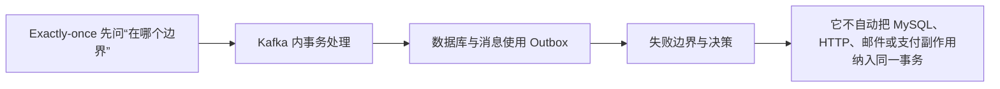

# Kafka（05） - 事务消息与 Exactly-once 边界

> 读完后，你应能完成以下任务：
> - 绘制“Kafka（05） - 事务消息与 Exactly-once 边界 / Exactly-once 先问“在哪个边界””的关键对象与数据流，解释“Kafka 的 Exactly-once Semantics 可以让 Consume-Process-Produce 链路在 Kafka 内原子提交输出记录与消费 Offset。”，并用源码位置、日志或 Trace 标注证据。
> - 为“Kafka（05） - 事务消息与 Exactly-once 边界 / Kafka 内事务处理”设计正常与异常输入，验证“事务超时、实例并发和 transactional.id 必须协调。”，输出首个偏差位置与回归测试结果。
> - 实现“Kafka（05） - 事务消息与 Exactly-once 边界 / 数据库与消息使用 Outbox”的最小代码或配置，检验“独立发布器或 CDC 把 Outbox 发送到 Kafka，成功后标记；”，输出命令、结果与 Diff，并说明不适用边界。

<!-- article-progressive-block:start -->
# 一、先建立全局：事务消息与 Exactly-once 边界 是什么？

理解“事务消息与 Exactly-once 边界”，先要把标题中的对象放进同一条处理链：它接收什么输入，经过哪些状态变化，最终用什么证据判断结果。下表不另造概念，只把作者正文已经解释的章节按依赖顺序连起来。

“事务消息与 Exactly-once 边界”的第一个核心判断是：Kafka 的 Exactly-once Semantics 可以让 Consume-Process-Produce 链路在 Kafka 内原子提交输出记录与消费 Offset。。先弄清这个判断中的对象和输入输出，后面的实现、故障和验收才有共同语境。

| 顺序 | 章节 | 读完本节应抓住的结论 |
| --- | --- | --- |
| 1 | Exactly-once 先问“在哪个边界” | Kafka 的 Exactly-once Semantics 可以让 Consume-Process-Produce 链路在 Kafka 内原子提交输出记录与消费 Offset。 |
| 2 | Kafka 内事务处理 | 事务超时、实例并发和 transactional.id 必须协调。 |
| 3 | 数据库与消息使用 Outbox | 独立发布器或 CDC 把 Outbox 发送到 Kafka，成功后标记； |
| 4 | 失败边界与决策 | “先发再写数据库”会让消费者看到尚未存在或最终失败的数据。 |
| 5 | 它不自动把 MySQL、HTTP、邮件或支付副作用纳入同一事务 | 它不自动把 MySQL、HTTP、邮件或支付副作用纳入同一事务。 |
| 6 | 只要处理跨出 Kafka | 只要处理跨出 Kafka，就仍要使用幂等、Outbox、状态机或业务补偿。 |

## 1.1 核心对象之间怎样衔接



这张图只表达本文的讲解顺序，不替代正文机制。判断“事务消息与 Exactly-once 边界”是否真正掌握，需要能从最后一个结果沿图回到前面每个章节的输入、状态变化和证据。

## 1.2 再看失败：问题最早会出现在哪一步？

在“事务消息与 Exactly-once 边界”的对象和顺序已经明确后，再看可观察的失败：依赖漂移、参数未校验、异常被吞、事务未回滚或状态残留。定位时不从最后一条错误猜原因，而是沿上图找第一个偏离正文结论的节点。
<!-- article-progressive-block:end -->

# 二、Exactly-once 先问“在哪个边界”

Kafka 的 Exactly-once Semantics 可以让 Consume-Process-Produce 链路在 Kafka 内原子提交输出记录与消费 Offset。
它不自动把 MySQL、HTTP、邮件或支付副作用纳入同一事务。
只要处理跨出 Kafka，就仍要使用幂等、Outbox、状态机或业务补偿。

幂等 Producer 通过 Producer ID 和序列号去除单会话重试重复；
事务 Producer 使用稳定 `transactional.id`，
把多个 Partition 写入和 Offset 提交组成原子事务。
消费者需配置 `isolation.level=read_committed` 才不会读取未提交或已中止事务记录。

# 三、Kafka 内事务处理

```java
producer.initTransactions();
while (running) {
    ConsumerRecords<String, InputEvent> records = consumer.poll(Duration.ofMillis(500));
    producer.beginTransaction();
    try {
        for (ConsumerRecord<String, InputEvent> record : records) {
            producer.send(transform(record));
        }
        producer.sendOffsetsToTransaction(currentOffsets(records), groupMetadata);
        producer.commitTransaction();
    } catch (Exception error) {
        producer.abortTransaction();
        throw error;
    }
}
```

事务超时、实例并发和 `transactional.id` 必须协调。
相同 ID 的新实例会 Fence 旧 Producer，
这是防止双写的机制，
不应简单捕获后无限重试。

# 四、数据库与消息使用 Outbox

业务事务内同时更新业务表并插入 Outbox：

```sql
BEGIN;
UPDATE orders SET status = 'PAID' WHERE id = :orderId AND status = 'PENDING';
INSERT INTO outbox(event_id, aggregate_id, event_type, payload, status)
VALUES (:eventId, :orderId, 'OrderPaid', :payload, 'NEW');
COMMIT;
```

独立发布器或 CDC 把 Outbox 发送到 Kafka，成功后标记；
发布器崩溃可能重复发送，因此消费者仍按 `event_id` 幂等。
Outbox 要有分片、重试、死信、保留和积压监控，否则它会变成新的单点表。

# 五、失败边界与决策

“先写数据库再发 Kafka”会在两步之间崩溃导致消息缺失；
“先发再写数据库”会让消费者看到尚未存在或最终失败的数据。
分布式事务不是默认答案，它增加协调和可用性成本。
Outbox 接受最终一致性，并让每个状态可观察、可重放。

测试覆盖数据库提交后发布器崩溃、Kafka 超时、重复投递、消费者业务提交后崩溃和死信重放。
最终验收关注业务结果恰好一次，而不是日志里每条事件只出现一次。

## 验收清单

- 文档明确 Exactly-once 的系统边界和不覆盖的外部副作用。
- Kafka 内事务配置了唯一 `transactional.id`、超时和 `read_committed`。
- 数据库变更与 Outbox 同事务，消费者按事件 ID 幂等。
- Outbox Lag、发布失败、死信和重放都有监控与审计。

<!-- article-progressive-block:start -->
# 六、动手验证：先跑通 事务消息与 Exactly-once 边界，再改变一个变量

前面的章节已经建立问题、概念和机制。现在把“事务消息与 Exactly-once 边界”放进同一套基线中运行；本节不再引入新术语，只验证前文结论能否被复现。

## 6.1 基线与候选只允许一个变量不同

验证“事务消息与 Exactly-once 边界”时，先固定语言与依赖版本、请求参数、数据库初始状态和环境配置。候选方案只能改变本次要验证的变量；如果同时更换数据、依赖和配置，即使结果改善，也不能知道是哪一项产生作用。

执行“事务消息与 Exactly-once 边界”时，动作是：运行最小程序或接口测试，覆盖正常输入、边界值和异常传播。原始结果不能只保留截图或汇总分数，必须同步保存：退出码、响应状态、断言、数据库前后状态、异常栈和测试报告，使下一次复查可以在同一输入上重放。

| 实验要素 | 本文要求 |
| --- | --- |
| 固定条件 | 固定语言与依赖版本、请求参数、数据库初始状态和环境配置 |
| 唯一变量 | 本次候选方案与基线之间的一项明确差异 |
| 原始证据 | 退出码、响应状态、断言、数据库前后状态、异常栈和测试报告 |
| 通过阈值 | 输出满足契约，异常不会留下部分写入，结果可在干净环境复现 |
| 立即停止 | 依赖漂移、参数未校验、异常被吞、事务未回滚或状态残留 |

## 6.2 执行前先排除不可比较条件

“事务消息与 Exactly-once 边界”开始前先确认下面四项；任一项不成立，都应先修复实验条件，而不是解释结果。

- 基线能够在“事务消息与 Exactly-once 边界”的当前环境重复运行。
- 候选只改变一个与“事务消息与 Exactly-once 边界”结论直接相关的条件。
- “事务消息与 Exactly-once 边界”的基线和候选使用同一批输入、同一版本依赖与同一通过阈值。
- “事务消息与 Exactly-once 边界”的原始输出和失败现场不会被重试、格式化或汇总覆盖。

## 6.3 执行后先核对证据完整性

结果出来后先检查证据，再讨论“事务消息与 Exactly-once 边界”是否通过。缺少中间状态时，最终输出只能说明现象，不能证明机制。

| 检查项 | 当前文章的判定 |
| --- | --- |
| 输入可追溯 | 固定语言与依赖版本、请求参数、数据库初始状态和环境配置 |
| 过程可回放 | 运行最小程序或接口测试，覆盖正常输入、边界值和异常传播 |
| 结果可审计 | 退出码、响应状态、断言、数据库前后状态、异常栈和测试报告 |

“事务消息与 Exactly-once 边界”的一次合格基线对照按以下顺序执行：

1. 保存“事务消息与 Exactly-once 边界”基线版本及输入摘要，确认基线本身可以重复运行。
2. 写下“事务消息与 Exactly-once 边界”候选方案唯一变化的变量，以及它预期影响的指标。
3. 在同一环境执行“事务消息与 Exactly-once 边界”：运行最小程序或接口测试，覆盖正常输入、边界值和异常传播。
4. 为“事务消息与 Exactly-once 边界”保存：退出码、响应状态、断言、数据库前后状态、异常栈和测试报告。
5. 使用“事务消息与 Exactly-once 边界”预登记条件判断：输出满足契约，异常不会留下部分写入，结果可在干净环境复现。
6. 如果“事务消息与 Exactly-once 边界”未通过，不修改第二个变量，先恢复基线并保留失败现场。

# 七、用一张矩阵验证 事务消息与 Exactly-once 边界 的关键结论

矩阵按正文顺序列出“事务消息与 Exactly-once 边界”的结论。一次实验只选择一行，只改变这一行对应的条件；不要把多行合并成一个无法归因的大实验。

| 正文章节 | 已解释的结论 | 本轮唯一变量 | 必须保存的证据 |
| --- | --- | --- | --- |
| Exactly-once 先问“在哪个边界” | Kafka 的 Exactly-once Semantics 可以让 Consume-Process-Produce 链路在 Kafka 内原子提交输出记录与消费 Offset。 | 只改变与“Exactly-once 先问“在哪个边界””相关的条件 | 退出码、响应状态、断言、数据库前后状态、异常栈和测试报告 |
| Kafka 内事务处理 | 事务超时、实例并发和 transactional.id 必须协调。 | 只改变与“Kafka 内事务处理”相关的条件 | 退出码、响应状态、断言、数据库前后状态、异常栈和测试报告 |
| 数据库与消息使用 Outbox | 独立发布器或 CDC 把 Outbox 发送到 Kafka，成功后标记； | 只改变与“数据库与消息使用 Outbox”相关的条件 | 退出码、响应状态、断言、数据库前后状态、异常栈和测试报告 |
| 失败边界与决策 | “先发再写数据库”会让消费者看到尚未存在或最终失败的数据。 | 只改变与“失败边界与决策”相关的条件 | 退出码、响应状态、断言、数据库前后状态、异常栈和测试报告 |
| 它不自动把 MySQL、HTTP、邮件或支付副作用纳入同一事务 | 它不自动把 MySQL、HTTP、邮件或支付副作用纳入同一事务。 | 只改变与“它不自动把 MySQL、HTTP、邮件或支付副作用纳入同一事务”相关的条件 | 退出码、响应状态、断言、数据库前后状态、异常栈和测试报告 |
| 只要处理跨出 Kafka | 只要处理跨出 Kafka，就仍要使用幂等、Outbox、状态机或业务补偿。 | 只改变与“只要处理跨出 Kafka”相关的条件 | 退出码、响应状态、断言、数据库前后状态、异常栈和测试报告 |

## 7.1 记录本次实际实验

下面的记录用于“事务消息与 Exactly-once 边界”当前这一次实验，不是第二套知识目录。先从矩阵选择一个章节，再填写实际值；没有填写的字段表示尚未验证。

```yaml
topic: "事务消息与 Exactly-once 边界"
selected_chapter: required
claim_from_article: required
baseline_version: required
changed_condition: exactly_one
execution: "运行最小程序或接口测试，覆盖正常输入、边界值和异常传播"
evidence: "退出码、响应状态、断言、数据库前后状态、异常栈和测试报告"
pass_when: "输出满足契约，异常不会留下部分写入，结果可在干净环境复现"
stop_when: "依赖漂移、参数未校验、异常被吞、事务未回滚或状态残留"
observed_result: required
first_deviation: null_or_evidence
recovery_replay: required_after_failure
```

## 7.2 边界实验必须证明能够停止和恢复

成功路径只能证明“事务消息与 Exactly-once 边界”在当前样本上工作，不能证明它可以进入生产。边界实验需要主动制造：依赖漂移、参数未校验、异常被吞、事务未回滚或状态残留，并观察系统是否在产生不可逆副作用前停止。

| 场景 | 只改变什么 | 应保存什么 | 通过标准 |
| --- | --- | --- | --- |
| 正常路径 | 使用已知有效输入 | 退出码、响应状态、断言、数据库前后状态、异常栈和测试报告 | 输出满足契约，异常不会留下部分写入，结果可在干净环境复现 |
| 边界路径 | 把一个输入推进到约束临界值 | 临界值前后的输出与指标 | 不静默降级，不把部分结果冒充成功 |
| 明确失败 | 注入：依赖漂移、参数未校验、异常被吞、事务未回滚或状态残留 | 原始错误、首个异常阶段和最终状态 | 失败被正确分类且没有扩大副作用 |
| 恢复重放 | 执行：从入口参数、调用栈、事务边界和外部依赖逐层缩小根因 | 原失败样本的复测证据 | 原样本恢复，正常样本没有回归 |

恢复动作不是简单重启。对于“事务消息与 Exactly-once 边界”，第一步是：从入口参数、调用栈、事务边界和外部依赖逐层缩小根因。完成后使用原始失败样本复测；只验证一个新样本成功，不能证明触发条件已经消失。

“事务消息与 Exactly-once 边界”边界实验结束后，应把正常、临界、失败和恢复四类记录放在同一个运行批次中。这样才能区分“候选方案真的修复问题”和“环境变化让问题暂时没有出现”。

# 八、事务消息与 Exactly-once 边界 的结果解释

解释“事务消息与 Exactly-once 边界”实验时先看首个偏差，而不是最后一条错误。最后的异常通常只是上游状态错误的结果；从末端反推容易误把症状当根因。

| 观察结果 | 可以支持的判断 | 下一步 |
| --- | --- | --- |
| 主链路没有达到预期 | 依赖漂移、参数未校验、异常被吞、事务未回滚或状态残留 | 先执行：从入口参数、调用栈、事务边界和外部依赖逐层缩小根因 |
| 异常链路无法恢复 | 依赖漂移、参数未校验、异常被吞、事务未回滚或状态残留 | 先执行：从入口参数、调用栈、事务边界和外部依赖逐层缩小根因 |
| 新样本成功但原样本仍失败 | 修复没有覆盖原始触发条件 | 固定原失败输入，恢复基线后重新比较 |
| 指标改善但证据无法回链 | 数据、版本或中间状态没有固定 | 暂停发布，补齐可追溯记录后重跑 |

“事务消息与 Exactly-once 边界”只有同时满足“输出满足契约，异常不会留下部分写入，结果可在干净环境复现”，并且没有出现“依赖漂移、参数未校验、异常被吞、事务未回滚或状态残留”，才可以认为主链路通过。这里的“通过”只对当前固定版本、样本和环境有效，不能外推到尚未测试的容量、权限或数据分布。

如果“事务消息与 Exactly-once 边界”候选方案与基线差异很小，先检查证据分辨率是否足够；如果差异很大，先排除数据泄漏、环境漂移和版本不一致。两种情况都不能只看一个汇总均值，需要回到逐样本输出和中间状态。

“事务消息与 Exactly-once 边界”故障定位完成后，记录“现象、首个偏差、根因、改动、原样本复测”五项。缺少原样本复测时，只能标记为待观察，不能标记为已解决。

# 九、事务消息与 Exactly-once 边界 的发布判断

发布判断需要把“事务消息与 Exactly-once 边界”的质量、失败边界和恢复能力放在同一份记录中。以下任一条件缺失，都应停止扩量，而不是用“基本正常”替代证据。

- [ ] “事务消息与 Exactly-once 边界”的基线与候选只存在一个计划内变量。
- [ ] “事务消息与 Exactly-once 边界”的输入、代码、依赖、配置和数据版本可以追溯。
- [ ] “事务消息与 Exactly-once 边界”的正常、临界、失败和恢复样本使用同一套断言。
- [ ] “事务消息与 Exactly-once 边界”的原始输出、中间状态和失败现场已经保留。
- [ ] “事务消息与 Exactly-once 边界”的日志、Trace、截图和测试数据已经脱敏。
- [ ] “事务消息与 Exactly-once 边界”的停止条件、负责人和回滚入口已经演练。
- [ ] “事务消息与 Exactly-once 边界”尚未覆盖的输入、权限、容量和外部依赖已经登记。

最终记录至少包含基线版本、唯一变量、原始证据、首个偏差、恢复复测和发布责任人。没有参与本次修改的人如果不能据此重放“事务消息与 Exactly-once 边界”的判断，就不能发布。
<!-- article-progressive-block:end -->

# 十、总结

- **Exactly-once 先问“在哪个边界”**：Kafka 的 Exactly-once Semantics 可以让 Consume-Process-Produce 链路在 Kafka 内原子提交输出记录与消费 Offset。
- **Kafka 内事务处理**：事务超时、实例并发和 transactional.id 必须协调。
- **数据库与消息使用 Outbox**：业务事务内同时更新业务表并插入 Outbox：
- **失败边界与决策**：“先发再写数据库”会让消费者看到尚未存在或最终失败的数据。

## 参考资料

- [Apache Kafka Message Delivery Semantics](https://kafka.apache.org/documentation/#semantics)
- [KafkaProducer Transactions Javadoc](https://kafka.apache.org/41/javadoc/org/apache/kafka/clients/producer/KafkaProducer.html)
- [Transactional Outbox Pattern](https://microservices.io/patterns/data/transactional-outbox.html)
