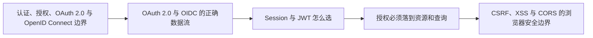
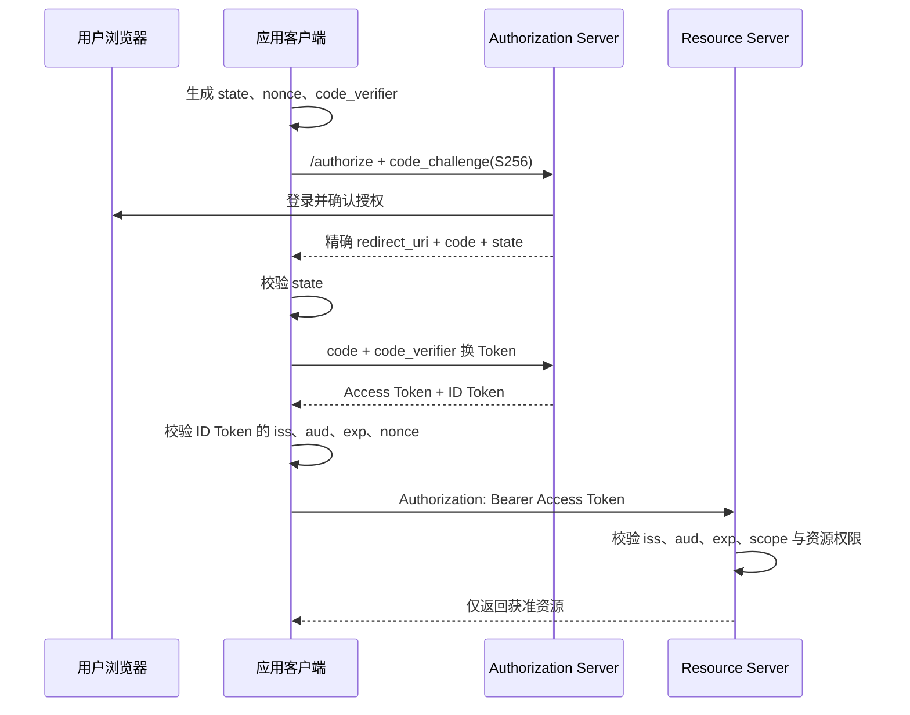

# 后端架构与安全（01） - 认证、授权、OAuth 2.0 与应用安全

> 读完后，你应能完成以下任务：
> - 绘制“后端架构与安全（01） - 认证、授权、OAuth 2.0 与应用安全 / 认证、授权、OAuth 2.0 与 OpenID Connect 边界”的关键对象与数据流，解释“认证（Authentication）回答“当前主体是谁”，”，并用源码位置、日志或 Trace 标注证据。
> - 为“后端架构与安全（01） - 认证、授权、OAuth 2.0 与应用安全 / OAuth 2.0 与 OIDC 的正确数据流”设计正常与异常输入，验证“不能安全保存客户端密钥，”，输出首个偏差位置与回归测试结果。
> - 实现“后端架构与安全（01） - 认证、授权、OAuth 2.0 与应用安全 / Session 与 JWT 怎么选”的最小代码或配置，检验“服务端保存会话状态，因此踢下线、撤销权限和风险封禁能立即生效；”，输出命令、结果与 Diff，并说明不适用边界。

<!-- article-progressive-block:start -->
# 一、先建立全局：认证、授权、OAuth 2.0 与应用安全 是什么？

理解“认证、授权、OAuth 2.0 与应用安全”，先要把标题中的对象放进同一条处理链：它接收什么输入，经过哪些状态变化，最终用什么证据判断结果。下表不另造概念，只把作者正文已经解释的章节按依赖顺序连起来。

“认证、授权、OAuth 2.0 与应用安全”的第一个核心判断是：认证（Authentication）回答“当前主体是谁”，。先弄清这个判断中的对象和输入输出，后面的实现、故障和验收才有共同语境。

| 顺序 | 章节 | 读完本节应抓住的结论 |
| --- | --- | --- |
| 1 | 认证、授权、OAuth 2.0 与 OpenID Connect 边界 | 认证（Authentication）回答“当前主体是谁”， |
| 2 | OAuth 2.0 与 OIDC 的正确数据流 | 不能安全保存客户端密钥， |
| 3 | Session 与 JWT 怎么选 | 服务端保存会话状态，因此踢下线、撤销权限和风险封禁能立即生效； |
| 4 | 授权必须落到资源和查询 | RBAC 用角色聚合权限，适合稳定岗位； |
| 5 | CSRF、XSS 与 CORS 的浏览器安全边界 | CORS 控制浏览器是否允许前端 JavaScript 读取跨域响应，不是认证或授权机制。 |
| 6 | Token、密钥与审计生命周期 | 不提交 Git、不写入镜像、不通过普通配置文件分发。 |

## 1.1 核心对象之间怎样衔接



这张图只表达本文的讲解顺序，不替代正文机制。判断“认证、授权、OAuth 2.0 与应用安全”是否真正掌握，需要能从最后一个结果沿图回到前面每个章节的输入、状态变化和证据。

## 1.2 再看失败：问题最早会出现在哪一步？

在“认证、授权、OAuth 2.0 与应用安全”的对象和顺序已经明确后，再看可观察的失败：Prompt 代替鉴权、越权执行或日志无法追责。定位时不从最后一条错误猜原因，而是沿上图找第一个偏离正文结论的节点。
<!-- article-progressive-block:end -->

# 二、认证、授权、OAuth 2.0 与 OpenID Connect 边界

认证（Authentication）回答“当前主体是谁”，
授权（Authorization）回答“该主体能否对这个资源执行这个动作”。
OAuth 2.0 解决第三方应用如何获得受限访问权限，
OpenID Connect（OIDC）在 OAuth 2.0 上增加身份层。
四者不能混为一谈：登录成功不代表拥有全部数据权限，
拿到 Access Token 也不代表它能访问任意服务。

一次请求至少要验证以下事实：

- 主体：用户、服务账号还是后台任务，身份是否仍然有效。
- 令牌：签发方 `iss`、接收方 `aud`、有效期 `exp`、权限范围 `scope` 是否匹配。
- 租户：请求中的 `tenant_id` 是否来自可信身份上下文，而不是直接相信客户端参数。
- 资源：目标数据属于哪个租户、组织或所有者，当前动作是否被策略允许。

前端隐藏按钮只能改善体验，不能承担授权。
真正的权限判断必须在服务端完成，并延伸到查询条件、字段过滤、导出和批量接口。

# 三、OAuth 2.0 与 OIDC 的正确数据流

浏览器、桌面端和移动端属于公开客户端，
不能安全保存客户端密钥，
应使用 Authorization Code + PKCE。
PKCE 让授权码只能被最初发起登录的客户端兑换；
`state` 绑定浏览器发起的授权请求，用于防止登录 CSRF；
OIDC 的 `nonce` 绑定 ID Token，防止重放。



生产环境还应遵守这些约束：

- `redirect_uri` 精确匹配注册值，不使用开放重定向或通配路径。
- Access Token 只发送给它的目标 Resource Server；API 不能接受签给其他受众的 Token。
- 不使用 Implicit Grant 和 Resource Owner Password Credentials Grant。
- Authorization Code 必须短时、一次性使用；Refresh Token 采用轮换并检测重复使用。
- ID Token 用于向客户端表达身份，不能当作访问业务 API 的 Access Token。

# 四、Session 与 JWT 怎么选

传统同域 Web 应用优先考虑服务端 Session + `HttpOnly` Cookie。
服务端保存会话状态，因此踢下线、撤销权限和风险封禁能立即生效；
代价是需要共享 Session 存储或粘性会话，并处理 Cookie 的 CSRF 风险。

JWT 适合跨服务传递短期、可验证声明，但“无状态”不等于无需治理。
Resource Server 必须固定允许的算法，
校验签名、`iss`、`aud`、`exp` 和必要的 `scope`；
密钥通过 JWKS 获取并支持轮换。
JWT 一旦签发，
在过期前不会自动感知用户禁用或权限变化，
因此需要短有效期、Refresh Token、撤销版本或高风险动作实时回查。

| 场景 | 建议 | 关键边界 |
| --- | --- | --- |
| 同域后台管理系统 | Session + HttpOnly Cookie | CSRF、防会话固定、服务端撤销 |
| SPA 调用自有后端 | BFF 持有 Token，浏览器只持会话 Cookie | Token 不进入 `localStorage`，BFF 做受众隔离 |
| 移动端或桌面端 | Authorization Code + PKCE | 系统浏览器登录、安全存储 Refresh Token |
| 服务间调用 | 短期服务身份 Token 或 mTLS | 区分用户身份与服务身份，限制 `aud` 和 `scope` |

# 五、授权必须落到资源和查询

RBAC 用角色聚合权限，适合稳定岗位；
ABAC 根据主体、资源、动作和环境属性做判断，
适合租户、部门、资源所有者、数据级别和时间窗口。
生产系统通常用 RBAC 管粗粒度能力，再用 ABAC 或资源关系约束具体数据。

列表接口最容易产生越权。
不能先查询所有数据，
再在应用层删除无权结果，
因为这会泄露总数、聚合值，
甚至在分页时造成数据错位。
正确做法是把租户和资源权限编译进数据库或搜索引擎查询：

```sql
SELECT id, title, owner_id
FROM documents
WHERE tenant_id = :trusted_tenant_id
  AND (
    owner_id = :subject_id
    OR department_id IN (:allowed_department_ids)
  )
ORDER BY id DESC
LIMIT :page_size;
```

这里的 `trusted_tenant_id` 必须来自已校验的身份上下文。
下载、导出、批量更新和按 ID 查询同样要做资源级检查，不能因为调用者知道资源 ID 就放行。
拒绝结果默认返回最少信息，避免通过 `403` 与 `404` 差异枚举敏感资源。

# 六、CSRF、XSS 与 CORS 的浏览器安全边界

CORS 控制浏览器是否允许前端 JavaScript 读取跨域响应，不是认证或授权机制。
攻击者仍能从服务端直接发请求，因此 API 必须独立校验身份和权限。

Cookie 认证的写请求需要 `SameSite`、CSRF Token 和来源校验；
Cookie 设置 `Secure`、`HttpOnly`，
登录后轮换 Session ID，
退出时服务端销毁会话。
XSS 通过上下文相关输出编码、可信模板、CSP 和依赖治理降低风险。
一旦发生 XSS，
页面内可读的 `localStorage` Token 很容易被窃取，
这也是 BFF + HttpOnly Cookie 常用于浏览器应用的原因。

所有生产通信使用 TLS。
HSTS 防止用户被降级到明文 HTTP；
敏感响应设置合理的 `Cache-Control`，避免被共享缓存保存。
日志不得记录密码、完整 Token、Authorization Header、Session ID、验证码和密钥。

# 七、Token、密钥与审计生命周期

密钥进入 Secret Manager 或受控 KMS，
不提交 Git、不写入镜像、不通过普通配置文件分发。
不同环境、用途和服务使用不同密钥，并记录读取审计。
轮换时同时支持新旧 Key 的短暂验证窗口：先发布新公钥，
再切换签发 Key，
最后在旧 Token 全部过期后移除旧公钥。

安全审计日志至少包含时间、主体、租户、动作、资源、决策结果、策略版本、客户端和 `trace_id`，
但不保存 Token 正文。
登录失败、Refresh Token 重用、权限拒绝激增、异常地域和高风险操作需要独立指标与告警。

权限变更必须有可追踪的来源。
管理员授予角色、策略发布和密钥轮换应记录操作人、审批、变更前后内容与回滚版本，
不能只保留一条“修改成功”的业务日志。

# 八、常见失败与排查顺序

| 现象 | 优先检查 | 常见根因 |
| --- | --- | --- |
| 登录成功但 API 返回 401 | Token 类型、签名、`iss`、`aud`、时钟 | 把 ID Token 当 Access Token，或受众不匹配 |
| 用户能看到其他租户数据 | 查询条件和缓存 Key | `tenant_id` 来自客户端，或缓存未隔离租户 |
| 用户撤权后仍能操作 | Token 有效期、权限快照和撤销机制 | 长期 JWT 保存了旧角色，没有实时回查 |
| OAuth 回调偶发失败 | `state`、PKCE、回调地址和多实例会话 | `code_verifier` 丢失，或回调落到不同实例 |
| 浏览器能跨域但脚本读不到响应 | 预检请求和 CORS 响应头 | OPTIONS 未放行，或凭证请求使用了通配来源 |

排障先分清认证失败还是授权拒绝，
再沿 `trace_id` 检查网关、身份服务、策略决策和资源查询。
不能通过临时关闭受众校验、放开 CORS 通配符或授予管理员角色来“验证恢复”，
这些操作会扩大真实安全风险。

## 验收清单

- OAuth 公开客户端使用 Authorization Code + PKCE，并校验 `state`；OIDC 同时校验 `nonce`。
- Resource Server 固定算法并校验签名、`iss`、`aud`、`exp` 和 `scope`。
- 租户、资源和字段权限在服务端与查询层执行，缓存 Key 包含权限作用域。
- Session、Access Token、Refresh Token 都有过期、撤销、轮换和泄露处置方案。
- Cookie、CSRF、XSS、CORS、TLS 和安全响应头分别有明确防护，不互相替代。
- 密钥不进入源码、镜像和日志，轮换过程保留兼容窗口与审计记录。
- 测试覆盖正常、越权、跨租户、过期、撤销、重放、回调篡改和密钥轮换场景。

<!-- article-progressive-block:start -->
# 九、动手验证：先跑通 认证、授权、OAuth 2.0 与应用安全，再改变一个变量

前面的章节已经建立问题、概念和机制。现在把“认证、授权、OAuth 2.0 与应用安全”放进同一套基线中运行；本节不再引入新术语，只验证前文结论能否被复现。

## 9.1 基线与候选只允许一个变量不同

验证“认证、授权、OAuth 2.0 与应用安全”时，先固定正常样本、越权身份、恶意参数、注入样本、写操作。候选方案只能改变本次要验证的变量；如果同时更换数据、依赖和配置，即使结果改善，也不能知道是哪一项产生作用。

执行“认证、授权、OAuth 2.0 与应用安全”时，动作是：从入口、模型输出和执行层发起对抗测试。原始结果不能只保留截图或汇总分数，必须同步保存：鉴权、参数校验、确认记录、执行日志、审计事件，使下一次复查可以在同一输入上重放。

| 实验要素 | 本文要求 |
| --- | --- |
| 固定条件 | 正常样本、越权身份、恶意参数、注入样本、写操作 |
| 唯一变量 | 本次候选方案与基线之间的一项明确差异 |
| 原始证据 | 鉴权、参数校验、确认记录、执行日志、审计事件 |
| 通过阈值 | 合法请求最小授权；非法请求在副作用前被拒绝 |
| 立即停止 | Prompt 代替鉴权、越权执行或日志无法追责 |

## 9.2 执行前先排除不可比较条件

“认证、授权、OAuth 2.0 与应用安全”开始前先确认下面四项；任一项不成立，都应先修复实验条件，而不是解释结果。

- 基线能够在“认证、授权、OAuth 2.0 与应用安全”的当前环境重复运行。
- 候选只改变一个与“认证、授权、OAuth 2.0 与应用安全”结论直接相关的条件。
- “认证、授权、OAuth 2.0 与应用安全”的基线和候选使用同一批输入、同一版本依赖与同一通过阈值。
- “认证、授权、OAuth 2.0 与应用安全”的原始输出和失败现场不会被重试、格式化或汇总覆盖。

## 9.3 执行后先核对证据完整性

结果出来后先检查证据，再讨论“认证、授权、OAuth 2.0 与应用安全”是否通过。缺少中间状态时，最终输出只能说明现象，不能证明机制。

| 检查项 | 当前文章的判定 |
| --- | --- |
| 输入可追溯 | 正常样本、越权身份、恶意参数、注入样本、写操作 |
| 过程可回放 | 从入口、模型输出和执行层发起对抗测试 |
| 结果可审计 | 鉴权、参数校验、确认记录、执行日志、审计事件 |

“认证、授权、OAuth 2.0 与应用安全”的一次合格基线对照按以下顺序执行：

1. 保存“认证、授权、OAuth 2.0 与应用安全”基线版本及输入摘要，确认基线本身可以重复运行。
2. 写下“认证、授权、OAuth 2.0 与应用安全”候选方案唯一变化的变量，以及它预期影响的指标。
3. 在同一环境执行“认证、授权、OAuth 2.0 与应用安全”：从入口、模型输出和执行层发起对抗测试。
4. 为“认证、授权、OAuth 2.0 与应用安全”保存：鉴权、参数校验、确认记录、执行日志、审计事件。
5. 使用“认证、授权、OAuth 2.0 与应用安全”预登记条件判断：合法请求最小授权；非法请求在副作用前被拒绝。
6. 如果“认证、授权、OAuth 2.0 与应用安全”未通过，不修改第二个变量，先恢复基线并保留失败现场。

# 十、用一张矩阵验证 认证、授权、OAuth 2.0 与应用安全 的关键结论

矩阵按正文顺序列出“认证、授权、OAuth 2.0 与应用安全”的结论。一次实验只选择一行，只改变这一行对应的条件；不要把多行合并成一个无法归因的大实验。

| 正文章节 | 已解释的结论 | 本轮唯一变量 | 必须保存的证据 |
| --- | --- | --- | --- |
| 认证、授权、OAuth 2.0 与 OpenID Connect 边界 | 认证（Authentication）回答“当前主体是谁”， | 只改变与“认证、授权、OAuth 2.0 与 OpenID Connect 边界”相关的条件 | 鉴权、参数校验、确认记录、执行日志、审计事件 |
| OAuth 2.0 与 OIDC 的正确数据流 | 不能安全保存客户端密钥， | 只改变与“OAuth 2.0 与 OIDC 的正确数据流”相关的条件 | 鉴权、参数校验、确认记录、执行日志、审计事件 |
| Session 与 JWT 怎么选 | 服务端保存会话状态，因此踢下线、撤销权限和风险封禁能立即生效； | 只改变与“Session 与 JWT 怎么选”相关的条件 | 鉴权、参数校验、确认记录、执行日志、审计事件 |
| 授权必须落到资源和查询 | RBAC 用角色聚合权限，适合稳定岗位； | 只改变与“授权必须落到资源和查询”相关的条件 | 鉴权、参数校验、确认记录、执行日志、审计事件 |
| CSRF、XSS 与 CORS 的浏览器安全边界 | CORS 控制浏览器是否允许前端 JavaScript 读取跨域响应，不是认证或授权机制。 | 只改变与“CSRF、XSS 与 CORS 的浏览器安全边界”相关的条件 | 鉴权、参数校验、确认记录、执行日志、审计事件 |
| Token、密钥与审计生命周期 | 不提交 Git、不写入镜像、不通过普通配置文件分发。 | 只改变与“Token、密钥与审计生命周期”相关的条件 | 鉴权、参数校验、确认记录、执行日志、审计事件 |

## 10.1 记录本次实际实验

下面的记录用于“认证、授权、OAuth 2.0 与应用安全”当前这一次实验，不是第二套知识目录。先从矩阵选择一个章节，再填写实际值；没有填写的字段表示尚未验证。

```yaml
topic: "认证、授权、OAuth 2.0 与应用安全"
selected_chapter: required
claim_from_article: required
baseline_version: required
changed_condition: exactly_one
execution: "从入口、模型输出和执行层发起对抗测试"
evidence: "鉴权、参数校验、确认记录、执行日志、审计事件"
pass_when: "合法请求最小授权；非法请求在副作用前被拒绝"
stop_when: "Prompt 代替鉴权、越权执行或日志无法追责"
observed_result: required
first_deviation: null_or_evidence
recovery_replay: required_after_failure
```

## 10.2 边界实验必须证明能够停止和恢复

成功路径只能证明“认证、授权、OAuth 2.0 与应用安全”在当前样本上工作，不能证明它可以进入生产。边界实验需要主动制造：Prompt 代替鉴权、越权执行或日志无法追责，并观察系统是否在产生不可逆副作用前停止。

| 场景 | 只改变什么 | 应保存什么 | 通过标准 |
| --- | --- | --- | --- |
| 正常路径 | 使用已知有效输入 | 鉴权、参数校验、确认记录、执行日志、审计事件 | 合法请求最小授权；非法请求在副作用前被拒绝 |
| 边界路径 | 把一个输入推进到约束临界值 | 临界值前后的输出与指标 | 不静默降级，不把部分结果冒充成功 |
| 明确失败 | 注入：Prompt 代替鉴权、越权执行或日志无法追责 | 原始错误、首个异常阶段和最终状态 | 失败被正确分类且没有扩大副作用 |
| 恢复重放 | 执行：停用写能力，轮换凭据，把攻击样本加入回归集 | 原失败样本的复测证据 | 原样本恢复，正常样本没有回归 |

恢复动作不是简单重启。对于“认证、授权、OAuth 2.0 与应用安全”，第一步是：停用写能力，轮换凭据，把攻击样本加入回归集。完成后使用原始失败样本复测；只验证一个新样本成功，不能证明触发条件已经消失。

“认证、授权、OAuth 2.0 与应用安全”边界实验结束后，应把正常、临界、失败和恢复四类记录放在同一个运行批次中。这样才能区分“候选方案真的修复问题”和“环境变化让问题暂时没有出现”。

# 十一、认证、授权、OAuth 2.0 与应用安全 的结果解释

解释“认证、授权、OAuth 2.0 与应用安全”实验时先看首个偏差，而不是最后一条错误。最后的异常通常只是上游状态错误的结果；从末端反推容易误把症状当根因。

| 观察结果 | 可以支持的判断 | 下一步 |
| --- | --- | --- |
| 主链路没有达到预期 | Prompt 代替鉴权、越权执行或日志无法追责 | 先执行：停用写能力，轮换凭据，把攻击样本加入回归集 |
| 异常链路无法恢复 | Prompt 代替鉴权、越权执行或日志无法追责 | 先执行：停用写能力，轮换凭据，把攻击样本加入回归集 |
| 新样本成功但原样本仍失败 | 修复没有覆盖原始触发条件 | 固定原失败输入，恢复基线后重新比较 |
| 指标改善但证据无法回链 | 数据、版本或中间状态没有固定 | 暂停发布，补齐可追溯记录后重跑 |

“认证、授权、OAuth 2.0 与应用安全”只有同时满足“合法请求最小授权；非法请求在副作用前被拒绝”，并且没有出现“Prompt 代替鉴权、越权执行或日志无法追责”，才可以认为主链路通过。这里的“通过”只对当前固定版本、样本和环境有效，不能外推到尚未测试的容量、权限或数据分布。

如果“认证、授权、OAuth 2.0 与应用安全”候选方案与基线差异很小，先检查证据分辨率是否足够；如果差异很大，先排除数据泄漏、环境漂移和版本不一致。两种情况都不能只看一个汇总均值，需要回到逐样本输出和中间状态。

“认证、授权、OAuth 2.0 与应用安全”故障定位完成后，记录“现象、首个偏差、根因、改动、原样本复测”五项。缺少原样本复测时，只能标记为待观察，不能标记为已解决。

# 十二、认证、授权、OAuth 2.0 与应用安全 的发布判断

发布判断需要把“认证、授权、OAuth 2.0 与应用安全”的质量、失败边界和恢复能力放在同一份记录中。以下任一条件缺失，都应停止扩量，而不是用“基本正常”替代证据。

- [ ] “认证、授权、OAuth 2.0 与应用安全”的基线与候选只存在一个计划内变量。
- [ ] “认证、授权、OAuth 2.0 与应用安全”的输入、代码、依赖、配置和数据版本可以追溯。
- [ ] “认证、授权、OAuth 2.0 与应用安全”的正常、临界、失败和恢复样本使用同一套断言。
- [ ] “认证、授权、OAuth 2.0 与应用安全”的原始输出、中间状态和失败现场已经保留。
- [ ] “认证、授权、OAuth 2.0 与应用安全”的日志、Trace、截图和测试数据已经脱敏。
- [ ] “认证、授权、OAuth 2.0 与应用安全”的停止条件、负责人和回滚入口已经演练。
- [ ] “认证、授权、OAuth 2.0 与应用安全”尚未覆盖的输入、权限、容量和外部依赖已经登记。

最终记录至少包含基线版本、唯一变量、原始证据、首个偏差、恢复复测和发布责任人。没有参与本次修改的人如果不能据此重放“认证、授权、OAuth 2.0 与应用安全”的判断，就不能发布。
<!-- article-progressive-block:end -->

# 十三、总结

- **认证、授权、OAuth 2.0 与 OpenID Connect 边界**：OpenID Connect 在 OAuth 2.0 上增加身份层，身份确认、资源授权和第三方委托不能混为一谈。
- **OAuth 2.0 与 OIDC 的正确数据流**：浏览器、桌面端和移动端属于公开客户端，不能安全保存客户端密钥，应使用 Authorization Code + PKCE。
- **Session 与 JWT 怎么选**：服务端保存会话状态，因此踢下线、撤销权限和风险封禁能立即生效；
- **授权必须落到资源和查询**：RBAC 用角色聚合权限，适合稳定岗位；
- **CSRF、XSS 与 CORS 的浏览器安全边界**：CORS 只控制浏览器读取跨域响应，Cookie 写请求仍需 CSRF 防护，页面输出仍需 XSS 防护。
- **Token、密钥与审计生命周期**：密钥进入 Secret Manager 或受控 KMS，不提交 Git、不写入镜像、不通过普通配置文件分发。

## 参考资料

- [OAuth 2.0 Security Best Current Practice（RFC 9700）](https://www.rfc-editor.org/rfc/rfc9700.html)
- [OpenID Connect Core 1.0](https://openid.net/specs/openid-connect-core-1_0.html)
- [OWASP Authentication Cheat Sheet](https://cheatsheetseries.owasp.org/cheatsheets/Authentication_Cheat_Sheet.html)
- [OWASP Authorization Cheat Sheet](https://cheatsheetseries.owasp.org/cheatsheets/Authorization_Cheat_Sheet.html)
- [OWASP Cross-Site Request Forgery Prevention Cheat Sheet](https://cheatsheetseries.owasp.org/cheatsheets/Cross-Site_Request_Forgery_Prevention_Cheat_Sheet.html)
