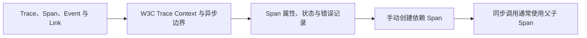

# 可观测性（02） - Trace、Span 与上下文传播

> 读完后，你应能完成以下任务：
> - 绘制“可观测性（02） - Trace、Span 与上下文传播 / Trace、Span、Event 与 Link”的关键对象与数据流，解释“Trace 表示端到端事务，Span 记录一个有开始、结束、属性、状态和父关系的操作。”，并用源码位置、日志或 Trace 标注证据。
> - 为“可观测性（02） - Trace、Span 与上下文传播 / W3C Trace Context 与异步边界”设计正常与异常输入，验证“入口必须把外部头视为不可信数据，验证格式并决定是否继续现有 Trace，同时新建本地 server Span。”，输出首个偏差位置与回归测试结果。
> - 实现“可观测性（02） - Trace、Span 与上下文传播 / Span 属性、状态与错误记录”的最小代码或配置，检验“异常要 recordException 并设置错误状态，但 4xx 是否错误取决于业务语义；”，输出命令、结果与 Diff，并说明不适用边界。

<!-- article-progressive-block:start -->
# 一、先建立全局：Trace、Span 与上下文传播 是什么？

理解“Trace、Span 与上下文传播”，先要把标题中的对象放进同一条处理链：它接收什么输入，经过哪些状态变化，最终用什么证据判断结果。下表不另造概念，只把作者正文已经解释的章节按依赖顺序连起来。

“Trace、Span 与上下文传播”的第一个核心判断是：Trace 表示端到端事务，Span 记录一个有开始、结束、属性、状态和父关系的操作。。先弄清这个判断中的对象和输入输出，后面的实现、故障和验收才有共同语境。

| 顺序 | 章节 | 读完本节应抓住的结论 |
| --- | --- | --- |
| 1 | Trace、Span、Event 与 Link | Trace 表示端到端事务，Span 记录一个有开始、结束、属性、状态和父关系的操作。 |
| 2 | W3C Trace Context 与异步边界 | 入口必须把外部头视为不可信数据， |
| 3 | Span 属性、状态与错误记录 | 异常要 recordException 并设置错误状态，但 4xx 是否错误取决于业务语义； |
| 4 | 手动创建依赖 Span | 不要把 SQL 参数或完整用户数据放入属性。 |
| 5 | 同步调用通常使用父子 Span | 同步调用通常使用父子 Span，批处理或消息消费可用 Link 关联多个上游； |
| 6 | Event 记录 Span 内时间点 | Event 记录 Span 内时间点，不应滥建短 Span。 |

## 1.1 核心对象之间怎样衔接



这张图只表达本文的讲解顺序，不替代正文机制。判断“Trace、Span 与上下文传播”是否真正掌握，需要能从最后一个结果沿图回到前面每个章节的输入、状态变化和证据。

## 1.2 再看失败：问题最早会出现在哪一步？

在“Trace、Span 与上下文传播”的对象和顺序已经明确后，再看可观察的失败：环境漂移、探针失真、权限错误、发布扩大故障或回滚不可用。定位时不从最后一条错误猜原因，而是沿上图找第一个偏离正文结论的节点。
<!-- article-progressive-block:end -->

# 二、Trace、Span、Event 与 Link

Trace 表示端到端事务，Span 记录一个有开始、结束、属性、状态和父关系的操作。
同步调用通常使用父子 Span，批处理或消息消费可用 Link 关联多个上游；
Event 记录 Span 内时间点，不应滥建短 Span。

# 三、W3C Trace Context 与异步边界

HTTP 使用 traceparent/tracestate 传播，
消息头携带上下文，
线程池和异步任务需显式保存并恢复当前 Context。
入口必须把外部头视为不可信数据，
验证格式并决定是否继续现有 Trace，
同时新建本地 server Span。

# 四、Span 属性、状态与错误记录

Span 名称使用低基数操作名，属性记录方法、路由、依赖、版本和受控业务维度。
异常要 recordException 并设置错误状态，但 4xx 是否错误取决于业务语义；
跨服务时检查 trace_id 一致和父子时间关系。

# 五、手动创建依赖 Span

示例在当前请求下记录数据库操作和错误。

```typescript
const tracer = trace.getTracer('order-api')
return tracer.startActiveSpan('db.orders.insert', async (span) => {
  try {
    span.setAttribute('db.system', 'postgresql')
    return await repository.insert(order)
  } catch (error) {
    span.recordException(error as Error)
    span.setStatus({ code: SpanStatusCode.ERROR })
    throw error
  } finally {
    span.end()
  }
})
```

不要把 SQL 参数或完整用户数据放入属性。
自动探针已创建的 Span 不要重复包裹，先检查 Trace 结构。

# 六、故障边界与验证


| 现象 | 常见根因 | 验证与处理 |
| --- | --- | --- |
| 每个服务出现独立 Trace | 代理或客户端未注入/提取 traceparent | 在入口、HTTP 客户端和消息中间件逐段验证传播头 |
| Span 永不结束 | 异常路径没有 finally 或异步生命周期错误 | 用 startActiveSpan + finally，检查未结束 Span 指标 |
| Trace 图有重复数据库 Span | 自动探针与手动埋点重复 | 保留一个权威 Span，只补充缺失属性和业务 Event |

<!-- article-progressive-block:start -->
# 七、动手验证：先跑通 Trace、Span 与上下文传播，再改变一个变量

前面的章节已经建立问题、概念和机制。现在把“Trace、Span 与上下文传播”放进同一套基线中运行；本节不再引入新术语，只验证前文结论能否被复现。

## 7.1 基线与候选只允许一个变量不同

验证“Trace、Span 与上下文传播”时，先固定制品、配置、运行环境、流量样本、权限和回滚条件。候选方案只能改变本次要验证的变量；如果同时更换数据、依赖和配置，即使结果改善，也不能知道是哪一项产生作用。

执行“Trace、Span 与上下文传播”时，动作是：执行部署或验收链路，并主动制造一次健康检查、网络或依赖失败。原始结果不能只保留截图或汇总分数，必须同步保存：命令退出码、事件、日志、指标、Trace、页面断言和制品摘要，使下一次复查可以在同一输入上重放。

| 实验要素 | 本文要求 |
| --- | --- |
| 固定条件 | 固定制品、配置、运行环境、流量样本、权限和回滚条件 |
| 唯一变量 | 本次候选方案与基线之间的一项明确差异 |
| 原始证据 | 命令退出码、事件、日志、指标、Trace、页面断言和制品摘要 |
| 通过阈值 | 成功路径达标，失败被及时阻断，恢复与回滚结果经过复测 |
| 立即停止 | 环境漂移、探针失真、权限错误、发布扩大故障或回滚不可用 |

## 7.2 执行前先排除不可比较条件

“Trace、Span 与上下文传播”开始前先确认下面四项；任一项不成立，都应先修复实验条件，而不是解释结果。

- 基线能够在“Trace、Span 与上下文传播”的当前环境重复运行。
- 候选只改变一个与“Trace、Span 与上下文传播”结论直接相关的条件。
- “Trace、Span 与上下文传播”的基线和候选使用同一批输入、同一版本依赖与同一通过阈值。
- “Trace、Span 与上下文传播”的原始输出和失败现场不会被重试、格式化或汇总覆盖。

## 7.3 执行后先核对证据完整性

结果出来后先检查证据，再讨论“Trace、Span 与上下文传播”是否通过。缺少中间状态时，最终输出只能说明现象，不能证明机制。

| 检查项 | 当前文章的判定 |
| --- | --- |
| 输入可追溯 | 固定制品、配置、运行环境、流量样本、权限和回滚条件 |
| 过程可回放 | 执行部署或验收链路，并主动制造一次健康检查、网络或依赖失败 |
| 结果可审计 | 命令退出码、事件、日志、指标、Trace、页面断言和制品摘要 |

“Trace、Span 与上下文传播”的一次合格基线对照按以下顺序执行：

1. 保存“Trace、Span 与上下文传播”基线版本及输入摘要，确认基线本身可以重复运行。
2. 写下“Trace、Span 与上下文传播”候选方案唯一变化的变量，以及它预期影响的指标。
3. 在同一环境执行“Trace、Span 与上下文传播”：执行部署或验收链路，并主动制造一次健康检查、网络或依赖失败。
4. 为“Trace、Span 与上下文传播”保存：命令退出码、事件、日志、指标、Trace、页面断言和制品摘要。
5. 使用“Trace、Span 与上下文传播”预登记条件判断：成功路径达标，失败被及时阻断，恢复与回滚结果经过复测。
6. 如果“Trace、Span 与上下文传播”未通过，不修改第二个变量，先恢复基线并保留失败现场。

# 八、用一张矩阵验证 Trace、Span 与上下文传播 的关键结论

矩阵按正文顺序列出“Trace、Span 与上下文传播”的结论。一次实验只选择一行，只改变这一行对应的条件；不要把多行合并成一个无法归因的大实验。

| 正文章节 | 已解释的结论 | 本轮唯一变量 | 必须保存的证据 |
| --- | --- | --- | --- |
| Trace、Span、Event 与 Link | Trace 表示端到端事务，Span 记录一个有开始、结束、属性、状态和父关系的操作。 | 只改变与“Trace、Span、Event 与 Link”相关的条件 | 命令退出码、事件、日志、指标、Trace、页面断言和制品摘要 |
| W3C Trace Context 与异步边界 | 入口必须把外部头视为不可信数据， | 只改变与“W3C Trace Context 与异步边界”相关的条件 | 命令退出码、事件、日志、指标、Trace、页面断言和制品摘要 |
| Span 属性、状态与错误记录 | 异常要 recordException 并设置错误状态，但 4xx 是否错误取决于业务语义； | 只改变与“Span 属性、状态与错误记录”相关的条件 | 命令退出码、事件、日志、指标、Trace、页面断言和制品摘要 |
| 手动创建依赖 Span | 不要把 SQL 参数或完整用户数据放入属性。 | 只改变与“手动创建依赖 Span”相关的条件 | 命令退出码、事件、日志、指标、Trace、页面断言和制品摘要 |
| 同步调用通常使用父子 Span | 同步调用通常使用父子 Span，批处理或消息消费可用 Link 关联多个上游； | 只改变与“同步调用通常使用父子 Span”相关的条件 | 命令退出码、事件、日志、指标、Trace、页面断言和制品摘要 |
| Event 记录 Span 内时间点 | Event 记录 Span 内时间点，不应滥建短 Span。 | 只改变与“Event 记录 Span 内时间点”相关的条件 | 命令退出码、事件、日志、指标、Trace、页面断言和制品摘要 |

## 8.1 记录本次实际实验

下面的记录用于“Trace、Span 与上下文传播”当前这一次实验，不是第二套知识目录。先从矩阵选择一个章节，再填写实际值；没有填写的字段表示尚未验证。

```yaml
topic: "Trace、Span 与上下文传播"
selected_chapter: required
claim_from_article: required
baseline_version: required
changed_condition: exactly_one
execution: "执行部署或验收链路，并主动制造一次健康检查、网络或依赖失败"
evidence: "命令退出码、事件、日志、指标、Trace、页面断言和制品摘要"
pass_when: "成功路径达标，失败被及时阻断，恢复与回滚结果经过复测"
stop_when: "环境漂移、探针失真、权限错误、发布扩大故障或回滚不可用"
observed_result: required
first_deviation: null_or_evidence
recovery_replay: required_after_failure
```

## 8.2 边界实验必须证明能够停止和恢复

成功路径只能证明“Trace、Span 与上下文传播”在当前样本上工作，不能证明它可以进入生产。边界实验需要主动制造：环境漂移、探针失真、权限错误、发布扩大故障或回滚不可用，并观察系统是否在产生不可逆副作用前停止。

| 场景 | 只改变什么 | 应保存什么 | 通过标准 |
| --- | --- | --- | --- |
| 正常路径 | 使用已知有效输入 | 命令退出码、事件、日志、指标、Trace、页面断言和制品摘要 | 成功路径达标，失败被及时阻断，恢复与回滚结果经过复测 |
| 边界路径 | 把一个输入推进到约束临界值 | 临界值前后的输出与指标 | 不静默降级，不把部分结果冒充成功 |
| 明确失败 | 注入：环境漂移、探针失真、权限错误、发布扩大故障或回滚不可用 | 原始错误、首个异常阶段和最终状态 | 失败被正确分类且没有扩大副作用 |
| 恢复重放 | 执行：停止扩量，按制品、配置、运行时和依赖顺序定位并恢复 | 原失败样本的复测证据 | 原样本恢复，正常样本没有回归 |

恢复动作不是简单重启。对于“Trace、Span 与上下文传播”，第一步是：停止扩量，按制品、配置、运行时和依赖顺序定位并恢复。完成后使用原始失败样本复测；只验证一个新样本成功，不能证明触发条件已经消失。

“Trace、Span 与上下文传播”边界实验结束后，应把正常、临界、失败和恢复四类记录放在同一个运行批次中。这样才能区分“候选方案真的修复问题”和“环境变化让问题暂时没有出现”。

# 九、Trace、Span 与上下文传播 的结果解释

解释“Trace、Span 与上下文传播”实验时先看首个偏差，而不是最后一条错误。最后的异常通常只是上游状态错误的结果；从末端反推容易误把症状当根因。

| 观察结果 | 可以支持的判断 | 下一步 |
| --- | --- | --- |
| 主链路没有达到预期 | 环境漂移、探针失真、权限错误、发布扩大故障或回滚不可用 | 先执行：停止扩量，按制品、配置、运行时和依赖顺序定位并恢复 |
| 异常链路无法恢复 | 环境漂移、探针失真、权限错误、发布扩大故障或回滚不可用 | 先执行：停止扩量，按制品、配置、运行时和依赖顺序定位并恢复 |
| 新样本成功但原样本仍失败 | 修复没有覆盖原始触发条件 | 固定原失败输入，恢复基线后重新比较 |
| 指标改善但证据无法回链 | 数据、版本或中间状态没有固定 | 暂停发布，补齐可追溯记录后重跑 |

“Trace、Span 与上下文传播”只有同时满足“成功路径达标，失败被及时阻断，恢复与回滚结果经过复测”，并且没有出现“环境漂移、探针失真、权限错误、发布扩大故障或回滚不可用”，才可以认为主链路通过。这里的“通过”只对当前固定版本、样本和环境有效，不能外推到尚未测试的容量、权限或数据分布。

如果“Trace、Span 与上下文传播”候选方案与基线差异很小，先检查证据分辨率是否足够；如果差异很大，先排除数据泄漏、环境漂移和版本不一致。两种情况都不能只看一个汇总均值，需要回到逐样本输出和中间状态。

“Trace、Span 与上下文传播”故障定位完成后，记录“现象、首个偏差、根因、改动、原样本复测”五项。缺少原样本复测时，只能标记为待观察，不能标记为已解决。

# 十、Trace、Span 与上下文传播 的发布判断

发布判断需要把“Trace、Span 与上下文传播”的质量、失败边界和恢复能力放在同一份记录中。以下任一条件缺失，都应停止扩量，而不是用“基本正常”替代证据。

- [ ] “Trace、Span 与上下文传播”的基线与候选只存在一个计划内变量。
- [ ] “Trace、Span 与上下文传播”的输入、代码、依赖、配置和数据版本可以追溯。
- [ ] “Trace、Span 与上下文传播”的正常、临界、失败和恢复样本使用同一套断言。
- [ ] “Trace、Span 与上下文传播”的原始输出、中间状态和失败现场已经保留。
- [ ] “Trace、Span 与上下文传播”的日志、Trace、截图和测试数据已经脱敏。
- [ ] “Trace、Span 与上下文传播”的停止条件、负责人和回滚入口已经演练。
- [ ] “Trace、Span 与上下文传播”尚未覆盖的输入、权限、容量和外部依赖已经登记。

最终记录至少包含基线版本、唯一变量、原始证据、首个偏差、恢复复测和发布责任人。没有参与本次修改的人如果不能据此重放“Trace、Span 与上下文传播”的判断，就不能发布。
<!-- article-progressive-block:end -->

# 十一、总结

- **Trace、Span、Event 与 Link**：Trace 表示端到端事务，Span 记录一个有开始、结束、属性、状态和父关系的操作。
- **W3C Trace Context 与异步边界**：入口必须把外部头视为不可信数据，验证格式并决定是否继续现有 Trace，同时新建本地 server Span。
- **Span 属性、状态与错误记录**：异常要 recordException 并设置错误状态，但 4xx 是否错误取决于业务语义；
- **手动创建依赖 Span**：不要把 SQL 参数或完整用户数据放入属性。

## 参考资料

- [OpenTelemetry Traces](https://opentelemetry.io/docs/concepts/signals/traces/)
- [W3C Trace Context](https://www.w3.org/TR/trace-context/)
- [OpenTelemetry Semantic Conventions](https://opentelemetry.io/docs/specs/semconv/)
