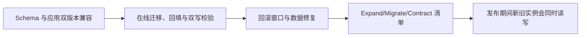

# 灰度发布与回滚（02） - 数据库变更与向前兼容

> 读完后，你应能完成以下任务：
> - 绘制“灰度发布与回滚（02） - 数据库变更与向前兼容 / Schema 与应用双版本兼容”的关键对象与数据流，解释“发布期间新旧实例会同时读写，数据库必须先 expand 增加兼容结构，再迁移和双写数据，最后在旧版本完全退出后 contract 删除旧结构。”，并用源码位置、日志或 Trace 标注证据。
> - 为“灰度发布与回滚（02） - 数据库变更与向前兼容 / 在线迁移、回填与双写校验”设计正常与异常输入，验证“大表回填按主键分批、限速和检查点执行，监控锁等待、复制延迟和失败。”，输出首个偏差位置与回归测试结果。
> - 实现“灰度发布与回滚（02） - 数据库变更与向前兼容 / 回滚窗口与数据修复”的最小代码或配置，检验“代码回滚前确认旧版本仍能读取当前 Schema 和新数据。”，输出命令、结果与 Diff，并说明不适用边界。

<!-- article-progressive-block:start -->
# 一、先建立全局：数据库变更与向前兼容 是什么？

理解“数据库变更与向前兼容”，先要把标题中的对象放进同一条处理链：它接收什么输入，经过哪些状态变化，最终用什么证据判断结果。下表不另造概念，只把作者正文已经解释的章节按依赖顺序连起来。

“数据库变更与向前兼容”的第一个核心判断是：数据库必须先 expand 增加兼容结构，。先弄清这个判断中的对象和输入输出，后面的实现、故障和验收才有共同语境。

| 顺序 | 章节 | 读完本节应抓住的结论 |
| --- | --- | --- |
| 1 | Schema 与应用双版本兼容 | 数据库必须先 expand 增加兼容结构， |
| 2 | 在线迁移、回填与双写校验 | 大表回填按主键分批、限速和检查点执行，监控锁等待、复制延迟和失败。 |
| 3 | 回滚窗口与数据修复 | 代码回滚前确认旧版本仍能读取当前 Schema 和新数据。 |
| 4 | Expand/Migrate/Contract 清单 | 把一次重命名拆成多个可验证发布。 |
| 5 | 发布期间新旧实例会同时读写 | 发布期间新旧实例会同时读写， |
| 6 | 再迁移和双写数据 | 再迁移和双写数据， |

## 1.1 核心对象之间怎样衔接



这张图只表达本文的讲解顺序，不替代正文机制。判断“数据库变更与向前兼容”是否真正掌握，需要能从最后一个结果沿图回到前面每个章节的输入、状态变化和证据。

## 1.2 再看失败：问题最早会出现在哪一步？

在“数据库变更与向前兼容”的对象和顺序已经明确后，再看可观察的失败：环境漂移、探针失真、权限错误、发布扩大故障或回滚不可用。定位时不从最后一条错误猜原因，而是沿上图找第一个偏离正文结论的节点。
<!-- article-progressive-block:end -->

# 二、Schema 与应用双版本兼容

发布期间新旧实例会同时读写，
数据库必须先 expand 增加兼容结构，
再迁移和双写数据，
最后在旧版本完全退出后 contract 删除旧结构。
直接重命名列、改类型或加非空约束可能锁表并让旧代码立即失败。

# 三、在线迁移、回填与双写校验

大表回填按主键分批、限速和检查点执行，监控锁等待、复制延迟和失败。
双写要明确权威字段和幂等，读取先兼容新旧；
迁移完成后比较数量、校验和及业务样本，不以脚本退出 0 作为完成。

# 四、回滚窗口与数据修复

代码回滚前确认旧版本仍能读取当前 Schema 和新数据。
不可逆清理单独发布并设置等待期、备份和审批；
若新逻辑已写入旧版本无法理解的数据，需要前向修复或补偿，而不是盲目回滚二进制。

# 五、Expand/Migrate/Contract 清单

把一次重命名拆成多个可验证发布。

```sql
-- expand
ALTER TABLE users ADD COLUMN display_name varchar(255);
-- 应用版本 A+B：读取 COALESCE(display_name, name)，写入两列
-- migrate：后台按主键分批回填并校验
UPDATE users SET display_name = name WHERE display_name IS NULL AND id BETWEEN ? AND ?;
-- contract：确认旧版本退出后再添加约束、停止双写和删除旧列
```

生产迁移工具要记录批次、耗时、影响行数和重试位置，并设置锁超时。
删除列通常安排在独立低风险窗口。

# 六、故障边界与验证


| 现象 | 常见根因 | 验证与处理 |
| --- | --- | --- |
| 发布后旧实例 SQL 报列不存在 | 先删除/重命名旧列，没有兼容窗口 | 恢复兼容结构并采用 expand/migrate/contract |
| 回填导致数据库延迟飙升 | 单事务全表更新或无速率控制 | 按索引分批、限速并监控锁与复制延迟 |
| 双写两列数据不一致 | 失败重试或多入口未统一写入 | 定义权威来源、幂等写入和持续对账修复 |

<!-- article-progressive-block:start -->
# 七、动手验证：先跑通 数据库变更与向前兼容，再改变一个变量

前面的章节已经建立问题、概念和机制。现在把“数据库变更与向前兼容”放进同一套基线中运行；本节不再引入新术语，只验证前文结论能否被复现。

## 7.1 基线与候选只允许一个变量不同

验证“数据库变更与向前兼容”时，先固定制品、配置、运行环境、流量样本、权限和回滚条件。候选方案只能改变本次要验证的变量；如果同时更换数据、依赖和配置，即使结果改善，也不能知道是哪一项产生作用。

执行“数据库变更与向前兼容”时，动作是：执行部署或验收链路，并主动制造一次健康检查、网络或依赖失败。原始结果不能只保留截图或汇总分数，必须同步保存：命令退出码、事件、日志、指标、Trace、页面断言和制品摘要，使下一次复查可以在同一输入上重放。

| 实验要素 | 本文要求 |
| --- | --- |
| 固定条件 | 固定制品、配置、运行环境、流量样本、权限和回滚条件 |
| 唯一变量 | 本次候选方案与基线之间的一项明确差异 |
| 原始证据 | 命令退出码、事件、日志、指标、Trace、页面断言和制品摘要 |
| 通过阈值 | 成功路径达标，失败被及时阻断，恢复与回滚结果经过复测 |
| 立即停止 | 环境漂移、探针失真、权限错误、发布扩大故障或回滚不可用 |

## 7.2 执行前先排除不可比较条件

“数据库变更与向前兼容”开始前先确认下面四项；任一项不成立，都应先修复实验条件，而不是解释结果。

- 基线能够在“数据库变更与向前兼容”的当前环境重复运行。
- 候选只改变一个与“数据库变更与向前兼容”结论直接相关的条件。
- “数据库变更与向前兼容”的基线和候选使用同一批输入、同一版本依赖与同一通过阈值。
- “数据库变更与向前兼容”的原始输出和失败现场不会被重试、格式化或汇总覆盖。

## 7.3 执行后先核对证据完整性

结果出来后先检查证据，再讨论“数据库变更与向前兼容”是否通过。缺少中间状态时，最终输出只能说明现象，不能证明机制。

| 检查项 | 当前文章的判定 |
| --- | --- |
| 输入可追溯 | 固定制品、配置、运行环境、流量样本、权限和回滚条件 |
| 过程可回放 | 执行部署或验收链路，并主动制造一次健康检查、网络或依赖失败 |
| 结果可审计 | 命令退出码、事件、日志、指标、Trace、页面断言和制品摘要 |

“数据库变更与向前兼容”的一次合格基线对照按以下顺序执行：

1. 保存“数据库变更与向前兼容”基线版本及输入摘要，确认基线本身可以重复运行。
2. 写下“数据库变更与向前兼容”候选方案唯一变化的变量，以及它预期影响的指标。
3. 在同一环境执行“数据库变更与向前兼容”：执行部署或验收链路，并主动制造一次健康检查、网络或依赖失败。
4. 为“数据库变更与向前兼容”保存：命令退出码、事件、日志、指标、Trace、页面断言和制品摘要。
5. 使用“数据库变更与向前兼容”预登记条件判断：成功路径达标，失败被及时阻断，恢复与回滚结果经过复测。
6. 如果“数据库变更与向前兼容”未通过，不修改第二个变量，先恢复基线并保留失败现场。

# 八、用一张矩阵验证 数据库变更与向前兼容 的关键结论

矩阵按正文顺序列出“数据库变更与向前兼容”的结论。一次实验只选择一行，只改变这一行对应的条件；不要把多行合并成一个无法归因的大实验。

| 正文章节 | 已解释的结论 | 本轮唯一变量 | 必须保存的证据 |
| --- | --- | --- | --- |
| Schema 与应用双版本兼容 | 数据库必须先 expand 增加兼容结构， | 只改变与“Schema 与应用双版本兼容”相关的条件 | 命令退出码、事件、日志、指标、Trace、页面断言和制品摘要 |
| 在线迁移、回填与双写校验 | 大表回填按主键分批、限速和检查点执行，监控锁等待、复制延迟和失败。 | 只改变与“在线迁移、回填与双写校验”相关的条件 | 命令退出码、事件、日志、指标、Trace、页面断言和制品摘要 |
| 回滚窗口与数据修复 | 代码回滚前确认旧版本仍能读取当前 Schema 和新数据。 | 只改变与“回滚窗口与数据修复”相关的条件 | 命令退出码、事件、日志、指标、Trace、页面断言和制品摘要 |
| Expand/Migrate/Contract 清单 | 把一次重命名拆成多个可验证发布。 | 只改变与“Expand/Migrate/Contract 清单”相关的条件 | 命令退出码、事件、日志、指标、Trace、页面断言和制品摘要 |
| 发布期间新旧实例会同时读写 | 发布期间新旧实例会同时读写， | 只改变与“发布期间新旧实例会同时读写”相关的条件 | 命令退出码、事件、日志、指标、Trace、页面断言和制品摘要 |
| 再迁移和双写数据 | 再迁移和双写数据， | 只改变与“再迁移和双写数据”相关的条件 | 命令退出码、事件、日志、指标、Trace、页面断言和制品摘要 |

## 8.1 记录本次实际实验

下面的记录用于“数据库变更与向前兼容”当前这一次实验，不是第二套知识目录。先从矩阵选择一个章节，再填写实际值；没有填写的字段表示尚未验证。

```yaml
topic: "数据库变更与向前兼容"
selected_chapter: required
claim_from_article: required
baseline_version: required
changed_condition: exactly_one
execution: "执行部署或验收链路，并主动制造一次健康检查、网络或依赖失败"
evidence: "命令退出码、事件、日志、指标、Trace、页面断言和制品摘要"
pass_when: "成功路径达标，失败被及时阻断，恢复与回滚结果经过复测"
stop_when: "环境漂移、探针失真、权限错误、发布扩大故障或回滚不可用"
observed_result: required
first_deviation: null_or_evidence
recovery_replay: required_after_failure
```

## 8.2 边界实验必须证明能够停止和恢复

成功路径只能证明“数据库变更与向前兼容”在当前样本上工作，不能证明它可以进入生产。边界实验需要主动制造：环境漂移、探针失真、权限错误、发布扩大故障或回滚不可用，并观察系统是否在产生不可逆副作用前停止。

| 场景 | 只改变什么 | 应保存什么 | 通过标准 |
| --- | --- | --- | --- |
| 正常路径 | 使用已知有效输入 | 命令退出码、事件、日志、指标、Trace、页面断言和制品摘要 | 成功路径达标，失败被及时阻断，恢复与回滚结果经过复测 |
| 边界路径 | 把一个输入推进到约束临界值 | 临界值前后的输出与指标 | 不静默降级，不把部分结果冒充成功 |
| 明确失败 | 注入：环境漂移、探针失真、权限错误、发布扩大故障或回滚不可用 | 原始错误、首个异常阶段和最终状态 | 失败被正确分类且没有扩大副作用 |
| 恢复重放 | 执行：停止扩量，按制品、配置、运行时和依赖顺序定位并恢复 | 原失败样本的复测证据 | 原样本恢复，正常样本没有回归 |

恢复动作不是简单重启。对于“数据库变更与向前兼容”，第一步是：停止扩量，按制品、配置、运行时和依赖顺序定位并恢复。完成后使用原始失败样本复测；只验证一个新样本成功，不能证明触发条件已经消失。

“数据库变更与向前兼容”边界实验结束后，应把正常、临界、失败和恢复四类记录放在同一个运行批次中。这样才能区分“候选方案真的修复问题”和“环境变化让问题暂时没有出现”。

# 九、数据库变更与向前兼容 的结果解释

解释“数据库变更与向前兼容”实验时先看首个偏差，而不是最后一条错误。最后的异常通常只是上游状态错误的结果；从末端反推容易误把症状当根因。

| 观察结果 | 可以支持的判断 | 下一步 |
| --- | --- | --- |
| 主链路没有达到预期 | 环境漂移、探针失真、权限错误、发布扩大故障或回滚不可用 | 先执行：停止扩量，按制品、配置、运行时和依赖顺序定位并恢复 |
| 异常链路无法恢复 | 环境漂移、探针失真、权限错误、发布扩大故障或回滚不可用 | 先执行：停止扩量，按制品、配置、运行时和依赖顺序定位并恢复 |
| 新样本成功但原样本仍失败 | 修复没有覆盖原始触发条件 | 固定原失败输入，恢复基线后重新比较 |
| 指标改善但证据无法回链 | 数据、版本或中间状态没有固定 | 暂停发布，补齐可追溯记录后重跑 |

“数据库变更与向前兼容”只有同时满足“成功路径达标，失败被及时阻断，恢复与回滚结果经过复测”，并且没有出现“环境漂移、探针失真、权限错误、发布扩大故障或回滚不可用”，才可以认为主链路通过。这里的“通过”只对当前固定版本、样本和环境有效，不能外推到尚未测试的容量、权限或数据分布。

如果“数据库变更与向前兼容”候选方案与基线差异很小，先检查证据分辨率是否足够；如果差异很大，先排除数据泄漏、环境漂移和版本不一致。两种情况都不能只看一个汇总均值，需要回到逐样本输出和中间状态。

“数据库变更与向前兼容”故障定位完成后，记录“现象、首个偏差、根因、改动、原样本复测”五项。缺少原样本复测时，只能标记为待观察，不能标记为已解决。

# 十、数据库变更与向前兼容 的发布判断

发布判断需要把“数据库变更与向前兼容”的质量、失败边界和恢复能力放在同一份记录中。以下任一条件缺失，都应停止扩量，而不是用“基本正常”替代证据。

- [ ] “数据库变更与向前兼容”的基线与候选只存在一个计划内变量。
- [ ] “数据库变更与向前兼容”的输入、代码、依赖、配置和数据版本可以追溯。
- [ ] “数据库变更与向前兼容”的正常、临界、失败和恢复样本使用同一套断言。
- [ ] “数据库变更与向前兼容”的原始输出、中间状态和失败现场已经保留。
- [ ] “数据库变更与向前兼容”的日志、Trace、截图和测试数据已经脱敏。
- [ ] “数据库变更与向前兼容”的停止条件、负责人和回滚入口已经演练。
- [ ] “数据库变更与向前兼容”尚未覆盖的输入、权限、容量和外部依赖已经登记。

最终记录至少包含基线版本、唯一变量、原始证据、首个偏差、恢复复测和发布责任人。没有参与本次修改的人如果不能据此重放“数据库变更与向前兼容”的判断，就不能发布。
<!-- article-progressive-block:end -->

# 十一、总结

- **Schema 与应用双版本兼容**：发布期间新旧实例会同时读写，数据库必须先 expand 增加兼容结构，再迁移和双写数据，最后在旧版本完全退出后 contract 删除旧结构。
- **在线迁移、回填与双写校验**：大表回填按主键分批、限速和检查点执行，监控锁等待、复制延迟和失败。
- **回滚窗口与数据修复**：代码回滚前确认旧版本仍能读取当前 Schema 和新数据。
- **Expand/Migrate/Contract 清单**：把一次重命名拆成多个可验证发布。

## 参考资料

- [Flyway Schema History](https://documentation.red-gate.com/flyway/flyway-concepts/migrations/flyway-schema-history-table)
- [Liquibase Concepts](https://docs.liquibase.com/concepts/home.html)
- [Kubernetes Deployment Rollback](https://kubernetes.io/docs/concepts/workloads/controllers/deployment/)
