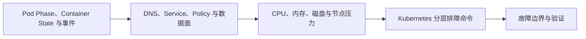

# 全链路故障排查（04） - 容器、网络与资源定位

> 读完后，你应能完成以下任务：
> - 绘制“全链路故障排查（04） - 容器、网络与资源定位 / Pod Phase、Container State 与事件”的关键对象与数据流，解释“Pod Pending 指向调度、PVC 或镜像前置条件，”，并用源码位置、日志或 Trace 标注证据。
> - 为“全链路故障排查（04） - 容器、网络与资源定位 / DNS、Service、Policy 与数据面”设计正常与异常输入，验证“临时调试容器必须与目标命名空间和身份一致；”，输出首个偏差位置与回归测试结果。
> - 实现“全链路故障排查（04） - 容器、网络与资源定位 / CPU、内存、磁盘与节点压力”的最小代码或配置，检验“资源修复以真实负载压测并同时观察业务 SLO，避免只提高 limit 把问题转移到节点。”，输出命令、结果与 Diff，并说明不适用边界。

<!-- article-progressive-block:start -->
# 一、先建立全局：容器、网络与资源定位 是什么？

理解“容器、网络与资源定位”，先要把标题中的对象放进同一条处理链：它接收什么输入，经过哪些状态变化，最终用什么证据判断结果。下表不另造概念，只把作者正文已经解释的章节按依赖顺序连起来。

“容器、网络与资源定位”的第一个核心判断是：Pod Pending 指向调度、PVC 或镜像前置条件，。先弄清这个判断中的对象和输入输出，后面的实现、故障和验收才有共同语境。

| 顺序 | 章节 | 读完本节应抓住的结论 |
| --- | --- | --- |
| 1 | Pod Phase、Container State 与事件 | Pod Pending 指向调度、PVC 或镜像前置条件， |
| 2 | DNS、Service、Policy 与数据面 | 临时调试容器必须与目标命名空间和身份一致； |
| 3 | CPU、内存、磁盘与节点压力 | 资源修复以真实负载压测并同时观察业务 SLO，避免只提高 limit 把问题转移到节点。 |
| 4 | Kubernetes 分层排障命令 | previous 日志在容器重启后尤其关键，避免再次重启覆盖现场。 |
| 5 | 故障边界与验证 | 验收时至少覆盖正常、边界和失败三条路径。 |
| 6 | Running 只表示至少一个容器运行 | Running 只表示至少一个容器运行， |

## 1.1 核心对象之间怎样衔接



这张图只表达本文的讲解顺序，不替代正文机制。判断“容器、网络与资源定位”是否真正掌握，需要能从最后一个结果沿图回到前面每个章节的输入、状态变化和证据。

## 1.2 再看失败：问题最早会出现在哪一步？

在“容器、网络与资源定位”的对象和顺序已经明确后，再看可观察的失败：版本不明、配置漂移、健康检查失真或数据不兼容。定位时不从最后一条错误猜原因，而是沿上图找第一个偏离正文结论的节点。
<!-- article-progressive-block:end -->

# 二、Pod Phase、Container State 与事件

Pod Pending 指向调度、PVC 或镜像前置条件，
Running 只表示至少一个容器运行，
不代表就绪。
容器 Waiting/Terminated 的 reason、exitCode、restartCount 和节点事件提供第一层证据；
CrashLoopBackOff 是退避状态，不是根因。

# 三、DNS、Service、Policy 与数据面

网络排障依次检查 Pod IP、DNS、Service、EndpointSlice、目标端口、NetworkPolicy 和 Ingress。
临时调试容器必须与目标命名空间和身份一致；
成功解析名称不证明 TCP 可达，TCP 可达也不证明 TLS/HTTP 正确。

# 四、CPU、内存、磁盘与节点压力

OOMKilled 看容器 limit 与工作集，
CPU 慢看 throttling 和请求队列，
Evicted 看节点 MemoryPressure/DiskPressure。
资源修复以真实负载压测并同时观察业务 SLO，避免只提高 limit 把问题转移到节点。

# 五、Kubernetes 分层排障命令

从对象状态到网络与节点资源逐步取证。

```bash
kubectl get pod POD -o wide
kubectl describe pod POD
kubectl logs POD --all-containers --previous
kubectl get endpointslice -l kubernetes.io/service-name=api
kubectl top pod POD --containers
kubectl describe node NODE
kubectl debug pod/POD -it --image=curlimages/curl --target=api
```

生产调试需审批短期权限并使用可信镜像。
previous 日志在容器重启后尤其关键，避免再次重启覆盖现场。

# 六、故障边界与验证

下面三类现象覆盖本主题最常见的错误路径；
证明结果可复现且没有引入新的副作用。

| 现象 | 常见根因 | 验证与处理 |
| --- | --- | --- |
| Pod Running 但 Service 无流量 | readiness 失败、selector/targetPort 错误 | 检查 Ready condition 与 EndpointSlice 端口 |
| 容器 OOMKilled | 内存 limit 不足、泄漏或峰值未纳入容量 | 对照 working set、GC 和请求长度，压测后调整 |
| 跨命名空间连接超时 | NetworkPolicy、DNS 或服务名作用域错误 | 从同身份调试 Pod 分别验证解析、TCP 和策略 |

验收时至少覆盖正常、边界和失败三条路径。
配置、镜像、工作流或测试数据都要绑定版本；

<!-- article-progressive-block:start -->
# 七、动手验证：先跑通 容器、网络与资源定位，再改变一个变量

前面的章节已经建立问题、概念和机制。现在把“容器、网络与资源定位”放进同一套基线中运行；本节不再引入新术语，只验证前文结论能否被复现。

## 7.1 基线与候选只允许一个变量不同

验证“容器、网络与资源定位”时，先固定制品、配置、数据版本、健康检查、灰度与回滚条件。候选方案只能改变本次要验证的变量；如果同时更换数据、依赖和配置，即使结果改善，也不能知道是哪一项产生作用。

执行“容器、网络与资源定位”时，动作是：按测试、影子、灰度、全量发布并执行兼容检查。原始结果不能只保留截图或汇总分数，必须同步保存：制品摘要、部署事件、错误率、业务指标、回滚记录，使下一次复查可以在同一输入上重放。

| 实验要素 | 本文要求 |
| --- | --- |
| 固定条件 | 制品、配置、数据版本、健康检查、灰度与回滚条件 |
| 唯一变量 | 本次候选方案与基线之间的一项明确差异 |
| 原始证据 | 制品摘要、部署事件、错误率、业务指标、回滚记录 |
| 通过阈值 | 版本可追溯，灰度不劣于基线，回滚路径已验证 |
| 立即停止 | 版本不明、配置漂移、健康检查失真或数据不兼容 |

## 7.2 执行前先排除不可比较条件

“容器、网络与资源定位”开始前先确认下面四项；任一项不成立，都应先修复实验条件，而不是解释结果。

- 基线能够在“容器、网络与资源定位”的当前环境重复运行。
- 候选只改变一个与“容器、网络与资源定位”结论直接相关的条件。
- “容器、网络与资源定位”的基线和候选使用同一批输入、同一版本依赖与同一通过阈值。
- “容器、网络与资源定位”的原始输出和失败现场不会被重试、格式化或汇总覆盖。

## 7.3 执行后先核对证据完整性

结果出来后先检查证据，再讨论“容器、网络与资源定位”是否通过。缺少中间状态时，最终输出只能说明现象，不能证明机制。

| 检查项 | 当前文章的判定 |
| --- | --- |
| 输入可追溯 | 制品、配置、数据版本、健康检查、灰度与回滚条件 |
| 过程可回放 | 按测试、影子、灰度、全量发布并执行兼容检查 |
| 结果可审计 | 制品摘要、部署事件、错误率、业务指标、回滚记录 |

“容器、网络与资源定位”的一次合格基线对照按以下顺序执行：

1. 保存“容器、网络与资源定位”基线版本及输入摘要，确认基线本身可以重复运行。
2. 写下“容器、网络与资源定位”候选方案唯一变化的变量，以及它预期影响的指标。
3. 在同一环境执行“容器、网络与资源定位”：按测试、影子、灰度、全量发布并执行兼容检查。
4. 为“容器、网络与资源定位”保存：制品摘要、部署事件、错误率、业务指标、回滚记录。
5. 使用“容器、网络与资源定位”预登记条件判断：版本可追溯，灰度不劣于基线，回滚路径已验证。
6. 如果“容器、网络与资源定位”未通过，不修改第二个变量，先恢复基线并保留失败现场。

# 八、用一张矩阵验证 容器、网络与资源定位 的关键结论

矩阵按正文顺序列出“容器、网络与资源定位”的结论。一次实验只选择一行，只改变这一行对应的条件；不要把多行合并成一个无法归因的大实验。

| 正文章节 | 已解释的结论 | 本轮唯一变量 | 必须保存的证据 |
| --- | --- | --- | --- |
| Pod Phase、Container State 与事件 | Pod Pending 指向调度、PVC 或镜像前置条件， | 只改变与“Pod Phase、Container State 与事件”相关的条件 | 制品摘要、部署事件、错误率、业务指标、回滚记录 |
| DNS、Service、Policy 与数据面 | 临时调试容器必须与目标命名空间和身份一致； | 只改变与“DNS、Service、Policy 与数据面”相关的条件 | 制品摘要、部署事件、错误率、业务指标、回滚记录 |
| CPU、内存、磁盘与节点压力 | 资源修复以真实负载压测并同时观察业务 SLO，避免只提高 limit 把问题转移到节点。 | 只改变与“CPU、内存、磁盘与节点压力”相关的条件 | 制品摘要、部署事件、错误率、业务指标、回滚记录 |
| Kubernetes 分层排障命令 | previous 日志在容器重启后尤其关键，避免再次重启覆盖现场。 | 只改变与“Kubernetes 分层排障命令”相关的条件 | 制品摘要、部署事件、错误率、业务指标、回滚记录 |
| 故障边界与验证 | 验收时至少覆盖正常、边界和失败三条路径。 | 只改变与“故障边界与验证”相关的条件 | 制品摘要、部署事件、错误率、业务指标、回滚记录 |
| Running 只表示至少一个容器运行 | Running 只表示至少一个容器运行， | 只改变与“Running 只表示至少一个容器运行”相关的条件 | 制品摘要、部署事件、错误率、业务指标、回滚记录 |

## 8.1 记录本次实际实验

下面的记录用于“容器、网络与资源定位”当前这一次实验，不是第二套知识目录。先从矩阵选择一个章节，再填写实际值；没有填写的字段表示尚未验证。

```yaml
topic: "容器、网络与资源定位"
selected_chapter: required
claim_from_article: required
baseline_version: required
changed_condition: exactly_one
execution: "按测试、影子、灰度、全量发布并执行兼容检查"
evidence: "制品摘要、部署事件、错误率、业务指标、回滚记录"
pass_when: "版本可追溯，灰度不劣于基线，回滚路径已验证"
stop_when: "版本不明、配置漂移、健康检查失真或数据不兼容"
observed_result: required
first_deviation: null_or_evidence
recovery_replay: required_after_failure
```

## 8.2 边界实验必须证明能够停止和恢复

成功路径只能证明“容器、网络与资源定位”在当前样本上工作，不能证明它可以进入生产。边界实验需要主动制造：版本不明、配置漂移、健康检查失真或数据不兼容，并观察系统是否在产生不可逆副作用前停止。

| 场景 | 只改变什么 | 应保存什么 | 通过标准 |
| --- | --- | --- | --- |
| 正常路径 | 使用已知有效输入 | 制品摘要、部署事件、错误率、业务指标、回滚记录 | 版本可追溯，灰度不劣于基线，回滚路径已验证 |
| 边界路径 | 把一个输入推进到约束临界值 | 临界值前后的输出与指标 | 不静默降级，不把部分结果冒充成功 |
| 明确失败 | 注入：版本不明、配置漂移、健康检查失真或数据不兼容 | 原始错误、首个异常阶段和最终状态 | 失败被正确分类且没有扩大副作用 |
| 恢复重放 | 执行：停止扩量，回滚制品与配置，数据采用前向修复 | 原失败样本的复测证据 | 原样本恢复，正常样本没有回归 |

恢复动作不是简单重启。对于“容器、网络与资源定位”，第一步是：停止扩量，回滚制品与配置，数据采用前向修复。完成后使用原始失败样本复测；只验证一个新样本成功，不能证明触发条件已经消失。

“容器、网络与资源定位”边界实验结束后，应把正常、临界、失败和恢复四类记录放在同一个运行批次中。这样才能区分“候选方案真的修复问题”和“环境变化让问题暂时没有出现”。

# 九、容器、网络与资源定位 的结果解释

解释“容器、网络与资源定位”实验时先看首个偏差，而不是最后一条错误。最后的异常通常只是上游状态错误的结果；从末端反推容易误把症状当根因。

| 观察结果 | 可以支持的判断 | 下一步 |
| --- | --- | --- |
| 主链路没有达到预期 | 版本不明、配置漂移、健康检查失真或数据不兼容 | 先执行：停止扩量，回滚制品与配置，数据采用前向修复 |
| 异常链路无法恢复 | 版本不明、配置漂移、健康检查失真或数据不兼容 | 先执行：停止扩量，回滚制品与配置，数据采用前向修复 |
| 新样本成功但原样本仍失败 | 修复没有覆盖原始触发条件 | 固定原失败输入，恢复基线后重新比较 |
| 指标改善但证据无法回链 | 数据、版本或中间状态没有固定 | 暂停发布，补齐可追溯记录后重跑 |

“容器、网络与资源定位”只有同时满足“版本可追溯，灰度不劣于基线，回滚路径已验证”，并且没有出现“版本不明、配置漂移、健康检查失真或数据不兼容”，才可以认为主链路通过。这里的“通过”只对当前固定版本、样本和环境有效，不能外推到尚未测试的容量、权限或数据分布。

如果“容器、网络与资源定位”候选方案与基线差异很小，先检查证据分辨率是否足够；如果差异很大，先排除数据泄漏、环境漂移和版本不一致。两种情况都不能只看一个汇总均值，需要回到逐样本输出和中间状态。

“容器、网络与资源定位”故障定位完成后，记录“现象、首个偏差、根因、改动、原样本复测”五项。缺少原样本复测时，只能标记为待观察，不能标记为已解决。

# 十、容器、网络与资源定位 的发布判断

发布判断需要把“容器、网络与资源定位”的质量、失败边界和恢复能力放在同一份记录中。以下任一条件缺失，都应停止扩量，而不是用“基本正常”替代证据。

- [ ] “容器、网络与资源定位”的基线与候选只存在一个计划内变量。
- [ ] “容器、网络与资源定位”的输入、代码、依赖、配置和数据版本可以追溯。
- [ ] “容器、网络与资源定位”的正常、临界、失败和恢复样本使用同一套断言。
- [ ] “容器、网络与资源定位”的原始输出、中间状态和失败现场已经保留。
- [ ] “容器、网络与资源定位”的日志、Trace、截图和测试数据已经脱敏。
- [ ] “容器、网络与资源定位”的停止条件、负责人和回滚入口已经演练。
- [ ] “容器、网络与资源定位”尚未覆盖的输入、权限、容量和外部依赖已经登记。

最终记录至少包含基线版本、唯一变量、原始证据、首个偏差、恢复复测和发布责任人。没有参与本次修改的人如果不能据此重放“容器、网络与资源定位”的判断，就不能发布。
<!-- article-progressive-block:end -->

# 十一、总结

- **Pod Phase、Container State 与事件**：Pod Pending 指向调度、PVC 或镜像前置条件，Running 只表示至少一个容器运行，不代表就绪。
- **DNS、Service、Policy 与数据面**：临时调试容器必须与目标命名空间和身份一致；
- **CPU、内存、磁盘与节点压力**：资源修复以真实负载压测并同时观察业务 SLO，避免只提高 limit 把问题转移到节点。
- **Kubernetes 分层排障命令**：previous 日志在容器重启后尤其关键，避免再次重启覆盖现场。

## 参考资料

- [Kubernetes Debug Pods](https://kubernetes.io/docs/tasks/debug/debug-application/debug-pods/)
- [Kubernetes Debug Services](https://kubernetes.io/docs/tasks/debug/debug-application/debug-service/)
- [Kubernetes Resource Metrics](https://kubernetes.io/docs/tasks/debug/debug-cluster/resource-metrics-pipeline/)
