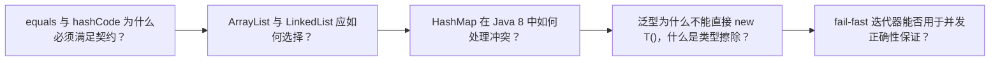

# Java 面试题（01） - Java 基础与集合面试题

> 读完后，你应能完成以下任务：
> - 绘制“Java 面试题（01） - Java 基础与集合面试题 / equals 与 hashCode 为什么必须满足契约？”的关键对象与数据流，解释“简洁答案： 相等对象必须有相同哈希值；”，并用源码位置、日志或 Trace 标注证据。
> - 为“Java 面试题（01） - Java 基础与集合面试题 / ArrayList 与 LinkedList 应如何选择？”设计正常与异常输入，验证“即使中间插入本身 O(1)，找到位置仍是 O(n)。”，输出首个偏差位置与回归测试结果。
> - 实现“Java 面试题（01） - Java 基础与集合面试题 / HashMap 在 Java 8 中如何处理冲突？”的最小代码或配置，检验“深入说明： 容量保持 2 的幂，通过扰动后的哈希与掩码定位桶；”，输出命令、结果与 Diff，并说明不适用边界。

面试回答不能停在名词解释。

<!-- article-progressive-block:start -->
# 一、先建立全局：Java 基础与集合面试题 是什么？

理解“Java 基础与集合面试题”，先要把标题中的对象放进同一条处理链：它接收什么输入，经过哪些状态变化，最终用什么证据判断结果。下表不另造概念，只把作者正文已经解释的章节按依赖顺序连起来。

“Java 基础与集合面试题”的第一个核心判断是：简洁答案： 相等对象必须有相同哈希值；。先弄清这个判断中的对象和输入输出，后面的实现、故障和验收才有共同语境。

| 顺序 | 章节 | 读完本节应抓住的结论 |
| --- | --- | --- |
| 1 | equals 与 hashCode 为什么必须满足契约？ | 简洁答案： 相等对象必须有相同哈希值； |
| 2 | ArrayList 与 LinkedList 应如何选择？ | 即使中间插入本身 O(1)，找到位置仍是 O(n)。 |
| 3 | HashMap 在 Java 8 中如何处理冲突？ | 深入说明： 容量保持 2 的幂，通过扰动后的哈希与掩码定位桶； |
| 4 | 泛型为什么不能直接 new T()，什么是类型擦除？ | 需要创建实例时应显式传入 Class、Supplier 或工厂，而不是依赖反射猜测。 |
| 5 | fail-fast 迭代器能否用于并发正确性保证？ | ConcurrentModificationException 只是尽力发现结构修改的调试信号。 |
| 6 | 场景题答题框架 | 先固定现象、时间、版本、输入和影响范围， |

## 1.1 核心对象之间怎样衔接



这张图只表达本文的讲解顺序，不替代正文机制。判断“Java 基础与集合面试题”是否真正掌握，需要能从最后一个结果沿图回到前面每个章节的输入、状态变化和证据。

## 1.2 再看失败：问题最早会出现在哪一步？

在“Java 基础与集合面试题”的对象和顺序已经明确后，再看可观察的失败：条件缺失、结果不可复现或失败后责任不清。定位时不从最后一条错误猜原因，而是沿上图找第一个偏离正文结论的节点。
<!-- article-progressive-block:end -->

# 二、equals 与 hashCode 为什么必须满足契约？

**简洁答案：** 相等对象必须有相同哈希值；哈希相同不代表对象相等。

**深入说明：** HashMap 先用 hash 定位桶，再用 equals 确认键。
只重写 equals 会让逻辑相等的对象落到不同桶，get、remove 和去重都可能失败。
可变字段也不宜参与键的哈希计算，否则对象放入集合后修改字段会导致再也找不到原键。

**继续追问：** 如何为包含数组、继承层次或 BigDecimal 的值对象实现稳定相等性？

# 三、ArrayList 与 LinkedList 应如何选择？

**简洁答案：** 大多数业务默认 ArrayList；
只有经过测量且确有双端频繁操作时才考虑链表。

**深入说明：** ArrayList 连续存储，
随机访问 O(1)，
扩容是摊销 O(1)，
缓存局部性好。
LinkedList 按索引访问 O(n)，节点对象有额外内存和分配成本；
即使中间插入本身 O(1)，找到位置仍是 O(n)。
复杂度表不能替代真实负载基准。

**继续追问：** ArrayDeque 为什么通常比 LinkedList 更适合作为队列或栈？

# 四、HashMap 在 Java 8 中如何处理冲突？

**简洁答案：** 桶内先使用链表，元素达到阈值且表容量足够时树化为红黑树。

**深入说明：** 容量保持 2 的幂，通过扰动后的哈希与掩码定位桶；
扩容时节点按新增高位拆分到原位置或原位置加旧容量。
树化用于限制恶意或极端冲突下的查找退化，
但良好 hashCode、合理初始容量和负载因子仍是基础。
HashMap 不保证并发安全。

**继续追问：** 为什么树化还要求最小表容量，什么时候扩容比树化更合适？

# 五、泛型为什么不能直接 new T()，什么是类型擦除？

**简洁答案：** Java 泛型主要在编译期检查，
运行时多数类型参数被擦除为上界，
因此无法直接获得 T 的构造器。

**深入说明：** 编译器插入强制转换并生成桥接方法维持多态。
需要创建实例时应显式传入 Class、Supplier 或工厂，而不是依赖反射猜测。
擦除也解释了不能重载 List<String> 与 List<Integer>、不能创建参数化类型数组等限制。

**继续追问：** PECS 原则如何指导 API 中 extends 与 super 的选择？

# 六、fail-fast 迭代器能否用于并发正确性保证？

**简洁答案：** 不能；
ConcurrentModificationException 只是尽力发现结构修改的调试信号。

**深入说明：** 普通集合通过 modCount 检测预期修改次数，
未同步并发下既可能抛异常，
也可能读到不可预测结果。
需要并发访问时根据语义选择不可变快照、外部锁、ConcurrentHashMap 或 CopyOnWriteArrayList，
并明确迭代看到的是强一致还是弱一致视图。

**继续追问：** CopyOnWriteArrayList 在读多写少之外还会带来哪些内存和一致性成本？

# 七、场景题答题框架

遇到生产排障或系统设计题，
先固定现象、时间、版本、输入和影响范围，
再沿调用链寻找第一个异常事实。
不能只说“加缓存”“上微服务”或“扩容”。

<!-- article-progressive-block:start -->
# 八、动手验证：先跑通 Java 基础与集合面试题，再改变一个变量

前面的章节已经建立问题、概念和机制。现在把“Java 基础与集合面试题”放进同一套基线中运行；本节不再引入新术语，只验证前文结论能否被复现。

## 8.1 基线与候选只允许一个变量不同

验证“Java 基础与集合面试题”时，先固定样本、基线、候选、成功标准和失败边界。候选方案只能改变本次要验证的变量；如果同时更换数据、依赖和配置，即使结果改善，也不能知道是哪一项产生作用。

执行“Java 基础与集合面试题”时，动作是：同环境运行基线与候选，记录输入、中间状态和异常。原始结果不能只保留截图或汇总分数，必须同步保存：可重放命令、结构化日志、输出 Diff、失败样本、版本，使下一次复查可以在同一输入上重放。

| 实验要素 | 本文要求 |
| --- | --- |
| 固定条件 | 固定样本、基线、候选、成功标准和失败边界 |
| 唯一变量 | 本次候选方案与基线之间的一项明确差异 |
| 原始证据 | 可重放命令、结构化日志、输出 Diff、失败样本、版本 |
| 通过阈值 | 结果符合结论条件，异常输入可解释、可恢复 |
| 立即停止 | 条件缺失、结果不可复现或失败后责任不清 |

## 8.2 执行前先排除不可比较条件

“Java 基础与集合面试题”开始前先确认下面四项；任一项不成立，都应先修复实验条件，而不是解释结果。

- 基线能够在“Java 基础与集合面试题”的当前环境重复运行。
- 候选只改变一个与“Java 基础与集合面试题”结论直接相关的条件。
- “Java 基础与集合面试题”的基线和候选使用同一批输入、同一版本依赖与同一通过阈值。
- “Java 基础与集合面试题”的原始输出和失败现场不会被重试、格式化或汇总覆盖。

## 8.3 执行后先核对证据完整性

结果出来后先检查证据，再讨论“Java 基础与集合面试题”是否通过。缺少中间状态时，最终输出只能说明现象，不能证明机制。

| 检查项 | 当前文章的判定 |
| --- | --- |
| 输入可追溯 | 固定样本、基线、候选、成功标准和失败边界 |
| 过程可回放 | 同环境运行基线与候选，记录输入、中间状态和异常 |
| 结果可审计 | 可重放命令、结构化日志、输出 Diff、失败样本、版本 |

“Java 基础与集合面试题”的一次合格基线对照按以下顺序执行：

1. 保存“Java 基础与集合面试题”基线版本及输入摘要，确认基线本身可以重复运行。
2. 写下“Java 基础与集合面试题”候选方案唯一变化的变量，以及它预期影响的指标。
3. 在同一环境执行“Java 基础与集合面试题”：同环境运行基线与候选，记录输入、中间状态和异常。
4. 为“Java 基础与集合面试题”保存：可重放命令、结构化日志、输出 Diff、失败样本、版本。
5. 使用“Java 基础与集合面试题”预登记条件判断：结果符合结论条件，异常输入可解释、可恢复。
6. 如果“Java 基础与集合面试题”未通过，不修改第二个变量，先恢复基线并保留失败现场。

# 九、用一张矩阵验证 Java 基础与集合面试题 的关键结论

矩阵按正文顺序列出“Java 基础与集合面试题”的结论。一次实验只选择一行，只改变这一行对应的条件；不要把多行合并成一个无法归因的大实验。

| 正文章节 | 已解释的结论 | 本轮唯一变量 | 必须保存的证据 |
| --- | --- | --- | --- |
| equals 与 hashCode 为什么必须满足契约？ | 简洁答案： 相等对象必须有相同哈希值； | 只改变与“equals 与 hashCode 为什么必须满足契约？”相关的条件 | 可重放命令、结构化日志、输出 Diff、失败样本、版本 |
| ArrayList 与 LinkedList 应如何选择？ | 即使中间插入本身 O(1)，找到位置仍是 O(n)。 | 只改变与“ArrayList 与 LinkedList 应如何选择？”相关的条件 | 可重放命令、结构化日志、输出 Diff、失败样本、版本 |
| HashMap 在 Java 8 中如何处理冲突？ | 深入说明： 容量保持 2 的幂，通过扰动后的哈希与掩码定位桶； | 只改变与“HashMap 在 Java 8 中如何处理冲突？”相关的条件 | 可重放命令、结构化日志、输出 Diff、失败样本、版本 |
| 泛型为什么不能直接 new T()，什么是类型擦除？ | 需要创建实例时应显式传入 Class、Supplier 或工厂，而不是依赖反射猜测。 | 只改变与“泛型为什么不能直接 new T()，什么是类型擦除？”相关的条件 | 可重放命令、结构化日志、输出 Diff、失败样本、版本 |
| fail-fast 迭代器能否用于并发正确性保证？ | ConcurrentModificationException 只是尽力发现结构修改的调试信号。 | 只改变与“fail-fast 迭代器能否用于并发正确性保证？”相关的条件 | 可重放命令、结构化日志、输出 Diff、失败样本、版本 |
| 场景题答题框架 | 先固定现象、时间、版本、输入和影响范围， | 只改变与“场景题答题框架”相关的条件 | 可重放命令、结构化日志、输出 Diff、失败样本、版本 |

## 9.1 记录本次实际实验

下面的记录用于“Java 基础与集合面试题”当前这一次实验，不是第二套知识目录。先从矩阵选择一个章节，再填写实际值；没有填写的字段表示尚未验证。

```yaml
topic: "Java 基础与集合面试题"
selected_chapter: required
claim_from_article: required
baseline_version: required
changed_condition: exactly_one
execution: "同环境运行基线与候选，记录输入、中间状态和异常"
evidence: "可重放命令、结构化日志、输出 Diff、失败样本、版本"
pass_when: "结果符合结论条件，异常输入可解释、可恢复"
stop_when: "条件缺失、结果不可复现或失败后责任不清"
observed_result: required
first_deviation: null_or_evidence
recovery_replay: required_after_failure
```

## 9.2 边界实验必须证明能够停止和恢复

成功路径只能证明“Java 基础与集合面试题”在当前样本上工作，不能证明它可以进入生产。边界实验需要主动制造：条件缺失、结果不可复现或失败后责任不清，并观察系统是否在产生不可逆副作用前停止。

| 场景 | 只改变什么 | 应保存什么 | 通过标准 |
| --- | --- | --- | --- |
| 正常路径 | 使用已知有效输入 | 可重放命令、结构化日志、输出 Diff、失败样本、版本 | 结果符合结论条件，异常输入可解释、可恢复 |
| 边界路径 | 把一个输入推进到约束临界值 | 临界值前后的输出与指标 | 不静默降级，不把部分结果冒充成功 |
| 明确失败 | 注入：条件缺失、结果不可复现或失败后责任不清 | 原始错误、首个异常阶段和最终状态 | 失败被正确分类且没有扩大副作用 |
| 恢复重放 | 执行：保留基线，缩小变量；根因确认前不扩大范围 | 原失败样本的复测证据 | 原样本恢复，正常样本没有回归 |

恢复动作不是简单重启。对于“Java 基础与集合面试题”，第一步是：保留基线，缩小变量；根因确认前不扩大范围。完成后使用原始失败样本复测；只验证一个新样本成功，不能证明触发条件已经消失。

“Java 基础与集合面试题”边界实验结束后，应把正常、临界、失败和恢复四类记录放在同一个运行批次中。这样才能区分“候选方案真的修复问题”和“环境变化让问题暂时没有出现”。

# 十、Java 基础与集合面试题 的结果解释

解释“Java 基础与集合面试题”实验时先看首个偏差，而不是最后一条错误。最后的异常通常只是上游状态错误的结果；从末端反推容易误把症状当根因。

| 观察结果 | 可以支持的判断 | 下一步 |
| --- | --- | --- |
| 主链路没有达到预期 | 条件缺失、结果不可复现或失败后责任不清 | 先执行：保留基线，缩小变量；根因确认前不扩大范围 |
| 异常链路无法恢复 | 条件缺失、结果不可复现或失败后责任不清 | 先执行：保留基线，缩小变量；根因确认前不扩大范围 |
| 新样本成功但原样本仍失败 | 修复没有覆盖原始触发条件 | 固定原失败输入，恢复基线后重新比较 |
| 指标改善但证据无法回链 | 数据、版本或中间状态没有固定 | 暂停发布，补齐可追溯记录后重跑 |

“Java 基础与集合面试题”只有同时满足“结果符合结论条件，异常输入可解释、可恢复”，并且没有出现“条件缺失、结果不可复现或失败后责任不清”，才可以认为主链路通过。这里的“通过”只对当前固定版本、样本和环境有效，不能外推到尚未测试的容量、权限或数据分布。

如果“Java 基础与集合面试题”候选方案与基线差异很小，先检查证据分辨率是否足够；如果差异很大，先排除数据泄漏、环境漂移和版本不一致。两种情况都不能只看一个汇总均值，需要回到逐样本输出和中间状态。

“Java 基础与集合面试题”故障定位完成后，记录“现象、首个偏差、根因、改动、原样本复测”五项。缺少原样本复测时，只能标记为待观察，不能标记为已解决。

# 十一、Java 基础与集合面试题 的发布判断

发布判断需要把“Java 基础与集合面试题”的质量、失败边界和恢复能力放在同一份记录中。以下任一条件缺失，都应停止扩量，而不是用“基本正常”替代证据。

- [ ] “Java 基础与集合面试题”的基线与候选只存在一个计划内变量。
- [ ] “Java 基础与集合面试题”的输入、代码、依赖、配置和数据版本可以追溯。
- [ ] “Java 基础与集合面试题”的正常、临界、失败和恢复样本使用同一套断言。
- [ ] “Java 基础与集合面试题”的原始输出、中间状态和失败现场已经保留。
- [ ] “Java 基础与集合面试题”的日志、Trace、截图和测试数据已经脱敏。
- [ ] “Java 基础与集合面试题”的停止条件、负责人和回滚入口已经演练。
- [ ] “Java 基础与集合面试题”尚未覆盖的输入、权限、容量和外部依赖已经登记。

最终记录至少包含基线版本、唯一变量、原始证据、首个偏差、恢复复测和发布责任人。没有参与本次修改的人如果不能据此重放“Java 基础与集合面试题”的判断，就不能发布。
<!-- article-progressive-block:end -->

# 十二、总结

- **equals 与 hashCode 为什么必须满足契约？**：简洁答案： 相等对象必须有相同哈希值；
- **ArrayList 与 LinkedList 应如何选择？**：深入说明： ArrayList 连续存储，随机访问 O(1)，扩容是摊销 O(1)，缓存局部性好。
- **HashMap 在 Java 8 中如何处理冲突？**：深入说明： 容量保持 2 的幂，通过扰动后的哈希与掩码定位桶；
- **泛型为什么不能直接 new T()，什么是类型擦除？**：需要创建实例时应显式传入 Class、Supplier 或工厂，而不是依赖反射猜测。
- **fail-fast 迭代器能否用于并发正确性保证？**：ConcurrentModificationException 只是尽力发现结构修改的调试信号。

## 参考资料

- [Java Object API](https://docs.oracle.com/en/java/javase/21/docs/api/java.base/java/lang/Object.html)
- [Java Collections Framework](https://docs.oracle.com/en/java/javase/21/docs/api/java.base/java/util/package-summary.html)
- [Java Generics Tutorial](https://docs.oracle.com/javase/tutorial/java/generics/)
