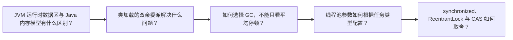

# Java 面试题（02） - JVM 与并发面试题

> 读完后，你应能完成以下任务：
> - 绘制“Java 面试题（02） - JVM 与并发面试题 / JVM 运行时数据区与 Java 内存模型有什么区别？”的关键对象与数据流，解释“happens-before 规则决定写入何时对其他线程可见，”，并用源码位置、日志或 Trace 标注证据。
> - 为“Java 面试题（02） - JVM 与并发面试题 / 类加载的双亲委派解决什么问题？”设计正常与异常输入，验证“避免核心类型被重复或恶意替换，”，输出首个偏差位置与回归测试结果。
> - 实现“Java 面试题（02） - JVM 与并发面试题 / 如何选择 GC，不能只看平均停顿？”的最小代码或配置，检验“简洁答案： 应按堆大小、对象分配率、延迟目标、吞吐和可用 CPU 综合选择，”，输出命令、结果与 Diff，并说明不适用边界。

面试回答不能停在名词解释。

<!-- article-progressive-block:start -->
# 一、先建立全局：JVM 与并发面试题 是什么？

理解“JVM 与并发面试题”，先要把标题中的对象放进同一条处理链：它接收什么输入，经过哪些状态变化，最终用什么证据判断结果。下表不另造概念，只把作者正文已经解释的章节按依赖顺序连起来。

“JVM 与并发面试题”的第一个核心判断是：happens-before 规则决定写入何时对其他线程可见，。先弄清这个判断中的对象和输入输出，后面的实现、故障和验收才有共同语境。

| 顺序 | 章节 | 读完本节应抓住的结论 |
| --- | --- | --- |
| 1 | JVM 运行时数据区与 Java 内存模型有什么区别？ | happens-before 规则决定写入何时对其他线程可见， |
| 2 | 类加载的双亲委派解决什么问题？ | 避免核心类型被重复或恶意替换， |
| 3 | 如何选择 GC，不能只看平均停顿？ | 简洁答案： 应按堆大小、对象分配率、延迟目标、吞吐和可用 CPU 综合选择， |
| 4 | 线程池参数如何根据任务类型配置？ | 深入说明： 必须设置有界队列、明确拒绝策略、线程命名、超时和指标。 |
| 5 | synchronized、ReentrantLock 与 CAS 如何取舍？ | 简洁答案： 先按互斥、可中断、公平、条件队列和竞争强度选择语义，再用基准与剖析验证。 |
| 6 | 场景题答题框架 | 先固定现象、时间、版本、输入和影响范围， |

## 1.1 核心对象之间怎样衔接



这张图只表达本文的讲解顺序，不替代正文机制。判断“JVM 与并发面试题”是否真正掌握，需要能从最后一个结果沿图回到前面每个章节的输入、状态变化和证据。

## 1.2 再看失败：问题最早会出现在哪一步？

在“JVM 与并发面试题”的对象和顺序已经明确后，再看可观察的失败：依赖漂移、参数未校验、异常被吞、事务未回滚或状态残留。定位时不从最后一条错误猜原因，而是沿上图找第一个偏离正文结论的节点。
<!-- article-progressive-block:end -->

# 二、JVM 运行时数据区与 Java 内存模型有什么区别？

**简洁答案：** 运行时数据区描述 JVM 内存组织，
Java 内存模型定义线程间可见性、顺序性和原子性规则。

**深入说明：** 堆和方法区由线程共享，虚拟机栈、程序计数器等通常线程私有；
这不等同于主内存和工作内存的抽象。
happens-before 规则决定写入何时对其他线程可见，
volatile、锁、线程启动与结束都能建立特定顺序关系。

**继续追问：** volatile 为什么不能让复合的 i++ 变成原子操作？

# 三、类加载的双亲委派解决什么问题？

**简洁答案：** 它优先让父加载器加载已知类，
避免核心类型被重复或恶意替换，
并维持类型身份稳定。

**深入说明：** 类身份由全限定名和定义它的 ClassLoader 共同决定。
加载通常经历加载、链接和初始化；
SPI、应用服务器和插件框架可能使用线程上下文加载器或子优先策略，
但必须控制包隔离、版本冲突和卸载引用，
否则会产生 ClassCastException 或元空间泄漏。

**继续追问：** 如何用 jcmd、类加载日志和堆转储判断 ClassLoader 泄漏？

# 四、如何选择 GC，不能只看平均停顿？

**简洁答案：** 应按堆大小、对象分配率、延迟目标、吞吐和可用 CPU 综合选择，
并用生产相似负载验证。

**深入说明：** G1 面向可预测停顿并按 Region 回收，
ZGC 和 Shenandoah 更强调低停顿但有额外并发开销。
排查需同时看 GC 日志、分配速率、晋升失败、存活集和容器内存；
盲目加堆可能延长回收、推迟泄漏暴露并触发宿主 OOMKill。

**继续追问：** 容器 memory limit、MaxRAMPercentage 和 off-heap 应如何一起预算？

# 五、线程池参数如何根据任务类型配置？

**简洁答案：** 先区分 CPU 密集与阻塞任务，
再用到达率、服务时间和允许排队时间估算并发，
而不是照抄固定公式。

**深入说明：** 必须设置有界队列、明确拒绝策略、线程命名、超时和指标。
无界队列会把过载变成高延迟与内存压力，过大的线程数会增加切换和下游并发。
任务异常不能被静默吞掉，关闭时要停止接单、等待在途任务并处理未完成任务。

**继续追问：** CallerRunsPolicy 何时能形成反压，何时会阻塞关键请求线程？

# 六、synchronized、ReentrantLock 与 CAS 如何取舍？

**简洁答案：** 先按互斥、可中断、公平、条件队列和竞争强度选择语义，再用基准与剖析验证。

**深入说明：** synchronized 具备自动释放和 JVM 优化，适合常规临界区；
ReentrantLock 提供 tryLock、可中断获取和多个 Condition，
但必须 finally 解锁。
CAS 适合短小状态转换，仍需处理 ABA、自旋成本和多变量不变量，不能把无锁等同于一定更快。

**继续追问：** 如何用线程转储和 JFR 区分锁竞争、死锁与线程池饥饿？

# 七、场景题答题框架

遇到生产排障或系统设计题，
先固定现象、时间、版本、输入和影响范围，
再沿调用链寻找第一个异常事实。
不能只说“加缓存”“上微服务”或“扩容”。

<!-- article-progressive-block:start -->
# 八、动手验证：先跑通 JVM 与并发面试题，再改变一个变量

前面的章节已经建立问题、概念和机制。现在把“JVM 与并发面试题”放进同一套基线中运行；本节不再引入新术语，只验证前文结论能否被复现。

## 8.1 基线与候选只允许一个变量不同

验证“JVM 与并发面试题”时，先固定语言与依赖版本、请求参数、数据库初始状态和环境配置。候选方案只能改变本次要验证的变量；如果同时更换数据、依赖和配置，即使结果改善，也不能知道是哪一项产生作用。

执行“JVM 与并发面试题”时，动作是：运行最小程序或接口测试，覆盖正常输入、边界值和异常传播。原始结果不能只保留截图或汇总分数，必须同步保存：退出码、响应状态、断言、数据库前后状态、异常栈和测试报告，使下一次复查可以在同一输入上重放。

| 实验要素 | 本文要求 |
| --- | --- |
| 固定条件 | 固定语言与依赖版本、请求参数、数据库初始状态和环境配置 |
| 唯一变量 | 本次候选方案与基线之间的一项明确差异 |
| 原始证据 | 退出码、响应状态、断言、数据库前后状态、异常栈和测试报告 |
| 通过阈值 | 输出满足契约，异常不会留下部分写入，结果可在干净环境复现 |
| 立即停止 | 依赖漂移、参数未校验、异常被吞、事务未回滚或状态残留 |

## 8.2 执行前先排除不可比较条件

“JVM 与并发面试题”开始前先确认下面四项；任一项不成立，都应先修复实验条件，而不是解释结果。

- 基线能够在“JVM 与并发面试题”的当前环境重复运行。
- 候选只改变一个与“JVM 与并发面试题”结论直接相关的条件。
- “JVM 与并发面试题”的基线和候选使用同一批输入、同一版本依赖与同一通过阈值。
- “JVM 与并发面试题”的原始输出和失败现场不会被重试、格式化或汇总覆盖。

## 8.3 执行后先核对证据完整性

结果出来后先检查证据，再讨论“JVM 与并发面试题”是否通过。缺少中间状态时，最终输出只能说明现象，不能证明机制。

| 检查项 | 当前文章的判定 |
| --- | --- |
| 输入可追溯 | 固定语言与依赖版本、请求参数、数据库初始状态和环境配置 |
| 过程可回放 | 运行最小程序或接口测试，覆盖正常输入、边界值和异常传播 |
| 结果可审计 | 退出码、响应状态、断言、数据库前后状态、异常栈和测试报告 |

“JVM 与并发面试题”的一次合格基线对照按以下顺序执行：

1. 保存“JVM 与并发面试题”基线版本及输入摘要，确认基线本身可以重复运行。
2. 写下“JVM 与并发面试题”候选方案唯一变化的变量，以及它预期影响的指标。
3. 在同一环境执行“JVM 与并发面试题”：运行最小程序或接口测试，覆盖正常输入、边界值和异常传播。
4. 为“JVM 与并发面试题”保存：退出码、响应状态、断言、数据库前后状态、异常栈和测试报告。
5. 使用“JVM 与并发面试题”预登记条件判断：输出满足契约，异常不会留下部分写入，结果可在干净环境复现。
6. 如果“JVM 与并发面试题”未通过，不修改第二个变量，先恢复基线并保留失败现场。

# 九、用一张矩阵验证 JVM 与并发面试题 的关键结论

矩阵按正文顺序列出“JVM 与并发面试题”的结论。一次实验只选择一行，只改变这一行对应的条件；不要把多行合并成一个无法归因的大实验。

| 正文章节 | 已解释的结论 | 本轮唯一变量 | 必须保存的证据 |
| --- | --- | --- | --- |
| JVM 运行时数据区与 Java 内存模型有什么区别？ | happens-before 规则决定写入何时对其他线程可见， | 只改变与“JVM 运行时数据区与 Java 内存模型有什么区别？”相关的条件 | 退出码、响应状态、断言、数据库前后状态、异常栈和测试报告 |
| 类加载的双亲委派解决什么问题？ | 避免核心类型被重复或恶意替换， | 只改变与“类加载的双亲委派解决什么问题？”相关的条件 | 退出码、响应状态、断言、数据库前后状态、异常栈和测试报告 |
| 如何选择 GC，不能只看平均停顿？ | 简洁答案： 应按堆大小、对象分配率、延迟目标、吞吐和可用 CPU 综合选择， | 只改变与“如何选择 GC，不能只看平均停顿？”相关的条件 | 退出码、响应状态、断言、数据库前后状态、异常栈和测试报告 |
| 线程池参数如何根据任务类型配置？ | 深入说明： 必须设置有界队列、明确拒绝策略、线程命名、超时和指标。 | 只改变与“线程池参数如何根据任务类型配置？”相关的条件 | 退出码、响应状态、断言、数据库前后状态、异常栈和测试报告 |
| synchronized、ReentrantLock 与 CAS 如何取舍？ | 简洁答案： 先按互斥、可中断、公平、条件队列和竞争强度选择语义，再用基准与剖析验证。 | 只改变与“synchronized、ReentrantLock 与 CAS 如何取舍？”相关的条件 | 退出码、响应状态、断言、数据库前后状态、异常栈和测试报告 |
| 场景题答题框架 | 先固定现象、时间、版本、输入和影响范围， | 只改变与“场景题答题框架”相关的条件 | 退出码、响应状态、断言、数据库前后状态、异常栈和测试报告 |

## 9.1 记录本次实际实验

下面的记录用于“JVM 与并发面试题”当前这一次实验，不是第二套知识目录。先从矩阵选择一个章节，再填写实际值；没有填写的字段表示尚未验证。

```yaml
topic: "JVM 与并发面试题"
selected_chapter: required
claim_from_article: required
baseline_version: required
changed_condition: exactly_one
execution: "运行最小程序或接口测试，覆盖正常输入、边界值和异常传播"
evidence: "退出码、响应状态、断言、数据库前后状态、异常栈和测试报告"
pass_when: "输出满足契约，异常不会留下部分写入，结果可在干净环境复现"
stop_when: "依赖漂移、参数未校验、异常被吞、事务未回滚或状态残留"
observed_result: required
first_deviation: null_or_evidence
recovery_replay: required_after_failure
```

## 9.2 边界实验必须证明能够停止和恢复

成功路径只能证明“JVM 与并发面试题”在当前样本上工作，不能证明它可以进入生产。边界实验需要主动制造：依赖漂移、参数未校验、异常被吞、事务未回滚或状态残留，并观察系统是否在产生不可逆副作用前停止。

| 场景 | 只改变什么 | 应保存什么 | 通过标准 |
| --- | --- | --- | --- |
| 正常路径 | 使用已知有效输入 | 退出码、响应状态、断言、数据库前后状态、异常栈和测试报告 | 输出满足契约，异常不会留下部分写入，结果可在干净环境复现 |
| 边界路径 | 把一个输入推进到约束临界值 | 临界值前后的输出与指标 | 不静默降级，不把部分结果冒充成功 |
| 明确失败 | 注入：依赖漂移、参数未校验、异常被吞、事务未回滚或状态残留 | 原始错误、首个异常阶段和最终状态 | 失败被正确分类且没有扩大副作用 |
| 恢复重放 | 执行：从入口参数、调用栈、事务边界和外部依赖逐层缩小根因 | 原失败样本的复测证据 | 原样本恢复，正常样本没有回归 |

恢复动作不是简单重启。对于“JVM 与并发面试题”，第一步是：从入口参数、调用栈、事务边界和外部依赖逐层缩小根因。完成后使用原始失败样本复测；只验证一个新样本成功，不能证明触发条件已经消失。

“JVM 与并发面试题”边界实验结束后，应把正常、临界、失败和恢复四类记录放在同一个运行批次中。这样才能区分“候选方案真的修复问题”和“环境变化让问题暂时没有出现”。

# 十、JVM 与并发面试题 的结果解释

解释“JVM 与并发面试题”实验时先看首个偏差，而不是最后一条错误。最后的异常通常只是上游状态错误的结果；从末端反推容易误把症状当根因。

| 观察结果 | 可以支持的判断 | 下一步 |
| --- | --- | --- |
| 主链路没有达到预期 | 依赖漂移、参数未校验、异常被吞、事务未回滚或状态残留 | 先执行：从入口参数、调用栈、事务边界和外部依赖逐层缩小根因 |
| 异常链路无法恢复 | 依赖漂移、参数未校验、异常被吞、事务未回滚或状态残留 | 先执行：从入口参数、调用栈、事务边界和外部依赖逐层缩小根因 |
| 新样本成功但原样本仍失败 | 修复没有覆盖原始触发条件 | 固定原失败输入，恢复基线后重新比较 |
| 指标改善但证据无法回链 | 数据、版本或中间状态没有固定 | 暂停发布，补齐可追溯记录后重跑 |

“JVM 与并发面试题”只有同时满足“输出满足契约，异常不会留下部分写入，结果可在干净环境复现”，并且没有出现“依赖漂移、参数未校验、异常被吞、事务未回滚或状态残留”，才可以认为主链路通过。这里的“通过”只对当前固定版本、样本和环境有效，不能外推到尚未测试的容量、权限或数据分布。

如果“JVM 与并发面试题”候选方案与基线差异很小，先检查证据分辨率是否足够；如果差异很大，先排除数据泄漏、环境漂移和版本不一致。两种情况都不能只看一个汇总均值，需要回到逐样本输出和中间状态。

“JVM 与并发面试题”故障定位完成后，记录“现象、首个偏差、根因、改动、原样本复测”五项。缺少原样本复测时，只能标记为待观察，不能标记为已解决。

# 十一、JVM 与并发面试题 的发布判断

发布判断需要把“JVM 与并发面试题”的质量、失败边界和恢复能力放在同一份记录中。以下任一条件缺失，都应停止扩量，而不是用“基本正常”替代证据。

- [ ] “JVM 与并发面试题”的基线与候选只存在一个计划内变量。
- [ ] “JVM 与并发面试题”的输入、代码、依赖、配置和数据版本可以追溯。
- [ ] “JVM 与并发面试题”的正常、临界、失败和恢复样本使用同一套断言。
- [ ] “JVM 与并发面试题”的原始输出、中间状态和失败现场已经保留。
- [ ] “JVM 与并发面试题”的日志、Trace、截图和测试数据已经脱敏。
- [ ] “JVM 与并发面试题”的停止条件、负责人和回滚入口已经演练。
- [ ] “JVM 与并发面试题”尚未覆盖的输入、权限、容量和外部依赖已经登记。

最终记录至少包含基线版本、唯一变量、原始证据、首个偏差、恢复复测和发布责任人。没有参与本次修改的人如果不能据此重放“JVM 与并发面试题”的判断，就不能发布。
<!-- article-progressive-block:end -->

# 十二、总结

- **JVM 运行时数据区与 Java 内存模型有什么区别？**：happens-before 规则决定写入何时对其他线程可见，volatile、锁、线程启动与结束都能建立特定顺序关系。
- **类加载的双亲委派解决什么问题？**：简洁答案： 它优先让父加载器加载已知类，避免核心类型被重复或恶意替换，并维持类型身份稳定。
- **如何选择 GC，不能只看平均停顿？**：简洁答案： 应按堆大小、对象分配率、延迟目标、吞吐和可用 CPU 综合选择，并用生产相似负载验证。
- **线程池参数如何根据任务类型配置？**：简洁答案： 先区分 CPU 密集与阻塞任务，再用到达率、服务时间和允许排队时间估算并发，而不是照抄固定公式。
- **synchronized、ReentrantLock 与 CAS 如何取舍？**：简洁答案： 先按互斥、可中断、公平、条件队列和竞争强度选择语义，再用基准与剖析验证。

## 参考资料

- [Java Virtual Machine Specification](https://docs.oracle.com/javase/specs/jvms/se21/html/)
- [Java Language Specification Memory Model](https://docs.oracle.com/javase/specs/jls/se21/html/jls-17.html)
- [JDK Troubleshooting Guide](https://docs.oracle.com/en/java/javase/21/troubleshoot/)
