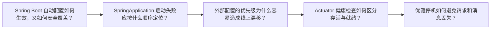

# Java 面试题（04） - Spring Boot 自动配置、启动流程与生产特性面试题

> 读完后，你应能完成以下任务：
> - 绘制“Java 面试题（04） - Spring Boot 自动配置、启动流程与生产特性面试题 / Spring Boot 自动配置如何生效，又如何安全覆盖？”的关键对象与数据流，解释“而不是猜某个 starter 是否加载。”，并用源码位置、日志或 Trace 标注证据。
> - 为“Java 面试题（04） - Spring Boot 自动配置、启动流程与生产特性面试题 / SpringApplication 启动失败应按什么顺序定位？”设计正常与异常输入，验证“深入说明： 最末尾的 BeanCreationException 往往只是包装。”，输出首个偏差位置与回归测试结果。
> - 实现“Java 面试题（04） - Spring Boot 自动配置、启动流程与生产特性面试题 / 外部配置的优先级为什么容易造成线上漂移？”的最小代码或配置，检验“深入说明： 生产应输出脱敏后的有效配置摘要和来源，”，输出命令、结果与 Diff，并说明不适用边界。

面试回答不能停在名词解释。

<!-- article-progressive-block:start -->
# 一、先建立全局：Spring Boot 自动配置、启动流程与生产特性面试题 是什么？

理解“Spring Boot 自动配置、启动流程与生产特性面试题”，先要把标题中的对象放进同一条处理链：它接收什么输入，经过哪些状态变化，最终用什么证据判断结果。下表不另造概念，只把作者正文已经解释的章节按依赖顺序连起来。

“Spring Boot 自动配置、启动流程与生产特性面试题”的第一个核心判断是：而不是猜某个 starter 是否加载。。先弄清这个判断中的对象和输入输出，后面的实现、故障和验收才有共同语境。

| 顺序 | 章节 | 读完本节应抓住的结论 |
| --- | --- | --- |
| 1 | Spring Boot 自动配置如何生效，又如何安全覆盖？ | 而不是猜某个 starter 是否加载。 |
| 2 | SpringApplication 启动失败应按什么顺序定位？ | 深入说明： 最末尾的 BeanCreationException 往往只是包装。 |
| 3 | 外部配置的优先级为什么容易造成线上漂移？ | 深入说明： 生产应输出脱敏后的有效配置摘要和来源， |
| 4 | Actuator 健康检查如何区分存活与就绪？ | 简洁答案： 存活表示进程是否应重启，就绪表示实例是否应接收流量； |
| 5 | 优雅停机如何避免请求和消息丢失？ | 验证不能只看进程退出码，还要检查连接终止、队列积压和重复副作用。 |
| 6 | 场景题答题框架 | 先固定现象、时间、版本、输入和影响范围， |

## 1.1 核心对象之间怎样衔接



这张图只表达本文的讲解顺序，不替代正文机制。判断“Spring Boot 自动配置、启动流程与生产特性面试题”是否真正掌握，需要能从最后一个结果沿图回到前面每个章节的输入、状态变化和证据。

## 1.2 再看失败：问题最早会出现在哪一步？

在“Spring Boot 自动配置、启动流程与生产特性面试题”的对象和顺序已经明确后，再看可观察的失败：依赖漂移、参数未校验、异常被吞、事务未回滚或状态残留。定位时不从最后一条错误猜原因，而是沿上图找第一个偏离正文结论的节点。
<!-- article-progressive-block:end -->

# 二、Spring Boot 自动配置如何生效，又如何安全覆盖？

**简洁答案：** 自动配置根据 classpath、Bean、属性和运行环境等条件提供默认 Bean，
用户显式配置通常使其退让。

**深入说明：** 排查时查看 Condition Evaluation Report，
而不是猜某个 starter 是否加载。
覆盖前先确认条件、Bean 名与配置优先级；
业务定制应通过公开的属性和扩展点，避免复制整段内部配置导致版本升级漂移。
自动配置的价值是合理默认值，不是隐藏系统行为。

**继续追问：** 如何编写带 @ConditionalOnMissingBean 的自定义 starter 并验证条件？

# 三、SpringApplication 启动失败应按什么顺序定位？

**简洁答案：** 先保留首个异常和条件报告，
再区分环境准备、上下文创建、Bean 实例化与 WebServer 启动阶段。

**深入说明：** 最末尾的 BeanCreationException 往往只是包装。
沿 cause 链找到第一个业务异常，
核对配置来源、激活 profile、端口、依赖版本和外部服务。
不要先删除缓存或扩大扫描包；
使用最小 profile、debug 报告和启动时间指标做可重复实验。

**继续追问：** ApplicationRunner、CommandLineRunner 与生命周期回调失败会产生什么启动状态？

# 四、外部配置的优先级为什么容易造成线上漂移？

**简洁答案：** 同一属性可能来自默认文件、profile、环境变量、系统属性和命令行，
后加载或高优先级来源会覆盖前者。

**深入说明：** 生产应输出脱敏后的有效配置摘要和来源，
敏感值由 Secret 管理，
不写入仓库。
使用 @ConfigurationProperties 做类型绑定与启动期校验，
避免散落的 @Value 和静默默认值。
变更配置也要版本化、灰度和可回滚。

**继续追问：** 如何区分“属性未绑定”“被高优先级覆盖”和“Bean 未使用该属性”？

# 五、Actuator 健康检查如何区分存活与就绪？

**简洁答案：** 存活表示进程是否应重启，就绪表示实例是否应接收流量；
二者不能混用。

**深入说明：** 数据库短暂不可用通常不应立即让 liveness 失败，
否则所有副本可能重启形成风暴；
readiness 可摘流并等待依赖恢复。
健康端点要限制暴露和详情权限，指标使用低基数标签。
发布验收应同时检查就绪、核心业务探针和错误预算。

**继续追问：** 自定义 HealthIndicator 为什么必须设置超时并避免执行昂贵查询？

# 六、优雅停机如何避免请求和消息丢失？

**简洁答案：** 先停止接收新流量，
再等待在途 HTTP、任务和消息处理完成，
超过预算才强制退出。

**深入说明：** Kubernetes 场景要协调 readiness、preStop、terminationGracePeriodSeconds 与应用 shutdown timeout。
消费者应停止拉取后提交已完成 offset，写操作保持幂等。
验证不能只看进程退出码，还要检查连接终止、队列积压和重复副作用。

**继续追问：** 滚动发布中为什么端点摘流与进程收到 SIGTERM 之间仍可能有请求？

# 七、场景题答题框架

遇到生产排障或系统设计题，
先固定现象、时间、版本、输入和影响范围，
再沿调用链寻找第一个异常事实。
不能只说“加缓存”“上微服务”或“扩容”。

<!-- article-progressive-block:start -->
# 八、动手验证：先跑通 Spring Boot 自动配置、启动流程与生产特性面试题，再改变一个变量

前面的章节已经建立问题、概念和机制。现在把“Spring Boot 自动配置、启动流程与生产特性面试题”放进同一套基线中运行；本节不再引入新术语，只验证前文结论能否被复现。

## 8.1 基线与候选只允许一个变量不同

验证“Spring Boot 自动配置、启动流程与生产特性面试题”时，先固定语言与依赖版本、请求参数、数据库初始状态和环境配置。候选方案只能改变本次要验证的变量；如果同时更换数据、依赖和配置，即使结果改善，也不能知道是哪一项产生作用。

执行“Spring Boot 自动配置、启动流程与生产特性面试题”时，动作是：运行最小程序或接口测试，覆盖正常输入、边界值和异常传播。原始结果不能只保留截图或汇总分数，必须同步保存：退出码、响应状态、断言、数据库前后状态、异常栈和测试报告，使下一次复查可以在同一输入上重放。

| 实验要素 | 本文要求 |
| --- | --- |
| 固定条件 | 固定语言与依赖版本、请求参数、数据库初始状态和环境配置 |
| 唯一变量 | 本次候选方案与基线之间的一项明确差异 |
| 原始证据 | 退出码、响应状态、断言、数据库前后状态、异常栈和测试报告 |
| 通过阈值 | 输出满足契约，异常不会留下部分写入，结果可在干净环境复现 |
| 立即停止 | 依赖漂移、参数未校验、异常被吞、事务未回滚或状态残留 |

## 8.2 执行前先排除不可比较条件

“Spring Boot 自动配置、启动流程与生产特性面试题”开始前先确认下面四项；任一项不成立，都应先修复实验条件，而不是解释结果。

- 基线能够在“Spring Boot 自动配置、启动流程与生产特性面试题”的当前环境重复运行。
- 候选只改变一个与“Spring Boot 自动配置、启动流程与生产特性面试题”结论直接相关的条件。
- “Spring Boot 自动配置、启动流程与生产特性面试题”的基线和候选使用同一批输入、同一版本依赖与同一通过阈值。
- “Spring Boot 自动配置、启动流程与生产特性面试题”的原始输出和失败现场不会被重试、格式化或汇总覆盖。

## 8.3 执行后先核对证据完整性

结果出来后先检查证据，再讨论“Spring Boot 自动配置、启动流程与生产特性面试题”是否通过。缺少中间状态时，最终输出只能说明现象，不能证明机制。

| 检查项 | 当前文章的判定 |
| --- | --- |
| 输入可追溯 | 固定语言与依赖版本、请求参数、数据库初始状态和环境配置 |
| 过程可回放 | 运行最小程序或接口测试，覆盖正常输入、边界值和异常传播 |
| 结果可审计 | 退出码、响应状态、断言、数据库前后状态、异常栈和测试报告 |

“Spring Boot 自动配置、启动流程与生产特性面试题”的一次合格基线对照按以下顺序执行：

1. 保存“Spring Boot 自动配置、启动流程与生产特性面试题”基线版本及输入摘要，确认基线本身可以重复运行。
2. 写下“Spring Boot 自动配置、启动流程与生产特性面试题”候选方案唯一变化的变量，以及它预期影响的指标。
3. 在同一环境执行“Spring Boot 自动配置、启动流程与生产特性面试题”：运行最小程序或接口测试，覆盖正常输入、边界值和异常传播。
4. 为“Spring Boot 自动配置、启动流程与生产特性面试题”保存：退出码、响应状态、断言、数据库前后状态、异常栈和测试报告。
5. 使用“Spring Boot 自动配置、启动流程与生产特性面试题”预登记条件判断：输出满足契约，异常不会留下部分写入，结果可在干净环境复现。
6. 如果“Spring Boot 自动配置、启动流程与生产特性面试题”未通过，不修改第二个变量，先恢复基线并保留失败现场。

# 九、用一张矩阵验证 Spring Boot 自动配置、启动流程与生产特性面试题 的关键结论

矩阵按正文顺序列出“Spring Boot 自动配置、启动流程与生产特性面试题”的结论。一次实验只选择一行，只改变这一行对应的条件；不要把多行合并成一个无法归因的大实验。

| 正文章节 | 已解释的结论 | 本轮唯一变量 | 必须保存的证据 |
| --- | --- | --- | --- |
| Spring Boot 自动配置如何生效，又如何安全覆盖？ | 而不是猜某个 starter 是否加载。 | 只改变与“Spring Boot 自动配置如何生效，又如何安全覆盖？”相关的条件 | 退出码、响应状态、断言、数据库前后状态、异常栈和测试报告 |
| SpringApplication 启动失败应按什么顺序定位？ | 深入说明： 最末尾的 BeanCreationException 往往只是包装。 | 只改变与“SpringApplication 启动失败应按什么顺序定位？”相关的条件 | 退出码、响应状态、断言、数据库前后状态、异常栈和测试报告 |
| 外部配置的优先级为什么容易造成线上漂移？ | 深入说明： 生产应输出脱敏后的有效配置摘要和来源， | 只改变与“外部配置的优先级为什么容易造成线上漂移？”相关的条件 | 退出码、响应状态、断言、数据库前后状态、异常栈和测试报告 |
| Actuator 健康检查如何区分存活与就绪？ | 简洁答案： 存活表示进程是否应重启，就绪表示实例是否应接收流量； | 只改变与“Actuator 健康检查如何区分存活与就绪？”相关的条件 | 退出码、响应状态、断言、数据库前后状态、异常栈和测试报告 |
| 优雅停机如何避免请求和消息丢失？ | 验证不能只看进程退出码，还要检查连接终止、队列积压和重复副作用。 | 只改变与“优雅停机如何避免请求和消息丢失？”相关的条件 | 退出码、响应状态、断言、数据库前后状态、异常栈和测试报告 |
| 场景题答题框架 | 先固定现象、时间、版本、输入和影响范围， | 只改变与“场景题答题框架”相关的条件 | 退出码、响应状态、断言、数据库前后状态、异常栈和测试报告 |

## 9.1 记录本次实际实验

下面的记录用于“Spring Boot 自动配置、启动流程与生产特性面试题”当前这一次实验，不是第二套知识目录。先从矩阵选择一个章节，再填写实际值；没有填写的字段表示尚未验证。

```yaml
topic: "Spring Boot 自动配置、启动流程与生产特性面试题"
selected_chapter: required
claim_from_article: required
baseline_version: required
changed_condition: exactly_one
execution: "运行最小程序或接口测试，覆盖正常输入、边界值和异常传播"
evidence: "退出码、响应状态、断言、数据库前后状态、异常栈和测试报告"
pass_when: "输出满足契约，异常不会留下部分写入，结果可在干净环境复现"
stop_when: "依赖漂移、参数未校验、异常被吞、事务未回滚或状态残留"
observed_result: required
first_deviation: null_or_evidence
recovery_replay: required_after_failure
```

## 9.2 边界实验必须证明能够停止和恢复

成功路径只能证明“Spring Boot 自动配置、启动流程与生产特性面试题”在当前样本上工作，不能证明它可以进入生产。边界实验需要主动制造：依赖漂移、参数未校验、异常被吞、事务未回滚或状态残留，并观察系统是否在产生不可逆副作用前停止。

| 场景 | 只改变什么 | 应保存什么 | 通过标准 |
| --- | --- | --- | --- |
| 正常路径 | 使用已知有效输入 | 退出码、响应状态、断言、数据库前后状态、异常栈和测试报告 | 输出满足契约，异常不会留下部分写入，结果可在干净环境复现 |
| 边界路径 | 把一个输入推进到约束临界值 | 临界值前后的输出与指标 | 不静默降级，不把部分结果冒充成功 |
| 明确失败 | 注入：依赖漂移、参数未校验、异常被吞、事务未回滚或状态残留 | 原始错误、首个异常阶段和最终状态 | 失败被正确分类且没有扩大副作用 |
| 恢复重放 | 执行：从入口参数、调用栈、事务边界和外部依赖逐层缩小根因 | 原失败样本的复测证据 | 原样本恢复，正常样本没有回归 |

恢复动作不是简单重启。对于“Spring Boot 自动配置、启动流程与生产特性面试题”，第一步是：从入口参数、调用栈、事务边界和外部依赖逐层缩小根因。完成后使用原始失败样本复测；只验证一个新样本成功，不能证明触发条件已经消失。

“Spring Boot 自动配置、启动流程与生产特性面试题”边界实验结束后，应把正常、临界、失败和恢复四类记录放在同一个运行批次中。这样才能区分“候选方案真的修复问题”和“环境变化让问题暂时没有出现”。

# 十、Spring Boot 自动配置、启动流程与生产特性面试题 的结果解释

解释“Spring Boot 自动配置、启动流程与生产特性面试题”实验时先看首个偏差，而不是最后一条错误。最后的异常通常只是上游状态错误的结果；从末端反推容易误把症状当根因。

| 观察结果 | 可以支持的判断 | 下一步 |
| --- | --- | --- |
| 主链路没有达到预期 | 依赖漂移、参数未校验、异常被吞、事务未回滚或状态残留 | 先执行：从入口参数、调用栈、事务边界和外部依赖逐层缩小根因 |
| 异常链路无法恢复 | 依赖漂移、参数未校验、异常被吞、事务未回滚或状态残留 | 先执行：从入口参数、调用栈、事务边界和外部依赖逐层缩小根因 |
| 新样本成功但原样本仍失败 | 修复没有覆盖原始触发条件 | 固定原失败输入，恢复基线后重新比较 |
| 指标改善但证据无法回链 | 数据、版本或中间状态没有固定 | 暂停发布，补齐可追溯记录后重跑 |

“Spring Boot 自动配置、启动流程与生产特性面试题”只有同时满足“输出满足契约，异常不会留下部分写入，结果可在干净环境复现”，并且没有出现“依赖漂移、参数未校验、异常被吞、事务未回滚或状态残留”，才可以认为主链路通过。这里的“通过”只对当前固定版本、样本和环境有效，不能外推到尚未测试的容量、权限或数据分布。

如果“Spring Boot 自动配置、启动流程与生产特性面试题”候选方案与基线差异很小，先检查证据分辨率是否足够；如果差异很大，先排除数据泄漏、环境漂移和版本不一致。两种情况都不能只看一个汇总均值，需要回到逐样本输出和中间状态。

“Spring Boot 自动配置、启动流程与生产特性面试题”故障定位完成后，记录“现象、首个偏差、根因、改动、原样本复测”五项。缺少原样本复测时，只能标记为待观察，不能标记为已解决。

# 十一、Spring Boot 自动配置、启动流程与生产特性面试题 的发布判断

发布判断需要把“Spring Boot 自动配置、启动流程与生产特性面试题”的质量、失败边界和恢复能力放在同一份记录中。以下任一条件缺失，都应停止扩量，而不是用“基本正常”替代证据。

- [ ] “Spring Boot 自动配置、启动流程与生产特性面试题”的基线与候选只存在一个计划内变量。
- [ ] “Spring Boot 自动配置、启动流程与生产特性面试题”的输入、代码、依赖、配置和数据版本可以追溯。
- [ ] “Spring Boot 自动配置、启动流程与生产特性面试题”的正常、临界、失败和恢复样本使用同一套断言。
- [ ] “Spring Boot 自动配置、启动流程与生产特性面试题”的原始输出、中间状态和失败现场已经保留。
- [ ] “Spring Boot 自动配置、启动流程与生产特性面试题”的日志、Trace、截图和测试数据已经脱敏。
- [ ] “Spring Boot 自动配置、启动流程与生产特性面试题”的停止条件、负责人和回滚入口已经演练。
- [ ] “Spring Boot 自动配置、启动流程与生产特性面试题”尚未覆盖的输入、权限、容量和外部依赖已经登记。

最终记录至少包含基线版本、唯一变量、原始证据、首个偏差、恢复复测和发布责任人。没有参与本次修改的人如果不能据此重放“Spring Boot 自动配置、启动流程与生产特性面试题”的判断，就不能发布。
<!-- article-progressive-block:end -->

# 十二、总结

- **Spring Boot 自动配置如何生效，又如何安全覆盖？**：深入说明： 排查时查看 Condition Evaluation Report，而不是猜某个 starter 是否加载。
- **SpringApplication 启动失败应按什么顺序定位？**：深入说明： 最末尾的 BeanCreationException 往往只是包装。
- **外部配置的优先级为什么容易造成线上漂移？**：深入说明： 生产应输出脱敏后的有效配置摘要和来源，敏感值由 Secret 管理，不写入仓库。
- **Actuator 健康检查如何区分存活与就绪？**：简洁答案： 存活表示进程是否应重启，就绪表示实例是否应接收流量；
- **优雅停机如何避免请求和消息丢失？**：验证不能只看进程退出码，还要检查连接终止、队列积压和重复副作用。

## 参考资料

- [Spring Boot Auto-configuration](https://docs.spring.io/spring-boot/reference/using/auto-configuration.html)
- [Spring Boot Externalized Configuration](https://docs.spring.io/spring-boot/reference/features/external-config.html)
- [Spring Boot Production-ready Features](https://docs.spring.io/spring-boot/reference/actuator/)
