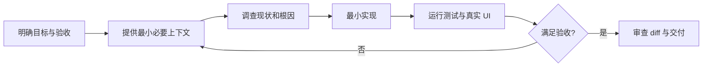

# AI 编程基础（02） - AI 编程工作闭环

> AI 编程不是“描述需求后接受代码”，而是目标、上下文、权限、执行反馈和验收证据组成的受控循环。

## 一、最小循环



一次任务只解决一个可独立验证的问题。大需求先拆里程碑，要求 Agent 在修改前复述目标、范围、非目标和完成条件。Bug 必须先复现和定位根因，不能用“可能是”直接进入编辑。

## 二、上下文与权限

常驻上下文放仓库规则、架构边界和验证命令；任务上下文放需求、复现、相关入口和当前 diff；日志、网页和历史实现按需读取。上下文越多不等于越好，过期和无关信息会稀释约束。

权限遵循最小化：先只读调查，确认方案后开放目标目录写入和必要测试命令。推送、合并、发布、删库和外部消息属于额外动作，需要明确授权与可恢复方案。

## 三、反馈必须来自真实系统

- 代码层：类型检查、单测、集成测试、Lint 和构建。
- UI 层：真实浏览器中的布局、交互、控制台和网络请求。
- 数据层：写入、读取、刷新、并发和权限分别验证。
- 交付层：检查 diff 范围、提交 SHA、CI 与部署版本。

“命令退出码为 0”只证明该命令通过；不能据此推断用户流程、线上部署或数据迁移已经成功。

## 四、任务 Prompt 模板

```text
目标：用户可观察到的结果。
范围：允许读取和修改的项目、目录与模块。
非目标：本次明确不做什么。
事实：复现步骤、错误、入口和已知约束。
过程：先调查根因，再给最小方案，然后实现。
验收：必须运行的测试、浏览器路径和结果证据。
交付：改动摘要、验证结果、未验证边界和风险。
```

## 五、失败模式

- 一次要求生成整个系统，导致 Agent 无法保持一致模型。
- 用猜测替代仓库搜索和运行证据，修到症状而非根因。
- 把所有权限一次开放，扩大误删和泄密半径。
- 只让产出者自我审查，没有独立测试、Diff 和人工判断。
- 宣布“完成”时没有新鲜验证结果或仍有运行中的任务。

## 六、验收

找一个真实小缺陷，保存修复前复现、根因证据、最小 diff、相关测试和修复后用户路径。任何一项无法复现，都应标记为未验证，而不是补写结论。

## 参考资料

- [OpenAI Codex 文档](https://developers.openai.com/codex/)
- [GitHub Copilot 负责任使用](https://docs.github.com/en/copilot/responsible-use)
