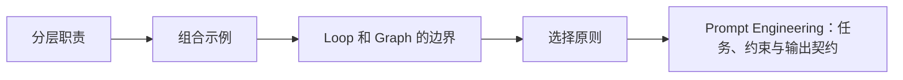

# AI 编程基础（05） - Prompt、Context、Harness、Loop 与 Graph 工程

> 读完后，你应能完成以下任务：
> - 绘制“AI 编程基础（05） - Prompt、Context、Harness、Loop 与 Graph 工程 / 分层职责”的关键对象与数据流，解释“Prompt 决定模型收到什么指令；”，并用源码位置、日志或 Trace 标注证据。
> - 为“AI 编程基础（05） - Prompt、Context、Harness、Loop 与 Graph 工程 / 组合示例”设计正常与异常输入，验证“遇到“复现 → 修复 → 测试 → 审查”的固定阶段时，再用 Graph 保证顺序和失败回退。”，输出首个偏差位置与回归测试结果。
> - 实现“AI 编程基础（05） - Prompt、Context、Harness、Loop 与 Graph 工程 / Loop 和 Graph 的边界”的最小代码或配置，检验“但“再跑一次”本身不是工程，”，输出命令、结果与 Diff，并说明不适用边界。

> 五类工程解决不同问题：指令表达、信息供给、运行支架、执行循环和状态编排不能混成一个“超级 Prompt”。


## 核心知识清单

- Prompt Engineering：任务、约束与输出契约
- Context Engineering：相关事实、工具结果与预算
- Harness Engineering：工具、权限、沙盒与生命周期
- Loop Engineering：观察、行动、停止与恢复
- Graph Engineering：显式状态、分支、并行与人工审批
- Vibe Coding 与 Agentic Engineering 的边界

<!-- article-progressive-block:start -->
# 一、先建立全局：Prompt、Context、Harness、Loop 与 Graph 工程 是什么？

理解“Prompt、Context、Harness、Loop 与 Graph 工程”，先要把标题中的对象放进同一条处理链：它接收什么输入，经过哪些状态变化，最终用什么证据判断结果。下表不另造概念，只把作者正文已经解释的章节按依赖顺序连起来。

“Prompt、Context、Harness、Loop 与 Graph 工程”的第一个核心判断是：Prompt 决定模型收到什么指令；。先弄清这个判断中的对象和输入输出，后面的实现、故障和验收才有共同语境。

| 顺序 | 章节 | 读完本节应抓住的结论 |
| --- | --- | --- |
| 1 | 分层职责 | Prompt 决定模型收到什么指令； |
| 2 | 组合示例 | 遇到“复现 → 修复 → 测试 → 审查”的固定阶段时，再用 Graph 保证顺序和失败回退。 |
| 3 | Loop 和 Graph 的边界 | 但“再跑一次”本身不是工程， |
| 4 | 选择原则 | 规则表达不清：改 Prompt。 |
| 5 | Prompt Engineering：任务、约束与输出契约 | 五类工程解决不同问题：指令表达、信息供给、运行支架、执行循环和状态编排不能混成一个“超级 Prompt”。 |
| 6 | Context Engineering：相关事实、工具结果与预算 | Context 决定模型看见哪些事实； |

## 1.1 核心对象之间怎样衔接



这张图只表达本文的讲解顺序，不替代正文机制。判断“Prompt、Context、Harness、Loop 与 Graph 工程”是否真正掌握，需要能从最后一个结果沿图回到前面每个章节的输入、状态变化和证据。

## 1.2 再看失败：问题最早会出现在哪一步？

在“Prompt、Context、Harness、Loop 与 Graph 工程”的对象和顺序已经明确后，再看可观察的失败：数据泄漏、只报均分、裁判未校准或样本不可追溯。定位时不从最后一条错误猜原因，而是沿上图找第一个偏离正文结论的节点。
<!-- article-progressive-block:end -->

# 二、分层职责

Prompt 决定模型收到什么指令；
Context 决定模型看见哪些事实；
Harness 决定模型能调用什么以及调用前后如何治理；
Loop 驱动“模型 → 工具 → 观察”的重复过程；
Graph 把复杂工作流的状态和路由写入代码。
选错层会产生典型反模式，
例如用 Prompt 要求“绝不删错文件”，
却不给文件工具设置路径边界。

# 三、组合示例

代码修复 Agent 用 Prompt 声明目标和完成条件，
用搜索结果和测试日志构建 Context；
Harness 提供只读搜索、受控编辑和命令超时；
Loop 在每次工具结果后重新决策；
遇到“复现 → 修复 → 测试 → 审查”的固定阶段时，再用 Graph 保证顺序和失败回退。

# 四、Loop 和 Graph 的边界

Loop 解决“下一轮根据什么证据继续”：每轮要保存状态、比较进展、消耗预算，
并明确成功、无进展、阻塞和人工接管。
Ralph 类实现可以用新的 Agent 会话反复读取同一规格，
但“再跑一次”本身不是工程，
只有外部状态、确定性验证和终止策略齐全才是。

Graph 解决“流程现在位于哪个阶段、接下来允许走哪条边”：节点执行业务或一个局部 Loop，
边根据状态路由，
Checkpointer 负责恢复。
流程只有线性两三步时不要先上 Graph；
当存在并行、回退、人工审批、长时暂停或审计要求时，显式状态图才开始产生净收益。

`loop-me` 是把重复活动访谈成 workflow spec 的实验性 Skill，
不是执行引擎；
Claude `/loop` 是定时重复命令，
也不是 Loop Engineering 的同义词。
三者要分开理解。

# 五、选择原则

- 规则表达不清：改 Prompt。
- 缺少事实或上下文过载：改 Context。
- 权限、工具或观测不足：改 Harness。
- 循环不停止、重复调用：改 Loop。
- 分支、并行、审批难以维护：改 Graph。

<!-- article-progressive-block:start -->
# 六、动手验证：先跑通 Prompt、Context、Harness、Loop 与 Graph 工程，再改变一个变量

前面的章节已经建立问题、概念和机制。现在把“Prompt、Context、Harness、Loop 与 Graph 工程”放进同一套基线中运行；本节不再引入新术语，只验证前文结论能否被复现。

## 6.1 基线与候选只允许一个变量不同

验证“Prompt、Context、Harness、Loop 与 Graph 工程”时，先固定版本化数据集、切分规则、基线、Rubric、随机参数。候选方案只能改变本次要验证的变量；如果同时更换数据、依赖和配置，即使结果改善，也不能知道是哪一项产生作用。

执行“Prompt、Context、Harness、Loop 与 Graph 工程”时，动作是：同输入比较基线与候选的能力、安全、延迟和成本。原始结果不能只保留截图或汇总分数，必须同步保存：逐样本输出、评分理由、置信区间、失败标签、版本，使下一次复查可以在同一输入上重放。

| 实验要素 | 本文要求 |
| --- | --- |
| 固定条件 | 版本化数据集、切分规则、基线、Rubric、随机参数 |
| 唯一变量 | 本次候选方案与基线之间的一项明确差异 |
| 原始证据 | 逐样本输出、评分理由、置信区间、失败标签、版本 |
| 通过阈值 | 目标指标改善，通用能力与安全集不越过回退阈值 |
| 立即停止 | 数据泄漏、只报均分、裁判未校准或样本不可追溯 |

## 6.2 执行前先排除不可比较条件

“Prompt、Context、Harness、Loop 与 Graph 工程”开始前先确认下面四项；任一项不成立，都应先修复实验条件，而不是解释结果。

- 基线能够在“Prompt、Context、Harness、Loop 与 Graph 工程”的当前环境重复运行。
- 候选只改变一个与“Prompt、Context、Harness、Loop 与 Graph 工程”结论直接相关的条件。
- “Prompt、Context、Harness、Loop 与 Graph 工程”的基线和候选使用同一批输入、同一版本依赖与同一通过阈值。
- “Prompt、Context、Harness、Loop 与 Graph 工程”的原始输出和失败现场不会被重试、格式化或汇总覆盖。

## 6.3 执行后先核对证据完整性

结果出来后先检查证据，再讨论“Prompt、Context、Harness、Loop 与 Graph 工程”是否通过。缺少中间状态时，最终输出只能说明现象，不能证明机制。

| 检查项 | 当前文章的判定 |
| --- | --- |
| 输入可追溯 | 版本化数据集、切分规则、基线、Rubric、随机参数 |
| 过程可回放 | 同输入比较基线与候选的能力、安全、延迟和成本 |
| 结果可审计 | 逐样本输出、评分理由、置信区间、失败标签、版本 |

“Prompt、Context、Harness、Loop 与 Graph 工程”的一次合格基线对照按以下顺序执行：

1. 保存“Prompt、Context、Harness、Loop 与 Graph 工程”基线版本及输入摘要，确认基线本身可以重复运行。
2. 写下“Prompt、Context、Harness、Loop 与 Graph 工程”候选方案唯一变化的变量，以及它预期影响的指标。
3. 在同一环境执行“Prompt、Context、Harness、Loop 与 Graph 工程”：同输入比较基线与候选的能力、安全、延迟和成本。
4. 为“Prompt、Context、Harness、Loop 与 Graph 工程”保存：逐样本输出、评分理由、置信区间、失败标签、版本。
5. 使用“Prompt、Context、Harness、Loop 与 Graph 工程”预登记条件判断：目标指标改善，通用能力与安全集不越过回退阈值。
6. 如果“Prompt、Context、Harness、Loop 与 Graph 工程”未通过，不修改第二个变量，先恢复基线并保留失败现场。

# 七、用一张矩阵验证 Prompt、Context、Harness、Loop 与 Graph 工程 的关键结论

矩阵按正文顺序列出“Prompt、Context、Harness、Loop 与 Graph 工程”的结论。一次实验只选择一行，只改变这一行对应的条件；不要把多行合并成一个无法归因的大实验。

| 正文章节 | 已解释的结论 | 本轮唯一变量 | 必须保存的证据 |
| --- | --- | --- | --- |
| 分层职责 | Prompt 决定模型收到什么指令； | 只改变与“分层职责”相关的条件 | 逐样本输出、评分理由、置信区间、失败标签、版本 |
| 组合示例 | 遇到“复现 → 修复 → 测试 → 审查”的固定阶段时，再用 Graph 保证顺序和失败回退。 | 只改变与“组合示例”相关的条件 | 逐样本输出、评分理由、置信区间、失败标签、版本 |
| Loop 和 Graph 的边界 | 但“再跑一次”本身不是工程， | 只改变与“Loop 和 Graph 的边界”相关的条件 | 逐样本输出、评分理由、置信区间、失败标签、版本 |
| 选择原则 | 规则表达不清：改 Prompt。 | 只改变与“选择原则”相关的条件 | 逐样本输出、评分理由、置信区间、失败标签、版本 |
| Prompt Engineering：任务、约束与输出契约 | 五类工程解决不同问题：指令表达、信息供给、运行支架、执行循环和状态编排不能混成一个“超级 Prompt”。 | 只改变与“Prompt Engineering：任务、约束与输出契约”相关的条件 | 逐样本输出、评分理由、置信区间、失败标签、版本 |
| Context Engineering：相关事实、工具结果与预算 | Context 决定模型看见哪些事实； | 只改变与“Context Engineering：相关事实、工具结果与预算”相关的条件 | 逐样本输出、评分理由、置信区间、失败标签、版本 |

## 7.1 记录本次实际实验

下面的记录用于“Prompt、Context、Harness、Loop 与 Graph 工程”当前这一次实验，不是第二套知识目录。先从矩阵选择一个章节，再填写实际值；没有填写的字段表示尚未验证。

```yaml
topic: "Prompt、Context、Harness、Loop 与 Graph 工程"
selected_chapter: required
claim_from_article: required
baseline_version: required
changed_condition: exactly_one
execution: "同输入比较基线与候选的能力、安全、延迟和成本"
evidence: "逐样本输出、评分理由、置信区间、失败标签、版本"
pass_when: "目标指标改善，通用能力与安全集不越过回退阈值"
stop_when: "数据泄漏、只报均分、裁判未校准或样本不可追溯"
observed_result: required
first_deviation: null_or_evidence
recovery_replay: required_after_failure
```

## 7.2 边界实验必须证明能够停止和恢复

成功路径只能证明“Prompt、Context、Harness、Loop 与 Graph 工程”在当前样本上工作，不能证明它可以进入生产。边界实验需要主动制造：数据泄漏、只报均分、裁判未校准或样本不可追溯，并观察系统是否在产生不可逆副作用前停止。

| 场景 | 只改变什么 | 应保存什么 | 通过标准 |
| --- | --- | --- | --- |
| 正常路径 | 使用已知有效输入 | 逐样本输出、评分理由、置信区间、失败标签、版本 | 目标指标改善，通用能力与安全集不越过回退阈值 |
| 边界路径 | 把一个输入推进到约束临界值 | 临界值前后的输出与指标 | 不静默降级，不把部分结果冒充成功 |
| 明确失败 | 注入：数据泄漏、只报均分、裁判未校准或样本不可追溯 | 原始错误、首个异常阶段和最终状态 | 失败被正确分类且没有扩大副作用 |
| 恢复重放 | 执行：保留基线，隔离失败样本，定位数据、提示、模型或裁判 | 原失败样本的复测证据 | 原样本恢复，正常样本没有回归 |

恢复动作不是简单重启。对于“Prompt、Context、Harness、Loop 与 Graph 工程”，第一步是：保留基线，隔离失败样本，定位数据、提示、模型或裁判。完成后使用原始失败样本复测；只验证一个新样本成功，不能证明触发条件已经消失。

“Prompt、Context、Harness、Loop 与 Graph 工程”边界实验结束后，应把正常、临界、失败和恢复四类记录放在同一个运行批次中。这样才能区分“候选方案真的修复问题”和“环境变化让问题暂时没有出现”。

# 八、Prompt、Context、Harness、Loop 与 Graph 工程 的结果解释

解释“Prompt、Context、Harness、Loop 与 Graph 工程”实验时先看首个偏差，而不是最后一条错误。最后的异常通常只是上游状态错误的结果；从末端反推容易误把症状当根因。

| 观察结果 | 可以支持的判断 | 下一步 |
| --- | --- | --- |
| 主链路没有达到预期 | 数据泄漏、只报均分、裁判未校准或样本不可追溯 | 先执行：保留基线，隔离失败样本，定位数据、提示、模型或裁判 |
| 异常链路无法恢复 | 数据泄漏、只报均分、裁判未校准或样本不可追溯 | 先执行：保留基线，隔离失败样本，定位数据、提示、模型或裁判 |
| 新样本成功但原样本仍失败 | 修复没有覆盖原始触发条件 | 固定原失败输入，恢复基线后重新比较 |
| 指标改善但证据无法回链 | 数据、版本或中间状态没有固定 | 暂停发布，补齐可追溯记录后重跑 |

“Prompt、Context、Harness、Loop 与 Graph 工程”只有同时满足“目标指标改善，通用能力与安全集不越过回退阈值”，并且没有出现“数据泄漏、只报均分、裁判未校准或样本不可追溯”，才可以认为主链路通过。这里的“通过”只对当前固定版本、样本和环境有效，不能外推到尚未测试的容量、权限或数据分布。

如果“Prompt、Context、Harness、Loop 与 Graph 工程”候选方案与基线差异很小，先检查证据分辨率是否足够；如果差异很大，先排除数据泄漏、环境漂移和版本不一致。两种情况都不能只看一个汇总均值，需要回到逐样本输出和中间状态。

“Prompt、Context、Harness、Loop 与 Graph 工程”故障定位完成后，记录“现象、首个偏差、根因、改动、原样本复测”五项。缺少原样本复测时，只能标记为待观察，不能标记为已解决。

# 九、Prompt、Context、Harness、Loop 与 Graph 工程 的发布判断

发布判断需要把“Prompt、Context、Harness、Loop 与 Graph 工程”的质量、失败边界和恢复能力放在同一份记录中。以下任一条件缺失，都应停止扩量，而不是用“基本正常”替代证据。

- [ ] “Prompt、Context、Harness、Loop 与 Graph 工程”的基线与候选只存在一个计划内变量。
- [ ] “Prompt、Context、Harness、Loop 与 Graph 工程”的输入、代码、依赖、配置和数据版本可以追溯。
- [ ] “Prompt、Context、Harness、Loop 与 Graph 工程”的正常、临界、失败和恢复样本使用同一套断言。
- [ ] “Prompt、Context、Harness、Loop 与 Graph 工程”的原始输出、中间状态和失败现场已经保留。
- [ ] “Prompt、Context、Harness、Loop 与 Graph 工程”的日志、Trace、截图和测试数据已经脱敏。
- [ ] “Prompt、Context、Harness、Loop 与 Graph 工程”的停止条件、负责人和回滚入口已经演练。
- [ ] “Prompt、Context、Harness、Loop 与 Graph 工程”尚未覆盖的输入、权限、容量和外部依赖已经登记。

最终记录至少包含基线版本、唯一变量、原始证据、首个偏差、恢复复测和发布责任人。没有参与本次修改的人如果不能据此重放“Prompt、Context、Harness、Loop 与 Graph 工程”的判断，就不能发布。
<!-- article-progressive-block:end -->

# 十、总结

- **分层职责**：Prompt 决定模型收到什么指令；
- **组合示例**：遇到“复现 → 修复 → 测试 → 审查”的固定阶段时，再用 Graph 保证顺序和失败回退。
- **Loop 和 Graph 的边界**：Ralph 类实现可以用新的 Agent 会话反复读取同一规格，但“再跑一次”本身不是工程，只有外部状态、确定性验证和终止策略齐全才是。
- **选择原则**：规则表达不清：改 Prompt。

## 参考资料

- [OpenAI Agents SDK](https://openai.github.io/openai-agents-python/)
- [LangGraph Workflows and Agents](https://docs.langchain.com/oss/python/langgraph/workflows-agents)
- [loop-me](https://github.com/mattpocock/skills/tree/main/skills/in-progress/loop-me)
