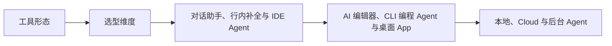

# AI 编程基础（07） - AI 编程工具形态、选型与任务匹配

> 读完后，你应能完成以下任务：
> - 绘制“AI 编程基础（07） - AI 编程工具形态、选型与任务匹配 / 工具形态”的关键对象与数据流，解释“行内补全适合局部表达和重复代码；”，并用源码位置、日志或 Trace 标注证据。
> - 为“AI 编程基础（07） - AI 编程工具形态、选型与任务匹配 / 选型维度”设计正常与异常输入，验证“复杂任务常采用组合：IDE 做局部编辑，CLI Agent 做仓库级实施，Cloud Agent 处理独立批次，主任务统一审查和验收。”，输出首个偏差位置与回归测试结果。
> - 实现“AI 编程基础（07） - AI 编程工具形态、选型与任务匹配 / 补充结论 1”的最小代码或配置，检验“AI 编程工具的差异不只是模型。”，输出命令、结果与 Diff，并说明不适用边界。

> AI 编程工具的差异不只是模型。上下文范围、执行能力、权限边界、交互方式和可验证性决定它适合什么任务。


## 核心知识清单

- 对话助手、行内补全与 IDE Agent
- AI 编辑器、CLI 编程 Agent 与桌面 App
- 本地、Cloud 与后台 Agent
- 零代码/低代码平台的适用边界
- 上下文范围、执行权限与工作区隔离
- 交互延迟、任务时长、成本与审查方式
- IDE、CLI、App 与 Cloud 的组合工作流

<!-- article-progressive-block:start -->
# 一、先建立全局：AI 编程工具形态、选型与任务匹配 是什么？

理解“AI 编程工具形态、选型与任务匹配”，先要把标题中的对象放进同一条处理链：它接收什么输入，经过哪些状态变化，最终用什么证据判断结果。下表不另造概念，只把作者正文已经解释的章节按依赖顺序连起来。

“AI 编程工具形态、选型与任务匹配”的第一个核心判断是：行内补全适合局部表达和重复代码；。先弄清这个判断中的对象和输入输出，后面的实现、故障和验收才有共同语境。

| 顺序 | 章节 | 读完本节应抓住的结论 |
| --- | --- | --- |
| 1 | 工具形态 | 行内补全适合局部表达和重复代码； |
| 2 | 选型维度 | 任务可以隔离且验收标准明确时，才适合交给 Cloud Agent 异步执行。 |
| 3 | 对话助手、行内补全与 IDE Agent | 行内补全适合局部表达和重复代码； |
| 4 | AI 编辑器、CLI 编程 Agent 与桌面 App | AI 编程工具的差异不只是模型。 |
| 5 | 本地、Cloud 与后台 Agent | Cloud/后台 Agent 适合可隔离、可异步、验收条件明确的长任务。 |
| 6 | 上下文范围、执行权限与工作区隔离 | 上下文范围、执行能力、权限边界、交互方式和可验证性决定它适合什么任务。 |

## 1.1 核心对象之间怎样衔接



这张图只表达本文的讲解顺序，不替代正文机制。判断“AI 编程工具形态、选型与任务匹配”是否真正掌握，需要能从最后一个结果沿图回到前面每个章节的输入、状态变化和证据。

## 1.2 再看失败：问题最早会出现在哪一步？

在“AI 编程工具形态、选型与任务匹配”的对象和顺序已经明确后，再看可观察的失败：文本直通执行、状态不可重放或重试重复写入。定位时不从最后一条错误猜原因，而是沿上图找第一个偏离正文结论的节点。
<!-- article-progressive-block:end -->

# 二、工具形态

行内补全适合局部表达和重复代码；
对话助手适合解释、方案比较和不直接执行的分析；
IDE Agent 能结合当前文件和诊断做小到中型修改；
CLI Agent 适合仓库搜索、命令、测试和自动化；
桌面 App 适合多任务、Worktree 和浏览器验收；
Cloud/后台 Agent 适合可隔离、可异步、验收条件明确的长任务。

低代码平台如 Dify 更适合快速验证 AI 工作流和运营配置，
不适合替代复杂仓库开发、细粒度权限和特定工程约束。

# 三、选型维度

选型先看任务需要覆盖的上下文和允许产生的副作用。
只修改当前函数且需要即时补全时，行内补全的交互成本最低；
需要跨文件搜索、执行测试和提交 Diff 时，
CLI 或 IDE Agent 才能形成完整证据链；
任务可以隔离且验收标准明确时，才适合交给 Cloud Agent 异步执行。

第二个判断维度是控制权。
涉及生产数据、密钥、发布或不可逆写操作时，
工具必须支持最小权限、人工确认、隔离工作区和操作审计。
模型能力更强并不能抵消权限边界缺失，
无法限制资源范围或无法重放执行记录的工具不应承担高风险任务。

1. 任务需要看到一个函数、一个仓库还是外部系统？
2. 是否需要运行命令、浏览器、数据库或发布动作？
3. 改动能否在隔离工作区完成，是否涉及敏感数据？
4. 需要人持续交互，还是可以后台执行后提交证据？
5. 验收是编译、测试、截图、基准任务还是人工业务判断？

复杂任务常采用组合：IDE 做局部编辑，
CLI Agent 做仓库级实施，
Cloud Agent 处理独立批次，
主任务统一审查和验收。
不要让多个 Agent 同时修改同一文件而没有所有权协议。

<!-- article-progressive-block:start -->
# 四、动手验证：先跑通 AI 编程工具形态、选型与任务匹配，再改变一个变量

前面的章节已经建立问题、概念和机制。现在把“AI 编程工具形态、选型与任务匹配”放进同一套基线中运行；本节不再引入新术语，只验证前文结论能否被复现。

## 4.1 基线与候选只允许一个变量不同

验证“AI 编程工具形态、选型与任务匹配”时，先固定工具 Schema、身份、畸形参数、超时和重复请求。候选方案只能改变本次要验证的变量；如果同时更换数据、依赖和配置，即使结果改善，也不能知道是哪一项产生作用。

执行“AI 编程工具形态、选型与任务匹配”时，动作是：回放决策到执行链路，覆盖失败、重试、暂停和恢复。原始结果不能只保留截图或汇总分数，必须同步保存：模型提议、校验、授权、幂等键、状态迁移、Trace，使下一次复查可以在同一输入上重放。

| 实验要素 | 本文要求 |
| --- | --- |
| 固定条件 | 工具 Schema、身份、畸形参数、超时和重复请求 |
| 唯一变量 | 本次候选方案与基线之间的一项明确差异 |
| 原始证据 | 模型提议、校验、授权、幂等键、状态迁移、Trace |
| 通过阈值 | 模型只提议；执行受代码约束；失败不重复副作用 |
| 立即停止 | 文本直通执行、状态不可重放或重试重复写入 |

## 4.2 执行前先排除不可比较条件

“AI 编程工具形态、选型与任务匹配”开始前先确认下面四项；任一项不成立，都应先修复实验条件，而不是解释结果。

- 基线能够在“AI 编程工具形态、选型与任务匹配”的当前环境重复运行。
- 候选只改变一个与“AI 编程工具形态、选型与任务匹配”结论直接相关的条件。
- “AI 编程工具形态、选型与任务匹配”的基线和候选使用同一批输入、同一版本依赖与同一通过阈值。
- “AI 编程工具形态、选型与任务匹配”的原始输出和失败现场不会被重试、格式化或汇总覆盖。

## 4.3 执行后先核对证据完整性

结果出来后先检查证据，再讨论“AI 编程工具形态、选型与任务匹配”是否通过。缺少中间状态时，最终输出只能说明现象，不能证明机制。

| 检查项 | 当前文章的判定 |
| --- | --- |
| 输入可追溯 | 工具 Schema、身份、畸形参数、超时和重复请求 |
| 过程可回放 | 回放决策到执行链路，覆盖失败、重试、暂停和恢复 |
| 结果可审计 | 模型提议、校验、授权、幂等键、状态迁移、Trace |

“AI 编程工具形态、选型与任务匹配”的一次合格基线对照按以下顺序执行：

1. 保存“AI 编程工具形态、选型与任务匹配”基线版本及输入摘要，确认基线本身可以重复运行。
2. 写下“AI 编程工具形态、选型与任务匹配”候选方案唯一变化的变量，以及它预期影响的指标。
3. 在同一环境执行“AI 编程工具形态、选型与任务匹配”：回放决策到执行链路，覆盖失败、重试、暂停和恢复。
4. 为“AI 编程工具形态、选型与任务匹配”保存：模型提议、校验、授权、幂等键、状态迁移、Trace。
5. 使用“AI 编程工具形态、选型与任务匹配”预登记条件判断：模型只提议；执行受代码约束；失败不重复副作用。
6. 如果“AI 编程工具形态、选型与任务匹配”未通过，不修改第二个变量，先恢复基线并保留失败现场。

# 五、用一张矩阵验证 AI 编程工具形态、选型与任务匹配 的关键结论

矩阵按正文顺序列出“AI 编程工具形态、选型与任务匹配”的结论。一次实验只选择一行，只改变这一行对应的条件；不要把多行合并成一个无法归因的大实验。

| 正文章节 | 已解释的结论 | 本轮唯一变量 | 必须保存的证据 |
| --- | --- | --- | --- |
| 工具形态 | 行内补全适合局部表达和重复代码； | 只改变与“工具形态”相关的条件 | 模型提议、校验、授权、幂等键、状态迁移、Trace |
| 选型维度 | 任务可以隔离且验收标准明确时，才适合交给 Cloud Agent 异步执行。 | 只改变与“选型维度”相关的条件 | 模型提议、校验、授权、幂等键、状态迁移、Trace |
| 对话助手、行内补全与 IDE Agent | 行内补全适合局部表达和重复代码； | 只改变与“对话助手、行内补全与 IDE Agent”相关的条件 | 模型提议、校验、授权、幂等键、状态迁移、Trace |
| AI 编辑器、CLI 编程 Agent 与桌面 App | AI 编程工具的差异不只是模型。 | 只改变与“AI 编辑器、CLI 编程 Agent 与桌面 App”相关的条件 | 模型提议、校验、授权、幂等键、状态迁移、Trace |
| 本地、Cloud 与后台 Agent | Cloud/后台 Agent 适合可隔离、可异步、验收条件明确的长任务。 | 只改变与“本地、Cloud 与后台 Agent”相关的条件 | 模型提议、校验、授权、幂等键、状态迁移、Trace |
| 上下文范围、执行权限与工作区隔离 | 上下文范围、执行能力、权限边界、交互方式和可验证性决定它适合什么任务。 | 只改变与“上下文范围、执行权限与工作区隔离”相关的条件 | 模型提议、校验、授权、幂等键、状态迁移、Trace |

## 5.1 记录本次实际实验

下面的记录用于“AI 编程工具形态、选型与任务匹配”当前这一次实验，不是第二套知识目录。先从矩阵选择一个章节，再填写实际值；没有填写的字段表示尚未验证。

```yaml
topic: "AI 编程工具形态、选型与任务匹配"
selected_chapter: required
claim_from_article: required
baseline_version: required
changed_condition: exactly_one
execution: "回放决策到执行链路，覆盖失败、重试、暂停和恢复"
evidence: "模型提议、校验、授权、幂等键、状态迁移、Trace"
pass_when: "模型只提议；执行受代码约束；失败不重复副作用"
stop_when: "文本直通执行、状态不可重放或重试重复写入"
observed_result: required
first_deviation: null_or_evidence
recovery_replay: required_after_failure
```

## 5.2 边界实验必须证明能够停止和恢复

成功路径只能证明“AI 编程工具形态、选型与任务匹配”在当前样本上工作，不能证明它可以进入生产。边界实验需要主动制造：文本直通执行、状态不可重放或重试重复写入，并观察系统是否在产生不可逆副作用前停止。

| 场景 | 只改变什么 | 应保存什么 | 通过标准 |
| --- | --- | --- | --- |
| 正常路径 | 使用已知有效输入 | 模型提议、校验、授权、幂等键、状态迁移、Trace | 模型只提议；执行受代码约束；失败不重复副作用 |
| 边界路径 | 把一个输入推进到约束临界值 | 临界值前后的输出与指标 | 不静默降级，不把部分结果冒充成功 |
| 明确失败 | 注入：文本直通执行、状态不可重放或重试重复写入 | 原始错误、首个异常阶段和最终状态 | 失败被正确分类且没有扩大副作用 |
| 恢复重放 | 执行：关闭副作用入口，恢复检查点，补充失败契约测试 | 原失败样本的复测证据 | 原样本恢复，正常样本没有回归 |

恢复动作不是简单重启。对于“AI 编程工具形态、选型与任务匹配”，第一步是：关闭副作用入口，恢复检查点，补充失败契约测试。完成后使用原始失败样本复测；只验证一个新样本成功，不能证明触发条件已经消失。

“AI 编程工具形态、选型与任务匹配”边界实验结束后，应把正常、临界、失败和恢复四类记录放在同一个运行批次中。这样才能区分“候选方案真的修复问题”和“环境变化让问题暂时没有出现”。

# 六、AI 编程工具形态、选型与任务匹配 的结果解释

解释“AI 编程工具形态、选型与任务匹配”实验时先看首个偏差，而不是最后一条错误。最后的异常通常只是上游状态错误的结果；从末端反推容易误把症状当根因。

| 观察结果 | 可以支持的判断 | 下一步 |
| --- | --- | --- |
| 主链路没有达到预期 | 文本直通执行、状态不可重放或重试重复写入 | 先执行：关闭副作用入口，恢复检查点，补充失败契约测试 |
| 异常链路无法恢复 | 文本直通执行、状态不可重放或重试重复写入 | 先执行：关闭副作用入口，恢复检查点，补充失败契约测试 |
| 新样本成功但原样本仍失败 | 修复没有覆盖原始触发条件 | 固定原失败输入，恢复基线后重新比较 |
| 指标改善但证据无法回链 | 数据、版本或中间状态没有固定 | 暂停发布，补齐可追溯记录后重跑 |

“AI 编程工具形态、选型与任务匹配”只有同时满足“模型只提议；执行受代码约束；失败不重复副作用”，并且没有出现“文本直通执行、状态不可重放或重试重复写入”，才可以认为主链路通过。这里的“通过”只对当前固定版本、样本和环境有效，不能外推到尚未测试的容量、权限或数据分布。

如果“AI 编程工具形态、选型与任务匹配”候选方案与基线差异很小，先检查证据分辨率是否足够；如果差异很大，先排除数据泄漏、环境漂移和版本不一致。两种情况都不能只看一个汇总均值，需要回到逐样本输出和中间状态。

“AI 编程工具形态、选型与任务匹配”故障定位完成后，记录“现象、首个偏差、根因、改动、原样本复测”五项。缺少原样本复测时，只能标记为待观察，不能标记为已解决。

# 七、AI 编程工具形态、选型与任务匹配 的发布判断

发布判断需要把“AI 编程工具形态、选型与任务匹配”的质量、失败边界和恢复能力放在同一份记录中。以下任一条件缺失，都应停止扩量，而不是用“基本正常”替代证据。

- [ ] “AI 编程工具形态、选型与任务匹配”的基线与候选只存在一个计划内变量。
- [ ] “AI 编程工具形态、选型与任务匹配”的输入、代码、依赖、配置和数据版本可以追溯。
- [ ] “AI 编程工具形态、选型与任务匹配”的正常、临界、失败和恢复样本使用同一套断言。
- [ ] “AI 编程工具形态、选型与任务匹配”的原始输出、中间状态和失败现场已经保留。
- [ ] “AI 编程工具形态、选型与任务匹配”的日志、Trace、截图和测试数据已经脱敏。
- [ ] “AI 编程工具形态、选型与任务匹配”的停止条件、负责人和回滚入口已经演练。
- [ ] “AI 编程工具形态、选型与任务匹配”尚未覆盖的输入、权限、容量和外部依赖已经登记。

最终记录至少包含基线版本、唯一变量、原始证据、首个偏差、恢复复测和发布责任人。没有参与本次修改的人如果不能据此重放“AI 编程工具形态、选型与任务匹配”的判断，就不能发布。
<!-- article-progressive-block:end -->

# 八、总结

- **工具形态**：行内补全适合局部表达和重复代码；
- **选型维度**：任务需要看到一个函数、一个仓库还是外部系统？ -> 是否需要运行命令、浏览器、数据库或发布动作？ -> 改动能否在隔离工作区完成，是否涉及敏感数据？ -> 需要人持续交互，还是可以后台执行后提交证据？
- **AI 编辑器、CLI 编程 Agent 与桌面 App**：AI 编程工具的差异不只是模型。
- **本地、Cloud 与后台 Agent**：Cloud/后台 Agent 适合可隔离、可异步、验收条件明确的长任务。
- **上下文范围、执行权限与工作区隔离**：上下文范围、执行能力、权限边界、交互方式和可验证性决定它适合什么任务。
- **IDE、CLI、App 与 Cloud 的组合工作流**：CLI Agent 适合仓库搜索、命令、测试和自动化；

## 参考资料

- [OpenAI Codex](https://developers.openai.com/codex/)
- [GitHub Copilot Features](https://docs.github.com/en/copilot/get-started/features)
- [Claude Code Overview](https://docs.anthropic.com/en/docs/claude-code/overview)
- [Dify Documentation](https://docs.dify.ai/)
