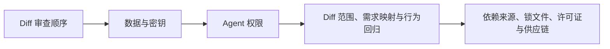

# AI 编程基础（08） - AI 代码审查、依赖安全与密钥治理

> 读完后，你应能完成以下任务：
> - 绘制“AI 编程基础（08） - AI 代码审查、依赖安全与密钥治理 / Diff 审查顺序”的关键对象与数据流，解释“先确认改动文件是否超出任务范围，再从入口追踪到状态、持久化和渲染；”，并用源码位置、日志或 Trace 标注证据。
> - 为“AI 编程基础（08） - AI 代码审查、依赖安全与密钥治理 / 数据与密钥”设计正常与异常输入，验证“密钥通过环境或 Secret Manager 注入，日志只保留必要标识和脱敏摘要。”，输出首个偏差位置与回归测试结果。
> - 实现“AI 编程基础（08） - AI 代码审查、依赖安全与密钥治理 / Agent 权限”的最小代码或配置，检验“仓库文档、Issue、网页和 Tool Result 均视为不可信数据，不能通过 Prompt Injection 改写系统权限。”，输出命令、结果与 Diff，并说明不适用边界。

> AI 能快速生成大量 Diff，也能快速放大不安全假设。审查必须从“代码像不像对”提升到数据流、权限、依赖和验证证据。


## 核心知识清单

- Diff 范围、需求映射与行为回归
- 输入、输出、错误与资源生命周期
- 依赖来源、锁文件、许可证与供应链
- Secret 扫描、日志脱敏与测试数据
- Agent 文件、Shell、网络与外部动作权限
- Prompt Injection 与不可信仓库内容
- SAST、依赖扫描、测试和人工门禁

<!-- article-progressive-block:start -->
# 一、先建立全局：AI 代码审查、依赖安全与密钥治理 是什么？

理解“AI 代码审查、依赖安全与密钥治理”，先要把标题中的对象放进同一条处理链：它接收什么输入，经过哪些状态变化，最终用什么证据判断结果。下表不另造概念，只把作者正文已经解释的章节按依赖顺序连起来。

“AI 代码审查、依赖安全与密钥治理”的第一个核心判断是：先确认改动文件是否超出任务范围，再从入口追踪到状态、持久化和渲染；。先弄清这个判断中的对象和输入输出，后面的实现、故障和验收才有共同语境。

| 顺序 | 章节 | 读完本节应抓住的结论 |
| --- | --- | --- |
| 1 | Diff 审查顺序 | 先确认改动文件是否超出任务范围，再从入口追踪到状态、持久化和渲染； |
| 2 | 数据与密钥 | 密钥通过环境或 Secret Manager 注入，日志只保留必要标识和脱敏摘要。 |
| 3 | Agent 权限 | 不能通过 Prompt Injection 改写系统权限。 |
| 4 | Diff 范围、需求映射与行为回归 | 先确认改动文件是否超出任务范围，再从入口追踪到状态、持久化和渲染； |
| 5 | 依赖来源、锁文件、许可证与供应链 | 锁文件变化要与声明依赖一致，安装脚本和二进制下载属于高风险供应链动作。 |
| 6 | Secret 扫描、日志脱敏与测试数据 | 密钥通过环境或 Secret Manager 注入，日志只保留必要标识和脱敏摘要。 |

## 1.1 核心对象之间怎样衔接



这张图只表达本文的讲解顺序，不替代正文机制。判断“AI 代码审查、依赖安全与密钥治理”是否真正掌握，需要能从最后一个结果沿图回到前面每个章节的输入、状态变化和证据。

## 1.2 再看失败：问题最早会出现在哪一步？

在“AI 代码审查、依赖安全与密钥治理”的对象和顺序已经明确后，再看可观察的失败：Prompt 代替鉴权、越权执行或日志无法追责。定位时不从最后一条错误猜原因，而是沿上图找第一个偏离正文结论的节点。
<!-- article-progressive-block:end -->

# 二、Diff 审查顺序

先确认改动文件是否超出任务范围，再从入口追踪到状态、持久化和渲染；
检查异常路径、并发、取消和清理；
最后看命名和风格。
大量格式化会掩盖真实行为变化，应要求拆分。

AI 新增依赖前核对是否已有能力、包名是否真实、维护状态、许可证和漏洞。
锁文件变化要与声明依赖一致，安装脚本和二进制下载属于高风险供应链动作。

# 三、数据与密钥

仓库、Prompt、日志、截图和测试 Fixture 都可能泄露密钥或个人数据。
密钥通过环境或 Secret Manager 注入，日志只保留必要标识和脱敏摘要。
发现泄漏不能只删除 Git 中的字符串，还要立即轮换凭据并检查使用审计。

# 四、Agent 权限

默认只授予任务需要的目录、命令和网络。
外部消息、发布、数据库写入和删除在参数明确后再审批。
仓库文档、Issue、网页和 Tool Result 均视为不可信数据，
不能通过 Prompt Injection 改写系统权限。

<!-- article-progressive-block:start -->
# 五、动手验证：先跑通 AI 代码审查、依赖安全与密钥治理，再改变一个变量

前面的章节已经建立问题、概念和机制。现在把“AI 代码审查、依赖安全与密钥治理”放进同一套基线中运行；本节不再引入新术语，只验证前文结论能否被复现。

## 5.1 基线与候选只允许一个变量不同

验证“AI 代码审查、依赖安全与密钥治理”时，先固定正常样本、越权身份、恶意参数、注入样本、写操作。候选方案只能改变本次要验证的变量；如果同时更换数据、依赖和配置，即使结果改善，也不能知道是哪一项产生作用。

执行“AI 代码审查、依赖安全与密钥治理”时，动作是：从入口、模型输出和执行层发起对抗测试。原始结果不能只保留截图或汇总分数，必须同步保存：鉴权、参数校验、确认记录、执行日志、审计事件，使下一次复查可以在同一输入上重放。

| 实验要素 | 本文要求 |
| --- | --- |
| 固定条件 | 正常样本、越权身份、恶意参数、注入样本、写操作 |
| 唯一变量 | 本次候选方案与基线之间的一项明确差异 |
| 原始证据 | 鉴权、参数校验、确认记录、执行日志、审计事件 |
| 通过阈值 | 合法请求最小授权；非法请求在副作用前被拒绝 |
| 立即停止 | Prompt 代替鉴权、越权执行或日志无法追责 |

## 5.2 执行前先排除不可比较条件

“AI 代码审查、依赖安全与密钥治理”开始前先确认下面四项；任一项不成立，都应先修复实验条件，而不是解释结果。

- 基线能够在“AI 代码审查、依赖安全与密钥治理”的当前环境重复运行。
- 候选只改变一个与“AI 代码审查、依赖安全与密钥治理”结论直接相关的条件。
- “AI 代码审查、依赖安全与密钥治理”的基线和候选使用同一批输入、同一版本依赖与同一通过阈值。
- “AI 代码审查、依赖安全与密钥治理”的原始输出和失败现场不会被重试、格式化或汇总覆盖。

## 5.3 执行后先核对证据完整性

结果出来后先检查证据，再讨论“AI 代码审查、依赖安全与密钥治理”是否通过。缺少中间状态时，最终输出只能说明现象，不能证明机制。

| 检查项 | 当前文章的判定 |
| --- | --- |
| 输入可追溯 | 正常样本、越权身份、恶意参数、注入样本、写操作 |
| 过程可回放 | 从入口、模型输出和执行层发起对抗测试 |
| 结果可审计 | 鉴权、参数校验、确认记录、执行日志、审计事件 |

“AI 代码审查、依赖安全与密钥治理”的一次合格基线对照按以下顺序执行：

1. 保存“AI 代码审查、依赖安全与密钥治理”基线版本及输入摘要，确认基线本身可以重复运行。
2. 写下“AI 代码审查、依赖安全与密钥治理”候选方案唯一变化的变量，以及它预期影响的指标。
3. 在同一环境执行“AI 代码审查、依赖安全与密钥治理”：从入口、模型输出和执行层发起对抗测试。
4. 为“AI 代码审查、依赖安全与密钥治理”保存：鉴权、参数校验、确认记录、执行日志、审计事件。
5. 使用“AI 代码审查、依赖安全与密钥治理”预登记条件判断：合法请求最小授权；非法请求在副作用前被拒绝。
6. 如果“AI 代码审查、依赖安全与密钥治理”未通过，不修改第二个变量，先恢复基线并保留失败现场。

# 六、用一张矩阵验证 AI 代码审查、依赖安全与密钥治理 的关键结论

矩阵按正文顺序列出“AI 代码审查、依赖安全与密钥治理”的结论。一次实验只选择一行，只改变这一行对应的条件；不要把多行合并成一个无法归因的大实验。

| 正文章节 | 已解释的结论 | 本轮唯一变量 | 必须保存的证据 |
| --- | --- | --- | --- |
| Diff 审查顺序 | 先确认改动文件是否超出任务范围，再从入口追踪到状态、持久化和渲染； | 只改变与“Diff 审查顺序”相关的条件 | 鉴权、参数校验、确认记录、执行日志、审计事件 |
| 数据与密钥 | 密钥通过环境或 Secret Manager 注入，日志只保留必要标识和脱敏摘要。 | 只改变与“数据与密钥”相关的条件 | 鉴权、参数校验、确认记录、执行日志、审计事件 |
| Agent 权限 | 不能通过 Prompt Injection 改写系统权限。 | 只改变与“Agent 权限”相关的条件 | 鉴权、参数校验、确认记录、执行日志、审计事件 |
| Diff 范围、需求映射与行为回归 | 先确认改动文件是否超出任务范围，再从入口追踪到状态、持久化和渲染； | 只改变与“Diff 范围、需求映射与行为回归”相关的条件 | 鉴权、参数校验、确认记录、执行日志、审计事件 |
| 依赖来源、锁文件、许可证与供应链 | 锁文件变化要与声明依赖一致，安装脚本和二进制下载属于高风险供应链动作。 | 只改变与“依赖来源、锁文件、许可证与供应链”相关的条件 | 鉴权、参数校验、确认记录、执行日志、审计事件 |
| Secret 扫描、日志脱敏与测试数据 | 密钥通过环境或 Secret Manager 注入，日志只保留必要标识和脱敏摘要。 | 只改变与“Secret 扫描、日志脱敏与测试数据”相关的条件 | 鉴权、参数校验、确认记录、执行日志、审计事件 |

## 6.1 记录本次实际实验

下面的记录用于“AI 代码审查、依赖安全与密钥治理”当前这一次实验，不是第二套知识目录。先从矩阵选择一个章节，再填写实际值；没有填写的字段表示尚未验证。

```yaml
topic: "AI 代码审查、依赖安全与密钥治理"
selected_chapter: required
claim_from_article: required
baseline_version: required
changed_condition: exactly_one
execution: "从入口、模型输出和执行层发起对抗测试"
evidence: "鉴权、参数校验、确认记录、执行日志、审计事件"
pass_when: "合法请求最小授权；非法请求在副作用前被拒绝"
stop_when: "Prompt 代替鉴权、越权执行或日志无法追责"
observed_result: required
first_deviation: null_or_evidence
recovery_replay: required_after_failure
```

## 6.2 边界实验必须证明能够停止和恢复

成功路径只能证明“AI 代码审查、依赖安全与密钥治理”在当前样本上工作，不能证明它可以进入生产。边界实验需要主动制造：Prompt 代替鉴权、越权执行或日志无法追责，并观察系统是否在产生不可逆副作用前停止。

| 场景 | 只改变什么 | 应保存什么 | 通过标准 |
| --- | --- | --- | --- |
| 正常路径 | 使用已知有效输入 | 鉴权、参数校验、确认记录、执行日志、审计事件 | 合法请求最小授权；非法请求在副作用前被拒绝 |
| 边界路径 | 把一个输入推进到约束临界值 | 临界值前后的输出与指标 | 不静默降级，不把部分结果冒充成功 |
| 明确失败 | 注入：Prompt 代替鉴权、越权执行或日志无法追责 | 原始错误、首个异常阶段和最终状态 | 失败被正确分类且没有扩大副作用 |
| 恢复重放 | 执行：停用写能力，轮换凭据，把攻击样本加入回归集 | 原失败样本的复测证据 | 原样本恢复，正常样本没有回归 |

恢复动作不是简单重启。对于“AI 代码审查、依赖安全与密钥治理”，第一步是：停用写能力，轮换凭据，把攻击样本加入回归集。完成后使用原始失败样本复测；只验证一个新样本成功，不能证明触发条件已经消失。

“AI 代码审查、依赖安全与密钥治理”边界实验结束后，应把正常、临界、失败和恢复四类记录放在同一个运行批次中。这样才能区分“候选方案真的修复问题”和“环境变化让问题暂时没有出现”。

# 七、AI 代码审查、依赖安全与密钥治理 的结果解释

解释“AI 代码审查、依赖安全与密钥治理”实验时先看首个偏差，而不是最后一条错误。最后的异常通常只是上游状态错误的结果；从末端反推容易误把症状当根因。

| 观察结果 | 可以支持的判断 | 下一步 |
| --- | --- | --- |
| 主链路没有达到预期 | Prompt 代替鉴权、越权执行或日志无法追责 | 先执行：停用写能力，轮换凭据，把攻击样本加入回归集 |
| 异常链路无法恢复 | Prompt 代替鉴权、越权执行或日志无法追责 | 先执行：停用写能力，轮换凭据，把攻击样本加入回归集 |
| 新样本成功但原样本仍失败 | 修复没有覆盖原始触发条件 | 固定原失败输入，恢复基线后重新比较 |
| 指标改善但证据无法回链 | 数据、版本或中间状态没有固定 | 暂停发布，补齐可追溯记录后重跑 |

“AI 代码审查、依赖安全与密钥治理”只有同时满足“合法请求最小授权；非法请求在副作用前被拒绝”，并且没有出现“Prompt 代替鉴权、越权执行或日志无法追责”，才可以认为主链路通过。这里的“通过”只对当前固定版本、样本和环境有效，不能外推到尚未测试的容量、权限或数据分布。

如果“AI 代码审查、依赖安全与密钥治理”候选方案与基线差异很小，先检查证据分辨率是否足够；如果差异很大，先排除数据泄漏、环境漂移和版本不一致。两种情况都不能只看一个汇总均值，需要回到逐样本输出和中间状态。

“AI 代码审查、依赖安全与密钥治理”故障定位完成后，记录“现象、首个偏差、根因、改动、原样本复测”五项。缺少原样本复测时，只能标记为待观察，不能标记为已解决。

# 八、AI 代码审查、依赖安全与密钥治理 的发布判断

发布判断需要把“AI 代码审查、依赖安全与密钥治理”的质量、失败边界和恢复能力放在同一份记录中。以下任一条件缺失，都应停止扩量，而不是用“基本正常”替代证据。

- [ ] “AI 代码审查、依赖安全与密钥治理”的基线与候选只存在一个计划内变量。
- [ ] “AI 代码审查、依赖安全与密钥治理”的输入、代码、依赖、配置和数据版本可以追溯。
- [ ] “AI 代码审查、依赖安全与密钥治理”的正常、临界、失败和恢复样本使用同一套断言。
- [ ] “AI 代码审查、依赖安全与密钥治理”的原始输出、中间状态和失败现场已经保留。
- [ ] “AI 代码审查、依赖安全与密钥治理”的日志、Trace、截图和测试数据已经脱敏。
- [ ] “AI 代码审查、依赖安全与密钥治理”的停止条件、负责人和回滚入口已经演练。
- [ ] “AI 代码审查、依赖安全与密钥治理”尚未覆盖的输入、权限、容量和外部依赖已经登记。

最终记录至少包含基线版本、唯一变量、原始证据、首个偏差、恢复复测和发布责任人。没有参与本次修改的人如果不能据此重放“AI 代码审查、依赖安全与密钥治理”的判断，就不能发布。
<!-- article-progressive-block:end -->

# 九、总结

- **Diff 审查顺序**：先确认改动文件是否超出任务范围，再从入口追踪到状态、持久化和渲染；
- **数据与密钥**：密钥通过环境或 Secret Manager 注入，日志只保留必要标识和脱敏摘要。
- **Agent 权限**：仓库文档、Issue、网页和 Tool Result 均视为不可信数据，不能通过 Prompt Injection 改写系统权限。
- **依赖来源、锁文件、许可证与供应链**：锁文件变化要与声明依赖一致，安装脚本和二进制下载属于高风险供应链动作。

## 参考资料

- [OWASP Code Review Guide](https://owasp.org/www-project-code-review-guide/)
- [GitHub Dependency Review](https://docs.github.com/en/code-security/supply-chain-security/understanding-your-software-supply-chain/about-dependency-review)
- [GitHub Secret Scanning](https://docs.github.com/en/code-security/secret-scanning/introduction/about-secret-scanning)
- [OWASP Prompt Injection](https://genai.owasp.org/llmrisk/llm01-prompt-injection/)
