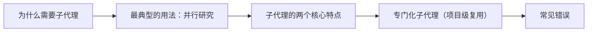

# Claude Code（11） - 子代理 Subagents 与并行研究

> 读完后，你应能完成以下任务：
> - 绘制“Claude Code（11） - 子代理 Subagents 与并行研究 / 为什么需要子代理”的关键对象与数据流，解释“子代理（Subagent） 解决这个问题：它是主代理派出去的「专员」，”，并用源码位置、日志或 Trace 标注证据。
> - 为“Claude Code（11） - 子代理 Subagents 与并行研究 / 最典型的用法：并行研究”设计正常与异常输入，验证“子代理最香的场景是并行调查多个独立的东西。”，输出首个偏差位置与回归测试结果。
> - 实现“Claude Code（11） - 子代理 Subagents 与并行研究 / 子代理的两个核心特点”的最小代码或配置，检验“独立上下文：它读的原始文件不会塞进你的主对话，只回传摘要。 -> 只向主代理汇报：子代理之间不直接说话，都是干完把结果交给主代理（需要互相通信的场景，看下一章 Agent Team）。”，输出命令、结果与 Diff，并说明不适用边界。

> 本章目标：理解子代理；学会一句话同时开多个子代理独立调查再汇总。


---

<!-- article-progressive-block:start -->
# 一、先建立全局：子代理 Subagents 与并行研究 是什么？

理解“子代理 Subagents 与并行研究”，先要把标题中的对象放进同一条处理链：它接收什么输入，经过哪些状态变化，最终用什么证据判断结果。下表不另造概念，只把作者正文已经解释的章节按依赖顺序连起来。

“子代理 Subagents 与并行研究”的第一个核心判断是：子代理（Subagent） 解决这个问题：它是主代理派出去的「专员」，。先弄清这个判断中的对象和输入输出，后面的实现、故障和验收才有共同语境。

| 顺序 | 章节 | 读完本节应抓住的结论 |
| --- | --- | --- |
| 1 | 为什么需要子代理 | 子代理（Subagent） 解决这个问题：它是主代理派出去的「专员」， |
| 2 | 最典型的用法：并行研究 | 子代理最香的场景是并行调查多个独立的东西。 |
| 3 | 子代理的两个核心特点 | 独立上下文：它读的原始文件不会塞进你的主对话，只回传摘要。 -> 只向主代理汇报：子代理之间不直接说话，都是干完把结果交给主代理（需要互相通信的场景，看下一章 Agent Team）。 |
| 4 | 专门化子代理（项目级复用） | 你可以预先定义专门的子代理，给它固定的角色和权限，团队共享。 |
| 5 | 常见错误 | 子代理有启动开销，适合「大范围」或「可并行」的活。 |
| 6 | 最佳实践 | 大范围 / 可并行 才用子代理：小查询主代理直接上。 -> 并行只给独立任务：有先后依赖的别并行。 -> 专门子代理写清 description：让它能被自动委派到合适的活。 -> 最小权限：每个子代理只给它真正需要的工具。 |

## 1.1 核心对象之间怎样衔接



这张图只表达本文的讲解顺序，不替代正文机制。判断“子代理 Subagents 与并行研究”是否真正掌握，需要能从最后一个结果沿图回到前面每个章节的输入、状态变化和证据。

## 1.2 再看失败：问题最早会出现在哪一步？

在“子代理 Subagents 与并行研究”的对象和顺序已经明确后，再看可观察的失败：文本直通执行、状态不可重放或重试重复写入。定位时不从最后一条错误猜原因，而是沿上图找第一个偏离正文结论的节点。
<!-- article-progressive-block:end -->

# 二、为什么需要子代理

设想你让 Claude Code「把整个项目的认证、数据库、API 三块都摸清楚」。
如果它一个人串着干：读认证→读数据库→读 API，
**慢，
而且把一大堆原始文件内容堆进主对话**，
上下文很快就乱、就满了。

**子代理（Subagent）** 解决这个问题：它是主代理派出去的「专员」，
**有自己独立的上下文窗口**，
干完活只把**结论摘要**带回来，
不污染主对话。

> 一句话：**脏活累活让子代理在「隔壁房间」干，主对话只收干净的结论。**

---

# 三、最典型的用法：并行研究

子代理最香的场景是**并行调查多个独立的东西**。一句话就能开多个：

```text
用独立的子代理并行研究认证、数据库、API 三个模块，分别告诉我它们的结构和关键设计
```

它会同时派出三个子代理，各查一块，**同时进行**，最后主代理把三份摘要**综合**给你。
比串行快得多，主上下文还干净。

适合并行子代理的活：

- 大范围搜索（在一堆文件/目录里找东西）；
- 多个互相独立的模块/问题各自调查；
- 「验证某个说法对不对」这类一次性专注任务。

---

# 四、子代理的两个核心特点

1. **独立上下文**：它读的原始文件不会塞进你的主对话，**只回传摘要**。这是它省上下文的关键。
2. **只向主代理汇报**：子代理之间不直接说话，都是干完把结果交给主代理（需要互相通信的场景，看下一章 Agent Team）。

---

# 五、专门化子代理（项目级复用）

你可以预先定义**专门的子代理**，给它固定的角色和权限，团队共享。
比如一个 `code-reviewer`、一个 `debugger`。

- 用 `/agents` 查看和管理可用子代理，也能在里面**创建新的**（选 `Create New subagent` 按提示走）。
- 项目级子代理放在 `.claude/agents/` 下，可随 git 共享。
- **关键技巧**：给子代理一个清晰的 `description`，Claude 就能在合适时**自动委派**任务给它；并**只给它实际需要的工具权限**（最小权限原则）。

用法举例：

```text
# 自动委派（它根据 description 自己选合适的子代理）
审查我最近的代码改动，检查安全问题
运行所有测试并修复失败项

# 明确点名某个子代理
用 code-reviewer 子代理检查认证模块
让 debugger 子代理调查用户为什么登录不了
```

---

# 六、常见错误

**错误 1：什么都开子代理**
简单的一句话查询，主代理直接干更快。
子代理有启动开销，**适合「大范围」或「可并行」的活**。

**错误 2：把有依赖的任务并行开**
「先查 A，根据 A 的结果再查 B」——这是串行依赖，并行没用。
**并行只对「互相独立」的任务有效。
**

**错误 3：给子代理过宽的工具权限**
一个只需要读代码的 reviewer，别给它写文件、跑命令的权限。
**最小权限**更安全。

**错误 4：指望子代理记住主对话的全部细节**
它有自己的上下文，你派活时要把**它需要的背景说清楚**，别假设它什么都知道。

---

# 七、最佳实践

1. **大范围 / 可并行 才用子代理**：小查询主代理直接上。
2. **并行只给独立任务**：有先后依赖的别并行。
3. **专门子代理写清 description**：让它能被自动委派到合适的活。
4. **最小权限**：每个子代理只给它真正需要的工具。
5. **派活给足背景**：子代理上下文独立，别让它猜。

---

# 八、动手实践：Demo 11 · 并行子代理研究练习

一个有三个独立模块的小项目，正好用来练「一句话开多个子代理并行研究」。

## 8.1 项目结构
- `auth/`：认证模块
- `db/`：数据库访问模块
- `api/`：API 路由模块

## 8.2 怎么练
在本目录启动 `claude`，下达并行研究指令：
```text
用独立的子代理并行研究 auth、db、api 三个模块，
分别告诉我每个模块的职责、关键函数和它们之间的依赖关系。
```
观察：它同时派出多个子代理，最后汇总三份摘要，而主对话没被原始代码刷屏。

## 8.3 对比体验
再换成串行问法（「先看 auth，
再看 db，
再看 api」），
感受上下文被原始内容堆满、变慢的差别。

<!-- article-progressive-block:start -->
# 九、动手验证：先跑通 子代理 Subagents 与并行研究，再改变一个变量

前面的章节已经建立问题、概念和机制。现在把“子代理 Subagents 与并行研究”放进同一套基线中运行；本节不再引入新术语，只验证前文结论能否被复现。

## 9.1 基线与候选只允许一个变量不同

验证“子代理 Subagents 与并行研究”时，先固定工具 Schema、身份、畸形参数、超时和重复请求。候选方案只能改变本次要验证的变量；如果同时更换数据、依赖和配置，即使结果改善，也不能知道是哪一项产生作用。

执行“子代理 Subagents 与并行研究”时，动作是：回放决策到执行链路，覆盖失败、重试、暂停和恢复。原始结果不能只保留截图或汇总分数，必须同步保存：模型提议、校验、授权、幂等键、状态迁移、Trace，使下一次复查可以在同一输入上重放。

| 实验要素 | 本文要求 |
| --- | --- |
| 固定条件 | 工具 Schema、身份、畸形参数、超时和重复请求 |
| 唯一变量 | 本次候选方案与基线之间的一项明确差异 |
| 原始证据 | 模型提议、校验、授权、幂等键、状态迁移、Trace |
| 通过阈值 | 模型只提议；执行受代码约束；失败不重复副作用 |
| 立即停止 | 文本直通执行、状态不可重放或重试重复写入 |

## 9.2 执行前先排除不可比较条件

“子代理 Subagents 与并行研究”开始前先确认下面四项；任一项不成立，都应先修复实验条件，而不是解释结果。

- 基线能够在“子代理 Subagents 与并行研究”的当前环境重复运行。
- 候选只改变一个与“子代理 Subagents 与并行研究”结论直接相关的条件。
- “子代理 Subagents 与并行研究”的基线和候选使用同一批输入、同一版本依赖与同一通过阈值。
- “子代理 Subagents 与并行研究”的原始输出和失败现场不会被重试、格式化或汇总覆盖。

## 9.3 执行后先核对证据完整性

结果出来后先检查证据，再讨论“子代理 Subagents 与并行研究”是否通过。缺少中间状态时，最终输出只能说明现象，不能证明机制。

| 检查项 | 当前文章的判定 |
| --- | --- |
| 输入可追溯 | 工具 Schema、身份、畸形参数、超时和重复请求 |
| 过程可回放 | 回放决策到执行链路，覆盖失败、重试、暂停和恢复 |
| 结果可审计 | 模型提议、校验、授权、幂等键、状态迁移、Trace |

“子代理 Subagents 与并行研究”的一次合格基线对照按以下顺序执行：

1. 保存“子代理 Subagents 与并行研究”基线版本及输入摘要，确认基线本身可以重复运行。
2. 写下“子代理 Subagents 与并行研究”候选方案唯一变化的变量，以及它预期影响的指标。
3. 在同一环境执行“子代理 Subagents 与并行研究”：回放决策到执行链路，覆盖失败、重试、暂停和恢复。
4. 为“子代理 Subagents 与并行研究”保存：模型提议、校验、授权、幂等键、状态迁移、Trace。
5. 使用“子代理 Subagents 与并行研究”预登记条件判断：模型只提议；执行受代码约束；失败不重复副作用。
6. 如果“子代理 Subagents 与并行研究”未通过，不修改第二个变量，先恢复基线并保留失败现场。

# 十、用一张矩阵验证 子代理 Subagents 与并行研究 的关键结论

矩阵按正文顺序列出“子代理 Subagents 与并行研究”的结论。一次实验只选择一行，只改变这一行对应的条件；不要把多行合并成一个无法归因的大实验。

| 正文章节 | 已解释的结论 | 本轮唯一变量 | 必须保存的证据 |
| --- | --- | --- | --- |
| 为什么需要子代理 | 子代理（Subagent） 解决这个问题：它是主代理派出去的「专员」， | 只改变与“为什么需要子代理”相关的条件 | 模型提议、校验、授权、幂等键、状态迁移、Trace |
| 最典型的用法：并行研究 | 子代理最香的场景是并行调查多个独立的东西。 | 只改变与“最典型的用法：并行研究”相关的条件 | 模型提议、校验、授权、幂等键、状态迁移、Trace |
| 子代理的两个核心特点 | 独立上下文：它读的原始文件不会塞进你的主对话，只回传摘要。 -> 只向主代理汇报：子代理之间不直接说话，都是干完把结果交给主代理（需要互相通信的场景，看下一章 Agent Team）。 | 只改变与“子代理的两个核心特点”相关的条件 | 模型提议、校验、授权、幂等键、状态迁移、Trace |
| 专门化子代理（项目级复用） | 你可以预先定义专门的子代理，给它固定的角色和权限，团队共享。 | 只改变与“专门化子代理（项目级复用）”相关的条件 | 模型提议、校验、授权、幂等键、状态迁移、Trace |
| 常见错误 | 子代理有启动开销，适合「大范围」或「可并行」的活。 | 只改变与“常见错误”相关的条件 | 模型提议、校验、授权、幂等键、状态迁移、Trace |
| 最佳实践 | 大范围 / 可并行 才用子代理：小查询主代理直接上。 -> 并行只给独立任务：有先后依赖的别并行。 -> 专门子代理写清 description：让它能被自动委派到合适的活。 -> 最小权限：每个子代理只给它真正需要的工具。 | 只改变与“最佳实践”相关的条件 | 模型提议、校验、授权、幂等键、状态迁移、Trace |

## 10.1 记录本次实际实验

下面的记录用于“子代理 Subagents 与并行研究”当前这一次实验，不是第二套知识目录。先从矩阵选择一个章节，再填写实际值；没有填写的字段表示尚未验证。

```yaml
topic: "子代理 Subagents 与并行研究"
selected_chapter: required
claim_from_article: required
baseline_version: required
changed_condition: exactly_one
execution: "回放决策到执行链路，覆盖失败、重试、暂停和恢复"
evidence: "模型提议、校验、授权、幂等键、状态迁移、Trace"
pass_when: "模型只提议；执行受代码约束；失败不重复副作用"
stop_when: "文本直通执行、状态不可重放或重试重复写入"
observed_result: required
first_deviation: null_or_evidence
recovery_replay: required_after_failure
```

## 10.2 边界实验必须证明能够停止和恢复

成功路径只能证明“子代理 Subagents 与并行研究”在当前样本上工作，不能证明它可以进入生产。边界实验需要主动制造：文本直通执行、状态不可重放或重试重复写入，并观察系统是否在产生不可逆副作用前停止。

| 场景 | 只改变什么 | 应保存什么 | 通过标准 |
| --- | --- | --- | --- |
| 正常路径 | 使用已知有效输入 | 模型提议、校验、授权、幂等键、状态迁移、Trace | 模型只提议；执行受代码约束；失败不重复副作用 |
| 边界路径 | 把一个输入推进到约束临界值 | 临界值前后的输出与指标 | 不静默降级，不把部分结果冒充成功 |
| 明确失败 | 注入：文本直通执行、状态不可重放或重试重复写入 | 原始错误、首个异常阶段和最终状态 | 失败被正确分类且没有扩大副作用 |
| 恢复重放 | 执行：关闭副作用入口，恢复检查点，补充失败契约测试 | 原失败样本的复测证据 | 原样本恢复，正常样本没有回归 |

恢复动作不是简单重启。对于“子代理 Subagents 与并行研究”，第一步是：关闭副作用入口，恢复检查点，补充失败契约测试。完成后使用原始失败样本复测；只验证一个新样本成功，不能证明触发条件已经消失。

“子代理 Subagents 与并行研究”边界实验结束后，应把正常、临界、失败和恢复四类记录放在同一个运行批次中。这样才能区分“候选方案真的修复问题”和“环境变化让问题暂时没有出现”。

# 十一、子代理 Subagents 与并行研究 的结果解释

解释“子代理 Subagents 与并行研究”实验时先看首个偏差，而不是最后一条错误。最后的异常通常只是上游状态错误的结果；从末端反推容易误把症状当根因。

| 观察结果 | 可以支持的判断 | 下一步 |
| --- | --- | --- |
| 主链路没有达到预期 | 文本直通执行、状态不可重放或重试重复写入 | 先执行：关闭副作用入口，恢复检查点，补充失败契约测试 |
| 异常链路无法恢复 | 文本直通执行、状态不可重放或重试重复写入 | 先执行：关闭副作用入口，恢复检查点，补充失败契约测试 |
| 新样本成功但原样本仍失败 | 修复没有覆盖原始触发条件 | 固定原失败输入，恢复基线后重新比较 |
| 指标改善但证据无法回链 | 数据、版本或中间状态没有固定 | 暂停发布，补齐可追溯记录后重跑 |

“子代理 Subagents 与并行研究”只有同时满足“模型只提议；执行受代码约束；失败不重复副作用”，并且没有出现“文本直通执行、状态不可重放或重试重复写入”，才可以认为主链路通过。这里的“通过”只对当前固定版本、样本和环境有效，不能外推到尚未测试的容量、权限或数据分布。

如果“子代理 Subagents 与并行研究”候选方案与基线差异很小，先检查证据分辨率是否足够；如果差异很大，先排除数据泄漏、环境漂移和版本不一致。两种情况都不能只看一个汇总均值，需要回到逐样本输出和中间状态。

“子代理 Subagents 与并行研究”故障定位完成后，记录“现象、首个偏差、根因、改动、原样本复测”五项。缺少原样本复测时，只能标记为待观察，不能标记为已解决。

# 十二、子代理 Subagents 与并行研究 的发布判断

发布判断需要把“子代理 Subagents 与并行研究”的质量、失败边界和恢复能力放在同一份记录中。以下任一条件缺失，都应停止扩量，而不是用“基本正常”替代证据。

- [ ] “子代理 Subagents 与并行研究”的基线与候选只存在一个计划内变量。
- [ ] “子代理 Subagents 与并行研究”的输入、代码、依赖、配置和数据版本可以追溯。
- [ ] “子代理 Subagents 与并行研究”的正常、临界、失败和恢复样本使用同一套断言。
- [ ] “子代理 Subagents 与并行研究”的原始输出、中间状态和失败现场已经保留。
- [ ] “子代理 Subagents 与并行研究”的日志、Trace、截图和测试数据已经脱敏。
- [ ] “子代理 Subagents 与并行研究”的停止条件、负责人和回滚入口已经演练。
- [ ] “子代理 Subagents 与并行研究”尚未覆盖的输入、权限、容量和外部依赖已经登记。

最终记录至少包含基线版本、唯一变量、原始证据、首个偏差、恢复复测和发布责任人。没有参与本次修改的人如果不能据此重放“子代理 Subagents 与并行研究”的判断，就不能发布。
<!-- article-progressive-block:end -->

# 十三、总结

- **为什么需要子代理**：子代理（Subagent） 解决这个问题：它是主代理派出去的「专员」，有自己独立的上下文窗口，干完活只把结论摘要带回来，不污染主对话。
- **最典型的用法：并行研究**：子代理最香的场景是并行调查多个独立的东西。
- **子代理的两个核心特点**：独立上下文：它读的原始文件不会塞进你的主对话，只回传摘要。 -> 只向主代理汇报：子代理之间不直接说话，都是干完把结果交给主代理（需要互相通信的场景，看下一章 Agent Team）。
- **专门化子代理（项目级复用）**：你可以预先定义专门的子代理，给它固定的角色和权限，团队共享。
- **常见错误**：子代理有启动开销，适合「大范围」或「可并行」的活。
- **最佳实践**：大范围 / 可并行 才用子代理：小查询主代理直接上。 -> 并行只给独立任务：有先后依赖的别并行。 -> 专门子代理写清 description：让它能被自动委派到合适的活。 -> 最小权限：每个子代理只给它真正需要的工具。

## 参考资料

- [Claude Code 文档](https://docs.anthropic.com/en/docs/claude-code/overview)
- [Claude Code 安全](https://docs.anthropic.com/en/docs/claude-code/security)
