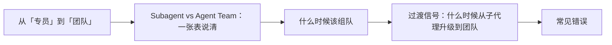

# Claude Code（12） - Agent Team：多代理协作

> 读完后，你应能完成以下任务：
> - 绘制“Claude Code（12） - Agent Team：多代理协作 / 从「专员」到「团队」”的关键对象与数据流，解释“上一章的子代理是「派出去干活、回来交报告」的专员，它们之间不说话。”，并用源码位置、日志或 Trace 标注证据。
> - 为“Claude Code（12） - Agent Team：多代理协作 / Subagent vs Agent Team：一张表说清”设计正常与异常输入，验证“记忆锚点：子代理是「下属交报告」，团队是「同事互相协作」。”，输出首个偏差位置与回归测试结果。
> - 实现“Claude Code（12） - Agent Team：多代理协作 / 什么时候该组队”的最小代码或配置，检验“新功能开发分工：每个队友负责一个模块，需要对齐接口、互相协调。”，输出命令、结果与 Diff，并说明不适用边界。

> 本章目标：理解 Agent Team 与 Subagent 的区别，知道何时组队。


---

<!-- article-progressive-block:start -->
# 一、先建立全局：Agent Team：多代理协作 是什么？

理解“Agent Team：多代理协作”，先要把标题中的对象放进同一条处理链：它接收什么输入，经过哪些状态变化，最终用什么证据判断结果。下表不另造概念，只把作者正文已经解释的章节按依赖顺序连起来。

“Agent Team：多代理协作”的第一个核心判断是：上一章的子代理是「派出去干活、回来交报告」的专员，它们之间不说话。。先弄清这个判断中的对象和输入输出，后面的实现、故障和验收才有共同语境。

| 顺序 | 章节 | 读完本节应抓住的结论 |
| --- | --- | --- |
| 1 | 从「专员」到「团队」 | 上一章的子代理是「派出去干活、回来交报告」的专员，它们之间不说话。 |
| 2 | Subagent vs Agent Team：一张表说清 | 记忆锚点：子代理是「下属交报告」，团队是「同事互相协作」。 |
| 3 | 什么时候该组队 | 新功能开发分工：每个队友负责一个模块，需要对齐接口、互相协调。 |
| 4 | 过渡信号：什么时候从子代理升级到团队 | 你在跑并行子代理，但撞到了上下文限制——单靠主代理协调已经吃力； -> 子代理之间需要互相通信——它们光向主代理汇报已经不够，得直接对话。 |
| 5 | 常见错误 | 团队里每个队友都是独立 Claude 实例，令牌成本高。 |
| 6 | 最佳实践 | 先问「要不要讨论协作」：要 → 团队； -> 任务可拆分再组队：每个队友有清晰的、独立的负责面。 -> 善用共享任务列表：让团队自我协调，而不是你手动指挥每一步。 -> 控制规模与成本：从小队起步，确实需要再加人。 |

## 1.1 核心对象之间怎样衔接



这张图只表达本文的讲解顺序，不替代正文机制。判断“Agent Team：多代理协作”是否真正掌握，需要能从最后一个结果沿图回到前面每个章节的输入、状态变化和证据。

## 1.2 再看失败：问题最早会出现在哪一步？

在“Agent Team：多代理协作”的对象和顺序已经明确后，再看可观察的失败：文本直通执行、状态不可重放或重试重复写入。定位时不从最后一条错误猜原因，而是沿上图找第一个偏离正文结论的节点。
<!-- article-progressive-block:end -->

# 二、从「专员」到「团队」

上一章的子代理是「派出去干活、回来交报告」的专员，**它们之间不说话**。
但有些工作，光交报告不够——队员之间需要**互相讨论、彼此质疑、自己分工**。
这时就要 **Agent Team**。

**Agent Team = 多个独立的 Claude Code 会话，
能互相发消息、共享一份任务列表、自我协调。
** 每个队友都是一个完整的 Claude 实例，有自己完整的上下文。

---

# 三、Subagent vs Agent Team：一张表说清

| 方面 | Subagent（子代理） | Agent Team（代理团队） |
| --- | --- | --- |
| **上下文** | 自己的上下文，结果回传给调用者 | 自己的上下文，完全独立 |
| **通信** | 只向主代理汇报结果 | 队友之间**直接互发消息** |
| **协调** | 主代理统一管所有活 | 共享任务列表，**自我协调** |
| **最适合** | 只要结果的专注任务 | 需要讨论、协作的复杂工作 |
| **令牌成本** | 较低（只回传摘要） | 较高（每个队友是独立 Claude 实例） |

> 记忆锚点：**子代理是「下属交报告」，团队是「同事互相协作」。**

---

# 四、什么时候该组队

Agent Team 最适合这几类：

- **有竞争性假设的研究**：让几个队友各自从不同思路调查同一问题，再彼此 PK、综合。
- **并行代码审查**：多个审查者各看一部分，互通有无。
- **新功能开发分工**：每个队友负责一个模块，需要对齐接口、互相协调。

而如果你只是「要个结果」「查件事」——用子代理就够了，别为了组队而组队（成本高）。

---

# 五、过渡信号：什么时候从子代理升级到团队

有两个明显信号说明该升级了：

1. **你在跑并行子代理，但撞到了上下文限制**——单靠主代理协调已经吃力；
2. **子代理之间需要互相通信**——它们光向主代理汇报已经不够，得直接对话。

出现这两种情况，Agent Team 是自然的下一步。

---

# 六、常见错误

**错误 1：能用子代理的活也硬要组队**
团队里每个队友都是独立 Claude 实例，**令牌成本高**。
只要结果的任务，子代理更划算。

**错误 2：给团队的任务没法拆分**
团队的价值在「分工 + 协作」。
如果任务本质是线性的、拆不开，组队没意义。

**错误 3：不给共享任务列表，指望它们自己理清**
团队靠**共享任务列表**协调。
任务边界、谁负责啥要交代清楚，它们才能自我协调而不打架。

**错误 4：忽视成本一开就是一大队**
队友越多越贵。从小队开始，按需扩。

---

# 七、最佳实践

1. **先问「要不要讨论协作」**：要 → 团队；只要结果 → 子代理。
2. **任务可拆分再组队**：每个队友有清晰的、独立的负责面。
3. **善用共享任务列表**：让团队自我协调，而不是你手动指挥每一步。
4. **控制规模与成本**：从小队起步，确实需要再加人。
5. **撞上下文墙就升级**：并行子代理吃紧时，团队是自然下一步。

---

# 八、动手实践：Demo 12 · Subagent vs Agent Team 决策练习

本章偏架构理解，Demo 是一张「该用哪个」的决策卡 + 场景练习。

## 8.1 文件
- `选型决策.md`：给定场景，练习选 Subagent 还是 Agent Team。

## 8.2 怎么用
对每个场景先自己判断，再看参考答案，最后挑一个真实场景动手试。

## 8.3 实践目标

本 Lab 用最小输入验证“Demo 12 · Subagent vs Agent Team 决策练习”的核心行为。
再只修改一个参数或一个分支，比较结果差异。

## 8.4 实践验收


## 8.5 常见问题


<!-- knowledge-practice-materials-merged -->

## 8.6 配套实践材料

以下材料已并入正文，便于阅读时直接对照和练习。

### 选型决策.md

````markdown
# 选型练习：Subagent 还是 Agent Team？

> 口诀：只要结果 → Subagent；需要讨论协作 → Agent Team（更贵）。

## 场景 1：在大代码库里找出所有调用了已废弃 API 的地方
- 参考：**Subagent**。一次性专注搜索，只要结果。

## 场景 2：三种缓存方案（Redis / 内存 / 文件）各让一个代理深入论证，再互相 PK 选最优
- 参考：**Agent Team**。竞争性假设 + 需要互相质疑。

## 场景 3：并行研究 auth/db/api 三个独立模块的结构
- 参考：**Subagent**（并行研究）。各查各的、汇总即可，不用互相讨论。

## 场景 4：开发一个新功能，前端、后端、测试三人分工，需要对齐接口
- 参考：**Agent Team**。多模块分工 + 需要协调接口。

## 场景 5：你在跑并行 Subagent，但它们开始需要互相通信、且撞到上下文限制
- 参考：升级到 **Agent Team**——这正是过渡信号。
````

<!-- article-progressive-block:start -->
# 九、动手验证：先跑通 Agent Team：多代理协作，再改变一个变量

前面的章节已经建立问题、概念和机制。现在把“Agent Team：多代理协作”放进同一套基线中运行；本节不再引入新术语，只验证前文结论能否被复现。

## 9.1 基线与候选只允许一个变量不同

验证“Agent Team：多代理协作”时，先固定工具 Schema、身份、畸形参数、超时和重复请求。候选方案只能改变本次要验证的变量；如果同时更换数据、依赖和配置，即使结果改善，也不能知道是哪一项产生作用。

执行“Agent Team：多代理协作”时，动作是：回放决策到执行链路，覆盖失败、重试、暂停和恢复。原始结果不能只保留截图或汇总分数，必须同步保存：模型提议、校验、授权、幂等键、状态迁移、Trace，使下一次复查可以在同一输入上重放。

| 实验要素 | 本文要求 |
| --- | --- |
| 固定条件 | 工具 Schema、身份、畸形参数、超时和重复请求 |
| 唯一变量 | 本次候选方案与基线之间的一项明确差异 |
| 原始证据 | 模型提议、校验、授权、幂等键、状态迁移、Trace |
| 通过阈值 | 模型只提议；执行受代码约束；失败不重复副作用 |
| 立即停止 | 文本直通执行、状态不可重放或重试重复写入 |

## 9.2 执行前先排除不可比较条件

“Agent Team：多代理协作”开始前先确认下面四项；任一项不成立，都应先修复实验条件，而不是解释结果。

- 基线能够在“Agent Team：多代理协作”的当前环境重复运行。
- 候选只改变一个与“Agent Team：多代理协作”结论直接相关的条件。
- “Agent Team：多代理协作”的基线和候选使用同一批输入、同一版本依赖与同一通过阈值。
- “Agent Team：多代理协作”的原始输出和失败现场不会被重试、格式化或汇总覆盖。

## 9.3 执行后先核对证据完整性

结果出来后先检查证据，再讨论“Agent Team：多代理协作”是否通过。缺少中间状态时，最终输出只能说明现象，不能证明机制。

| 检查项 | 当前文章的判定 |
| --- | --- |
| 输入可追溯 | 工具 Schema、身份、畸形参数、超时和重复请求 |
| 过程可回放 | 回放决策到执行链路，覆盖失败、重试、暂停和恢复 |
| 结果可审计 | 模型提议、校验、授权、幂等键、状态迁移、Trace |

“Agent Team：多代理协作”的一次合格基线对照按以下顺序执行：

1. 保存“Agent Team：多代理协作”基线版本及输入摘要，确认基线本身可以重复运行。
2. 写下“Agent Team：多代理协作”候选方案唯一变化的变量，以及它预期影响的指标。
3. 在同一环境执行“Agent Team：多代理协作”：回放决策到执行链路，覆盖失败、重试、暂停和恢复。
4. 为“Agent Team：多代理协作”保存：模型提议、校验、授权、幂等键、状态迁移、Trace。
5. 使用“Agent Team：多代理协作”预登记条件判断：模型只提议；执行受代码约束；失败不重复副作用。
6. 如果“Agent Team：多代理协作”未通过，不修改第二个变量，先恢复基线并保留失败现场。

# 十、用一张矩阵验证 Agent Team：多代理协作 的关键结论

矩阵按正文顺序列出“Agent Team：多代理协作”的结论。一次实验只选择一行，只改变这一行对应的条件；不要把多行合并成一个无法归因的大实验。

| 正文章节 | 已解释的结论 | 本轮唯一变量 | 必须保存的证据 |
| --- | --- | --- | --- |
| 从「专员」到「团队」 | 上一章的子代理是「派出去干活、回来交报告」的专员，它们之间不说话。 | 只改变与“从「专员」到「团队」”相关的条件 | 模型提议、校验、授权、幂等键、状态迁移、Trace |
| Subagent vs Agent Team：一张表说清 | 记忆锚点：子代理是「下属交报告」，团队是「同事互相协作」。 | 只改变与“Subagent vs Agent Team：一张表说清”相关的条件 | 模型提议、校验、授权、幂等键、状态迁移、Trace |
| 什么时候该组队 | 新功能开发分工：每个队友负责一个模块，需要对齐接口、互相协调。 | 只改变与“什么时候该组队”相关的条件 | 模型提议、校验、授权、幂等键、状态迁移、Trace |
| 过渡信号：什么时候从子代理升级到团队 | 你在跑并行子代理，但撞到了上下文限制——单靠主代理协调已经吃力； -> 子代理之间需要互相通信——它们光向主代理汇报已经不够，得直接对话。 | 只改变与“过渡信号：什么时候从子代理升级到团队”相关的条件 | 模型提议、校验、授权、幂等键、状态迁移、Trace |
| 常见错误 | 团队里每个队友都是独立 Claude 实例，令牌成本高。 | 只改变与“常见错误”相关的条件 | 模型提议、校验、授权、幂等键、状态迁移、Trace |
| 最佳实践 | 先问「要不要讨论协作」：要 → 团队； -> 任务可拆分再组队：每个队友有清晰的、独立的负责面。 -> 善用共享任务列表：让团队自我协调，而不是你手动指挥每一步。 -> 控制规模与成本：从小队起步，确实需要再加人。 | 只改变与“最佳实践”相关的条件 | 模型提议、校验、授权、幂等键、状态迁移、Trace |

## 10.1 记录本次实际实验

下面的记录用于“Agent Team：多代理协作”当前这一次实验，不是第二套知识目录。先从矩阵选择一个章节，再填写实际值；没有填写的字段表示尚未验证。

```yaml
topic: "Agent Team：多代理协作"
selected_chapter: required
claim_from_article: required
baseline_version: required
changed_condition: exactly_one
execution: "回放决策到执行链路，覆盖失败、重试、暂停和恢复"
evidence: "模型提议、校验、授权、幂等键、状态迁移、Trace"
pass_when: "模型只提议；执行受代码约束；失败不重复副作用"
stop_when: "文本直通执行、状态不可重放或重试重复写入"
observed_result: required
first_deviation: null_or_evidence
recovery_replay: required_after_failure
```

## 10.2 边界实验必须证明能够停止和恢复

成功路径只能证明“Agent Team：多代理协作”在当前样本上工作，不能证明它可以进入生产。边界实验需要主动制造：文本直通执行、状态不可重放或重试重复写入，并观察系统是否在产生不可逆副作用前停止。

| 场景 | 只改变什么 | 应保存什么 | 通过标准 |
| --- | --- | --- | --- |
| 正常路径 | 使用已知有效输入 | 模型提议、校验、授权、幂等键、状态迁移、Trace | 模型只提议；执行受代码约束；失败不重复副作用 |
| 边界路径 | 把一个输入推进到约束临界值 | 临界值前后的输出与指标 | 不静默降级，不把部分结果冒充成功 |
| 明确失败 | 注入：文本直通执行、状态不可重放或重试重复写入 | 原始错误、首个异常阶段和最终状态 | 失败被正确分类且没有扩大副作用 |
| 恢复重放 | 执行：关闭副作用入口，恢复检查点，补充失败契约测试 | 原失败样本的复测证据 | 原样本恢复，正常样本没有回归 |

恢复动作不是简单重启。对于“Agent Team：多代理协作”，第一步是：关闭副作用入口，恢复检查点，补充失败契约测试。完成后使用原始失败样本复测；只验证一个新样本成功，不能证明触发条件已经消失。

“Agent Team：多代理协作”边界实验结束后，应把正常、临界、失败和恢复四类记录放在同一个运行批次中。这样才能区分“候选方案真的修复问题”和“环境变化让问题暂时没有出现”。

# 十一、Agent Team：多代理协作 的结果解释

解释“Agent Team：多代理协作”实验时先看首个偏差，而不是最后一条错误。最后的异常通常只是上游状态错误的结果；从末端反推容易误把症状当根因。

| 观察结果 | 可以支持的判断 | 下一步 |
| --- | --- | --- |
| 主链路没有达到预期 | 文本直通执行、状态不可重放或重试重复写入 | 先执行：关闭副作用入口，恢复检查点，补充失败契约测试 |
| 异常链路无法恢复 | 文本直通执行、状态不可重放或重试重复写入 | 先执行：关闭副作用入口，恢复检查点，补充失败契约测试 |
| 新样本成功但原样本仍失败 | 修复没有覆盖原始触发条件 | 固定原失败输入，恢复基线后重新比较 |
| 指标改善但证据无法回链 | 数据、版本或中间状态没有固定 | 暂停发布，补齐可追溯记录后重跑 |

“Agent Team：多代理协作”只有同时满足“模型只提议；执行受代码约束；失败不重复副作用”，并且没有出现“文本直通执行、状态不可重放或重试重复写入”，才可以认为主链路通过。这里的“通过”只对当前固定版本、样本和环境有效，不能外推到尚未测试的容量、权限或数据分布。

如果“Agent Team：多代理协作”候选方案与基线差异很小，先检查证据分辨率是否足够；如果差异很大，先排除数据泄漏、环境漂移和版本不一致。两种情况都不能只看一个汇总均值，需要回到逐样本输出和中间状态。

“Agent Team：多代理协作”故障定位完成后，记录“现象、首个偏差、根因、改动、原样本复测”五项。缺少原样本复测时，只能标记为待观察，不能标记为已解决。

# 十二、Agent Team：多代理协作 的发布判断

发布判断需要把“Agent Team：多代理协作”的质量、失败边界和恢复能力放在同一份记录中。以下任一条件缺失，都应停止扩量，而不是用“基本正常”替代证据。

- [ ] “Agent Team：多代理协作”的基线与候选只存在一个计划内变量。
- [ ] “Agent Team：多代理协作”的输入、代码、依赖、配置和数据版本可以追溯。
- [ ] “Agent Team：多代理协作”的正常、临界、失败和恢复样本使用同一套断言。
- [ ] “Agent Team：多代理协作”的原始输出、中间状态和失败现场已经保留。
- [ ] “Agent Team：多代理协作”的日志、Trace、截图和测试数据已经脱敏。
- [ ] “Agent Team：多代理协作”的停止条件、负责人和回滚入口已经演练。
- [ ] “Agent Team：多代理协作”尚未覆盖的输入、权限、容量和外部依赖已经登记。

最终记录至少包含基线版本、唯一变量、原始证据、首个偏差、恢复复测和发布责任人。没有参与本次修改的人如果不能据此重放“Agent Team：多代理协作”的判断，就不能发布。
<!-- article-progressive-block:end -->

# 十三、总结

- **从「专员」到「团队」**：上一章的子代理是「派出去干活、回来交报告」的专员，它们之间不说话。
- **Subagent vs Agent Team：一张表说清**：| 最适合 | 只要结果的专注任务 | 需要讨论、协作的复杂工作 |
- **什么时候该组队**：Agent Team 最适合这几类：
- **过渡信号：什么时候从子代理升级到团队**：你在跑并行子代理，但撞到了上下文限制——单靠主代理协调已经吃力； -> 子代理之间需要互相通信——它们光向主代理汇报已经不够，得直接对话。
- **常见错误**：团队里每个队友都是独立 Claude 实例，令牌成本高。
- **最佳实践**：先问「要不要讨论协作」：要 → 团队； -> 任务可拆分再组队：每个队友有清晰的、独立的负责面。 -> 善用共享任务列表：让团队自我协调，而不是你手动指挥每一步。 -> 控制规模与成本：从小队起步，确实需要再加人。

## 参考资料

- [Claude Code 文档](https://docs.anthropic.com/en/docs/claude-code/overview)
- [Claude Code 安全](https://docs.anthropic.com/en/docs/claude-code/security)
