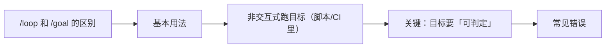

# Claude Code（16） - /goal：目标导向，跑到满足条件为止

> 读完后，你应能完成以下任务：
> - 绘制“Claude Code（16） - /goal：目标导向，跑到满足条件为止 / /loop 和 /goal 的区别”的关键对象与数据流，解释“上一章 /loop 是「反复做某件事」，”，并用源码位置、日志或 Trace 标注证据。
> - 为“Claude Code（16） - /goal：目标导向，跑到满足条件为止 / 基本用法”设计正常与异常输入，验证“它会：跑测试 → 看哪些没过 → 改 → 再跑 → 还有 lint 问题 → 修 → 再检查……循环往复，”，输出首个偏差位置与回归测试结果。
> - 实现“Claude Code（16） - /goal：目标导向，跑到满足条件为止 / 非交互式跑目标（脚本/CI 里）”的最小代码或配置，检验“适合放进脚本或 CI：丢一个目标，让它自己跑到达标。”，输出命令、结果与 Diff，并说明不适用边界。

> 本章目标：用 `/goal` 设定「完成条件」，让它跨多轮自己干，直到条件满足。


---

<!-- article-progressive-block:start -->
# 一、先建立全局：/goal：目标导向，跑到满足条件为止 是什么？

理解“/goal：目标导向，跑到满足条件为止”，先要把标题中的对象放进同一条处理链：它接收什么输入，经过哪些状态变化，最终用什么证据判断结果。下表不另造概念，只把作者正文已经解释的章节按依赖顺序连起来。

“/goal：目标导向，跑到满足条件为止”的第一个核心判断是：上一章 /loop 是「反复做某件事」，。先弄清这个判断中的对象和输入输出，后面的实现、故障和验收才有共同语境。

| 顺序 | 章节 | 读完本节应抓住的结论 |
| --- | --- | --- |
| 1 | /loop 和 /goal 的区别 | 上一章 /loop 是「反复做某件事」， |
| 2 | 基本用法 | 它会：跑测试 → 看哪些没过 → 改 → 再跑 → 还有 lint 问题 → 修 → 再检查……循环往复， |
| 3 | 非交互式跑目标（脚本/CI 里） | 适合放进脚本或 CI：丢一个目标，让它自己跑到达标。 |
| 4 | 关键：目标要「可判定」 | /goal 好不好用，全看你的完成条件能不能被明确判断真假。 |
| 5 | 常见错误 | 「重写整个系统并全部测试通过」跨度过大，容易失控。 |
| 6 | 最佳实践 | 配合权限把关：自主跑的同时，高危操作留确认或事后审查。 -> 善用 -p 进 CI：claude -p "/goal ..." 把目标跑进自动化流程。 -> 选对工具：监控用 /loop，达标用 /goal。 |

## 1.1 核心对象之间怎样衔接



这张图只表达本文的讲解顺序，不替代正文机制。判断“/goal：目标导向，跑到满足条件为止”是否真正掌握，需要能从最后一个结果沿图回到前面每个章节的输入、状态变化和证据。

## 1.2 再看失败：问题最早会出现在哪一步？

在“/goal：目标导向，跑到满足条件为止”的对象和顺序已经明确后，再看可观察的失败：条件缺失、结果不可复现或失败后责任不清。定位时不从最后一条错误猜原因，而是沿上图找第一个偏离正文结论的节点。
<!-- article-progressive-block:end -->

# 二、/loop 和 /goal 的区别

上一章 `/loop` 是「**反复做某件事**」，
它不关心「做完没」——你让它每 5 分钟看一次部署，
它就一直看。

`/goal` 不一样：你给它一个**完成条件**，
它会**跨多个回合持续工作，
直到这个条件被满足**才停。
重点从「反复做」变成「奔着目标去」。

> 一句话：**`/loop` 是「一直做」，`/goal` 是「做到成」。**

---

# 三、基本用法

设定一个可判定的完成条件，它会以此为指令开始第一轮，然后一轮轮干到达标：

```text
/goal test/auth 下所有测试通过，并且 lint 步骤干净
```

它会：跑测试 → 看哪些没过 → 改 → 再跑 → 还有 lint 问题 → 修 → 再检查……**循环往复，
直到「测试全过 + lint 干净」同时成立**才停。
你不用每轮催它。

更多例子：

```text
/goal CHANGELOG.md 里为本周合并的每个 PR 都补上一条记录
/goal 修复 #123，且新增的测试能覆盖该场景、全部通过
```

---

# 四、非交互式跑目标（脚本/CI 里）

`/goal` 可以和 `-p`（打印模式，
第 20 章细讲）结合，
**一条命令把整个目标跑到完成**，
不进交互界面：

```bash
claude -p "/goal CHANGELOG.md has an entry for every PR merged this week"
```

适合放进脚本或 CI：丢一个目标，让它自己跑到达标。
中途想停，`Ctrl+C`。

---

# 五、关键：目标要「可判定」

`/goal` 好不好用，全看你的完成条件能不能被**明确判断真假**。

✅ **可判定**（它知道什么时候算成了）：
```text
/goal `npm test` 全部通过，且 `npm run lint` 无报错
/goal src/ 下不再有任何 console.log
```

❌ **没法判定**（它永远不知道达没达标）：
```text
/goal 把代码写得更优雅
/goal 优化一下性能
```

> 黄金法则：**完成条件 = 一个能跑、能验证真假的检查。** 「测试过」「lint 净」「文件里没有 X」都行；「更好」「更优雅」不行。

---

# 六、常见错误

**错误 1：给一个模糊的、判不了真假的目标**
「让它更好」它会无限折腾或乱停。→ 目标必须可验证。

**错误 2：目标太大、一口吃成胖子**
「重写整个系统并全部测试通过」跨度过大，容易失控。
→ 拆成可达成的小目标，逐个攻克。

**错误 3：高风险目标全程不看**
让它自主跑到达标，期间可能改很多。
→ 重要场景下，配合权限模式（第06章）保留关键操作的确认，或事后认真审查。

**错误 4：分不清该用 /loop 还是 /goal**
要「持续监控某状态」→ `/loop`；
要「达成某个明确结果」→ `/goal`。

---

# 七、最佳实践

1. **目标写成可验证的检查**：能跑命令判真假的才是好目标。
2. **目标大小适中**：太大拆小，逐个达成更稳。
3. **配合权限把关**：自主跑的同时，高危操作留确认或事后审查。
4. **善用 `-p` 进 CI**：`claude -p "/goal ..."` 把目标跑进自动化流程。
5. **选对工具**：监控用 `/loop`，达标用 `/goal`。

---

# 八、动手实践：Demo 16 · /goal 目标导向实战

一个有失败测试 + 残留 console.log 的小项目，
正好用来设一个「可判定」的目标，
让 Claude 自己干到达标。

## 8.1 文件
- `calc.js`：几个计算函数，留了 bug + console.log
- `calc.test.js`：测试（会失败）
- `goal练习.md`：可判定 vs 不可判定目标对照

## 8.2 怎么练
1. 跑测试看失败：`node calc.test.js`
2. 设一个可判定目标让它自己跑到成：
   ```
/goal `node calc.test.js` 全部通过，
且 calc.js 里不再有任何 console.log
   ```
3. 观察：它跑测试→改→再跑→清掉 console.log→再验证，直到两个条件都满足才停。

## 8.3 非交互式（脚本/CI）
```bash
claude -p "/goal node calc.test.js 全部通过，且 calc.js 无 console.log"
```

<!-- knowledge-practice-materials-merged -->

## 8.4 配套实践材料

以下材料已并入正文，便于阅读时直接对照和练习。

### goal练习.md

````markdown
# /goal 目标可判定性练习

## ✅ 可判定（它知道何时算成）
- /goal `node calc.test.js` 全部通过
- /goal calc.js 里不再有任何 console.log
- /goal src/ 下没有 TODO 注释

## ❌ 不可判定（它永远不知道达没达标）
- /goal 把代码写得更优雅
- /goal 提升一下性能

## 黄金法则
完成条件 = 一个能跑、能验证真假的检查。
````

<!-- article-progressive-block:start -->
# 九、动手验证：先跑通 /goal：目标导向，跑到满足条件为止，再改变一个变量

前面的章节已经建立问题、概念和机制。现在把“/goal：目标导向，跑到满足条件为止”放进同一套基线中运行；本节不再引入新术语，只验证前文结论能否被复现。

## 9.1 基线与候选只允许一个变量不同

验证“/goal：目标导向，跑到满足条件为止”时，先固定样本、基线、候选、成功标准和失败边界。候选方案只能改变本次要验证的变量；如果同时更换数据、依赖和配置，即使结果改善，也不能知道是哪一项产生作用。

执行“/goal：目标导向，跑到满足条件为止”时，动作是：同环境运行基线与候选，记录输入、中间状态和异常。原始结果不能只保留截图或汇总分数，必须同步保存：可重放命令、结构化日志、输出 Diff、失败样本、版本，使下一次复查可以在同一输入上重放。

| 实验要素 | 本文要求 |
| --- | --- |
| 固定条件 | 固定样本、基线、候选、成功标准和失败边界 |
| 唯一变量 | 本次候选方案与基线之间的一项明确差异 |
| 原始证据 | 可重放命令、结构化日志、输出 Diff、失败样本、版本 |
| 通过阈值 | 结果符合结论条件，异常输入可解释、可恢复 |
| 立即停止 | 条件缺失、结果不可复现或失败后责任不清 |

## 9.2 执行前先排除不可比较条件

“/goal：目标导向，跑到满足条件为止”开始前先确认下面四项；任一项不成立，都应先修复实验条件，而不是解释结果。

- 基线能够在“/goal：目标导向，跑到满足条件为止”的当前环境重复运行。
- 候选只改变一个与“/goal：目标导向，跑到满足条件为止”结论直接相关的条件。
- “/goal：目标导向，跑到满足条件为止”的基线和候选使用同一批输入、同一版本依赖与同一通过阈值。
- “/goal：目标导向，跑到满足条件为止”的原始输出和失败现场不会被重试、格式化或汇总覆盖。

## 9.3 执行后先核对证据完整性

结果出来后先检查证据，再讨论“/goal：目标导向，跑到满足条件为止”是否通过。缺少中间状态时，最终输出只能说明现象，不能证明机制。

| 检查项 | 当前文章的判定 |
| --- | --- |
| 输入可追溯 | 固定样本、基线、候选、成功标准和失败边界 |
| 过程可回放 | 同环境运行基线与候选，记录输入、中间状态和异常 |
| 结果可审计 | 可重放命令、结构化日志、输出 Diff、失败样本、版本 |

“/goal：目标导向，跑到满足条件为止”的一次合格基线对照按以下顺序执行：

1. 保存“/goal：目标导向，跑到满足条件为止”基线版本及输入摘要，确认基线本身可以重复运行。
2. 写下“/goal：目标导向，跑到满足条件为止”候选方案唯一变化的变量，以及它预期影响的指标。
3. 在同一环境执行“/goal：目标导向，跑到满足条件为止”：同环境运行基线与候选，记录输入、中间状态和异常。
4. 为“/goal：目标导向，跑到满足条件为止”保存：可重放命令、结构化日志、输出 Diff、失败样本、版本。
5. 使用“/goal：目标导向，跑到满足条件为止”预登记条件判断：结果符合结论条件，异常输入可解释、可恢复。
6. 如果“/goal：目标导向，跑到满足条件为止”未通过，不修改第二个变量，先恢复基线并保留失败现场。

# 十、用一张矩阵验证 /goal：目标导向，跑到满足条件为止 的关键结论

矩阵按正文顺序列出“/goal：目标导向，跑到满足条件为止”的结论。一次实验只选择一行，只改变这一行对应的条件；不要把多行合并成一个无法归因的大实验。

| 正文章节 | 已解释的结论 | 本轮唯一变量 | 必须保存的证据 |
| --- | --- | --- | --- |
| /loop 和 /goal 的区别 | 上一章 /loop 是「反复做某件事」， | 只改变与“/loop 和 /goal 的区别”相关的条件 | 可重放命令、结构化日志、输出 Diff、失败样本、版本 |
| 基本用法 | 它会：跑测试 → 看哪些没过 → 改 → 再跑 → 还有 lint 问题 → 修 → 再检查……循环往复， | 只改变与“基本用法”相关的条件 | 可重放命令、结构化日志、输出 Diff、失败样本、版本 |
| 非交互式跑目标（脚本/CI 里） | 适合放进脚本或 CI：丢一个目标，让它自己跑到达标。 | 只改变与“非交互式跑目标（脚本/CI 里）”相关的条件 | 可重放命令、结构化日志、输出 Diff、失败样本、版本 |
| 关键：目标要「可判定」 | /goal 好不好用，全看你的完成条件能不能被明确判断真假。 | 只改变与“关键：目标要「可判定」”相关的条件 | 可重放命令、结构化日志、输出 Diff、失败样本、版本 |
| 常见错误 | 「重写整个系统并全部测试通过」跨度过大，容易失控。 | 只改变与“常见错误”相关的条件 | 可重放命令、结构化日志、输出 Diff、失败样本、版本 |
| 最佳实践 | 配合权限把关：自主跑的同时，高危操作留确认或事后审查。 -> 善用 -p 进 CI：claude -p "/goal ..." 把目标跑进自动化流程。 -> 选对工具：监控用 /loop，达标用 /goal。 | 只改变与“最佳实践”相关的条件 | 可重放命令、结构化日志、输出 Diff、失败样本、版本 |

## 10.1 记录本次实际实验

下面的记录用于“/goal：目标导向，跑到满足条件为止”当前这一次实验，不是第二套知识目录。先从矩阵选择一个章节，再填写实际值；没有填写的字段表示尚未验证。

```yaml
topic: "/goal：目标导向，跑到满足条件为止"
selected_chapter: required
claim_from_article: required
baseline_version: required
changed_condition: exactly_one
execution: "同环境运行基线与候选，记录输入、中间状态和异常"
evidence: "可重放命令、结构化日志、输出 Diff、失败样本、版本"
pass_when: "结果符合结论条件，异常输入可解释、可恢复"
stop_when: "条件缺失、结果不可复现或失败后责任不清"
observed_result: required
first_deviation: null_or_evidence
recovery_replay: required_after_failure
```

## 10.2 边界实验必须证明能够停止和恢复

成功路径只能证明“/goal：目标导向，跑到满足条件为止”在当前样本上工作，不能证明它可以进入生产。边界实验需要主动制造：条件缺失、结果不可复现或失败后责任不清，并观察系统是否在产生不可逆副作用前停止。

| 场景 | 只改变什么 | 应保存什么 | 通过标准 |
| --- | --- | --- | --- |
| 正常路径 | 使用已知有效输入 | 可重放命令、结构化日志、输出 Diff、失败样本、版本 | 结果符合结论条件，异常输入可解释、可恢复 |
| 边界路径 | 把一个输入推进到约束临界值 | 临界值前后的输出与指标 | 不静默降级，不把部分结果冒充成功 |
| 明确失败 | 注入：条件缺失、结果不可复现或失败后责任不清 | 原始错误、首个异常阶段和最终状态 | 失败被正确分类且没有扩大副作用 |
| 恢复重放 | 执行：保留基线，缩小变量；根因确认前不扩大范围 | 原失败样本的复测证据 | 原样本恢复，正常样本没有回归 |

恢复动作不是简单重启。对于“/goal：目标导向，跑到满足条件为止”，第一步是：保留基线，缩小变量；根因确认前不扩大范围。完成后使用原始失败样本复测；只验证一个新样本成功，不能证明触发条件已经消失。

“/goal：目标导向，跑到满足条件为止”边界实验结束后，应把正常、临界、失败和恢复四类记录放在同一个运行批次中。这样才能区分“候选方案真的修复问题”和“环境变化让问题暂时没有出现”。

# 十一、/goal：目标导向，跑到满足条件为止 的结果解释

解释“/goal：目标导向，跑到满足条件为止”实验时先看首个偏差，而不是最后一条错误。最后的异常通常只是上游状态错误的结果；从末端反推容易误把症状当根因。

| 观察结果 | 可以支持的判断 | 下一步 |
| --- | --- | --- |
| 主链路没有达到预期 | 条件缺失、结果不可复现或失败后责任不清 | 先执行：保留基线，缩小变量；根因确认前不扩大范围 |
| 异常链路无法恢复 | 条件缺失、结果不可复现或失败后责任不清 | 先执行：保留基线，缩小变量；根因确认前不扩大范围 |
| 新样本成功但原样本仍失败 | 修复没有覆盖原始触发条件 | 固定原失败输入，恢复基线后重新比较 |
| 指标改善但证据无法回链 | 数据、版本或中间状态没有固定 | 暂停发布，补齐可追溯记录后重跑 |

“/goal：目标导向，跑到满足条件为止”只有同时满足“结果符合结论条件，异常输入可解释、可恢复”，并且没有出现“条件缺失、结果不可复现或失败后责任不清”，才可以认为主链路通过。这里的“通过”只对当前固定版本、样本和环境有效，不能外推到尚未测试的容量、权限或数据分布。

如果“/goal：目标导向，跑到满足条件为止”候选方案与基线差异很小，先检查证据分辨率是否足够；如果差异很大，先排除数据泄漏、环境漂移和版本不一致。两种情况都不能只看一个汇总均值，需要回到逐样本输出和中间状态。

“/goal：目标导向，跑到满足条件为止”故障定位完成后，记录“现象、首个偏差、根因、改动、原样本复测”五项。缺少原样本复测时，只能标记为待观察，不能标记为已解决。

# 十二、/goal：目标导向，跑到满足条件为止 的发布判断

发布判断需要把“/goal：目标导向，跑到满足条件为止”的质量、失败边界和恢复能力放在同一份记录中。以下任一条件缺失，都应停止扩量，而不是用“基本正常”替代证据。

- [ ] “/goal：目标导向，跑到满足条件为止”的基线与候选只存在一个计划内变量。
- [ ] “/goal：目标导向，跑到满足条件为止”的输入、代码、依赖、配置和数据版本可以追溯。
- [ ] “/goal：目标导向，跑到满足条件为止”的正常、临界、失败和恢复样本使用同一套断言。
- [ ] “/goal：目标导向，跑到满足条件为止”的原始输出、中间状态和失败现场已经保留。
- [ ] “/goal：目标导向，跑到满足条件为止”的日志、Trace、截图和测试数据已经脱敏。
- [ ] “/goal：目标导向，跑到满足条件为止”的停止条件、负责人和回滚入口已经演练。
- [ ] “/goal：目标导向，跑到满足条件为止”尚未覆盖的输入、权限、容量和外部依赖已经登记。

最终记录至少包含基线版本、唯一变量、原始证据、首个偏差、恢复复测和发布责任人。没有参与本次修改的人如果不能据此重放“/goal：目标导向，跑到满足条件为止”的判断，就不能发布。
<!-- article-progressive-block:end -->

# 十三、总结

- **/loop 和 /goal 的区别**：上一章 /loop 是「反复做某件事」，它不关心「做完没」——你让它每 5 分钟看一次部署，它就一直看。
- **基本用法**：设定一个可判定的完成条件，它会以此为指令开始第一轮，然后一轮轮干到达标：
- **非交互式跑目标（脚本/CI 里）**：适合放进脚本或 CI：丢一个目标，让它自己跑到达标。
- **关键：目标要「可判定」**：/goal 好不好用，全看你的完成条件能不能被明确判断真假。
- **常见错误**：「重写整个系统并全部测试通过」跨度过大，容易失控。
- **最佳实践**：目标写成可验证的检查：能跑命令判真假的才是好目标。 -> 目标大小适中：太大拆小，逐个达成更稳。 -> 配合权限把关：自主跑的同时，高危操作留确认或事后审查。 -> 善用 -p 进 CI：claude -p "/goal ..." 把目标跑进自动化流程。

## 参考资料

- [Claude Code 文档](https://docs.anthropic.com/en/docs/claude-code/overview)
- [Claude Code 安全](https://docs.anthropic.com/en/docs/claude-code/security)
