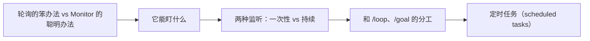

# Claude Code（17） - Monitor 工具与定时任务：盯后台不轮询

> 读完后，你应能完成以下任务：
> - 绘制“Claude Code（17） - Monitor 工具与定时任务：盯后台不轮询 / 轮询的笨办法 vs Monitor 的聪明办法”的关键对象与数据流，解释“第 15 章的 /loop 5m 看日志 是轮询：每隔一段去瞄一眼。”，并用源码位置、日志或 Trace 标注证据。
> - 为“Claude Code（17） - Monitor 工具与定时任务：盯后台不轮询 / 它能盯什么”设计正常与异常输入，验证“CI / PR 状态：轮询 PR 的 CI，过了/挂了马上知道；”，输出首个偏差位置与回归测试结果。
> - 实现“Claude Code（17） - Monitor 工具与定时任务：盯后台不轮询 / 两种监听：一次性 vs 持续”的最小代码或配置，检验“适合「等 CI 出结果」这类一次性等待。”，输出命令、结果与 Diff，并说明不适用边界。

> 本章目标：用 Monitor 工具让它监听后台进程，事件来了即时反应，不靠 sleep 轮询；了解定时任务。


---

<!-- article-progressive-block:start -->
# 一、先建立全局：Monitor 工具与定时任务：盯后台不轮询 是什么？

理解“Monitor 工具与定时任务：盯后台不轮询”，先要把标题中的对象放进同一条处理链：它接收什么输入，经过哪些状态变化，最终用什么证据判断结果。下表不另造概念，只把作者正文已经解释的章节按依赖顺序连起来。

“Monitor 工具与定时任务：盯后台不轮询”的第一个核心判断是：第 15 章的 /loop 5m 看日志 是轮询：每隔一段去瞄一眼。。先弄清这个判断中的对象和输入输出，后面的实现、故障和验收才有共同语境。

| 顺序 | 章节 | 读完本节应抓住的结论 |
| --- | --- | --- |
| 1 | 轮询的笨办法 vs Monitor 的聪明办法 | 第 15 章的 /loop 5m 看日志 是轮询：每隔一段去瞄一眼。 |
| 2 | 它能盯什么 | CI / PR 状态：轮询 PR 的 CI，过了/挂了马上知道； |
| 3 | 两种监听：一次性 vs 持续 | 适合「等 CI 出结果」这类一次性等待。 |
| 4 | 和 /loop、/goal 的分工 | 选择：要「实时不漏」→ Monitor； |
| 5 | 定时任务（scheduled tasks） | /loop 给固定间隔时，底层也是转成 cron 来调度。 |
| 6 | 常见错误 | 错误 3：监听脚本本身有副作用/高风险 |

## 1.1 核心对象之间怎样衔接



这张图只表达本文的讲解顺序，不替代正文机制。判断“Monitor 工具与定时任务：盯后台不轮询”是否真正掌握，需要能从最后一个结果沿图回到前面每个章节的输入、状态变化和证据。

## 1.2 再看失败：问题最早会出现在哪一步？

在“Monitor 工具与定时任务：盯后台不轮询”的对象和顺序已经明确后，再看可观察的失败：文本直通执行、状态不可重放或重试重复写入。定位时不从最后一条错误猜原因，而是沿上图找第一个偏离正文结论的节点。
<!-- article-progressive-block:end -->

# 二、轮询的笨办法 vs Monitor 的聪明办法

第 15 章的 `/loop 5m 看日志` 是**轮询**：每隔一段去瞄一眼。
问题是——隔太久错过时机，隔太密浪费。

**Monitor 工具**换了个思路：它在后台**跑一个监听脚本**，
把脚本的每一行输出**实时当成事件推给 Claude**。
有动静马上反应，没动静不空跑。
**事件驱动，不靠 sleep 轮询。
**

> 类比：轮询是「每 5 分钟去门口看有没有快递」；Monitor 是「装了门铃，来了自动响」。

> ⚠️ Monitor 是较新的内置工具（需要 Claude Code v2.1.98 及以上）。

---

# 三、它能盯什么

Monitor 适合「**持续产出、需要即时反应**」的东西：

- **CI / PR 状态**：轮询 PR 的 CI，过了/挂了马上知道；
- **训练任务**：盯着训练日志，出现 loss 异常或报错立刻报告；
- **dev server**：开发服务器崩了自动发现、自动处理；
- **日志文件**：tail 日志，出现 error 关键字即时反应；
- **目录变化**：监听文件改动。

每个事件都会作为一条新消息进对话，Claude **看到即可反应**，而不用暂停等待。

---

# 四、两种监听：一次性 vs 持续

Monitor 有个关键开关 `persistent`：

- **默认（非持续）**：盯到某个结果出现/脚本结束就停。适合「等 CI 出结果」这类一次性等待。
- **`persistent: true`（持续）**：盯一整个会话那么久。适合 **tail 日志**、长时间看 dev server 这类「一直要盯着」的。

它遵循和 Bash 一样的权限规则——监听脚本跑什么命令，受同样的权限把关。

---

# 五、和 /loop、/goal 的分工

三者都让它「自己持续干」，但侧重不同：

| 工具 | 机制 | 最适合 |
| --- | --- | --- |
| `/loop` | 定时反复跑一段提示 | 周期性检查、轮询 |
| `/goal` | 跨轮干到达标 | 奔着一个明确结果去 |
| **Monitor** | **事件驱动**，输出即反应 | **实时盯后台进程、出事即处理** |

> 选择：要「实时不漏」→ Monitor；要「周期看一眼」→ `/loop`；要「干到成」→ `/goal`。

---

# 六、定时任务（scheduled tasks）

除了会话内的循环和监听，
还可以把任务安排成**按时间触发**（cron 风格）：比如「每天早上生成一次昨天的 commit 总结」「每周一出一份周报」。
`/loop` 给固定间隔时，底层也是转成 cron 来调度。

定时任务把「自主运行」从「会话开着才跑」推进到「**到点自动跑**」，
是下一章 Automation 的基础。

---

# 七、常见错误

**错误 1：能用 Monitor 的事还在用密集 `/loop`**
要「实时不漏」的场景（崩溃、报错），轮询会漏。
→ 用事件驱动的 Monitor。

**错误 2：一次性等待却开了 persistent**
等个 CI 结果用默认即可，开 persistent 它会一直挂着。
→ 按「一次性 vs 持续」选对开关。

**错误 3：监听脚本本身有副作用/高风险**
Monitor 跟 Bash 一样受权限管，
但你仍要确保监听脚本是**安全只读**的（tail、status 查询），
别在里面塞改动操作。

**错误 4：以为 Monitor 能替代所有循环**
它擅长「盯输出流」。
纯周期性的「每天跑一次」用定时任务/`/loop` 更合适。

---

# 八、最佳实践

1. **实时场景用 Monitor**：崩溃、报错、状态翻转，事件驱动不漏不烦。
2. **选对 persistent**：一次性等待用默认，长期 tail 用 `persistent: true`。
3. **监听脚本保持只读**：tail、查状态即可，别带副作用。
4. **周期性用定时任务**：「每天/每周」这类交给 cron 式调度。
5. **三件套各就各位**：Monitor 实时盯、`/loop` 周期查、`/goal` 干到成。

---

# 九、动手实践：Demo 17 · Monitor 实战：盯一个会偶尔报错的日志

提供一个**模拟服务脚本**，会持续往日志里写行，偶尔写一条 ERROR。
用来让 Claude 用 Monitor 工具实时盯、出错即报。

## 9.1 文件
- `fake-service.sh`：模拟服务，每秒写一行日志，随机偶发 ERROR。
- `三件套对照.md`：Monitor vs /loop vs /goal 怎么选。

## 9.2 怎么练
1. 先跑起模拟服务，让它持续写日志：
   ```bash
   bash fake-service.sh
   ```
   （它会把日志写到 service.log，Ctrl+C 停止）
2. 另开一个 Claude 会话，在本目录让它用 Monitor 盯：
   ```
用 Monitor 工具持续监听 service.log，
一旦出现 ERROR 就立刻把那一行和上下文总结给我。
persistent 模式。
   ```
3. 体会：错误一出现，事件即时推给 Claude，它马上反应——不用轮询。

<!-- knowledge-practice-materials-merged -->

## 9.3 配套实践材料

以下材料已并入正文，便于阅读时直接对照和练习。

### 三件套对照.md

````markdown
# 自主运行三件套：怎么选

| 工具 | 机制 | 最适合 |
| --- | --- | --- |
| Monitor | 事件驱动，输出即反应 | 实时盯后台、出事即处理（崩溃/报错/状态翻转） |
| /loop | 定时反复跑提示 | 周期性检查、轮询 |
| /goal | 跨轮干到达标 | 奔着一个明确可验证的结果去 |

口诀：实时不漏→Monitor；周期看一眼→/loop；干到成→/goal。
````

<!-- article-progressive-block:start -->
# 十、动手验证：先跑通 Monitor 工具与定时任务：盯后台不轮询，再改变一个变量

前面的章节已经建立问题、概念和机制。现在把“Monitor 工具与定时任务：盯后台不轮询”放进同一套基线中运行；本节不再引入新术语，只验证前文结论能否被复现。

## 10.1 基线与候选只允许一个变量不同

验证“Monitor 工具与定时任务：盯后台不轮询”时，先固定工具 Schema、身份、畸形参数、超时和重复请求。候选方案只能改变本次要验证的变量；如果同时更换数据、依赖和配置，即使结果改善，也不能知道是哪一项产生作用。

执行“Monitor 工具与定时任务：盯后台不轮询”时，动作是：回放决策到执行链路，覆盖失败、重试、暂停和恢复。原始结果不能只保留截图或汇总分数，必须同步保存：模型提议、校验、授权、幂等键、状态迁移、Trace，使下一次复查可以在同一输入上重放。

| 实验要素 | 本文要求 |
| --- | --- |
| 固定条件 | 工具 Schema、身份、畸形参数、超时和重复请求 |
| 唯一变量 | 本次候选方案与基线之间的一项明确差异 |
| 原始证据 | 模型提议、校验、授权、幂等键、状态迁移、Trace |
| 通过阈值 | 模型只提议；执行受代码约束；失败不重复副作用 |
| 立即停止 | 文本直通执行、状态不可重放或重试重复写入 |

## 10.2 执行前先排除不可比较条件

“Monitor 工具与定时任务：盯后台不轮询”开始前先确认下面四项；任一项不成立，都应先修复实验条件，而不是解释结果。

- 基线能够在“Monitor 工具与定时任务：盯后台不轮询”的当前环境重复运行。
- 候选只改变一个与“Monitor 工具与定时任务：盯后台不轮询”结论直接相关的条件。
- “Monitor 工具与定时任务：盯后台不轮询”的基线和候选使用同一批输入、同一版本依赖与同一通过阈值。
- “Monitor 工具与定时任务：盯后台不轮询”的原始输出和失败现场不会被重试、格式化或汇总覆盖。

## 10.3 执行后先核对证据完整性

结果出来后先检查证据，再讨论“Monitor 工具与定时任务：盯后台不轮询”是否通过。缺少中间状态时，最终输出只能说明现象，不能证明机制。

| 检查项 | 当前文章的判定 |
| --- | --- |
| 输入可追溯 | 工具 Schema、身份、畸形参数、超时和重复请求 |
| 过程可回放 | 回放决策到执行链路，覆盖失败、重试、暂停和恢复 |
| 结果可审计 | 模型提议、校验、授权、幂等键、状态迁移、Trace |

“Monitor 工具与定时任务：盯后台不轮询”的一次合格基线对照按以下顺序执行：

1. 保存“Monitor 工具与定时任务：盯后台不轮询”基线版本及输入摘要，确认基线本身可以重复运行。
2. 写下“Monitor 工具与定时任务：盯后台不轮询”候选方案唯一变化的变量，以及它预期影响的指标。
3. 在同一环境执行“Monitor 工具与定时任务：盯后台不轮询”：回放决策到执行链路，覆盖失败、重试、暂停和恢复。
4. 为“Monitor 工具与定时任务：盯后台不轮询”保存：模型提议、校验、授权、幂等键、状态迁移、Trace。
5. 使用“Monitor 工具与定时任务：盯后台不轮询”预登记条件判断：模型只提议；执行受代码约束；失败不重复副作用。
6. 如果“Monitor 工具与定时任务：盯后台不轮询”未通过，不修改第二个变量，先恢复基线并保留失败现场。

# 十一、用一张矩阵验证 Monitor 工具与定时任务：盯后台不轮询 的关键结论

矩阵按正文顺序列出“Monitor 工具与定时任务：盯后台不轮询”的结论。一次实验只选择一行，只改变这一行对应的条件；不要把多行合并成一个无法归因的大实验。

| 正文章节 | 已解释的结论 | 本轮唯一变量 | 必须保存的证据 |
| --- | --- | --- | --- |
| 轮询的笨办法 vs Monitor 的聪明办法 | 第 15 章的 /loop 5m 看日志 是轮询：每隔一段去瞄一眼。 | 只改变与“轮询的笨办法 vs Monitor 的聪明办法”相关的条件 | 模型提议、校验、授权、幂等键、状态迁移、Trace |
| 它能盯什么 | CI / PR 状态：轮询 PR 的 CI，过了/挂了马上知道； | 只改变与“它能盯什么”相关的条件 | 模型提议、校验、授权、幂等键、状态迁移、Trace |
| 两种监听：一次性 vs 持续 | 适合「等 CI 出结果」这类一次性等待。 | 只改变与“两种监听：一次性 vs 持续”相关的条件 | 模型提议、校验、授权、幂等键、状态迁移、Trace |
| 和 /loop、/goal 的分工 | 选择：要「实时不漏」→ Monitor； | 只改变与“和 /loop、/goal 的分工”相关的条件 | 模型提议、校验、授权、幂等键、状态迁移、Trace |
| 定时任务（scheduled tasks） | /loop 给固定间隔时，底层也是转成 cron 来调度。 | 只改变与“定时任务（scheduled tasks）”相关的条件 | 模型提议、校验、授权、幂等键、状态迁移、Trace |
| 常见错误 | 错误 3：监听脚本本身有副作用/高风险 | 只改变与“常见错误”相关的条件 | 模型提议、校验、授权、幂等键、状态迁移、Trace |

## 11.1 记录本次实际实验

下面的记录用于“Monitor 工具与定时任务：盯后台不轮询”当前这一次实验，不是第二套知识目录。先从矩阵选择一个章节，再填写实际值；没有填写的字段表示尚未验证。

```yaml
topic: "Monitor 工具与定时任务：盯后台不轮询"
selected_chapter: required
claim_from_article: required
baseline_version: required
changed_condition: exactly_one
execution: "回放决策到执行链路，覆盖失败、重试、暂停和恢复"
evidence: "模型提议、校验、授权、幂等键、状态迁移、Trace"
pass_when: "模型只提议；执行受代码约束；失败不重复副作用"
stop_when: "文本直通执行、状态不可重放或重试重复写入"
observed_result: required
first_deviation: null_or_evidence
recovery_replay: required_after_failure
```

## 11.2 边界实验必须证明能够停止和恢复

成功路径只能证明“Monitor 工具与定时任务：盯后台不轮询”在当前样本上工作，不能证明它可以进入生产。边界实验需要主动制造：文本直通执行、状态不可重放或重试重复写入，并观察系统是否在产生不可逆副作用前停止。

| 场景 | 只改变什么 | 应保存什么 | 通过标准 |
| --- | --- | --- | --- |
| 正常路径 | 使用已知有效输入 | 模型提议、校验、授权、幂等键、状态迁移、Trace | 模型只提议；执行受代码约束；失败不重复副作用 |
| 边界路径 | 把一个输入推进到约束临界值 | 临界值前后的输出与指标 | 不静默降级，不把部分结果冒充成功 |
| 明确失败 | 注入：文本直通执行、状态不可重放或重试重复写入 | 原始错误、首个异常阶段和最终状态 | 失败被正确分类且没有扩大副作用 |
| 恢复重放 | 执行：关闭副作用入口，恢复检查点，补充失败契约测试 | 原失败样本的复测证据 | 原样本恢复，正常样本没有回归 |

恢复动作不是简单重启。对于“Monitor 工具与定时任务：盯后台不轮询”，第一步是：关闭副作用入口，恢复检查点，补充失败契约测试。完成后使用原始失败样本复测；只验证一个新样本成功，不能证明触发条件已经消失。

“Monitor 工具与定时任务：盯后台不轮询”边界实验结束后，应把正常、临界、失败和恢复四类记录放在同一个运行批次中。这样才能区分“候选方案真的修复问题”和“环境变化让问题暂时没有出现”。

# 十二、Monitor 工具与定时任务：盯后台不轮询 的结果解释

解释“Monitor 工具与定时任务：盯后台不轮询”实验时先看首个偏差，而不是最后一条错误。最后的异常通常只是上游状态错误的结果；从末端反推容易误把症状当根因。

| 观察结果 | 可以支持的判断 | 下一步 |
| --- | --- | --- |
| 主链路没有达到预期 | 文本直通执行、状态不可重放或重试重复写入 | 先执行：关闭副作用入口，恢复检查点，补充失败契约测试 |
| 异常链路无法恢复 | 文本直通执行、状态不可重放或重试重复写入 | 先执行：关闭副作用入口，恢复检查点，补充失败契约测试 |
| 新样本成功但原样本仍失败 | 修复没有覆盖原始触发条件 | 固定原失败输入，恢复基线后重新比较 |
| 指标改善但证据无法回链 | 数据、版本或中间状态没有固定 | 暂停发布，补齐可追溯记录后重跑 |

“Monitor 工具与定时任务：盯后台不轮询”只有同时满足“模型只提议；执行受代码约束；失败不重复副作用”，并且没有出现“文本直通执行、状态不可重放或重试重复写入”，才可以认为主链路通过。这里的“通过”只对当前固定版本、样本和环境有效，不能外推到尚未测试的容量、权限或数据分布。

如果“Monitor 工具与定时任务：盯后台不轮询”候选方案与基线差异很小，先检查证据分辨率是否足够；如果差异很大，先排除数据泄漏、环境漂移和版本不一致。两种情况都不能只看一个汇总均值，需要回到逐样本输出和中间状态。

“Monitor 工具与定时任务：盯后台不轮询”故障定位完成后，记录“现象、首个偏差、根因、改动、原样本复测”五项。缺少原样本复测时，只能标记为待观察，不能标记为已解决。

# 十三、Monitor 工具与定时任务：盯后台不轮询 的发布判断

发布判断需要把“Monitor 工具与定时任务：盯后台不轮询”的质量、失败边界和恢复能力放在同一份记录中。以下任一条件缺失，都应停止扩量，而不是用“基本正常”替代证据。

- [ ] “Monitor 工具与定时任务：盯后台不轮询”的基线与候选只存在一个计划内变量。
- [ ] “Monitor 工具与定时任务：盯后台不轮询”的输入、代码、依赖、配置和数据版本可以追溯。
- [ ] “Monitor 工具与定时任务：盯后台不轮询”的正常、临界、失败和恢复样本使用同一套断言。
- [ ] “Monitor 工具与定时任务：盯后台不轮询”的原始输出、中间状态和失败现场已经保留。
- [ ] “Monitor 工具与定时任务：盯后台不轮询”的日志、Trace、截图和测试数据已经脱敏。
- [ ] “Monitor 工具与定时任务：盯后台不轮询”的停止条件、负责人和回滚入口已经演练。
- [ ] “Monitor 工具与定时任务：盯后台不轮询”尚未覆盖的输入、权限、容量和外部依赖已经登记。

最终记录至少包含基线版本、唯一变量、原始证据、首个偏差、恢复复测和发布责任人。没有参与本次修改的人如果不能据此重放“Monitor 工具与定时任务：盯后台不轮询”的判断，就不能发布。
<!-- article-progressive-block:end -->

# 十四、总结

- **轮询的笨办法 vs Monitor 的聪明办法**：第 15 章的 /loop 5m 看日志 是轮询：每隔一段去瞄一眼。
- **它能盯什么**：Monitor 适合「持续产出、需要即时反应」的东西：
- **两种监听：一次性 vs 持续**：适合「等 CI 出结果」这类一次性等待。
- **和 /loop、/goal 的分工**：| 工具 | 机制 | 最适合 |
- **定时任务（scheduled tasks）**：/loop 给固定间隔时，底层也是转成 cron 来调度。
- **常见错误**：错误 3：监听脚本本身有副作用/高风险

## 参考资料

- [Claude Code 文档](https://docs.anthropic.com/en/docs/claude-code/overview)
- [Claude Code 安全](https://docs.anthropic.com/en/docs/claude-code/security)
