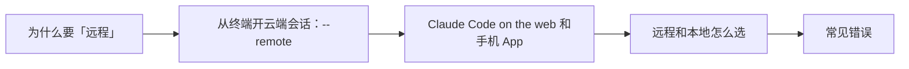

# Claude Code（19） - 远程控制：Web / 手机 App / --remote 并行云任务

> 读完后，你应能完成以下任务：
> - 绘制“Claude Code（19） - 远程控制：Web / 手机 App / --remote 并行云任务 / 为什么要「远程」”的关键对象与数据流，解释“你离开了电脑，想用手机看看任务进度、发个指示；”，并用源码位置、日志或 Trace 标注证据。
> - 为“Claude Code（19） - 远程控制：Web / 手机 App / --remote 并行云任务 / 从终端开云端会话：--remote”设计正常与异常输入，验证“这会在云端创建一个会话开始干活，不占用你本地终端。”，输出首个偏差位置与回归测试结果。
> - 实现“Claude Code（19） - 远程控制：Web / 手机 App / --remote 并行云任务 / 多个云任务并行”的最小代码或配置，检验“三件事在云端并行推进，互不干扰，你本地该干嘛干嘛。”，输出命令、结果与 Diff，并说明不适用边界。

> 本章目标：用 `claude --remote "..."` 从终端开云端会话；了解 Claude Code on the web 和手机 App。


---

<!-- article-progressive-block:start -->
# 一、先建立全局：远程控制：Web / 手机 App / --remote 并行云任务 是什么？

理解“远程控制：Web / 手机 App / --remote 并行云任务”，先要把标题中的对象放进同一条处理链：它接收什么输入，经过哪些状态变化，最终用什么证据判断结果。下表不另造概念，只把作者正文已经解释的章节按依赖顺序连起来。

“远程控制：Web / 手机 App / --remote 并行云任务”的第一个核心判断是：你离开了电脑，想用手机看看任务进度、发个指示；。先弄清这个判断中的对象和输入输出，后面的实现、故障和验收才有共同语境。

| 顺序 | 章节 | 读完本节应抓住的结论 |
| --- | --- | --- |
| 1 | 为什么要「远程」 | 你离开了电脑，想用手机看看任务进度、发个指示； |
| 2 | 从终端开云端会话：--remote | 这会在云端创建一个会话开始干活，不占用你本地终端。 |
| 3 | Claude Code on the web 和手机 App | Web 版（claude.ai/code）：浏览器里就能开会话、看进度、发指令，不用终端。 |
| 4 | 远程和本地怎么选 | 经验：能独立在云端跑完、且你想随处跟进的活 → 远程； |
| 5 | 常见错误 | 你不在电脑前盯着，它更需要清晰的指令和验证方式（回顾第 03 章）。 |
| 6 | 最佳实践 | 长任务上云：想关电脑、想腾出本地资源的活，--remote 丢云端。 -> 远程指令更自包含：你不在旁边，把目标、边界、验证方式一次说清。 -> 多设备接力：终端/网页派活，手机巡检决策，电脑收尾。 -> 按依赖选场地：依赖本地环境的留本地，能独立跑的上云。 |

## 1.1 核心对象之间怎样衔接



这张图只表达本文的讲解顺序，不替代正文机制。判断“远程控制：Web / 手机 App / --remote 并行云任务”是否真正掌握，需要能从最后一个结果沿图回到前面每个章节的输入、状态变化和证据。

## 1.2 再看失败：问题最早会出现在哪一步？

在“远程控制：Web / 手机 App / --remote 并行云任务”的对象和顺序已经明确后，再看可观察的失败：条件缺失、结果不可复现或失败后责任不清。定位时不从最后一条错误猜原因，而是沿上图找第一个偏离正文结论的节点。
<!-- article-progressive-block:end -->

# 二、为什么要「远程」

前面所有玩法都跑在你本地终端。但有时候：

- 你想让一个长任务在**云端**跑，关掉笔记本它也继续；
- 你**离开了电脑**，想用手机看看任务进度、发个指示；
- 你想**同时开好几个云任务**，不占本地资源。

这就是远程能力解决的事——**让 Claude Code 脱离你这台终端，
在云端干活，
你随处可控。
**

---

# 三、从终端开云端会话：--remote

最简单的入口，一行命令把任务丢到 claude.ai 云端跑：

```bash
claude --remote "修复 auth.spec.ts 里那个不稳定的测试"
```

这会在云端创建一个会话开始干活，**不占用你本地终端**。

## 3.1 多个云任务并行

连发多条 `--remote`，每条都是**独立的云会话**，同时跑：

```bash
claude --remote "修复 auth.spec.ts 的 flaky 测试"
claude --remote "更新 API 文档"
claude --remote "把 logger 重构成结构化输出"
```

三件事在云端并行推进，互不干扰，你本地该干嘛干嘛。

---

# 四、Claude Code on the web 和手机 App

除了从终端发起，你还能直接在**网页**和**手机**上用：

- **Web 版**（claude.ai/code）：浏览器里就能开会话、看进度、发指令，不用终端。
- **手机 App**：通勤、开会间隙，掏出手机就能看云任务跑到哪了、卡住没、要不要你拍板，随手回复推进。

典型节奏：**用 `--remote` 或网页派活 → 离开电脑 → 手机上巡检和决策 → 回到电脑收尾。
** 任务全程在云端，你只是换了不同设备去「遥控」。

---

# 五、远程和本地怎么选

| 场景 | 用本地 | 用远程 |
| --- | --- | --- |
| 长任务、想关电脑 | | ✅ 云端跑 |
| 离开工位还想跟进 | | ✅ 手机/网页 |
| 同时跑多个独立任务又不想占本地 | | ✅ 多条 --remote |
| 需要频繁本地调试、看本地环境 | ✅ | |
| 涉及本地专有环境/未推送的代码 | ✅ | |

> 经验：**能独立在云端跑完、且你想随处跟进的活 → 远程；强依赖本地环境的 → 本地。**

---

# 六、常见错误

**错误 1：把强依赖本地环境的任务丢云端**
任务需要你本地的某个服务、某份没推送的配置 → 云端跑不起来。
→ 这类留本地。

**错误 2：远程派活却描述含糊**
你不在电脑前盯着，它更需要清晰的指令和验证方式（回顾第 03 章）。
→ 远程任务**指令要更自包含**。

**错误 3：一口气开十几个云任务管不过来**
并行虽爽，但都要你最终审查。→ 控制数量，配合手机巡检。

**错误 4：以为远程任务能读到你本地未提交的改动**
云端会话基于仓库，不一定有你本地未推送的东西。→ 需要的代码先推上去。

---

# 七、最佳实践

1. **长任务上云**：想关电脑、想腾出本地资源的活，`--remote` 丢云端。
2. **远程指令更自包含**：你不在旁边，把目标、边界、验证方式一次说清。
3. **多设备接力**：终端/网页派活，手机巡检决策，电脑收尾。
4. **按依赖选场地**：依赖本地环境的留本地，能独立跑的上云。
5. **控制并发**：云任务也要你审查，别开到自己看不过来。

---

# 八、动手实践：Demo 19 · 远程控制速查

## 8.1 文件
- `remote速查.md`：--remote 用法、多设备接力节奏、本地vs远程选型。

## 8.2 怎么用
照速查在终端试 `claude --remote "..."`，
再在手机 App / 网页上巡检同一批任务。

## 8.3 实践目标

本 Lab 用最小输入验证“Demo 19 · 远程控制速查”的核心行为。
再只修改一个参数或一个分支，比较结果差异。

## 8.4 实践验收


## 8.5 常见问题


<!-- knowledge-practice-materials-merged -->

## 8.6 配套实践材料

以下材料已并入正文，便于阅读时直接对照和练习。

### remote速查.md

````markdown
# 远程控制速查

## 从终端开云端会话
claude --remote "修复 auth.spec.ts 里那个 flaky 测试"

## 多个云任务并行（连发多条，各自独立）
claude --remote "修复 flaky 测试"
claude --remote "更新 API 文档"
claude --remote "重构 logger 为结构化输出"

## 多设备接力节奏
终端/网页派活 → 离开电脑 → 手机巡检+决策 → 回电脑收尾

## 本地 vs 远程
- 长任务、想关电脑、想腾本地资源 → 远程
- 强依赖本地环境/未推送代码 → 本地
- 远程任务：指令要更自包含（目标+边界+验证一次说清）
- 需要的代码先推上去，云端基于仓库
````

<!-- article-progressive-block:start -->
# 九、动手验证：先跑通 远程控制：Web / 手机 App / --remote 并行云任务，再改变一个变量

前面的章节已经建立问题、概念和机制。现在把“远程控制：Web / 手机 App / --remote 并行云任务”放进同一套基线中运行；本节不再引入新术语，只验证前文结论能否被复现。

## 9.1 基线与候选只允许一个变量不同

验证“远程控制：Web / 手机 App / --remote 并行云任务”时，先固定样本、基线、候选、成功标准和失败边界。候选方案只能改变本次要验证的变量；如果同时更换数据、依赖和配置，即使结果改善，也不能知道是哪一项产生作用。

执行“远程控制：Web / 手机 App / --remote 并行云任务”时，动作是：同环境运行基线与候选，记录输入、中间状态和异常。原始结果不能只保留截图或汇总分数，必须同步保存：可重放命令、结构化日志、输出 Diff、失败样本、版本，使下一次复查可以在同一输入上重放。

| 实验要素 | 本文要求 |
| --- | --- |
| 固定条件 | 固定样本、基线、候选、成功标准和失败边界 |
| 唯一变量 | 本次候选方案与基线之间的一项明确差异 |
| 原始证据 | 可重放命令、结构化日志、输出 Diff、失败样本、版本 |
| 通过阈值 | 结果符合结论条件，异常输入可解释、可恢复 |
| 立即停止 | 条件缺失、结果不可复现或失败后责任不清 |

## 9.2 执行前先排除不可比较条件

“远程控制：Web / 手机 App / --remote 并行云任务”开始前先确认下面四项；任一项不成立，都应先修复实验条件，而不是解释结果。

- 基线能够在“远程控制：Web / 手机 App / --remote 并行云任务”的当前环境重复运行。
- 候选只改变一个与“远程控制：Web / 手机 App / --remote 并行云任务”结论直接相关的条件。
- “远程控制：Web / 手机 App / --remote 并行云任务”的基线和候选使用同一批输入、同一版本依赖与同一通过阈值。
- “远程控制：Web / 手机 App / --remote 并行云任务”的原始输出和失败现场不会被重试、格式化或汇总覆盖。

## 9.3 执行后先核对证据完整性

结果出来后先检查证据，再讨论“远程控制：Web / 手机 App / --remote 并行云任务”是否通过。缺少中间状态时，最终输出只能说明现象，不能证明机制。

| 检查项 | 当前文章的判定 |
| --- | --- |
| 输入可追溯 | 固定样本、基线、候选、成功标准和失败边界 |
| 过程可回放 | 同环境运行基线与候选，记录输入、中间状态和异常 |
| 结果可审计 | 可重放命令、结构化日志、输出 Diff、失败样本、版本 |

“远程控制：Web / 手机 App / --remote 并行云任务”的一次合格基线对照按以下顺序执行：

1. 保存“远程控制：Web / 手机 App / --remote 并行云任务”基线版本及输入摘要，确认基线本身可以重复运行。
2. 写下“远程控制：Web / 手机 App / --remote 并行云任务”候选方案唯一变化的变量，以及它预期影响的指标。
3. 在同一环境执行“远程控制：Web / 手机 App / --remote 并行云任务”：同环境运行基线与候选，记录输入、中间状态和异常。
4. 为“远程控制：Web / 手机 App / --remote 并行云任务”保存：可重放命令、结构化日志、输出 Diff、失败样本、版本。
5. 使用“远程控制：Web / 手机 App / --remote 并行云任务”预登记条件判断：结果符合结论条件，异常输入可解释、可恢复。
6. 如果“远程控制：Web / 手机 App / --remote 并行云任务”未通过，不修改第二个变量，先恢复基线并保留失败现场。

# 十、用一张矩阵验证 远程控制：Web / 手机 App / --remote 并行云任务 的关键结论

矩阵按正文顺序列出“远程控制：Web / 手机 App / --remote 并行云任务”的结论。一次实验只选择一行，只改变这一行对应的条件；不要把多行合并成一个无法归因的大实验。

| 正文章节 | 已解释的结论 | 本轮唯一变量 | 必须保存的证据 |
| --- | --- | --- | --- |
| 为什么要「远程」 | 你离开了电脑，想用手机看看任务进度、发个指示； | 只改变与“为什么要「远程」”相关的条件 | 可重放命令、结构化日志、输出 Diff、失败样本、版本 |
| 从终端开云端会话：--remote | 这会在云端创建一个会话开始干活，不占用你本地终端。 | 只改变与“从终端开云端会话：--remote”相关的条件 | 可重放命令、结构化日志、输出 Diff、失败样本、版本 |
| Claude Code on the web 和手机 App | Web 版（claude.ai/code）：浏览器里就能开会话、看进度、发指令，不用终端。 | 只改变与“Claude Code on the web 和手机 App”相关的条件 | 可重放命令、结构化日志、输出 Diff、失败样本、版本 |
| 远程和本地怎么选 | 经验：能独立在云端跑完、且你想随处跟进的活 → 远程； | 只改变与“远程和本地怎么选”相关的条件 | 可重放命令、结构化日志、输出 Diff、失败样本、版本 |
| 常见错误 | 你不在电脑前盯着，它更需要清晰的指令和验证方式（回顾第 03 章）。 | 只改变与“常见错误”相关的条件 | 可重放命令、结构化日志、输出 Diff、失败样本、版本 |
| 最佳实践 | 长任务上云：想关电脑、想腾出本地资源的活，--remote 丢云端。 -> 远程指令更自包含：你不在旁边，把目标、边界、验证方式一次说清。 -> 多设备接力：终端/网页派活，手机巡检决策，电脑收尾。 -> 按依赖选场地：依赖本地环境的留本地，能独立跑的上云。 | 只改变与“最佳实践”相关的条件 | 可重放命令、结构化日志、输出 Diff、失败样本、版本 |

## 10.1 记录本次实际实验

下面的记录用于“远程控制：Web / 手机 App / --remote 并行云任务”当前这一次实验，不是第二套知识目录。先从矩阵选择一个章节，再填写实际值；没有填写的字段表示尚未验证。

```yaml
topic: "远程控制：Web / 手机 App / --remote 并行云任务"
selected_chapter: required
claim_from_article: required
baseline_version: required
changed_condition: exactly_one
execution: "同环境运行基线与候选，记录输入、中间状态和异常"
evidence: "可重放命令、结构化日志、输出 Diff、失败样本、版本"
pass_when: "结果符合结论条件，异常输入可解释、可恢复"
stop_when: "条件缺失、结果不可复现或失败后责任不清"
observed_result: required
first_deviation: null_or_evidence
recovery_replay: required_after_failure
```

## 10.2 边界实验必须证明能够停止和恢复

成功路径只能证明“远程控制：Web / 手机 App / --remote 并行云任务”在当前样本上工作，不能证明它可以进入生产。边界实验需要主动制造：条件缺失、结果不可复现或失败后责任不清，并观察系统是否在产生不可逆副作用前停止。

| 场景 | 只改变什么 | 应保存什么 | 通过标准 |
| --- | --- | --- | --- |
| 正常路径 | 使用已知有效输入 | 可重放命令、结构化日志、输出 Diff、失败样本、版本 | 结果符合结论条件，异常输入可解释、可恢复 |
| 边界路径 | 把一个输入推进到约束临界值 | 临界值前后的输出与指标 | 不静默降级，不把部分结果冒充成功 |
| 明确失败 | 注入：条件缺失、结果不可复现或失败后责任不清 | 原始错误、首个异常阶段和最终状态 | 失败被正确分类且没有扩大副作用 |
| 恢复重放 | 执行：保留基线，缩小变量；根因确认前不扩大范围 | 原失败样本的复测证据 | 原样本恢复，正常样本没有回归 |

恢复动作不是简单重启。对于“远程控制：Web / 手机 App / --remote 并行云任务”，第一步是：保留基线，缩小变量；根因确认前不扩大范围。完成后使用原始失败样本复测；只验证一个新样本成功，不能证明触发条件已经消失。

“远程控制：Web / 手机 App / --remote 并行云任务”边界实验结束后，应把正常、临界、失败和恢复四类记录放在同一个运行批次中。这样才能区分“候选方案真的修复问题”和“环境变化让问题暂时没有出现”。

# 十一、远程控制：Web / 手机 App / --remote 并行云任务 的结果解释

解释“远程控制：Web / 手机 App / --remote 并行云任务”实验时先看首个偏差，而不是最后一条错误。最后的异常通常只是上游状态错误的结果；从末端反推容易误把症状当根因。

| 观察结果 | 可以支持的判断 | 下一步 |
| --- | --- | --- |
| 主链路没有达到预期 | 条件缺失、结果不可复现或失败后责任不清 | 先执行：保留基线，缩小变量；根因确认前不扩大范围 |
| 异常链路无法恢复 | 条件缺失、结果不可复现或失败后责任不清 | 先执行：保留基线，缩小变量；根因确认前不扩大范围 |
| 新样本成功但原样本仍失败 | 修复没有覆盖原始触发条件 | 固定原失败输入，恢复基线后重新比较 |
| 指标改善但证据无法回链 | 数据、版本或中间状态没有固定 | 暂停发布，补齐可追溯记录后重跑 |

“远程控制：Web / 手机 App / --remote 并行云任务”只有同时满足“结果符合结论条件，异常输入可解释、可恢复”，并且没有出现“条件缺失、结果不可复现或失败后责任不清”，才可以认为主链路通过。这里的“通过”只对当前固定版本、样本和环境有效，不能外推到尚未测试的容量、权限或数据分布。

如果“远程控制：Web / 手机 App / --remote 并行云任务”候选方案与基线差异很小，先检查证据分辨率是否足够；如果差异很大，先排除数据泄漏、环境漂移和版本不一致。两种情况都不能只看一个汇总均值，需要回到逐样本输出和中间状态。

“远程控制：Web / 手机 App / --remote 并行云任务”故障定位完成后，记录“现象、首个偏差、根因、改动、原样本复测”五项。缺少原样本复测时，只能标记为待观察，不能标记为已解决。

# 十二、远程控制：Web / 手机 App / --remote 并行云任务 的发布判断

发布判断需要把“远程控制：Web / 手机 App / --remote 并行云任务”的质量、失败边界和恢复能力放在同一份记录中。以下任一条件缺失，都应停止扩量，而不是用“基本正常”替代证据。

- [ ] “远程控制：Web / 手机 App / --remote 并行云任务”的基线与候选只存在一个计划内变量。
- [ ] “远程控制：Web / 手机 App / --remote 并行云任务”的输入、代码、依赖、配置和数据版本可以追溯。
- [ ] “远程控制：Web / 手机 App / --remote 并行云任务”的正常、临界、失败和恢复样本使用同一套断言。
- [ ] “远程控制：Web / 手机 App / --remote 并行云任务”的原始输出、中间状态和失败现场已经保留。
- [ ] “远程控制：Web / 手机 App / --remote 并行云任务”的日志、Trace、截图和测试数据已经脱敏。
- [ ] “远程控制：Web / 手机 App / --remote 并行云任务”的停止条件、负责人和回滚入口已经演练。
- [ ] “远程控制：Web / 手机 App / --remote 并行云任务”尚未覆盖的输入、权限、容量和外部依赖已经登记。

最终记录至少包含基线版本、唯一变量、原始证据、首个偏差、恢复复测和发布责任人。没有参与本次修改的人如果不能据此重放“远程控制：Web / 手机 App / --remote 并行云任务”的判断，就不能发布。
<!-- article-progressive-block:end -->

# 十三、总结

- **为什么要「远程」**：你离开了电脑，想用手机看看任务进度、发个指示；
- **从终端开云端会话：--remote**：连发多条 --remote，每条都是独立的云会话，同时跑：
- **Claude Code on the web 和手机 App**：Web 版（claude.ai/code）：浏览器里就能开会话、看进度、发指令，不用终端。
- **远程和本地怎么选**：| 场景 | 用本地 | 用远程 |
- **常见错误**：你不在电脑前盯着，它更需要清晰的指令和验证方式（回顾第 03 章）。
- **最佳实践**：长任务上云：想关电脑、想腾出本地资源的活，--remote 丢云端。 -> 远程指令更自包含：你不在旁边，把目标、边界、验证方式一次说清。 -> 多设备接力：终端/网页派活，手机巡检决策，电脑收尾。 -> 按依赖选场地：依赖本地环境的留本地，能独立跑的上云。

## 参考资料

- [Claude Code 文档](https://docs.anthropic.com/en/docs/claude-code/overview)
- [Claude Code 安全](https://docs.anthropic.com/en/docs/claude-code/security)
