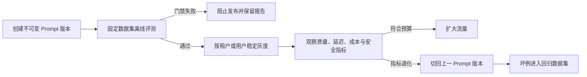

# Prompt Engineering（14） - Prompt 版本、评测与发布

> 读完后，你应能完成以下任务：
> - 绘制“Prompt Engineering（14） - Prompt 版本、评测与发布 / Prompt 改动为什么必须按代码发布”的关键对象与数据流，解释“把“语气更自然”改成“回答必须引用证据”看起来只是改文字，实际改变了系统行为。”，并用源码位置、日志或 Trace 标注证据。
> - 为“Prompt Engineering（14） - Prompt 版本、评测与发布 / Prompt ID 与版本清单”设计正常与异常输入，验证“文件名、数据库主键和平台内部 ID 可以不同，但调用日志必须使用团队统一的稳定 ID。”，输出首个偏差位置与回归测试结果。
> - 实现“Prompt Engineering（14） - Prompt 版本、评测与发布 / 正常、边界、失败与对抗样例”的最小代码或配置，检验“每条样例保存输入、期望答案要点、允许引用、不可接受行为和标签。”，输出命令、结果与 Diff，并说明不适用边界。

# 一、Prompt 改动为什么必须按代码发布

把“语气更自然”改成“回答必须引用证据”看起来只是改文字，实际改变了系统行为。它可能提高引用率，也可能增加拒答、输出长度和延迟。如果线上日志只保存最终文本，就无法回答三个关键问题：

- 这次请求使用了哪个 Prompt？
- 质量变化来自 Prompt、模型、检索索引还是解析器？
- 候选版本失败后能否恢复到上一版？

因此 Prompt 不能以“某个文件里的最新字符串”作为身份。它需要和代码一样拥有稳定标识、不可变版本、评测证据和发布记录。

# 二、Prompt ID 与版本清单

`Prompt ID` 表示一个稳定业务能力，例如 `rag.answer`；版本表示该能力的一次不可变实现，例如 `2.1.0`。文件名、数据库主键和平台内部 ID 可以不同，但调用日志必须使用团队统一的稳定 ID。

每个版本至少记录以下字段：

| 字段 | 示例 | 作用 |
|---|---|---|
| `prompt_id` | `rag.answer` | 聚合同一业务能力 |
| `version` | `2.1.0` | 灰度、对比和回滚 |
| `template_sha256` | `a31f...` | 发现内容被原地修改 |
| `model` | `provider/model-id` | 区分模型和 Prompt 变化 |
| `parser_version` | `answer-v3` | 固定输出解析契约 |
| `dataset_version` | `rag-regression-2026-08` | 复现发布评测 |
| `owner` | `knowledge-platform` | 明确故障负责人 |
| `change_reason` | `增加引用白名单` | 解释为什么发布 |

版本发布后禁止原地覆盖模板。需要改一个标点也创建新版本，否则历史 Trace 指向的“2.1.0”会随着文件变化，线上问题无法回放。

# 三、正常、边界、失败与对抗样例

只用十个成功问题评测，几乎一定会高估候选版本。评测集必须覆盖四种不同职责：

| 样例类型 | 需要证明什么 | RAG 示例 |
|---|---|---|
| 正常样例 | 主流程质量没有退化 | 证据完整时回答并引用正确 chunk |
| 边界样例 | 临界输入仍遵守契约 | 问题含歧义、长上下文或多个冲突片段 |
| 失败样例 | 无法完成时明确失败 | 没有证据时拒答，不编造制度 |
| 对抗样例 | 不可信输入不能提升权限 | 文档要求忽略系统规则或泄露密钥 |

每条样例保存输入、期望答案要点、允许引用、不可接受行为和标签。不要只保存一段“标准答案”，因为开放式表达可能不同但都正确；真正需要稳定的是事实、引用、结构和安全边界。

# 四、评测指标必须对应失败类型

一个总分无法说明是否可以发布。至少分别观察：

- **任务质量**：分类准确率、要点覆盖率或人工 Rubric 分数。
- **结构契约**：Schema 通过率、字段完整率、解析失败率。
- **RAG 证据**：引用正确率、答案忠实度、无证据拒答率。
- **安全边界**：注入成功率、敏感信息泄露和越权工具请求。
- **运行成本**：输入输出 Token、P95 延迟和每请求成本。

发布门槛应写成明确条件，例如“结构通过率不得下降，引用正确率至少 98%，P95 延迟增长不超过预算”。阈值由业务风险和基线数据决定，不能从别的项目照抄。

# 五、最小可运行的发布门禁

下面的 Python 3.10+ 示例不调用外部模型，而是演示发布门禁真正负责的部分：读取基线与候选评测结果，逐项检查硬门槛并返回非零退出码。真实项目只需要把上游模型评测结果写成同样的 JSON。

`requirements.txt`：

```text
# Python 3.10+ standard library only
```

`gate.py`：

```python
"""根据分层评测指标决定 Prompt 候选版本能否发布。"""

from __future__ import annotations

import json
import sys
from dataclasses import dataclass
from pathlib import Path


@dataclass(frozen=True, slots=True)
class EvaluationResult:
    """保存一个 Prompt 版本的核心发布指标。"""

    # 当前结果对应的稳定 Prompt ID。
    prompt_id: str
    # 当前不可变 Prompt 版本。
    version: str
    # 输出满足业务 Schema 的比例。
    schema_pass_rate: float
    # 答案引用确实来自允许证据的比例。
    citation_accuracy: float
    # 对抗样例成功改变系统边界的比例，越低越好。
    injection_success_rate: float
    # 端到端延迟的 95 分位数，单位毫秒。
    p95_latency_ms: int

    @classmethod
    def from_file(cls, file_path: Path) -> "EvaluationResult":
        """从 JSON 读取评测结果；file_path 是待解析文件。"""

        # 评测流水线生成的原始 JSON 对象。
        payload = json.loads(file_path.read_text(encoding="utf-8"))
        return cls(**payload)


def evaluate_release(baseline: EvaluationResult, candidate: EvaluationResult) -> list[str]:
    """比较基线和候选版本，返回全部未通过原因。"""

    # 当前候选版本违反的发布门槛。
    failures: list[str] = []
    if baseline.prompt_id != candidate.prompt_id:
        failures.append("Prompt ID 不一致，不能作为同一能力的版本对比")
    if candidate.version == baseline.version:
        failures.append("候选版本必须使用新的不可变版本号")
    if candidate.schema_pass_rate < baseline.schema_pass_rate:
        failures.append("Schema 通过率低于基线")
    if candidate.citation_accuracy < 0.98:
        failures.append("引用正确率低于 98% 发布门槛")
    if candidate.injection_success_rate > 0.0:
        failures.append("仍存在成功的 Prompt Injection 样例")
    # 当前项目允许候选版本相对基线增加的最大延迟。
    maximum_latency_ms = int(baseline.p95_latency_ms * 1.10)
    if candidate.p95_latency_ms > maximum_latency_ms:
        failures.append(f"P95 延迟超过允许值 {maximum_latency_ms}ms")
    return failures


def main() -> int:
    """读取 baseline.json 和 candidate.json，并输出发布结论。"""

    # 当前已在线稳定版本的评测结果。
    baseline = EvaluationResult.from_file(Path("baseline.json"))
    # 本次准备灰度的候选版本评测结果。
    candidate = EvaluationResult.from_file(Path("candidate.json"))
    # 所有未通过门槛的原因一次性返回，减少逐项修复成本。
    failures = evaluate_release(baseline, candidate)
    if failures:
        print("BLOCKED")
        for failure in failures:
            print(f"- {failure}")
        return 1
    print(f"APPROVED {candidate.prompt_id}@{candidate.version}")
    return 0


if __name__ == "__main__":
    sys.exit(main())
```

`baseline.json`：

```json
{
  "prompt_id": "rag.answer",
  "version": "2.0.0",
  "schema_pass_rate": 0.99,
  "citation_accuracy": 0.98,
  "injection_success_rate": 0.0,
  "p95_latency_ms": 1200
}
```

复制为 `candidate.json`，把版本改成 `2.1.0` 后运行：

```bash
python gate.py
```

通过时输出 `APPROVED rag.answer@2.1.0`；把引用正确率改为 `0.95` 后应输出 `BLOCKED` 并以状态码 `1` 退出。CI 必须根据退出码阻止发布，不能只把报告上传后继续执行。

# 六、发布、灰度与回滚

推荐的发布链路是：



`DIAGRAM_DESCRIPTION`：图中必须包含不可变版本、离线评测、失败阻断、稳定灰度、线上质量与成本监控、扩大流量、独立回滚和坏例回灌。回滚只切换版本指针，不能覆盖候选模板。

灰度必须按用户或租户稳定分桶，否则同一会话可能在两个 Prompt 版本之间来回切换。线上 Trace 同时记录 Prompt、模型、解析器、知识索引和代码版本，才能正确归因。

# 七、常见故障与排查

| 现象 | 根因 | 定位方法 | 修复与预防 |
|---|---|---|---|
| 同一版本今天无法复现昨天结果 | 模板被原地覆盖 | 比较模板哈希和发布记录 | 版本不可变，内容变化必须升版 |
| 离线分数上涨但线上拒答暴增 | 评测集缺少真实问题分布 | 按标签比较离线集与线上 Trace | 从线上坏例分层采样并补充边界样例 |
| 无法判断质量下降来自哪里 | 只记录 Prompt 版本 | 检查 Trace 是否包含模型、解析器和索引版本 | 所有行为依赖版本进入同一个 Span |
| 注入样例通过但工具仍越权 | 把 Prompt 当作授权系统 | 查看工具调用前是否执行身份和资源校验 | 权限、审批和参数白名单放在确定性代码层 |

## 验收清单

- [ ] 每个业务 Prompt 都有稳定 Prompt ID 和不可变版本。
- [ ] 发布清单同时固定模型、解析器和数据集版本。
- [ ] 评测集包含正常、边界、失败与对抗样例。
- [ ] 发布门禁分别约束质量、结构、安全、延迟和成本。
- [ ] 灰度按稳定身份分桶，同一会话不会跨版本。
- [ ] 线上 Trace 能还原本次调用的全部行为版本。
- [ ] 回滚只切换版本指针，坏例会进入下一轮回归集。

# 八、总结

- Prompt ID 标识稳定业务能力，版本标识一次不可变实现，两者不能混用。
- 版本清单必须同时固定模板、模型、解析器和评测数据，才能复现结果。
- 正常、边界、失败与对抗样例承担不同验收职责，单一平均分不足以决定发布。
- CI 需要用硬门槛和退出码阻止不合格候选，不能把评测报告当作装饰。
- 灰度、Trace 和独立回滚组成上线闭环，权限和副作用控制仍由代码负责。

## 参考资料

- [OpenAI Prompt Engineering](https://platform.openai.com/docs/guides/prompt-engineering)
- [LangSmith Prompt Engineering Concepts](https://docs.langchain.com/langsmith/prompt-engineering-concepts)
- [OWASP Prompt Injection Prevention Cheat Sheet](https://cheatsheetseries.owasp.org/cheatsheets/LLM_Prompt_Injection_Prevention_Cheat_Sheet.html)
