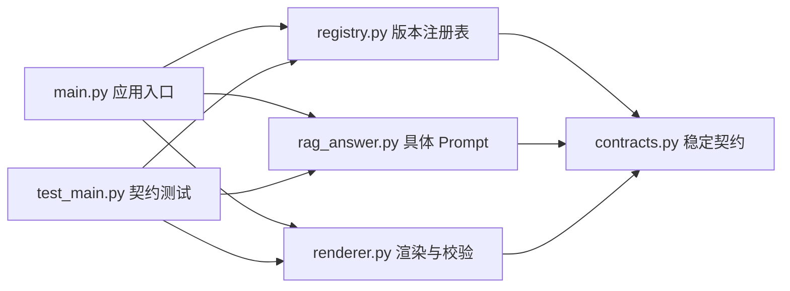
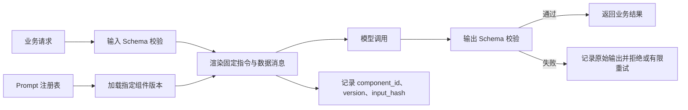

# Prompt Engineering（15） - 代码中的 Prompt 组件化

> 读完后，你应能完成以下任务：
> - 给定一段在业务接口里拼接的 Prompt，能绘制模板、渲染器、注册表和调用入口的依赖图，并用代码 Diff 证明系统指令与不可信数据已经分离。
> - 能在文章沙盒中运行五个 Python 模块，输出 `component_id`、版本、输入摘要和角色消息，并用运行结果证明入口只负责组装、不保存 Prompt 正文。
> - 给定漏传、多传、空值和重复版本四类异常，能运行单元测试并用失败位置证明请求在模型调用前被阻断。
> - 给定候选 Prompt 版本，能生成包含模型、数据集、Prompt 和 Trace 版本的发布记录，并说明如何灰度与独立回滚。

# 一、为什么不能继续拼接字符串

项目刚开始时，下面这种写法很常见：

```python
prompt = "你是客服，请根据资料回答：" + context + "\n问题：" + question
```

它能跑，但很快会遇到四个问题：

1. 相同的安全规则散落在多个接口中，修改时容易漏掉一份。
2. `context`、`question` 和系统指令混在同一个字符串里，无法确认哪些内容可信。
3. 调用日志只有最终文本，无法知道使用了哪个模板版本。
4. 模板变量改名后没有校验，直到线上请求触发才报错。

组件化解决的不是“怎么写一句更聪明的话”，而是建立一份稳定的软件契约：**组件声明需要什么输入，渲染器验证并生成消息，调用日志记录组件版本，测试固定关键行为。**

# 二、组件应该拆成哪几层

一个可维护的 Prompt 组件至少包含四类信息。

| 层 | 保存内容 | 不应该保存什么 |
|---|---|---|
| 固定指令 | 角色、任务、拒答规则、安全边界 | 用户问题、检索原文 |
| 数据输入 | `question`、`context`、`history` 等运行时变量 | 可执行指令和密钥 |
| 输出契约 | JSON Schema、字段含义、引用要求 | 只靠自然语言暗示的格式 |
| 版本元数据 | 组件 ID、版本、负责人、变更原因 | 随请求变化的业务数据 |

## 2.1 模板、组件和模块不是一回事

这三个词经常混着说，但它们解决的问题不同：

| 层次 | 回答的问题 | 最小产物 | 什么时候值得拆 |
|---|---|---|---|
| Prompt 模板 | 哪些文字固定，哪些位置由变量填入 | 一段模板和变量清单 | 同一种任务会重复执行 |
| Prompt 组件 | 输入、输出、消息角色和版本遵守什么契约 | 不可变组件声明 | 规则会独立迭代或被多个调用复用 |
| 代码模块 | 谁定义契约、谁加载版本、谁渲染、谁调用 | 独立文件和单向依赖 | 文件有独立职责、测试或变更原因 |

所以，“把长字符串放进一个常量”只完成了模板化；“给常量套一个类”只完成了组件封装。真正的代码模块化还要让契约、注册表、具体 Prompt 和应用入口分别落在独立模块中，并且依赖方向可以画出来、测试可以单独运行。

## 2.2 依赖只能指向稳定契约

一个容易维护的依赖方向是：应用入口选择组件版本，注册表保存组件，渲染器只依赖数据契约，具体 RAG Prompt 也只依赖数据契约。底层契约不能反过来导入业务入口，否则很快会出现循环依赖。



这张图同时给出模块边界和改动影响：修改 RAG 文案只动 `rag_answer.py`；修改变量校验只动 `renderer.py`；修改版本查找只动 `registry.py`。如果一次文案调整迫使 `main.py`、渲染器和测试夹具一起复制整段 Prompt，说明边界仍然没有拆对。

固定指令和不可信数据必须进入不同的消息或明确的数据边界。给用户输入加 XML 标签只能帮助模型理解边界，不能替代权限校验、工具白名单和输出校验。



`DIAGRAM_DESCRIPTION`：图中必须包含业务请求、输入校验、Prompt 注册表、组件版本、消息渲染、模型调用、输出校验、失败处理和版本日志。输入校验失败不能进入模型；输出校验失败不能直接返回业务结果。

# 三、把组件拆成真正的 Python 模块

下面把同一个 RAG Prompt 拆成五类模块。它们会被写入文章的同一个隔离沙盒，点击运行后由 `main.py` 组装并执行，不需要 API Key，也不访问网络。

```text
prompt-components/
├── contracts.py    # 只放稳定数据契约
├── renderer.py     # 只做变量校验和消息渲染
├── registry.py     # 只管理组件 ID 与版本
├── rag_answer.py   # 只声明当前业务 Prompt
├── test_main.py    # 只验证契约和失败路径
└── main.py         # 只负责组装、调用和输出证据
```

验收时不要只看“能打印答案”。你要同时观察：入口文件里没有 Prompt 正文；漏传、多传和空变量都在渲染阶段失败；重复版本不能覆盖；最终日志能关联组件和版本。

## 3.1 可运行源码

### `contracts.py`

契约模块只描述数据，不读取配置、不注册组件，也不发起模型调用。上层模块都可以依赖它，它不应反向依赖任何业务模块。

```python
"""Prompt 组件共享的数据契约。"""

from dataclasses import dataclass


@dataclass(frozen=True, slots=True)
class PromptMessage:
    """保存一条已经完成渲染的角色消息。"""

    # 角色由组件声明，不能让用户输入覆盖。
    role: str
    # 消息正文可以包含经过校验的运行时数据。
    content: str


@dataclass(frozen=True, slots=True)
class PromptComponent:
    """声明一个不可变 Prompt 版本及其输入契约。"""

    # 组件标识跨版本保持稳定，用于聚合指标。
    component_id: str
    # 行为或文案变化时递增，用于灰度和回滚。
    version: str
    # 系统消息只保存固定规则，不接收用户角色覆盖。
    system_template: str
    # 用户消息承载问题和检索证据等不可信数据。
    user_template: str
    # 必填变量集合同时阻止漏传和静默多传。
    required_variables: frozenset[str]


@dataclass(frozen=True, slots=True)
class RenderedPrompt:
    """保存可发送消息及其可追溯元数据。"""

    # 当前渲染使用的稳定组件标识。
    component_id: str
    # 当前渲染使用的明确组件版本。
    version: str
    # 按模型协议顺序保存的角色消息。
    messages: tuple[PromptMessage, ...]
    # 输入摘要用于关联重放，不直接泄露原始内容。
    input_hash: str
```

### `renderer.py`

渲染器不知道 RAG、客服或代码审查等业务名词。它只执行所有 Prompt 组件共同需要的变量契约、消息边界和输入摘要逻辑。

```python
"""Prompt 变量校验与消息渲染。"""

from hashlib import sha256
from string import Template
from typing import Mapping

from contracts import PromptComponent, PromptMessage, RenderedPrompt


def render_prompt(
    component: PromptComponent,
    values: Mapping[str, str],
) -> RenderedPrompt:
    """校验 values 并按 component 声明生成角色消息。"""

    # 调用方实际提供的变量名集合。
    provided_variables = set(values)
    # 模板声明但调用方没有提供的变量。
    missing_variables = component.required_variables - provided_variables
    # 调用方多传的变量通常表示拼写错误或契约漂移。
    unexpected_variables = provided_variables - component.required_variables
    # 变量集合不一致时必须在模型调用前失败。
    if missing_variables or unexpected_variables:
        raise ValueError(
            "Prompt 变量不匹配："
            f"missing={sorted(missing_variables)}, "
            f"unexpected={sorted(unexpected_variables)}"
        )

    # 空字符串会让结构正确但语义失效，也要提前拒绝。
    empty_variables = sorted(
        variable_name
        for variable_name, variable_value in values.items()
        if not variable_value.strip()
    )
    if empty_variables:
        raise ValueError(f"Prompt 变量不能为空：{empty_variables}")

    # 严格替换确保任何残留变量都会抛出异常。
    system_content = Template(component.system_template).substitute(values)
    # 用户问题和检索证据只能进入 user 消息模板。
    user_content = Template(component.user_template).substitute(values)
    # 稳定排序避免字典插入顺序改变输入摘要。
    canonical_input = "\n".join(
        f"{variable_name}={values[variable_name]}"
        for variable_name in sorted(values)
    )
    # 摘要只用于关联请求，原文保存策略应由数据分级决定。
    input_hash = sha256(canonical_input.encode("utf-8")).hexdigest()[:16]

    return RenderedPrompt(
        component_id=component.component_id,
        version=component.version,
        messages=(
            PromptMessage(role="system", content=system_content),
            PromptMessage(role="user", content=user_content),
        ),
        input_hash=input_hash,
    )
```

### `registry.py`

注册表只解决“按 ID 和版本找到哪一个不可变组件”。同一版本重复注册时直接失败，避免后注册的配置悄悄覆盖线上行为。

```python
"""Prompt 组件版本注册表。"""

from contracts import PromptComponent


class PromptRegistry:
    """按组件 ID 和版本保存不可变 Prompt 组件。"""

    def __init__(self) -> None:
        """初始化空注册表。"""

        # 二元组键保证同一组件可以保留多个可回放版本。
        self._components: dict[tuple[str, str], PromptComponent] = {}

    def register(self, component: PromptComponent) -> None:
        """注册 component；已经存在的版本不能被覆盖。"""

        # 当前组件版本的唯一注册键。
        registry_key = (component.component_id, component.version)
        # 重复键意味着部署包包含冲突定义，必须阻止启动。
        if registry_key in self._components:
            raise ValueError(f"Prompt 组件已存在：{registry_key}")
        self._components[registry_key] = component

    def get(self, component_id: str, version: str) -> PromptComponent:
        """读取 component_id 和 version 唯一确定的组件。"""

        # 调用方请求的明确组件版本键。
        registry_key = (component_id, version)
        # 未知版本不能自动回退，否则重放结果会失真。
        if registry_key not in self._components:
            raise KeyError(f"Prompt 组件不存在：{registry_key}")
        return self._components[registry_key]
```

### `rag_answer.py`

具体业务模块只声明当前 Prompt。以后新增摘要、分类或代码审查组件时，各自增加文件，不需要改渲染器。

```python
"""企业知识库回答 Prompt。"""

from contracts import PromptComponent


def build_rag_answer_component() -> PromptComponent:
    """创建只依据给定证据回答的 RAG Prompt 组件。"""

    return PromptComponent(
        component_id="rag.answer",
        version="1.0.0",
        system_template=(
            "你是企业知识库助手。只依据用户消息中的 <context> 回答；"
            "证据不足时返回‘资料不足’，并引用允许的 chunk_id。"
        ),
        user_template=(
            "<context>\n$context\n</context>\n"
            "<question>\n$question\n</question>"
        ),
        required_variables=frozenset({"context", "question"}),
    )
```

### `test_main.py`

这些测试关心模块之间承诺的行为，而不是对整段 Prompt 做脆弱的全文快照。文案可以合理调整，但消息角色、变量校验和版本唯一性不能退化。

```python
"""Prompt 模块的契约与异常路径测试。"""

import unittest

from rag_answer import build_rag_answer_component
from registry import PromptRegistry
from renderer import render_prompt


class PromptModuleTest(unittest.TestCase):
    """覆盖渲染器、业务组件和注册表之间的稳定契约。"""

    def test_render_keeps_instruction_and_data_separate(self) -> None:
        """验证固定指令和不可信证据进入不同角色消息。"""

        # 当前测试使用的 RAG Prompt 组件。
        component = build_rag_answer_component()
        # 合法输入完成渲染后的结果。
        rendered_prompt = render_prompt(
            component,
            {"context": "[c1] 退款期为 7 天", "question": "何时截止？"},
        )

        self.assertEqual(
            [message.role for message in rendered_prompt.messages],
            ["system", "user"],
        )
        self.assertNotIn("[c1]", rendered_prompt.messages[0].content)
        self.assertIn("[c1]", rendered_prompt.messages[1].content)

    def test_render_rejects_missing_and_unexpected_variables(self) -> None:
        """验证漏传和多传变量都会在渲染阶段失败。"""

        # 当前测试使用的 RAG Prompt 组件。
        component = build_rag_answer_component()
        # 缺少 context 时不能生成残缺 Prompt。
        with self.assertRaisesRegex(ValueError, "missing=.*context"):
            render_prompt(component, {"question": "问题"})
        # 多传 tenant_id 时不能被静默忽略。
        with self.assertRaisesRegex(ValueError, "unexpected=.*tenant_id"):
            render_prompt(
                component,
                {"context": "证据", "question": "问题", "tenant_id": "t1"},
            )

    def test_render_rejects_empty_value(self) -> None:
        """验证空问题不能进入模型调用链。"""

        # 当前测试使用的 RAG Prompt 组件。
        component = build_rag_answer_component()
        with self.assertRaisesRegex(ValueError, "不能为空"):
            render_prompt(component, {"context": "证据", "question": "  "})

    def test_registry_rejects_duplicate_version(self) -> None:
        """验证同一组件版本不能被后注册定义覆盖。"""

        # 当前测试使用的空注册表。
        registry = PromptRegistry()
        # 两次注册使用同一个不可变组件版本。
        component = build_rag_answer_component()
        registry.register(component)
        with self.assertRaisesRegex(ValueError, "已存在"):
            registry.register(component)
```

### `main.py`

入口是组合根：它选择版本、调用渲染器、打印追踪信息并运行回归测试，但不保存任何 Prompt 正文。换一个业务组件时只替换构建函数和组件 ID。

```python
"""组装并验证多模块 Prompt 组件。"""

import unittest

from rag_answer import build_rag_answer_component
from registry import PromptRegistry
from renderer import render_prompt
from test_main import PromptModuleTest


def main() -> None:
    """运行正常渲染和四类契约测试。"""

    # 应用启动阶段创建的 Prompt 注册表。
    registry = PromptRegistry()
    registry.register(build_rag_answer_component())
    # 当前部署配置明确选择的组件版本。
    component = registry.get("rag.answer", "1.0.0")
    # 本次合法请求完成校验和渲染后的 Prompt。
    rendered_prompt = render_prompt(
        component,
        {
            "context": "[chunk-17] 退款申请须在支付后 7 天内提交。",
            "question": "退款最晚什么时候申请？",
        },
    )

    print(f"component={rendered_prompt.component_id}@{rendered_prompt.version}")
    print(f"input_hash={rendered_prompt.input_hash}")
    for message in rendered_prompt.messages:
        print(f"[{message.role}] {message.content}")

    # 沙盒内直接加载同目录测试模块，验证异常路径。
    test_suite = unittest.defaultTestLoader.loadTestsFromTestCase(PromptModuleTest)
    # 测试结果会成为文章在线运行的验收证据。
    test_result = unittest.TextTestRunner(verbosity=2).run(test_suite)
    # 任一契约失败时让沙盒以失败状态结束。
    if not test_result.wasSuccessful():
        raise SystemExit(1)


if __name__ == "__main__":
    main()
```

预期结果应同时包含正常调用证据和 `Ran 4 tests ... OK`。如果只看到正常输出，没有异常路径测试，就不能证明模块边界真的有效。

```text
component=rag.answer@1.0.0
input_hash=<16 位摘要>
[system] 你是企业知识库助手……
[user] <context>……</context>……
Ran 4 tests ...
OK
```

# 四、先用单文件理解组件边界

示例使用 Python 3.10+ 标准库，不依赖 LangChain。这样可以先理解组件边界，再决定是否接入框架提供的模板 API。

## 4.1 文件结构与运行命令

```text
prompt-components/
├── main.py
└── test_main.py
```

`requirements.txt` 不需要第三方依赖：

```text
# Python 3.10+ standard library only
```

运行示例和测试：

```bash
python main.py
python -m unittest -v
```

## 4.2 完整组件实现

下面的 `main.py` 同时演示组件声明、注册、严格变量校验、消息渲染和版本追踪。

```python
"""一个零依赖、可测试的 Prompt 组件实现。"""

from __future__ import annotations

from dataclasses import dataclass
from hashlib import sha256
from string import Template
from typing import Mapping


@dataclass(frozen=True, slots=True)
class PromptMessage:
    """保存一条发送给模型的角色消息。"""

    # 消息角色只允许由组件定义，不能由用户输入覆盖。
    role: str
    # 已完成变量替换的消息正文。
    content: str


@dataclass(frozen=True, slots=True)
class RenderedPrompt:
    """保存可发送消息及其可追溯元数据。"""

    # 稳定组件标识用于聚合指标和回放。
    component_id: str
    # 语义化版本用于灰度和回滚。
    version: str
    # 最终发送给模型的消息列表。
    messages: tuple[PromptMessage, ...]
    # 输入摘要用于关联相同请求，不能替代原始数据审计策略。
    input_hash: str


@dataclass(frozen=True, slots=True)
class PromptComponent:
    """声明 Prompt 的固定消息、必填变量和版本。"""

    # 跨版本保持稳定的组件标识。
    component_id: str
    # 每次行为变化都必须更新的版本。
    version: str
    # 固定系统指令模板。
    system_template: str
    # 承载不可信业务数据的用户消息模板。
    user_template: str
    # 渲染前必须提供且不允许多传的变量名。
    required_variables: frozenset[str]

    def render(self, values: Mapping[str, str]) -> RenderedPrompt:
        """校验运行时变量并渲染消息；values 是模板变量映射。"""

        # 调用方实际传入的变量名集合。
        provided_variables = set(values)
        # 模板声明但调用方未提供的变量。
        missing_variables = self.required_variables - provided_variables
        # 调用方多传的变量通常意味着字段拼错或契约已经漂移。
        unexpected_variables = provided_variables - self.required_variables
        if missing_variables or unexpected_variables:
            raise ValueError(
                "Prompt 变量不匹配："
                f"missing={sorted(missing_variables)}, "
                f"unexpected={sorted(unexpected_variables)}"
            )

        # 空值会让结构正确但语义失效，因此在调用模型前直接拒绝。
        empty_variables = sorted(name for name, value in values.items() if not value.strip())
        if empty_variables:
            raise ValueError(f"Prompt 变量不能为空：{empty_variables}")

        # safe_substitute 会掩盖漏传变量，此处使用 substitute 配合显式集合校验。
        system_content = Template(self.system_template).substitute(values)
        # 用户问题和检索证据只进入 user 消息的数据区。
        user_content = Template(self.user_template).substitute(values)
        # 稳定排序后计算输入摘要，避免字典插入顺序影响结果。
        canonical_input = "\n".join(f"{key}={values[key]}" for key in sorted(values))
        # 日志只保存摘要；是否保存原文应由数据分级和审计策略决定。
        input_hash = sha256(canonical_input.encode("utf-8")).hexdigest()[:16]

        return RenderedPrompt(
            component_id=self.component_id,
            version=self.version,
            messages=(
                PromptMessage(role="system", content=system_content),
                PromptMessage(role="user", content=user_content),
            ),
            input_hash=input_hash,
        )


class PromptRegistry:
    """按组件 ID 和版本保存不可变 Prompt 组件。"""

    def __init__(self) -> None:
        """初始化空注册表。"""

        # 注册键由组件 ID 和版本共同组成，旧版本可以继续回放。
        self._components: dict[tuple[str, str], PromptComponent] = {}

    def register(self, component: PromptComponent) -> None:
        """注册组件；component 是不可变的 Prompt 版本。"""

        # 当前组件版本的唯一注册键。
        registry_key = (component.component_id, component.version)
        if registry_key in self._components:
            raise ValueError(f"Prompt 组件已存在：{registry_key}")
        self._components[registry_key] = component

    def get(self, component_id: str, version: str) -> PromptComponent:
        """读取指定组件版本；两个参数共同确定唯一版本。"""

        # 调用方请求的组件注册键。
        registry_key = (component_id, version)
        if registry_key not in self._components:
            raise KeyError(f"Prompt 组件不存在：{registry_key}")
        return self._components[registry_key]


def build_rag_component() -> PromptComponent:
    """创建只依据给定证据回答的 RAG Prompt 组件。"""

    return PromptComponent(
        component_id="rag.answer",
        version="1.0.0",
        system_template=(
            "你是企业知识库助手。只依据用户消息中的 <context> 回答；"
            "证据不足时明确返回‘资料不足’，并引用允许的 chunk_id。"
        ),
        user_template=(
            "<context>\n$context\n</context>\n"
            "<question>\n$question\n</question>"
        ),
        required_variables=frozenset({"context", "question"}),
    )


def main() -> None:
    """注册并渲染一个 RAG Prompt，打印可观察的验收结果。"""

    # 应用启动阶段创建的 Prompt 注册表。
    registry = PromptRegistry()
    registry.register(build_rag_component())
    # 当前线上配置选中的明确组件版本。
    component = registry.get("rag.answer", "1.0.0")
    # 本次请求完成校验和渲染后的 Prompt。
    rendered_prompt = component.render(
        {
            "context": "[chunk-17] 退款申请须在支付后 7 天内提交。",
            "question": "退款最晚什么时候申请？",
        }
    )

    print(f"component={rendered_prompt.component_id}@{rendered_prompt.version}")
    print(f"input_hash={rendered_prompt.input_hash}")
    for message in rendered_prompt.messages:
        print(f"[{message.role}] {message.content}")


if __name__ == "__main__":
    main()
```

预期输出包含稳定的组件版本、输入摘要，以及一条 `system` 和一条 `user` 消息：

```text
component=rag.answer@1.0.0
input_hash=<16 位摘要>
[system] 你是企业知识库助手……
[user] <context>……</context>……
```

# 五、测试什么才能防止 Prompt 回归

不要只做整段文本快照。空格或措辞变化会制造大量噪声，却不一定覆盖真正的契约。至少测试以下行为：

- 缺少变量时在模型调用前失败。
- 多传拼错的变量时失败，避免静默忽略。
- 空问题和空上下文不能进入模型。
- 系统规则始终处于 `system` 消息，业务数据始终处于 `user` 消息。
- 同一版本和同一输入产生稳定渲染结果。

`test_main.py`：

```python
"""验证 Prompt 组件的变量契约和消息边界。"""

import unittest

from main import build_rag_component


class PromptComponentTest(unittest.TestCase):
    """覆盖 Prompt 组件最重要的回归边界。"""

    def test_render_keeps_instruction_and_data_separate(self) -> None:
        """验证系统指令和不可信数据进入不同角色消息。"""

        # 当前测试使用的 RAG Prompt 组件。
        component = build_rag_component()
        # 合法变量渲染后的消息结果。
        rendered = component.render({"context": "[c1] 证据", "question": "问题"})

        self.assertEqual([message.role for message in rendered.messages], ["system", "user"])
        self.assertNotIn("[c1] 证据", rendered.messages[0].content)
        self.assertIn("[c1] 证据", rendered.messages[1].content)

    def test_render_rejects_missing_variable(self) -> None:
        """验证漏传 context 时不会生成残缺 Prompt。"""

        # 当前测试使用的 RAG Prompt 组件。
        component = build_rag_component()
        with self.assertRaisesRegex(ValueError, "missing=.*context"):
            component.render({"question": "问题"})

    def test_render_rejects_unexpected_variable(self) -> None:
        """验证拼错变量名时不会被静默忽略。"""

        # 当前测试使用的 RAG Prompt 组件。
        component = build_rag_component()
        with self.assertRaisesRegex(ValueError, "unexpected=.*tenant_id"):
            component.render({"context": "证据", "question": "问题", "tenant_id": "t1"})


if __name__ == "__main__":
    unittest.main()
```

# 六、生产环境如何管理版本

Prompt 版本不能只写在文件名里。一次模型调用至少记录以下字段：

| 字段 | 用途 |
|---|---|
| `component_id` | 聚合同一业务能力的质量、延迟和成本 |
| `prompt_version` | 对比版本并执行回滚 |
| `model` | 区分 Prompt 变化和模型变化 |
| `input_hash` | 关联重复请求，不直接泄露原文 |
| `dataset_version` | 复现离线评测结果 |
| `trace_id` | 定位渲染、模型调用和解析链路 |

发布时先让旧版本和候选版本跑同一份固定数据集，再按稳定用户或租户灰度。质量下降时只回滚 Prompt 配置，不需要重新发布整套业务服务。涉及合规或高风险动作时，Prompt 评测通过也不能替代确定性的权限和审批逻辑。

# 七、什么时候值得拆成模块

以下内容适合复用为组件：

- 多个业务都需要的安全边界和拒答规则。
- 稳定的输出 Schema 与引用格式。
- 由明确变量驱动的任务模板。
- 模型供应商差异较大时的适配片段。

只有一个调用点、不会独立变化的两三句话不必拆成单独组件。过度拆分会让最终 Prompt 来自十几个片段，排查时反而很难恢复真实发送内容。日志中必须能看到渲染后的最终消息和每个组件版本，但原文是否落盘要遵守隐私与数据保留策略。

# 八、常见故障与排查

| 现象 | 根因 | 定位方法 | 修复与预防 |
|---|---|---|---|
| 线上偶发 `$context` 原样出现 | 使用了宽松替换或漏传变量 | 查看渲染前变量集合和组件版本 | 严格比较必填、实传变量并在调用模型前失败 |
| 改一条规则后多个接口表现不一致 | Prompt 仍有复制版本 | 按 `component_id` 搜索调用日志和代码 | 收敛到注册表，禁止业务层内联长 Prompt |
| 灰度质量下降却无法复现 | 没记录 Prompt、模型和数据集版本 | 通过 `trace_id` 检查调用元数据 | 三类版本同时入 Trace，并保留候选版本 |
| 用户内容改变系统行为 | 指令与数据混在同一消息，且工具没有授权校验 | 查看最终消息和工具调用轨迹 | 分离消息、校验输出，并在代码层执行权限和工具白名单 |

## 8.1 验收清单

- [ ] 每个组件声明稳定 ID、版本和必填变量。
- [ ] 漏传、多传和空变量会在模型调用前失败。
- [ ] 用户输入、检索证据和系统指令拥有明确边界。
- [ ] 单元测试覆盖消息角色、变量契约和关键拒答规则。
- [ ] Trace 能关联 Prompt、模型、数据集和应用版本。
- [ ] 候选版本经过固定数据集评测，并能独立回滚。
- [ ] 权限、安全和副作用控制由确定性代码执行，而不是只写在 Prompt 中。

# 九、总结

- Prompt 组件的核心是输入、输出和版本契约，不是把字符串换成模板 API。
- 固定指令与不可信数据要分层渲染，边界提示不能替代代码侧授权和校验。
- 注册表应保留历史版本，调用日志需要记录组件、模型、数据集和 Trace 信息。
- 测试优先覆盖变量契约、角色边界和拒答行为，避免只维护脆弱的全文快照。
- 组件只在确实复用或独立变化时拆分，最终发送内容必须能够被恢复和审计。

## 9.1 参考资料

- [OpenAI Prompt Engineering](https://platform.openai.com/docs/guides/prompt-engineering)
- [OWASP Prompt Injection Prevention Cheat Sheet](https://cheatsheetseries.owasp.org/cheatsheets/LLM_Prompt_Injection_Prevention_Cheat_Sheet.html)
- [Python `string.Template`](https://docs.python.org/3/library/string.html#template-strings-strings)
- [Python Modules](https://docs.python.org/3/tutorial/modules.html)
