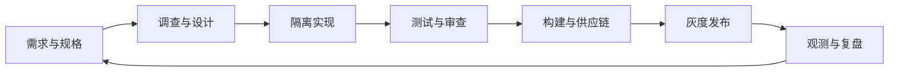

# 评测与治理（05） - AI 驱动研发流水线

> 把 Agent 放进研发流水线时，应让它在每个阶段产出可审查证据，而不是让一个长会话同时决定需求、实现和发布。

## 学习目标

- 为规格、调查、实现、验证、构建和发布定义输入输出契约。
- 选择适合脚本、Agent 和人工决策的工作边界。
- 用交付质量、缺陷逃逸、人工等待和成本指标闭环优化流水线。

## 一、阶段与产物

每阶段有输入契约、输出产物和门禁：规格产生验收条目；调查产生调用链与风险；实现产生最小 diff；验证产生测试和 UI 证据；构建产生不可变制品；发布产生版本、指标和回滚记录。

## 二、适合自动化的工作

格式化、静态检查、依赖盘点、重复测试、变更摘要和已知规则扫描适合确定性脚本。需求取舍、安全例外、架构变更、生产数据和发布决策保留人工所有权。能由脚本稳定完成的步骤不应反复消耗模型推理。

## 三、多 Agent 协作

只并行边界清楚、文件冲突低的任务。每个子任务写明目标、输入、输出和验证，主任务负责集成后重新运行完整验证。多个 Agent 自报完成不能替代最终工作树中的构建和用户路径。

## 四、闭环指标

跟踪需求到上线时长、首次验收通过率、返工、缺陷逃逸、回滚、人工等待和每成功任务成本。指标用于发现瓶颈，不按代码行数或工具调用数奖励 Agent。

## 五、落地顺序

从高频、低风险、可验收的小流程开始；稳定后把成功模式固化成规则、Skill 和脚本，再扩展权限。任何自动化都必须有超时、停止条件、审计与人工接管。

## 参考资料

- [GitHub Actions Workflows](https://docs.github.com/en/actions/concepts/workflows-and-actions/workflows)
- [DORA Research](https://dora.dev/research/)
