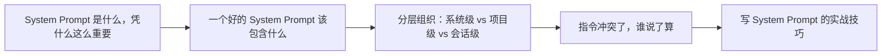

# Harness Engineering（05） - 系统指令与任务契约

> 读完后，你应能完成以下任务：
> - 绘制“Harness Engineering（05） - 系统指令与任务契约 / System Prompt 是什么，凭什么这么重要”的关键对象与数据流，解释“harness 都会在最前面塞一段特殊的指令，”，并用源码位置、日志或 Trace 标注证据。
> - 为“Harness Engineering（05） - 系统指令与任务契约 / 一个好的 System Prompt 该包含什么”设计正常与异常输入，验证“不是随便写几句"你是个助手"就行。”，输出首个偏差位置与回归测试结果。
> - 实现“Harness Engineering（05） - 系统指令与任务契约 / 分层组织：系统级 vs 项目级 vs 会话级”的最小代码或配置，检验“成熟的 harness（比如 Claude Code）不会把所有指令揉成一坨，”，输出命令、结果与 Diff，并说明不适用边界。

> 工具是 Agent 的"手"，那它的"价值观、性格、行事规则"从哪来？
> 答案是 **System Prompt（系统提示词）**。它是 harness 里**性价比最高的控制手段**——不用写一行代码，改几句话就能让 Agent 判若两人。

---

<!-- article-progressive-block:start -->
# 一、先建立全局：系统指令与任务契约 是什么？

理解“系统指令与任务契约”，先要把标题中的对象放进同一条处理链：它接收什么输入，经过哪些状态变化，最终用什么证据判断结果。下表不另造概念，只把作者正文已经解释的章节按依赖顺序连起来。

“系统指令与任务契约”的第一个核心判断是：harness 都会在最前面塞一段特殊的指令，。先弄清这个判断中的对象和输入输出，后面的实现、故障和验收才有共同语境。

| 顺序 | 章节 | 读完本节应抓住的结论 |
| --- | --- | --- |
| 1 | System Prompt 是什么，凭什么这么重要 | harness 都会在最前面塞一段特殊的指令， |
| 2 | 一个好的 System Prompt 该包含什么 | 不是随便写几句"你是个助手"就行。 |
| 3 | 分层组织：系统级 vs 项目级 vs 会话级 | 成熟的 harness（比如 Claude Code）不会把所有指令揉成一坨， |
| 4 | 指令冲突了，谁说了算 | 安全红线（系统级）> 用户当下的明确指令 > 项目级规范 > 系统级的一般性偏好。 |
| 5 | 写 System Prompt 的实战技巧 | ✅ 用"做什么"而不是"不做什么"。 |
| 6 | 常见误区 | ❌ 误区 1：把指令塞在用户消息里而不是 system prompt 里。 |

## 1.1 核心对象之间怎样衔接



这张图只表达本文的讲解顺序，不替代正文机制。判断“系统指令与任务契约”是否真正掌握，需要能从最后一个结果沿图回到前面每个章节的输入、状态变化和证据。

## 1.2 再看失败：问题最早会出现在哪一步？

在“系统指令与任务契约”的对象和顺序已经明确后，再看可观察的失败：条件缺失、结果不可复现或失败后责任不清。定位时不从最后一条错误猜原因，而是沿上图找第一个偏离正文结论的节点。
<!-- article-progressive-block:end -->

# 二、System Prompt 是什么，凭什么这么重要

每次调用模型，
harness 都会在最前面塞一段特殊的指令，
这就是 system prompt。
它和普通对话的区别在于：

> **System prompt 是"宪法"，用户消息是"日常请求"。** 宪法的优先级最高，定义了 Agent 是谁、能干嘛、该守哪些规矩，在整个会话里持续生效。

为什么说它性价比最高？因为：

- **改它零成本**——不用动 harness 代码，改字符串即可
- **影响力巨大**——同一个模型，换个 system prompt 就能从"严谨的代码审查员"变成"活泼的写作助手"
- **它是行为的总开关**——工具用不用、怎么回话、遇到边界怎么处理，都能在这里定调

你用的 Claude Code 之所以"像个工程师"，
很大程度就是它的 system prompt 在起作用。

---

# 三、一个好的 System Prompt 该包含什么

不是随便写几句"你是个助手"就行。
一个专业的 system prompt 通常分这几层：

```text
① 身份与角色：你是谁
   "你是一个资深 Python 后端工程师，擅长写简洁、安全的代码。"

② 能力与边界：你能干嘛、不能干嘛
   "你可以读写文件、执行命令。但删除文件前必须先征得用户确认。"

③ 行为准则：怎么做事
   "改代码前先读懂现有风格并保持一致。回答简洁，不啰嗦。"

④ 输出格式：怎么回话
   "代码用 markdown 代码块。解释用中文。"

⑤ 安全/红线：绝对不能做的
   "绝不执行 rm -rf 这类危险命令；绝不泄露密钥内容。"
```

不一定每条都要有，但**身份 + 行为准则 + 红线**这三层几乎是标配。

---

# 四、分层组织：系统级 vs 项目级 vs 会话级

成熟的 harness（比如 Claude Code）不会把所有指令揉成一坨，
而是**分层**：

| 层级 | 谁定的 | 例子 | 优先级 |
| --- | --- | --- | --- |
| **系统级** | harness 作者 | "你是 XX 编程助手，遵守这些安全规则……" | 最高 |
| **项目级** | 项目/团队 | 项目根目录的 `CLAUDE.md`："本项目用 4 空格缩进，注释写中文" | 中 |
| **会话级** | 用户当下 | "这次帮我用 TypeScript 重写" | 临时最高 |

这样分的好处：**系统级保证底线不变，项目级承载团队规范，会话级灵活应对当下需求。
** harness 在每次调用前把这几层**拼接**成最终的 system prompt。

> 💡 你全局 `CLAUDE.md` 里写的"交流用中文""每个函数都要加注释"，就是**项目级/用户级指令**，会被 harness 拼进 system prompt，所以我才会全程遵守。

---

# 五、指令冲突了，谁说了算

指令一多，难免打架。
比如系统级说"回答尽量简洁"，用户又说"请详细展开讲"。
harness 怎么处理？

一般遵循这个优先级原则：

> **安全红线（系统级）> 用户当下的明确指令 > 项目级规范 > 系统级的一般性偏好。**

翻译一下：

- **安全红线不可逾越**：用户说"帮我删库跑路"，再明确也不执行——这是系统级红线，压倒一切。
- **非安全问题上，用户当下说的算**：系统说"简洁"，用户说"详细点"，那就详细——满足用户的具体需求优先于一般性偏好。
- **没冲突时各司其职**：项目级管规范，系统级管底线。

设计 system prompt 时要**显式写清这个优先级**，
否则模型遇到冲突会"懵"，
行为不稳定。

---

# 六、写 System Prompt 的实战技巧

✅ **用"做什么"而不是"不做什么"。
** "回答控制在 3 句话内"比"不要啰嗦"有效得多——正向指令更可执行。

✅ **关键规则给出理由。
** "删文件前要确认，
因为这是不可逆操作"比干巴巴一句"要确认"更让模型重视，
也更会举一反三。

✅ **用例子代替抽象描述。
** 与其说"保持代码风格一致"，不如塞一小段示例代码展示你要的风格。
模型最擅长照例子学。

✅ **重要的红线放醒目位置、反复强调。
** system prompt 很长时，关键安全规则容易被淹没。
放开头或结尾，必要时重申。

✅ **别把 system prompt 写成万字长文。
** 太长会稀释重点，也烧 token（每次调用都要带着它）。
抓主要矛盾，细节交给工具和上下文。

---

# 七、常见误区

❌ **误区 1：把指令塞在用户消息里而不是 system prompt 里。
** 用户消息是"一次性请求"，system prompt 才是"持续生效的规矩"。
立规矩的话要放对地方。

❌ **误区 2：指望 system prompt 解决一切。
** 它能影响行为倾向，但不是硬约束。
真正的安全（比如"禁止删库"）必须靠 harness 的**代码层面权限控制**兜底（第 08 章），
不能只靠"嘴上说说"。

❌ **误区 3：写满"不要……不要……"。
** 大量否定句既难执行又容易顾此失彼。
多用正向指令。

❌ **误区 4：冲突优先级没写清。
** 导致模型遇到指令打架时行为飘忽。
要显式声明谁压谁。

---

# 八、最佳实践

✅ **结构化分层**：身份 → 能力边界 → 行为准则 → 输出格式 → 红线。
✅ **分级管理**：系统级保底线、项目级管规范、会话级应当下，并写清冲突优先级。
✅ **正向、给理由、给例子**，关键红线醒目重申。
✅ **安全靠代码兜底**，system prompt 只是第一道（也是最软的一道）防线。

---

# 九、动手实践：System Prompt 的威力：换个"宪法"判若两人

这是理解"system prompt 是性价比最高的控制手段"最直观的方式。

## 9.1 怎么跑

默认离线 mock，无需 API Key：

```bash
python demo.py
```

它会用三套不同的 system prompt 回答同一个问题"怎么学习编程？
"：

1. **严谨工程师**：简洁、给步骤、重实践
2. **活泼朋友**：口语化、带鼓励、轻松
3. **苏格拉底导师**：不直接给答案，用反问引导思考

## 9.2 看点

1. 三个回答的差异**完全来自 system prompt**，模型和问题都没变——这就是"宪法"的塑造力。
2. 看 `SYSTEM_PROMPTS` 字典里每套 prompt 的结构：身份 + 行为准则 + 输出风格，对照第 05 章"五层结构"。
3. 试着自己加一套 system prompt（比如"毒舌但有用"），再跑一遍，体会改字符串就能改行为的爽感。

> 真实版：把 `mock_respond` 换成 `client.messages.create(system=sp, ...)` 即可，system 参数就是这里的 system prompt。

<!-- article-progressive-block:start -->
# 十、动手验证：先跑通 系统指令与任务契约，再改变一个变量

前面的章节已经建立问题、概念和机制。现在把“系统指令与任务契约”放进同一套基线中运行；本节不再引入新术语，只验证前文结论能否被复现。

## 10.1 基线与候选只允许一个变量不同

验证“系统指令与任务契约”时，先固定样本、基线、候选、成功标准和失败边界。候选方案只能改变本次要验证的变量；如果同时更换数据、依赖和配置，即使结果改善，也不能知道是哪一项产生作用。

执行“系统指令与任务契约”时，动作是：同环境运行基线与候选，记录输入、中间状态和异常。原始结果不能只保留截图或汇总分数，必须同步保存：可重放命令、结构化日志、输出 Diff、失败样本、版本，使下一次复查可以在同一输入上重放。

| 实验要素 | 本文要求 |
| --- | --- |
| 固定条件 | 固定样本、基线、候选、成功标准和失败边界 |
| 唯一变量 | 本次候选方案与基线之间的一项明确差异 |
| 原始证据 | 可重放命令、结构化日志、输出 Diff、失败样本、版本 |
| 通过阈值 | 结果符合结论条件，异常输入可解释、可恢复 |
| 立即停止 | 条件缺失、结果不可复现或失败后责任不清 |

## 10.2 执行前先排除不可比较条件

“系统指令与任务契约”开始前先确认下面四项；任一项不成立，都应先修复实验条件，而不是解释结果。

- 基线能够在“系统指令与任务契约”的当前环境重复运行。
- 候选只改变一个与“系统指令与任务契约”结论直接相关的条件。
- “系统指令与任务契约”的基线和候选使用同一批输入、同一版本依赖与同一通过阈值。
- “系统指令与任务契约”的原始输出和失败现场不会被重试、格式化或汇总覆盖。

## 10.3 执行后先核对证据完整性

结果出来后先检查证据，再讨论“系统指令与任务契约”是否通过。缺少中间状态时，最终输出只能说明现象，不能证明机制。

| 检查项 | 当前文章的判定 |
| --- | --- |
| 输入可追溯 | 固定样本、基线、候选、成功标准和失败边界 |
| 过程可回放 | 同环境运行基线与候选，记录输入、中间状态和异常 |
| 结果可审计 | 可重放命令、结构化日志、输出 Diff、失败样本、版本 |

“系统指令与任务契约”的一次合格基线对照按以下顺序执行：

1. 保存“系统指令与任务契约”基线版本及输入摘要，确认基线本身可以重复运行。
2. 写下“系统指令与任务契约”候选方案唯一变化的变量，以及它预期影响的指标。
3. 在同一环境执行“系统指令与任务契约”：同环境运行基线与候选，记录输入、中间状态和异常。
4. 为“系统指令与任务契约”保存：可重放命令、结构化日志、输出 Diff、失败样本、版本。
5. 使用“系统指令与任务契约”预登记条件判断：结果符合结论条件，异常输入可解释、可恢复。
6. 如果“系统指令与任务契约”未通过，不修改第二个变量，先恢复基线并保留失败现场。

# 十一、用一张矩阵验证 系统指令与任务契约 的关键结论

矩阵按正文顺序列出“系统指令与任务契约”的结论。一次实验只选择一行，只改变这一行对应的条件；不要把多行合并成一个无法归因的大实验。

| 正文章节 | 已解释的结论 | 本轮唯一变量 | 必须保存的证据 |
| --- | --- | --- | --- |
| System Prompt 是什么，凭什么这么重要 | harness 都会在最前面塞一段特殊的指令， | 只改变与“System Prompt 是什么，凭什么这么重要”相关的条件 | 可重放命令、结构化日志、输出 Diff、失败样本、版本 |
| 一个好的 System Prompt 该包含什么 | 不是随便写几句"你是个助手"就行。 | 只改变与“一个好的 System Prompt 该包含什么”相关的条件 | 可重放命令、结构化日志、输出 Diff、失败样本、版本 |
| 分层组织：系统级 vs 项目级 vs 会话级 | 成熟的 harness（比如 Claude Code）不会把所有指令揉成一坨， | 只改变与“分层组织：系统级 vs 项目级 vs 会话级”相关的条件 | 可重放命令、结构化日志、输出 Diff、失败样本、版本 |
| 指令冲突了，谁说了算 | 安全红线（系统级）> 用户当下的明确指令 > 项目级规范 > 系统级的一般性偏好。 | 只改变与“指令冲突了，谁说了算”相关的条件 | 可重放命令、结构化日志、输出 Diff、失败样本、版本 |
| 写 System Prompt 的实战技巧 | ✅ 用"做什么"而不是"不做什么"。 | 只改变与“写 System Prompt 的实战技巧”相关的条件 | 可重放命令、结构化日志、输出 Diff、失败样本、版本 |
| 常见误区 | ❌ 误区 1：把指令塞在用户消息里而不是 system prompt 里。 | 只改变与“常见误区”相关的条件 | 可重放命令、结构化日志、输出 Diff、失败样本、版本 |

## 11.1 记录本次实际实验

下面的记录用于“系统指令与任务契约”当前这一次实验，不是第二套知识目录。先从矩阵选择一个章节，再填写实际值；没有填写的字段表示尚未验证。

```yaml
topic: "系统指令与任务契约"
selected_chapter: required
claim_from_article: required
baseline_version: required
changed_condition: exactly_one
execution: "同环境运行基线与候选，记录输入、中间状态和异常"
evidence: "可重放命令、结构化日志、输出 Diff、失败样本、版本"
pass_when: "结果符合结论条件，异常输入可解释、可恢复"
stop_when: "条件缺失、结果不可复现或失败后责任不清"
observed_result: required
first_deviation: null_or_evidence
recovery_replay: required_after_failure
```

## 11.2 边界实验必须证明能够停止和恢复

成功路径只能证明“系统指令与任务契约”在当前样本上工作，不能证明它可以进入生产。边界实验需要主动制造：条件缺失、结果不可复现或失败后责任不清，并观察系统是否在产生不可逆副作用前停止。

| 场景 | 只改变什么 | 应保存什么 | 通过标准 |
| --- | --- | --- | --- |
| 正常路径 | 使用已知有效输入 | 可重放命令、结构化日志、输出 Diff、失败样本、版本 | 结果符合结论条件，异常输入可解释、可恢复 |
| 边界路径 | 把一个输入推进到约束临界值 | 临界值前后的输出与指标 | 不静默降级，不把部分结果冒充成功 |
| 明确失败 | 注入：条件缺失、结果不可复现或失败后责任不清 | 原始错误、首个异常阶段和最终状态 | 失败被正确分类且没有扩大副作用 |
| 恢复重放 | 执行：保留基线，缩小变量；根因确认前不扩大范围 | 原失败样本的复测证据 | 原样本恢复，正常样本没有回归 |

恢复动作不是简单重启。对于“系统指令与任务契约”，第一步是：保留基线，缩小变量；根因确认前不扩大范围。完成后使用原始失败样本复测；只验证一个新样本成功，不能证明触发条件已经消失。

“系统指令与任务契约”边界实验结束后，应把正常、临界、失败和恢复四类记录放在同一个运行批次中。这样才能区分“候选方案真的修复问题”和“环境变化让问题暂时没有出现”。

# 十二、系统指令与任务契约 的结果解释

解释“系统指令与任务契约”实验时先看首个偏差，而不是最后一条错误。最后的异常通常只是上游状态错误的结果；从末端反推容易误把症状当根因。

| 观察结果 | 可以支持的判断 | 下一步 |
| --- | --- | --- |
| 主链路没有达到预期 | 条件缺失、结果不可复现或失败后责任不清 | 先执行：保留基线，缩小变量；根因确认前不扩大范围 |
| 异常链路无法恢复 | 条件缺失、结果不可复现或失败后责任不清 | 先执行：保留基线，缩小变量；根因确认前不扩大范围 |
| 新样本成功但原样本仍失败 | 修复没有覆盖原始触发条件 | 固定原失败输入，恢复基线后重新比较 |
| 指标改善但证据无法回链 | 数据、版本或中间状态没有固定 | 暂停发布，补齐可追溯记录后重跑 |

“系统指令与任务契约”只有同时满足“结果符合结论条件，异常输入可解释、可恢复”，并且没有出现“条件缺失、结果不可复现或失败后责任不清”，才可以认为主链路通过。这里的“通过”只对当前固定版本、样本和环境有效，不能外推到尚未测试的容量、权限或数据分布。

如果“系统指令与任务契约”候选方案与基线差异很小，先检查证据分辨率是否足够；如果差异很大，先排除数据泄漏、环境漂移和版本不一致。两种情况都不能只看一个汇总均值，需要回到逐样本输出和中间状态。

“系统指令与任务契约”故障定位完成后，记录“现象、首个偏差、根因、改动、原样本复测”五项。缺少原样本复测时，只能标记为待观察，不能标记为已解决。

# 十三、系统指令与任务契约 的发布判断

发布判断需要把“系统指令与任务契约”的质量、失败边界和恢复能力放在同一份记录中。以下任一条件缺失，都应停止扩量，而不是用“基本正常”替代证据。

- [ ] “系统指令与任务契约”的基线与候选只存在一个计划内变量。
- [ ] “系统指令与任务契约”的输入、代码、依赖、配置和数据版本可以追溯。
- [ ] “系统指令与任务契约”的正常、临界、失败和恢复样本使用同一套断言。
- [ ] “系统指令与任务契约”的原始输出、中间状态和失败现场已经保留。
- [ ] “系统指令与任务契约”的日志、Trace、截图和测试数据已经脱敏。
- [ ] “系统指令与任务契约”的停止条件、负责人和回滚入口已经演练。
- [ ] “系统指令与任务契约”尚未覆盖的输入、权限、容量和外部依赖已经登记。

最终记录至少包含基线版本、唯一变量、原始证据、首个偏差、恢复复测和发布责任人。没有参与本次修改的人如果不能据此重放“系统指令与任务契约”的判断，就不能发布。
<!-- article-progressive-block:end -->

# 十四、总结

- **System Prompt 是什么，凭什么这么重要**：每次调用模型，harness 都会在最前面塞一段特殊的指令，这就是 system prompt。
- **一个好的 System Prompt 该包含什么**：不是随便写几句"你是个助手"就行。
- **分层组织：系统级 vs 项目级 vs 会话级**：成熟的 harness（比如 Claude Code）不会把所有指令揉成一坨，而是分层：
- **指令冲突了，谁说了算**：安全红线（系统级）> 用户当下的明确指令 > 项目级规范 > 系统级的一般性偏好。
- **写 System Prompt 的实战技巧**：✅ 用"做什么"而不是"不做什么"。
- **常见误区**：❌ 误区 1：把指令塞在用户消息里而不是 system prompt 里。

## 参考资料

- [OpenAI Agents SDK](https://openai.github.io/openai-agents-python/)
- [OWASP Agentic Security](https://genai.owasp.org/)
