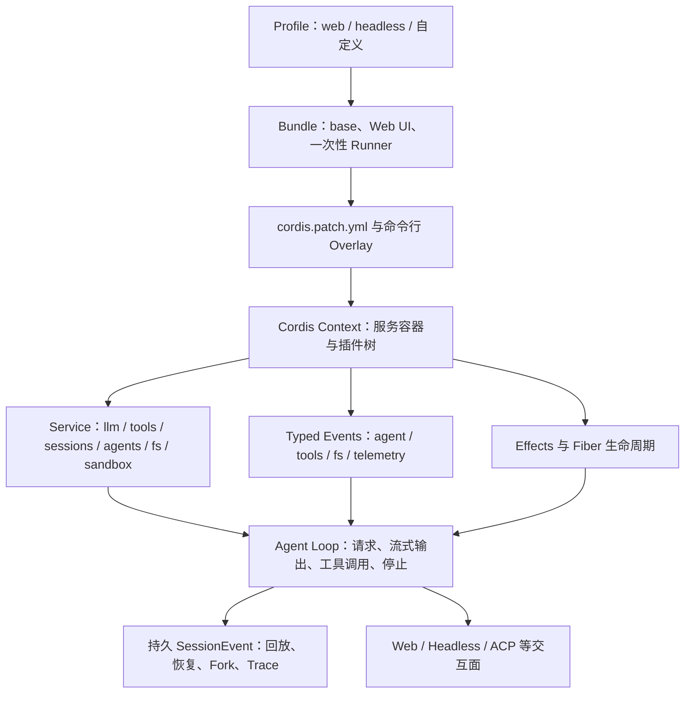
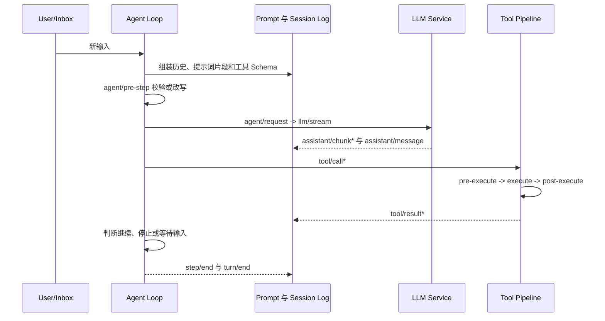

# Harness Engineering（18） - DeepSeek Harness：插件架构与可组合 Agent 运行时

> 读完后，你应能完成以下任务：
> - 绘制“Harness Engineering（18） - DeepSeek Harness：插件架构与可组合 Agent 运行时 / DeepSeek Harness 解决的不是单个工具问题”的关键对象与数据流，解释“DeepSeek Harness 的设计选择是：模型适配器、工具注册表、会话日志和 Agent Loop 本身都作为 Cordis 插件挂载。”，并用源码位置、日志或 Trace 标注证据。
> - 为“Harness Engineering（18） - DeepSeek Harness：插件架构与可组合 Agent 运行时 / Cordis 插件模型的六个核心概念”设计正常与异常输入，验证“Fiber 的状态是 PENDING -> LOADING -> ACTIVE -> UNLOADING -> DISPOSED，加载或配置校验失败进入 FAILED。”，输出首个偏差位置与回归测试结果。
> - 实现“Harness Engineering（18） - DeepSeek Harness：插件架构与可组合 Agent 运行时 / Profile、Bundle 与 Overlay 如何组合运行时”的最小代码或配置，检验“Profile 按声明顺序加载 Bundle； -> Profile 自己的 cordis.patch.yml 覆盖组合结果； -> Harness Home 下的 patch 再覆盖； -> 命令行 --patch 作为最后一层 Overlay。”，输出命令、结果与 Diff，并说明不适用边界。

> DeepSeek Harness 于 2026 年 8 月 13 日公开，本文核对的 npm 版本是 `0.1.0-rc.6`。它仍处于 Developer Preview，官方明确提示未来会有破坏性变更。本文讲的是当前架构与扩展方法，不把 RC 接口承诺为长期稳定 API。


# 一、DeepSeek Harness 解决的不是单个工具问题

一个可演示的 Agent 往往只有模型调用和几个工具；生产 Harness 还要管理会话事件、上下文组装、权限、审批、沙箱、后台任务、取消、恢复、UI 回放和遥测。若这些能力都硬编码在 Agent Loop 里，增加一个模型适配器或切换远程沙箱都可能修改核心流程，插件卸载后还容易残留监听器与进程。

DeepSeek Harness 的设计选择是：模型适配器、工具注册表、会话日志和 Agent Loop 本身都作为 Cordis 插件挂载。插件通过共享 `Context` 取得服务，通过类型化事件协作，通过 effect 注册可逆副作用。没有一个需要不断打补丁的“特权内核”。

这并不表示所有插件天然安全。插件仍是宿主进程中的代码，能获得哪些服务、文件和凭据取决于 Profile、权限策略与隔离方式。动态第三方插件尤其需要版本固定、来源校验、审批和最小能力面。



`DIAGRAM_DESCRIPTION`：图中必须体现 Profile、Bundle 和 Overlay 先组合插件树，Cordis Context 再提供 Service、类型化事件与可逆 effect；Agent Loop 是可替换插件而非特权内核，执行产生的持久 SessionEvent 支撑回放、恢复和不同交互端。

# 二、Cordis 插件模型的六个核心概念

| 概念 | 机制 | 工程价值 | 常见误用 |
| --- | --- | --- | --- |
| Plugin | 函数、对象或 `Service` 子类，通过 `apply(ctx)` 挂载贡献 | 行为按功能封装，可装配和替换 | 在插件外创建无法释放的全局资源 |
| Context | `ctx.<key>` 组成的服务容器 | 消费方依赖接口，不直接导入具体实现 | 把 Context 当无边界的全局变量 |
| Service | 稳定服务键，如 `ctx.tools`、`ctx.llm`、`ctx.sessions` | Provider 可替换，Consumer 不随实现改变 | 接口与本地实现写在同一个不可拆包中 |
| `inject` | 声明插件启动所需服务；未满足时 Fiber 保持 `PENDING` | 依赖决定启动，而不是 YAML 行顺序 | 通过调整配置先后“修复”依赖问题 |
| Typed Event | `emit`、`waterfall`、`parallel`、`serial` 四种分发约定 | 插件可观察、包装、并发或串行决策 | waterfall 监听器忘记调用 `next()`，意外截断下游 |
| Effect / Fiber | 注册与资源生命周期绑定；卸载时执行 disposer | 热重载和替换不会残留工具、监听器和定时器 | 手工注册资源但没有清理函数 |

Fiber 的状态是 `PENDING -> LOADING -> ACTIVE -> UNLOADING -> DISPOSED`，加载或配置校验失败进入 `FAILED`。看到“插件配置存在但没有效果”时，第一步应检查 `inject` 是否满足和 Fiber 是否仍在 `PENDING`，而不是盲目调整配置顺序。

事件模式也决定了控制权：

- `emit` 只通知，不等待返回值；
- `waterfall` 让监听器包装请求或短路决策，普通观察者必须委托 `next()`；
- `parallel` 等待所有监听器并行完成；
- `serial` 按注册顺序执行并返回决策结果。

权限门禁、截止时间和结果脱敏应挂在有明确语义的事件或工具流水线上，而不是散落在每个工具的业务代码里。

# 三、Profile、Bundle 与 Overlay 如何组合运行时

运行中的 `dsh` 是一棵按层叠加的插件树：

1. Profile 按声明顺序加载 Bundle；
2. Profile 自己的 `cordis.patch.yml` 覆盖组合结果；
3. Harness Home 下的 patch 再覆盖；
4. 命令行 `--patch` 作为最后一层 Overlay。

官方提供的 `dsh-base` 包含模型适配器、工具、持久化、沙箱、审批策略、设置、凭据与遥测。`web` Profile 增加浏览器应用；`headless` 增加不启动服务器的一次性 Runner。业务团队可以复用 base，再用 Overlay 替换某个 Provider 或增加策略插件，而不是复制整套 Agent Loop。

查看最终配置树的命令是：

```bash
dsh --profile web --dump-config
```

排障时要检查解析后的树，而不是只读某一份 YAML，因为同一个条目可能已经被更高层 patch 整体替换。

# 四、Agent Loop、会话事件与能力 Seam

DeepSeek Harness 把一次模型请求加工具调用定义为一个 Step，把领取输入到不再欠工作定义为一个 Turn。简化后的执行路径如下：



`DIAGRAM_DESCRIPTION`：时序图必须包含输入领取、从会话日志组装模型上下文、`agent/pre-step`、流式模型请求、工具的 pre/execute/post 三段流水线、持久结果与停止判断；所有模型可见信息最终都应能从 SessionEvent 日志重建。

“模型可见即已记录”是重要不变量。会影响后续模型请求的输入必须成为会话事件，才能支持刷新回放、恢复、Fork、Transcript 和遥测；临时 UI 状态不能偷偷进入模型上下文。

能力 Seam 由三部分组成：

- **Service Definition** 定义稳定接口；
- **Service Provider** 提供本地、远程或沙箱实现；
- **Consumer** 把能力暴露给 Agent，例如面向模型的工具。

文件系统与进程 Provider 可以一起指向远程沙箱，而 Bash、PTY、LSP 等 Consumer 不必为每种沙箱复制分支。Subagent Provider 也可在同一接口后选择本地子 Agent 或外部产品。这个分层是插件架构比“把函数塞进工具表”更深的一层。

# 五、当前插件能力覆盖面

官方代码和子系统文档已经给出广泛的扩展位置：

| 能力域 | 主要扩展方式 | 需要重点控制的风险 |
| --- | --- | --- |
| 模型与流式输出 | 向 `ctx.llm` 注册 Adapter，监听 LLM 事件 | 密钥隔离、限流、取消、Token 与费用 |
| 工具与 Code Mode | `ctx.tools.register()`，工具自动进入 Schema 和 `tools.<name>` | 参数校验、审批、超时、结果脱敏 |
| 会话与上下文 | 追加 `SessionEvent`，注册提示词片段，使用 `agent.inject()` | 上下文可重建、压缩污染、隐私删除 |
| 文件、Shell、PTY、LSP | 替换 `ctx.fs`、`ctx.shell`、终端或语言服务 Provider | 路径越界、命令注入、后台进程泄漏 |
| 沙箱与审批 | `ctx.sandbox`、权限 Preset、`tools/pre-execute` 门禁 | 默认放行、高危副作用无法追责 |
| Goal、Plan 与 Workflow | `ctx.goals`、计划模式、工作流和续跑事件 | 无停止条件、旧目标污染新轮次 |
| Job 与 Schedule | `ctx.jobs.start()`、后台工具与调度服务 | Owner 丢失、结果过大、取消语义错误 |
| Skill、Memory、Subagent | 对应 Provider、作用域和提示词组装插件 | 不可信内容注入、跨会话泄露、递归失控 |
| Web、Headless、ACP 与 UI | 驱动 `ctx.agents`，消费会话事件，注册 Client Chat 节点 | UI 状态与持久事实不一致 |
| 遥测与 Token Meter | 监听持久事件和能力事件 | 记录敏感正文、指标基数爆炸 |
| 动态第三方插件 | Host/Client 插件包、版本化扩展与配置 | 供应链、客户端代码执行、版本回滚 |

功能多不等于可以全部开启。最小 Profile 应只挂载当前任务需要的模型、工具和 Provider；高风险工具按目录、命令、网络域和审批级别进一步收窄。

# 六、最小可运行示例：新增一个受约束工具插件

以下示例按官方源码开发流程运行，适用于 DeepSeek Harness Developer Preview。运行环境使用 Node.js `22.19+` 或 `24+`、pnpm `11.7.0`。先取得源码并安装依赖：

```bash
git clone https://github.com/deepseek-ai/deepseek-harness.git
cd deepseek-harness
corepack enable
corepack prepare pnpm@11.7.0 --activate
pnpm install
pnpm run build
```

文件结构：

```text
deepseek-harness/
└── scratch-plugin/
    ├── package.json
    ├── cordis.yml
    └── src/
        └── my-plugin.ts
```

`scratch-plugin/package.json`：

```json
{
  "name": "workspace-summary-plugin",
  "version": "0.1.0",
  "private": true,
  "type": "module"
}
```

`scratch-plugin/cordis.yml`：

```yaml
- insert:
    - id: workspace-summary-tool
      # Cordis 的 Web Profile 以自己的目录解析模块，因此这里必须替换成真实绝对路径。
      name: '/absolute/path/to/deepseek-harness/scratch-plugin/src/my-plugin.ts'
```

先在仓库根目录执行 `pwd`，再把上面的 `/absolute/path/to/deepseek-harness` 替换为输出路径。相对路径会基于 Profile 目录解析，并不基于当前终端目录。

`scratch-plugin/src/my-plugin.ts`：

```typescript
import type { Context } from '@deepseek-ai/cordis'
import { defineTool } from '@deepseek-ai/dsh-tools'

// 插件在诊断与配置树中的稳定显示名称。
export const name = 'workspace-summary-tool'
// 插件需要工具注册表服务；服务未就绪时 Fiber 保持 PENDING。
export const inject = ['tools']

/** 注册一个无副作用的文本统计工具；ctx 是 Cordis 提供的服务上下文。 */
export function apply(ctx: Context): void {
  ctx.tools.register(defineTool({
    // 模型用于发起调用的稳定工具名称。
    name: 'summarize_text_shape',
    // 模型根据该描述判断工具用途，不在描述中夸大能力。
    description: 'Count lines, words, and non-whitespace characters in supplied text.',
    // 参数 Schema 会在 execute 之前校验类型和必填字段。
    parameters: {
      // text 是唯一输入；长度上限仍需在 execute 中做业务校验。
      text: { type: 'string', required: true, description: 'Text to inspect, up to 20,000 chars' },
    },
    // output 定义程序可消费的规范 JSON，而不是让调用方解析自然语言。
    output: {
      // 三个计数都必须是数值，供 Native 和 Code Mode 复用。
      schema: {
        type: 'object',
        additionalProperties: false,
        properties: {
          lines: { type: 'number', required: true },
          words: { type: 'number', required: true },
          characters: { type: 'number', required: true },
        },
      },
      /** 把规范值渲染为模型可读文本；_args 是已校验参数，value 是统计结果。 */
      render: (_args, value) => [{
        type: 'text',
        text: `lines=${value.lines} words=${value.words} characters=${value.characters}`,
      }],
    },
    /** 统计输入文本；args 是 Schema 推导的参数，exec 提供取消信号和执行身份。 */
    async execute(args, exec) {
      // 工具允许处理的最大字符数，限制单次上下文和内存消耗。
      const maximumCharacters = 20_000
      if (exec.signal.aborted) {
        throw new Error('tool execution aborted')
      }
      if (args.text.length === 0 || args.text.length > maximumCharacters) {
        throw new Error(`text length must be between 1 and ${maximumCharacters}`)
      }

      // 保存按换行符拆分后的行，末尾空行也作为真实输入保留。
      const lines = args.text.split(/\r?\n/)
      // 保存去除首尾空白后的文本，用于避免空字符串被计为一个单词。
      const trimmedText = args.text.trim()
      // 保存以连续空白为边界得到的单词列表。
      const words = trimmedText === '' ? [] : trimmedText.split(/\s+/u)
      // 保存去除所有 Unicode 空白后的字符数。
      const characters = args.text.replace(/\s/gu, '').length

      return {
        lines: lines.length,
        words: words.length,
        characters,
      }
    },
  }))
}
```

启动 Web Profile 并叠加插件：

```bash
pnpm dsh web --patch ./scratch-plugin/cordis.yml
```

浏览器打开 `http://127.0.0.1:3080`，配置模型并选择工作区，然后输入：

```text
Call summarize_text_shape with exactly this text: "hello plugin\nsecond line"
```

预期工具规范值为：

```json
{
  "lines": 2,
  "words": 4,
  "characters": 21
}
```

验证时还要执行失败路径：传入空文本应返回工具错误；卸载插件或移除 Overlay 后，工具 Schema 应从模型请求中消失。`ctx.tools.register()` 本身是 effect，插件 Fiber 被 dispose 时会自动撤销注册，不需要手工从全局表删除。

# 七、工具流水线如何承载策略

一个生产工具不能只实现 `execute()`。DeepSeek Harness 把调用拆成可扩展流水线：

```text
tool/call
  -> tools/pre-execute：允许、拒绝、询问审批、冻结执行身份
  -> tools/execute：实际执行，可包装截止时间、重试或指标
  -> tools/post-execute：结果脱敏、替换展示、附加上下文
  -> tool/result：记录不可变归一化结果并供观察者消费
```

工具 Schema 会校验类型、必填字段、字面量、联合分支和嵌套结构；非空、正数、跨字段关系等 DSL 无法表达的规则仍需手工校验。`execute()` 应返回符合 `output.schema` 的规范 JSON，`output.render()` 只负责模型可见文本。这样 Code Mode 可通过 `await tools.<name>(args)` 获得结构化结果，不必解析 UI 文案。

长任务不应一直占用一次前台工具调用。可使用 `ctx.jobs.start()` 发布带 Owner 的后台 Job，由专用工具读取、取消和清理。任务发布后应使用 Job 自己的取消信号，外层调用取消只停止等待，不应错误地杀死已经交付句柄的后台工作。

# 八、生产接入的安全与稳定性门禁

DeepSeek Harness 尚处 Developer Preview，适合架构研究、插件原型和受控内部试验。进入真实仓库前至少建立以下门禁：

1. **版本固定**：固定 npm RC、源码 Commit 和插件完整性，不追随浮动 `latest` 自动升级；
2. **最小 Profile**：只加载任务必需 Service 和工具，默认禁止写文件、网络与任意 Shell；
3. **审批分级**：读操作、可逆写操作、外部消息、删除和凭据操作使用不同策略；
4. **执行隔离**：文件系统与进程指向一次性容器或远程沙箱，限制目录、网络、CPU、内存与时间；
5. **持久事实**：模型可见上下文、工具调用、结果、审批和终态进入 SessionEvent，可回放且可删除；
6. **取消与停止**：限制 Turn、Step、Token、费用、连续同错次数和后台 Job 数；
7. **插件供应链**：动态插件区分 Host 与 Client 代码，安装、启用、升级和回滚都需审批与审计；
8. **回归评测**：记录任务成功率、工具参数正确率、越权拦截率、恢复成功率、P95 延迟和单任务成本。

采用之前还要设计退出路径：Profile 与会话数据能否导出，插件 API 变化如何迁移，RC 升级失败能否回滚到固定镜像，核心任务是否有不依赖该 Harness 的降级方式。

# 九、常见故障与排查

| 现象 | 根因 | 定位方法 | 修复与预防 |
| --- | --- | --- | --- |
| 配置里有插件但没有启动 | `inject` 依赖未满足，Fiber 停在 `PENDING` | 查看解析后的配置树、服务注册与 Fiber 状态 | 提供所需 Service；不要靠调整 YAML 行顺序碰运气 |
| 后续事件监听器全部失效 | waterfall 监听器没有调用 `next()` | 对照事件模式，给各监听器增加调用轨迹 | 观察型监听器必须委托；只有拥有决策权时才短路 |
| 热重载后工具或定时器重复 | 在 effect 外注册资源，没有 disposer | 比较 reload 前后工具数、监听器和活动句柄 | 使用 `ctx.tools.register`、`ctx.on` 或 `ctx.effect` 绑定生命周期 |
| 工具 UI 成功但 Code Mode 无法消费 | `execute` 返回自然语言，结构字段藏在渲染文本 | 检查 `output.schema`、规范值和 `render` 分工 | 返回稳定 JSON；人类文案只放 `render` 或展示元数据 |
| 会话刷新后模型上下文不同 | 模型可见数据未写 SessionEvent，只存在内存或 UI | 从日志重新执行 `deriveMessages()` 并与请求比较 | 新增持久事件和投影，维护“模型可见即已记录”不变量 |
| 工具取消后进程仍运行 | Provider 没传播 `exec.signal`，或前台/后台取消语义混淆 | 对照调用 Token、Job ID、Owner 和进程树 | 前台遵守 `exec.signal`；已发布后台任务由 Job 生命周期管理 |
| 升级后配置或插件失效 | Developer Preview 发生破坏性变更 | 对照锁定版本、Commit、配置快照和迁移说明 | 固定版本，先在回归 Profile 灰度，再原子切换和回滚 |

# 十、DeepSeek Harness 的适用边界

适合：

- 研究可替换 Agent Runtime、插件生命周期和能力 Seam；
- 为内部代码 Agent 组合模型、工具、沙箱、审批、UI 与 Headless Runner；
- 需要通过 Profile 和 Overlay 管理多套能力组合；
- 能投入资源跟进 RC 变化，并有隔离环境与回归集。

暂不适合：

- 要求多年稳定 API、成熟 SLA 和无迁移成本的关键生产链路；
- 只需一次简单模型调用或两个确定性工具，插件运行时反而增加复杂度；
- 无法审查第三方插件、无法隔离 Shell/文件系统、也无法持久审计事件的环境；
- 团队准备把“插件化”等同于“安全”，默认加载所有能力。

## 验收清单

- [ ] 已固定 DeepSeek Harness npm 版本、源码 Commit、Node 和 pnpm 版本。
- [ ] 能从 `--dump-config` 解释 Profile、Bundle、Home Patch 与命令行 Overlay 的最终结果。
- [ ] 每个插件声明了必要 `inject`，不存在靠配置行顺序维持的隐式依赖。
- [ ] 自建资源都通过 effect 注册并验证卸载后没有残留。
- [ ] 工具具有参数 Schema、业务校验、规范输出、取消信号和失败路径。
- [ ] 写文件、Shell、网络和外部副作用经过最小权限、沙箱与审批。
- [ ] 所有模型可见输入都能从 SessionEvent 重建，刷新和 Fork 后行为一致。
- [ ] Turn、Step、Token、费用、重复错误和后台 Job 都有停止条件。
- [ ] RC 升级先跑插件、回放、恢复、权限和任务成功率回归，并能回滚。

# 十一、总结

- DeepSeek Harness 把模型、工具、会话和 Agent Loop 都实现为 Cordis 插件，核心价值是运行时组合与替换，而不是单纯增加更多内置工具。
- Context 提供稳定服务键，`inject` 表达依赖，类型化事件提供扩展点，effect 和 Fiber 保证注册与资源可逆卸载。
- Profile 组合 Bundle，再由 Profile、Home 与命令行 Overlay 逐层覆盖；排障应查看最终配置树。
- SessionEvent 是回放、恢复、Fork 与 Trace 的事实来源，任何模型可见上下文都必须能从日志重建。
- 工具要分离参数 Schema、规范 JSON、模型渲染和 UI 展示，并在 pre/execute/post 流水线中统一处理审批、截止时间、策略和观测。
- 当前版本仍是 Developer Preview，生产试用必须固定版本、最小化 Profile、隔离副作用、建立回归评测与回滚路径。

## 参考资料

- [DeepSeek Harness 官方仓库与 Developer Preview 说明](https://github.com/deepseek-ai/deepseek-harness)
- [官方架构：插件树、Profile、Agent Loop 与能力 Seam](https://github.com/deepseek-ai/deepseek-harness/blob/master/docs/architecture.zh.md)
- [Cordis 官方入门：Service、inject、事件与 effect](https://github.com/deepseek-ai/deepseek-harness/blob/master/docs/cordis-primer.zh.md)
- [官方工具编写参考：Schema、流水线、Job 与 Code Mode](https://github.com/deepseek-ai/deepseek-harness/blob/master/docs/cookbook/adding-a-tool.zh.md)
- [官方插件开发教程：在 Web UI 中增加工具](https://github.com/deepseek-ai/deepseek-harness/blob/master/docs/user/develop/basic/tool.zh.md)
