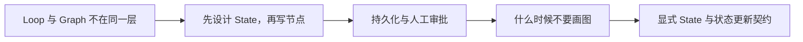

# Graph Engineering（01） - Graph Engineering 是什么

> 读完后，你应能完成以下任务：
> - 绘制“Graph Engineering（01） - Graph Engineering 是什么 / Loop 与 Graph 不在同一层”的关键对象与数据流，解释“Loop 关心“这一阶段是否继续尝试”；”，并用源码位置、日志或 Trace 标注证据。
> - 为“Graph Engineering（01） - Graph Engineering 是什么 / 先设计 State，再写节点”设计正常与异常输入，验证“每个节点要声明读取字段、写入字段、幂等键和失败类型。”，输出首个偏差位置与回归测试结果。
> - 实现“Graph Engineering（01） - Graph Engineering 是什么 / 持久化与人工审批”的最小代码或配置，检验“Checkpointer 保存的是可恢复执行状态，不等于业务事务。”，输出命令、结果与 Diff，并说明不适用边界。

> Graph Engineering 把复杂 Agent 流程变成显式状态机：节点执行工作，边决定流转，持久化保证暂停后能恢复。


## 核心知识清单

- 显式 State 与状态更新契约
- Node、Static Edge 与 Conditional Edge
- 节点内部 Loop 和图级控制流
- Checkpointer、Thread 与幂等恢复
- Human-in-the-loop Interrupt 与 Resume
- fan-out、fan-in、超时和取消传播
- Time Travel、审计与补偿动作

<!-- article-progressive-block:start -->
# 一、先建立全局：Graph Engineering 是什么 是什么？

理解“Graph Engineering 是什么”，先要把标题中的对象放进同一条处理链：它接收什么输入，经过哪些状态变化，最终用什么证据判断结果。下表不另造概念，只把作者正文已经解释的章节按依赖顺序连起来。

“Graph Engineering 是什么”的第一个核心判断是：Loop 关心“这一阶段是否继续尝试”；。先弄清这个判断中的对象和输入输出，后面的实现、故障和验收才有共同语境。

| 顺序 | 章节 | 读完本节应抓住的结论 |
| --- | --- | --- |
| 1 | Loop 与 Graph 不在同一层 | Loop 关心“这一阶段是否继续尝试”； |
| 2 | 先设计 State，再写节点 | 每个节点要声明读取字段、写入字段、幂等键和失败类型。 |
| 3 | 持久化与人工审批 | Checkpointer 保存的是可恢复执行状态，不等于业务事务。 |
| 4 | 什么时候不要画图 | 线性三步且失败直接终止：普通函数或 Pipeline 更容易测试。 |
| 5 | 显式 State 与状态更新契约 | Graph Engineering 把复杂 Agent 流程变成显式状态机：节点执行工作，边决定流转，持久化保证暂停后能恢复。 |
| 6 | Node、Static Edge 与 Conditional Edge | Conditional Edge 读取结构化状态路由，不能通过解析模型自然语言决定高风险分支。 |

## 1.1 核心对象之间怎样衔接



这张图只表达本文的讲解顺序，不替代正文机制。判断“Graph Engineering 是什么”是否真正掌握，需要能从最后一个结果沿图回到前面每个章节的输入、状态变化和证据。

## 1.2 再看失败：问题最早会出现在哪一步？

在“Graph Engineering 是什么”的对象和顺序已经明确后，再看可观察的失败：条件缺失、结果不可复现或失败后责任不清。定位时不从最后一条错误猜原因，而是沿上图找第一个偏离正文结论的节点。
<!-- article-progressive-block:end -->

# 二、Loop 与 Graph 不在同一层

Loop 关心“这一阶段是否继续尝试”；
Graph 关心“系统当前在哪个阶段，下一步允许去哪里”。
例如修复节点内部可以调查、编辑、测试多轮；
图只在节点返回 `verified` 后进入 Review，
在 `blocked` 时进入人工审批，
在预算耗尽时终止。

```text
START -> investigate -> implement -> verify
              ^             |          |
              |             | fail     | pass
              +-------------+          v
                                      review -> human_approval -> END
```

# 三、先设计 State，再写节点

状态只保存跨节点需要的事实，
例如任务 ID、规格版本、根因证据、改动摘要、验证结果、预算和审批决定。
不要把完整聊天、客户端连接或不可序列化对象塞进 State。
每个节点要声明读取字段、写入字段、幂等键和失败类型。

Conditional Edge 读取结构化状态路由，不能通过解析模型自然语言决定高风险分支。
模型可以提出 `route`，但必须经过枚举 Schema、权限和业务校验。
并行节点需要 Reducer 或明确的 fan-in 合并规则，避免后写结果覆盖先写结果。

# 四、持久化与人工审批

Checkpointer 保存的是可恢复执行状态，不等于业务事务。
外部写操作仍要使用幂等键、Outbox 或补偿动作。
恢复同一 thread 时先检查外部系统是否已经执行成功，
避免因为节点重放而重复创建 PR、重复发消息或重复扣费。

人工审批使用 Interrupt 暂停：展示待批准动作、证据、影响、替代方案和回滚；
Resume 只接受结构化决定，并重新校验权限和资源版本。
长时间暂停后，原 diff、部署版本或审批人权限都可能变化，不能直接沿用旧快照。

# 五、什么时候不要画图

- 线性三步且失败直接终止：普通函数或 Pipeline 更容易测试。
- 只是同一动作有限重试：Loop + 重试库足够。
- 分支由单个模型随意生成、状态不可审计：Graph 只会把不确定性画得更漂亮。

当流程存在多个回退点、并行汇聚、跨小时暂停、人工审批或合规审计时，
Graph 才明显优于隐藏在 Prompt 和 `if` 中的控制流。

## 学完验收

- 能为每个节点写出输入、输出、幂等和失败契约。
- 测试覆盖成功、条件分支、节点失败、暂停恢复和重复恢复。
- 能解释一次工具循环属于哪个节点，而不是把每次工具调用都画成图节点。

<!-- article-progressive-block:start -->
# 六、动手验证：先跑通 Graph Engineering 是什么，再改变一个变量

前面的章节已经建立问题、概念和机制。现在把“Graph Engineering 是什么”放进同一套基线中运行；本节不再引入新术语，只验证前文结论能否被复现。

## 6.1 基线与候选只允许一个变量不同

验证“Graph Engineering 是什么”时，先固定样本、基线、候选、成功标准和失败边界。候选方案只能改变本次要验证的变量；如果同时更换数据、依赖和配置，即使结果改善，也不能知道是哪一项产生作用。

执行“Graph Engineering 是什么”时，动作是：同环境运行基线与候选，记录输入、中间状态和异常。原始结果不能只保留截图或汇总分数，必须同步保存：可重放命令、结构化日志、输出 Diff、失败样本、版本，使下一次复查可以在同一输入上重放。

| 实验要素 | 本文要求 |
| --- | --- |
| 固定条件 | 固定样本、基线、候选、成功标准和失败边界 |
| 唯一变量 | 本次候选方案与基线之间的一项明确差异 |
| 原始证据 | 可重放命令、结构化日志、输出 Diff、失败样本、版本 |
| 通过阈值 | 结果符合结论条件，异常输入可解释、可恢复 |
| 立即停止 | 条件缺失、结果不可复现或失败后责任不清 |

## 6.2 执行前先排除不可比较条件

“Graph Engineering 是什么”开始前先确认下面四项；任一项不成立，都应先修复实验条件，而不是解释结果。

- 基线能够在“Graph Engineering 是什么”的当前环境重复运行。
- 候选只改变一个与“Graph Engineering 是什么”结论直接相关的条件。
- “Graph Engineering 是什么”的基线和候选使用同一批输入、同一版本依赖与同一通过阈值。
- “Graph Engineering 是什么”的原始输出和失败现场不会被重试、格式化或汇总覆盖。

## 6.3 执行后先核对证据完整性

结果出来后先检查证据，再讨论“Graph Engineering 是什么”是否通过。缺少中间状态时，最终输出只能说明现象，不能证明机制。

| 检查项 | 当前文章的判定 |
| --- | --- |
| 输入可追溯 | 固定样本、基线、候选、成功标准和失败边界 |
| 过程可回放 | 同环境运行基线与候选，记录输入、中间状态和异常 |
| 结果可审计 | 可重放命令、结构化日志、输出 Diff、失败样本、版本 |

“Graph Engineering 是什么”的一次合格基线对照按以下顺序执行：

1. 保存“Graph Engineering 是什么”基线版本及输入摘要，确认基线本身可以重复运行。
2. 写下“Graph Engineering 是什么”候选方案唯一变化的变量，以及它预期影响的指标。
3. 在同一环境执行“Graph Engineering 是什么”：同环境运行基线与候选，记录输入、中间状态和异常。
4. 为“Graph Engineering 是什么”保存：可重放命令、结构化日志、输出 Diff、失败样本、版本。
5. 使用“Graph Engineering 是什么”预登记条件判断：结果符合结论条件，异常输入可解释、可恢复。
6. 如果“Graph Engineering 是什么”未通过，不修改第二个变量，先恢复基线并保留失败现场。

# 七、用一张矩阵验证 Graph Engineering 是什么 的关键结论

矩阵按正文顺序列出“Graph Engineering 是什么”的结论。一次实验只选择一行，只改变这一行对应的条件；不要把多行合并成一个无法归因的大实验。

| 正文章节 | 已解释的结论 | 本轮唯一变量 | 必须保存的证据 |
| --- | --- | --- | --- |
| Loop 与 Graph 不在同一层 | Loop 关心“这一阶段是否继续尝试”； | 只改变与“Loop 与 Graph 不在同一层”相关的条件 | 可重放命令、结构化日志、输出 Diff、失败样本、版本 |
| 先设计 State，再写节点 | 每个节点要声明读取字段、写入字段、幂等键和失败类型。 | 只改变与“先设计 State，再写节点”相关的条件 | 可重放命令、结构化日志、输出 Diff、失败样本、版本 |
| 持久化与人工审批 | Checkpointer 保存的是可恢复执行状态，不等于业务事务。 | 只改变与“持久化与人工审批”相关的条件 | 可重放命令、结构化日志、输出 Diff、失败样本、版本 |
| 什么时候不要画图 | 线性三步且失败直接终止：普通函数或 Pipeline 更容易测试。 | 只改变与“什么时候不要画图”相关的条件 | 可重放命令、结构化日志、输出 Diff、失败样本、版本 |
| 显式 State 与状态更新契约 | Graph Engineering 把复杂 Agent 流程变成显式状态机：节点执行工作，边决定流转，持久化保证暂停后能恢复。 | 只改变与“显式 State 与状态更新契约”相关的条件 | 可重放命令、结构化日志、输出 Diff、失败样本、版本 |
| Node、Static Edge 与 Conditional Edge | Conditional Edge 读取结构化状态路由，不能通过解析模型自然语言决定高风险分支。 | 只改变与“Node、Static Edge 与 Conditional Edge”相关的条件 | 可重放命令、结构化日志、输出 Diff、失败样本、版本 |

## 7.1 记录本次实际实验

下面的记录用于“Graph Engineering 是什么”当前这一次实验，不是第二套知识目录。先从矩阵选择一个章节，再填写实际值；没有填写的字段表示尚未验证。

```yaml
topic: "Graph Engineering 是什么"
selected_chapter: required
claim_from_article: required
baseline_version: required
changed_condition: exactly_one
execution: "同环境运行基线与候选，记录输入、中间状态和异常"
evidence: "可重放命令、结构化日志、输出 Diff、失败样本、版本"
pass_when: "结果符合结论条件，异常输入可解释、可恢复"
stop_when: "条件缺失、结果不可复现或失败后责任不清"
observed_result: required
first_deviation: null_or_evidence
recovery_replay: required_after_failure
```

## 7.2 边界实验必须证明能够停止和恢复

成功路径只能证明“Graph Engineering 是什么”在当前样本上工作，不能证明它可以进入生产。边界实验需要主动制造：条件缺失、结果不可复现或失败后责任不清，并观察系统是否在产生不可逆副作用前停止。

| 场景 | 只改变什么 | 应保存什么 | 通过标准 |
| --- | --- | --- | --- |
| 正常路径 | 使用已知有效输入 | 可重放命令、结构化日志、输出 Diff、失败样本、版本 | 结果符合结论条件，异常输入可解释、可恢复 |
| 边界路径 | 把一个输入推进到约束临界值 | 临界值前后的输出与指标 | 不静默降级，不把部分结果冒充成功 |
| 明确失败 | 注入：条件缺失、结果不可复现或失败后责任不清 | 原始错误、首个异常阶段和最终状态 | 失败被正确分类且没有扩大副作用 |
| 恢复重放 | 执行：保留基线，缩小变量；根因确认前不扩大范围 | 原失败样本的复测证据 | 原样本恢复，正常样本没有回归 |

恢复动作不是简单重启。对于“Graph Engineering 是什么”，第一步是：保留基线，缩小变量；根因确认前不扩大范围。完成后使用原始失败样本复测；只验证一个新样本成功，不能证明触发条件已经消失。

“Graph Engineering 是什么”边界实验结束后，应把正常、临界、失败和恢复四类记录放在同一个运行批次中。这样才能区分“候选方案真的修复问题”和“环境变化让问题暂时没有出现”。

# 八、Graph Engineering 是什么 的结果解释

解释“Graph Engineering 是什么”实验时先看首个偏差，而不是最后一条错误。最后的异常通常只是上游状态错误的结果；从末端反推容易误把症状当根因。

| 观察结果 | 可以支持的判断 | 下一步 |
| --- | --- | --- |
| 主链路没有达到预期 | 条件缺失、结果不可复现或失败后责任不清 | 先执行：保留基线，缩小变量；根因确认前不扩大范围 |
| 异常链路无法恢复 | 条件缺失、结果不可复现或失败后责任不清 | 先执行：保留基线，缩小变量；根因确认前不扩大范围 |
| 新样本成功但原样本仍失败 | 修复没有覆盖原始触发条件 | 固定原失败输入，恢复基线后重新比较 |
| 指标改善但证据无法回链 | 数据、版本或中间状态没有固定 | 暂停发布，补齐可追溯记录后重跑 |

“Graph Engineering 是什么”只有同时满足“结果符合结论条件，异常输入可解释、可恢复”，并且没有出现“条件缺失、结果不可复现或失败后责任不清”，才可以认为主链路通过。这里的“通过”只对当前固定版本、样本和环境有效，不能外推到尚未测试的容量、权限或数据分布。

如果“Graph Engineering 是什么”候选方案与基线差异很小，先检查证据分辨率是否足够；如果差异很大，先排除数据泄漏、环境漂移和版本不一致。两种情况都不能只看一个汇总均值，需要回到逐样本输出和中间状态。

“Graph Engineering 是什么”故障定位完成后，记录“现象、首个偏差、根因、改动、原样本复测”五项。缺少原样本复测时，只能标记为待观察，不能标记为已解决。

# 九、Graph Engineering 是什么 的发布判断

发布判断需要把“Graph Engineering 是什么”的质量、失败边界和恢复能力放在同一份记录中。以下任一条件缺失，都应停止扩量，而不是用“基本正常”替代证据。

- [ ] “Graph Engineering 是什么”的基线与候选只存在一个计划内变量。
- [ ] “Graph Engineering 是什么”的输入、代码、依赖、配置和数据版本可以追溯。
- [ ] “Graph Engineering 是什么”的正常、临界、失败和恢复样本使用同一套断言。
- [ ] “Graph Engineering 是什么”的原始输出、中间状态和失败现场已经保留。
- [ ] “Graph Engineering 是什么”的日志、Trace、截图和测试数据已经脱敏。
- [ ] “Graph Engineering 是什么”的停止条件、负责人和回滚入口已经演练。
- [ ] “Graph Engineering 是什么”尚未覆盖的输入、权限、容量和外部依赖已经登记。

最终记录至少包含基线版本、唯一变量、原始证据、首个偏差、恢复复测和发布责任人。没有参与本次修改的人如果不能据此重放“Graph Engineering 是什么”的判断，就不能发布。
<!-- article-progressive-block:end -->

# 十、总结

- **Loop 与 Graph 不在同一层**：Loop 关心“这一阶段是否继续尝试”；
- **先设计 State，再写节点**：状态只保存跨节点需要的事实，例如任务 ID、规格版本、根因证据、改动摘要、验证结果、预算和审批决定。
- **持久化与人工审批**：Checkpointer 保存的是可恢复执行状态，不等于业务事务。
- **什么时候不要画图**：线性三步且失败直接终止：普通函数或 Pipeline 更容易测试。

## 参考资料

- [LangGraph Graph API](https://docs.langchain.com/oss/python/langgraph/graph-api)
- [LangGraph Persistence](https://docs.langchain.com/oss/python/langgraph/persistence)
- [LangGraph Interrupts](https://docs.langchain.com/oss/python/langgraph/interrupts)
