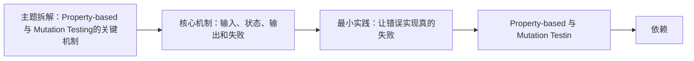

# AI Test Engineering（05） - Property-based 与 Mutation Testing

> 读完后，你应能完成以下任务：
> - 绘制“AI Test Engineering（05） - Property-based 与 Mutation Testing / 主题拆解：Property-based 与 Mutation Testing的关键机制”的关键对象与数据流，解释“测试仍通过说明断言没有约束该行为。”，并用源码位置、日志或 Trace 标注证据。
> - 为“AI Test Engineering（05） - Property-based 与 Mutation Testing / 核心机制：输入、状态、输出和失败”设计正常与异常输入，验证“Property-based 与 Mutation Testing判断 1：变更前先固定基线和非目标范围，变更后用 Diff 检查是否出现无关格式化、生成文件或依赖漂移。”，输出首个偏差位置与回归测试结果。
> - 实现“AI Test Engineering（05） - Property-based 与 Mutation Testing / 最小实践：让错误实现真的失败”的最小代码或配置，检验“把 raise ValueError 临时删掉后，第二个测试必须失败；”，输出命令、结果与 Diff，并说明不适用边界。

<!-- article-progressive-block:start -->
# 一、先建立全局：Property-based 与 Mutation Testing 是什么？

理解“Property-based 与 Mutation Testing”，先要把标题中的对象放进同一条处理链：它接收什么输入，经过哪些状态变化，最终用什么证据判断结果。下表不另造概念，只把作者正文已经解释的章节按依赖顺序连起来。

“Property-based 与 Mutation Testing”的第一个核心判断是：测试仍通过说明断言没有约束该行为。。先弄清这个判断中的对象和输入输出，后面的实现、故障和验收才有共同语境。

| 顺序 | 章节 | 读完本节应抓住的结论 |
| --- | --- | --- |
| 1 | 主题拆解：Property-based 与 Mutation Testing的关键机制 | 测试仍通过说明断言没有约束该行为。 |
| 2 | 核心机制：输入、状态、输出和失败 | Property-based 与 Mutation Testing判断 1：变更前先固定基线和非目标范围，变更后用 Diff 检查是否出现无关格式化、生成文件或依赖漂移。 |
| 3 | 最小实践：让错误实现真的失败 | 把 raise ValueError 临时删掉后，第二个测试必须失败； |
| 4 | Property-based 与 Mutation Testin | Property-based 与 Mutation Testing：Mutation 工具对条件、返回值等做小变异； |
| 5 | 依赖 | 依赖：Python 3.10+， |
| 6 | 执行 python -m pip install "pytest | 执行 python -m pip install "pytest>=8, |

## 1.1 核心对象之间怎样衔接



这张图只表达本文的讲解顺序，不替代正文机制。判断“Property-based 与 Mutation Testing”是否真正掌握，需要能从最后一个结果沿图回到前面每个章节的输入、状态变化和证据。

## 1.2 再看失败：问题最早会出现在哪一步？

在“Property-based 与 Mutation Testing”的对象和顺序已经明确后，再看可观察的失败：条件缺失、结果不可复现或失败后责任不清。定位时不从最后一条错误猜原因，而是沿上图找第一个偏离正文结论的节点。
<!-- article-progressive-block:end -->

# 二、主题拆解：Property-based 与 Mutation Testing的关键机制

- **Property-based 与 Mutation Testing**：Mutation 工具对条件、返回值等做小变异；测试仍通过说明断言没有约束该行为。
- **Property-based 与 Mutation Testing**：优先分析存活变异，不追求无条件 100% 分数。
- **Property-based 与 Mutation Testing**：测试从需求和风险生成预期，而不是从当前实现反推，因此能避免同源偏差。
- **Property-based 与 Mutation Testing**：单元、契约、集成和 E2E 分别覆盖不同边界，失败时应能定位到最小层。
- **Property-based 与 Mutation Testing**：Mutation Testing 检查断言强度，Property-based Testing 扩展输入空间，覆盖率只作辅助指标。

# 三、核心机制：输入、状态、输出和失败


- **Property-based 与 Mutation Testing判断 1**：变更前先固定基线和非目标范围，变更后用 Diff 检查是否出现无关格式化、生成文件或依赖漂移。
- **Property-based 与 Mutation Testing判断 2**：机械修改适合 AST 或 Codemod，语义修改必须结合类型检查、测试和人工审查。
- **Property-based 与 Mutation Testing判断 3**：每个提交都应可独立解释和回退；兼容性迁移要先扩展、再切流、最后清理旧路径。

# 四、最小实践：让错误实现真的失败

依赖：Python 3.10+，
执行 `python -m pip install "pytest>=8,
<9"`，
再运行 `pytest -q`。

```python
import pytest


def normalize_limit(value: int) -> int:
    """把分页大小限制在 1 到 100；value 是外部传入的候选值。"""
    if value < 1:
        raise ValueError("limit must be positive")
    return min(value, 100)


@pytest.mark.parametrize(("value", "expected"), [(1, 1), (100, 100), (101, 100)])
def test_normalize_limit(value: int, expected: int) -> None:
    """覆盖合法边界和上限截断；value 是输入，expected 是业务期望。"""
    assert normalize_limit(value) == expected


def test_normalize_limit_rejects_zero() -> None:
    """验证非法零值不会被静默修正。"""
    with pytest.raises(ValueError):
        normalize_limit(0)
```

把 `raise ValueError` 临时删掉后，第二个测试必须失败；
这一步证明测试不是只陪正确实现通过。

<!-- article-progressive-block:start -->
# 五、动手验证：先跑通 Property-based 与 Mutation Testing，再改变一个变量

前面的章节已经建立问题、概念和机制。现在把“Property-based 与 Mutation Testing”放进同一套基线中运行；本节不再引入新术语，只验证前文结论能否被复现。

## 5.1 基线与候选只允许一个变量不同

验证“Property-based 与 Mutation Testing”时，先固定样本、基线、候选、成功标准和失败边界。候选方案只能改变本次要验证的变量；如果同时更换数据、依赖和配置，即使结果改善，也不能知道是哪一项产生作用。

执行“Property-based 与 Mutation Testing”时，动作是：同环境运行基线与候选，记录输入、中间状态和异常。原始结果不能只保留截图或汇总分数，必须同步保存：可重放命令、结构化日志、输出 Diff、失败样本、版本，使下一次复查可以在同一输入上重放。

| 实验要素 | 本文要求 |
| --- | --- |
| 固定条件 | 固定样本、基线、候选、成功标准和失败边界 |
| 唯一变量 | 本次候选方案与基线之间的一项明确差异 |
| 原始证据 | 可重放命令、结构化日志、输出 Diff、失败样本、版本 |
| 通过阈值 | 结果符合结论条件，异常输入可解释、可恢复 |
| 立即停止 | 条件缺失、结果不可复现或失败后责任不清 |

## 5.2 执行前先排除不可比较条件

“Property-based 与 Mutation Testing”开始前先确认下面四项；任一项不成立，都应先修复实验条件，而不是解释结果。

- 基线能够在“Property-based 与 Mutation Testing”的当前环境重复运行。
- 候选只改变一个与“Property-based 与 Mutation Testing”结论直接相关的条件。
- “Property-based 与 Mutation Testing”的基线和候选使用同一批输入、同一版本依赖与同一通过阈值。
- “Property-based 与 Mutation Testing”的原始输出和失败现场不会被重试、格式化或汇总覆盖。

## 5.3 执行后先核对证据完整性

结果出来后先检查证据，再讨论“Property-based 与 Mutation Testing”是否通过。缺少中间状态时，最终输出只能说明现象，不能证明机制。

| 检查项 | 当前文章的判定 |
| --- | --- |
| 输入可追溯 | 固定样本、基线、候选、成功标准和失败边界 |
| 过程可回放 | 同环境运行基线与候选，记录输入、中间状态和异常 |
| 结果可审计 | 可重放命令、结构化日志、输出 Diff、失败样本、版本 |

“Property-based 与 Mutation Testing”的一次合格基线对照按以下顺序执行：

1. 保存“Property-based 与 Mutation Testing”基线版本及输入摘要，确认基线本身可以重复运行。
2. 写下“Property-based 与 Mutation Testing”候选方案唯一变化的变量，以及它预期影响的指标。
3. 在同一环境执行“Property-based 与 Mutation Testing”：同环境运行基线与候选，记录输入、中间状态和异常。
4. 为“Property-based 与 Mutation Testing”保存：可重放命令、结构化日志、输出 Diff、失败样本、版本。
5. 使用“Property-based 与 Mutation Testing”预登记条件判断：结果符合结论条件，异常输入可解释、可恢复。
6. 如果“Property-based 与 Mutation Testing”未通过，不修改第二个变量，先恢复基线并保留失败现场。

# 六、用一张矩阵验证 Property-based 与 Mutation Testing 的关键结论

矩阵按正文顺序列出“Property-based 与 Mutation Testing”的结论。一次实验只选择一行，只改变这一行对应的条件；不要把多行合并成一个无法归因的大实验。

| 正文章节 | 已解释的结论 | 本轮唯一变量 | 必须保存的证据 |
| --- | --- | --- | --- |
| 主题拆解：Property-based 与 Mutation Testing的关键机制 | 测试仍通过说明断言没有约束该行为。 | 只改变与“主题拆解：Property-based 与 Mutation Testing的关键机制”相关的条件 | 可重放命令、结构化日志、输出 Diff、失败样本、版本 |
| 核心机制：输入、状态、输出和失败 | Property-based 与 Mutation Testing判断 1：变更前先固定基线和非目标范围，变更后用 Diff 检查是否出现无关格式化、生成文件或依赖漂移。 | 只改变与“核心机制：输入、状态、输出和失败”相关的条件 | 可重放命令、结构化日志、输出 Diff、失败样本、版本 |
| 最小实践：让错误实现真的失败 | 把 raise ValueError 临时删掉后，第二个测试必须失败； | 只改变与“最小实践：让错误实现真的失败”相关的条件 | 可重放命令、结构化日志、输出 Diff、失败样本、版本 |
| Property-based 与 Mutation Testin | Property-based 与 Mutation Testing：Mutation 工具对条件、返回值等做小变异； | 只改变与“Property-based 与 Mutation Testin”相关的条件 | 可重放命令、结构化日志、输出 Diff、失败样本、版本 |
| 依赖 | 依赖：Python 3.10+， | 只改变与“依赖”相关的条件 | 可重放命令、结构化日志、输出 Diff、失败样本、版本 |
| 执行 python -m pip install "pytest | 执行 python -m pip install "pytest>=8, | 只改变与“执行 python -m pip install "pytest”相关的条件 | 可重放命令、结构化日志、输出 Diff、失败样本、版本 |

## 6.1 记录本次实际实验

下面的记录用于“Property-based 与 Mutation Testing”当前这一次实验，不是第二套知识目录。先从矩阵选择一个章节，再填写实际值；没有填写的字段表示尚未验证。

```yaml
topic: "Property-based 与 Mutation Testing"
selected_chapter: required
claim_from_article: required
baseline_version: required
changed_condition: exactly_one
execution: "同环境运行基线与候选，记录输入、中间状态和异常"
evidence: "可重放命令、结构化日志、输出 Diff、失败样本、版本"
pass_when: "结果符合结论条件，异常输入可解释、可恢复"
stop_when: "条件缺失、结果不可复现或失败后责任不清"
observed_result: required
first_deviation: null_or_evidence
recovery_replay: required_after_failure
```

## 6.2 边界实验必须证明能够停止和恢复

成功路径只能证明“Property-based 与 Mutation Testing”在当前样本上工作，不能证明它可以进入生产。边界实验需要主动制造：条件缺失、结果不可复现或失败后责任不清，并观察系统是否在产生不可逆副作用前停止。

| 场景 | 只改变什么 | 应保存什么 | 通过标准 |
| --- | --- | --- | --- |
| 正常路径 | 使用已知有效输入 | 可重放命令、结构化日志、输出 Diff、失败样本、版本 | 结果符合结论条件，异常输入可解释、可恢复 |
| 边界路径 | 把一个输入推进到约束临界值 | 临界值前后的输出与指标 | 不静默降级，不把部分结果冒充成功 |
| 明确失败 | 注入：条件缺失、结果不可复现或失败后责任不清 | 原始错误、首个异常阶段和最终状态 | 失败被正确分类且没有扩大副作用 |
| 恢复重放 | 执行：保留基线，缩小变量；根因确认前不扩大范围 | 原失败样本的复测证据 | 原样本恢复，正常样本没有回归 |

恢复动作不是简单重启。对于“Property-based 与 Mutation Testing”，第一步是：保留基线，缩小变量；根因确认前不扩大范围。完成后使用原始失败样本复测；只验证一个新样本成功，不能证明触发条件已经消失。

“Property-based 与 Mutation Testing”边界实验结束后，应把正常、临界、失败和恢复四类记录放在同一个运行批次中。这样才能区分“候选方案真的修复问题”和“环境变化让问题暂时没有出现”。

# 七、Property-based 与 Mutation Testing 的结果解释

解释“Property-based 与 Mutation Testing”实验时先看首个偏差，而不是最后一条错误。最后的异常通常只是上游状态错误的结果；从末端反推容易误把症状当根因。

| 观察结果 | 可以支持的判断 | 下一步 |
| --- | --- | --- |
| 主链路没有达到预期 | 条件缺失、结果不可复现或失败后责任不清 | 先执行：保留基线，缩小变量；根因确认前不扩大范围 |
| 异常链路无法恢复 | 条件缺失、结果不可复现或失败后责任不清 | 先执行：保留基线，缩小变量；根因确认前不扩大范围 |
| 新样本成功但原样本仍失败 | 修复没有覆盖原始触发条件 | 固定原失败输入，恢复基线后重新比较 |
| 指标改善但证据无法回链 | 数据、版本或中间状态没有固定 | 暂停发布，补齐可追溯记录后重跑 |

“Property-based 与 Mutation Testing”只有同时满足“结果符合结论条件，异常输入可解释、可恢复”，并且没有出现“条件缺失、结果不可复现或失败后责任不清”，才可以认为主链路通过。这里的“通过”只对当前固定版本、样本和环境有效，不能外推到尚未测试的容量、权限或数据分布。

如果“Property-based 与 Mutation Testing”候选方案与基线差异很小，先检查证据分辨率是否足够；如果差异很大，先排除数据泄漏、环境漂移和版本不一致。两种情况都不能只看一个汇总均值，需要回到逐样本输出和中间状态。

“Property-based 与 Mutation Testing”故障定位完成后，记录“现象、首个偏差、根因、改动、原样本复测”五项。缺少原样本复测时，只能标记为待观察，不能标记为已解决。

# 八、Property-based 与 Mutation Testing 的发布判断

发布判断需要把“Property-based 与 Mutation Testing”的质量、失败边界和恢复能力放在同一份记录中。以下任一条件缺失，都应停止扩量，而不是用“基本正常”替代证据。

- [ ] “Property-based 与 Mutation Testing”的基线与候选只存在一个计划内变量。
- [ ] “Property-based 与 Mutation Testing”的输入、代码、依赖、配置和数据版本可以追溯。
- [ ] “Property-based 与 Mutation Testing”的正常、临界、失败和恢复样本使用同一套断言。
- [ ] “Property-based 与 Mutation Testing”的原始输出、中间状态和失败现场已经保留。
- [ ] “Property-based 与 Mutation Testing”的日志、Trace、截图和测试数据已经脱敏。
- [ ] “Property-based 与 Mutation Testing”的停止条件、负责人和回滚入口已经演练。
- [ ] “Property-based 与 Mutation Testing”尚未覆盖的输入、权限、容量和外部依赖已经登记。

最终记录至少包含基线版本、唯一变量、原始证据、首个偏差、恢复复测和发布责任人。没有参与本次修改的人如果不能据此重放“Property-based 与 Mutation Testing”的判断，就不能发布。
<!-- article-progressive-block:end -->

# 九、总结

- **主题拆解：Property-based 与 Mutation Testing的关键机制**：测试仍通过说明断言没有约束该行为。
- **核心机制：输入、状态、输出和失败**：Property-based 与 Mutation Testing判断 1：变更前先固定基线和非目标范围，变更后用 Diff 检查是否出现无关格式化、生成文件或依赖漂移。

- **工程边界**：Property-based 与 Mutation Testing：测试从需求和风险生成预期，而不是从当前实现反推，因此能避免同源偏差。
- **验证方式**：Property-based 与 Mutation Testing：Mutation Testing 检查断言强度，Property-based Testing 扩展输入空间，覆盖率只作辅助指标。
- **实现机制**：这一步证明测试不是只陪正确实现通过。

## 参考资料

- [pytest 文档](https://docs.pytest.org/en/stable/)
- [Hypothesis 文档](https://hypothesis.readthedocs.io/en/latest/)
