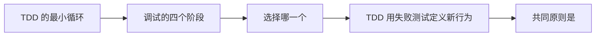

# 工程化工作流（04） - TDD 与系统化调试

> 读完后，你应能完成以下任务：
> - 绘制“工程化工作流（04） - TDD 与系统化调试 / TDD 的最小循环”的关键对象与数据流，解释“写一个只描述当前行为的测试。 -> 运行它，确认因预期原因失败。 -> 写让测试通过的最小实现。 -> 再次运行测试，确认通过。”，并用源码位置、日志或 Trace 标注证据。
> - 为“工程化工作流（04） - TDD 与系统化调试 / 调试的四个阶段”设计正常与异常输入，验证“强调先调查根因：稳定复现、读取错误与调用链、比较正常和异常路径、提出一个可证伪假设，然后只改能验证该假设的最小代码。”，输出首个偏差位置与回归测试结果。
> - 实现“工程化工作流（04） - TDD 与系统化调试 / 选择哪一个”的最小代码或配置，检验“新功能或明确新规则：先 TDD。”，输出命令、结果与 Diff，并说明不适用边界。

TDD 用失败测试定义新行为，系统化调试用可复现证据定位已有故障。共同原则是：**没有看到问题，就不要声称修复；没有看到测试先失败，就不知道测试是否真的覆盖需求。**

<!-- article-progressive-block:start -->
# 一、先建立全局：TDD 与系统化调试 是什么？

理解“TDD 与系统化调试”，先要把标题中的对象放进同一条处理链：它接收什么输入，经过哪些状态变化，最终用什么证据判断结果。下表不另造概念，只把作者正文已经解释的章节按依赖顺序连起来。

“TDD 与系统化调试”的第一个核心判断是：写一个只描述当前行为的测试。 -> 运行它，确认因预期原因失败。 -> 写让测试通过的最小实现。 -> 再次运行测试，确认通过。。先弄清这个判断中的对象和输入输出，后面的实现、故障和验收才有共同语境。

| 顺序 | 章节 | 读完本节应抓住的结论 |
| --- | --- | --- |
| 1 | TDD 的最小循环 | 写一个只描述当前行为的测试。 -> 运行它，确认因预期原因失败。 -> 写让测试通过的最小实现。 -> 再次运行测试，确认通过。 |
| 2 | 调试的四个阶段 | 强调先调查根因：稳定复现、读取错误与调用链、比较正常和异常路径、提出一个可证伪假设，然后只改能验证该假设的最小代码。 |
| 3 | 选择哪一个 | 新功能或明确新规则：先 TDD。 |
| 4 | TDD 用失败测试定义新行为 | TDD 用失败测试定义新行为，系统化调试用可复现证据定位已有故障。 |
| 5 | 共同原则是 | 共同原则是：没有看到问题，就不要声称修复； |
| 6 | 没有看到测试先失败 | 没有看到测试先失败，就不知道测试是否真的覆盖需求。 |

## 1.1 核心对象之间怎样衔接



这张图只表达本文的讲解顺序，不替代正文机制。判断“TDD 与系统化调试”是否真正掌握，需要能从最后一个结果沿图回到前面每个章节的输入、状态变化和证据。

## 1.2 再看失败：问题最早会出现在哪一步？

在“TDD 与系统化调试”的对象和顺序已经明确后，再看可观察的失败：文本直通执行、状态不可重放或重试重复写入。定位时不从最后一条错误猜原因，而是沿上图找第一个偏离正文结论的节点。
<!-- article-progressive-block:end -->

# 二、TDD 的最小循环

1. 写一个只描述当前行为的测试。
2. 运行它，确认因预期原因失败。
3. 写让测试通过的最小实现。
4. 再次运行测试，确认通过。
5. 保持测试通过的前提下整理代码。

```text
需求：空标题应返回“未命名文章”。
RED：新增空字符串用例，确认当前返回空字符串而失败。
GREEN：只增加空值回退，不重构其他标题逻辑。
VERIFY：运行目标测试，再运行受影响模块测试。
```

# 三、调试的四个阶段

`systematic-debugging`
强调先调查根因：稳定复现、读取错误与调用链、比较正常和异常路径、提出一个可证伪假设，然后只改能验证该假设的最小代码。

常见反模式是连续尝试多个 CSS、超时或空判断，直到现象暂时消失。这样既不知道哪个修改有效，也无法解释为什么不会复发。

# 四、选择哪一个

- 新功能或明确新规则：先 TDD。
- 历史故障、偶发异常、性能退化：先系统化调试。
- 修复根因后：用回归测试固定故障场景。

# 五、官方资料

- [test-driven-development](https://github.com/obra/superpowers/tree/main/skills/test-driven-development)
- [systematic-debugging](https://github.com/obra/superpowers/tree/main/skills/systematic-debugging)


## 5.1 可运行实验：TDD 与系统化调试闭环


```html runnable file=index.html title="TDD 与系统化调试闭环" description="调整参数并对比正常路径与典型失败路径"
<!doctype html>
<html lang="zh-CN">
<head>
  <meta charset="utf-8">
  <meta name="viewport" content="width=device-width,initial-scale=1">
  <title>AC-08 在线实验</title>
  <style>
    :root{color-scheme:dark;font-family:Inter,system-ui,sans-serif}*{box-sizing:border-box}body{margin:0;background:#0f1211;color:#e7ece9;font-size:13px}.shell{padding:16px}.top{display:flex;justify-content:space-between;gap:16px;margin-bottom:14px}h1{margin:3px 0;font-size:18px}.id,.value{color:#68e0b5;font-family:ui-monospace,monospace}.summary{margin:4px 0;color:#a5afa9}.run{border:0;border-radius:6px;background:#68e0b5;color:#07110d;padding:8px 14px;font-weight:700}.grid{display:grid;grid-template-columns:minmax(220px,.8fr) minmax(0,1.8fr);gap:12px}.panel{border:1px solid #29322e;background:#141817;padding:12px}.control{display:grid;gap:5px;margin-bottom:11px}.head{display:flex;justify-content:space-between;gap:8px}select,input{width:100%;accent-color:#68e0b5;background:#0d100f;color:#e7ece9}.toggle{display:flex;justify-content:space-between;border-top:1px solid #29322e;padding-top:9px}.toggle input{width:18px}.metrics{display:grid;grid-template-columns:repeat(4,minmax(0,1fr));gap:7px}.metric{border:1px solid #29322e;padding:8px}.metric b{display:block;color:#68e0b5;font-size:16px}.stages{display:flex;gap:6px;overflow:auto;margin:10px 0}.stage{border:1px solid #8a6230;padding:7px;min-width:90px}.stage.ok{border-color:#367a61}.stage.fail{border-color:#8b4545}table{width:100%;border-collapse:collapse}td{border-top:1px solid #29322e;padding:7px}.diagnosis{margin-top:9px;border-left:3px solid #68e0b5;background:#101412;padding:9px;line-height:1.5}.danger{border-color:#ef7f7f}@media(max-width:680px){.top,.grid{display:grid;grid-template-columns:1fr}.metrics{grid-template-columns:repeat(2,1fr)}}
  </style>
</head>
<body>
  <main class="shell">
    <header class="top"><div><div class="id">AC-08 · DETERMINISTIC LAB</div><h1 id="title"></h1><p class="summary" id="summary"></p></div><button class="run" id="run">运行实验</button></header>
    <section class="grid"><div class="panel"><div id="controls"></div><label class="toggle"><span>注入典型故障</span><input id="failure" type="checkbox"></label></div><div class="panel"><div class="metrics" id="metrics"></div><div class="stages" id="stages"></div><table><tbody id="rows"></tbody></table><div class="diagnosis" id="diagnosis"></div></div></section>
  </main>
  <script>
    const scenario = { title: 'TDD 与系统化调试闭环', summary: '比较复现、假设验证和最小修复与直接修改表象的结果。', controls: [
        { key: 'reproduce', label: '先稳定复现', type: 'select', value: 'yes', options: [['yes', '是'], ['no', '否']] },
        { key: 'hypotheses', label: '待验证假设', type: 'range', min: 1, max: 5, value: 3, suffix: ' 个' },
        { key: 'regression', label: '回归范围', type: 'select', value: 'focused', options: [['none', '无回归'], ['focused', '定向 + 边界'], ['all', '全量测试']] }
      ] };
    const controls = document.querySelector('#controls');
    const failure = document.querySelector('#failure');
    document.querySelector('#title').textContent = scenario.title;
    document.querySelector('#summary').textContent = scenario.summary;
    function renderControl(control) {
      const label = document.createElement('label'); label.className = 'control';
      const head = document.createElement('span'); head.className = 'head'; head.innerHTML = '<span>' + control.label + '</span><span class="value" data-value="' + control.key + '"></span>'; label.appendChild(head);
      const input = document.createElement(control.type === 'select' ? 'select' : 'input'); input.dataset.key = control.key;
      if (control.type === 'select') control.options.forEach(option => { const item = document.createElement('option'); item.value = option[0]; item.textContent = option[1]; item.selected = option[0] === control.value; input.appendChild(item); });
      else { input.type = 'range'; input.min = control.min; input.max = control.max; input.step = control.step || 1; input.value = control.value; }
      input.addEventListener('input', updateValues); label.appendChild(input); return label;
    }
    function updateValues() { scenario.controls.forEach(control => { const input = controls.querySelector('[data-key="' + control.key + '"]'); document.querySelector('[data-value="' + control.key + '"]').textContent = control.type === 'select' ? input.options[input.selectedIndex].text : input.value + (control.suffix || ''); }); }
    function readValues() { const values = {}; scenario.controls.forEach(control => { const input = controls.querySelector('[data-key="' + control.key + '"]'); values[control.key] = control.type === 'range' ? Number(input.value) : input.value; }); values.failure = failure.checked; return values; }
    function stage(name, state, detail) { return { name, state, detail }; }
    const aiStage = stage;
    function clamp(value, minimum, maximum) { return Math.min(maximum, Math.max(minimum, value)); }
    function simulate(values) { const fail = values.failure;
          /** 是否有稳定失败用例作为修复基线。 */
          const hasBaseline = values.reproduce === 'yes' && !fail;
          /** 当前回归策略覆盖的用例数量。 */
          const tests = values.regression === 'none' ? 0 : values.regression === 'focused' ? 4 : 48;
          /** 是否形成可证伪的完整调试闭环。 */
          const solved = hasBaseline && values.hypotheses >= 2 && tests >= 4;
          return { metrics: [[solved ? 'ROOT CAUSE' : 'SYMPTOM', '修复层级'], [values.hypotheses, '验证假设'], [tests, '回归用例'], [solved ? 'PASS' : 'RISK', '结论']], stages: [stage('复现', hasBaseline ? 'ok' : 'fail', values.reproduce), stage('收集证据', fail ? 'fail' : 'ok', 'stack + input'), stage('验证假设', values.hypotheses >= 2 ? 'ok' : 'warn', values.hypotheses), stage('最小修复', solved ? 'ok' : 'warn', solved ? 'branch only' : 'unproven'), stage('回归', tests >= 4 ? 'ok' : 'fail', tests)], rows: [['失败基线', hasBaseline ? '固定输入可稳定复现' : '没有稳定复现，无法证明修复有效'], ['根因证据', values.hypotheses >= 2 ? '对照实验排除至少一个替代解释' : '只验证单一猜测'], ['范围控制', values.regression === 'all' ? '全量测试成本高，仍需保留定向用例' : values.regression === 'focused' ? '定向和边界用例匹配改动范围' : '没有回归证据']], diagnosis: solved ? '修复建立在可复现失败与对照证据上，并由定向回归闭环。' : '当前只能说明现象变化，不能证明根因已修复。', danger: !solved };
         }
    function render() { const result = simulate(readValues()); document.querySelector('#metrics').innerHTML = result.metrics.map(item => '<div class="metric"><b>' + item[0] + '</b><span>' + item[1] + '</span></div>').join(''); document.querySelector('#stages').innerHTML = result.stages.map(item => '<div class="stage ' + item.state + '"><b>' + item.name + '</b><div>' + item.detail + '</div></div>').join(''); document.querySelector('#rows').innerHTML = result.rows.map(item => '<tr><td>' + item[0] + '</td><td>' + item[1] + '</td></tr>').join(''); const diagnosis = document.querySelector('#diagnosis'); diagnosis.textContent = result.diagnosis; diagnosis.className = 'diagnosis' + (result.danger ? ' danger' : ''); }
    scenario.controls.forEach(control => controls.appendChild(renderControl(control))); updateValues(); document.querySelector('#run').addEventListener('click', render); render();
  </script>
</body>
</html>
```

<!-- article-progressive-block:start -->
# 六、动手验证：先跑通 TDD 与系统化调试，再改变一个变量

前面的章节已经建立问题、概念和机制。现在把“TDD 与系统化调试”放进同一套基线中运行；本节不再引入新术语，只验证前文结论能否被复现。

## 6.1 基线与候选只允许一个变量不同

验证“TDD 与系统化调试”时，先固定工具 Schema、身份、畸形参数、超时和重复请求。候选方案只能改变本次要验证的变量；如果同时更换数据、依赖和配置，即使结果改善，也不能知道是哪一项产生作用。

执行“TDD 与系统化调试”时，动作是：回放决策到执行链路，覆盖失败、重试、暂停和恢复。原始结果不能只保留截图或汇总分数，必须同步保存：模型提议、校验、授权、幂等键、状态迁移、Trace，使下一次复查可以在同一输入上重放。

| 实验要素 | 本文要求 |
| --- | --- |
| 固定条件 | 工具 Schema、身份、畸形参数、超时和重复请求 |
| 唯一变量 | 本次候选方案与基线之间的一项明确差异 |
| 原始证据 | 模型提议、校验、授权、幂等键、状态迁移、Trace |
| 通过阈值 | 模型只提议；执行受代码约束；失败不重复副作用 |
| 立即停止 | 文本直通执行、状态不可重放或重试重复写入 |

## 6.2 执行前先排除不可比较条件

“TDD 与系统化调试”开始前先确认下面四项；任一项不成立，都应先修复实验条件，而不是解释结果。

- 基线能够在“TDD 与系统化调试”的当前环境重复运行。
- 候选只改变一个与“TDD 与系统化调试”结论直接相关的条件。
- “TDD 与系统化调试”的基线和候选使用同一批输入、同一版本依赖与同一通过阈值。
- “TDD 与系统化调试”的原始输出和失败现场不会被重试、格式化或汇总覆盖。

## 6.3 执行后先核对证据完整性

结果出来后先检查证据，再讨论“TDD 与系统化调试”是否通过。缺少中间状态时，最终输出只能说明现象，不能证明机制。

| 检查项 | 当前文章的判定 |
| --- | --- |
| 输入可追溯 | 工具 Schema、身份、畸形参数、超时和重复请求 |
| 过程可回放 | 回放决策到执行链路，覆盖失败、重试、暂停和恢复 |
| 结果可审计 | 模型提议、校验、授权、幂等键、状态迁移、Trace |

“TDD 与系统化调试”的一次合格基线对照按以下顺序执行：

1. 保存“TDD 与系统化调试”基线版本及输入摘要，确认基线本身可以重复运行。
2. 写下“TDD 与系统化调试”候选方案唯一变化的变量，以及它预期影响的指标。
3. 在同一环境执行“TDD 与系统化调试”：回放决策到执行链路，覆盖失败、重试、暂停和恢复。
4. 为“TDD 与系统化调试”保存：模型提议、校验、授权、幂等键、状态迁移、Trace。
5. 使用“TDD 与系统化调试”预登记条件判断：模型只提议；执行受代码约束；失败不重复副作用。
6. 如果“TDD 与系统化调试”未通过，不修改第二个变量，先恢复基线并保留失败现场。

# 七、用一张矩阵验证 TDD 与系统化调试 的关键结论

矩阵按正文顺序列出“TDD 与系统化调试”的结论。一次实验只选择一行，只改变这一行对应的条件；不要把多行合并成一个无法归因的大实验。

| 正文章节 | 已解释的结论 | 本轮唯一变量 | 必须保存的证据 |
| --- | --- | --- | --- |
| TDD 的最小循环 | 写一个只描述当前行为的测试。 -> 运行它，确认因预期原因失败。 -> 写让测试通过的最小实现。 -> 再次运行测试，确认通过。 | 只改变与“TDD 的最小循环”相关的条件 | 模型提议、校验、授权、幂等键、状态迁移、Trace |
| 调试的四个阶段 | 强调先调查根因：稳定复现、读取错误与调用链、比较正常和异常路径、提出一个可证伪假设，然后只改能验证该假设的最小代码。 | 只改变与“调试的四个阶段”相关的条件 | 模型提议、校验、授权、幂等键、状态迁移、Trace |
| 选择哪一个 | 新功能或明确新规则：先 TDD。 | 只改变与“选择哪一个”相关的条件 | 模型提议、校验、授权、幂等键、状态迁移、Trace |
| TDD 用失败测试定义新行为 | TDD 用失败测试定义新行为，系统化调试用可复现证据定位已有故障。 | 只改变与“TDD 用失败测试定义新行为”相关的条件 | 模型提议、校验、授权、幂等键、状态迁移、Trace |
| 共同原则是 | 共同原则是：没有看到问题，就不要声称修复； | 只改变与“共同原则是”相关的条件 | 模型提议、校验、授权、幂等键、状态迁移、Trace |
| 没有看到测试先失败 | 没有看到测试先失败，就不知道测试是否真的覆盖需求。 | 只改变与“没有看到测试先失败”相关的条件 | 模型提议、校验、授权、幂等键、状态迁移、Trace |

## 7.1 记录本次实际实验

下面的记录用于“TDD 与系统化调试”当前这一次实验，不是第二套知识目录。先从矩阵选择一个章节，再填写实际值；没有填写的字段表示尚未验证。

```yaml
topic: "TDD 与系统化调试"
selected_chapter: required
claim_from_article: required
baseline_version: required
changed_condition: exactly_one
execution: "回放决策到执行链路，覆盖失败、重试、暂停和恢复"
evidence: "模型提议、校验、授权、幂等键、状态迁移、Trace"
pass_when: "模型只提议；执行受代码约束；失败不重复副作用"
stop_when: "文本直通执行、状态不可重放或重试重复写入"
observed_result: required
first_deviation: null_or_evidence
recovery_replay: required_after_failure
```

## 7.2 边界实验必须证明能够停止和恢复

成功路径只能证明“TDD 与系统化调试”在当前样本上工作，不能证明它可以进入生产。边界实验需要主动制造：文本直通执行、状态不可重放或重试重复写入，并观察系统是否在产生不可逆副作用前停止。

| 场景 | 只改变什么 | 应保存什么 | 通过标准 |
| --- | --- | --- | --- |
| 正常路径 | 使用已知有效输入 | 模型提议、校验、授权、幂等键、状态迁移、Trace | 模型只提议；执行受代码约束；失败不重复副作用 |
| 边界路径 | 把一个输入推进到约束临界值 | 临界值前后的输出与指标 | 不静默降级，不把部分结果冒充成功 |
| 明确失败 | 注入：文本直通执行、状态不可重放或重试重复写入 | 原始错误、首个异常阶段和最终状态 | 失败被正确分类且没有扩大副作用 |
| 恢复重放 | 执行：关闭副作用入口，恢复检查点，补充失败契约测试 | 原失败样本的复测证据 | 原样本恢复，正常样本没有回归 |

恢复动作不是简单重启。对于“TDD 与系统化调试”，第一步是：关闭副作用入口，恢复检查点，补充失败契约测试。完成后使用原始失败样本复测；只验证一个新样本成功，不能证明触发条件已经消失。

“TDD 与系统化调试”边界实验结束后，应把正常、临界、失败和恢复四类记录放在同一个运行批次中。这样才能区分“候选方案真的修复问题”和“环境变化让问题暂时没有出现”。

# 八、TDD 与系统化调试 的结果解释

解释“TDD 与系统化调试”实验时先看首个偏差，而不是最后一条错误。最后的异常通常只是上游状态错误的结果；从末端反推容易误把症状当根因。

| 观察结果 | 可以支持的判断 | 下一步 |
| --- | --- | --- |
| 主链路没有达到预期 | 文本直通执行、状态不可重放或重试重复写入 | 先执行：关闭副作用入口，恢复检查点，补充失败契约测试 |
| 异常链路无法恢复 | 文本直通执行、状态不可重放或重试重复写入 | 先执行：关闭副作用入口，恢复检查点，补充失败契约测试 |
| 新样本成功但原样本仍失败 | 修复没有覆盖原始触发条件 | 固定原失败输入，恢复基线后重新比较 |
| 指标改善但证据无法回链 | 数据、版本或中间状态没有固定 | 暂停发布，补齐可追溯记录后重跑 |

“TDD 与系统化调试”只有同时满足“模型只提议；执行受代码约束；失败不重复副作用”，并且没有出现“文本直通执行、状态不可重放或重试重复写入”，才可以认为主链路通过。这里的“通过”只对当前固定版本、样本和环境有效，不能外推到尚未测试的容量、权限或数据分布。

如果“TDD 与系统化调试”候选方案与基线差异很小，先检查证据分辨率是否足够；如果差异很大，先排除数据泄漏、环境漂移和版本不一致。两种情况都不能只看一个汇总均值，需要回到逐样本输出和中间状态。

“TDD 与系统化调试”故障定位完成后，记录“现象、首个偏差、根因、改动、原样本复测”五项。缺少原样本复测时，只能标记为待观察，不能标记为已解决。

# 九、TDD 与系统化调试 的发布判断

发布判断需要把“TDD 与系统化调试”的质量、失败边界和恢复能力放在同一份记录中。以下任一条件缺失，都应停止扩量，而不是用“基本正常”替代证据。

- [ ] “TDD 与系统化调试”的基线与候选只存在一个计划内变量。
- [ ] “TDD 与系统化调试”的输入、代码、依赖、配置和数据版本可以追溯。
- [ ] “TDD 与系统化调试”的正常、临界、失败和恢复样本使用同一套断言。
- [ ] “TDD 与系统化调试”的原始输出、中间状态和失败现场已经保留。
- [ ] “TDD 与系统化调试”的日志、Trace、截图和测试数据已经脱敏。
- [ ] “TDD 与系统化调试”的停止条件、负责人和回滚入口已经演练。
- [ ] “TDD 与系统化调试”尚未覆盖的输入、权限、容量和外部依赖已经登记。

最终记录至少包含基线版本、唯一变量、原始证据、首个偏差、恢复复测和发布责任人。没有参与本次修改的人如果不能据此重放“TDD 与系统化调试”的判断，就不能发布。
<!-- article-progressive-block:end -->

# 十、总结

- **TDD 的最小循环**：写一个只描述当前行为的测试。 -> 运行它，确认因预期原因失败。 -> 写让测试通过的最小实现。 -> 再次运行测试，确认通过。
- **调试的四个阶段**：强调先调查根因：稳定复现、读取错误与调用链、比较正常和异常路径、提出一个可证伪假设，然后只改能验证该假设的最小代码。
- **可运行实验：TDD 与系统化调试闭环**：调整参数并注入失败，重点对比正常路径、保护条件和失败诊断；
- **工程边界**：共同原则是：没有看到问题，就不要声称修复；
- **验证方式**：TDD 用失败测试定义新行为，系统化调试用可复现证据定位已有故障。
